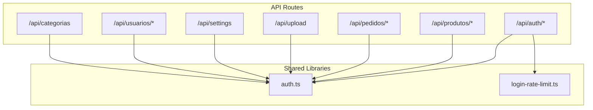
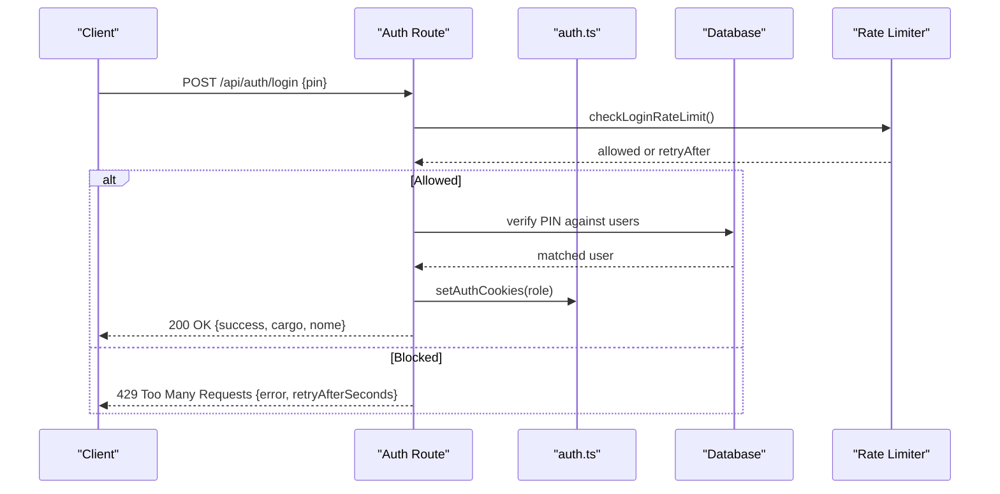
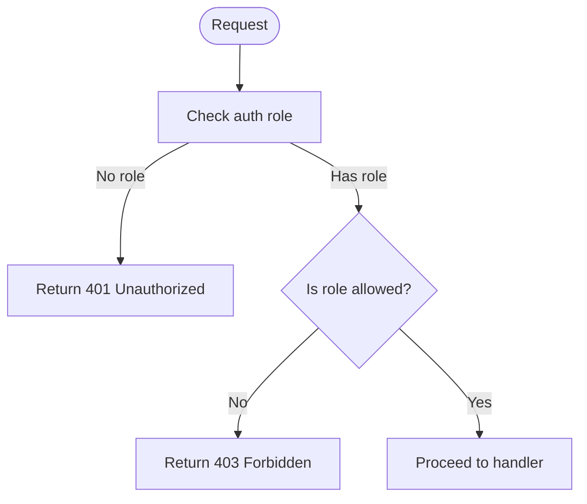

# API Reference

<cite>
**Referenced Files in This Document**
- [route.ts](file://src/app/api/auth/login/route.ts)
- [route.ts](file://src/app/api/auth/google/route.ts)
- [route.ts](file://src/app/api/auth/logout/route.ts)
- [route.ts](file://src/app/api/auth/setup/route.ts)
- [route.ts](file://src/app/api/produtos/route.ts)
- [route.ts](file://src/app/api/produtos/[id]/route.ts)
- [route.ts](file://src/app/api/pedidos/route.ts)
- [route.ts](file://src/app/api/pedidos/cancelar/route.ts)
- [route.ts](file://src/app/api/upload/route.ts)
- [route.ts](file://src/app/api/settings/route.ts)
- [route.ts](file://src/app/api/usuarios/route.ts)
- [route.ts](file://src/app/api/usuarios/[id]/route.ts)
- [route.ts](file://src/app/api/categorias/route.ts)
- [auth.ts](file://src/lib/auth.ts)
- [login-rate-limit.ts](file://src/lib/login-rate-limit.ts)
</cite>

## Table of Contents
1. [Introduction](#introduction)
2. [Project Structure](#project-structure)
3. [Core Components](#core-components)
4. [Architecture Overview](#architecture-overview)
5. [Detailed Component Analysis](#detailed-component-analysis)
6. [Dependency Analysis](#dependency-analysis)
7. [Performance Considerations](#performance-considerations)
8. [Troubleshooting Guide](#troubleshooting-guide)
9. [Conclusion](#conclusion)
10. [Appendices](#appendices)

## Introduction
This document provides comprehensive API reference for the Meu Cardápio system, focusing on RESTful endpoints for authentication, product management, order management, settings, and user administration. It covers HTTP methods, URL patterns, request/response schemas, authentication requirements, error handling, status codes, rate limiting, input validation, security considerations, and client integration guidelines.

## Project Structure
The API is implemented as Next.js App Router route handlers under src/app/api. Each endpoint is a file exporting HTTP method handlers (GET, POST, PUT, PATCH, DELETE). Authentication and authorization are centralized in shared utilities.

**Diagram sources**
- [route.ts:16-79](file://src/app/api/auth/login/route.ts#L16-L79)
- [route.ts:27-71](file://src/app/api/auth/google/route.ts#L27-L71)
- [route.ts:6-14](file://src/app/api/auth/logout/route.ts#L6-L14)
- [route.ts:6-43](file://src/app/api/auth/setup/route.ts#L6-L43)
- [route.ts:6-52](file://src/app/api/produtos/route.ts#L6-L52)
- [route.ts:8-63](file://src/app/api/produtos/[id]/route.ts#L8-L63)
- [route.ts:15-252](file://src/app/api/pedidos/route.ts#L15-L252)
- [route.ts:6-20](file://src/app/api/pedidos/cancelar/route.ts#L6-L20)
- [route.ts:14-57](file://src/app/api/upload/route.ts#L14-L57)
- [route.ts:7-34](file://src/app/api/settings/route.ts#L7-L34)
- [route.ts:7-78](file://src/app/api/usuarios/route.ts#L7-L78)
- [route.ts:7-22](file://src/app/api/usuarios/[id]/route.ts#L7-L22)
- [route.ts:8-27](file://src/app/api/categorias/route.ts#L8-L27)
- [auth.ts:1-82](file://src/lib/auth.ts#L1-L82)
- [login-rate-limit.ts:1-115](file://src/lib/login-rate-limit.ts#L1-L115)

**Section sources**
- [route.ts:16-79](file://src/app/api/auth/login/route.ts#L16-L79)
- [auth.ts:1-82](file://src/lib/auth.ts#L1-L82)
- [login-rate-limit.ts:1-115](file://src/lib/login-rate-limit.ts#L1-L115)

## Core Components
- Authentication and Authorization
  - Role-based access control with roles: admin, cozinha (kitchen), atendente (waiter).
  - Cookie-based session tokens set per role; helpers to require specific roles.
- Rate Limiting
  - Per-IP login attempt limiter with temporary lockout after repeated failures.
- Product Management
  - CRUD operations with admin-only write access; read access varies by role.
- Order Management
  - Create orders with item validation; update statuses; cancel pending orders; delete orders.
- Settings
  - Read/update store configuration (open/closed, prep time).
- Users
  - Admin-only user listing, creation, and deletion.
- Uploads
  - Admin-only image upload to Cloudinary with type and size validation.

**Section sources**
- [auth.ts:1-82](file://src/lib/auth.ts#L1-L82)
- [login-rate-limit.ts:1-115](file://src/lib/login-rate-limit.ts#L1-L115)
- [route.ts:6-52](file://src/app/api/produtos/route.ts#L6-L52)
- [route.ts:8-63](file://src/app/api/produtos/[id]/route.ts#L8-L63)
- [route.ts:15-252](file://src/app/api/pedidos/route.ts#L15-L252)
- [route.ts:6-20](file://src/app/api/pedidos/cancelar/route.ts#L6-L20)
- [route.ts:7-34](file://src/app/api/settings/route.ts#L7-L34)
- [route.ts:7-78](file://src/app/api/usuarios/route.ts#L7-L78)
- [route.ts:7-22](file://src/app/api/usuarios/[id]/route.ts#L7-L22)
- [route.ts:14-57](file://src/app/api/upload/route.ts#L14-L57)

## Architecture Overview
Authentication flow uses cookies to maintain sessions. Login endpoints validate credentials or Google ID tokens, then set role-specific cookies. Protected endpoints enforce roles via middleware-like checks.

**Diagram sources**
- [route.ts:16-79](file://src/app/api/auth/login/route.ts#L16-L79)
- [auth.ts:39-57](file://src/lib/auth.ts#L39-L57)
- [login-rate-limit.ts:45-64](file://src/lib/login-rate-limit.ts#L45-L64)

**Section sources**
- [route.ts:16-79](file://src/app/api/auth/login/route.ts#L16-L79)
- [auth.ts:39-57](file://src/lib/auth.ts#L39-L57)
- [login-rate-limit.ts:45-64](file://src/lib/login-rate-limit.ts#L45-L64)

## Detailed Component Analysis

### Authentication Endpoints
- POST /api/auth/login
  - Purpose: Authenticate with PIN and create session.
  - Auth: None required.
  - Request body:
    - pin: string (4–8 digits)
  - Responses:
    - 200 OK: { success: true, cargo: "admin"|"cozinha"|"atendente", nome: string }
    - 400 Bad Request: { error: string } (invalid PIN format)
    - 401 Unauthorized: { error: string } (incorrect PIN)
    - 429 Too Many Requests: { error: string, retryAfterSeconds: number }, header Retry-After
    - 500 Internal Server Error: { error: string }
  - Notes: Enforces login rate limiting; clears limits on success.

- POST /api/auth/google
  - Purpose: Authenticate using Google ID token and grant admin access if email is allowed.
  - Auth: None required.
  - Request body:
    - idToken: string
  - Responses:
    - 200 OK: { success: true, cargo: "admin", nome: string }
    - 400 Bad Request: { error: string } (invalid token)
    - 401 Unauthorized: { error: string } (validation failed)
    - 403 Forbidden: { error: string } (email not allowed)
    - 429 Too Many Requests: { error: string, retryAfterSeconds: number }, header Retry-After
    - 500 Internal Server Error: { error: string }
  - Notes: Requires NEXT_PUBLIC_FIREBASE_API_KEY; validates email verification and allowlist.

- POST /api/auth/logout
  - Purpose: Clear authentication cookies.
  - Auth: None required.
  - Responses:
    - 200 OK: { success: true, message: string }
    - 500 Internal Server Error: { error: string }

- POST /api/auth/setup
  - Purpose: Create initial admin user when no users exist.
  - Auth: Optional x-setup-secret header must match SETUP_SECRET env var.
  - Responses:
    - 200 OK: { success: true, message: string, pin: string }
    - 403 Forbidden: { error: string } (already setup or wrong secret)
    - 500 Internal Server Error: { error: string }

**Section sources**
- [route.ts:16-79](file://src/app/api/auth/login/route.ts#L16-L79)
- [route.ts:27-71](file://src/app/api/auth/google/route.ts#L27-L71)
- [route.ts:6-14](file://src/app/api/auth/logout/route.ts#L6-L14)
- [route.ts:6-43](file://src/app/api/auth/setup/route.ts#L6-L43)
- [login-rate-limit.ts:45-115](file://src/lib/login-rate-limit.ts#L45-L115)

### Product Management API
- GET /api/produtos
  - Purpose: List products.
  - Auth:
    - admin: returns all products
    - other roles: returns only active products
  - Responses:
    - 200 OK: array of product objects
    - 500 Internal Server Error: { error: string }

- POST /api/produtos
  - Purpose: Create a new product.
  - Auth: admin required.
  - Request body:
    - nome: string (required, trimmed)
    - preco: number (>= 0)
    - descricao: string (optional)
    - categoria: string (default "Geral")
    - imagem: string (optional)
  - Responses:
    - 201 Created: { success: true, id: string, message: string }
    - 400 Bad Request: { error: string } (validation errors)
    - 500 Internal Server Error: { error: string }

- PUT /api/produtos/{id}
  - Purpose: Update an existing product.
  - Auth: admin required.
  - Path params:
    - id: string
  - Request body:
    - nome: string (required, trimmed)
    - preco: number (>= 0)
    - descricao: string (optional)
    - categoria: string (default "Geral")
    - imagem: string (optional)
  - Responses:
    - 200 OK: { success: true, message: string }
    - 400 Bad Request: { error: string }
    - 500 Internal Server Error: { error: string }

- DELETE /api/produtos/{id}
  - Purpose: Delete a product.
  - Auth: admin required.
  - Path params:
    - id: string
  - Responses:
    - 200 OK: { success: true, message: string }
    - 500 Internal Server Error: { error: string }

- PUT /api/categorias
  - Purpose: Rename a category across products.
  - Auth: admin required.
  - Request body:
    - categoriaAtual: string (required)
    - novaCategoria: string (required)
  - Responses:
    - 200 OK: { success: true }
    - 400 Bad Request: { error: string }
    - 500 Internal Server Error: { error: string }

**Section sources**
- [route.ts:6-52](file://src/app/api/produtos/route.ts#L6-L52)
- [route.ts:8-63](file://src/app/api/produtos/[id]/route.ts#L8-L63)
- [route.ts:8-27](file://src/app/api/categorias/route.ts#L8-L27)

### Order Management API
- GET /api/pedidos
  - Purpose: Retrieve orders.
  - Auth:
    - Unauthenticated clients can fetch their own orders by passing ids query param (comma-separated UUIDs).
    - Authenticated roles admin/cozinha/atendente can list all orders.
  - Query params:
    - ids: string (optional, comma-separated UUIDs)
  - Responses:
    - 200 OK: array of order objects with itens nested
    - 500 Internal Server Error: { error: string }

- POST /api/pedidos
  - Purpose: Create a new order.
  - Auth: None required.
  - Request body:
    - mesa: string (must match "Mesa <number>" or "balcao")
    - cliente: string (optional, trimmed to 100 chars)
    - observacao: string (optional, trimmed to 255 chars)
    - itens: array of items where each item has:
      - id: string (optional, references a product)
      - nome: string (required)
      - quantidade: number (1..99)
      - preco: number (>= 0; used if id not provided or not found)
  - Validation:
    - Store must be open (config.statusLoja).
    - At least one item required.
    - If item.id references a product, it must be active; price taken from product.
    - Otherwise, item.preco must be valid.
    - Total must be > 0.
  - Responses:
    - 201 Created: { success: true, pedidoId: string, total: number, message: string }
    - 400 Bad Request: { error: string } (various validation errors)
    - 403 Forbidden: { error: string } (store closed)
    - 500 Internal Server Error: { error: string }

- PATCH /api/pedidos
  - Purpose: Update order status.
  - Auth: admin or cozinha required.
  - Request body:
    - id: string
    - status: string (one of: pendente, preparando, pronto, entregue, cancelado)
  - Responses:
    - 200 OK: { success: true, message: string }
    - 400 Bad Request: { error: string } (missing fields or invalid status)
    - 500 Internal Server Error: { error: string }

- DELETE /api/pedidos
  - Purpose: Delete an order and its items.
  - Auth: admin or cozinha required.
  - Request body:
    - id: string
  - Responses:
    - 200 OK: { success: true }
    - 400 Bad Request: { error: string } (missing id)
    - 500 Internal Server Error: { error: string }

- POST /api/pedidos/cancelar
  - Purpose: Cancel a pending order.
  - Auth: None required.
  - Request body:
    - id: string
  - Responses:
    - 200 OK: { success: true, message: string }
    - 400 Bad Request: { error: string } (invalid id)
    - 404 Not Found: { error: string } (order not found)
    - 409 Conflict: { error: string } (order not pending)
    - 500 Internal Server Error: { error: string }

**Section sources**
- [route.ts:15-252](file://src/app/api/pedidos/route.ts#L15-L252)
- [route.ts:6-20](file://src/app/api/pedidos/cancelar/route.ts#L6-L20)

### Upload API
- POST /api/upload
  - Purpose: Upload images to Cloudinary.
  - Auth: admin required.
  - Content-Type: multipart/form-data
  - Form field:
    - file: File (image/jpeg, image/png, image/webp, image/gif; max 5MB)
  - Responses:
    - 200 OK: { success: true, url: string }
    - 400 Bad Request: { error: string } (no file, unsupported type, too large)
    - 500 Internal Server Error: { error: string }

**Section sources**
- [route.ts:14-57](file://src/app/api/upload/route.ts#L14-L57)

### Settings API
- GET /api/settings
  - Purpose: Read store configuration.
  - Auth: None required.
  - Responses:
    - 200 OK: { statusLoja: boolean, tempoPreparo: string }
    - 500 Internal Server Error: { error: string }

- POST /api/settings
  - Purpose: Update store configuration.
  - Auth: admin required.
  - Request body:
    - statusLoja: boolean
    - tempoPreparo: string (default "30-45")
  - Responses:
    - 200 OK: { success: true }
    - 400 Bad Request: { error: string }
    - 500 Internal Server Error: { error: string }

**Section sources**
- [route.ts:7-34](file://src/app/api/settings/route.ts#L7-L34)

### User Management API
- GET /api/usuarios
  - Purpose: List users (excluding PIN hashes).
  - Auth: admin required.
  - Responses:
    - 200 OK: array of user objects (without pin)
    - 500 Internal Server Error: { error: string }

- POST /api/usuarios
  - Purpose: Create a new user.
  - Auth: admin required.
  - Request body:
    - nome: string (required, trimmed)
    - cargo: string (normalized to admin|cozinha|atendente)
    - pin: string (4–8 numeric digits)
  - Constraints:
    - Only one admin allowed at a time.
  - Responses:
    - 201 Created: user object (without pin)
    - 400 Bad Request: { error: string } (validation errors)
    - 409 Conflict: { error: string } (admin already exists)
    - 500 Internal Server Error: { error: string }

- DELETE /api/usuarios/{id}
  - Purpose: Delete a user.
  - Auth: admin required.
  - Path params:
    - id: string
  - Responses:
    - 200 OK: { success: true, message: string }
    - 500 Internal Server Error: { error: string }

**Section sources**
- [route.ts:7-78](file://src/app/api/usuarios/route.ts#L7-L78)
- [route.ts:7-22](file://src/app/api/usuarios/[id]/route.ts#L7-L22)

## Dependency Analysis
Role enforcement and cookie-based sessions are central to protecting endpoints.

**Diagram sources**
- [auth.ts:51-82](file://src/lib/auth.ts#L51-L82)

**Section sources**
- [auth.ts:51-82](file://src/lib/auth.ts#L51-L82)

## Performance Considerations
- Product listing uses caching; cache invalidation occurs on product mutations.
- Order creation triggers real-time notifications via Pusher; ensure reliable network for live updates.
- Image uploads are offloaded to Cloudinary; enforce strict type and size limits to reduce payload sizes.
- Login attempts are rate-limited to mitigate brute-force attacks.

[No sources needed since this section provides general guidance]

## Troubleshooting Guide
Common issues and resolutions:
- 401 Unauthorized: Missing or invalid session cookies; re-authenticate via login or Google OAuth.
- 403 Forbidden: Insufficient role for the requested operation; use an admin or appropriate role.
- 409 Conflict: Attempting to create a second admin or canceling a non-pending order.
- 429 Too Many Requests: Exceeded login attempt limit; wait for retryAfterSeconds and retry.
- 500 Internal Server Error: Server-side failure; check logs and environment variables (e.g., Firebase API key, Cloudinary credentials).

**Section sources**
- [route.ts:16-79](file://src/app/api/auth/login/route.ts#L16-L79)
- [route.ts:27-71](file://src/app/api/auth/google/route.ts#L27-L71)
- [route.ts:6-20](file://src/app/api/pedidos/cancelar/route.ts#L6-L20)
- [login-rate-limit.ts:45-115](file://src/lib/login-rate-limit.ts#L45-L115)

## Conclusion
The Meu Cardápio API provides secure, role-based endpoints for authentication, product and order management, settings, and user administration. It enforces input validation, rate limiting, and clear error responses. Clients should handle authentication flows carefully, respect rate limits, and implement robust error handling for a smooth integration experience.

[No sources needed since this section summarizes without analyzing specific files]

## Appendices

### Security Considerations
- Use HTTPS in production; cookies are marked secure in production environments.
- Validate and sanitize all inputs; reject malformed payloads early.
- Restrict sensitive operations to admin or authorized roles.
- Protect setup endpoint with a strong secret via x-setup-secret header.
- Enforce login rate limiting to prevent brute-force attacks.

**Section sources**
- [auth.ts:13-19](file://src/lib/auth.ts#L13-L19)
- [route.ts:6-43](file://src/app/api/auth/setup/route.ts#L6-L43)
- [login-rate-limit.ts:45-115](file://src/lib/login-rate-limit.ts#L45-L115)

### Client Implementation Guidelines
- Authentication:
  - For PIN login: send POST /api/auth/login with { pin }.
  - For Google OAuth: obtain idToken client-side, then POST /api/auth/google with { idToken }.
  - On logout: POST /api/auth/logout to clear cookies.
- Products:
  - Admin-only: POST /api/produtos, PUT /api/produtos/{id}, DELETE /api/produtos/{id}.
  - Public read: GET /api/produtos (active only for non-admin).
- Orders:
  - Create: POST /api/pedidos with validated items and table info.
  - Status updates: PATCH /api/pedidos with { id, status } (admin/kitchen).
  - Cancel: POST /api/pedidos/cancelar with { id } (only if pending).
  - Retrieve: GET /api/pedidos?ids=... for unauthenticated clients; authenticated roles get all.
- Settings:
  - Read: GET /api/settings.
  - Update: POST /api/settings (admin).
- Users:
  - Admin-only: GET /api/usuarios, POST /api/usuarios, DELETE /api/usuarios/{id}.
- Uploads:
  - Admin-only: POST /api/upload with multipart form containing file.

**Section sources**
- [route.ts:16-79](file://src/app/api/auth/login/route.ts#L16-L79)
- [route.ts:27-71](file://src/app/api/auth/google/route.ts#L27-L71)
- [route.ts:6-14](file://src/app/api/auth/logout/route.ts#L6-L14)
- [route.ts:6-52](file://src/app/api/produtos/route.ts#L6-L52)
- [route.ts:8-63](file://src/app/api/produtos/[id]/route.ts#L8-L63)
- [route.ts:15-252](file://src/app/api/pedidos/route.ts#L15-L252)
- [route.ts:6-20](file://src/app/api/pedidos/cancelar/route.ts#L6-L20)
- [route.ts:7-34](file://src/app/api/settings/route.ts#L7-L34)
- [route.ts:7-78](file://src/app/api/usuarios/route.ts#L7-L78)
- [route.ts:7-22](file://src/app/api/usuarios/[id]/route.ts#L7-L22)
- [route.ts:14-57](file://src/app/api/upload/route.ts#L14-L57)