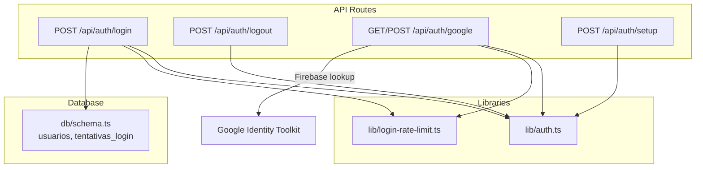
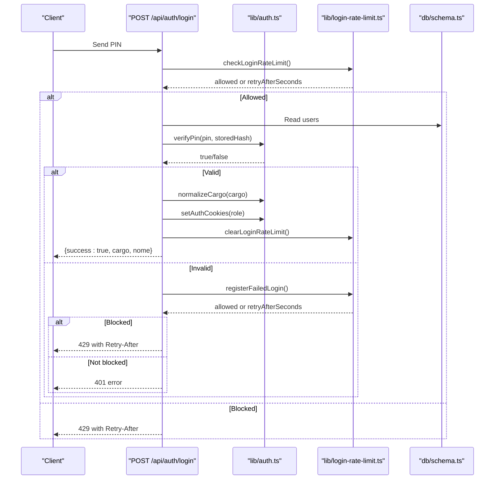
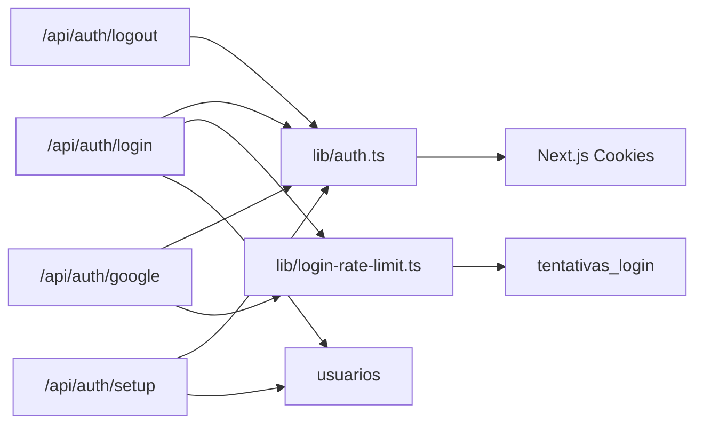

# Authentication API

<cite>
**Referenced Files in This Document**
- [route.ts](file://src/app/api/auth/login/route.ts)
- [route.ts](file://src/app/api/auth/logout/route.ts)
- [route.ts](file://src/app/api/auth/google/route.ts)
- [route.ts](file://src/app/api/auth/setup/route.ts)
- [auth.ts](file://src/lib/auth.ts)
- [login-rate-limit.ts](file://src/lib/login-rate-limit.ts)
- [schema.ts](file://src/db/schema.ts)
</cite>

## Table of Contents
1. [Introduction](#introduction)
2. [Project Structure](#project-structure)
3. [Core Components](#core-components)
4. [Architecture Overview](#architecture-overview)
5. [Detailed Component Analysis](#detailed-component-analysis)
6. [Dependency Analysis](#dependency-analysis)
7. [Performance Considerations](#performance-considerations)
8. [Troubleshooting Guide](#troubleshooting-guide)
9. [Conclusion](#conclusion)

## Introduction
This document provides detailed API documentation for the Authentication endpoints focused on user session management and role-based access control. It covers:
- Traditional PIN-based login
- Google OAuth integration for administrators
- Session termination (logout)
- Initial system setup to create the first admin user
- Cookie-based session management
- Role-based authorization helpers
- Security measures including rate limiting and brute-force protection

The authentication model supports multiple roles:
- Administrator
- Kitchen staff
- Service attendant

## Project Structure
Authentication is implemented as Next.js Route Handlers under src/app/api/auth with supporting libraries for security, cookies, and rate limiting. The database schema defines users and login attempt tracking tables used by the authentication flow.

**Diagram sources**
- [route.ts:16-79](file://src/app/api/auth/login/route.ts#L16-L79)
- [route.ts:6-14](file://src/app/api/auth/logout/route.ts#L6-L14)
- [route.ts:27-76](file://src/app/api/auth/google/route.ts#L27-L76)
- [route.ts:6-44](file://src/app/api/auth/setup/route.ts#L6-L44)
- [auth.ts:21-82](file://src/lib/auth.ts#L21-L82)
- [login-rate-limit.ts:45-114](file://src/lib/login-rate-limit.ts#L45-L114)
- [schema.ts:42-55](file://src/db/schema.ts#L42-L55)

**Section sources**
- [route.ts:16-79](file://src/app/api/auth/login/route.ts#L16-L79)
- [route.ts:6-14](file://src/app/api/auth/logout/route.ts#L6-L14)
- [route.ts:27-76](file://src/app/api/auth/google/route.ts#L27-L76)
- [route.ts:6-44](file://src/app/api/auth/setup/route.ts#L6-L44)
- [auth.ts:21-82](file://src/lib/auth.ts#L21-L82)
- [login-rate-limit.ts:45-114](file://src/lib/login-rate-limit.ts#L45-L114)
- [schema.ts:42-55](file://src/db/schema.ts#L42-L55)

## Core Components
- Authentication routes handle requests, validate inputs, enforce rate limits, manage sessions via cookies, and return standardized responses.
- lib/auth.ts provides:
  - PIN hashing and verification
  - Role normalization
  - Cookie-based session management
  - Authorization helpers to require specific roles
- lib/login-rate-limit.ts implements per-client rate limiting and temporary lockouts after repeated failures.
- db/schema.ts defines the usuarios table (users) and tentativas_login table (login attempts).

Key responsibilities:
- POST /api/auth/login: Validate PIN, verify against stored hash, set role cookie, clear rate limit counters on success.
- POST /api/auth/logout: Clear all role cookies to terminate session.
- POST /api/auth/google: Validate Google ID token, restrict to allowed admin emails, set admin cookie.
- POST /api/auth/setup: Create initial admin user with a generated PIN if none exists; optionally protected by a secret header.

Security highlights:
- PINs are hashed using bcrypt before storage and comparison.
- Cookies are httpOnly and secure in production with an expiration time.
- Rate limiting protects against brute force attacks with a configurable lockout window.
- Google OAuth is restricted to a configured allowlist of admin emails.

**Section sources**
- [auth.ts:21-82](file://src/lib/auth.ts#L21-L82)
- [login-rate-limit.ts:45-114](file://src/lib/login-rate-limit.ts#L45-L114)
- [schema.ts:42-55](file://src/db/schema.ts#L42-L55)

## Architecture Overview
The authentication architecture uses cookie-based sessions with role flags and middleware-like helpers to protect downstream endpoints.

**Diagram sources**
- [route.ts:16-79](file://src/app/api/auth/login/route.ts#L16-L79)
- [auth.ts:21-82](file://src/lib/auth.ts#L21-L82)
- [login-rate-limit.ts:45-114](file://src/lib/login-rate-limit.ts#L45-L114)
- [schema.ts:42-55](file://src/db/schema.ts#L42-L55)

## Detailed Component Analysis

### POST /api/auth/login
Purpose: Authenticate a user by PIN and establish a session via role-based cookies.

Request
- Method: POST
- Content-Type: application/json
- Body fields:
  - pin: string (required, length between 4 and 8 characters)

Response
- Success (200):
  - success: boolean
  - cargo: string ("admin" | "cozinha" | "atendente")
  - nome: string
- Validation errors (400):
  - error: string
- Unauthorized (401):
  - error: string (invalid PIN)
- Rate limited (429):
  - error: string
  - retryAfterSeconds: number
  - Header: Retry-After: seconds

Behavior
- Enforces rate limiting before processing.
- Validates PIN format and length.
- Verifies PIN against stored hash.
- Normalizes role from stored cargo.
- Sets role-specific cookie and clears failed attempt counters on success.

Error handling
- Returns descriptive errors for invalid input, wrong PIN, server errors, and rate limiting.

Cookie behavior
- Sets a role-specific cookie named auth_<role> with httpOnly and secure options in production.

**Section sources**
- [route.ts:16-79](file://src/app/api/auth/login/route.ts#L16-L79)
- [auth.ts:21-82](file://src/lib/auth.ts#L21-L82)
- [login-rate-limit.ts:45-114](file://src/lib/login-rate-limit.ts#L45-L114)

### POST /api/auth/logout
Purpose: Terminate the current session by clearing role cookies.

Request
- Method: POST
- No body required

Response
- Success (200):
  - success: boolean
  - message: string
- Server error (500):
  - error: string

Behavior
- Deletes all role cookies to invalidate the session.

**Section sources**
- [route.ts:6-14](file://src/app/api/auth/logout/route.ts#L6-L14)
- [auth.ts:44-49](file://src/lib/auth.ts#L44-L49)

### GET/POST /api/auth/google
Purpose: Authenticate administrators via Google OAuth using an ID token and grant admin access.

Note: Although documented as GET in the objective, the implementation handles POST with an idToken payload.

Request
- Method: POST
- Content-Type: application/json
- Body fields:
  - idToken: string (Google ID token)

Response
- Success (200):
  - success: boolean
  - cargo: "admin"
  - nome: string (display name or email)
- Validation errors (400):
  - error: string
- Forbidden (403):
  - error: string (account not allowed)
- Rate limited (429):
  - error: string
  - retryAfterSeconds: number
  - Header: Retry-After: seconds
- Unauthorized (401):
  - error: string

Behavior
- Enforces rate limiting.
- Validates presence and type of idToken.
- Uses Firebase API to look up account details.
- Restricts access to emails listed in GOOGLE_ADMIN_EMAILS environment variable.
- On success, sets admin cookie and clears rate limit counters.

Security considerations
- Requires NEXT_PUBLIC_FIREBASE_API_KEY to be configured.
- Only verified accounts with allowed emails can authenticate.

**Section sources**
- [route.ts:27-76](file://src/app/api/auth/google/route.ts#L27-L76)
- [auth.ts:39-42](file://src/lib/auth.ts#L39-L42)
- [login-rate-limit.ts:45-114](file://src/lib/login-rate-limit.ts#L45-L114)

### POST /api/auth/setup
Purpose: Initialize the system by creating the first administrator user with a generated PIN.

Request
- Method: POST
- Optional header:
  - x-setup-secret: string (must match SETUP_SECRET environment variable when set)

Response
- Success (200):
  - success: boolean
  - message: string
  - pin: string (one-time generated PIN)
- Forbidden (403):
  - error: string (setup already completed or unauthorized)
- Server error (500):
  - error: string

Behavior
- If SETUP_SECRET is configured, validates the provided secret header.
- Prevents re-running setup if any user already exists.
- Generates a random 6-digit PIN, hashes it, and inserts the first admin user.

Security considerations
- Protects initial setup with an optional secret.
- PIN is only returned once during setup.

**Section sources**
- [route.ts:6-44](file://src/app/api/auth/setup/route.ts#L6-L44)
- [schema.ts:42-48](file://src/db/schema.ts#L42-L48)

### Role-Based Access Control Helpers
These helpers are used by other API endpoints to enforce permissions based on the authenticated role.

- getAuthRole(): Reads cookies to determine the current role or null if unauthenticated.
- requireAuth(allowed[]): Returns role if authenticated and allowed, otherwise returns 401 or 403.
- requireAdmin(): Requires admin role.
- requireKitchen(): Requires admin or kitchen role.

Usage pattern
- Call at the beginning of protected endpoints to ensure the caller has sufficient privileges.

**Section sources**
- [auth.ts:51-82](file://src/lib/auth.ts#L51-L82)

## Dependency Analysis
Authentication depends on:
- Database tables:
  - usuarios: stores user identity, role, and hashed PIN
  - tentativas_login: tracks failed login attempts and lockout windows
- Libraries:
  - bcryptjs for PIN hashing
  - Next.js cookies API for session management
  - Firebase Identity Toolkit for Google OAuth validation

**Diagram sources**
- [route.ts:16-79](file://src/app/api/auth/login/route.ts#L16-L79)
- [route.ts:6-14](file://src/app/api/auth/logout/route.ts#L6-L14)
- [route.ts:27-76](file://src/app/api/auth/google/route.ts#L27-L76)
- [route.ts:6-44](file://src/app/api/auth/setup/route.ts#L6-L44)
- [auth.ts:21-82](file://src/lib/auth.ts#L21-L82)
- [login-rate-limit.ts:45-114](file://src/lib/login-rate-limit.ts#L45-L114)
- [schema.ts:42-55](file://src/db/schema.ts#L42-L55)

**Section sources**
- [schema.ts:42-55](file://src/db/schema.ts#L42-L55)
- [auth.ts:21-82](file://src/lib/auth.ts#L21-L82)
- [login-rate-limit.ts:45-114](file://src/lib/login-rate-limit.ts#L45-L114)

## Performance Considerations
- Rate limiting uses a lightweight SQLite table to track attempts per client identifier derived from request headers. This avoids external services and keeps latency low.
- PIN verification uses bcrypt with a moderate cost factor suitable for interactive logins.
- Cookie-based sessions avoid additional token parsing overhead and reduce stateless checks on each request.
- Google OAuth flow performs a single network call to Firebase to validate the ID token; caching strategies are not implemented here but could be considered for high-throughput scenarios.

[No sources needed since this section provides general guidance]

## Troubleshooting Guide
Common issues and resolutions:

- 429 Too Many Requests
  - Cause: Exceeded maximum failed login attempts within the lockout window.
  - Action: Wait for the specified retryAfterSeconds before retrying.
  - Related code paths:
    - [login-rate-limit.ts:45-64](file://src/lib/login-rate-limit.ts#L45-L64)
    - [login-rate-limit.ts:66-97](file://src/lib/login-rate-limit.ts#L66-L97)

- 400 Bad Request
  - Cause: Missing or invalid PIN format in login; missing or invalid idToken in Google login.
  - Action: Ensure PIN is between 4 and 8 characters; provide a valid Google ID token.
  - Related code paths:
    - [route.ts:26-38](file://src/app/api/auth/login/route.ts#L26-L38)
    - [route.ts:37-40](file://src/app/api/auth/google/route.ts#L37-L40)

- 401 Unauthorized
  - Cause: Incorrect PIN; Google token validation failure; missing configuration.
  - Action: Verify credentials; ensure NEXT_PUBLIC_FIREBASE_API_KEY is set for Google login.
  - Related code paths:
    - [route.ts:51-60](file://src/app/api/auth/login/route.ts#L51-L60)
    - [route.ts:72-76](file://src/app/api/auth/google/route.ts#L72-L76)

- 403 Forbidden
  - Cause: Google account not in allowed list; setup attempted after initialization; missing setup secret.
  - Action: Add email to GOOGLE_ADMIN_EMAILS; complete setup only once; include correct x-setup-secret if configured.
  - Related code paths:
    - [route.ts:58-67](file://src/app/api/auth/google/route.ts#L58-L67)
    - [route.ts:8-22](file://src/app/api/auth/setup/route.ts#L8-L22)

- 500 Internal Server Error
  - Cause: Unexpected server-side exceptions during login, logout, or setup.
  - Action: Check server logs for stack traces; verify database connectivity and environment variables.
  - Related code paths:
    - [route.ts:75-78](file://src/app/api/auth/login/route.ts#L75-L78)
    - [route.ts:10-13](file://src/app/api/auth/logout/route.ts#L10-L13)
    - [route.ts:40-43](file://src/app/api/auth/setup/route.ts#L40-L43)

Session and role troubleshooting:
- If subsequent endpoints return 401 or 403, ensure that:
  - Cookies are being sent with requests (sameSite lax may block cross-site calls).
  - The role matches the endpoint’s allowed roles.
  - Use requireAuth or role-specific helpers to diagnose permission issues.
  - Related code paths:
    - [auth.ts:51-82](file://src/lib/auth.ts#L51-L82)

**Section sources**
- [login-rate-limit.ts:45-114](file://src/lib/login-rate-limit.ts#L45-L114)
- [route.ts:26-38](file://src/app/api/auth/login/route.ts#L26-L38)
- [route.ts:51-60](file://src/app/api/auth/login/route.ts#L51-L60)
- [route.ts:37-40](file://src/app/api/auth/google/route.ts#L37-L40)
- [route.ts:58-67](file://src/app/api/auth/google/route.ts#L58-L67)
- [route.ts:8-22](file://src/app/api/auth/setup/route.ts#L8-L22)
- [auth.ts:51-82](file://src/lib/auth.ts#L51-L82)

## Conclusion
The Authentication API provides secure, cookie-based session management with robust role-based access control and protection against brute force attacks. Administrators can authenticate via PIN or Google OAuth, while kitchen and service roles are supported through normalized roles and helper functions. For reliable operation, ensure proper environment configuration (e.g., Firebase API key, optional setup secret), and use the provided authorization helpers to protect downstream endpoints.

[No sources needed since this section summarizes without analyzing specific files]