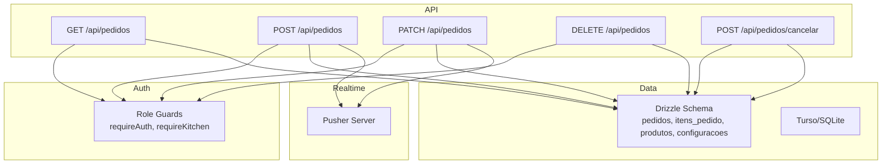
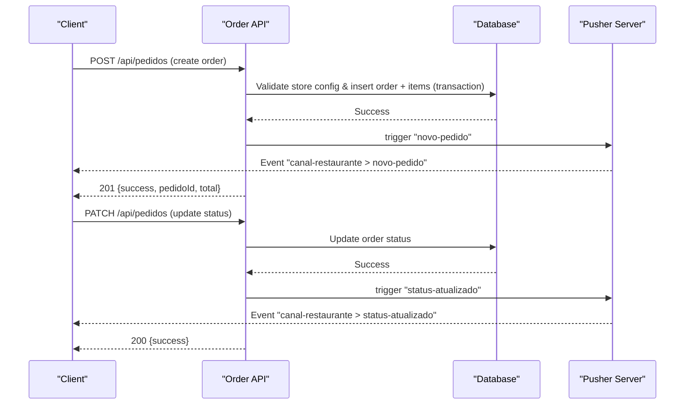
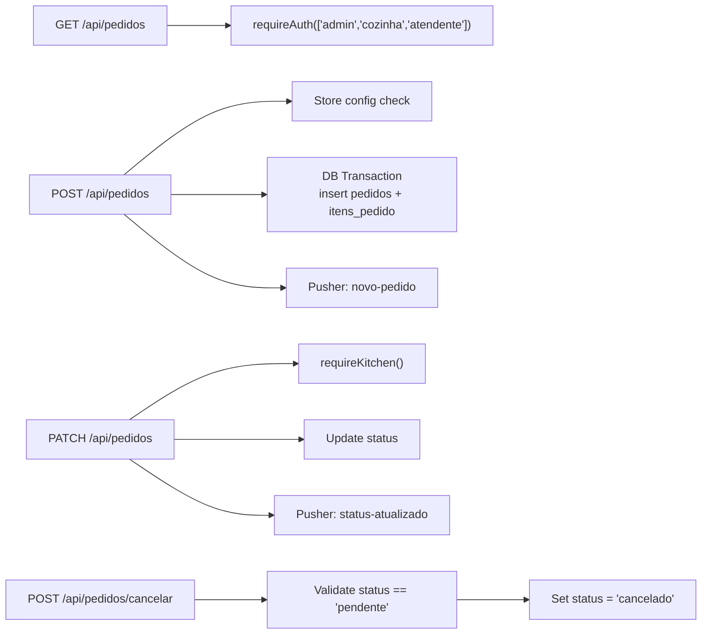
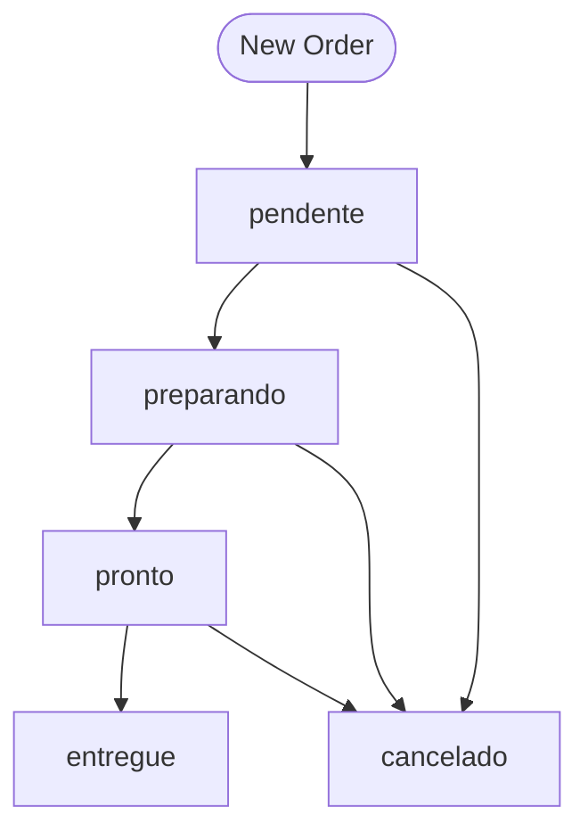

# Orders API

<cite>
**Referenced Files in This Document**
- [route.ts](file://src/app/api/pedidos/route.ts)
- [cancelar/route.ts](file://src/app/api/pedidos/cancelar/route.ts)
- [auth.ts](file://src/lib/auth.ts)
- [schema.ts](file://src/db/schema.ts)
- [index.ts](file://src/db/index.ts)
- [pusher-server.ts](file://src/lib/pusher-server.ts)
- [pusher.ts](file://src/lib/pusher.ts)
- [page.tsx (painel-pedidos)](file://src/app/painel-pedidos/page.tsx)
- [page.tsx (historico-pedidos)](file://src/app/historico-pedidos/page.tsx)
</cite>

## Table of Contents
1. [Introduction](#introduction)
2. [Project Structure](#project-structure)
3. [Core Components](#core-components)
4. [Architecture Overview](#architecture-overview)
5. [Detailed Component Analysis](#detailed-component-analysis)
6. [Dependency Analysis](#dependency-analysis)
7. [Performance Considerations](#performance-considerations)
8. [Troubleshooting Guide](#troubleshooting-guide)
9. [Conclusion](#conclusion)
10. [Appendices](#appendices)

## Introduction
This document provides comprehensive API documentation for the Orders endpoints that manage the order lifecycle in this Next.js application. It covers:
- Retrieving orders with optional filtering and table association
- Creating new orders from cart items
- Updating order status
- Cancelling orders
- Authentication and authorization requirements by role
- Real-time notifications via Pusher
- Error handling strategies for concurrent processing

The API is implemented as Next.js Route Handlers under src/app/api/pedidos.

## Project Structure
Orders functionality spans several modules:
- API routes: GET/POST/PATCH/DELETE for orders; POST for cancellation
- Data models: Drizzle ORM schema for orders, items, products, settings, users
- Authentication: Role-based access control using cookies
- Real-time: Pusher server/client integration for live updates
- Frontend consumers: Kitchen panel and order history pages

**Diagram sources**
- [route.ts:15-253](file://src/app/api/pedidos/route.ts#L15-L253)
- [cancelar/route.ts:6-21](file://src/app/api/pedidos/cancelar/route.ts#L6-L21)
- [auth.ts:63-82](file://src/lib/auth.ts#L63-L82)
- [schema.ts:14-40](file://src/db/schema.ts#L14-L40)
- [pusher-server.ts:1-11](file://src/lib/pusher-server.ts#L1-L11)

**Section sources**
- [route.ts:15-253](file://src/app/api/pedidos/route.ts#L15-L253)
- [cancelar/route.ts:6-21](file://src/app/api/pedidos/cancelar/route.ts#L6-L21)
- [auth.ts:63-82](file://src/lib/auth.ts#L63-L82)
- [schema.ts:14-40](file://src/db/schema.ts#L14-L40)
- [pusher-server.ts:1-11](file://src/lib/pusher-server.ts#L1-L11)

## Core Components
- Order model: pedidos table with fields id, mesa, cliente, status, observacao, total, criadoEm
- Order item model: itens_pedido with pedidoId, produtoNome, quantidade, precoUnitario
- Product model: produtos with id, nome, descricao, preco, categoria, status, imagem
- Settings model: configuracoes with statusLoja used to gate order creation
- Auth roles: admin, cozinha, atendente; kitchen operations protected by requireKitchen
- Real-time: Pusher events novo-pedido and status-atualizado broadcast on channel canal-restaurante

**Section sources**
- [schema.ts:4-40](file://src/db/schema.ts#L4-L40)
- [auth.ts:5-11](file://src/lib/auth.ts#L5-L11)
- [pusher-server.ts:1-11](file://src/lib/pusher-server.ts#L1-L11)

## Architecture Overview
The Orders API follows a layered approach:
- Route handlers validate input, enforce auth, perform DB transactions, and emit real-time events
- Data layer uses Drizzle ORM over Turso/SQLite
- Auth middleware enforces role-based access
- Real-time layer uses Pusher to notify clients of new orders and status changes

**Diagram sources**
- [route.ts:65-190](file://src/app/api/pedidos/route.ts#L65-L190)
- [route.ts:192-235](file://src/app/api/pedidos/route.ts#L192-L235)
- [pusher-server.ts:1-11](file://src/lib/pusher-server.ts#L1-L11)

## Detailed Component Analysis

### GET /api/pedidos
Purpose: Retrieve orders. Supports two modes:
- Unauthenticated or customer mode: retrieve specific orders by IDs via query parameter ids=uuid1,uuid2,...
- Authenticated staff mode: retrieve all orders (admin, cozinha, atendente)

Authentication:
- If ids param is present, no authentication required; returns only requested orders
- Otherwise requires one of: admin, cozinha, atendente

Query parameters:
- ids: comma-separated list of order UUIDs (optional)

Response:
- Array of orders, each including an itens array populated from itens_pedido

Error handling:
- Returns empty array when ids is empty
- Returns 500 on internal errors

Example request:
- GET /api/pedidos?ids=abc,def
- GET /api/pedidos (with valid staff session)

Example response (array):
- Each element includes: id, mesa, cliente, status, observacao, total, criadoEm, itens[]

Notes:
- Items are joined client-side by matching pedidoId

**Section sources**
- [route.ts:15-63](file://src/app/api/pedidos/route.ts#L15-L63)

### POST /api/pedidos
Purpose: Create a new order from cart items. Validates store status, inputs, computes totals, persists order and items atomically, then emits a real-time event.

Authentication:
- No explicit role check; intended for customers via QR menu flow

Request body:
- mesa: string formatted as "Mesa <number>" or "Balcão"
- cliente: string (optional, defaults to "Cliente Balcão")
- observacao: string (optional)
- itens: array of objects with:
  - id: optional product UUID (used to resolve name/price)
  - nome: non-empty string
  - quantidade: integer 1..99
  - preco: number >= 0 (required if id not provided or product not found)

Validation rules:
- Store must be open (configuracoes.statusLoja true)
- At least one item required
- Item name must be a non-empty string
- Quantity must be between 1 and 99
- If item has id, product must exist and be active; price taken from product
- Else item.preco must be a valid number >= 0
- Total must be greater than zero
- mesa must match "Mesa <number>" or "Balcão"

Processing:
- Computes total based on product prices or provided item prices
- Normalizes mesa and cliente strings
- Persists order and items in a single transaction
- Emits Pusher event "novo-pedido" on channel "canal-restaurante"

Response:
- 201 Created: { success: true, pedidoId: string, total: number, message: string }

Errors:
- 403: Store closed
- 400: Invalid body, missing/invalid items, invalid quantities/prices, inactive product, invalid mesa format, total <= 0
- 500: Internal error

Example request:
- POST /api/pedidos
- Body: { mesa: "Mesa 5", cliente: "João", observacao: "Sem cebola", itens: [{ id: "prod-id", nome: "Hambúrguer", quantidade: 2, preco: 25 }] }

Example response:
- { success: true, pedidoId: "uuid", total: 50, message: "Pedido criado com sucesso!" }

**Section sources**
- [route.ts:65-190](file://src/app/api/pedidos/route.ts#L65-L190)
- [schema.ts:4-40](file://src/db/schema.ts#L4-L40)
- [pusher-server.ts:1-11](file://src/lib/pusher-server.ts#L1-L11)

### PATCH /api/pedidos
Purpose: Update order status. Requires kitchen/admin role.

Authentication:
- requireKitchen() allows admin or cozinha

Request body:
- id: string (order UUID)
- status: one of ["pendente", "preparando", "pronto", "entregue", "cancelado"]

Processing:
- Updates order status in database
- Emits Pusher event "status-atualizado" on channel "canal-restaurante" with { id, status }

Response:
- 200 OK: { success: true, message: "Status atualizado!" }

Errors:
- 400: Missing id/status or invalid status value
- 500: Internal error

Example request:
- PATCH /api/pedidos
- Body: { id: "order-uuid", status: "preparando" }

Example response:
- { success: true, message: "Status atualizado!" }

**Section sources**
- [route.ts:192-235](file://src/app/api/pedidos/route.ts#L192-L235)
- [auth.ts:80-82](file://src/lib/auth.ts#L80-L82)
- [pusher-server.ts:1-11](file://src/lib/pusher-server.ts#L1-L11)

### DELETE /api/pedidos
Purpose: Delete an order and its items. Requires kitchen/admin role.

Authentication:
- requireKitchen() allows admin or cozinha

Request body:
- id: string (order UUID)

Processing:
- Deletes itens_pedido rows for the order
- Deletes the order row
- All within a transaction

Response:
- 200 OK: { success: true }

Errors:
- 400: Missing id
- 500: Internal error

Example request:
- DELETE /api/pedidos
- Body: { id: "order-uuid" }

**Section sources**
- [route.ts:237-252](file://src/app/api/pedidos/route.ts#L237-L252)

### POST /api/pedidos/cancelar
Purpose: Cancel an order if it is still pending.

Authentication:
- No explicit role guard in this route; consider adding authorization in production

Request body:
- id: string (order UUID)

Processing:
- Verifies order exists
- Ensures order status is "pendente"; otherwise rejects
- Updates status to "cancelado"

Response:
- 200 OK: { success: true, message: "Pedido cancelado." }

Errors:
- 400: Invalid id
- 404: Order not found
- 409: Order already in preparation or beyond
- 500: Internal error

Example request:
- POST /api/pedidos/cancelar
- Body: { id: "order-uuid" }

**Section sources**
- [cancelar/route.ts:6-21](file://src/app/api/pedidos/cancelar/route.ts#L6-L21)

## Dependency Analysis
Key dependencies and relationships:
- Route handlers depend on:
  - Database via Drizzle ORM (db instance)
  - Auth helpers (requireAuth, requireKitchen)
  - Pusher server for real-time events
- Schema defines entities and constraints
- Frontend consumes APIs and subscribes to Pusher channel for live updates

**Diagram sources**
- [route.ts:15-253](file://src/app/api/pedidos/route.ts#L15-L253)
- [cancelar/route.ts:6-21](file://src/app/api/pedidos/cancelar/route.ts#L6-L21)
- [auth.ts:63-82](file://src/lib/auth.ts#L63-L82)
- [pusher-server.ts:1-11](file://src/lib/pusher-server.ts#L1-L11)

**Section sources**
- [route.ts:15-253](file://src/app/api/pedidos/route.ts#L15-L253)
- [cancelar/route.ts:6-21](file://src/app/api/pedidos/cancelar/route.ts#L6-L21)
- [auth.ts:63-82](file://src/lib/auth.ts#L63-L82)
- [pusher-server.ts:1-11](file://src/lib/pusher-server.ts#L1-L11)

## Performance Considerations
- Use transactions for order creation to ensure atomicity of order and items insertion
- Avoid N+1 queries by selecting all items once and mapping them to orders in memory
- Keep payload minimal; compute totals server-side to prevent tampering
- Pusher triggers are fire-and-forget; failures are logged but do not block responses
- For high concurrency, rely on SQLite/Turso transaction isolation to prevent race conditions during status updates

[No sources needed since this section provides general guidance]

## Troubleshooting Guide
Common issues and resolutions:
- 403 Store closed: Check configuracoes.statusLoja before creating orders
- 400 Invalid item quantity or price: Ensure quantities are between 1 and 99 and prices are non-negative
- 400 Invalid mesa format: Use "Mesa <number>" or "Balcão"
- 409 Cannot cancel: Only orders with status "pendente" can be cancelled
- Real-time not updating: Verify Pusher environment variables are set and channel/event names match
- Auth errors: Ensure correct role cookies are set; use requireKitchen for status updates

**Section sources**
- [route.ts:65-190](file://src/app/api/pedidos/route.ts#L65-L190)
- [route.ts:192-235](file://src/app/api/pedidos/route.ts#L192-L235)
- [cancelar/route.ts:6-21](file://src/app/api/pedidos/cancelar/route.ts#L6-L21)
- [pusher-server.ts:1-11](file://src/lib/pusher-server.ts#L1-L11)

## Conclusion
The Orders API provides a robust foundation for managing restaurant orders with clear validation, role-based access control, and real-time updates. By following the documented schemas and workflows, clients can reliably create, update, cancel, and retrieve orders while maintaining data integrity and responsiveness.

[No sources needed since this section summarizes without analyzing specific files]

## Appendices

### Request/Response Schemas

- Order object (returned by GET):
  - id: string (UUID)
  - mesa: string ("Mesa <number>" or "Balcão")
  - cliente: string
  - status: enum ["pendente", "preparando", "pronto", "entregue", "cancelado"]
  - observacao: string | null
  - total: number
  - criadoEm: timestamp
  - itens: array of { id, produtoNome, quantidade, precoUnitario }

- Create order request (POST /api/pedidos):
  - mesa: string
  - cliente: string (optional)
  - observacao: string (optional)
  - itens: array of { id?: string, nome: string, quantidade: number, preco: number }

- Update status request (PATCH /api/pedidos):
  - id: string
  - status: enum above

- Cancel order request (POST /api/pedidos/cancelar):
  - id: string

**Section sources**
- [schema.ts:14-40](file://src/db/schema.ts#L14-L40)
- [route.ts:65-190](file://src/app/api/pedidos/route.ts#L65-L190)
- [route.ts:192-235](file://src/app/api/pedidos/route.ts#L192-L235)
- [cancelar/route.ts:6-21](file://src/app/api/pedidos/cancelar/route.ts#L6-L21)

### Authentication and Authorization

- Roles:
  - admin: full access
  - cozinha: can update/delete orders
  - atendente: can read all orders
- Guards:
  - requireAuth(["admin","cozinha","atendente"]) for listing all orders
  - requireKitchen() for status updates and deletions
- Customer flows:
  - GET with ids param does not require authentication
  - POST to create orders does not require authentication

**Section sources**
- [auth.ts:63-82](file://src/lib/auth.ts#L63-L82)
- [route.ts:15-63](file://src/app/api/pedidos/route.ts#L15-L63)

### Real-time Notifications with Pusher

- Channel: canal-restaurante
- Events:
  - novo-pedido: emitted after successful order creation
  - status-atualizado: emitted after status update
- Client subscription example in frontend:
  - Subscribe to channel and bind to events to refresh order lists

**Section sources**
- [pusher-server.ts:1-11](file://src/lib/pusher-server.ts#L1-L11)
- [pusher.ts:1-9](file://src/lib/pusher.ts#L1-L9)
- [page.tsx (painel-pedidos):54-76](file://src/app/painel-pedidos/page.tsx#L54-L76)

### Status Transitions Flowchart

**Diagram sources**
- [route.ts:192-235](file://src/app/api/pedidos/route.ts#L192-L235)
- [cancelar/route.ts:6-21](file://src/app/api/pedidos/cancelar/route.ts#L6-L21)