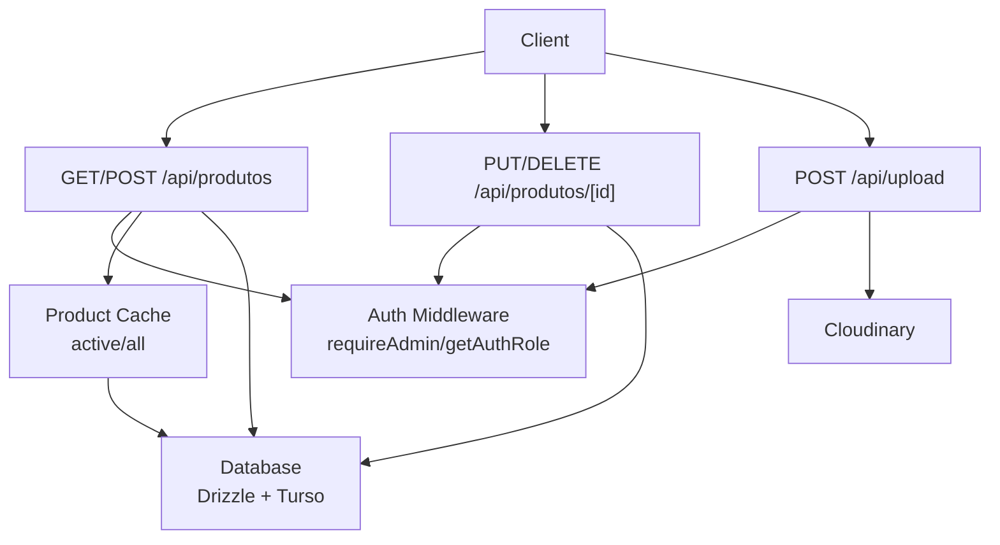
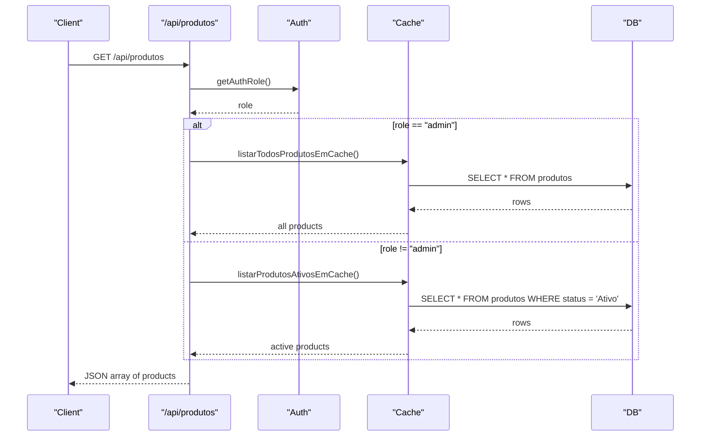
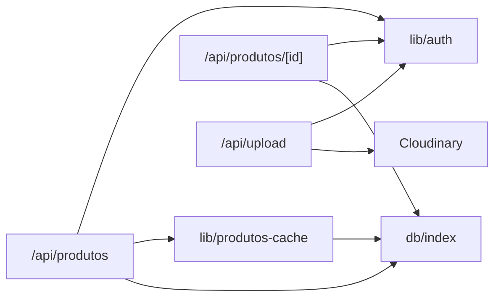

# Products API

<cite>
**Referenced Files in This Document**
- [route.ts](file://src/app/api/produtos/route.ts)
- [route.ts](file://src/app/api/produtos/[id]/route.ts)
- [schema.ts](file://src/db/schema.ts)
- [auth.ts](file://src/lib/auth.ts)
- [produtos-cache.ts](file://src/lib/produtos-cache.ts)
- [index.ts](file://src/db/index.ts)
- [route.ts](file://src/app/api/upload/route.ts)
</cite>

## Table of Contents
1. [Introduction](#introduction)
2. [Project Structure](#project-structure)
3. [Core Components](#core-components)
4. [Architecture Overview](#architecture-overview)
5. [Detailed Component Analysis](#detailed-component-analysis)
6. [Dependency Analysis](#dependency-analysis)
7. [Performance Considerations](#performance-considerations)
8. [Troubleshooting Guide](#troubleshooting-guide)
9. [Conclusion](#conclusion)
10. [Appendices](#appendices)

## Introduction
This document provides detailed API documentation for the Products endpoints that manage the product catalog. It covers:
- Retrieving products with role-based filtering
- Creating, updating, and deleting products (admin-only)
- Uploading product images to Cloudinary (admin-only)
- Request/response schemas, validation rules, error handling, and common usage patterns

The API is implemented as Next.js Route Handlers using Drizzle ORM over a libSQL/Turso database. Authentication is cookie-based with roles; administrative operations require admin privileges. Public customer-facing reads return only active products.

## Project Structure
The Products API consists of:
- GET/POST /api/produtos: list all or create a new product
- PUT/DELETE /api/produtos/[id]: update or delete a specific product
- POST /api/upload: upload an image file to Cloudinary (returns a secure URL)

**Diagram sources**
- [route.ts:6-16](file://src/app/api/produtos/route.ts#L6-L16)
- [route.ts:18-52](file://src/app/api/produtos/route.ts#L18-L52)
- [route.ts:8-45](file://src/app/api/produtos/[id]/route.ts#L8-L45)
- [route.ts:47-64](file://src/app/api/produtos/[id]/route.ts#L47-L64)
- [route.ts:14-58](file://src/app/api/upload/route.ts#L14-L58)
- [produtos-cache.ts:8-18](file://src/lib/produtos-cache.ts#L8-L18)
- [index.ts:1-14](file://src/db/index.ts#L1-L14)

**Section sources**
- [route.ts:6-52](file://src/app/api/produtos/route.ts#L6-L52)
- [route.ts:8-64](file://src/app/api/produtos/[id]/route.ts#L8-L64)
- [route.ts:14-58](file://src/app/api/upload/route.ts#L14-L58)
- [produtos-cache.ts:1-23](file://src/lib/produtos-cache.ts#L1-L23)
- [index.ts:1-14](file://src/db/index.ts#L1-L14)

## Core Components
- Product model fields: id, nome, descricao, preco, categoria, status, imagem
- Role-based access:
  - Admin: full CRUD on products and uploads
  - Non-admin: read-only access returns only active products
- Caching:
  - Active products cached with tag invalidation on writes
  - All products cached separately for admin reads
- Image upload:
  - Validates type and size, uploads to Cloudinary, returns secure URL

**Section sources**
- [schema.ts:4-12](file://src/db/schema.ts#L4-L12)
- [auth.ts:51-82](file://src/lib/auth.ts#L51-L82)
- [produtos-cache.ts:8-22](file://src/lib/produtos-cache.ts#L8-L22)
- [route.ts:18-52](file://src/app/api/produtos/route.ts#L18-L52)
- [route.ts:14-58](file://src/app/api/upload/route.ts#L14-L58)

## Architecture Overview
The Products API enforces authentication via cookies and uses caching to optimize reads. Writes invalidate cache tags to ensure consistency. Images are uploaded to Cloudinary and stored as URLs in the product record.

**Diagram sources**
- [route.ts:6-16](file://src/app/api/produtos/route.ts#L6-L16)
- [produtos-cache.ts:8-18](file://src/lib/produtos-cache.ts#L8-L18)
- [index.ts:1-14](file://src/db/index.ts#L1-L14)

## Detailed Component Analysis

### GET /api/produtos
- Purpose: Retrieve products
- Access:
  - Admin: returns all products
  - Non-admin: returns only active products
- Query parameters: none currently supported
- Response: array of product objects
- Errors:
  - 500 Internal Server Error on failures

Example response shape:
- Array of objects with fields: id, nome, descricao, preco, categoria, status, imagem

**Section sources**
- [route.ts:6-16](file://src/app/api/produtos/route.ts#L6-L16)
- [produtos-cache.ts:8-18](file://src/lib/produtos-cache.ts#L8-L18)

### POST /api/produtos
- Purpose: Create a new product
- Access: Admin required
- Request body:
  - nome (string, required, trimmed)
  - descricao (string, optional, trimmed)
  - preco (number, required, must be >= 0)
  - categoria (string, optional, defaults to "Geral")
  - imagem (string, optional; if not provided, a default image URL is used)
- Response:
  - success: true
  - id: string (new product id)
  - message: confirmation string
- Validation errors:
  - 400 Bad Request when nome is missing or preco is invalid
- Side effects:
  - Inserts into database
  - Invalidates product cache

Notes:
- File uploads are not handled by this endpoint. Use POST /api/upload to obtain a Cloudinary URL, then pass it as imagem in subsequent product creation/update.

**Section sources**
- [route.ts:18-52](file://src/app/api/produtos/route.ts#L18-L52)
- [schema.ts:4-12](file://src/db/schema.ts#L4-L12)

### PUT /api/produtos/[id]
- Purpose: Update an existing product
- Access: Admin required
- Path parameter: id (string)
- Request body:
  - nome (string, required, trimmed)
  - descricao (string, optional, trimmed)
  - preco (number, required, must be >= 0)
  - categoria (string, optional, defaults to "Geral")
  - imagem (string, optional; if not provided, a default image URL is used)
- Response:
  - success: true
  - message: confirmation string
- Validation errors:
  - 400 Bad Request when nome is missing or preco is invalid
- Side effects:
  - Updates matching product by id
  - Invalidates product cache

**Section sources**
- [route.ts:8-45](file://src/app/api/produtos/[id]/route.ts#L8-L45)
- [schema.ts:4-12](file://src/db/schema.ts#L4-L12)

### DELETE /api/produtos/[id]
- Purpose: Remove a product
- Access: Admin required
- Path parameter: id (string)
- Response:
  - success: true
  - message: confirmation string
- Side effects:
  - Deletes product by id
  - Invalidates product cache

**Section sources**
- [route.ts:47-64](file://src/app/api/produtos/[id]/route.ts#L47-L64)

### POST /api/upload
- Purpose: Upload an image to Cloudinary and receive a secure URL
- Access: Admin required
- Content-Type: multipart/form-data
- Form field:
  - file (image)
- Allowed types: image/jpeg, image/png, image/webp, image/gif
- Max size: 5 MB
- Response:
  - success: true
  - url: secure URL from Cloudinary
- Validation errors:
  - 400 Bad Request for missing file, unsupported type, or oversized file
- Errors:
  - 500 Internal Server Error on upload failure

Usage pattern:
1. POST /api/upload with file to obtain url
2. Use the returned url as imagem in POST /api/produtos or PUT /api/produtos/[id]

**Section sources**
- [route.ts:14-58](file://src/app/api/upload/route.ts#L14-L58)

### Authentication and Authorization
- Cookie-based session with roles: admin, cozinha, atendente
- Admin-only endpoints:
  - POST /api/produtos
  - PUT /api/produtos/[id]
  - DELETE /api/produtos/[id]
  - POST /api/upload
- Public reads:
  - GET /api/produtos returns only active products for non-admin users
- Helper functions:
  - requireAdmin(): ensures admin role
  - getAuthRole(): returns current role or null

**Section sources**
- [auth.ts:51-82](file://src/lib/auth.ts#L51-L82)
- [route.ts:18-20](file://src/app/api/produtos/route.ts#L18-L20)
- [route.ts:8-13](file://src/app/api/produtos/[id]/route.ts#L8-L13)
- [route.ts:47-52](file://src/app/api/produtos/[id]/route.ts#L47-L52)
- [route.ts:14-16](file://src/app/api/upload/route.ts#L14-L16)

### Data Model
Product fields stored in the database:
- id: text primary key
- nome: text, not null
- descricao: text, nullable
- preco: real, not null
- categoria: text, not null
- status: text, not null, default "Ativo"
- imagem: text, nullable

**Section sources**
- [schema.ts:4-12](file://src/db/schema.ts#L4-L12)

### Caching Strategy
- Active products: cached query filtered by status = "Ativo"
- All products: cached query without filter
- Revalidation: 300 seconds per cache entry
- Invalidation: triggered on create/update/delete to refresh both caches

**Section sources**
- [produtos-cache.ts:8-22](file://src/lib/produtos-cache.ts#L8-L22)

## Dependency Analysis

**Diagram sources**
- [route.ts:1-5](file://src/app/api/produtos/route.ts#L1-L5)
- [route.ts:1-6](file://src/app/api/produtos/[id]/route.ts#L1-L6)
- [route.ts:1-4](file://src/app/api/upload/route.ts#L1-L4)
- [produtos-cache.ts:1-5](file://src/lib/produtos-cache.ts#L1-L5)
- [index.ts:1-14](file://src/db/index.ts#L1-L14)

**Section sources**
- [route.ts:1-52](file://src/app/api/produtos/route.ts#L1-L52)
- [route.ts:1-64](file://src/app/api/produtos/[id]/route.ts#L1-L64)
- [route.ts:1-58](file://src/app/api/upload/route.ts#L1-L58)
- [produtos-cache.ts:1-23](file://src/lib/produtos-cache.ts#L1-L23)
- [index.ts:1-14](file://src/db/index.ts#L1-L14)

## Performance Considerations
- Reads are cached with a 300-second revalidation window to reduce database load.
- Writes trigger cache invalidation to ensure consistent reads immediately after updates.
- For high-throughput scenarios, consider:
  - Increasing cache TTL if appropriate
  - Adding server-side pagination and filtering to GET /api/produtos
  - Implementing search queries by name/category/status

[No sources needed since this section provides general guidance]

## Troubleshooting Guide
Common issues and resolutions:
- 401 Unauthorized: Missing or invalid admin session cookie for admin endpoints
- 400 Bad Request:
  - Missing or empty nome
  - Invalid or negative preco
  - Missing or invalid file type/size on upload
- 500 Internal Server Error:
  - Database or cache errors during reads/writes
  - Cloudinary upload failures

Debugging tips:
- Verify admin cookies are set correctly
- Ensure environment variables for Cloudinary are configured
- Check logs for database connectivity and cache invalidation events

**Section sources**
- [route.ts:22-31](file://src/app/api/produtos/route.ts#L22-L31)
- [route.ts:19-26](file://src/app/api/produtos/[id]/route.ts#L19-L26)
- [route.ts:22-38](file://src/app/api/upload/route.ts#L22-L38)
- [route.ts:12-15](file://src/app/api/produtos/route.ts#L12-L15)
- [route.ts:41-44](file://src/app/api/produtos/[id]/route.ts#L41-L44)
- [route.ts:54-57](file://src/app/api/upload/route.ts#L54-L57)

## Conclusion
The Products API provides a robust foundation for managing a restaurant menu:
- Secure admin-only write operations
- Role-aware read behavior for public customers
- Efficient caching with immediate invalidation on writes
- Streamlined image uploads via Cloudinary

For advanced use cases such as filtering, pagination, and search, extend the GET endpoint with query parameters and corresponding cache keys.

[No sources needed since this section summarizes without analyzing specific files]

## Appendices

### Request/Response Schemas

- Product object fields:
  - id: string
  - nome: string
  - descricao: string
  - preco: number
  - categoria: string
  - status: string ("Ativo" or other)
  - imagem: string (URL)

- GET /api/produtos response:
  - 200 OK: array of product objects

- POST /api/produtos request:
  - Body: { nome, descricao?, preco, categoria?, imagem? }
  - 201 Created: { success: true, id, message }
  - 400 Bad Request: { error }
  - 401 Unauthorized: { error }
  - 500 Internal Server Error: { error }

- PUT /api/produtos/[id] request:
  - Body: { nome, descricao?, preco, categoria?, imagem? }
  - 200 OK: { success: true, message }
  - 400 Bad Request: { error }
  - 401 Unauthorized: { error }
  - 500 Internal Server Error: { error }

- DELETE /api/produtos/[id] response:
  - 200 OK: { success: true, message }
  - 401 Unauthorized: { error }
  - 500 Internal Server Error: { error }

- POST /api/upload request:
  - Content-Type: multipart/form-data
  - Field: file (image)
  - 200 OK: { success: true, url }
  - 400 Bad Request: { error }
  - 401 Unauthorized: { error }
  - 500 Internal Server Error: { error }

**Section sources**
- [schema.ts:4-12](file://src/db/schema.ts#L4-L12)
- [route.ts:6-16](file://src/app/api/produtos/route.ts#L6-L16)
- [route.ts:18-52](file://src/app/api/produtos/route.ts#L18-L52)
- [route.ts:8-45](file://src/app/api/produtos/[id]/route.ts#L8-L45)
- [route.ts:47-64](file://src/app/api/produtos/[id]/route.ts#L47-L64)
- [route.ts:14-58](file://src/app/api/upload/route.ts#L14-L58)

### Example Workflows

- Create a product with image:
  1. POST /api/upload with image file to obtain url
  2. POST /api/produtos with { nome, descricao, preco, categoria, imagem: url }

- Update a product’s image:
  1. POST /api/upload to get new url
  2. PUT /api/produtos/[id] with updated imagem

- Bulk operations:
  - The API does not provide a dedicated bulk endpoint. To perform bulk operations, call POST /api/produtos multiple times in sequence.

- Search and filtering:
  - Not currently implemented. Extend GET /api/produtos with query parameters (e.g., category, status, search by name) and add corresponding cache keys to maintain performance.

[No sources needed since this section provides conceptual workflows]