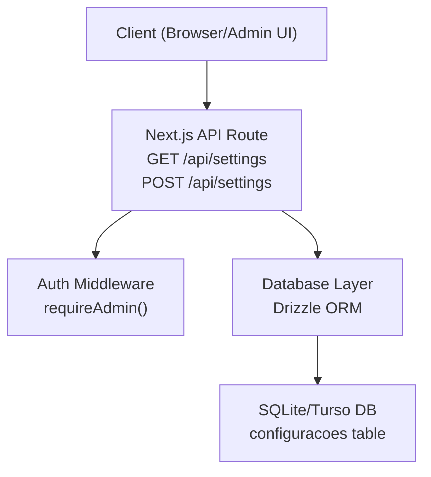
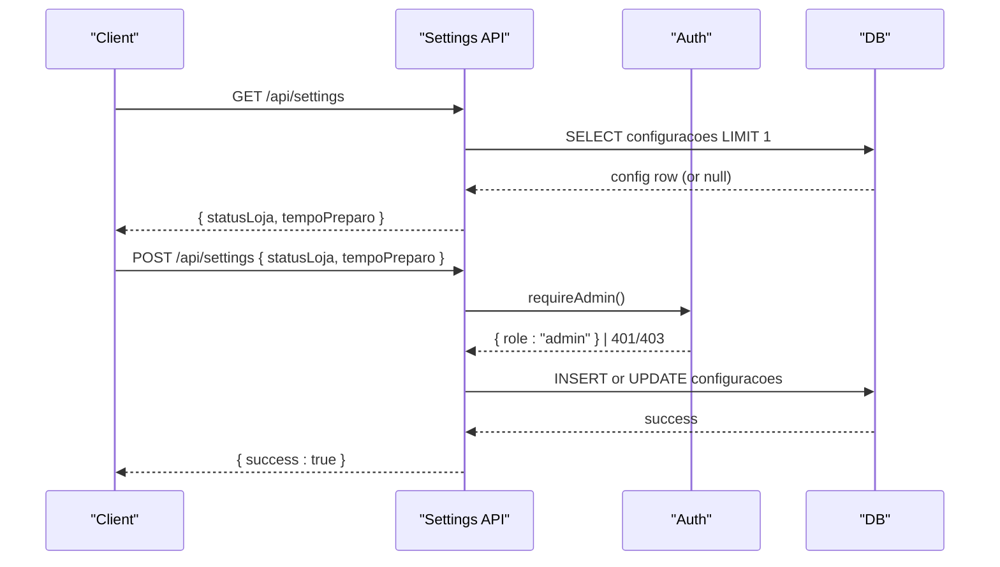
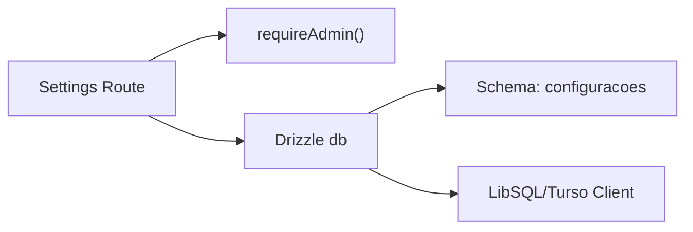

# Settings API

<cite>
**Referenced Files in This Document**
- [route.ts](file://src/app/api/settings/route.ts)
- [schema.ts](file://src/db/schema.ts)
- [auth.ts](file://src/lib/auth.ts)
- [index.ts](file://src/db/index.ts)
- [seed.ts](file://src/db/seed.ts)
- [page.tsx](file://src/app/settings/page.tsx)
</cite>

## Table of Contents
1. [Introduction](#introduction)
2. [Project Structure](#project-structure)
3. [Core Components](#core-components)
4. [Architecture Overview](#architecture-overview)
5. [Detailed Component Analysis](#detailed-component-analysis)
6. [Dependency Analysis](#dependency-analysis)
7. [Performance Considerations](#performance-considerations)
8. [Troubleshooting Guide](#troubleshooting-guide)
9. [Conclusion](#conclusion)
10. [Appendices](#appendices)

## Introduction
This document provides detailed API documentation for the Settings API endpoints that manage system configuration for the application. It covers retrieving and updating core operational settings, authentication requirements, request/response schemas, validation rules, and practical usage examples. It also addresses current limitations regarding backup/restore, versioning, rollback, and impact assessment, along with recommendations for future enhancements.

## Project Structure
The Settings API is implemented as a Next.js API route under the app directory. It reads from and writes to a single-row configuration table using Drizzle ORM over a LibSQL/Turso database. Authentication enforces admin-only access for write operations. The frontend settings page demonstrates how clients interact with the API.

**Diagram sources**
- [route.ts:7-34](file://src/app/api/settings/route.ts#L7-L34)
- [auth.ts:76-78](file://src/lib/auth.ts#L76-L78)
- [index.ts:1-13](file://src/db/index.ts#L1-L13)
- [schema.ts:35-40](file://src/db/schema.ts#L35-L40)

**Section sources**
- [route.ts:1-35](file://src/app/api/settings/route.ts#L1-L35)
- [schema.ts:35-40](file://src/db/schema.ts#L35-L40)
- [auth.ts:51-78](file://src/lib/auth.ts#L51-L78)
- [index.ts:1-13](file://src/db/index.ts#L1-L13)

## Core Components
- Settings API route: Provides GET to read current configuration and POST to update it.
- Database schema: Defines the configuracoes table with fields for store status and preparation time.
- Authentication: Admin-only enforcement for updates via requireAdmin().
- Frontend integration: Demonstrates fetching and saving settings through the UI.

Key responsibilities:
- GET: Returns current store status and preparation time with safe defaults.
- POST: Validates input, ensures admin privileges, upserts the single configuration row, and returns success or error.

**Section sources**
- [route.ts:7-34](file://src/app/api/settings/route.ts#L7-L34)
- [schema.ts:35-40](file://src/db/schema.ts#L35-L40)
- [auth.ts:76-78](file://src/lib/auth.ts#L76-L78)

## Architecture Overview
The Settings API follows a simple request-response flow with strict admin authorization for mutations. Data persistence uses a single-row configuration record, ensuring consistent state across the application.

**Diagram sources**
- [route.ts:7-34](file://src/app/api/settings/route.ts#L7-L34)
- [auth.ts:76-78](file://src/lib/auth.ts#L76-L78)
- [schema.ts:35-40](file://src/db/schema.ts#L35-L40)

## Detailed Component Analysis

### Endpoint: GET /api/settings
- Purpose: Retrieve current system configuration values relevant to store operation and kitchen timing.
- Authentication: Public read access (no admin check).
- Response schema:
  - statusLoja: boolean — indicates whether the store is open for orders.
  - tempoPreparo: string — estimated preparation time range (e.g., "30-45").
- Behavior:
  - If no configuration exists, returns default values for both fields.
  - On internal errors, returns a 500 error with an error message.

Example response:
{
  "statusLoja": true,
  "tempoPreparo": "30-45"
}

Error responses:
- 500 Internal Server Error: { "error": "Erro interno ao buscar configurações." }

**Section sources**
- [route.ts:7-14](file://src/app/api/settings/route.ts#L7-L14)
- [schema.ts:35-40](file://src/db/schema.ts#L35-L40)

### Endpoint: POST /api/settings
- Purpose: Update operational settings (store status and preparation time).
- Authentication: Requires admin privileges. Non-admin requests receive 401 or 403.
- Request schema:
  - statusLoja: boolean — toggles store availability.
  - tempoPreparo: string — sets preparation time range; defaults to "30-45" if omitted.
- Validation:
  - Body must be present and valid JSON; otherwise returns 400 with an error.
  - Values are coerced to expected types before persisting.
- Behavior:
  - Upserts the single configuration row identified by a fixed id.
  - Returns success on completion; otherwise returns 500 with an error.

Example request:
{
  "statusLoja": false,
  "tempoPreparo": "45-60"
}

Success response:
{ "success": true }

Error responses:
- 400 Bad Request: { "error": "Dados inválidos." }
- 401 Unauthorized: { "error": "Não autorizado." }
- 403 Forbidden: { "error": "Sem permissão." }
- 500 Internal Server Error: { "error": "Erro interno ao salvar configurações." }

**Section sources**
- [route.ts:16-34](file://src/app/api/settings/route.ts#L16-L34)
- [auth.ts:63-78](file://src/lib/auth.ts#L63-L78)

### Data Model: Configuracoes
- Table name: configuracoes
- Fields:
  - id: text (primary key) — fixed identifier for the main configuration row.
  - nomeRestaurante: text — restaurant name field exists but is not exposed by the current API.
  - statusLoja: integer (boolean mode) — store open/closed flag.
  - tempoPreparo: text — preparation time range string.

Notes:
- The API currently exposes only statusLoja and tempoPreparo.
- nomeRestaurante is persisted but not part of the GET/POST contract.

**Section sources**
- [schema.ts:35-40](file://src/db/schema.ts#L35-L40)
- [route.ts:23-29](file://src/app/api/settings/route.ts#L23-L29)

### Authentication and Authorization
- Admin requirement: POST requires admin role via requireAdmin().
- Role resolution: Based on cookies set during login; non-authenticated or insufficient roles result in 401/403.
- Cookie handling: Secure flags applied in production; session lifetime configured.

**Section sources**
- [auth.ts:51-78](file://src/lib/auth.ts#L51-L78)
- [route.ts:17-18](file://src/app/api/settings/route.ts#L17-L18)

### Frontend Integration
- The settings page fetches current settings on mount and allows admins to toggle store status and edit preparation time.
- Submits changes via POST to /api/settings and shows a temporary success indicator.

**Section sources**
- [page.tsx:13-34](file://src/app/settings/page.tsx#L13-L34)

## Dependency Analysis
The Settings API depends on:
- Next.js API routing for endpoint definition.
- Drizzle ORM for type-safe database queries.
- LibSQL/Turso client for database connectivity.
- Authentication utilities for role checks.

**Diagram sources**
- [route.ts:1-5](file://src/app/api/settings/route.ts#L1-L5)
- [auth.ts:76-78](file://src/lib/auth.ts#L76-L78)
- [index.ts:1-13](file://src/db/index.ts#L1-L13)
- [schema.ts:35-40](file://src/db/schema.ts#L35-L40)

**Section sources**
- [route.ts:1-5](file://src/app/api/settings/route.ts#L1-L5)
- [auth.ts:76-78](file://src/lib/auth.ts#L76-L78)
- [index.ts:1-13](file://src/db/index.ts#L1-L13)
- [schema.ts:35-40](file://src/db/schema.ts#L35-L40)

## Performance Considerations
- Single-row configuration: Minimal overhead for reads/writes; suitable for low-frequency admin updates.
- Default fallbacks: GET returns sensible defaults when no row exists, avoiding extra initialization calls.
- Type coercion: Input normalization reduces downstream validation costs.

Recommendations:
- Add caching for GET if high read traffic is expected.
- Introduce rate limiting for POST to prevent rapid successive updates.
- Log configuration changes for auditability.

[No sources needed since this section provides general guidance]

## Troubleshooting Guide
Common issues and resolutions:
- Invalid payload: Ensure JSON body includes at least one of the supported fields; missing or malformed body returns 400.
- Unauthorized access: Confirm admin session cookie is present and valid; otherwise expect 401/403.
- Database errors: Check connection and schema; internal errors return 500 with descriptive messages.

Operational tips:
- Use the frontend settings page to validate behavior before scripting updates.
- Verify the configuration row exists; if missing, POST will create it with provided values and defaults.

**Section sources**
- [route.ts:20-33](file://src/app/api/settings/route.ts#L20-L33)
- [auth.ts:63-78](file://src/lib/auth.ts#L63-L78)

## Conclusion
The Settings API provides a minimal, secure interface for managing critical operational settings such as store availability and preparation times. It enforces admin-only updates and persists a single configuration row. While robust for basic needs, additional features like backup/restore, versioning, rollback, and expanded setting categories can be added to support more complex operational scenarios.

[No sources needed since this section summarizes without analyzing specific files]

## Appendices

### Current Setting Categories Exposed by API
- Restaurant information: Not exposed via API (nomeRestaurante exists in schema but not in endpoints).
- Operational parameters:
  - statusLoja: boolean — controls whether the store accepts orders.
  - tempoPreparo: string — displays estimated preparation time range.

Note: Other categories such as business hours, tax rates, delivery options, and feature toggles are not implemented in the current codebase.

**Section sources**
- [schema.ts:35-40](file://src/db/schema.ts#L35-L40)
- [route.ts:7-34](file://src/app/api/settings/route.ts#L7-L34)

### Backup and Restore Operations
- Current implementation: No dedicated backup/restore endpoints exist.
- Recommended approach:
  - Export the entire database file or use Turso/LibSQL export tools periodically.
  - Implement administrative scripts to snapshot the configuracoes table prior to major changes.
  - Create restore procedures that overwrite the configuration row with known-good values.

[No sources needed since this section provides general guidance]

### Configuration Versioning and Rollback
- Current implementation: No versioning or rollback mechanism is present.
- Recommended enhancements:
  - Add a versions table to track snapshots of configuration changes with timestamps and authorship.
  - Introduce endpoints to list versions and revert to a previous version.
  - Enforce change logs and approvals for critical settings.

[No sources needed since this section provides general guidance]

### Impact Assessment for Critical Settings Changes
- Current implementation: No automated impact assessment.
- Recommended practices:
  - Before applying changes, simulate effects in a staging environment.
  - Notify relevant teams when toggling store status or altering preparation times.
  - Monitor order volume and customer feedback post-change.

[No sources needed since this section provides general guidance]

### Example Workflows

#### Update Preparation Time
- Method: POST /api/settings
- Headers: Content-Type: application/json
- Body: { "tempoPreparo": "60-90" }
- Success: { "success": true }

**Section sources**
- [route.ts:16-34](file://src/app/api/settings/route.ts#L16-L34)

#### Toggle Store Status
- Method: POST /api/settings
- Headers: Content-Type: application/json
- Body: { "statusLoja": false }
- Success: { "success": true }

**Section sources**
- [route.ts:16-34](file://src/app/api/settings/route.ts#L16-L34)

#### Read Current Settings
- Method: GET /api/settings
- Success: { "statusLoja": true, "tempoPreparo": "30-45" }

**Section sources**
- [route.ts:7-14](file://src/app/api/settings/route.ts#L7-L14)

### Default Value Management
- Defaults:
  - statusLoja defaults to true when no configuration exists.
  - tempoPreparo defaults to "30-45" when no configuration exists.
- Seeding: Initial configuration row is created during database seeding with these defaults.

**Section sources**
- [route.ts:9-10](file://src/app/api/settings/route.ts#L9-L10)
- [seed.ts:8-15](file://src/db/seed.ts#L8-L15)