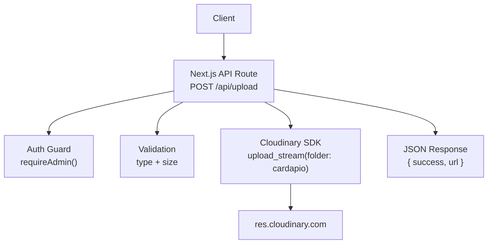
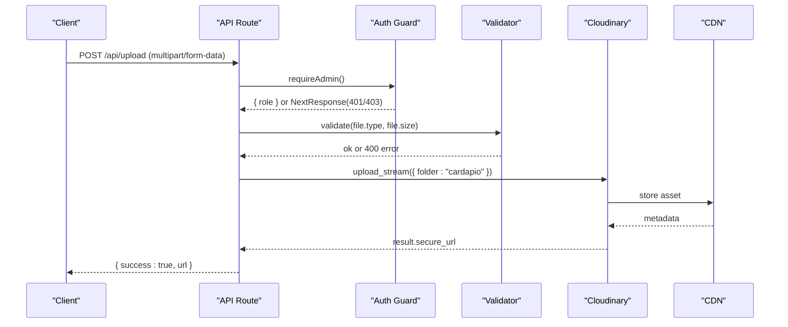
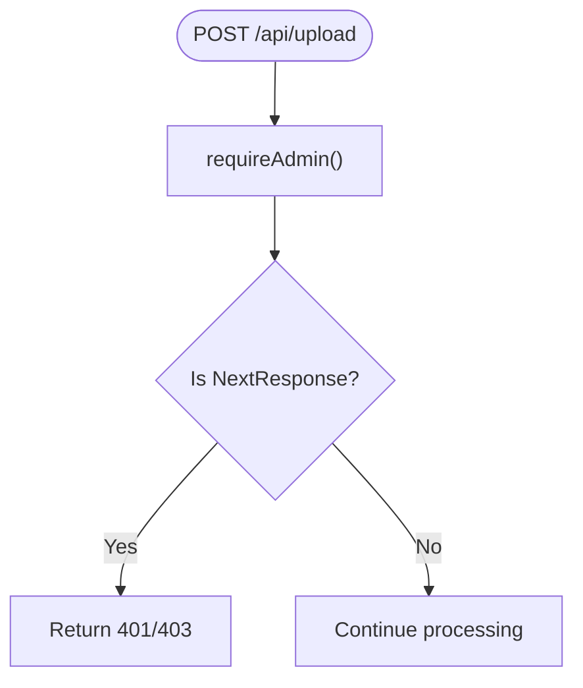
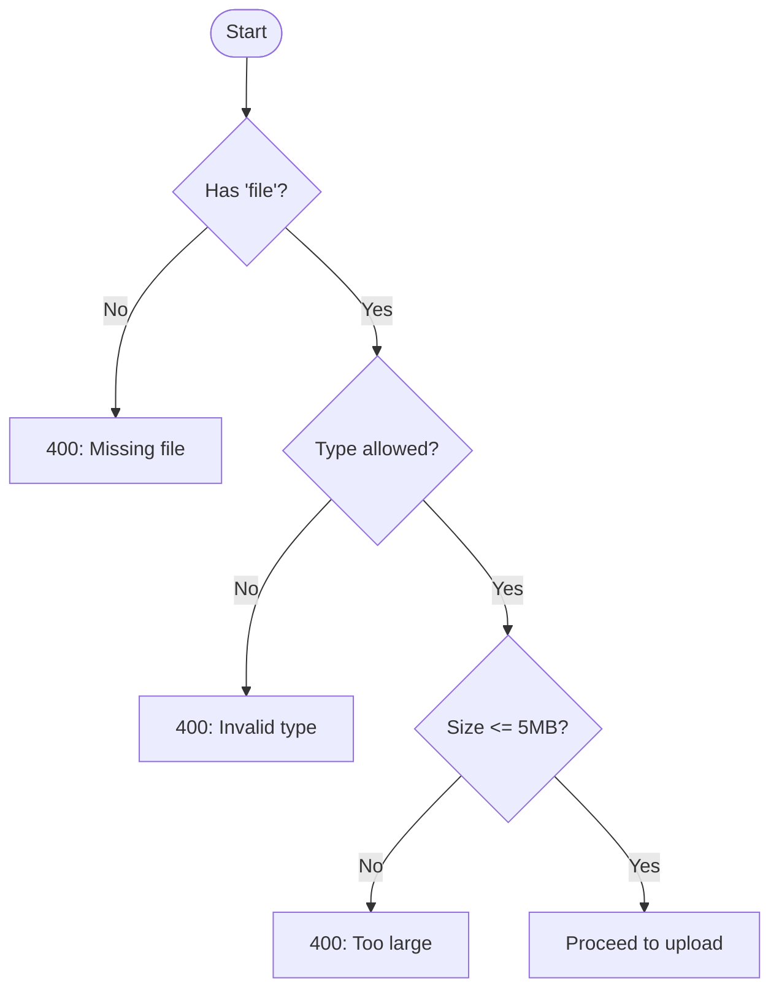
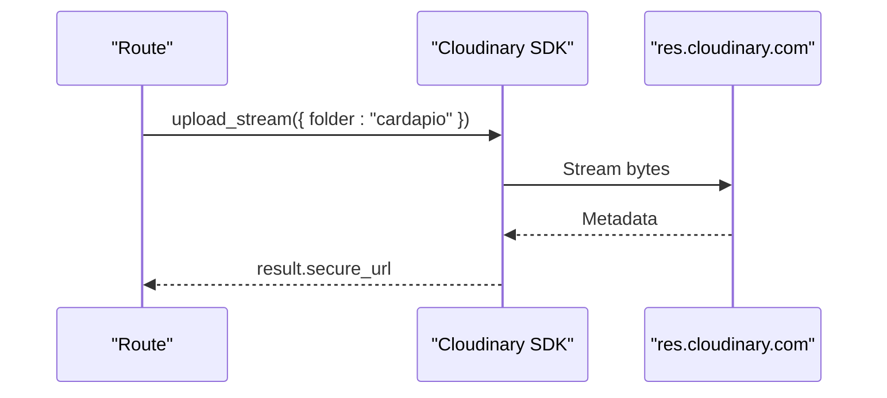
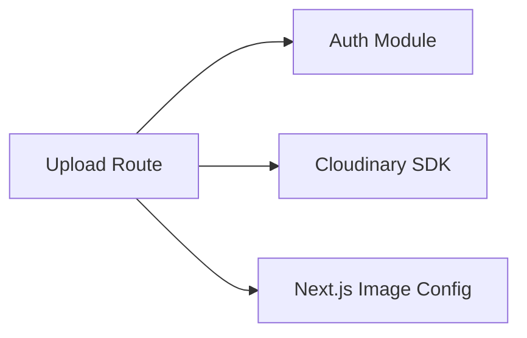

# Upload API

<cite>
**Referenced Files in This Document**
- [route.ts](file://src/app/api/upload/route.ts)
- [auth.ts](file://src/lib/auth.ts)
- [next.config.ts](file://next.config.ts)
- [package.json](file://package.json)
</cite>

## Table of Contents
1. [Introduction](#introduction)
2. [Project Structure](#project-structure)
3. [Core Components](#core-components)
4. [Architecture Overview](#architecture-overview)
5. [Detailed Component Analysis](#detailed-component-analysis)
6. [Dependency Analysis](#dependency-analysis)
7. [Performance Considerations](#performance-considerations)
8. [Troubleshooting Guide](#troubleshooting-guide)
9. [Conclusion](#conclusion)
10. [Appendices](#appendices)

## Introduction
This document provides comprehensive API documentation for the Upload endpoint that handles file uploads and media management with Cloudinary integration. It covers authentication, request/response schemas, validation rules, error handling, security considerations, and client implementation guidance for common scenarios such as product images and profile pictures.

## Project Structure
The upload functionality is implemented as a Next.js App Router API route under the api directory. Authentication is enforced via a shared auth module. Cloudinary is configured using environment variables and used to store uploaded files. The Next.js configuration allows serving optimized images from Cloudinary.

**Diagram sources**
- [route.ts:1-58](file://src/app/api/upload/route.ts#L1-L58)
- [auth.ts:51-78](file://src/lib/auth.ts#L51-L78)
- [next.config.ts:3-11](file://next.config.ts#L3-L11)

**Section sources**
- [route.ts:1-58](file://src/app/api/upload/route.ts#L1-L58)
- [auth.ts:1-82](file://src/lib/auth.ts#L1-L82)
- [next.config.ts:1-14](file://next.config.ts#L1-L14)

## Core Components
- Upload API route: Handles POST requests, enforces admin-only access, validates file type and size, converts the file to a buffer, and uploads to Cloudinary.
- Authentication guard: Ensures only authenticated admins can call the upload endpoint.
- Cloudinary integration: Uses the official SDK to stream files into a dedicated folder.
- Image optimization: Next.js is configured to optimize images served from Cloudinary.

Key responsibilities:
- Request parsing (multipart form data)
- File validation (allowed types, max size)
- Secure storage via Cloudinary
- Returning a secure URL for the uploaded asset

**Section sources**
- [route.ts:14-57](file://src/app/api/upload/route.ts#L14-L57)
- [auth.ts:63-78](file://src/lib/auth.ts#L63-L78)
- [next.config.ts:3-11](file://next.config.ts#L3-L11)

## Architecture Overview
The upload flow authenticates the caller, validates the incoming file, streams it to Cloudinary, and returns a secure URL. Next.js serves optimized images from Cloudinary based on its image optimization settings.

**Diagram sources**
- [route.ts:14-57](file://src/app/api/upload/route.ts#L14-L57)
- [auth.ts:63-78](file://src/lib/auth.ts#L63-L78)

## Detailed Component Analysis

### Endpoint: POST /api/upload
- Purpose: Accepts a single image file and stores it in Cloudinary under a specific folder. Returns a secure URL.
- Authentication: Admin-only. Non-admin or unauthenticated requests are rejected.
- Content-Type: multipart/form-data
- Form field: file (required)
- Allowed MIME types: image/jpeg, image/png, image/webp, image/gif
- Max file size: 5 MB
- Success response: JSON object containing success flag and secure URL
- Error responses:
  - 400 Bad Request: Missing file, invalid type, or oversized file
  - 401 Unauthorized: Not authenticated
  - 403 Forbidden: Authenticated but not admin
  - 500 Internal Server Error: Upload failure or unexpected error

Request schema
- Content-Type: multipart/form-data
- Field: file (binary image)

Response schema
- 200 OK: { success: boolean, url: string }
- 400 Bad Request: { error: string }
- 401 Unauthorized: { error: string }
- 403 Forbidden: { error: string }
- 500 Internal Server Error: { error: string }

Security notes
- Admin-only access enforced by the auth guard.
- File type and size validated server-side before upload.
- Assets stored in a dedicated Cloudinary folder.

Optimization notes
- Next.js is configured to optimize images served from res.cloudinary.com.
- Use Cloudinary URL transformations for resizing/format conversion at delivery time.

Example usage patterns
- Product image upload: Send an image file via multipart/form-data; use the returned URL in product records.
- Profile picture upload: Same endpoint; store the returned URL in user profiles.

Error handling highlights
- Missing file: 400 with descriptive message.
- Invalid format: 400 with allowed formats listed.
- Oversized file: 400 with maximum size limit.
- Network/storage errors: 500 with generic message; logs include detailed error.

**Section sources**
- [route.ts:11-57](file://src/app/api/upload/route.ts#L11-L57)
- [auth.ts:63-78](file://src/lib/auth.ts#L63-L78)

### Authentication Flow
- The endpoint calls the admin requirement guard.
- If not authenticated or not admin, a NextResponse is returned immediately.
- Successful auth yields a role context for potential future extensions.

**Diagram sources**
- [route.ts:14-16](file://src/app/api/upload/route.ts#L14-L16)
- [auth.ts:63-78](file://src/lib/auth.ts#L63-L78)

**Section sources**
- [auth.ts:51-78](file://src/lib/auth.ts#L51-L78)
- [route.ts:14-16](file://src/app/api/upload/route.ts#L14-L16)

### Validation Logic
- Checks presence of file field.
- Validates MIME type against an allowlist.
- Enforces a maximum file size of 5 MB.

**Diagram sources**
- [route.ts:18-38](file://src/app/api/upload/route.ts#L18-L38)

**Section sources**
- [route.ts:18-38](file://src/app/api/upload/route.ts#L18-L38)

### Cloudinary Integration
- Configured via environment variables for cloud name, API key, and secret.
- Files are streamed to Cloudinary into a folder named “cardapio”.
- On success, the secure URL is returned to the client.

**Diagram sources**
- [route.ts:5-9](file://src/app/api/upload/route.ts#L5-L9)
- [route.ts:40-53](file://src/app/api/upload/route.ts#L40-L53)

**Section sources**
- [route.ts:5-9](file://src/app/api/upload/route.ts#L5-L9)
- [route.ts:40-53](file://src/app/api/upload/route.ts#L40-L53)

### Image Optimization and CDN
- Next.js is configured to optimize images from Cloudinary domains.
- Clients can leverage Cloudinary URL transformations to resize, crop, and convert formats on delivery without re-uploading.

**Section sources**
- [next.config.ts:3-11](file://next.config.ts#L3-L11)

## Dependency Analysis
- The upload route depends on:
  - Next.js server utilities for responses
  - Cloudinary SDK for remote storage
  - Shared authentication utilities for access control
- Next.js image optimization supports Cloudinary domains.

**Diagram sources**
- [route.ts:1-3](file://src/app/api/upload/route.ts#L1-L3)
- [next.config.ts:3-11](file://next.config.ts#L3-L11)
- [package.json:17-30](file://package.json#L17-L30)

**Section sources**
- [package.json:17-30](file://package.json#L17-L30)
- [route.ts:1-3](file://src/app/api/upload/route.ts#L1-L3)
- [next.config.ts:3-11](file://next.config.ts#L3-L11)

## Performance Considerations
- Streaming upload: The route streams the file directly to Cloudinary, minimizing memory usage.
- Allowed types: Restricting to common image formats reduces unnecessary processing.
- Size limits: Prevents large payloads from consuming server resources.
- Delivery optimization: Use Cloudinary URL transformations to serve appropriately sized images per device.
- Next.js optimization: Enabled for Cloudinary-hosted images to further improve load times.

[No sources needed since this section provides general guidance]

## Troubleshooting Guide
Common issues and resolutions:
- Missing file field: Ensure the multipart form includes the file field named “file”.
- Invalid file type: Only JPEG, PNG, WEBP, and GIF are accepted. Convert or re-export if necessary.
- File too large: Reduce image size to 5 MB or less before uploading.
- Authentication failures: Verify the session cookie indicates an admin role.
- Upload errors: Check network connectivity and Cloudinary credentials. Server logs contain detailed error information.

Operational tips:
- Inspect response status codes and messages to identify the exact failure point.
- For persistent issues, verify environment variables for Cloudinary configuration.

**Section sources**
- [route.ts:18-57](file://src/app/api/upload/route.ts#L18-L57)
- [auth.ts:63-78](file://src/lib/auth.ts#L63-L78)

## Conclusion
The Upload API provides a secure, validated, and efficient way to store images in Cloudinary with admin-only access. It returns secure URLs suitable for immediate use in your application. Leverage Cloudinary’s URL transformations and Next.js image optimization to deliver fast, responsive media experiences.

[No sources needed since this section summarizes without analyzing specific files]

## Appendices

### Client Implementation Guidelines
- Use multipart/form-data with a field named “file” containing the image binary.
- Handle all error responses (400, 401, 403, 500) and display appropriate messages.
- Store the returned secure URL in your database for later retrieval.
- For dynamic sizing/formatting, append Cloudinary transformations to the returned URL when rendering images.

[No sources needed since this section provides general guidance]