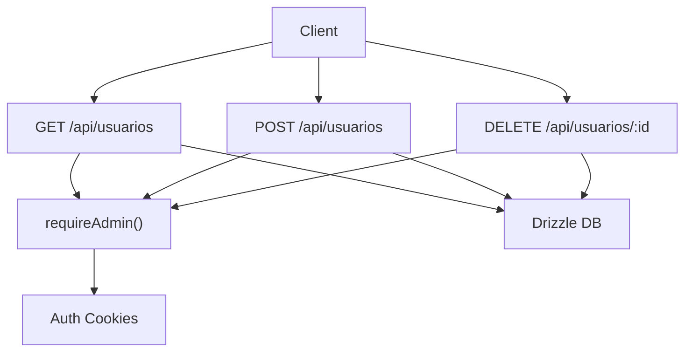
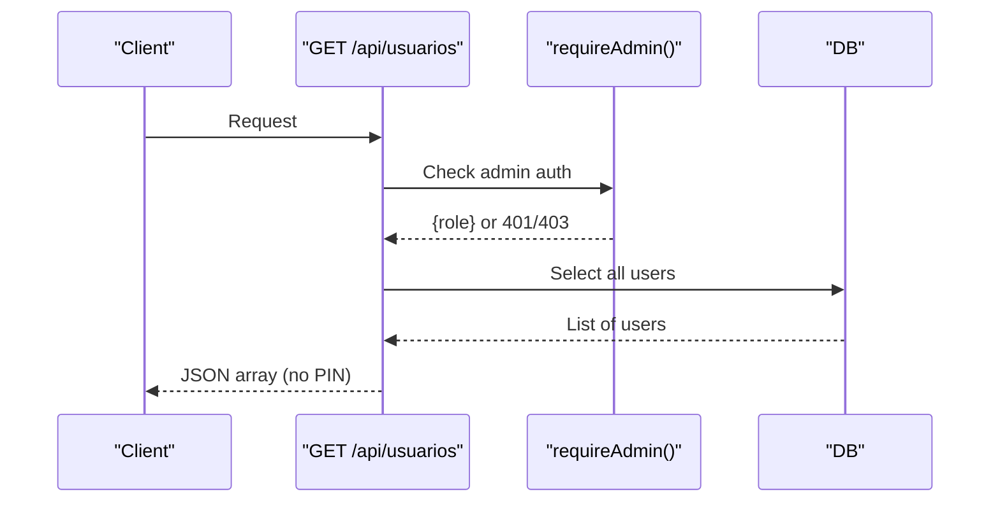
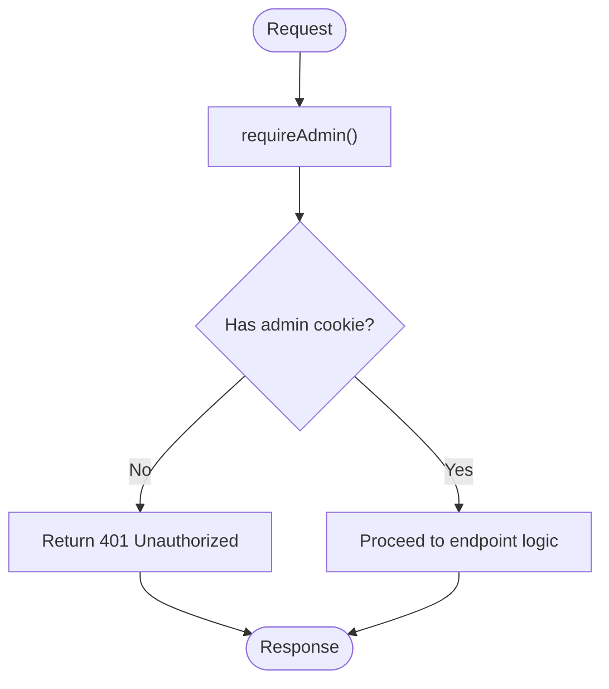
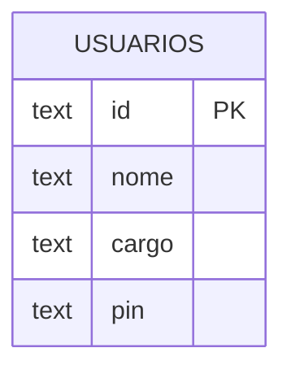
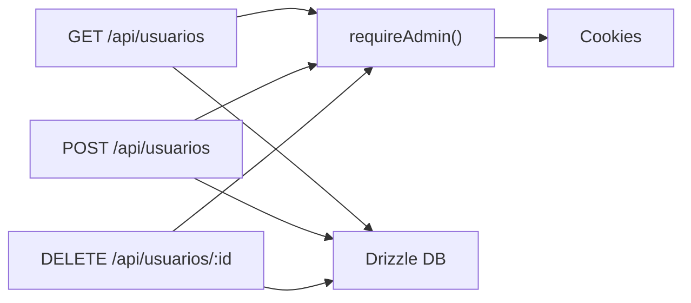

# Users Management API

<cite>
**Referenced Files in This Document**
- [usuarios route.ts](file://src/app/api/usuarios/route.ts)
- [usuario id route.ts](file://src/app/api/usuarios/[id]/route.ts)
- [auth.ts](file://src/lib/auth.ts)
- [schema.ts](file://src/db/schema.ts)
- [db index.ts](file://src/db/index.ts)
- [login route.ts](file://src/app/api/auth/login/route.ts)
</cite>

## Table of Contents
1. [Introduction](#introduction)
2. [Project Structure](#project-structure)
3. [Core Components](#core-components)
4. [Architecture Overview](#architecture-overview)
5. [Detailed Component Analysis](#detailed-component-analysis)
6. [Dependency Analysis](#dependency-analysis)
7. [Performance Considerations](#performance-considerations)
8. [Troubleshooting Guide](#troubleshooting-guide)
9. [Conclusion](#conclusion)

## Introduction
This document provides comprehensive API documentation for the Users Management endpoints that support administrative operations on users (colaboradores). It covers authentication and authorization, request/response schemas, validation rules, error handling, and security considerations. The current implementation supports:
- Listing users
- Creating new users with role assignment
- Deleting users

Note: Update (PUT/PATCH) endpoints are not implemented in this repository; see the “Missing Endpoints” section for guidance.

## Project Structure
The Users Management API is implemented as Next.js Route Handlers under src/app/api/usuarios. Authentication and authorization logic is centralized in src/lib/auth.ts. User data is persisted using Drizzle ORM against a SQLite/Turso database defined in src/db/schema.ts.

**Diagram sources**
- [usuarios route.ts:7-19](file://src/app/api/usuarios/route.ts#L7-L19)
- [usuarios route.ts:21-78](file://src/app/api/usuarios/route.ts#L21-L78)
- [usuario id route.ts:7-22](file://src/app/api/usuarios/[id]/route.ts#L7-L22)
- [auth.ts:63-78](file://src/lib/auth.ts#L63-L78)
- [db index.ts:1-14](file://src/db/index.ts#L1-L14)

**Section sources**
- [usuarios route.ts:1-79](file://src/app/api/usuarios/route.ts#L1-L79)
- [usuario id route.ts:1-23](file://src/app/api/usuarios/[id]/route.ts#L1-L23)
- [auth.ts:1-82](file://src/lib/auth.ts#L1-L82)
- [schema.ts:42-48](file://src/db/schema.ts#L42-L48)
- [db index.ts:1-14](file://src/db/index.ts#L1-L14)

## Core Components
- Authentication and Authorization: requireAdmin enforces admin-only access via cookies set after login.
- Data Model: usuarios table defines user fields used by the API.
- Endpoints: GET, POST, DELETE for listing, creating, and deleting users.

Key responsibilities:
- GET /api/usuarios: Returns all users without sensitive fields.
- POST /api/usuarios: Creates a new user with validated inputs and hashed PIN.
- DELETE /api/usuarios/:id: Deletes a user by ID.

**Section sources**
- [auth.ts:21-37](file://src/lib/auth.ts#L21-L37)
- [auth.ts:63-78](file://src/lib/auth.ts#L63-L78)
- [schema.ts:42-48](file://src/db/schema.ts#L42-L48)
- [usuarios route.ts:7-19](file://src/app/api/usuarios/route.ts#L7-L19)
- [usuarios route.ts:21-78](file://src/app/api/usuarios/route.ts#L21-L78)
- [usuario id route.ts:7-22](file://src/app/api/usuarios/[id]/route.ts#L7-L22)

## Architecture Overview
The API follows a simple layered design:
- Route handlers enforce admin authorization before performing any operation.
- Input validation ensures required fields and constraints.
- Database operations use Drizzle ORM with a consistent schema.
- Sensitive data (PIN) is never returned to clients.

**Diagram sources**
- [usuarios route.ts:7-19](file://src/app/api/usuarios/route.ts#L7-L19)
- [auth.ts:63-78](file://src/lib/auth.ts#L63-L78)
- [db index.ts:1-14](file://src/db/index.ts#L1-L14)

## Detailed Component Analysis

### Authentication and Authorization
- Admin-only endpoints: All user management routes call requireAdmin to ensure only authenticated admins can perform operations.
- Role-based access control: Roles include admin, cozinha, atendente. Only admin is allowed for user management.
- Cookie-based session: After successful login, cookies are set per role.

**Diagram sources**
- [auth.ts:51-78](file://src/lib/auth.ts#L51-L78)

**Section sources**
- [auth.ts:51-78](file://src/lib/auth.ts#L51-L78)
- [login route.ts:62-74](file://src/app/api/auth/login/route.ts#L62-L74)

### GET /api/usuarios
- Purpose: Retrieve a list of all users for administrative review.
- Authorization: Requires admin privileges.
- Query parameters: None currently supported.
- Response: Array of user objects excluding sensitive fields (PIN).
- Error responses:
  - 401 Unauthorized if not authenticated.
  - 403 Forbidden if not admin.
  - 500 Internal Server Error on database or unexpected errors.

Request
- Method: GET
- Path: /api/usuarios
- Headers: Session cookie set by login flow

Response
- Status: 200 OK
- Body: Array of user records with fields: id, nome, cargo

Notes
- Results are ordered by name ascending.
- PIN is excluded from response for security.

**Section sources**
- [usuarios route.ts:7-19](file://src/app/api/usuarios/route.ts#L7-L19)
- [schema.ts:42-48](file://src/db/schema.ts#L42-L48)

### POST /api/usuarios
- Purpose: Create a new user with role assignment.
- Authorization: Requires admin privileges.
- Request body fields:
  - nome (string, required): Display name of the user.
  - cargo (string, required): Role must be one of admin, cozinha, atendente.
  - pin (string, required): Numeric PIN of 4–8 digits.
- Validation:
  - Required fields presence.
  - Role normalization and allowed values.
  - Unique admin constraint: prevents creating a second admin when one already exists.
  - PIN format: numeric, length 4–8.
- Processing:
  - Hashes PIN before storage.
  - Generates unique id.
  - Persists user record.
- Response:
  - 201 Created with user object (excluding PIN).
  - 400 Bad Request for validation failures.
  - 409 Conflict if attempting to create a duplicate admin.
  - 500 Internal Server Error on failure.

Request Example
- Method: POST
- Path: /api/usuarios
- Body:
  - nome: string
  - cargo: "admin" | "cozinha" | "atendente"
  - pin: string (numeric, 4–8 digits)

Response Examples
- Success: 201 with user object (id, nome, cargo)
- Validation error: 400 with error message
- Duplicate admin: 409 with error message
- Server error: 500 with error message

Security Notes
- PIN is hashed using bcrypt before storage.
- PIN is never returned in responses.

**Section sources**
- [usuarios route.ts:21-78](file://src/app/api/usuarios/route.ts#L21-L78)
- [auth.ts:21-37](file://src/lib/auth.ts#L21-L37)
- [schema.ts:42-48](file://src/db/schema.ts#L42-L48)

### DELETE /api/usuarios/:id
- Purpose: Delete an existing user account.
- Authorization: Requires admin privileges.
- Path parameter:
  - id (string): Unique identifier of the user to delete.
- Response:
  - 200 OK with success message.
  - 500 Internal Server Error on failure.

Request Example
- Method: DELETE
- Path: /api/usuarios/{id}

Response Example
- Success: 200 with { success: true, message: "Usuário excluído!" }
- Error: 500 with error message

**Section sources**
- [usuario id route.ts:7-22](file://src/app/api/usuarios/[id]/route.ts#L7-L22)

### Missing Endpoints: PUT /api/usuarios/:id
- Current status: Not implemented in this repository.
- Recommended behavior (for future implementation):
  - Authorization: requireAdmin
  - Path parameter: id (string)
  - Request body fields:
    - nome (optional): Update display name
    - cargo (optional): Update role with normalization and validation
    - pin (optional): If provided, validate and hash before update
  - Response:
    - 200 OK with updated user object (excluding PIN)
    - 400 Bad Request for validation errors
    - 404 Not Found if user does not exist
    - 500 Internal Server Error on failure

[No sources needed since this section describes recommended behavior not present in code]

### Data Model
User entity fields stored in the database:
- id: text primary key
- nome: text
- cargo: text
- pin: text (hashed)

**Diagram sources**
- [schema.ts:42-48](file://src/db/schema.ts#L42-L48)

**Section sources**
- [schema.ts:42-48](file://src/db/schema.ts#L42-L48)

## Dependency Analysis
- Route handlers depend on:
  - Authentication utilities (requireAdmin, normalizeCargo, hashPin)
  - Database client (Drizzle ORM)
  - Schema definitions for queries and inserts
- Login flow sets cookies that enable subsequent admin checks.

**Diagram sources**
- [usuarios route.ts:7-19](file://src/app/api/usuarios/route.ts#L7-L19)
- [usuarios route.ts:21-78](file://src/app/api/usuarios/route.ts#L21-L78)
- [usuario id route.ts:7-22](file://src/app/api/usuarios/[id]/route.ts#L7-L22)
- [auth.ts:51-78](file://src/lib/auth.ts#L51-L78)
- [db index.ts:1-14](file://src/db/index.ts#L1-L14)

**Section sources**
- [usuarios route.ts:1-79](file://src/app/api/usuarios/route.ts#L1-L79)
- [usuario id route.ts:1-23](file://src/app/api/usuarios/[id]/route.ts#L1-L23)
- [auth.ts:1-82](file://src/lib/auth.ts#L1-L82)
- [db index.ts:1-14](file://src/db/index.ts#L1-L14)

## Performance Considerations
- Listing users retrieves all records and sorts by name. For large datasets, consider adding pagination and filtering query parameters to reduce payload size and improve performance.
- Avoid returning sensitive fields (PIN) to minimize exposure and payload size.
- Use indexes on frequently queried fields if the dataset grows significantly (e.g., id, cargo).

[No sources needed since this section provides general guidance]

## Troubleshooting Guide
Common issues and resolutions:
- 401 Unauthorized: Ensure you have logged in successfully and session cookies are present.
- 403 Forbidden: Your session does not have admin privileges; only admins can manage users.
- 400 Bad Request: Validate request body fields:
  - POST requires nome, cargo, pin with correct formats.
  - PIN must be numeric and between 4–8 digits.
- 409 Conflict: Attempting to create a second admin when one already exists.
- 500 Internal Server Error: Check server logs for database or unexpected errors.

Operational tips:
- Verify role normalization and allowed values for cargo.
- Confirm PIN hashing occurs before storage and that PINs are never returned.
- When implementing updates, handle missing user IDs gracefully with 404 responses.

**Section sources**
- [auth.ts:63-78](file://src/lib/auth.ts#L63-L78)
- [usuarios route.ts:21-78](file://src/app/api/usuarios/route.ts#L21-L78)
- [usuario id route.ts:7-22](file://src/app/api/usuarios/[id]/route.ts#L7-L22)

## Conclusion
The Users Management API provides secure administrative capabilities to list, create, and delete users with robust validation and role-based access control. While update operations are not yet implemented, the existing patterns provide a clear path for extending functionality. Security best practices such as PIN hashing, exclusion of sensitive fields, and admin-only enforcement are consistently applied across endpoints.

[No sources needed since this section summarizes without analyzing specific files]