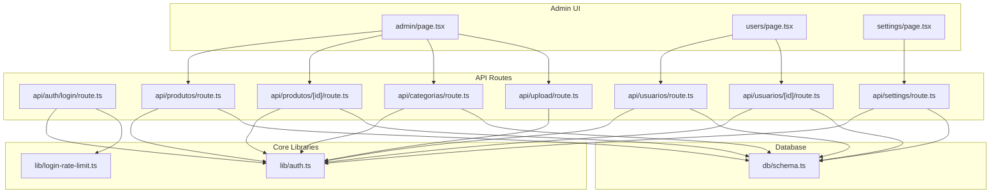
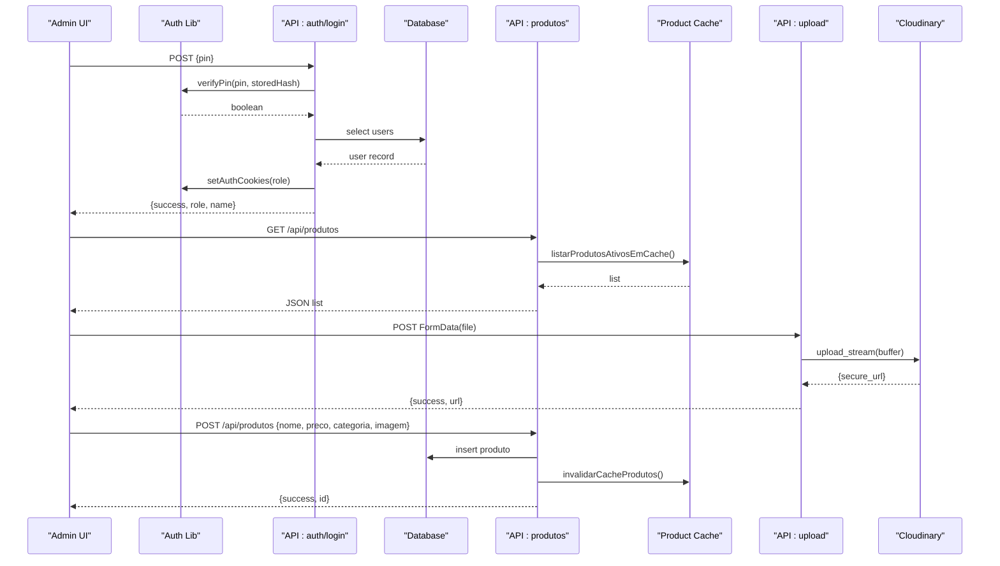
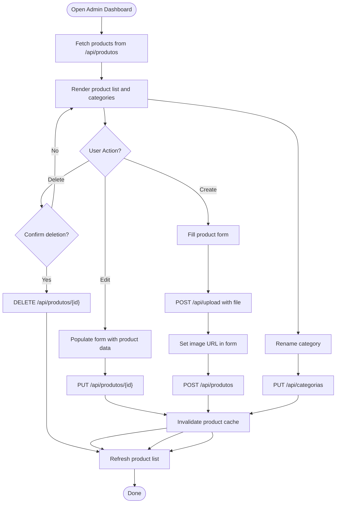
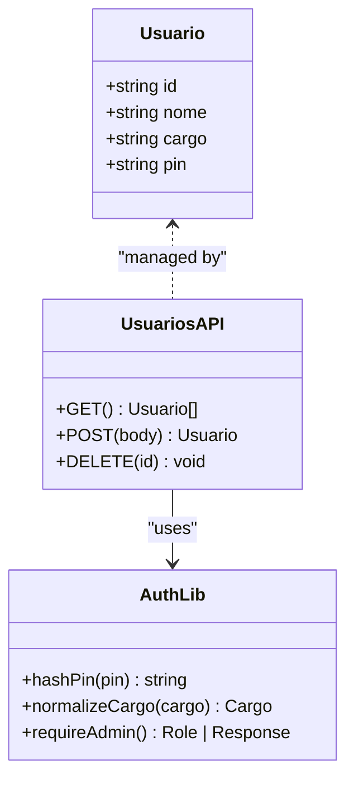
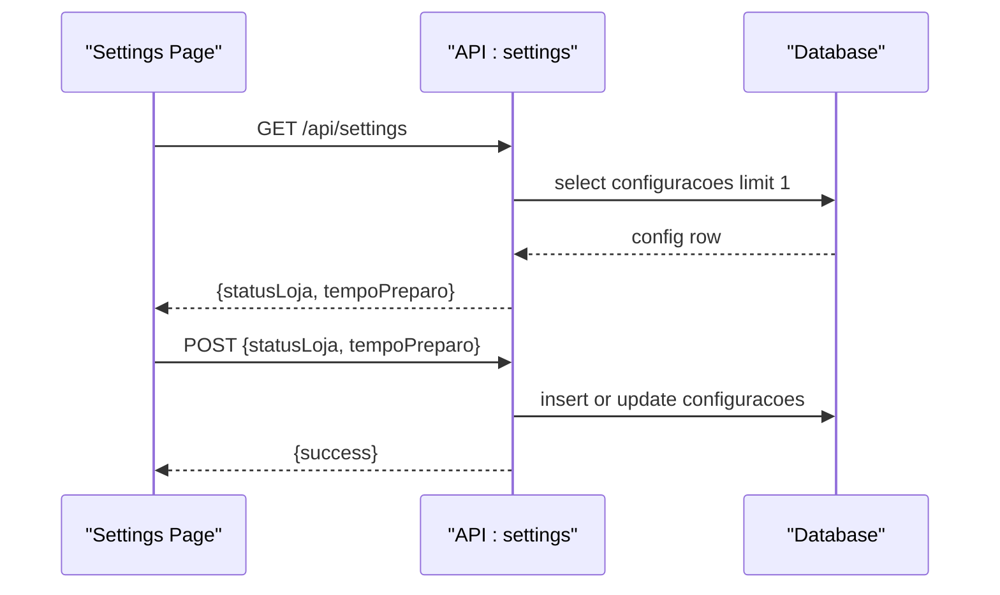
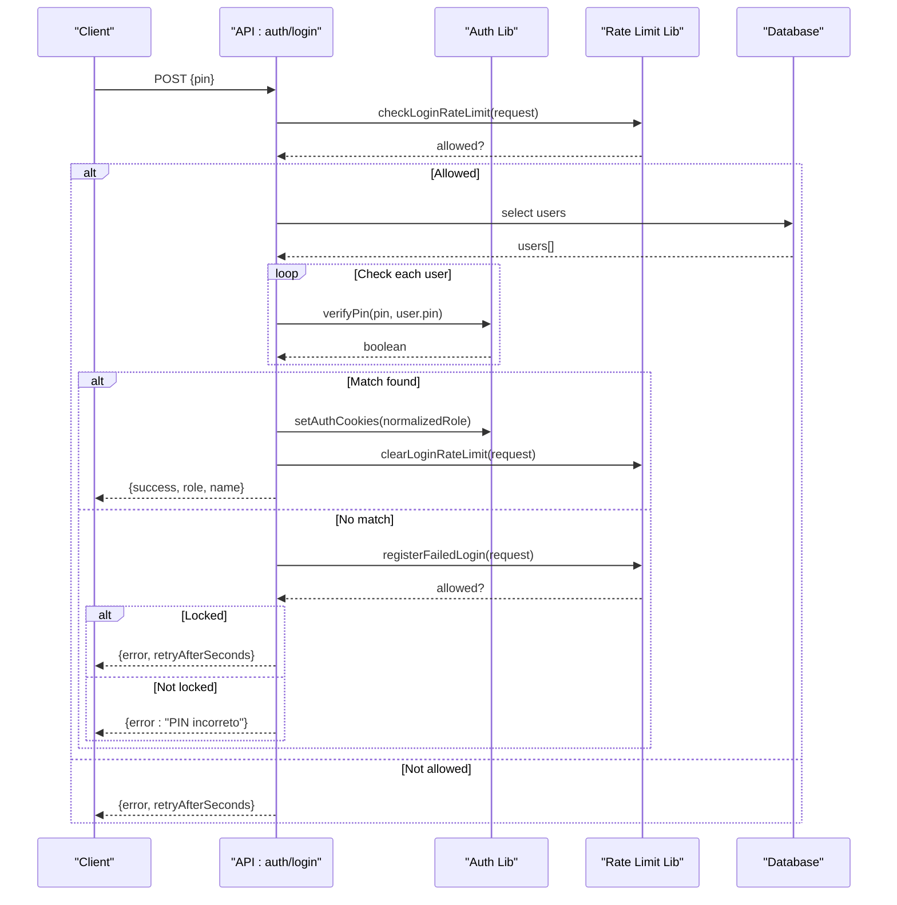
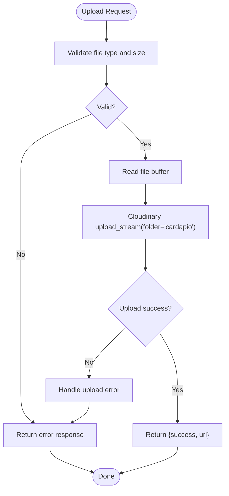
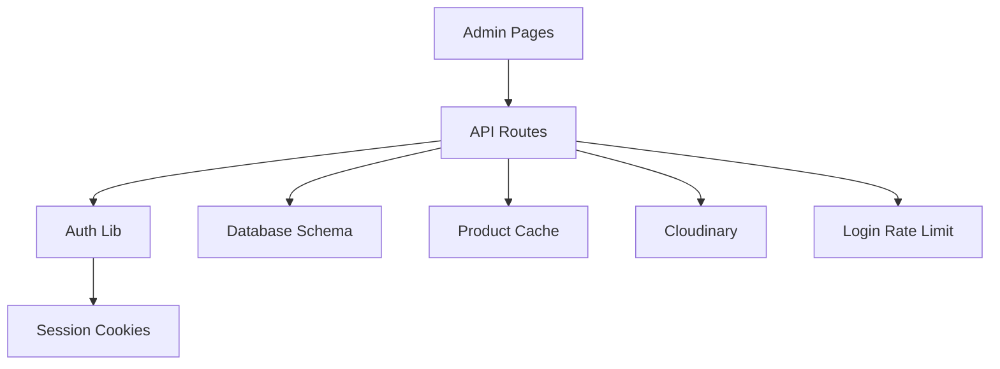

# Admin Panel

<cite>
**Referenced Files in This Document**
- [admin page.tsx](file://src/app/admin/page.tsx)
- [users page.tsx](file://src/app/users/page.tsx)
- [settings page.tsx](file://src/app/settings/page.tsx)
- [API: auth login route.ts](file://src/app/api/auth/login/route.ts)
- [API: produtos route.ts](file://src/app/api/produtos/route.ts)
- [API: produtos [id] route.ts](file://src/app/api/produtos/[id]/route.ts)
- [API: categorias route.ts](file://src/app/api/categorias/route.ts)
- [API: upload route.ts](file://src/app/api/upload/route.ts)
- [API: usuarios route.ts](file://src/app/api/usuarios/route.ts)
- [API: usuarios [id] route.ts](file://src/app/api/usuarios/[id]/route.ts)
- [API: settings route.ts](file://src/app/api/settings/route.ts)
- [Database schema.ts](file://src/db/schema.ts)
- [Auth lib auth.ts](file://src/lib/auth.ts)
- [Login rate limit lib login-rate-limit.ts](file://src/lib/login-rate-limit.ts)
</cite>

## Table of Contents
1. Introduction
2. Project Structure
3. Core Components
4. Architecture Overview
5. Detailed Component Analysis
6. Dependency Analysis
7. Performance Considerations
8. Troubleshooting Guide
9. Conclusion
10. Appendices

## Introduction
This document provides comprehensive documentation for the administrative panel focused on system management and configuration capabilities. It covers the admin dashboard for product management (CRUD operations, image uploads via Cloudinary, and category organization), user management (create, edit, delete with role assignment), system settings (restaurant information, menu customization, operational parameters), and outlines analytics/reporting considerations, bulk operations, data export, maintenance tasks, security practices, audit logging, and backup procedures. It also includes best practices for administrators managing restaurant operations.

## Project Structure
The admin panel is implemented as a Next.js application with client-side pages and server-side API routes. Key areas include:
- Admin UI pages for products, users, and settings
- API routes for authentication, product CRUD, category updates, file upload, user management, and settings
- Database schema definitions using Drizzle ORM
- Authentication utilities and login rate limiting

**Diagram sources**
- [admin page.tsx](file://src/app/admin/page.tsx)
- [users page.tsx](file://src/app/users/page.tsx)
- [settings page.tsx](file://src/app/settings/page.tsx)
- [API: auth login route.ts](file://src/app/api/auth/login/route.ts)
- [API: produtos route.ts](file://src/app/api/produtos/route.ts)
- [API: produtos [id] route.ts](file://src/app/api/produtos/[id]/route.ts)
- [API: categorias route.ts](file://src/app/api/categorias/route.ts)
- [API: upload route.ts](file://src/app/api/upload/route.ts)
- [API: usuarios route.ts](file://src/app/api/usuarios/route.ts)
- [API: usuarios [id] route.ts](file://src/app/api/usuarios/[id]/route.ts)
- [API: settings route.ts](file://src/app/api/settings/route.ts)
- [Auth lib auth.ts](file://src/lib/auth.ts)
- [Login rate limit lib login-rate-limit.ts](file://src/lib/login-rate-limit.ts)
- [Database schema.ts](file://src/db/schema.ts)

**Section sources**
- [admin page.tsx](file://src/app/admin/page.tsx)
- [users page.tsx](file://src/app/users/page.tsx)
- [settings page.tsx](file://src/app/settings/page.tsx)
- [API: auth login route.ts](file://src/app/api/auth/login/route.ts)
- [API: produtos route.ts](file://src/app/api/produtos/route.ts)
- [API: produtos [id] route.ts](file://src/app/api/produtos/[id]/route.ts)
- [API: categorias route.ts](file://src/app/api/categorias/route.ts)
- [API: upload route.ts](file://src/app/api/upload/route.ts)
- [API: usuarios route.ts](file://src/app/api/usuarios/route.ts)
- [API: usuarios [id] route.ts](file://src/app/api/usuarios/[id]/route.ts)
- [API: settings route.ts](file://src/app/api/settings/route.ts)
- [Auth lib auth.ts](file://src/lib/auth.ts)
- [Login rate limit lib login-rate-limit.ts](file://src/lib/login-rate-limit.ts)
- [Database schema.ts](file://src/db/schema.ts)

## Core Components
- Product Management Dashboard: Create, update, delete products; manage categories; upload images to Cloudinary; preview and format currency.
- User Management: Create users with roles (admin, kitchen, attendant); enforce single admin constraint; secure PIN handling; delete users.
- System Settings: Toggle store status; configure preparation time; persist settings to database.
- Authentication: PIN-based login with rate limiting; cookie-based session per role; normalized role mapping.
- Upload Service: Secure image upload to Cloudinary with type and size validation.

**Section sources**
- [admin page.tsx](file://src/app/admin/page.tsx)
- [users page.tsx](file://src/app/users/page.tsx)
- [settings page.tsx](file://src/app/settings/page.tsx)
- [API: auth login route.ts](file://src/app/api/auth/login/route.ts)
- [API: upload route.ts](file://src/app/api/upload/route.ts)
- [API: usuarios route.ts](file://src/app/api/usuarios/route.ts)
- [API: settings route.ts](file://src/app/api/settings/route.ts)
- [Auth lib auth.ts](file://src/lib/auth.ts)
- [Login rate limit lib login-rate-limit.ts](file://src/lib/login-rate-limit.ts)

## Architecture Overview
The admin panel follows a client-server architecture:
- Client pages handle form inputs, state, and user interactions.
- Server API routes enforce authorization, validate inputs, interact with the database, and return JSON responses.
- Authentication uses cookies set after successful PIN verification, with role-specific cookies enabling access control.
- Image uploads are delegated to Cloudinary via a protected endpoint.
- Product listing supports caching and cache invalidation on mutations.

**Diagram sources**
- [API: auth login route.ts](file://src/app/api/auth/login/route.ts)
- [Auth lib auth.ts](file://src/lib/auth.ts)
- [API: produtos route.ts](file://src/app/api/produtos/route.ts)
- [API: upload route.ts](file://src/app/api/upload/route.ts)
- [Database schema.ts](file://src/db/schema.ts)

## Detailed Component Analysis

### Product Management Dashboard
- Features:
  - Create new products with name, description, price, category, and image URL.
  - Edit existing products by populating the form and saving changes.
  - Delete products with confirmation prompt.
  - Category management: rename categories across all products.
  - Image upload: select an image file, send to upload endpoint, receive secure URL, preview before save.
  - Currency formatting for display.
- Data flow:
  - Fetch products from API; populate list and derive available categories.
  - On save, POST or PUT depending on editing mode; invalidate cache on mutation.
  - On delete, remove item and refresh list.
  - On category rename, update all matching products and refresh list.

**Diagram sources**
- [admin page.tsx](file://src/app/admin/page.tsx)
- [API: produtos route.ts](file://src/app/api/produtos/route.ts)
- [API: produtos [id] route.ts](file://src/app/api/produtos/[id]/route.ts)
- [API: categorias route.ts](file://src/app/api/categorias/route.ts)
- [API: upload route.ts](file://src/app/api/upload/route.ts)

**Section sources**
- [admin page.tsx](file://src/app/admin/page.tsx)
- [API: produtos route.ts](file://src/app/api/produtos/route.ts)
- [API: produtos [id] route.ts](file://src/app/api/produtos/[id]/route.ts)
- [API: categorias route.ts](file://src/app/api/categorias/route.ts)
- [API: upload route.ts](file://src/app/api/upload/route.ts)

### User Management
- Features:
  - Create users with name, role, and PIN; enforce PIN length and numeric constraints.
  - Single admin constraint: only one admin can exist at a time.
  - Display active collaborators with masked PINs; delete users with confirmation.
- Security:
  - PIN hashing before storage; normalized role mapping; admin-only endpoints.
- Data flow:
  - Fetch users (excluding PINs); add new user via POST; delete via DELETE; refresh list.

**Diagram sources**
- [API: usuarios route.ts](file://src/app/api/usuarios/route.ts)
- [API: usuarios [id] route.ts](file://src/app/api/usuarios/[id]/route.ts)
- [Auth lib auth.ts](file://src/lib/auth.ts)
- [Database schema.ts](file://src/db/schema.ts)

**Section sources**
- [users page.tsx](file://src/app/users/page.tsx)
- [API: usuarios route.ts](file://src/app/api/usuarios/route.ts)
- [API: usuarios [id] route.ts](file://src/app/api/usuarios/[id]/route.ts)
- [Auth lib auth.ts](file://src/lib/auth.ts)
- [Database schema.ts](file://src/db/schema.ts)

### System Settings
- Features:
  - Toggle store open/closed status.
  - Configure preparation time range.
  - Persist settings to database; default values applied if none exist.
- Data flow:
  - GET settings on load; POST updated values; show success feedback.

**Diagram sources**
- [settings page.tsx](file://src/app/settings/page.tsx)
- [API: settings route.ts](file://src/app/api/settings/route.ts)
- [Database schema.ts](file://src/db/schema.ts)

**Section sources**
- [settings page.tsx](file://src/app/settings/page.tsx)
- [API: settings route.ts](file://src/app/api/settings/route.ts)
- [Database schema.ts](file://src/db/schema.ts)

### Authentication and Rate Limiting
- Features:
  - PIN-based login with bcrypt verification.
  - Cookie-based session per role; normalized role mapping.
  - Rate limiting on failed attempts with temporary lockout.
- Data flow:
  - Validate PIN; check rate limit; set cookies; return user info.
  - Failed attempts tracked and locked out after threshold.

**Diagram sources**
- [API: auth login route.ts](file://src/app/api/auth/login/route.ts)
- [Auth lib auth.ts](file://src/lib/auth.ts)
- [Login rate limit lib login-rate-limit.ts](file://src/lib/login-rate-limit.ts)
- [Database schema.ts](file://src/db/schema.ts)

**Section sources**
- [API: auth login route.ts](file://src/app/api/auth/login/route.ts)
- [Auth lib auth.ts](file://src/lib/auth.ts)
- [Login rate limit lib login-rate-limit.ts](file://src/lib/login-rate-limit.ts)
- [Database schema.ts](file://src/db/schema.ts)

### Image Upload via Cloudinary
- Features:
  - Enforce allowed image types and maximum size.
  - Stream upload to Cloudinary; return secure URL.
  - Protected by admin role requirement.
- Data flow:
  - Client sends FormData with file; server validates and uploads; returns URL.

**Diagram sources**
- [API: upload route.ts](file://src/app/api/upload/route.ts)

**Section sources**
- [API: upload route.ts](file://src/app/api/upload/route.ts)

## Dependency Analysis
- Authorization:
  - All admin endpoints use requireAdmin() to ensure only admin role can perform sensitive operations.
- Database:
  - Drizzle ORM used for schema definition and queries; tables include produtos, usuarios, configuracoes, tentativas_login.
- Caching:
  - Product listing uses cache functions; mutations trigger cache invalidation.
- External Services:
  - Cloudinary integration for image hosting.
- Security:
  - PIN hashing with bcrypt; cookie-based sessions; rate limiting on login attempts.

**Diagram sources**
- [Auth lib auth.ts](file://src/lib/auth.ts)
- [API: auth login route.ts](file://src/app/api/auth/login/route.ts)
- [API: produtos route.ts](file://src/app/api/produtos/route.ts)
- [API: upload route.ts](file://src/app/api/upload/route.ts)
- [Login rate limit lib login-rate-limit.ts](file://src/lib/login-rate-limit.ts)
- [Database schema.ts](file://src/db/schema.ts)

**Section sources**
- [Auth lib auth.ts](file://src/lib/auth.ts)
- [API: auth login route.ts](file://src/app/api/auth/login/route.ts)
- [API: produtos route.ts](file://src/app/api/produtos/route.ts)
- [API: upload route.ts](file://src/app/api/upload/route.ts)
- [Login rate limit lib login-rate-limit.ts](file://src/lib/login-rate-limit.ts)
- [Database schema.ts](file://src/db/schema.ts)

## Performance Considerations
- Product listing uses caching to reduce database load; ensure cache invalidation occurs on all mutations.
- Avoid large payloads in product creation/update; keep descriptions concise.
- Image uploads should be validated server-side to prevent oversized files; consider compression or CDN optimizations.
- Rate limiting protects against brute-force attacks; monitor lockout thresholds and adjust as needed.
- Use efficient queries and avoid unnecessary joins; leverage indexes where applicable.

[No sources needed since this section provides general guidance]

## Troubleshooting Guide
- Common issues:
  - Upload failures: Verify Cloudinary credentials and environment variables; check file type and size limits.
  - Permission errors: Ensure admin role is set correctly; confirm cookies are present and valid.
  - Login lockouts: Review failed attempt tracking; clear rate limit entries if necessary.
  - Settings not saving: Confirm database connectivity and schema alignment; check request payload structure.
- Debugging steps:
  - Inspect network requests and responses in browser dev tools.
  - Check server logs for error messages and stack traces.
  - Validate database records directly using a SQLite client.

**Section sources**
- [API: upload route.ts](file://src/app/api/upload/route.ts)
- [API: auth login route.ts](file://src/app/api/auth/login/route.ts)
- [Login rate limit lib login-rate-limit.ts](file://src/lib/login-rate-limit.ts)
- [API: settings route.ts](file://src/app/api/settings/route.ts)

## Conclusion
The admin panel provides robust functionality for managing products, users, and system settings with strong security measures including role-based access control, PIN hashing, and login rate limiting. Image uploads are securely handled via Cloudinary, and product listings benefit from caching strategies. Administrators should follow best practices for maintaining data integrity, securing access, and optimizing performance.

[No sources needed since this section summarizes without analyzing specific files]

## Appendices

### Analytics and Reporting Guidelines
- Sales monitoring: Implement order aggregation endpoints and dashboards to track revenue, order volume, and trends.
- Popular products: Analyze product sales frequency and rankings; surface insights in admin reports.
- System performance: Monitor API latency, error rates, and cache hit ratios; set up alerts for anomalies.

[No sources needed since this section provides general guidance]

### Bulk Operations and Data Export
- Bulk operations: Add endpoints for batch updates (e.g., category renaming, status toggles) with transactional safety.
- Data export: Provide CSV/JSON export for products, users, and orders; include metadata and timestamps.

[No sources needed since this section provides general guidance]

### Maintenance Tasks
- Regular backups: Schedule automated database backups; store securely offsite.
- Cleanup: Remove unused images from Cloudinary; purge stale rate limit entries.
- Updates: Keep dependencies updated; test changes thoroughly before deployment.

[No sources needed since this section provides general guidance]

### Security Best Practices
- Restrict admin access to trusted IPs when possible.
- Rotate secrets and Cloudinary credentials periodically.
- Audit login attempts and user actions; implement centralized logging.

[No sources needed since this section provides general guidance]