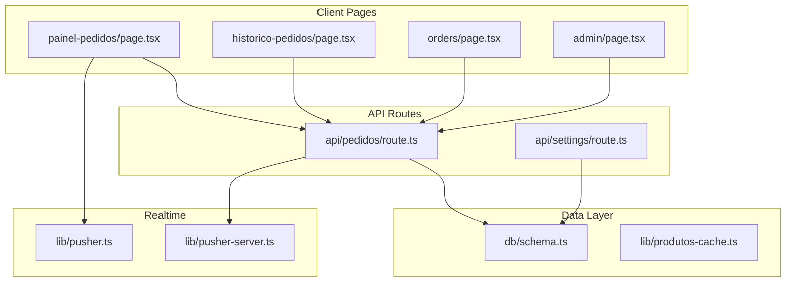
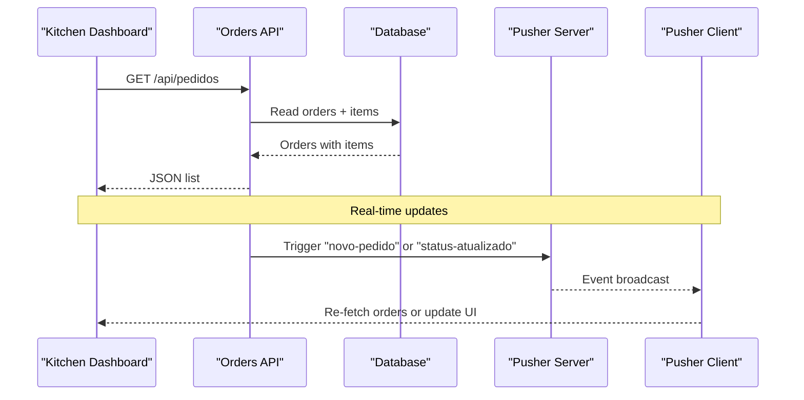
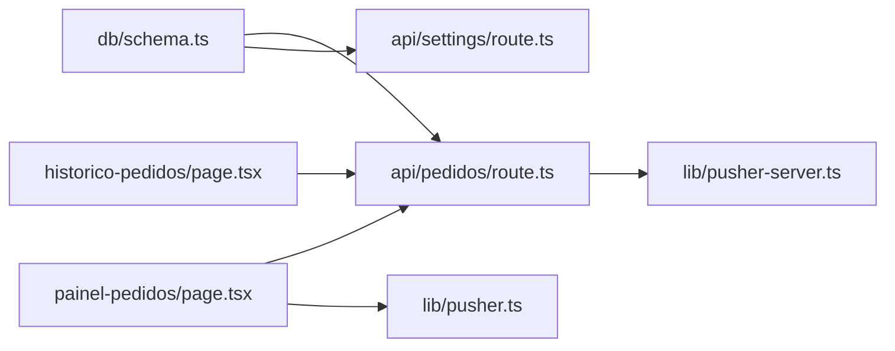
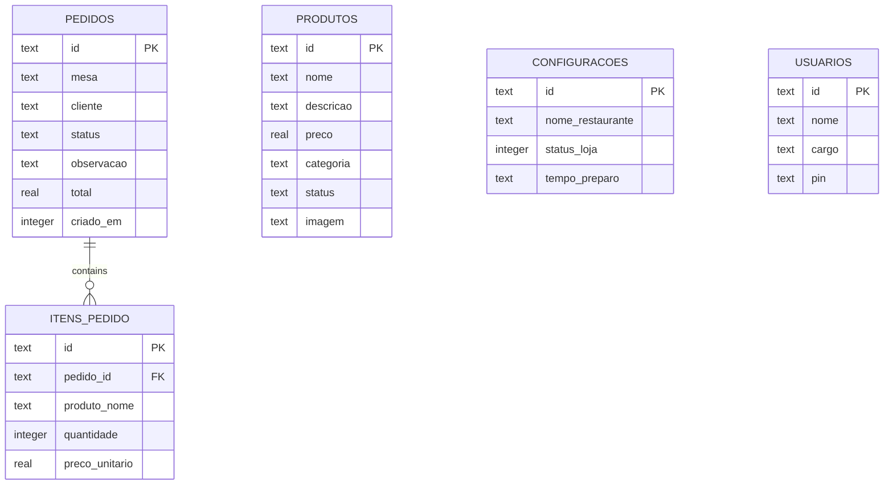

# Analytics & Reporting

<cite>
**Referenced Files in This Document**
- [schema.ts](file://src/db/schema.ts)
- [pedidos route.ts](file://src/app/api/pedidos/route.ts)
- [settings route.ts](file://src/app/api/settings/route.ts)
- [produtos-cache.ts](file://src/lib/produtos-cache.ts)
- [painel-pedidos page.tsx](file://src/app/painel-pedidos/page.tsx)
- [historico-pedidos page.tsx](file://src/app/historico-pedidos/page.tsx)
- [orders page.tsx](file://src/app/orders/page.tsx)
- [admin page.tsx](file://src/app/admin/page.tsx)
- [pusher-server.ts](file://src/lib/pusher-server.ts)
- [pusher.ts](file://src/lib/pusher.ts)
</cite>

## Table of Contents
1. Introduction
2. Project Structure
3. Core Components
4. Architecture Overview
5. Detailed Component Analysis
6. Dependency Analysis
7. Performance Considerations
8. Troubleshooting Guide
9. Conclusion
10. Appendices

## Introduction
This document describes the analytics and reporting capabilities available in the restaurant ordering system. It focuses on how to derive sales analytics, product performance metrics, customer insights, real-time monitoring, export options, visualization components, KPI definitions, data retention considerations, and guidance for making data-driven decisions based on the existing data model and endpoints.

The system currently provides:
- A complete order lifecycle with status transitions and timestamps
- Real-time updates via Pusher for new orders and status changes
- Admin and kitchen dashboards that aggregate current operational state
- A historical view of all orders with filtering by status
- Product catalog management and caching

Where advanced analytics (e.g., charts, automated report scheduling) are not yet implemented, this document outlines recommended approaches using the existing data sources.

## Project Structure
The analytics-relevant parts of the application include:
- Database schema defining orders, order items, products, settings, and users
- API endpoints for creating, reading, updating, and deleting orders; and managing settings
- Client pages for the kitchen dashboard, order history, and customer-facing order tracking
- Real-time signaling via Pusher for live updates

**Diagram sources**
- [painel-pedidos page.tsx:26-76](file://src/app/painel-pedidos/page.tsx#L26-L76)
- [historico-pedidos page.tsx:9-22](file://src/app/historico-pedidos/page.tsx#L9-L22)
- [orders page.tsx:18-28](file://src/app/orders/page.tsx#L18-L28)
- [admin page.tsx:16-53](file://src/app/admin/page.tsx#L16-L53)
- [pedidos route.ts:15-63](file://src/app/api/pedidos/route.ts#L15-L63)
- [settings route.ts:7-13](file://src/app/api/settings/route.ts#L7-L13)
- [schema.ts:14-32](file://src/db/schema.ts#L14-L32)
- [produtos-cache.ts:8-22](file://src/lib/produtos-cache.ts#L8-L22)
- [pusher-server.ts:1-200](file://src/lib/pusher-server.ts#L1-L200)
- [pusher.ts:1-200](file://src/lib/pusher.ts#L1-L200)

**Section sources**
- [schema.ts:14-32](file://src/db/schema.ts#L14-L32)
- [pedidos route.ts:15-63](file://src/app/api/pedidos/route.ts#L15-L63)
- [settings route.ts:7-13](file://src/app/api/settings/route.ts#L7-L13)
- [painel-pedidos page.tsx:26-76](file://src/app/painel-pedidos/page.tsx#L26-L76)
- [historico-pedidos page.tsx:9-22](file://src/app/historico-pedidos/page.tsx#L9-L22)
- [orders page.tsx:18-28](file://src/app/orders/page.tsx#L18-L28)
- [admin page.tsx:16-53](file://src/app/admin/page.tsx#L16-L53)
- [produtos-cache.ts:8-22](file://src/lib/produtos-cache.ts#L8-L22)
- [pusher-server.ts:1-200](file://src/lib/pusher-server.ts#L1-L200)
- [pusher.ts:1-200](file://src/lib/pusher.ts#L1-L200)

## Core Components
- Order data model: Orders and order items store transactional details including totals, timestamps, and itemized quantities/prices. This is the foundation for revenue, volume, and product performance analytics.
- Kitchen dashboard: Displays current orders grouped by status and supports real-time updates. Useful for queue monitoring and throughput analysis.
- Order history: Lists all orders with filters by status, enabling retrospective analysis of trends and patterns.
- Settings: Controls store availability and preparation time estimates, which influence demand and capacity planning.
- Product catalog cache: Caches active products to improve performance; can be leveraged for product performance metrics.

Key implementation references:
- Order creation, listing, update, and deletion: [pedidos route.ts:65-252](file://src/app/api/pedidos/route.ts#L65-L252)
- Settings retrieval and update: [settings route.ts:7-34](file://src/app/api/settings/route.ts#L7-L34)
- Kitchen dashboard real-time flow: [painel-pedidos page.tsx:53-76](file://src/app/painel-pedidos/page.tsx#L53-L76)
- Historical order list and filtering: [historico-pedidos page.tsx:9-22](file://src/app/historico-pedidos/page.tsx#L9-L22)
- Customer order tracking: [orders page.tsx:18-28](file://src/app/orders/page.tsx#L18-L28)
- Product cache usage: [produtos-cache.ts:8-22](file://src/lib/produtos-cache.ts#L8-L22)

**Section sources**
- [pedidos route.ts:65-252](file://src/app/api/pedidos/route.ts#L65-L252)
- [settings route.ts:7-34](file://src/app/api/settings/route.ts#L7-L34)
- [painel-pedidos page.tsx:53-76](file://src/app/painel-pedidos/page.tsx#L53-L76)
- [historico-pedidos page.tsx:9-22](file://src/app/historico-pedidos/page.tsx#L9-L22)
- [orders page.tsx:18-28](file://src/app/orders/page.tsx#L18-L28)
- [produtos-cache.ts:8-22](file://src/lib/produtos-cache.ts#L8-L22)

## Architecture Overview
The analytics pipeline relies on the order lifecycle and real-time signals:
- Clients fetch orders from the API and render dashboards or histories
- The API persists orders and items into the database and emits Pusher events for live updates
- Dashboards subscribe to Pusher channels to refresh without manual reloads

**Diagram sources**
- [pedidos route.ts:147-180](file://src/app/api/pedidos/route.ts#L147-L180)
- [pedidos route.ts:214-228](file://src/app/api/pedidos/route.ts#L214-L228)
- [painel-pedidos page.tsx:53-76](file://src/app/painel-pedidos/page.tsx#L53-L76)
- [pusher-server.ts:1-200](file://src/lib/pusher-server.ts#L1-L200)
- [pusher.ts:1-200](file://src/lib/pusher.ts#L1-L200)

## Detailed Component Analysis

### Sales Analytics
- Revenue tracking: Sum the total field across orders within a selected period. Use the order creation timestamp to filter by date ranges.
- Order volume trends: Count orders per day/hour/week/month using created timestamps.
- Peak hour analysis: Aggregate order counts by hour-of-day to identify busy periods.

Implementation notes:
- Data source: Orders and order items stored in the database schema.
- Aggregation logic should be implemented server-side for efficiency and security.
- Time-based grouping uses the order creation timestamp field.

Recommended chart types:
- Line chart for revenue over time
- Bar chart for daily/weekly order volume
- Heatmap or bar chart for peak hours

**Section sources**
- [schema.ts:14-32](file://src/db/schema.ts#L14-L32)
- [pedidos route.ts:15-63](file://src/app/api/pedidos/route.ts#L15-L63)

### Product Performance Metrics
- Popular items: Count quantity sold per product name from order items.
- Sales velocity: Measure units sold per time unit (hour/day) per product.
- Inventory turnover: Not directly tracked; can approximate by correlating product sales velocity with stock assumptions if inventory fields are added later.

Implementation notes:
- Group by product name and sum quantities from order items.
- Combine with timestamps to compute velocity over time windows.
- Product catalog caching can speed up product metadata lookups when building reports.

Recommended chart types:
- Top-N bar chart for popular items
- Area chart for sales velocity over time

**Section sources**
- [schema.ts:25-32](file://src/db/schema.ts#L25-L32)
- [produtos-cache.ts:8-22](file://src/lib/produtos-cache.ts#L8-L22)

### Customer Analytics
- Order patterns: Analyze frequency of orders per customer name and time intervals.
- Repeat customers: Identify customers with multiple orders within a defined window.
- Average order value: Compute average of order totals per customer or overall.

Implementation notes:
- Use the customer name field and order totals from the orders table.
- For repeat customer detection, group by customer and count orders over time windows.
- Ensure privacy and compliance when handling customer identifiers.

Recommended chart types:
- Cohort analysis for repeat purchase rates
- Distribution histogram for average order values

**Section sources**
- [schema.ts:14-32](file://src/db/schema.ts#L14-L32)

### Real-Time Monitoring
- Current orders: Kitchen dashboard displays orders by status with real-time updates via Pusher.
- Kitchen queue status: Columns for pending, preparing, ready states enable visual queue management.
- System performance indicators: Monitor API response times and Pusher event delivery latency; track error rates in logs.

Implementation notes:
- Subscribe to Pusher channel and listen for new order and status update events.
- Refresh order lists upon receiving events to keep UI consistent.

Recommended chart types:
- Live counters for each status column
- Queue depth over time (area chart)

**Section sources**
- [painel-pedidos page.tsx:53-76](file://src/app/painel-pedidos/page.tsx#L53-L76)
- [pedidos route.ts:214-228](file://src/app/api/pedidos/route.ts#L214-L228)
- [pusher-server.ts:1-200](file://src/lib/pusher-server.ts#L1-L200)
- [pusher.ts:1-200](file://src/lib/pusher.ts#L1-L200)

### Export Functionality and Automated Reports
Current state:
- No built-in export or scheduled report delivery is implemented in the codebase.

Recommended approach:
- Add an endpoint to generate CSV/JSON exports of orders and aggregated metrics.
- Implement server-side aggregation queries for common reports (daily sales, top products).
- Schedule jobs (e.g., cron) to email PDF/CSV reports at configured intervals.

**Section sources**
- [pedidos route.ts:15-63](file://src/app/api/pedidos/route.ts#L15-L63)

### Data Visualization Components and Interactive Filtering
Current state:
- Dashboards present tabular and card-based views with status filters and refresh actions.
- No dedicated chart libraries are used in the analyzed files.

Recommendations:
- Integrate a charting library to visualize trends and distributions.
- Add interactive filters for date ranges, statuses, and product categories.
- Provide drill-down capabilities from summary metrics to detailed order lists.

**Section sources**
- [historico-pedidos page.tsx:9-22](file://src/app/historico-pedidos/page.tsx#L9-L22)
- [painel-pedidos page.tsx:157-267](file://src/app/painel-pedidos/page.tsx#L157-L267)

### KPI Definitions and Calculation Methods
- Total Revenue: Sum of order totals within the selected period.
- Order Volume: Count of orders within the selected period.
- Average Order Value: Total revenue divided by number of orders.
- Peak Hours: Hours with highest order volume.
- Top Products: Products with highest total quantity sold.
- Repeat Customer Rate: Percentage of customers with more than one order in the period.
- Preparation Time: Configured estimate from settings; compare against actual fulfillment times if captured.

Data sources:
- Orders and order items for revenue, volume, and product metrics
- Settings for preparation time estimates

**Section sources**
- [schema.ts:14-32](file://src/db/schema.ts#L14-L32)
- [settings route.ts:7-34](file://src/app/api/settings/route.ts#L7-L34)

### Data Retention Policies
Current state:
- No explicit retention policy is enforced in the codebase.
- Data persists in the SQLite database until manually deleted.

Recommendations:
- Implement archival strategies for older orders (e.g., move to cold storage after a threshold).
- Add cleanup jobs to delete or anonymize sensitive data beyond retention limits.
- Document retention policies aligned with business and compliance requirements.

**Section sources**
- [schema.ts:14-32](file://src/db/schema.ts#L14-L32)

## Dependency Analysis
The analytics features depend on:
- Database schema for orders, items, and settings
- API routes for order CRUD and settings management
- Real-time signaling via Pusher for live updates
- Client pages for rendering dashboards and histories

**Diagram sources**
- [schema.ts:14-32](file://src/db/schema.ts#L14-L32)
- [pedidos route.ts:15-63](file://src/app/api/pedidos/route.ts#L15-L63)
- [settings route.ts:7-13](file://src/app/api/settings/route.ts#L7-L13)
- [painel-pedidos page.tsx:53-76](file://src/app/painel-pedidos/page.tsx#L53-L76)
- [pusher-server.ts:1-200](file://src/lib/pusher-server.ts#L1-L200)
- [pusher.ts:1-200](file://src/lib/pusher.ts#L1-L200)

**Section sources**
- [schema.ts:14-32](file://src/db/schema.ts#L14-L32)
- [pedidos route.ts:15-63](file://src/app/api/pedidos/route.ts#L15-L63)
- [settings route.ts:7-13](file://src/app/api/settings/route.ts#L7-L13)
- [painel-pedidos page.tsx:53-76](file://src/app/painel-pedidos/page.tsx#L53-L76)
- [pusher-server.ts:1-200](file://src/lib/pusher-server.ts#L1-L200)
- [pusher.ts:1-200](file://src/lib/pusher.ts#L1-L200)

## Performance Considerations
- Use server-side aggregation for large datasets to avoid heavy client computations.
- Leverage caching for product catalogs to reduce database load during report generation.
- Optimize queries by indexing frequently filtered fields (e.g., timestamps, status).
- Monitor Pusher event throughput and handle reconnections gracefully on the client.

[No sources needed since this section provides general guidance]

## Troubleshooting Guide
Common issues and resolutions:
- Real-time updates not appearing:
  - Verify Pusher channel subscription and event binding on the client.
  - Confirm server triggers are emitted after successful order operations.
- Incorrect totals or missing items:
  - Validate order creation transactions ensure both orders and items are persisted atomically.
- Settings not applied:
  - Check settings API responses and ensure admin authentication is successful.

Operational references:
- Real-time event binding and re-fetching: [painel-pedidos page.tsx:53-76](file://src/app/painel-pedidos/page.tsx#L53-L76)
- Order creation transaction and Pusher trigger: [pedidos route.ts:147-180](file://src/app/api/pedidos/route.ts#L147-L180)
- Status update and Pusher trigger: [pedidos route.ts:214-228](file://src/app/api/pedidos/route.ts#L214-L228)
- Settings retrieval and update: [settings route.ts:7-34](file://src/app/api/settings/route.ts#L7-L34)

**Section sources**
- [painel-pedidos page.tsx:53-76](file://src/app/painel-pedidos/page.tsx#L53-L76)
- [pedidos route.ts:147-180](file://src/app/api/pedidos/route.ts#L147-L180)
- [pedidos route.ts:214-228](file://src/app/api/pedidos/route.ts#L214-L228)
- [settings route.ts:7-34](file://src/app/api/settings/route.ts#L7-L34)

## Conclusion
The system provides a solid foundation for analytics through its order lifecycle, real-time updates, and administrative dashboards. While advanced visualization and automated reporting are not yet implemented, the existing data model and APIs support deriving key metrics such as revenue, order volume, peak hours, product performance, and customer insights. Adding charting, export endpoints, and scheduled reporting will enhance decision-making capabilities for restaurant operations.

[No sources needed since this section summarizes without analyzing specific files]

## Appendices

### Data Model Reference

**Diagram sources**
- [schema.ts:4-56](file://src/db/schema.ts#L4-L56)