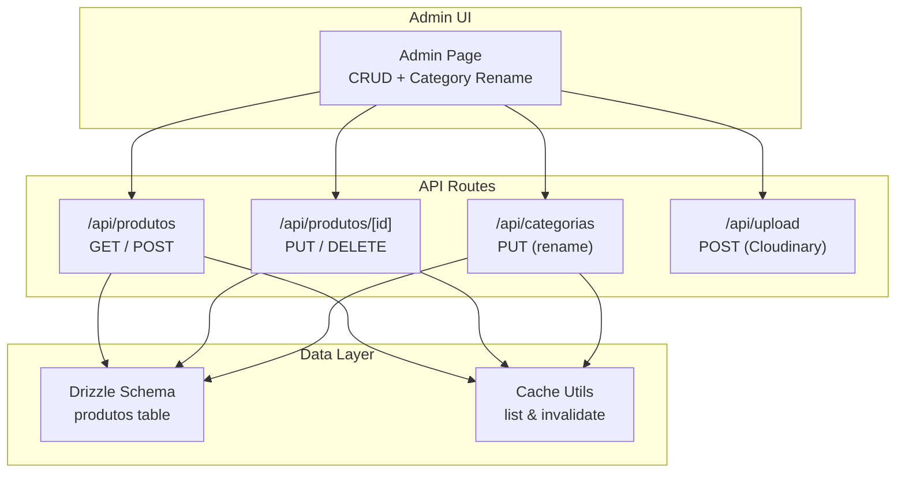
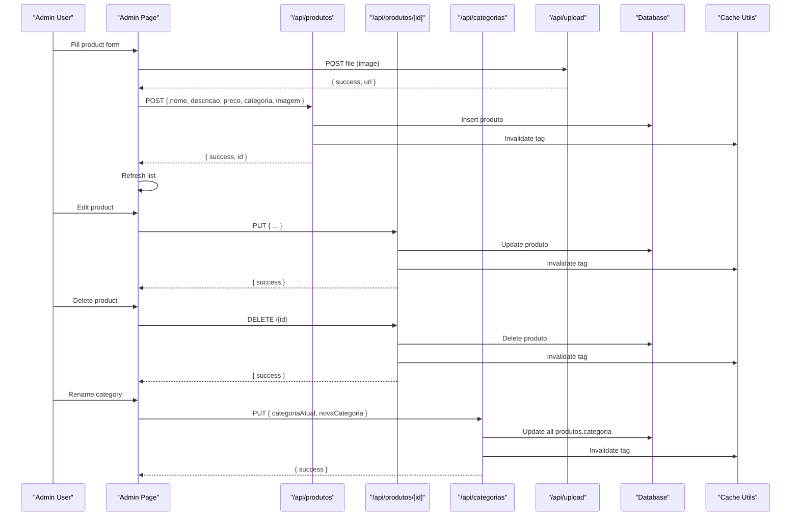
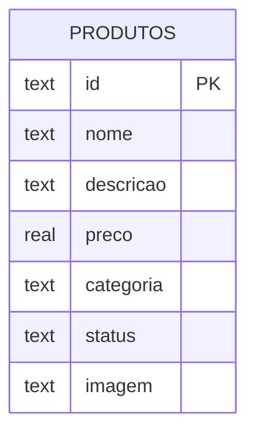
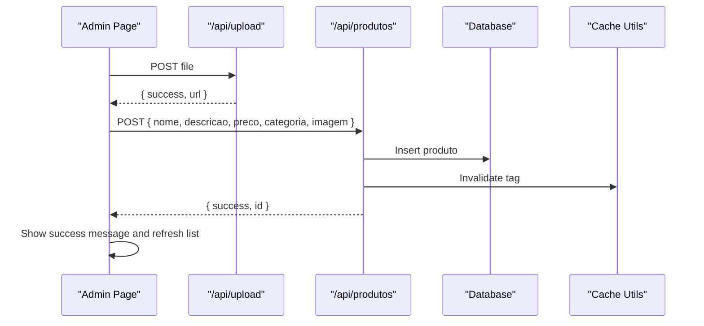
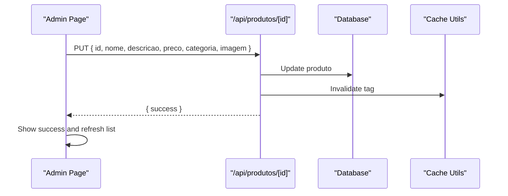
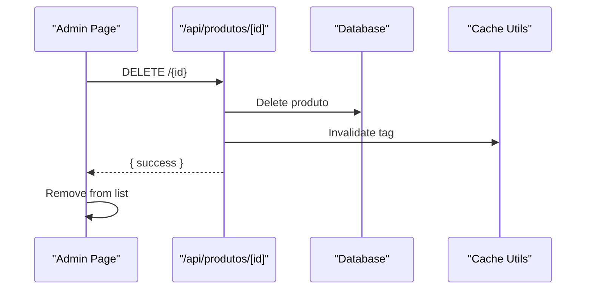
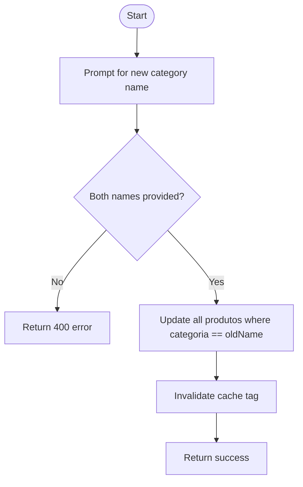
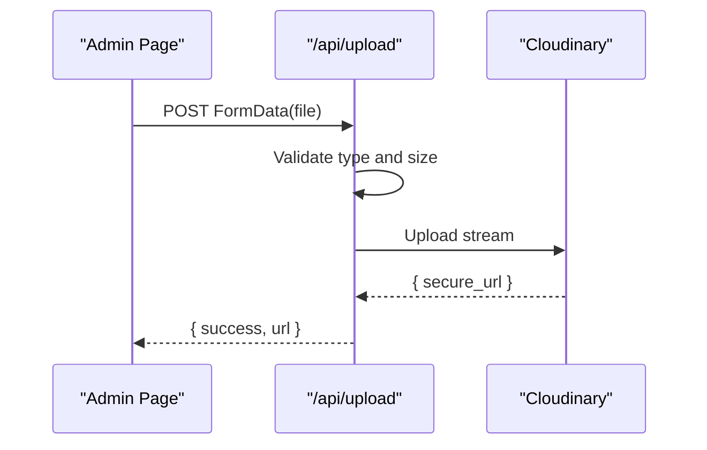
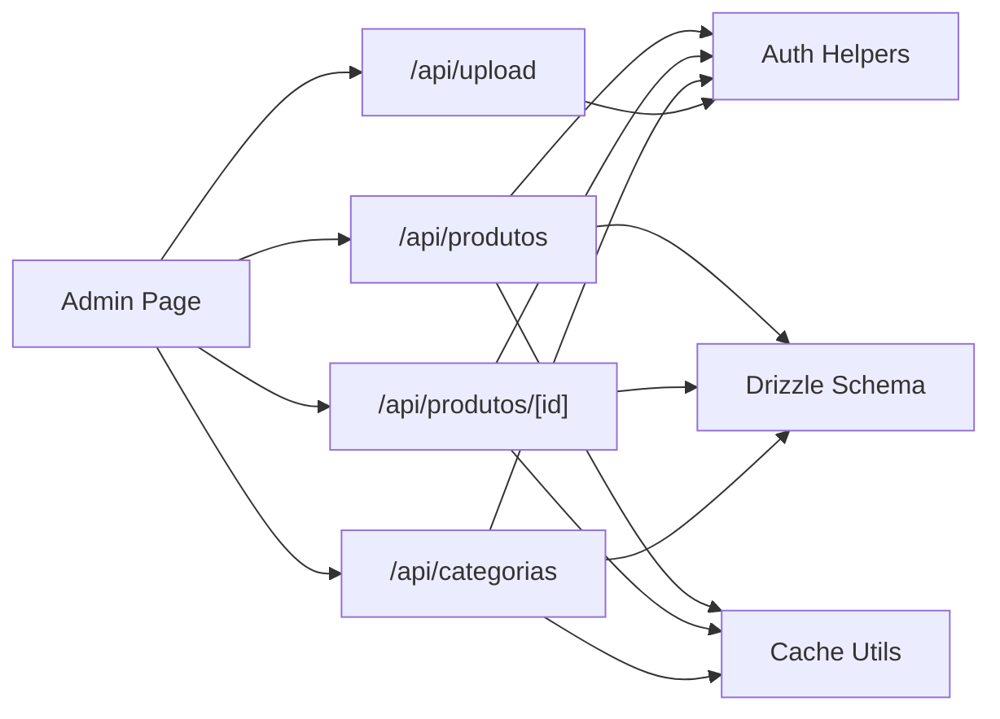

# Product Management

<cite>
**Referenced Files in This Document**
- [admin page](file://src/app/admin/page.tsx)
- [products API route](file://src/app/api/produtos/route.ts)
- [product by ID API route](file://src/app/api/produtos/[id]/route.ts)
- [categories API route](file://src/app/api/categorias/route.ts)
- [upload API route](file://src/app/api/upload/route.ts)
- [database schema](file://src/db/schema.ts)
- [products cache utilities](file://src/lib/produtos-cache.ts)
- [product card component](file://src/components/CardProduto.tsx)
</cite>

## Table of Contents
1. Introduction
2. Project Structure
3. Core Components
4. Architecture Overview
5. Detailed Component Analysis
6. Dependency Analysis
7. Performance Considerations
8. Troubleshooting Guide
9. Conclusion

## Introduction
This document explains the product management system within the admin panel for managing restaurant menu items. It covers creating, editing, and deleting products; the product data model (name, description, price, category, image); image upload via Cloudinary; category management with rename propagation; and the admin listing interface. It also documents validation rules, error handling, user feedback, and best practices for maintaining an organized menu catalog.

## Project Structure
The product management feature spans a Next.js App Router structure:
- Admin UI: a client-side page that renders forms, lists, and actions for CRUD operations on products and categories.
- API routes: server endpoints for listing, creating, updating, deleting products; renaming categories; and uploading images to Cloudinary.
- Data layer: Drizzle ORM schema and caching utilities for efficient reads and cache invalidation.
- Shared components: reusable UI for displaying product cards.

**Diagram sources**
- [admin page:1-383](file://src/app/admin/page.tsx#L1-L383)
- [products API route:1-53](file://src/app/api/produtos/route.ts#L1-L53)
- [product by ID API route:1-64](file://src/app/api/produtos/[id]/route.ts#L1-L64)
- [categories API route:1-28](file://src/app/api/categorias/route.ts#L1-L28)
- [upload API route:1-58](file://src/app/api/upload/route.ts#L1-L58)
- [database schema:1-56](file://src/db/schema.ts#L1-L56)
- [products cache utilities:1-23](file://src/lib/produtos-cache.ts#L1-L23)

**Section sources**
- [admin page:1-383](file://src/app/admin/page.tsx#L1-L383)
- [products API route:1-53](file://src/app/api/produtos/route.ts#L1-L53)
- [product by ID API route:1-64](file://src/app/api/produtos/[id]/route.ts#L1-L64)
- [categories API route:1-28](file://src/app/api/categorias/route.ts#L1-L28)
- [upload API route:1-58](file://src/app/api/upload/route.ts#L1-L58)
- [database schema:1-56](file://src/db/schema.ts#L1-L56)
- [products cache utilities:1-23](file://src/lib/produtos-cache.ts#L1-L23)

## Core Components
- Admin page: Provides the full UI for adding/editing products, uploading images, listing items, and renaming categories. It orchestrates API calls and updates local state accordingly.
- Products API:
  - GET: Returns all products for admins or only active ones for non-admins. Uses cached queries with tag-based invalidation.
  - POST: Creates a new product with validation and default values.
- Product by ID API:
  - PUT: Updates an existing product with validation.
  - DELETE: Removes a product by ID.
- Categories API:
  - PUT: Renames a category across all associated products.
- Upload API:
  - POST: Validates and uploads images to Cloudinary, returning a secure URL.
- Cache utilities:
  - Provide cached reads for active/all products and a function to invalidate cache tags on writes.

**Section sources**
- [admin page:1-383](file://src/app/admin/page.tsx#L1-L383)
- [products API route:1-53](file://src/app/api/produtos/route.ts#L1-L53)
- [product by ID API route:1-64](file://src/app/api/produtos/[id]/route.ts#L1-L64)
- [categories API route:1-28](file://src/app/api/categorias/route.ts#L1-L28)
- [upload API route:1-58](file://src/app/api/upload/route.ts#L1-L58)
- [products cache utilities:1-23](file://src/lib/produtos-cache.ts#L1-L23)

## Architecture Overview
The admin flow uses a client-server architecture with Next.js App Router:
- The admin page performs client-side form interactions and triggers API calls.
- API routes enforce admin authentication, validate inputs, interact with the database via Drizzle, and manage cache invalidation.
- Image uploads are delegated to Cloudinary through a dedicated endpoint.

**Diagram sources**
- [admin page:1-383](file://src/app/admin/page.tsx#L1-L383)
- [products API route:1-53](file://src/app/api/produtos/route.ts#L1-L53)
- [product by ID API route:1-64](file://src/app/api/produtos/[id]/route.ts#L1-L64)
- [categories API route:1-28](file://src/app/api/categorias/route.ts#L1-L28)
- [upload API route:1-58](file://src/app/api/upload/route.ts#L1-L58)
- [products cache utilities:1-23](file://src/lib/produtos-cache.ts#L1-L23)

## Detailed Component Analysis

### Product Data Model
The product entity is defined in the database schema with the following fields:
- id: unique identifier
- nome: product name
- descricao: optional description
- preco: numeric price
- categoria: category label
- status: visibility flag (default "Ativo")
- imagem: image URL (defaults to a placeholder when not provided)

**Diagram sources**
- [database schema:1-56](file://src/db/schema.ts#L1-L56)

**Section sources**
- [database schema:1-56](file://src/db/schema.ts#L1-L56)

### Create Product Workflow
- Client validates required fields (name and price).
- Optional image upload via /api/upload returns a secure URL.
- POST to /api/produtos creates the record with defaults for missing fields.
- Cache is invalidated so subsequent reads reflect the new item.

**Diagram sources**
- [admin page:105-146](file://src/app/admin/page.tsx#L105-L146)
- [upload API route:14-58](file://src/app/api/upload/route.ts#L14-L58)
- [products API route:18-53](file://src/app/api/produtos/route.ts#L18-L53)
- [products cache utilities:1-23](file://src/lib/produtos-cache.ts#L1-L23)

**Section sources**
- [admin page:105-146](file://src/app/admin/page.tsx#L105-L146)
- [products API route:18-53](file://src/app/api/produtos/route.ts#L18-L53)
- [upload API route:14-58](file://src/app/api/upload/route.ts#L14-L58)

### Update Product Workflow
- Client populates edit form with existing product data.
- PUT to /api/produtos/{id} updates fields with validation.
- Cache is invalidated to ensure consistency.

**Diagram sources**
- [admin page:55-74](file://src/app/admin/page.tsx#L55-L74)
- [product by ID API route:8-45](file://src/app/api/produtos/[id]/route.ts#L8-L45)
- [products cache utilities:1-23](file://src/lib/produtos-cache.ts#L1-L23)

**Section sources**
- [product by ID API route:8-45](file://src/app/api/produtos/[id]/route.ts#L8-L45)

### Delete Product Workflow
- Client confirms deletion.
- DELETE to /api/produtos/{id} removes the record.
- Cache is invalidated.

**Diagram sources**
- [admin page:148-168](file://src/app/admin/page.tsx#L148-L168)
- [product by ID API route:47-64](file://src/app/api/produtos/[id]/route.ts#L47-L64)
- [products cache utilities:1-23](file://src/lib/produtos-cache.ts#L1-L23)

**Section sources**
- [admin page:148-168](file://src/app/admin/page.tsx#L148-L168)
- [product by ID API route:47-64](file://src/app/api/produtos/[id]/route.ts#L47-L64)

### Category Management (Rename)
- Admin can rename a category from the admin UI.
- PUT to /api/categorias updates all products with the old category name to the new one.
- Cache is invalidated to propagate changes immediately.

**Diagram sources**
- [admin page:170-183](file://src/app/admin/page.tsx#L170-L183)
- [categories API route:8-28](file://src/app/api/categorias/route.ts#L8-L28)
- [products cache utilities:1-23](file://src/lib/produtos-cache.ts#L1-L23)

**Section sources**
- [admin page:170-183](file://src/app/admin/page.tsx#L170-L183)
- [categories API route:8-28](file://src/app/api/categorias/route.ts#L8-L28)

### Image Upload with Cloudinary
- Client sends FormData with a single file to /api/upload.
- Server validates file type and size, then uploads to Cloudinary under a specific folder.
- Returns a secure URL used as the product image.

**Diagram sources**
- [admin page:76-103](file://src/app/admin/page.tsx#L76-L103)
- [upload API route:14-58](file://src/app/api/upload/route.ts#L14-L58)

**Section sources**
- [upload API route:14-58](file://src/app/api/upload/route.ts#L14-L58)

### Product Listing Interface
- The admin page fetches products from /api/produtos and displays them with image, name, description, category, and price.
- Supports editing and deleting individual items.
- Displays available categories derived from current products and allows renaming.

Note: Search and filtering are not implemented in the current admin UI. Bulk operations are not present either.

**Section sources**
- [admin page:37-53](file://src/app/admin/page.tsx#L37-L53)
- [admin page:321-378](file://src/app/admin/page.tsx#L321-L378)

### Validation Rules and Error Handling
- Client-side:
  - Requires product name and price before submission.
  - Prevents saving while an upload is in progress.
  - Shows alerts for errors and success states.
- Server-side:
  - Enforces admin role for write operations.
  - Validates presence and format of name and price.
  - Validates image type and size during upload.
  - Returns appropriate HTTP status codes and messages on errors.
  - Invalidates cache after mutations to keep data consistent.

**Section sources**
- [admin page:105-146](file://src/app/admin/page.tsx#L105-L146)
- [products API route:18-53](file://src/app/api/produtos/route.ts#L18-L53)
- [product by ID API route:8-45](file://src/app/api/produtos/[id]/route.ts#L8-L45)
- [upload API route:14-58](file://src/app/api/upload/route.ts#L14-L58)

### Best Practices for Maintaining an Organized Menu Catalog
- Use consistent category names; leverage the rename feature to update all related products at once.
- Always provide descriptive names and concise descriptions for clarity.
- Upload high-quality images with appropriate aspect ratios for better presentation.
- Keep prices accurate and formatted consistently.
- After bulk edits or category renames, verify listings reflect changes promptly due to cache invalidation.

[No sources needed since this section provides general guidance]

## Dependency Analysis
Key dependencies and relationships:
- Admin page depends on API routes for all product and category operations and on the upload endpoint for images.
- API routes depend on authentication helpers, Drizzle ORM, and cache utilities.
- Cache utilities depend on Drizzle and Next.js caching primitives to serve fast reads and support tag-based invalidation.
- Product card component is used elsewhere in the app to display products but is not part of the admin CRUD flow.

**Diagram sources**
- [admin page:1-383](file://src/app/admin/page.tsx#L1-L383)
- [products API route:1-53](file://src/app/api/produtos/route.ts#L1-L53)
- [product by ID API route:1-64](file://src/app/api/produtos/[id]/route.ts#L1-L64)
- [categories API route:1-28](file://src/app/api/categorias/route.ts#L1-L28)
- [upload API route:1-58](file://src/app/api/upload/route.ts#L1-L58)
- [products cache utilities:1-23](file://src/lib/produtos-cache.ts#L1-L23)

**Section sources**
- [admin page:1-383](file://src/app/admin/page.tsx#L1-L383)
- [products API route:1-53](file://src/app/api/produtos/route.ts#L1-L53)
- [product by ID API route:1-64](file://src/app/api/produtos/[id]/route.ts#L1-L64)
- [categories API route:1-28](file://src/app/api/categorias/route.ts#L1-L28)
- [upload API route:1-58](file://src/app/api/upload/route.ts#L1-L58)
- [products cache utilities:1-23](file://src/lib/produtos-cache.ts#L1-L23)

## Performance Considerations
- Reads are cached using Next.js unstable_cache with a revalidation window and tag-based invalidation. Writes trigger immediate invalidation to ensure fresh data.
- Avoid excessive re-renders by keeping minimal state in the admin page and relying on server responses for updates.
- Limit image sizes on the client side to reduce upload time and bandwidth usage.

[No sources needed since this section provides general guidance]

## Troubleshooting Guide
Common issues and resolutions:
- Authentication failures on write endpoints: Ensure the user has admin privileges; check auth helper behavior.
- Validation errors:
  - Missing or invalid product name or price: Provide valid values before submitting.
  - Invalid image type or oversized file: Use JPEG/PNG/WEBP/GIF under the maximum size limit.
- Upload errors: Verify environment variables for Cloudinary configuration and network connectivity.
- Stale data after updates: Confirm that cache invalidation runs on mutations; if needed, force refresh the page.

**Section sources**
- [products API route:18-53](file://src/app/api/produtos/route.ts#L18-L53)
- [product by ID API route:8-45](file://src/app/api/produtos/[id]/route.ts#L8-L45)
- [upload API route:14-58](file://src/app/api/upload/route.ts#L14-L58)
- [products cache utilities:1-23](file://src/lib/produtos-cache.ts#L1-L23)

## Conclusion
The admin panel provides a complete workflow for managing restaurant menu items: create, edit, delete, and organize products into categories. Image uploads integrate with Cloudinary for reliable media storage. Server-side validation and cache invalidation ensure data integrity and performance. While search, filtering, and bulk operations are not currently implemented, the foundation supports future enhancements such as advanced listing features and batch operations.

[No sources needed since this section summarizes without analyzing specific files]