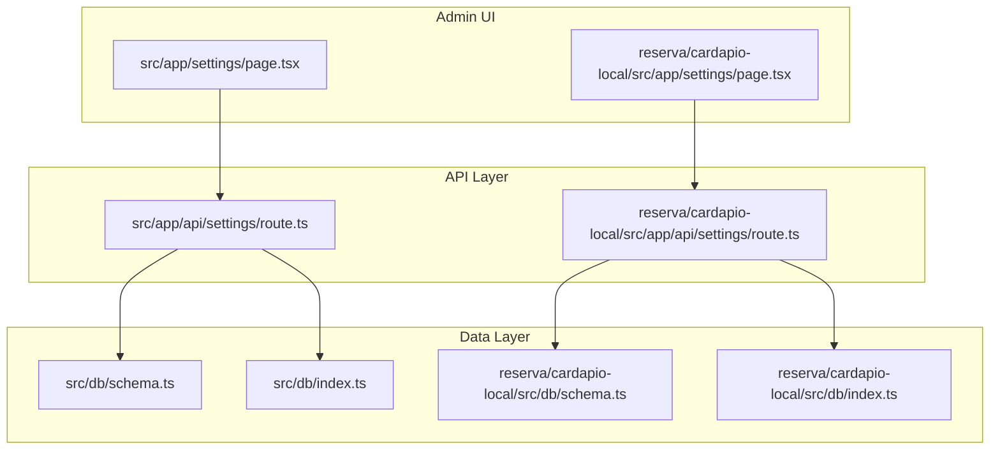
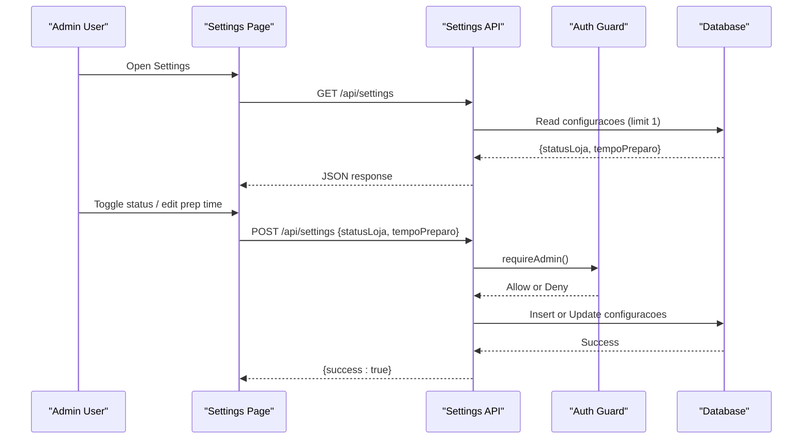
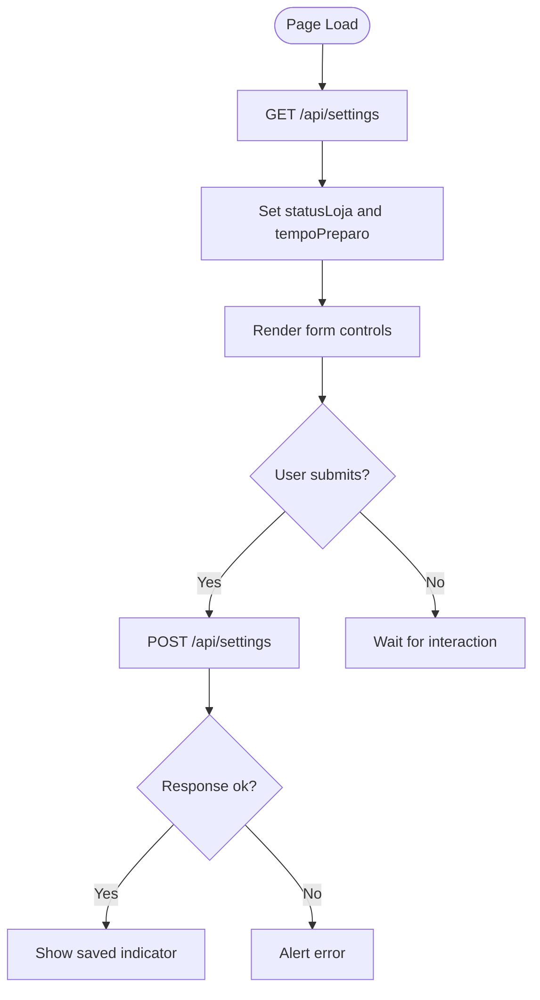
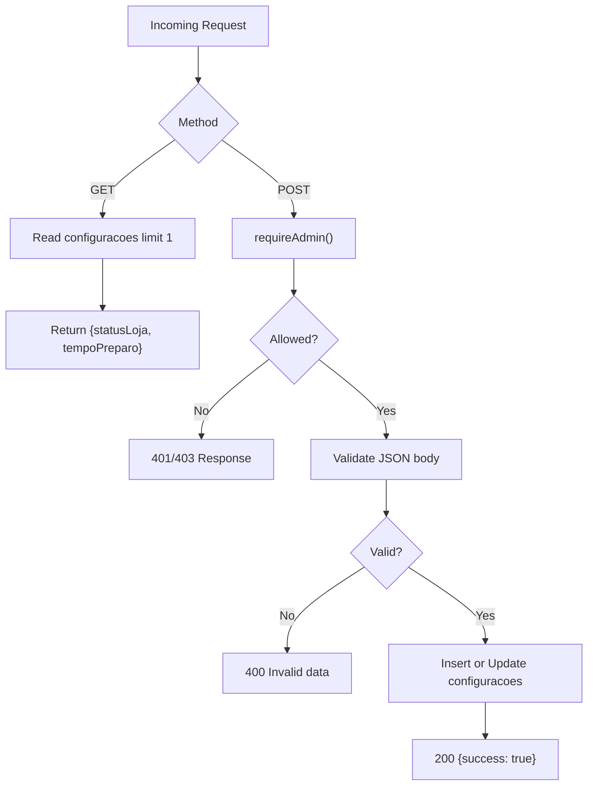
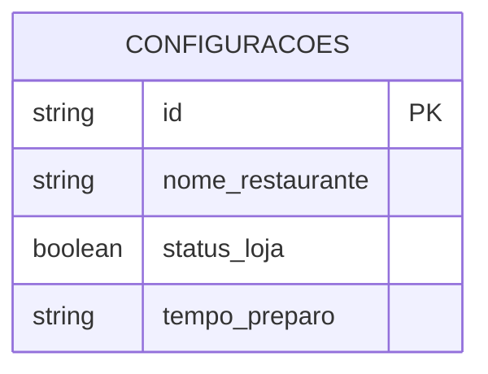
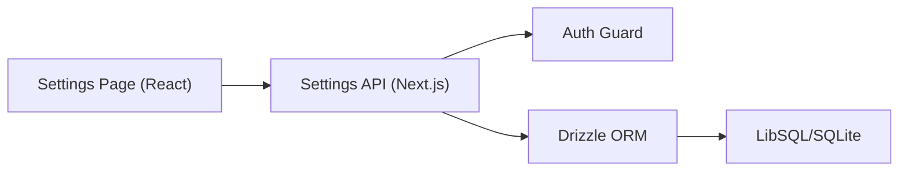

# System Settings

<cite>
**Referenced Files in This Document**
- [src/app/api/settings/route.ts](file://src/app/api/settings/route.ts)
- [reserva/cardapio-local/src/app/api/settings/route.ts](file://reserva/cardapio-local/src/app/api/settings/route.ts)
- [src/app/settings/page.tsx](file://src/app/settings/page.tsx)
- [reserva/cardapio-local/src/app/settings/page.tsx](file://reserva/cardapio-local/src/app/settings/page.tsx)
- [src/db/schema.ts](file://src/db/schema.ts)
- [reserva/cardapio-local/src/db/schema.ts](file://reserva/cardapio-local/src/db/schema.ts)
- [src/lib/auth.ts](file://src/lib/auth.ts)
- [reserva/cardapio-local/src/lib/auth.ts](file://reserva/cardapio-local/src/lib/auth.ts)
- [src/db/index.ts](file://src/db/index.ts)
- [reserva/cardapio-local/src/db/index.ts](file://reserva/cardapio-local/src/db/index.ts)
- [package.json](file://package.json)
- [reserva/cardapio-local/package.json](file://reserva/cardapio-local/package.json)
</cite>

## Table of Contents
1. Introduction
2. Project Structure
3. Core Components
4. Architecture Overview
5. Detailed Component Analysis
6. Dependency Analysis
7. Performance Considerations
8. Troubleshooting Guide
9. Conclusion

## Introduction
This document explains the system settings configuration module that controls restaurant operational parameters. It covers how store availability and preparation time are managed, where these values are stored, and how they are exposed to the admin UI. It also outlines environment-specific configuration (database and real-time notifications), deployment notes, and guidance for maintaining consistent settings across environments and troubleshooting common issues.

Note: The current implementation exposes a focused set of settings (store status and preparation time). Other areas mentioned in the objective (currency, taxes, display preferences, notifications, payment methods, delivery options, service area, theme/branding, backup/restore) are not implemented in this codebase and are therefore out of scope.

## Project Structure
The settings feature is implemented as a Next.js API route with a client-side admin page, backed by a Drizzle ORM schema and a SQLite/LibSQL database. There are two parallel implementations: one in src and a local copy under reserva/cardapio-local.

**Diagram sources**
- [src/app/settings/page.tsx:1-67](file://src/app/settings/page.tsx#L1-L67)
- [reserva/cardapio-local/src/app/settings/page.tsx:1-67](file://reserva/cardapio-local/src/app/settings/page.tsx#L1-L67)
- [src/app/api/settings/route.ts:1-35](file://src/app/api/settings/route.ts#L1-L35)
- [reserva/cardapio-local/src/app/api/settings/route.ts:1-35](file://reserva/cardapio-local/src/app/api/settings/route.ts#L1-L35)
- [src/db/schema.ts:34-40](file://src/db/schema.ts#L34-L40)
- [reserva/cardapio-local/src/db/schema.ts:34-40](file://reserva/cardapio-local/src/db/schema.ts#L34-L40)
- [src/db/index.ts:1-14](file://src/db/index.ts#L1-L14)
- [reserva/cardapio-local/src/db/index.ts:1-14](file://reserva/cardapio-local/src/db/index.ts#L1-L14)

**Section sources**
- [src/app/settings/page.tsx:1-67](file://src/app/settings/page.tsx#L1-L67)
- [reserva/cardapio-local/src/app/settings/page.tsx:1-67](file://reserva/cardapio-local/src/app/settings/page.tsx#L1-L67)
- [src/app/api/settings/route.ts:1-35](file://src/app/api/settings/route.ts#L1-L35)
- [reserva/cardapio-local/src/app/api/settings/route.ts:1-35](file://reserva/cardapio-local/src/app/api/settings/route.ts#L1-L35)
- [src/db/schema.ts:34-40](file://src/db/schema.ts#L34-L40)
- [reserva/cardapio-local/src/db/schema.ts:34-40](file://reserva/cardapio-local/src/db/schema.ts#L34-L40)
- [src/db/index.ts:1-14](file://src/db/index.ts#L1-L14)
- [reserva/cardapio-local/src/db/index.ts:1-14](file://reserva/cardapio-local/src/db/index.ts#L1-L14)

## Core Components
- Admin Settings Page: Loads and saves settings via the API. Provides toggles for store open/closed and an input for preparation time.
- Settings API Route: Exposes GET to read and POST to update settings. Enforces admin-only writes.
- Database Schema: Defines the configuracoes table storing restaurant settings.
- Authentication: Ensures only admins can modify settings.
- Database Client: Configures connection to LibSQL/Turso using environment variables.

Key capabilities currently supported:
- Store availability toggle (open/closed)
- Preparation time setting (text-based range or value)

Out-of-scope items (not present in code):
- Business name, contact details, operating hours, location data
- Currency, tax configurations, display preferences
- Notifications, email templates, communication channels
- Payment methods, delivery options, service area
- Theme customization, branding, UI personalization
- Backup and restore of configuration data

**Section sources**
- [src/app/settings/page.tsx:1-67](file://src/app/settings/page.tsx#L1-L67)
- [reserva/cardapio-local/src/app/settings/page.tsx:1-67](file://reserva/cardapio-local/src/app/settings/page.tsx#L1-L67)
- [src/app/api/settings/route.ts:1-35](file://src/app/api/settings/route.ts#L1-L35)
- [reserva/cardapio-local/src/app/api/settings/route.ts:1-35](file://reserva/cardapio-local/src/app/api/settings/route.ts#L1-L35)
- [src/db/schema.ts:34-40](file://src/db/schema.ts#L34-L40)
- [reserva/cardapio-local/src/db/schema.ts:34-40](file://reserva/cardapio-local/src/db/schema.ts#L34-L40)
- [src/lib/auth.ts:63-82](file://src/lib/auth.ts#L63-L82)
- [reserva/cardapio-local/src/lib/auth.ts:63-82](file://reserva/cardapio-local/src/lib/auth.ts#L63-L82)
- [src/db/index.ts:1-14](file://src/db/index.ts#L1-L14)
- [reserva/cardapio-local/src/db/index.ts:1-14](file://reserva/cardapio-local/src/db/index.ts#L1-L14)

## Architecture Overview
The settings flow uses a simple client-server pattern:
- The admin page fetches current settings on load and posts updates when saved.
- The API enforces admin authorization before writing.
- Data is persisted in a single-row configuration record.

**Diagram sources**
- [src/app/settings/page.tsx:13-34](file://src/app/settings/page.tsx#L13-L34)
- [src/app/api/settings/route.ts:7-34](file://src/app/api/settings/route.ts#L7-L34)
- [src/lib/auth.ts:63-82](file://src/lib/auth.ts#L63-L82)
- [src/db/schema.ts:34-40](file://src/db/schema.ts#L34-L40)

## Detailed Component Analysis

### Admin Settings Page (Client)
- Loads settings from the API on mount and initializes state for store status and preparation time.
- Submits changes back to the API with proper content type and error handling.
- Displays loading state and success feedback.

**Diagram sources**
- [src/app/settings/page.tsx:13-34](file://src/app/settings/page.tsx#L13-L34)
- [reserva/cardapio-local/src/app/settings/page.tsx:13-34](file://reserva/cardapio-local/src/app/settings/page.tsx#L13-L34)

**Section sources**
- [src/app/settings/page.tsx:1-67](file://src/app/settings/page.tsx#L1-L67)
- [reserva/cardapio-local/src/app/settings/page.tsx:1-67](file://reserva/cardapio-local/src/app/settings/page.tsx#L1-L67)

### Settings API Route (Server)
- GET: Returns current settings with safe defaults if missing.
- POST: Validates request body, enforces admin role, then inserts or updates the single configuration row.
- Error handling returns appropriate HTTP status codes and messages.

**Diagram sources**
- [src/app/api/settings/route.ts:7-34](file://src/app/api/settings/route.ts#L7-L34)
- [reserva/cardapio-local/src/app/api/settings/route.ts:7-34](file://reserva/cardapio-local/src/app/api/settings/route.ts#L7-L34)
- [src/lib/auth.ts:63-82](file://src/lib/auth.ts#L63-L82)
- [reserva/cardapio-local/src/lib/auth.ts:63-82](file://reserva/cardapio-local/src/lib/auth.ts#L63-L82)

**Section sources**
- [src/app/api/settings/route.ts:1-35](file://src/app/api/settings/route.ts#L1-L35)
- [reserva/cardapio-local/src/app/api/settings/route.ts:1-35](file://reserva/cardapio-local/src/app/api/settings/route.ts#L1-L35)
- [src/lib/auth.ts:63-82](file://src/lib/auth.ts#L63-L82)
- [reserva/cardapio-local/src/lib/auth.ts:63-82](file://reserva/cardapio-local/src/lib/auth.ts#L63-L82)

### Database Schema (Configurations)
- configuracoes table stores:
  - id: primary key
  - nomeRestaurante: restaurant name (present but not used by current settings UI)
  - statusLoja: boolean flag for store open/closed
  - tempoPreparo: text field for preparation time range/value

**Diagram sources**
- [src/db/schema.ts:34-40](file://src/db/schema.ts#L34-L40)
- [reserva/cardapio-local/src/db/schema.ts:34-40](file://reserva/cardapio-local/src/db/schema.ts#L34-L40)

**Section sources**
- [src/db/schema.ts:34-40](file://src/db/schema.ts#L34-L40)
- [reserva/cardapio-local/src/db/schema.ts:34-40](file://reserva/cardapio-local/src/db/schema.ts#L34-L40)

### Authentication Guard
- Admin-only write protection is enforced via requireAdmin().
- Role resolution reads session cookies; unauthorized or insufficient roles return errors.

**Section sources**
- [src/lib/auth.ts:63-82](file://src/lib/auth.ts#L63-L82)
- [reserva/cardapio-local/src/lib/auth.ts:63-82](file://reserva/cardapio-local/src/lib/auth.ts#L63-L82)

### Database Client and Environment Configuration
- Database URL and optional auth token are loaded from environment variables.
- Defaults to a local file-based SQLite database when Turso credentials are absent.

Environment variables used:
- TURSO_DATABASE_URL
- TURSO_AUTH_TOKEN

Deployment notes:
- package.json scripts include db push/migrate/seed commands for setup.
- Local variant includes additional scripts for binding to 0.0.0.0 and port 3000.

**Section sources**
- [src/db/index.ts:1-14](file://src/db/index.ts#L1-L14)
- [reserva/cardapio-local/src/db/index.ts:1-14](file://reserva/cardapio-local/src/db/index.ts#L1-L14)
- [package.json:5-16](file://package.json#L5-L16)
- [reserva/cardapio-local/package.json:5-18](file://reserva/cardapio-local/package.json#L5-L18)

## Dependency Analysis
The settings feature depends on:
- Next.js API routes for GET/POST endpoints
- Drizzle ORM and LibSQL client for persistence
- Authentication utilities for access control
- React components for the admin UI

**Diagram sources**
- [src/app/settings/page.tsx:1-67](file://src/app/settings/page.tsx#L1-L67)
- [src/app/api/settings/route.ts:1-35](file://src/app/api/settings/route.ts#L1-L35)
- [src/lib/auth.ts:63-82](file://src/lib/auth.ts#L63-L82)
- [src/db/index.ts:1-14](file://src/db/index.ts#L1-L14)

**Section sources**
- [src/app/settings/page.tsx:1-67](file://src/app/settings/page.tsx#L1-L67)
- [src/app/api/settings/route.ts:1-35](file://src/app/api/settings/route.ts#L1-L35)
- [src/lib/auth.ts:63-82](file://src/lib/auth.ts#L63-L82)
- [src/db/index.ts:1-14](file://src/db/index.ts#L1-L14)

## Performance Considerations
- Single-row configuration read/write operations are lightweight and fast.
- Using LIMIT 1 ensures minimal overhead when fetching settings.
- For high concurrency, consider caching frequently read settings at the application layer if needed.
- Avoid unnecessary re-renders in the UI by minimizing state churn and debouncing rapid inputs if expanded later.

[No sources needed since this section provides general guidance]

## Troubleshooting Guide
Common issues and resolutions:
- Cannot save settings:
  - Ensure you are authenticated as admin; otherwise, the API will deny writes.
  - Check that the request body contains valid JSON with expected fields.
- Settings not loading:
  - Verify network connectivity and that the API endpoint is reachable.
  - Confirm the database is initialized and accessible via configured environment variables.
- Unexpected defaults:
  - If no configuration row exists, GET returns safe defaults for status and preparation time.

Operational checks:
- Validate environment variables for database connectivity (TURSO_DATABASE_URL, TURSO_AUTH_TOKEN).
- Use provided scripts to ensure schema is pushed and seeded appropriately.

**Section sources**
- [src/app/api/settings/route.ts:7-34](file://src/app/api/settings/route.ts#L7-L34)
- [reserva/cardapio-local/src/app/api/settings/route.ts:7-34](file://reserva/cardapio-local/src/app/api/settings/route.ts#L7-L34)
- [src/db/index.ts:1-14](file://src/db/index.ts#L1-L14)
- [reserva/cardapio-local/src/db/index.ts:1-14](file://reserva/cardapio-local/src/db/index.ts#L1-L14)
- [package.json:5-16](file://package.json#L5-L16)
- [reserva/cardapio-local/package.json:5-18](file://reserva/cardapio-local/package.json#L5-L18)

## Conclusion
The system settings module currently supports managing store availability and preparation time through a secure admin interface backed by a single-row configuration table. While other operational parameters (business info, currency/taxes, notifications, payments, delivery, themes, backups) are not implemented here, the existing structure provides a clear foundation for extending settings in the future. Maintain consistency across environments by standardizing environment variables and using the provided database scripts. When expanding functionality, follow the established patterns: define schema fields, expose API endpoints with admin guards, and build corresponding UI controls.

[No sources needed since this section summarizes without analyzing specific files]