# User Administration

<cite>
**Referenced Files in This Document**
- [src/app/api/usuarios/route.ts](file://src/app/api/usuarios/route.ts)
- [src/app/api/usuarios/[id]/route.ts](file://src/app/api/usuarios/[id]/route.ts)
- [src/app/api/auth/login/route.ts](file://src/app/api/auth/login/route.ts)
- [src/app/api/auth/logout/route.ts](file://src/app/api/auth/logout/route.ts)
- [src/app/api/auth/setup/route.ts](file://src/app/api/auth/setup/route.ts)
- [src/lib/auth.ts](file://src/lib/auth.ts)
- [src/lib/login-rate-limit.ts](file://src/lib/login-rate-limit.ts)
- [src/db/schema.ts](file://src/db/schema.ts)
- [src/app/users/page.tsx](file://src/app/users/page.tsx)
- [src/app/login/page.tsx](file://src/app/login/page.tsx)
</cite>

## Table of Contents
1. [Introduction](#introduction)
2. [Project Structure](#project-structure)
3. [Core Components](#core-components)
4. [Architecture Overview](#architecture-overview)
5. [Detailed Component Analysis](#detailed-component-analysis)
6. [Dependency Analysis](#dependency-analysis)
7. [Performance Considerations](#performance-considerations)
8. [Troubleshooting Guide](#troubleshooting-guide)
9. [Conclusion](#conclusion)
10. [Appendices](#appendices)

## Introduction
This document explains the user administration module for managing restaurant staff accounts and permissions. It covers:
- Creating new staff accounts with roles (admin, kitchen/cozinha, staff/atendente)
- Role-based access control (RBAC) that gates features by role
- Authentication flows using PINs and optional Google login
- Login rate limiting and account lockout behavior
- Deleting users and maintaining data integrity
- Security considerations for password/PIN management, session cookies, and audit logging guidance
- Best practices for administrators to manage hierarchies and permissions

## Project Structure
The user administration feature spans API routes, authentication utilities, database schema, and UI pages:
- API endpoints for user CRUD and authentication
- Shared auth helpers for hashing, cookie handling, and authorization guards
- Rate limiting logic for login attempts
- Database schema defining users and login attempt tracking
- Admin UI for creating and removing users
- Login UI for PIN and Google authentication

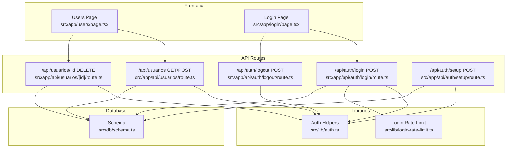

**Diagram sources**
- [src/app/users/page.tsx](file://src/app/users/page.tsx)
- [src/app/login/page.tsx](file://src/app/login/page.tsx)
- [src/app/api/usuarios/route.ts](file://src/app/api/usuarios/route.ts)
- [src/app/api/usuarios/[id]/route.ts](file://src/app/api/usuarios/[id]/route.ts)
- [src/app/api/auth/login/route.ts](file://src/app/api/auth/login/route.ts)
- [src/app/api/auth/logout/route.ts](file://src/app/api/auth/logout/route.ts)
- [src/app/api/auth/setup/route.ts](file://src/app/api/auth/setup/route.ts)
- [src/lib/auth.ts](file://src/lib/auth.ts)
- [src/lib/login-rate-limit.ts](file://src/lib/login-rate-limit.ts)
- [src/db/schema.ts](file://src/db/schema.ts)

**Section sources**
- [src/app/api/usuarios/route.ts](file://src/app/api/usuarios/route.ts)
- [src/app/api/usuarios/[id]/route.ts](file://src/app/api/usuarios/[id]/route.ts)
- [src/app/api/auth/login/route.ts](file://src/app/api/auth/login/route.ts)
- [src/app/api/auth/logout/route.ts](file://src/app/api/auth/logout/route.ts)
- [src/app/api/auth/setup/route.ts](file://src/app/api/auth/setup/route.ts)
- [src/lib/auth.ts](file://src/lib/auth.ts)
- [src/lib/login-rate-limit.ts](file://src/lib/login-rate-limit.ts)
- [src/db/schema.ts](file://src/db/schema.ts)
- [src/app/users/page.tsx](file://src/app/users/page.tsx)
- [src/app/login/page.tsx](file://src/app/login/page.tsx)

## Core Components
- User creation and listing:
  - GET /api/usuarios returns all users without sensitive fields; requires admin role.
  - POST /api/usuarios creates a new user with validated name, role, and PIN; enforces single admin rule and PIN format.
- User deletion:
  - DELETE /api/usuarios/:id removes a user; requires admin role.
- Authentication:
  - POST /api/auth/login validates PIN against stored hashes, sets role-specific cookies, clears failed attempts on success, and supports rate limiting.
  - POST /api/auth/logout clears authentication cookies.
  - POST /api/auth/setup initializes an admin account if none exists; can be protected by a setup secret header.
- Authorization helpers:
  - Cookie-based role detection and middleware-like guards requireAuth, requireAdmin, requireKitchen.
  - PIN hashing and verification utilities.
- Rate limiting:
  - Tracks failed login attempts per client identifier and blocks further attempts after threshold.

**Section sources**
- [src/app/api/usuarios/route.ts](file://src/app/api/usuarios/route.ts)
- [src/app/api/usuarios/[id]/route.ts](file://src/app/api/usuarios/[id]/route.ts)
- [src/app/api/auth/login/route.ts](file://src/app/api/auth/login/route.ts)
- [src/app/api/auth/logout/route.ts](file://src/app/api/auth/logout/route.ts)
- [src/app/api/auth/setup/route.ts](file://src/app/api/auth/setup/route.ts)
- [src/lib/auth.ts](file://src/lib/auth.ts)
- [src/lib/login-rate-limit.ts](file://src/lib/login-rate-limit.ts)

## Architecture Overview
The system uses Next.js API routes with Drizzle ORM for SQLite storage. Authentication is PIN-based with secure hashing and cookie sessions. RBAC is enforced via role checks before any privileged operation.

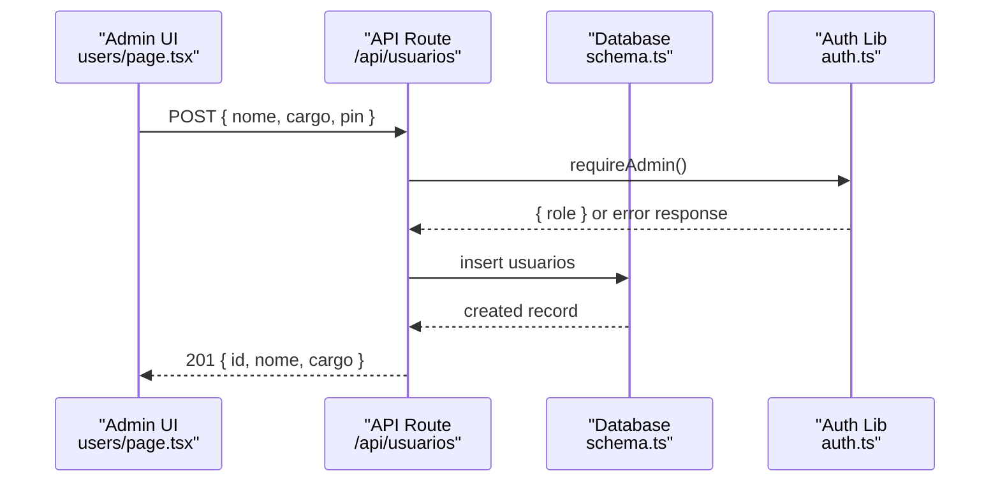

**Diagram sources**
- [src/app/users/page.tsx](file://src/app/users/page.tsx)
- [src/app/api/usuarios/route.ts](file://src/app/api/usuarios/route.ts)
- [src/db/schema.ts](file://src/db/schema.ts)
- [src/lib/auth.ts](file://src/lib/auth.ts)

## Detailed Component Analysis

### User Creation Workflow
- Input validation:
  - Name must be non-empty.
  - Role must be normalized to allowed values.
  - PIN must be numeric and within length constraints.
- Business rules:
  - Only one admin is allowed at a time; creation fails if an admin already exists.
- Security:
  - PIN is hashed before storage.
- Response:
  - Returns user metadata without PIN.

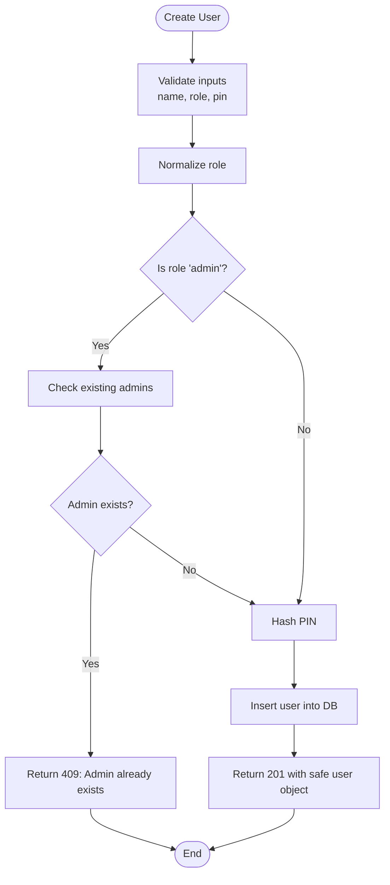

**Diagram sources**
- [src/app/api/usuarios/route.ts](file://src/app/api/usuarios/route.ts)

**Section sources**
- [src/app/api/usuarios/route.ts](file://src/app/api/usuarios/route.ts)

### User Listing and Deletion
- Listing:
  - Requires admin role.
  - Returns all users excluding PIN field.
- Deletion:
  - Requires admin role.
  - Deletes user by ID.

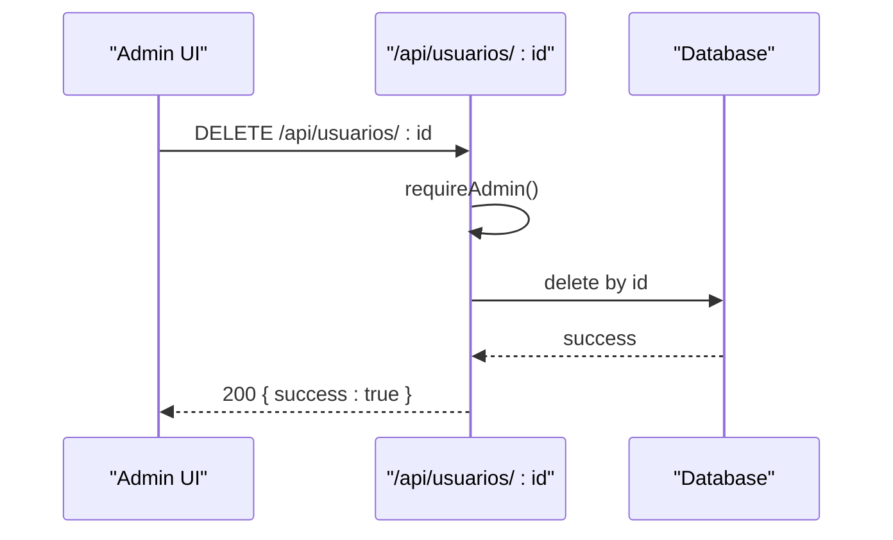

**Diagram sources**
- [src/app/api/usuarios/[id]/route.ts](file://src/app/api/usuarios/[id]/route.ts)

**Section sources**
- [src/app/api/usuarios/route.ts](file://src/app/api/usuarios/route.ts)
- [src/app/api/usuarios/[id]/route.ts](file://src/app/api/usuarios/[id]/route.ts)

### Authentication Flow (PIN)
- Rate limit check before processing.
- Validate PIN format.
- Compare against stored hashes.
- On success: set role-specific cookies and clear failed attempts.
- On failure: register failed attempt and possibly enforce lockout.

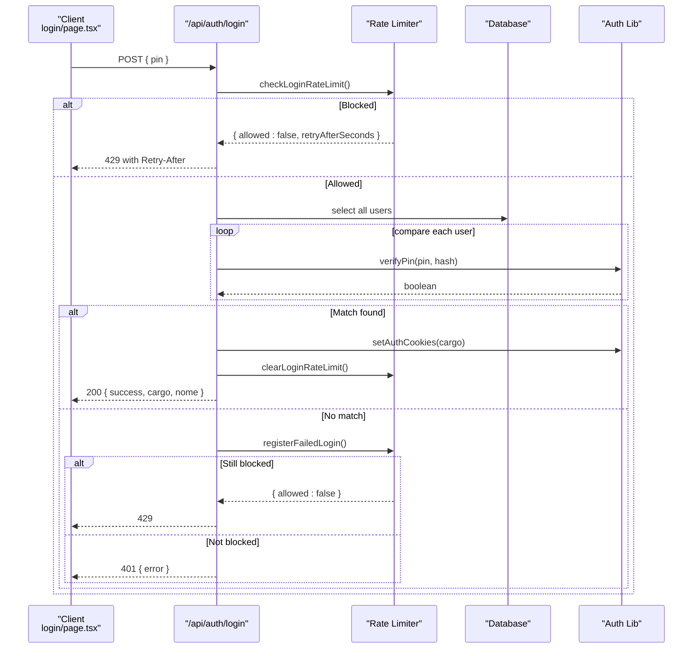

**Diagram sources**
- [src/app/api/auth/login/route.ts](file://src/app/api/auth/login/route.ts)
- [src/lib/login-rate-limit.ts](file://src/lib/login-rate-limit.ts)
- [src/lib/auth.ts](file://src/lib/auth.ts)
- [src/db/schema.ts](file://src/db/schema.ts)

**Section sources**
- [src/app/api/auth/login/route.ts](file://src/app/api/auth/login/route.ts)
- [src/lib/login-rate-limit.ts](file://src/lib/login-rate-limit.ts)
- [src/lib/auth.ts](file://src/lib/auth.ts)

### Logout Flow
- Clears all role-specific authentication cookies.

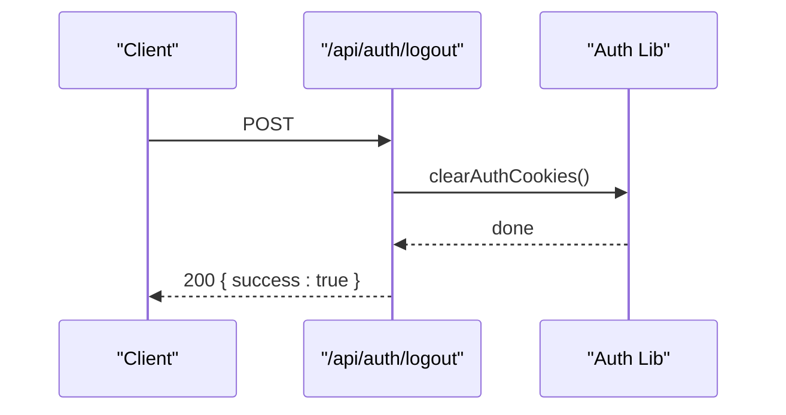

**Diagram sources**
- [src/app/api/auth/logout/route.ts](file://src/app/api/auth/logout/route.ts)
- [src/lib/auth.ts](file://src/lib/auth.ts)

**Section sources**
- [src/app/api/auth/logout/route.ts](file://src/app/api/auth/logout/route.ts)

### Setup Flow (Initial Admin)
- Optional protection via SETUP_SECRET header.
- Prevents re-setup if any user exists.
- Generates a random PIN, hashes it, and inserts the first admin.

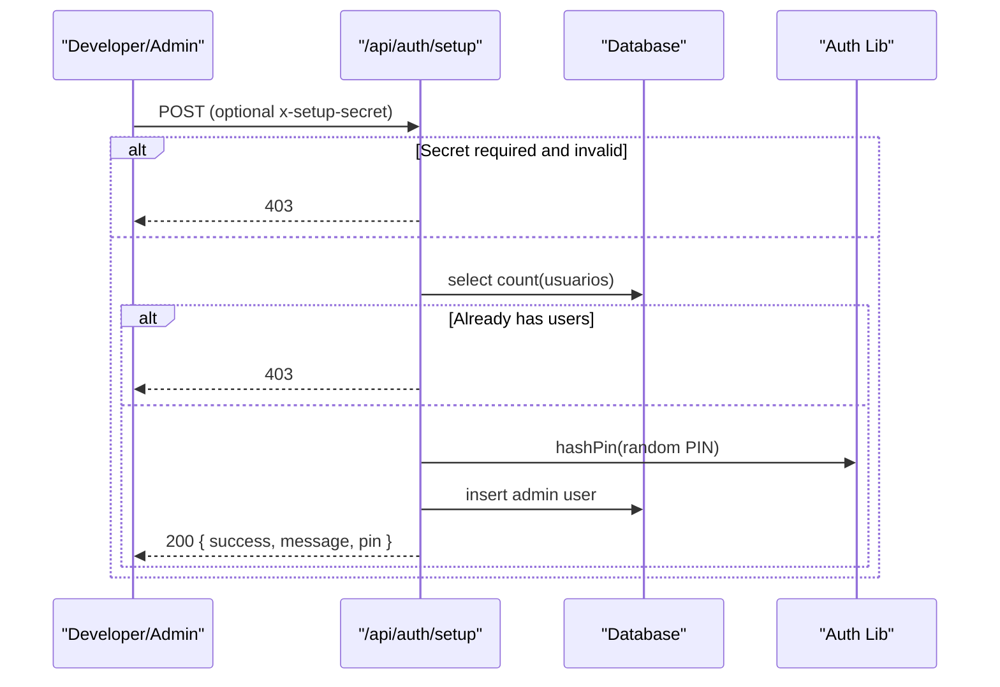

**Diagram sources**
- [src/app/api/auth/setup/route.ts](file://src/app/api/auth/setup/route.ts)
- [src/lib/auth.ts](file://src/lib/auth.ts)
- [src/db/schema.ts](file://src/db/schema.ts)

**Section sources**
- [src/app/api/auth/setup/route.ts](file://src/app/api/auth/setup/route.ts)

### Role-Based Access Control (RBAC)
- Roles:
  - admin, cozinha (kitchen), atendente (staff).
- Guards:
  - requireAuth(allowedRoles) returns role or error response.
  - requireAdmin restricts to admin.
  - requireKitchen allows admin and cozinha.
- Session:
  - Cookies named auth_admin, auth_cozinha, auth_atendente indicate active role.

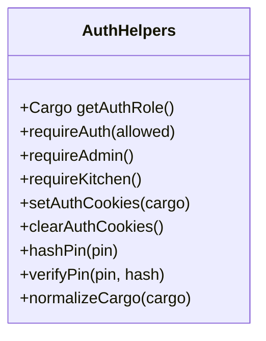

**Diagram sources**
- [src/lib/auth.ts](file://src/lib/auth.ts)

**Section sources**
- [src/lib/auth.ts](file://src/lib/auth.ts)

### Data Model
- Users table stores id, nome, cargo, and pin (hashed).
- Login attempts table tracks per-client identifiers, attempt counts, lockout timestamps, and last updated time.

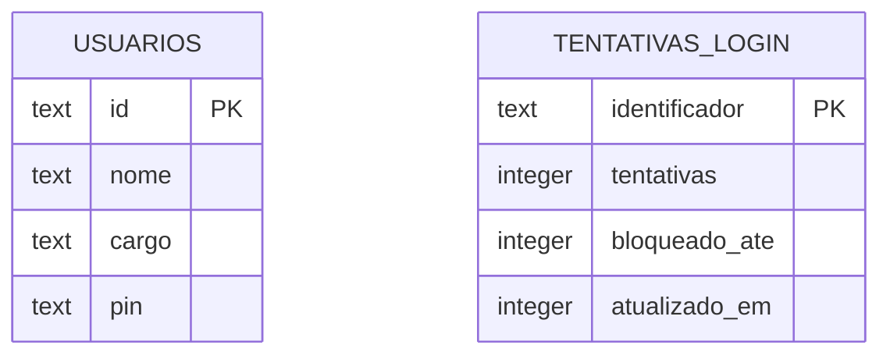

**Diagram sources**
- [src/db/schema.ts](file://src/db/schema.ts)

**Section sources**
- [src/db/schema.ts](file://src/db/schema.ts)

### Frontend User Management UI
- The users page allows adding new collaborators with name, role, and PIN, and deleting existing users.
- Displays current users with masked PINs and role badges.
- Enforces client-side validations and confirms deletions.

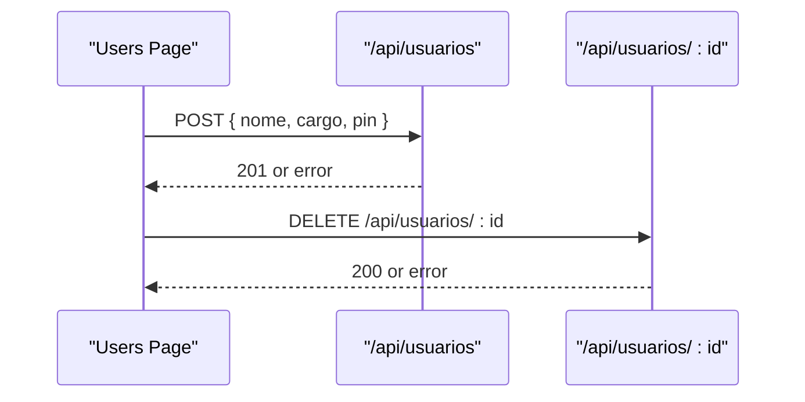

**Diagram sources**
- [src/app/users/page.tsx](file://src/app/users/page.tsx)
- [src/app/api/usuarios/route.ts](file://src/app/api/usuarios/route.ts)
- [src/app/api/usuarios/[id]/route.ts](file://src/app/api/usuarios/[id]/route.ts)

**Section sources**
- [src/app/users/page.tsx](file://src/app/users/page.tsx)

## Dependency Analysis
- API routes depend on:
  - Database schema for persistence.
  - Auth library for hashing, cookies, and authorization.
  - Rate limiter for login security.
- Frontend pages call API endpoints and handle responses.

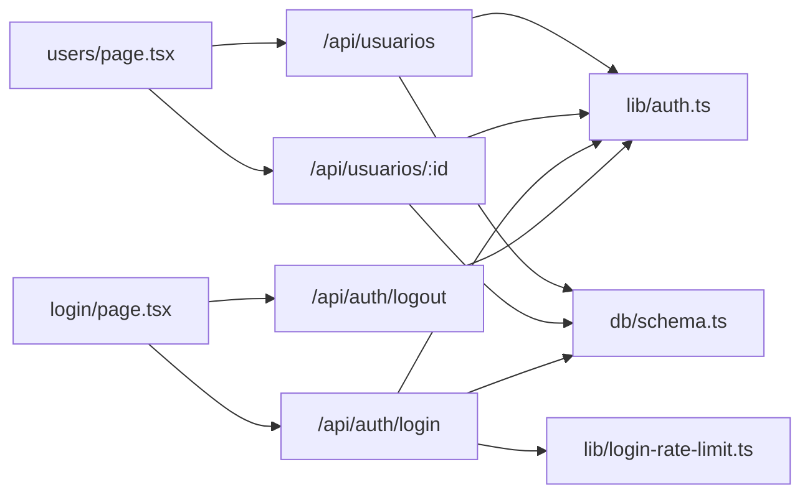

**Diagram sources**
- [src/app/users/page.tsx](file://src/app/users/page.tsx)
- [src/app/login/page.tsx](file://src/app/login/page.tsx)
- [src/app/api/usuarios/route.ts](file://src/app/api/usuarios/route.ts)
- [src/app/api/usuarios/[id]/route.ts](file://src/app/api/usuarios/[id]/route.ts)
- [src/app/api/auth/login/route.ts](file://src/app/api/auth/login/route.ts)
- [src/app/api/auth/logout/route.ts](file://src/app/api/auth/logout/route.ts)
- [src/lib/auth.ts](file://src/lib/auth.ts)
- [src/lib/login-rate-limit.ts](file://src/lib/login-rate-limit.ts)
- [src/db/schema.ts](file://src/db/schema.ts)

**Section sources**
- [src/app/api/usuarios/route.ts](file://src/app/api/usuarios/route.ts)
- [src/app/api/usuarios/[id]/route.ts](file://src/app/api/usuarios/[id]/route.ts)
- [src/app/api/auth/login/route.ts](file://src/app/api/auth/login/route.ts)
- [src/app/api/auth/logout/route.ts](file://src/app/api/auth/logout/route.ts)
- [src/lib/auth.ts](file://src/lib/auth.ts)
- [src/lib/login-rate-limit.ts](file://src/lib/login-rate-limit.ts)
- [src/db/schema.ts](file://src/db/schema.ts)
- [src/app/users/page.tsx](file://src/app/users/page.tsx)
- [src/app/login/page.tsx](file://src/app/login/page.tsx)

## Performance Considerations
- Login flow scans all users to find a matching PIN; consider indexing or optimizing queries if the user base grows significantly.
- Rate limiting uses SQLite writes; ensure adequate disk I/O performance under load.
- Cookie-based sessions are lightweight but should be used with secure settings in production.

[No sources needed since this section provides general guidance]

## Troubleshooting Guide
Common issues and resolutions:
- Cannot create admin when one already exists:
  - Remove or reassign the existing admin before creating another.
- PIN validation errors:
  - Ensure PIN is numeric and within allowed length.
- Login locked out:
  - Wait for the lockout period to expire; the system returns a Retry-After header.
- Unauthorized access to user endpoints:
  - Verify that the client has a valid role cookie; log in as admin to access user management.
- Logout not working:
  - Confirm that cookies are cleared; check browser cookie settings and SameSite configuration.

**Section sources**
- [src/app/api/usuarios/route.ts](file://src/app/api/usuarios/route.ts)
- [src/app/api/auth/login/route.ts](file://src/app/api/auth/login/route.ts)
- [src/lib/login-rate-limit.ts](file://src/lib/login-rate-limit.ts)
- [src/lib/auth.ts](file://src/lib/auth.ts)

## Conclusion
The user administration module provides a secure, role-based system for managing restaurant staff. It enforces strict PIN validation, rate limiting, and cookie-based sessions while offering straightforward APIs for creating and deleting users. Administrators can maintain a single-admin policy and assign appropriate roles to kitchen and staff members. For enhanced security and compliance, consider adding audit logging and password rotation capabilities.

[No sources needed since this section summarizes without analyzing specific files]

## Appendices

### Security Considerations
- Password/PIN management:
  - PINs are hashed with bcrypt before storage; never log or expose raw PINs.
- Session handling:
  - Cookies are httpOnly and configured securely for production environments.
- Audit logging:
  - Current implementation does not include detailed audit logs; consider adding entries for user creation, updates, deletions, and login attempts for compliance and forensics.
- Account security best practices:
  - Rotate PINs periodically.
  - Monitor failed login attempts and adjust thresholds as needed.
  - Restrict setup endpoint with strong secrets.

[No sources needed since this section provides general guidance]

### Administrator Guidelines
- Maintain a single admin account unless explicitly required otherwise.
- Assign roles based on job responsibilities:
  - admin: full system access.
  - cozinha: kitchen operations.
  - atendente: front-of-house tasks.
- Use the users page to add/remove staff and ensure PINs are communicated securely.
- Review and update roles as team composition changes.

[No sources needed since this section provides general guidance]