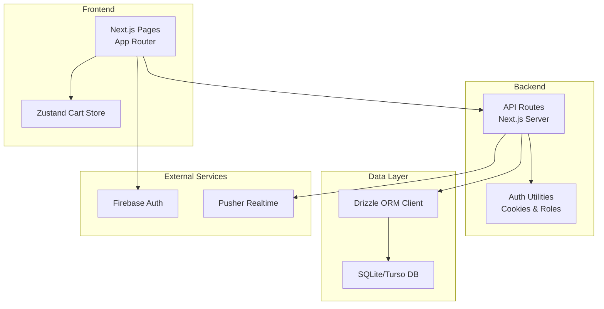
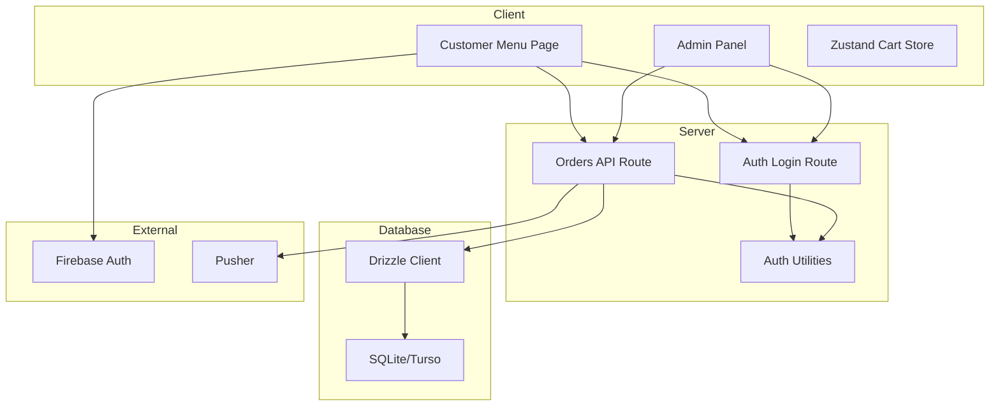
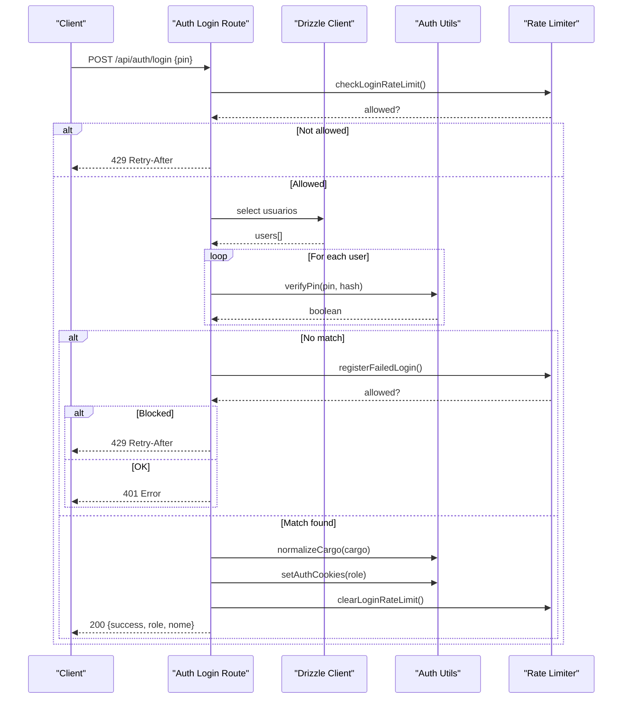
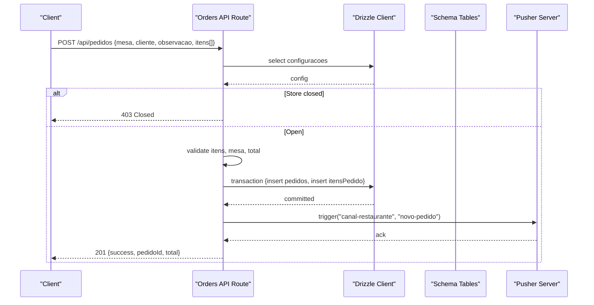
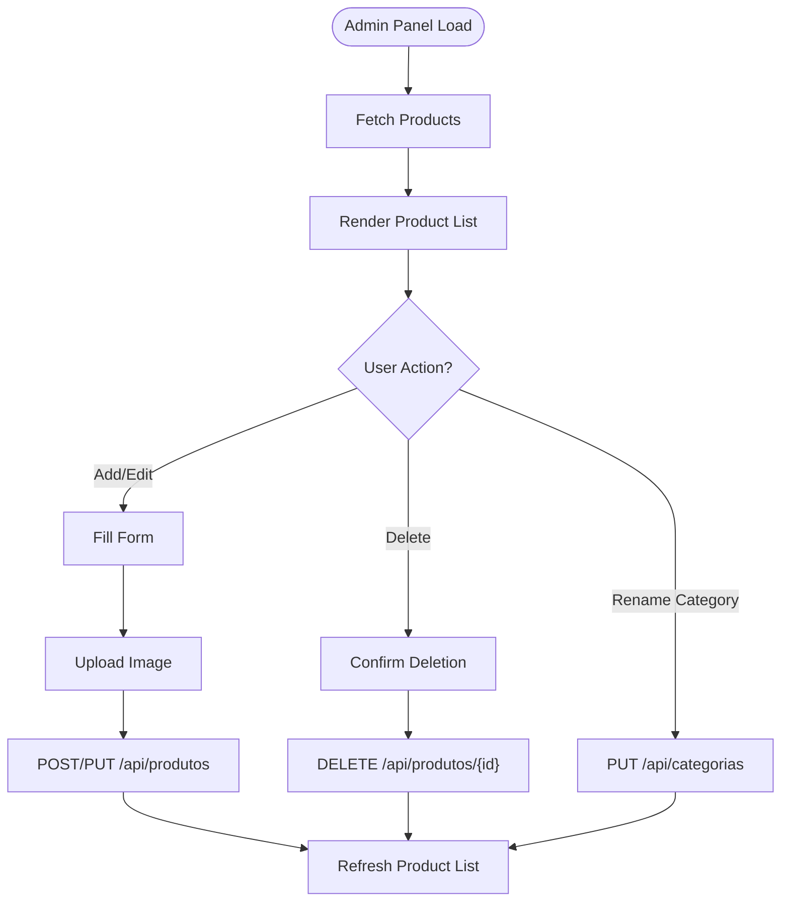
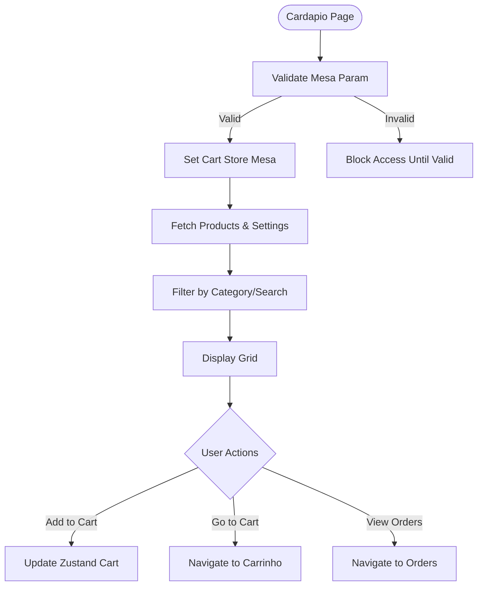
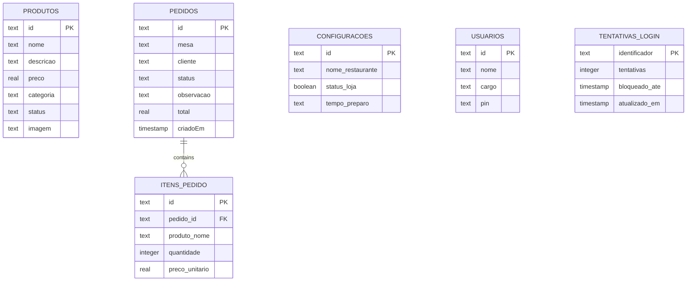
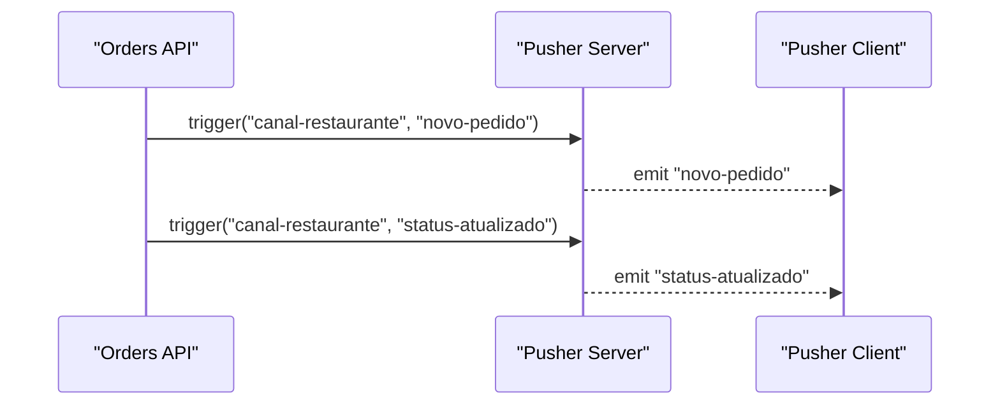
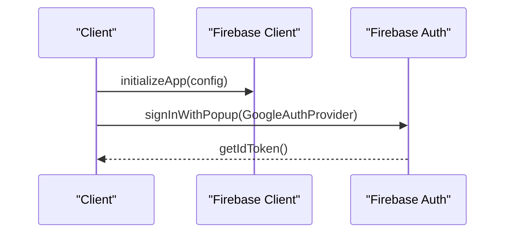
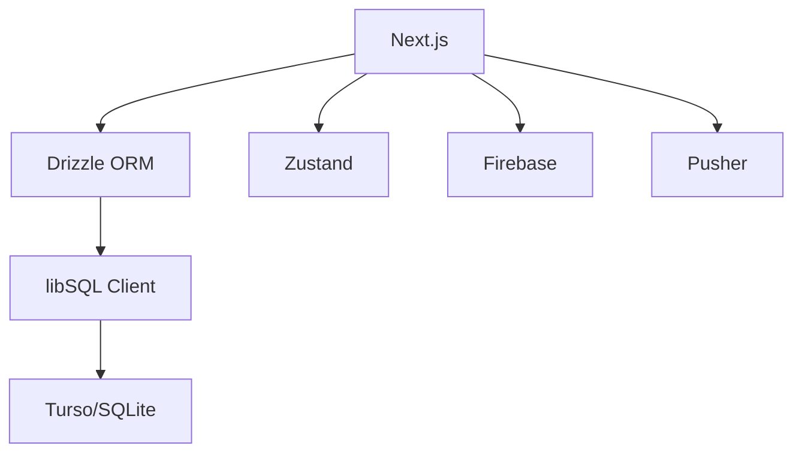

# Architecture Overview

<cite>
**Referenced Files in This Document**
- [package.json](file://package.json)
- [next.config.ts](file://next.config.ts)
- [drizzle.config.ts](file://drizzle.config.ts)
- [src/app/layout.tsx](file://src/app/layout.tsx)
- [src/db/schema.ts](file://src/db/schema.ts)
- [src/db/index.ts](file://src/db/index.ts)
- [src/lib/auth.ts](file://src/lib/auth.ts)
- [src/lib/firebase-client.ts](file://src/lib/firebase-client.ts)
- [src/lib/pusher-server.ts](file://src/lib/pusher-server.ts)
- [src/lib/pusher.ts](file://src/lib/pusher.ts)
- [src/contexts/cartStore.ts](file://src/contexts/cartStore.ts)
- [src/app/api/auth/login/route.ts](file://src/app/api/auth/login/route.ts)
- [src/app/api/pedidos/route.ts](file://src/app/api/pedidos/route.ts)
- [src/app/cardapio/page.tsx](file://src/app/cardapio/page.tsx)
- [src/app/admin/page.tsx](file://src/app/admin/page.tsx)
</cite>

## Table of Contents
1. Introduction
2. Project Structure
3. Core Components
4. Architecture Overview
5. Detailed Component Analysis
6. Dependency Analysis
7. Performance Considerations
8. Troubleshooting Guide
9. Conclusion

## Introduction
This document provides a comprehensive architectural overview of the Meu Cardápio system, focusing on high-level design, architectural patterns, and system boundaries. It explains how the frontend React components built with Next.js App Router interact with API routes, the database layer using Drizzle ORM over SQLite/Turso, and external services such as Firebase Authentication and Pusher for real-time communication. It also documents technical decisions (Next.js App Router, Zustand for state management, SQLite/Turso for persistence), infrastructure requirements, scalability considerations, deployment topology, cross-cutting concerns (authentication, authorization, caching, error handling), and third-party integration patterns.

## Project Structure
The application is a single Next.js project that serves both client-side pages and server-side API routes. The structure follows feature-based organization:
- app/: Next.js App Router pages and API routes
- src/components/: reusable UI components
- src/contexts/: global client state via Zustand
- src/db/: Drizzle schema and database client
- src/lib/: shared utilities including auth, Firebase client, Pusher clients
- public/: static assets like QR codes

**Diagram sources**
- [src/app/layout.tsx:1-34](file://src/app/layout.tsx#L1-L34)
- [src/app/cardapio/page.tsx:1-315](file://src/app/cardapio/page.tsx#L1-L315)
- [src/app/admin/page.tsx:1-383](file://src/app/admin/page.tsx#L1-L383)
- [src/contexts/cartStore.ts:1-69](file://src/contexts/cartStore.ts#L1-L69)
- [src/app/api/auth/login/route.ts:1-80](file://src/app/api/auth/login/route.ts#L1-L80)
- [src/app/api/pedidos/route.ts:1-253](file://src/app/api/pedidos/route.ts#L1-L253)
- [src/db/index.ts:1-14](file://src/db/index.ts#L1-L14)
- [src/db/schema.ts:1-56](file://src/db/schema.ts#L1-L56)
- [src/lib/auth.ts:1-82](file://src/lib/auth.ts#L1-L82)
- [src/lib/firebase-client.ts:1-26](file://src/lib/firebase-client.ts#L1-L26)
- [src/lib/pusher-server.ts:1-11](file://src/lib/pusher-server.ts#L1-L11)
- [src/lib/pusher.ts:1-9](file://src/lib/pusher.ts#L1-L9)

**Section sources**
- [package.json:1-45](file://package.json#L1-L45)
- [next.config.ts:1-14](file://next.config.ts#L1-L14)
- [drizzle.config.ts:1-14](file://drizzle.config.ts#L1-L14)
- [src/app/layout.tsx:1-34](file://src/app/layout.tsx#L1-L34)

## Core Components
- Next.js App Router pages:
  - Customer menu page handles product listing, search, categories, and navigation to cart and orders.
  - Admin panel manages products CRUD and category operations.
- API routes:
  - Authentication login route validates PINs, enforces rate limiting, sets cookies, and returns role info.
  - Orders route implements GET (list or filtered by IDs), POST (create order with validation and transaction), PATCH (status update), DELETE (order removal).
- Database layer:
  - Drizzle ORM client configured for Turso/SQLite with schema definitions for products, orders, order items, settings, users, and login attempts.
- State management:
  - Zustand store persists cart items and table context across sessions.
- External integrations:
  - Firebase client for Google sign-in token retrieval.
  - Pusher server/client for real-time notifications on new orders and status updates.

**Section sources**
- [src/app/cardapio/page.tsx:1-315](file://src/app/cardapio/page.tsx#L1-L315)
- [src/app/admin/page.tsx:1-383](file://src/app/admin/page.tsx#L1-L383)
- [src/app/api/auth/login/route.ts:1-80](file://src/app/api/auth/login/route.ts#L1-L80)
- [src/app/api/pedidos/route.ts:1-253](file://src/app/api/pedidos/route.ts#L1-L253)
- [src/db/index.ts:1-14](file://src/db/index.ts#L1-L14)
- [src/db/schema.ts:1-56](file://src/db/schema.ts#L1-L56)
- [src/contexts/cartStore.ts:1-69](file://src/contexts/cartStore.ts#L1-L69)
- [src/lib/firebase-client.ts:1-26](file://src/lib/firebase-client.ts#L1-L26)
- [src/lib/pusher-server.ts:1-11](file://src/lib/pusher-server.ts#L1-L11)
- [src/lib/pusher.ts:1-9](file://src/lib/pusher.ts#L1-L9)

## Architecture Overview
The system uses a hybrid architecture where Next.js serves both the frontend and backend within the same runtime. The App Router organizes pages and API endpoints co-located with features. Data persistence is handled by Drizzle ORM against SQLite/Turso. Real-time updates are delivered through Pusher, while authentication can be performed via PIN-based login or Google OAuth tokens from Firebase.

**Diagram sources**
- [src/app/cardapio/page.tsx:1-315](file://src/app/cardapio/page.tsx#L1-L315)
- [src/app/admin/page.tsx:1-383](file://src/app/admin/page.tsx#L1-L383)
- [src/app/api/auth/login/route.ts:1-80](file://src/app/api/auth/login/route.ts#L1-L80)
- [src/app/api/pedidos/route.ts:1-253](file://src/app/api/pedidos/route.ts#L1-L253)
- [src/lib/auth.ts:1-82](file://src/lib/auth.ts#L1-L82)
- [src/db/index.ts:1-14](file://src/db/index.ts#L1-L14)
- [src/db/schema.ts:1-56](file://src/db/schema.ts#L1-L56)
- [src/lib/firebase-client.ts:1-26](file://src/lib/firebase-client.ts#L1-L26)
- [src/lib/pusher-server.ts:1-11](file://src/lib/pusher-server.ts#L1-L11)

## Detailed Component Analysis

### Authentication Flow (PIN-based)
The login flow validates input, enforces rate limits, verifies PIN against stored hashes, normalizes roles, sets secure cookies, and clears rate limit counters on success.

**Diagram sources**
- [src/app/api/auth/login/route.ts:1-80](file://src/app/api/auth/login/route.ts#L1-L80)
- [src/lib/auth.ts:1-82](file://src/lib/auth.ts#L1-L82)
- [src/db/index.ts:1-14](file://src/db/index.ts#L1-L14)
- [src/db/schema.ts:1-56](file://src/db/schema.ts#L1-L56)

**Section sources**
- [src/app/api/auth/login/route.ts:1-80](file://src/app/api/auth/login/route.ts#L1-L80)
- [src/lib/auth.ts:1-82](file://src/lib/auth.ts#L1-L82)

### Order Creation and Real-time Notification
Order creation validates inputs, checks store status, computes totals, persists data atomically, and triggers a Pusher event for real-time updates.

**Diagram sources**
- [src/app/api/pedidos/route.ts:1-253](file://src/app/api/pedidos/route.ts#L1-L253)
- [src/db/index.ts:1-14](file://src/db/index.ts#L1-L14)
- [src/db/schema.ts:1-56](file://src/db/schema.ts#L1-L56)
- [src/lib/pusher-server.ts:1-11](file://src/lib/pusher-server.ts#L1-L11)

**Section sources**
- [src/app/api/pedidos/route.ts:1-253](file://src/app/api/pedidos/route.ts#L1-L253)

### Product Management (Admin Panel)
The admin panel fetches products, supports image upload via Cloudinary, and performs CRUD operations through API routes. Categories can be renamed across products.

**Diagram sources**
- [src/app/admin/page.tsx:1-383](file://src/app/admin/page.tsx#L1-L383)

**Section sources**
- [src/app/admin/page.tsx:1-383](file://src/app/admin/page.tsx#L1-L383)

### Customer Menu Page
The customer menu page loads products and settings, filters by category and search terms, and navigates to cart and orders. It ensures proper table context from QR code parameters.

**Diagram sources**
- [src/app/cardapio/page.tsx:1-315](file://src/app/cardapio/page.tsx#L1-L315)
- [src/contexts/cartStore.ts:1-69](file://src/contexts/cartStore.ts#L1-L69)

**Section sources**
- [src/app/cardapio/page.tsx:1-315](file://src/app/cardapio/page.tsx#L1-L315)
- [src/contexts/cartStore.ts:1-69](file://src/contexts/cartStore.ts#L1-L69)

### Database Schema and Persistence
The schema defines core entities: products, orders, order items, settings, users, and login attempts. Drizzle ORM client connects to SQLite/Turso with optional auth token.

**Diagram sources**
- [src/db/schema.ts:1-56](file://src/db/schema.ts#L1-L56)

**Section sources**
- [src/db/schema.ts:1-56](file://src/db/schema.ts#L1-L56)
- [src/db/index.ts:1-14](file://src/db/index.ts#L1-L14)
- [drizzle.config.ts:1-14](file://drizzle.config.ts#L1-L14)

### Real-time Communication with Pusher
Pusher server emits events after order creation and status updates. The client subscribes to channels to receive real-time notifications.

**Diagram sources**
- [src/app/api/pedidos/route.ts:1-253](file://src/app/api/pedidos/route.ts#L1-L253)
- [src/lib/pusher-server.ts:1-11](file://src/lib/pusher-server.ts#L1-L11)
- [src/lib/pusher.ts:1-9](file://src/lib/pusher.ts#L1-L9)

**Section sources**
- [src/app/api/pedidos/route.ts:1-253](file://src/app/api/pedidos/route.ts#L1-L253)
- [src/lib/pusher-server.ts:1-11](file://src/lib/pusher-server.ts#L1-L11)
- [src/lib/pusher.ts:1-9](file://src/lib/pusher.ts#L1-L9)

### Firebase Integration
Firebase client initializes with environment variables and provides Google sign-in functionality to obtain ID tokens.

**Diagram sources**
- [src/lib/firebase-client.ts:1-26](file://src/lib/firebase-client.ts#L1-L26)

**Section sources**
- [src/lib/firebase-client.ts:1-26](file://src/lib/firebase-client.ts#L1-L26)

## Dependency Analysis
The system integrates multiple dependencies managed via npm packages. Key relationships include Next.js for routing and serverless functions, Drizzle ORM for type-safe database access, Zustand for client state, and external services for authentication and real-time messaging.

**Diagram sources**
- [package.json:1-45](file://package.json#L1-L45)

**Section sources**
- [package.json:1-45](file://package.json#L1-L45)

## Performance Considerations
- Image optimization: Next.js images configured for AVIF/WebP formats and remote patterns for Cloudinary and Unsplash.
- Caching strategies: Consider implementing response caching for product listings and settings; use browser cache headers where appropriate.
- Database queries: Use indexed columns for frequently queried fields (e.g., status, categoria) to improve performance.
- Real-time updates: Minimize unnecessary Pusher events; batch updates when possible.
- State persistence: Zustand persist middleware reduces re-fetching of cart data across sessions.

[No sources needed since this section provides general guidance]

## Troubleshooting Guide
Common issues and resolutions:
- Authentication failures: Check PIN validation, rate limiting responses, and cookie settings. Ensure NODE_ENV is correctly set for secure cookies.
- Order creation errors: Validate input payloads, ensure store is open, and confirm database transactions complete successfully.
- Real-time connection issues: Verify Pusher credentials and cluster configuration; check network connectivity and TLS settings.
- Firebase initialization: Ensure all required environment variables are present; handle missing config gracefully.

**Section sources**
- [src/app/api/auth/login/route.ts:1-80](file://src/app/api/auth/login/route.ts#L1-L80)
- [src/app/api/pedidos/route.ts:1-253](file://src/app/api/pedidos/route.ts#L1-L253)
- [src/lib/pusher-server.ts:1-11](file://src/lib/pusher-server.ts#L1-L11)
- [src/lib/firebase-client.ts:1-26](file://src/lib/firebase-client.ts#L1-L26)

## Conclusion
The Meu Cardápio system leverages modern web technologies to deliver a responsive, scalable restaurant ordering solution. Next.js App Router provides a unified development experience, Drizzle ORM ensures type-safe database interactions, and Pusher enables real-time updates. The architecture balances simplicity with extensibility, allowing for future enhancements such as advanced caching, microservices decomposition, and enhanced security measures. Proper infrastructure setup and monitoring will ensure reliable operation in production environments.

[No sources needed since this section summarizes without analyzing specific files]