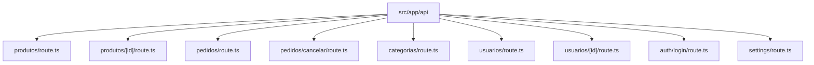
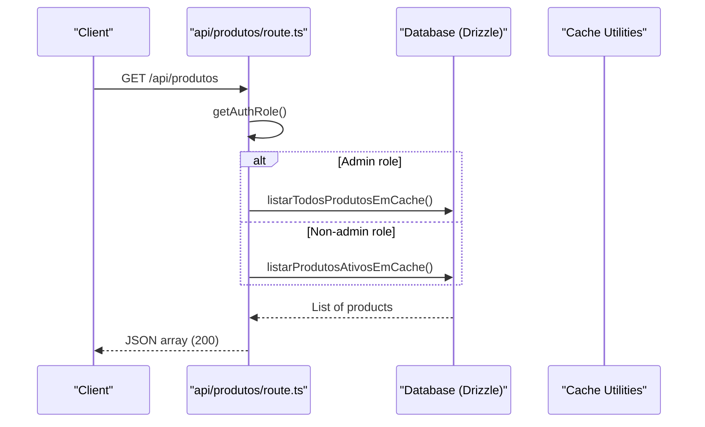
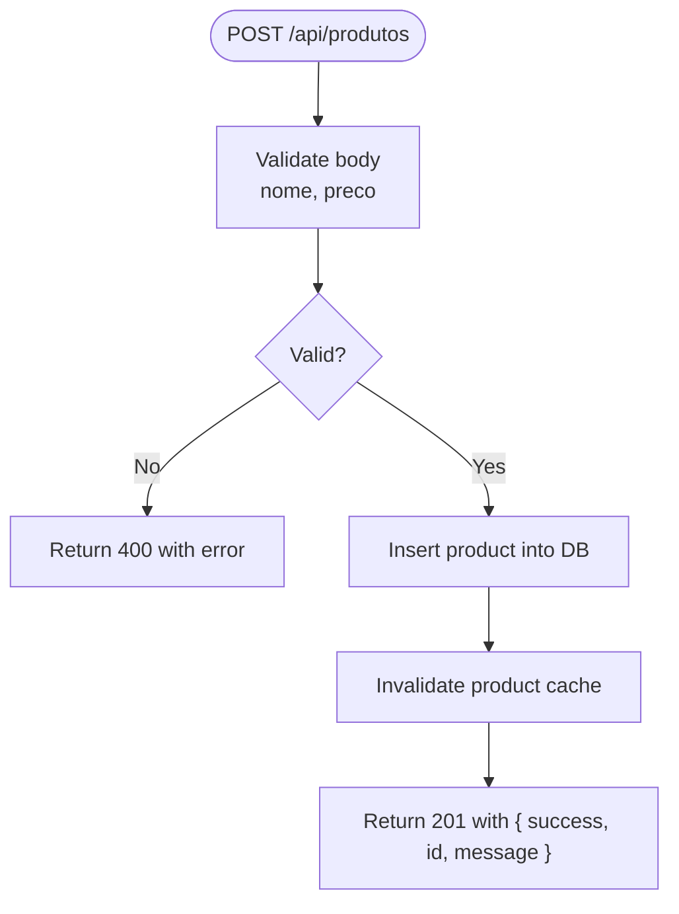
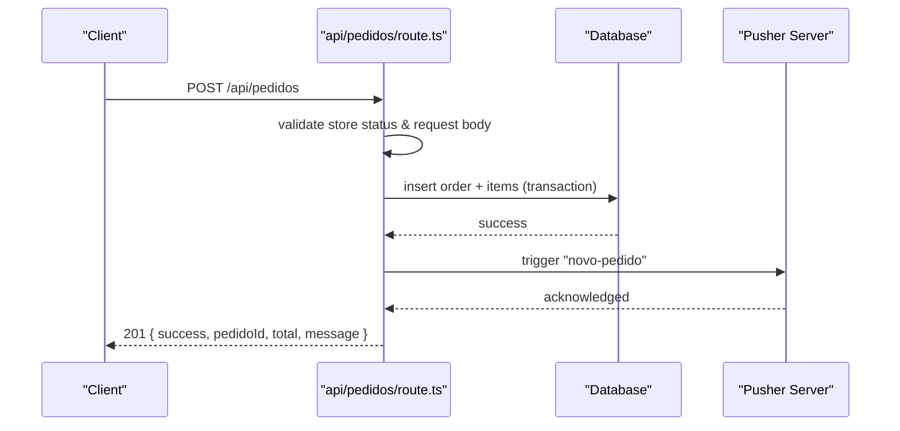
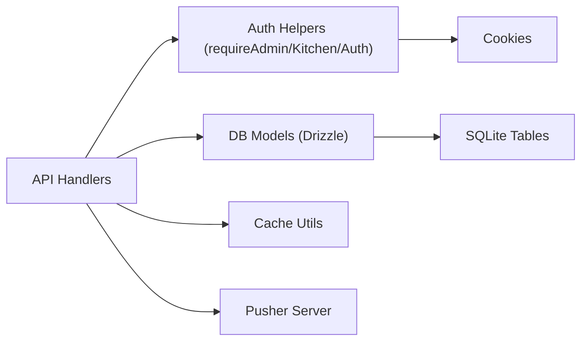

# API Route Organization

<cite>
**Referenced Files in This Document**
- [produtos route.ts](file://src/app/api/produtos/route.ts)
- [produtos id route.ts](file://src/app/api/produtos/[id]/route.ts)
- [pedidos route.ts](file://src/app/api/pedidos/route.ts)
- [pedidos cancelar route.ts](file://src/app/api/pedidos/cancelar/route.ts)
- [categorias route.ts](file://src/app/api/categorias/route.ts)
- [usuarios route.ts](file://src/app/api/usuarios/route.ts)
- [usuarios id route.ts](file://src/app/api/usuarios/[id]/route.ts)
- [auth login route.ts](file://src/app/api/auth/login/route.ts)
- [settings route.ts](file://src/app/api/settings/route.ts)
- [auth utilities](file://src/lib/auth.ts)
- [database schema](file://src/db/schema.ts)
</cite>

## Table of Contents
1. [Introduction](#introduction)
2. [Project Structure](#project-structure)
3. [Core Components](#core-components)
4. [Architecture Overview](#architecture-overview)
5. [Detailed Component Analysis](#detailed-component-analysis)
6. [Dependency Analysis](#dependency-analysis)
7. [Performance Considerations](#performance-considerations)
8. [Troubleshooting Guide](#troubleshooting-guide)
9. [Conclusion](#conclusion)

## Introduction
This document explains how the Next.js App Router organizes API routes using resource-based URL patterns and RESTful conventions. It focuses on the resources produtos, pedidos, categorias, and usuarios, detailing file naming, HTTP method handlers (GET, POST, PUT, DELETE), dynamic parameter routing with [id], error handling patterns, and response formatting standards used across the application.

## Project Structure
The API endpoints are implemented under src/app/api using Next.js App Router conventions:
- Each resource has its own directory (e.g., api/produtos, api/pedidos).
- Collection-level operations live in route.ts within the resource directory.
- Item-level operations for a specific resource use a dynamic segment folder named [id] with its own route.ts.
- Specialized sub-routes exist as nested folders (e.g., api/pedidos/cancelar).

**Diagram sources**
- [produtos route.ts:1-53](file://src/app/api/produtos/route.ts#L1-L53)
- [produtos id route.ts:1-64](file://src/app/api/produtos/[id]/route.ts#L1-L64)
- [pedidos route.ts:1-253](file://src/app/api/pedidos/route.ts#L1-L253)
- [pedidos cancelar route.ts:1-21](file://src/app/api/pedidos/cancelar/route.ts#L1-L21)
- [categorias route.ts:1-28](file://src/app/api/categorias/route.ts#L1-L28)
- [usuarios route.ts:1-79](file://src/app/api/usuarios/route.ts#L1-L79)
- [usuarios id route.ts:1-23](file://src/app/api/usuarios/[id]/route.ts#L1-L23)
- [auth login route.ts:1-80](file://src/app/api/auth/login/route.ts#L1-L80)
- [settings route.ts:1-35](file://src/app/api/settings/route.ts#L1-L35)

**Section sources**
- [produtos route.ts:1-53](file://src/app/api/produtos/route.ts#L1-L53)
- [pedidos route.ts:1-253](file://src/app/api/pedidos/route.ts#L1-L253)
- [categorias route.ts:1-28](file://src/app/api/categorias/route.ts#L1-L28)
- [usuarios route.ts:1-79](file://src/app/api/usuarios/route.ts#L1-L79)

## Core Components
- Resource directories:
  - api/produtos: collection and item endpoints for menu items.
  - api/pedidos: collection endpoint plus specialized action endpoint for cancellation.
  - api/categorias: category update operation.
  - api/usuarios: user management endpoints.
- Dynamic segments:
  - [id] folders provide item-specific operations (e.g., update or delete a single product or user).
- Authentication and authorization:
  - Centralized helpers enforce role-based access (admin, cozinha, atendente).
- Data layer:
  - Drizzle ORM models define tables for products, orders, order items, settings, and users.

**Section sources**
- [auth utilities:1-82](file://src/lib/auth.ts#L1-L82)
- [database schema:1-56](file://src/db/schema.ts#L1-L56)

## Architecture Overview
The API follows a resource-oriented design aligned with REST principles:
- Collections expose GET and POST to list and create resources.
- Items expose PUT and DELETE for updates and removals via [id].
- Specialized actions are exposed as nested routes (e.g., pedidos/cancelar).
- Authorization is enforced per handler using role checks before business logic executes.
- Responses are consistently formatted using JSON payloads with appropriate HTTP status codes.

**Diagram sources**
- [produtos route.ts:6-16](file://src/app/api/produtos/route.ts#L6-L16)
- [auth utilities:51-78](file://src/lib/auth.ts#L51-L78)

**Section sources**
- [produtos route.ts:6-16](file://src/app/api/produtos/route.ts#L6-L16)
- [auth utilities:51-78](file://src/lib/auth.ts#L51-L78)

## Detailed Component Analysis

### Products (produtos)
- File structure:
  - api/produtos/route.ts: GET (list), POST (create).
  - api/produtos/[id]/route.ts: PUT (update), DELETE (remove).
- Routing patterns:
  - GET /api/produtos returns all active products for non-admins and all products for admins.
  - POST /api/produtos creates a new product; requires admin role.
  - PUT /api/produtos/:id updates an existing product; requires admin role.
  - DELETE /api/produtos/:id removes a product; requires admin role.
- Validation and errors:
  - Input validation ensures required fields like nome and preco are present and valid.
  - Returns 400 for invalid input, 500 for server errors.
- Response format:
  - Success responses include success flags and messages.
  - Error responses include an error field with a descriptive message.
- Side effects:
  - Cache invalidation after mutations to keep listings consistent.

**Diagram sources**
- [produtos route.ts:18-52](file://src/app/api/produtos/route.ts#L18-L52)

**Section sources**
- [produtos route.ts:6-52](file://src/app/api/produtos/route.ts#L6-L52)
- [produtos id route.ts:8-63](file://src/app/api/produtos/[id]/route.ts#L8-L63)

### Orders (pedidos)
- File structure:
  - api/pedidos/route.ts: GET (list), POST (create), PATCH (status update), DELETE (remove).
  - api/pedidos/cancelar/route.ts: POST to cancel a pending order.
- Routing patterns:
  - GET /api/pedidos supports two modes:
    - Unauthenticated clients can query by ids query param to fetch their own orders.
    - Authenticated staff (admin, cozinha, atendente) can list all orders.
  - POST /api/pedidos creates an order with items; validates store status, inputs, and totals.
  - PATCH /api/pedidos updates order status; restricted to kitchen/admin roles.
  - DELETE /api/pedidos deletes an order and its items; restricted to kitchen/admin roles.
  - POST /api/pedidos/cancelar cancels a pending order if eligible.
- Validation and errors:
  - Comprehensive validation for items, quantities, prices, and table identifiers.
  - Enforces business rules such as store open/closed state and cancellable statuses.
  - Returns 400 for invalid input, 403 when store closed, 404 for not found, 409 for conflicts, 500 for server errors.
- Response format:
  - Success responses include success flags and relevant identifiers/messages.
  - Error responses include descriptive error messages.
- Side effects:
  - Real-time notifications via Pusher for new orders and status changes.

**Diagram sources**
- [pedidos route.ts:65-189](file://src/app/api/pedidos/route.ts#L65-L189)

**Section sources**
- [pedidos route.ts:15-253](file://src/app/api/pedidos/route.ts#L15-L253)
- [pedidos cancelar route.ts:6-21](file://src/app/api/pedidos/cancelar/route.ts#L6-L21)

### Categories (categorias)
- File structure:
  - api/categorias/route.ts: PUT to rename a category across products.
- Routing pattern:
  - PUT /api/categorias updates all products from categoriaAtual to novaCategoria.
- Validation and errors:
  - Requires both current and new category names; returns 400 if missing.
  - Returns 500 on server errors.
- Side effects:
  - Invalidates product cache after category update.

**Section sources**
- [categorias route.ts:8-27](file://src/app/api/categorias/route.ts#L8-L27)

### Users (usuarios)
- File structure:
  - api/usuarios/route.ts: GET (list), POST (create).
  - api/usuarios/[id]/route.ts: DELETE (remove).
- Routing patterns:
  - GET /api/usuarios lists users without sensitive PIN data; requires admin role.
  - POST /api/usuarios creates a user with normalized cargo and hashed PIN; enforces unique admin constraint and PIN format.
  - DELETE /api/usuarios/:id removes a user; requires admin role.
- Validation and errors:
  - Validates required fields, cargo normalization, PIN length/format, and admin uniqueness.
  - Returns 400 for invalid input, 409 for duplicate admin, 500 for server errors.
- Response format:
  - Success responses include success flags and safe user data (PIN excluded).

**Section sources**
- [usuarios route.ts:7-79](file://src/app/api/usuarios/route.ts#L7-L79)
- [usuarios id route.ts:7-23](file://src/app/api/usuarios/[id]/route.ts#L7-L23)

### Authentication (auth)
- File structure:
  - api/auth/login/route.ts: POST to authenticate via PIN and set auth cookies.
- Routing pattern:
  - POST /api/auth/login verifies PIN against stored hashes, applies rate limiting, sets role-based cookies, and returns user info.
- Validation and errors:
  - Enforces PIN format and length.
  - Rate limits login attempts and failed logins; returns 429 with Retry-After header when exceeded.
  - Returns 401 for invalid PIN, 500 for server errors.
- Response format:
  - Success includes success flag, normalized cargo, and user name.

**Section sources**
- [auth login route.ts:16-80](file://src/app/api/auth/login/route.ts#L16-L80)
- [auth utilities:1-82](file://src/lib/auth.ts#L1-L82)

### Settings (settings)
- File structure:
  - api/settings/route.ts: GET (read), POST (write).
- Routing patterns:
  - GET /api/settings returns store status and preparation time defaults.
  - POST /api/settings creates or updates configuration; requires admin role.
- Validation and errors:
  - Ensures payload validity; returns 400 for invalid data, 500 for server errors.

**Section sources**
- [settings route.ts:7-35](file://src/app/api/settings/route.ts#L7-L35)

## Dependency Analysis
- Authentication dependencies:
  - All protected endpoints call requireAdmin, requireKitchen, or requireAuth to enforce roles.
  - Role resolution uses cookie-based sessions set during login.
- Database dependencies:
  - Endpoints import Drizzle models from db/schema.ts to interact with SQLite tables.
- Cache dependencies:
  - Product-related mutations invalidate caches to ensure consistency.
- Real-time dependencies:
  - Order creation and status updates trigger Pusher events for live updates.

**Diagram sources**
- [auth utilities:51-82](file://src/lib/auth.ts#L51-L82)
- [database schema:1-56](file://src/db/schema.ts#L1-L56)
- [pedidos route.ts:173-180](file://src/app/api/pedidos/route.ts#L173-L180)

**Section sources**
- [auth utilities:51-82](file://src/lib/auth.ts#L51-L82)
- [database schema:1-56](file://src/db/schema.ts#L1-L56)
- [pedidos route.ts:173-180](file://src/app/api/pedidos/route.ts#L173-L180)

## Performance Considerations
- Use cached listing for products to reduce database load; invalidate cache on mutations.
- Batch queries where possible (e.g., fetching multiple orders by IDs).
- Keep transactions small and focused (order creation and deletion use transactions to maintain integrity).
- Avoid unnecessary computations in hot paths; validate early and return fast failures.

[No sources needed since this section provides general guidance]

## Troubleshooting Guide
Common issues and resolutions:
- Unauthorized or forbidden:
  - Ensure proper authentication cookies are set via login; verify role permissions for endpoints.
- Validation errors:
  - Check request payloads for required fields and correct types; review error messages returned by endpoints.
- Store closed:
  - When creating orders, check store status; if closed, wait until reopened.
- Rate limiting:
  - If receiving 429, respect Retry-After header and retry later.
- Not found or conflict:
  - For deletions or cancellations, verify resource existence and current status before attempting operations.

**Section sources**
- [auth login route.ts:16-80](file://src/app/api/auth/login/route.ts#L16-L80)
- [pedidos route.ts:65-189](file://src/app/api/pedidos/route.ts#L65-L189)
- [pedidos cancelar route.ts:6-21](file://src/app/api/pedidos/cancelar/route.ts#L6-L21)

## Conclusion
The API is organized around clear resource boundaries with consistent RESTful patterns. Each resource directory encapsulates its collection and item endpoints, while special actions are exposed as nested routes. Authentication and authorization are centralized, ensuring secure access control. Validation and error handling follow uniform conventions, providing predictable client experiences. The combination of caching, transactions, and real-time notifications delivers robust performance and responsiveness.

[No sources needed since this section summarizes without analyzing specific files]