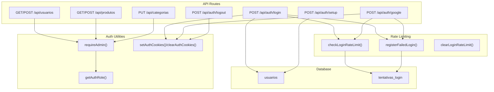
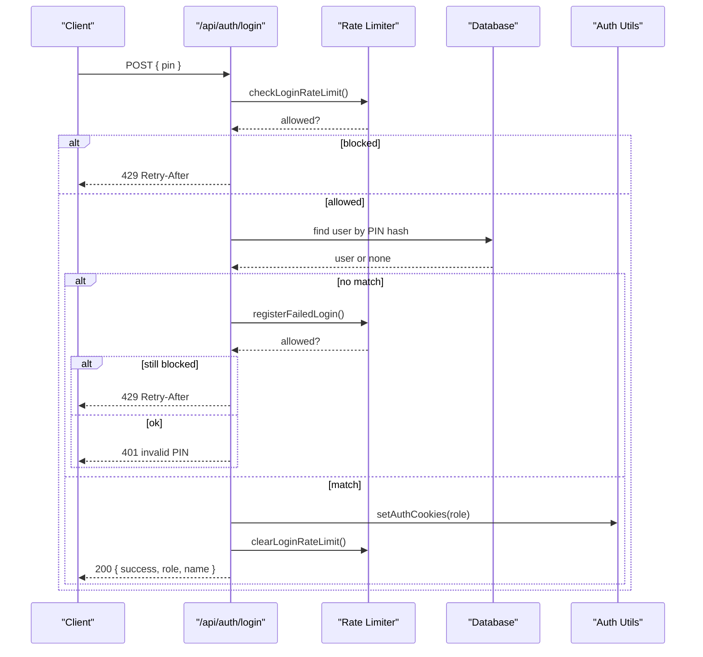
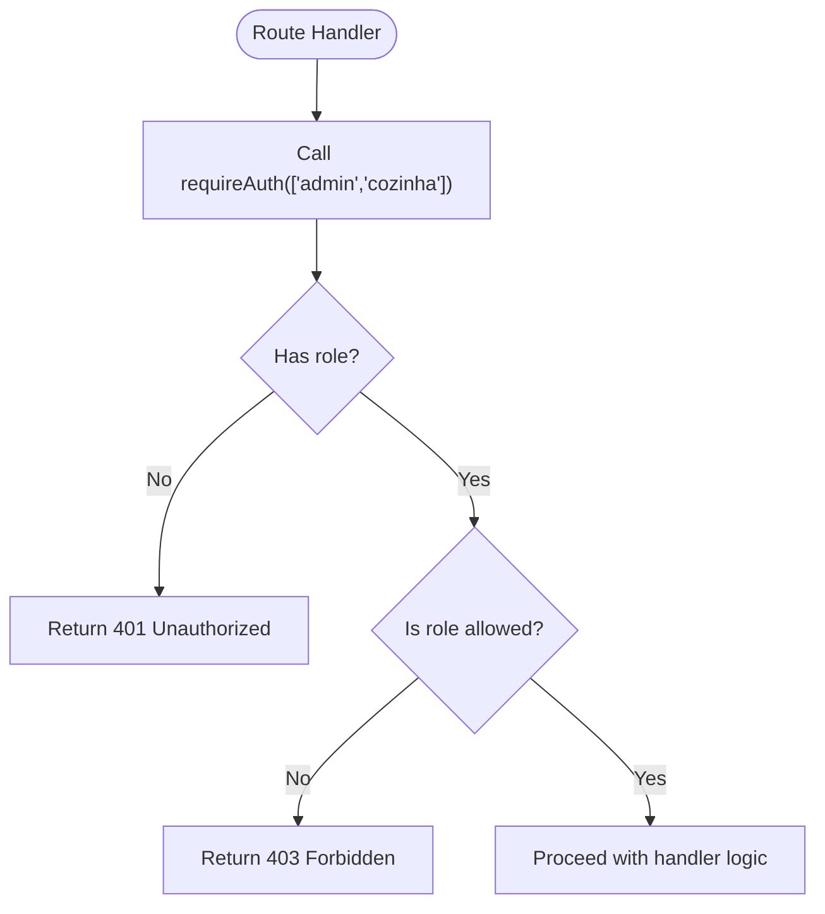
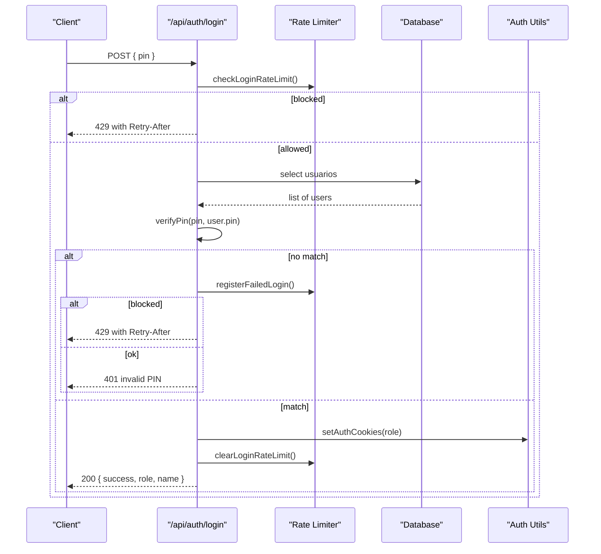
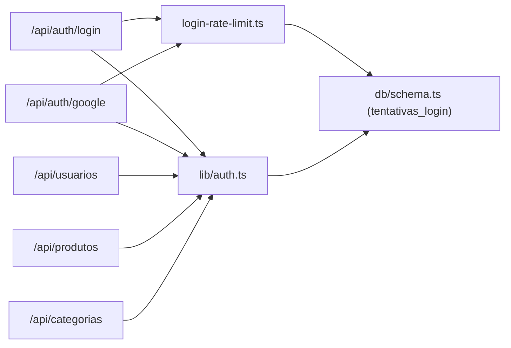

# Authentication & Authorization Middleware

<cite>
**Referenced Files in This Document**
- [auth.ts](file://src/lib/auth.ts)
- [login-rate-limit.ts](file://src/lib/login-rate-limit.ts)
- [route.ts (Login)](file://src/app/api/auth/login/route.ts)
- [route.ts (Logout)](file://src/app/api/auth/logout/route.ts)
- [route.ts (Setup)](file://src/app/api/auth/setup/route.ts)
- [route.ts (Google Auth)](file://src/app/api/auth/google/route.ts)
- [route.ts (Users API)](file://src/app/api/usuarios/route.ts)
- [route.ts (Products API)](file://src/app/api/produtos/route.ts)
- [route.ts (Categories API)](file://src/app/api/categorias/route.ts)
- [schema.ts](file://src/db/schema.ts)
</cite>

## Table of Contents
1. [Introduction](#introduction)
2. [Project Structure](#project-structure)
3. [Core Components](#core-components)
4. [Architecture Overview](#architecture-overview)
5. [Detailed Component Analysis](#detailed-component-analysis)
6. [Dependency Analysis](#dependency-analysis)
7. [Performance Considerations](#performance-considerations)
8. [Troubleshooting Guide](#troubleshooting-guide)
9. [Conclusion](#conclusion)

## Introduction
This document explains the authentication and authorization middleware implemented in this Next.js application. It covers:
- Role-based access control using requireAdmin() and getAuthRole()
- Cookie-based session management for authenticated sessions
- Login and logout flows, including rate limiting to protect against brute-force attempts
- Protected API routes and examples of custom authorization logic per role
- Security measures such as PIN hashing, cookie options, and setup gating

The system uses cookies to maintain sessions and a simple role model with three roles: admin, cozinha (kitchen), and atendente (attendant). Admins have full access; other roles are restricted by route-level checks.

## Project Structure
Authentication and authorization are implemented primarily in server-side API routes and shared utilities:
- Shared auth utilities: src/lib/auth.ts
- Rate limiting for login attempts: src/lib/login-rate-limit.ts
- Authentication endpoints: src/app/api/auth/*
- Protected business APIs: src/app/api/usuarios, produtos, categorias
- Database schema defining users and login attempt tracking: src/db/schema.ts

**Diagram sources**
- [route.ts (Login):16-79](file://src/app/api/auth/login/route.ts#L16-L79)
- [route.ts (Logout):6-14](file://src/app/api/auth/logout/route.ts#L6-L14)
- [route.ts (Setup):6-44](file://src/app/api/auth/setup/route.ts#L6-L44)
- [route.ts (Google Auth):27-76](file://src/app/api/auth/google/route.ts#L27-L76)
- [route.ts (Users API):7-78](file://src/app/api/usuarios/route.ts#L7-L78)
- [route.ts (Products API):6-52](file://src/app/api/produtos/route.ts#L6-L52)
- [route.ts (Categories API):8-27](file://src/app/api/categorias/route.ts#L8-L27)
- [auth.ts:39-82](file://src/lib/auth.ts#L39-L82)
- [login-rate-limit.ts:45-106](file://src/lib/login-rate-limit.ts#L45-L106)
- [schema.ts:42-55](file://src/db/schema.ts#L42-L55)

**Section sources**
- [auth.ts:1-82](file://src/lib/auth.ts#L1-L82)
- [login-rate-limit.ts:1-115](file://src/lib/login-rate-limit.ts#L1-L115)
- [schema.ts:1-56](file://src/db/schema.ts#L1-L56)

## Core Components
- Role-based access control:
  - getAuthRole(): reads role from cookies and returns the current role or null.
  - requireAuth(allowed[]): central authorization check returning either { role } or an error response.
  - requireAdmin(): convenience wrapper that restricts to admin only.
  - requireKitchen(): allows admin and kitchen roles.
- Session management:
  - setAuthCookies(cargo): sets role-specific cookies with secure options.
  - clearAuthCookies(): removes all role cookies on logout.
- Rate limiting:
  - checkLoginRateLimit(request): blocks requests if too many failed attempts within a time window.
  - registerFailedLogin(request): increments failures and may lockout the client identifier.
  - clearLoginRateLimit(request): clears counters after successful login.
- Endpoints:
  - POST /api/auth/login: validates PIN, applies rate limiting, sets session cookies.
  - POST /api/auth/logout: clears session cookies.
  - POST /api/auth/setup: creates initial admin user with a random PIN, optionally gated by a secret header.
  - POST /api/auth/google: validates Google ID token, enforces allowed emails, grants admin session.

**Section sources**
- [auth.ts:21-82](file://src/lib/auth.ts#L21-L82)
- [login-rate-limit.ts:45-106](file://src/lib/login-rate-limit.ts#L45-L106)
- [route.ts (Login):16-79](file://src/app/api/auth/login/route.ts#L16-L79)
- [route.ts (Logout):6-14](file://src/app/api/auth/logout/route.ts#L6-L14)
- [route.ts (Setup):6-44](file://src/app/api/auth/setup/route.ts#L6-L44)
- [route.ts (Google Auth):27-76](file://src/app/api/auth/google/route.ts#L27-L76)

## Architecture Overview
The authentication flow is request-driven and stateless except for cookies and a database-backed rate limiter:
- Clients authenticate via PIN or Google ID token.
- On success, the server sets role-specific cookies to establish a session.
- Protected routes call requireAdmin() or requireAuth() to enforce RBAC.
- Rate limiting protects login endpoints using a persistent table keyed by a hashed client identifier.

**Diagram sources**
- [route.ts (Login):16-79](file://src/app/api/auth/login/route.ts#L16-L79)
- [login-rate-limit.ts:45-106](file://src/lib/login-rate-limit.ts#L45-L106)
- [auth.ts:39-57](file://src/lib/auth.ts#L39-L57)
- [schema.ts:42-55](file://src/db/schema.ts#L42-L55)

## Detailed Component Analysis

### Role-Based Access Control (RBAC)
- Roles: admin, cozinha, atendente.
- getAuthRole(): reads cookies to determine current role.
- requireAuth(allowed[]): ensures the caller has a valid role and one of the allowed roles; admin always passes.
- requireAdmin(): restricts to admin only.
- Usage patterns:
  - Route handlers call requireAdmin() and handle the case where it returns a NextResponse (error).
  - For read-only public data, getAuthRole() can be used to adjust behavior based on role without blocking access.

**Diagram sources**
- [auth.ts:51-82](file://src/lib/auth.ts#L51-L82)

**Section sources**
- [auth.ts:51-82](file://src/lib/auth.ts#L51-L82)
- [route.ts (Users API):7-18](file://src/app/api/usuarios/route.ts#L7-L18)
- [route.ts (Products API):6-16](file://src/app/api/produtos/route.ts#L6-L16)

### Session Management with Cookies
- setAuthCookies(cargo): sets a cookie named auth_<role> with httpOnly, secure (in production), path "/", sameSite lax, and a 7-day maxAge.
- clearAuthCookies(): deletes all role cookies.
- getAuthRole(): reads these cookies to infer the active role.

Security notes:
- Cookies are httpOnly to prevent client-side script access.
- Secure flag is enabled in production to ensure HTTPS-only transmission.
- SameSite lax mitigates CSRF risks for cross-site requests.

**Section sources**
- [auth.ts:13-57](file://src/lib/auth.ts#L13-L57)
- [route.ts (Login):62-74](file://src/app/api/auth/login/route.ts#L62-L74)
- [route.ts (Logout):6-14](file://src/app/api/auth/logout/route.ts#L6-L14)

### Login Flow (PIN-based)
- Validates input constraints (PIN length/format).
- Applies rate limiting before attempting authentication.
- Compares provided PIN against stored hashes.
- On success, sets role cookies and clears rate limit counters.
- On failure, registers failed attempt and may block further attempts.

**Diagram sources**
- [route.ts (Login):16-79](file://src/app/api/auth/login/route.ts#L16-L79)
- [login-rate-limit.ts:45-106](file://src/lib/login-rate-limit.ts#L45-L106)
- [auth.ts:21-42](file://src/lib/auth.ts#L21-L42)
- [schema.ts:42-48](file://src/db/schema.ts#L42-L48)

**Section sources**
- [route.ts (Login):16-79](file://src/app/api/auth/login/route.ts#L16-L79)
- [login-rate-limit.ts:45-106](file://src/lib/login-rate-limit.ts#L45-L106)
- [auth.ts:21-42](file://src/lib/auth.ts#L21-L42)

### Logout Flow
- Clears all role cookies to terminate the session.
- Returns a success response.

**Section sources**
- [route.ts (Logout):6-14](file://src/app/api/auth/logout/route.ts#L6-L14)
- [auth.ts:44-49](file://src/lib/auth.ts#L44-L49)

### Setup Flow (Initial Admin Creation)
- Optionally requires a secret header when SETUP_SECRET is configured.
- Prevents re-setup if any user already exists.
- Generates a random PIN, hashes it, and inserts the first admin user.
- Returns the generated PIN once (for safe recording).

Security notes:
- Use SETUP_SECRET to gate setup in environments where it could be exposed.
- PIN is hashed before storage; never store plaintext PINs.

**Section sources**
- [route.ts (Setup):6-44](file://src/app/api/auth/setup/route.ts#L6-L44)
- [auth.ts:21-23](file://src/lib/auth.ts#L21-L23)
- [schema.ts:42-48](file://src/db/schema.ts#L42-L48)

### Google Authentication Flow
- Validates a Google ID token via Firebase lookup.
- Enforces an allowlist of admin emails from environment configuration.
- On success, sets admin session cookies and clears rate limit counters.
- On failure, registers a failed attempt and may block subsequent attempts.

**Section sources**
- [route.ts (Google Auth):27-76](file://src/app/api/auth/google/route.ts#L27-L76)
- [login-rate-limit.ts:45-106](file://src/lib/login-rate-limit.ts#L45-L106)
- [auth.ts:39-42](file://src/lib/auth.ts#L39-L42)

### Protecting API Routes with Custom Authorization
Examples of protecting routes:
- Users API: GET and POST require admin via requireAdmin().
- Products API:
  - POST requires admin.
  - GET uses getAuthRole() to serve different datasets based on role (e.g., admins see all products; others see only active ones).
- Categories API: PUT requires admin.

Pattern:
- Call requireAdmin() or requireAuth([...]) at the top of the handler.
- If the result is a NextResponse, return it immediately.
- Otherwise, proceed with business logic.

**Section sources**
- [route.ts (Users API):7-78](file://src/app/api/usuarios/route.ts#L7-L78)
- [route.ts (Products API):6-52](file://src/app/api/produtos/route.ts#L6-L52)
- [route.ts (Categories API):8-27](file://src/app/api/categorias/route.ts#L8-L27)
- [auth.ts:51-82](file://src/lib/auth.ts#L51-L82)

## Dependency Analysis
Key dependencies and relationships:
- API routes depend on auth utilities for role checks and cookie handling.
- Login and Google endpoints depend on rate limiting to mitigate brute-force attacks.
- Rate limiting depends on the database to persist attempts and lockouts.
- Schema defines tables for users and login attempts.

**Diagram sources**
- [route.ts (Login):16-79](file://src/app/api/auth/login/route.ts#L16-L79)
- [route.ts (Google Auth):27-76](file://src/app/api/auth/google/route.ts#L27-L76)
- [login-rate-limit.ts:45-106](file://src/lib/login-rate-limit.ts#L45-L106)
- [auth.ts:51-82](file://src/lib/auth.ts#L51-L82)
- [schema.ts:42-55](file://src/db/schema.ts#L42-L55)

**Section sources**
- [login-rate-limit.ts:1-115](file://src/lib/login-rate-limit.ts#L1-L115)
- [auth.ts:1-82](file://src/lib/auth.ts#L1-L82)
- [schema.ts:1-56](file://src/db/schema.ts#L1-L56)

## Performance Considerations
- Rate limiting uses a single table with a hashed client identifier to minimize overhead while providing effective protection.
- Login queries scan users; consider indexing or filtering strategies if the user base grows significantly.
- Cache invalidation in product/category updates avoids stale reads but should be used judiciously under high load.
- Cookie-based sessions avoid server-side session stores, reducing memory usage.

[No sources needed since this section provides general guidance]

## Troubleshooting Guide
Common issues and resolutions:
- 429 Too Many Requests during login:
  - Indicates rate limiting triggered due to excessive failed attempts. Wait for the retry-after period or reset via successful login.
- 401 Unauthorized:
  - Missing or invalid session cookies; ensure login succeeded and cookies were set.
- 403 Forbidden:
  - Insufficient role for the requested endpoint; verify the user’s role and required permissions.
- Setup blocked:
  - If SETUP_SECRET is configured, include the x-setup-secret header with the correct value.
  - If users already exist, use the user management panel instead of setup.

Operational tips:
- Verify cookie settings (httpOnly, secure, sameSite) in production.
- Ensure environment variables for Google auth and setup secret are correctly configured.
- Monitor the tentativas_login table for anomalies or unexpected lockouts.

**Section sources**
- [route.ts (Login):16-79](file://src/app/api/auth/login/route.ts#L16-L79)
- [route.ts (Google Auth):27-76](file://src/app/api/auth/google/route.ts#L27-L76)
- [route.ts (Setup):6-44](file://src/app/api/auth/setup/route.ts#L6-L44)
- [auth.ts:51-82](file://src/lib/auth.ts#L51-L82)

## Conclusion
This implementation provides a practical, secure foundation for authentication and authorization:
- Role-based access control via requireAdmin() and getAuthRole() enables fine-grained route protection.
- Cookie-based sessions offer simplicity and performance without external session stores.
- Rate limiting safeguards login endpoints against brute-force attacks.
- Clear patterns for protecting API routes and implementing custom authorization logic make it easy to extend security policies as requirements evolve.

[No sources needed since this section summarizes without analyzing specific files]