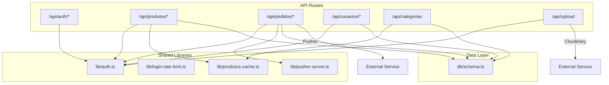
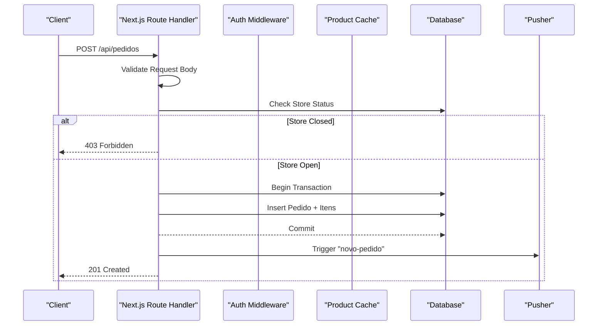
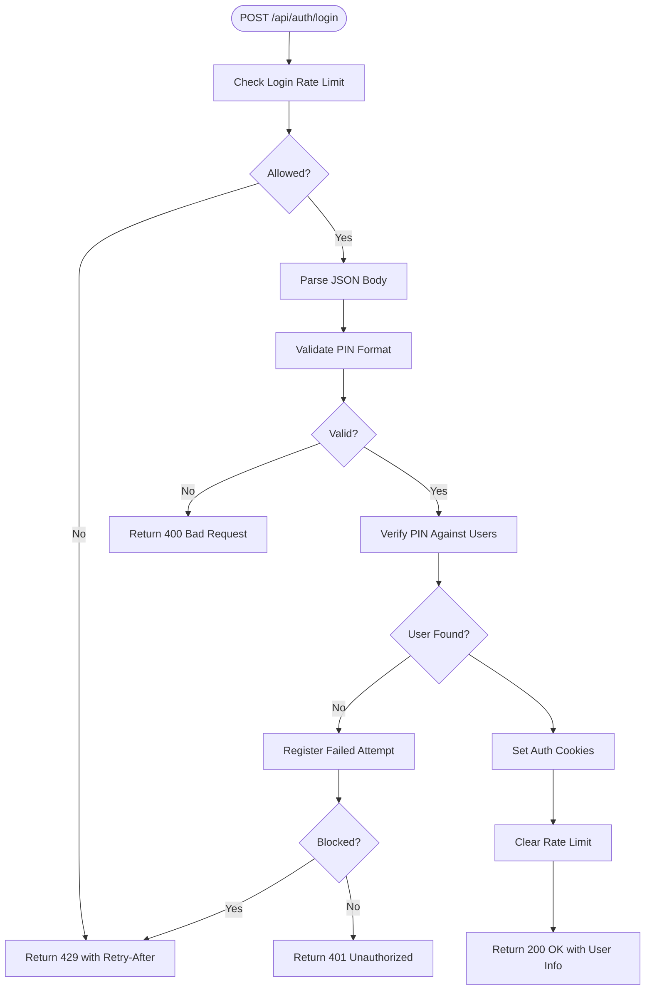
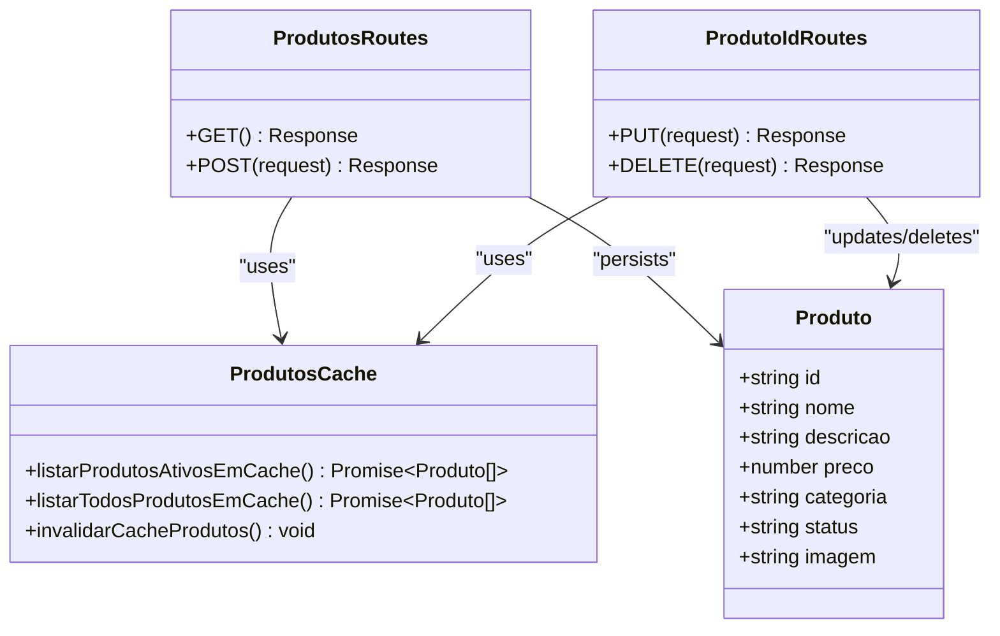
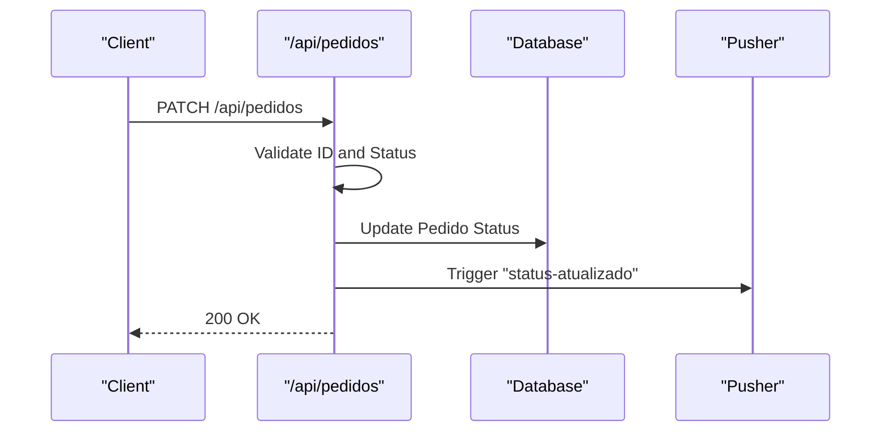
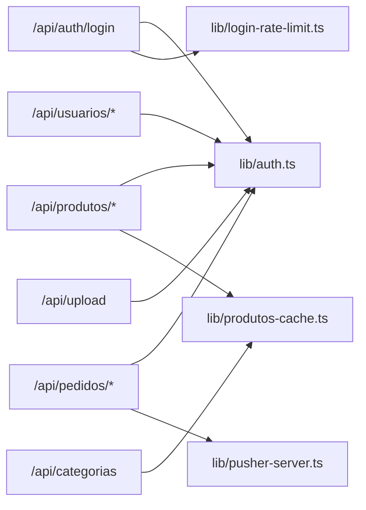

# Backend API Architecture

<cite>
**Referenced Files in This Document**
- [package.json](file://package.json)
- [schema.ts](file://src/db/schema.ts)
- [auth.ts](file://src/lib/auth.ts)
- [login-rate-limit.ts](file://src/lib/login-rate-limit.ts)
- [produtos-cache.ts](file://src/lib/produtos-cache.ts)
- [pusher-server.ts](file://src/lib/pusher-server.ts)
- [route.ts (auth/login)](file://src/app/api/auth/login/route.ts)
- [route.ts (auth/logout)](file://src/app/api/auth/logout/route.ts)
- [route.ts (auth/setup)](file://src/app/api/auth/setup/route.ts)
- [route.ts (auth/google)](file://src/app/api/auth/google/route.ts)
- [route.ts (produtos)](file://src/app/api/produtos/route.ts)
- [route.ts (produtos/[id])](file://src/app/api/produtos/[id]/route.ts)
- [route.ts (categorias)](file://src/app/api/categorias/route.ts)
- [route.ts (pedidos)](file://src/app/api/pedidos/route.ts)
- [route.ts (pedidos/cancelar)](file://src/app/api/pedidos/cancelar/route.ts)
- [route.ts (usuarios)](file://src/app/api/usuarios/route.ts)
- [route.ts (upload)](file://src/app/api/upload/route.ts)
</cite>

## Table of Contents
1. [Introduction](#introduction)
2. [Project Structure](#project-structure)
3. [Core Components](#core-components)
4. [Architecture Overview](#architecture-overview)
5. [Detailed Component Analysis](#detailed-component-analysis)
6. [Dependency Analysis](#dependency-analysis)
7. [Performance Considerations](#performance-considerations)
8. [Troubleshooting Guide](#troubleshooting-guide)
9. [Conclusion](#conclusion)
10. [Appendices](#appendices)

## Introduction
This document describes the backend API architecture implemented with Next.js API routes for a restaurant menu and ordering system. It focuses on resource-based URL design, request/response handling, error management, authentication and authorization middleware patterns, input validation, data transformation layers, caching strategies, external service integrations, and security best practices. The goal is to provide both high-level architectural insights and code-level details that are accessible to readers with varying technical backgrounds.

## Project Structure
The API follows Next.js App Router conventions with route handlers organized by domain resources under src/app/api. Each resource has its own folder with route files implementing HTTP methods. Shared logic such as authentication, rate limiting, caching, and external integrations lives under src/lib. Database schemas are defined using Drizzle ORM in src/db/schema.ts.

**Diagram sources**
- [route.ts (auth/login)](file://src/app/api/auth/login/route.ts)
- [route.ts (produtos)](file://src/app/api/produtos/route.ts)
- [route.ts (pedidos)](file://src/app/api/pedidos/route.ts)
- [route.ts (usuarios)](file://src/app/api/usuarios/route.ts)
- [route.ts (categorias)](file://src/app/api/categorias/route.ts)
- [route.ts (upload)](file://src/app/api/upload/route.ts)
- [auth.ts](file://src/lib/auth.ts)
- [login-rate-limit.ts](file://src/lib/login-rate-limit.ts)
- [produtos-cache.ts](file://src/lib/produtos-cache.ts)
- [pusher-server.ts](file://src/lib/pusher-server.ts)
- [schema.ts](file://src/db/schema.ts)

**Section sources**
- [package.json:1-45](file://package.json#L1-L45)
- [schema.ts:1-56](file://src/db/schema.ts#L1-L56)

## Core Components
- Authentication and Authorization Middleware
  - Role-based access control using cookies and helper functions to enforce permissions per endpoint.
  - PIN-based login flow with secure hashing and cookie management.
- Rate Limiting
  - Login attempt throttling with persistent tracking and lockout windows.
- Caching
  - Server-side caching for product listings with tag-based invalidation on mutations.
- External Integrations
  - Pusher for real-time notifications on order events.
  - Cloudinary for image uploads.
- Data Layer
  - Drizzle ORM schema definitions for SQLite-backed tables.

**Section sources**
- [auth.ts:1-82](file://src/lib/auth.ts#L1-L82)
- [login-rate-limit.ts:1-115](file://src/lib/login-rate-limit.ts#L1-L115)
- [produtos-cache.ts:1-23](file://src/lib/produtos-cache.ts#L1-L23)
- [pusher-server.ts:1-11](file://src/lib/pusher-server.ts#L1-L11)
- [schema.ts:1-56](file://src/db/schema.ts#L1-L56)

## Architecture Overview
The API is organized around RESTful resources with clear separation of concerns:
- Resource endpoints encapsulate CRUD operations and business rules.
- Middleware functions handle authentication and authorization uniformly across endpoints.
- Input validation occurs at the edge of each handler to ensure correctness before persistence.
- Caching reduces database load for read-heavy endpoints like product listings.
- Real-time updates are triggered via Pusher after successful state changes.

**Diagram sources**
- [route.ts (pedidos)](file://src/app/api/pedidos/route.ts)
- [pusher-server.ts:1-11](file://src/lib/pusher-server.ts#L1-L11)
- [schema.ts:1-56](file://src/db/schema.ts#L1-L56)

## Detailed Component Analysis

### Authentication and Authorization
- PIN-based login sets role-specific cookies; logout clears them.
- Role checks use helper functions to enforce allowed roles per endpoint.
- Admin-only endpoints protect sensitive operations like user creation and product management.

**Diagram sources**
- [route.ts (auth/login)](file://src/app/api/auth/login/route.ts)
- [login-rate-limit.ts:1-115](file://src/lib/login-rate-limit.ts#L1-L115)
- [auth.ts:1-82](file://src/lib/auth.ts#L1-L82)

**Section sources**
- [auth.ts:1-82](file://src/lib/auth.ts#L1-L82)
- [route.ts (auth/login)](file://src/app/api/auth/login/route.ts)
- [login-rate-limit.ts:1-115](file://src/lib/login-rate-limit.ts#L1-L115)

### Product Management Endpoints
- GET /api/produtos returns active products for non-admin users and all products for admins.
- POST /api/produtos creates new products with validation and cache invalidation.
- PUT /api/produtos/[id] updates an existing product with validation and cache invalidation.
- DELETE /api/produtos/[id] removes a product and invalidates cache.

**Diagram sources**
- [route.ts (produtos)](file://src/app/api/produtos/route.ts)
- [route.ts (produtos/[id])](file://src/app/api/produtos/[id]/route.ts)
- [produtos-cache.ts:1-23](file://src/lib/produtos-cache.ts#L1-L23)
- [schema.ts:1-56](file://src/db/schema.ts#L1-L56)

**Section sources**
- [route.ts (produtos)](file://src/app/api/produtos/route.ts)
- [route.ts (produtos/[id])](file://src/app/api/produtos/[id]/route.ts)
- [produtos-cache.ts:1-23](file://src/lib/produtos-cache.ts#L1-L23)

### Order Management Endpoints
- GET /api/pedidos supports two modes:
  - Unauthenticated clients can fetch their orders by providing IDs.
  - Authenticated staff can list all orders.
- POST /api/pedidos validates items, calculates totals, persists transactions, and triggers real-time notifications.
- PATCH /api/pedidos updates order status with validation and real-time updates.
- DELETE /api/pedidos removes orders with cascading item deletion.

**Diagram sources**
- [route.ts (pedidos)](file://src/app/api/pedidos/route.ts)
- [pusher-server.ts:1-11](file://src/lib/pusher-server.ts#L1-L11)
- [schema.ts:1-56](file://src/db/schema.ts#L1-L56)

**Section sources**
- [route.ts (pedidos)](file://src/app/api/pedidos/route.ts)

### User Management Endpoints
- GET /api/usuarios lists users with PIN fields excluded from responses.
- POST /api/usuarios creates users with PIN hashing and admin-only protection.

**Section sources**
- [route.ts (usuarios)](file://src/app/api/usuarios/route.ts)
- [auth.ts:1-82](file://src/lib/auth.ts#L1-L82)

### Category Management Endpoint
- PUT /api/categorias updates product categories and invalidates product cache.

**Section sources**
- [route.ts (categorias)](file://src/app/api/categorias/route.ts)
- [produtos-cache.ts:1-23](file://src/lib/produtos-cache.ts#L1-L23)

### Upload Endpoint
- POST /api/upload handles image uploads to Cloudinary with type and size validation.

**Section sources**
- [route.ts (upload)](file://src/app/api/upload/route.ts)

### Cancel Order Endpoint
- POST /api/pedidos/cancelar allows cancellation of pending orders only.

**Section sources**
- [route.ts (pedidos/cancelar)](file://src/app/api/pedidos/cancelar/route.ts)

## Dependency Analysis
The API routes depend on shared libraries for cross-cutting concerns:
- Authentication middleware provides consistent role enforcement.
- Rate limiting protects login endpoints from brute-force attacks.
- Caching improves performance for product queries.
- External services (Pusher, Cloudinary) extend functionality beyond the local runtime.

**Diagram sources**
- [route.ts (auth/login)](file://src/app/api/auth/login/route.ts)
- [route.ts (produtos)](file://src/app/api/produtos/route.ts)
- [route.ts (pedidos)](file://src/app/api/pedidos/route.ts)
- [route.ts (usuarios)](file://src/app/api/usuarios/route.ts)
- [route.ts (categorias)](file://src/app/api/categorias/route.ts)
- [route.ts (upload)](file://src/app/api/upload/route.ts)
- [auth.ts:1-82](file://src/lib/auth.ts#L1-L82)
- [login-rate-limit.ts:1-115](file://src/lib/login-rate-limit.ts#L1-L115)
- [produtos-cache.ts:1-23](file://src/lib/produtos-cache.ts#L1-L23)
- [pusher-server.ts:1-11](file://src/lib/pusher-server.ts#L1-L11)

**Section sources**
- [auth.ts:1-82](file://src/lib/auth.ts#L1-L82)
- [login-rate-limit.ts:1-115](file://src/lib/login-rate-limit.ts#L1-L115)
- [produtos-cache.ts:1-23](file://src/lib/produtos-cache.ts#L1-L23)
- [pusher-server.ts:1-11](file://src/lib/pusher-server.ts#L1-L11)

## Performance Considerations
- Server-Side Caching: Product listing endpoints use Next.js unstable_cache with revalidation tags to minimize database queries and enable fast responses.
- Tag-Based Invalidation: Mutations trigger cache invalidation to ensure consistency without full application reloads.
- Transactional Writes: Order creation uses database transactions to maintain integrity when persisting multiple related records.
- External Service Calls: Pusher triggers are wrapped in try-catch blocks to prevent failures from impacting core operations.

[No sources needed since this section provides general guidance]

## Troubleshooting Guide
Common issues and resolutions:
- Authentication Failures: Ensure PIN format matches expected constraints and verify user existence in the database.
- Rate Limiting Errors: Clients receive 429 responses with Retry-After headers; implement exponential backoff on the client side.
- Validation Errors: All endpoints return structured error messages with appropriate HTTP status codes; validate inputs on the client to reduce server errors.
- Cache Staleness: After mutations, ensure cache invalidation is triggered to reflect updated data immediately.
- External Service Failures: Pusher or Cloudinary errors are logged but do not block core flows; monitor logs and configure fallbacks if necessary.

**Section sources**
- [route.ts (auth/login)](file://src/app/api/auth/login/route.ts)
- [login-rate-limit.ts:1-115](file://src/lib/login-rate-limit.ts#L1-L115)
- [route.ts (pedidos)](file://src/app/api/pedidos/route.ts)
- [route.ts (upload)](file://src/app/api/upload/route.ts)

## Conclusion
The Next.js API architecture implements a robust, secure, and performant backend for a restaurant menu and ordering system. Resource-based routing, middleware-driven authentication, comprehensive input validation, and strategic caching contribute to a reliable and scalable design. Integration with external services enhances real-time capabilities and media handling. Following the documented patterns ensures consistency, maintainability, and security across the API surface.

[No sources needed since this section summarizes without analyzing specific files]

## Appendices

### API Versioning Considerations
- Current implementation does not include explicit version prefixes in URLs.
- Recommended approach: Introduce a version segment (e.g., /api/v1/) to manage breaking changes while maintaining backward compatibility.

[No sources needed since this section provides general guidance]

### Security Best Practices
- Use HTTPS in production environments.
- Implement CSRF protection for state-changing requests where applicable.
- Sanitize and validate all inputs rigorously.
- Rotate secrets and keys regularly.
- Monitor and log security-related events.

[No sources needed since this section provides general guidance]

### Rate Limiting Implementation Details
- Login attempts are tracked per client identifier derived from IP addresses.
- Lockout duration prevents repeated brute-force attempts.
- Successful logins clear accumulated failed attempts.

**Section sources**
- [login-rate-limit.ts:1-115](file://src/lib/login-rate-limit.ts#L1-L115)

### Data Transformation Layers
- Input normalization ensures consistent data formats before persistence.
- Output sanitization excludes sensitive fields like PINs from responses.
- Business logic transforms raw inputs into validated entities.

**Section sources**
- [route.ts (usuarios)](file://src/app/api/usuarios/route.ts)
- [route.ts (produtos)](file://src/app/api/produtos/route.ts)
- [route.ts (pedidos)](file://src/app/api/pedidos/route.ts)