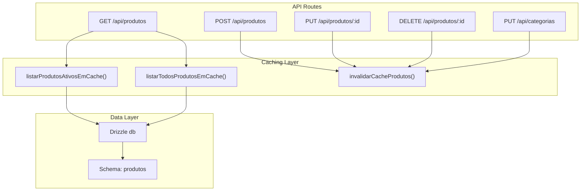
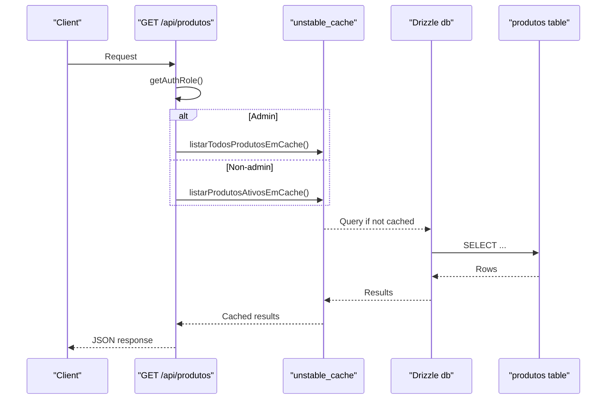
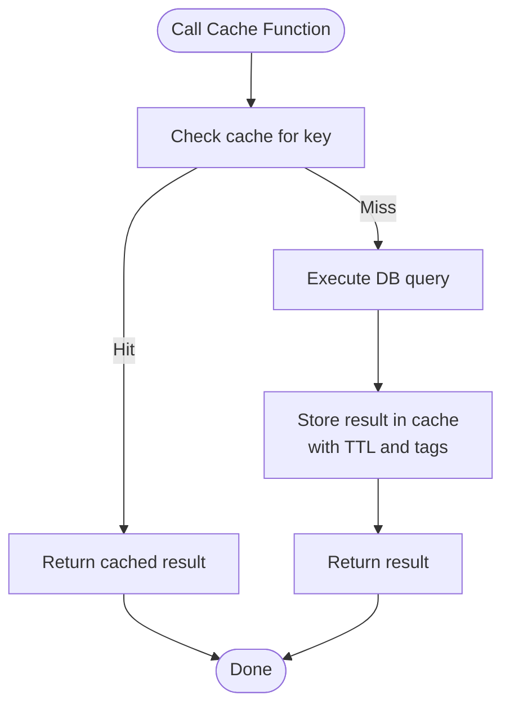
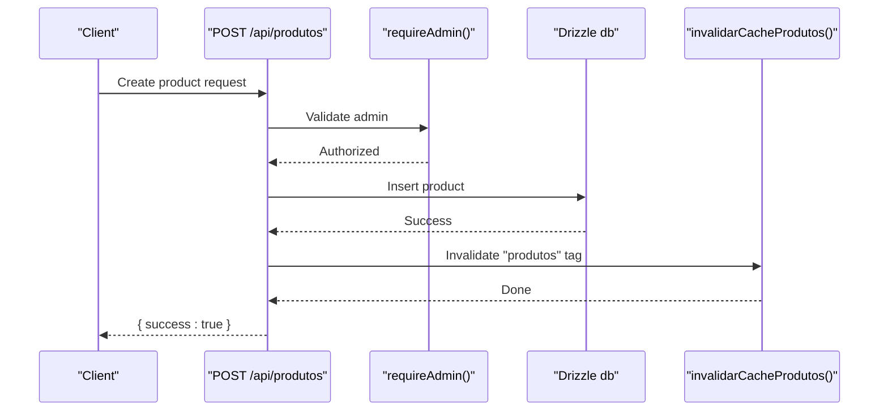
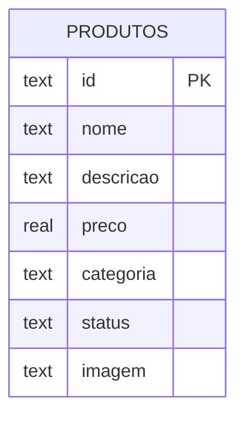
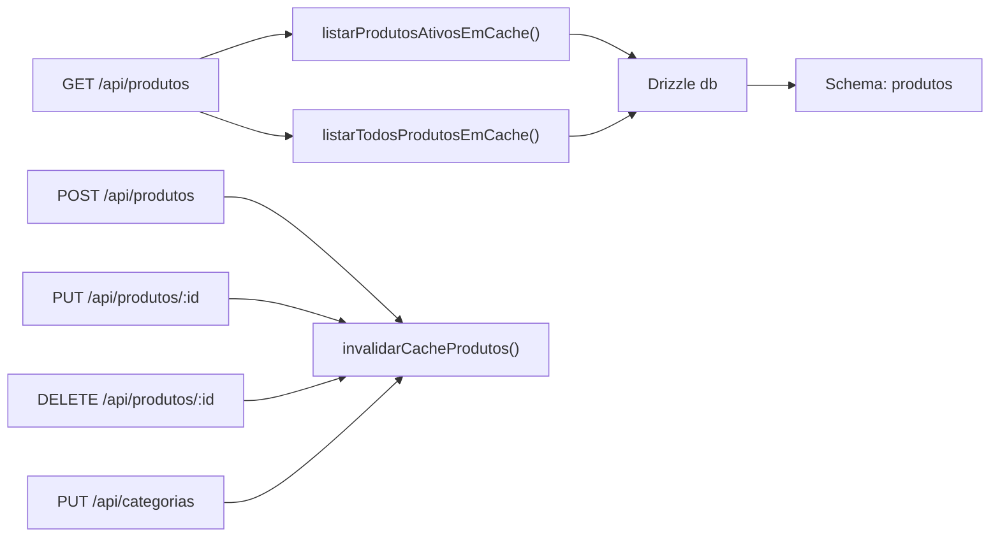

# Caching & Performance Optimization

<cite>
**Referenced Files in This Document**
- [produtos-cache.ts](file://src/lib/produtos-cache.ts)
- [route.ts (produtos)](file://src/app/api/produtos/route.ts)
- [route.ts (produtos/[id])](file://src/app/api/produtos/[id]/route.ts)
- [schema.ts](file://src/db/schema.ts)
- [index.ts (db)](file://src/db/index.ts)
- [auth.ts](file://src/lib/auth.ts)
- [route.ts (categorias)](file://src/app/api/categorias/route.ts)
- [package.json](file://package.json)
</cite>

## Table of Contents
1. [Introduction](#introduction)
2. [Project Structure](#project-structure)
3. [Core Components](#core-components)
4. [Architecture Overview](#architecture-overview)
5. [Detailed Component Analysis](#detailed-component-analysis)
6. [Dependency Analysis](#dependency-analysis)
7. [Performance Considerations](#performance-considerations)
8. [Troubleshooting Guide](#troubleshooting-guide)
9. [Conclusion](#conclusion)
10. [Appendices](#appendices)

## Introduction
This document explains the product caching system and performance optimization techniques used by the application, focusing on:
- The cache functions listarProdutosAtivosEmCache() and listarTodosProdutosEmCache()
- Cache invalidation via invalidarCacheProdutos()
- Storage mechanisms and memory management implications
- Optimizing high-frequency API calls, database queries, and response caching
- Implementing cache-aware API endpoints and monitoring cache performance metrics

The implementation uses Next.js unstable_cache for function-level caching with tag-based invalidation, Drizzle ORM for typed SQL against a SQLite/Turso database, and role-based access control to serve different views of products.

## Project Structure
The caching logic is centralized in a dedicated module and consumed by API routes that handle CRUD operations for products. Database schema and connection are defined separately.

**Diagram sources**
- [route.ts (produtos):1-53](file://src/app/api/produtos/route.ts#L1-L53)
- [route.ts (produtos/[id])](file://src/app/api/produtos/[id]/route.ts#L1-L64)
- [route.ts (categorias):1-28](file://src/app/api/categorias/route.ts#L1-L28)
- [produtos-cache.ts:1-23](file://src/lib/produtos-cache.ts#L1-L23)
- [schema.ts:1-56](file://src/db/schema.ts#L1-L56)
- [index.ts (db):1-14](file://src/db/index.ts#L1-L14)

**Section sources**
- [produtos-cache.ts:1-23](file://src/lib/produtos-cache.ts#L1-L23)
- [route.ts (produtos):1-53](file://src/app/api/produtos/route.ts#L1-L53)
- [route.ts (produtos/[id])](file://src/app/api/produtos/[id]/route.ts#L1-L64)
- [route.ts (categorias):1-28](file://src/app/api/categorias/route.ts#L1-L28)
- [schema.ts:1-56](file://src/db/schema.ts#L1-L56)
- [index.ts (db):1-14](file://src/db/index.ts#L1-L14)

## Core Components
- Product cache functions:
  - listarProdutosAtivosEmCache(): caches active products only
  - listarTodosProdutosEmCache(): caches all products regardless of status
- Cache invalidation:
  - invalidarCacheProdutos(): clears cached entries tagged with "produtos"
- API endpoints:
  - GET /api/produtos: returns active or all products based on user role
  - POST /api/produtos: creates a product and invalidates cache
  - PUT /api/produtos/:id: updates a product and invalidates cache
  - DELETE /api/produtos/:id: deletes a product and invalidates cache
  - PUT /api/categorias: renames categories and invalidates cache

Key behaviors:
- Both cache functions use Next.js unstable_cache with revalidate=300 seconds and tags=["produtos"], enabling automatic TTL-based refresh and tag-based invalidation.
- All write operations call invalidarCacheProdutos() to ensure subsequent reads fetch fresh data.

**Section sources**
- [produtos-cache.ts:1-23](file://src/lib/produtos-cache.ts#L1-L23)
- [route.ts (produtos):1-53](file://src/app/api/produtos/route.ts#L1-L53)
- [route.ts (produtos/[id])](file://src/app/api/produtos/[id]/route.ts#L1-L64)
- [route.ts (categorias):1-28](file://src/app/api/categorias/route.ts#L1-L28)

## Architecture Overview
The architecture leverages function-level caching with tag-based invalidation to reduce database load and improve response times.

**Diagram sources**
- [route.ts (produtos):1-53](file://src/app/api/produtos/route.ts#L1-L53)
- [produtos-cache.ts:1-23](file://src/lib/produtos-cache.ts#L1-L23)
- [index.ts (db):1-14](file://src/db/index.ts#L1-L14)
- [schema.ts:1-56](file://src/db/schema.ts#L1-L56)

## Detailed Component Analysis

### Product Cache Functions
- listarProdutosAtivosEmCache():
  - Purpose: Return only active products
  - Cache key: ["produtos-ativos"]
  - Revalidation: 300 seconds
  - Tags: ["produtos"]
- listarTodosProdutosEmCache():
  - Purpose: Return all products
  - Cache key: ["produtos-todos"]
  - Revalidation: 300 seconds
  - Tags: ["produtos"]
- invalidarCacheProdutos():
  - Purpose: Invalidate all product-related cache entries using tag "produtos"
  - Behavior: Immediate invalidation with expire=0

**Diagram sources**
- [produtos-cache.ts:1-23](file://src/lib/produtos-cache.ts#L1-L23)

**Section sources**
- [produtos-cache.ts:1-23](file://src/lib/produtos-cache.ts#L1-L23)

### API Endpoints and Cache Integration
- GET /api/produtos:
  - Role-based selection between active vs all products
  - Uses cache functions to minimize DB hits
- POST /api/produtos:
  - Validates input, inserts new product, invalidates cache
- PUT /api/produtos/:id:
  - Updates product fields, invalidates cache
- DELETE /api/produtos/:id:
  - Deletes product, invalidates cache
- PUT /api/categorias:
  - Renames category across products, invalidates cache

**Diagram sources**
- [route.ts (produtos):1-53](file://src/app/api/produtos/route.ts#L1-L53)
- [auth.ts:1-82](file://src/lib/auth.ts#L1-L82)
- [produtos-cache.ts:1-23](file://src/lib/produtos-cache.ts#L1-L23)

**Section sources**
- [route.ts (produtos):1-53](file://src/app/api/produtos/route.ts#L1-L53)
- [route.ts (produtos/[id])](file://src/app/api/produtos/[id]/route.ts#L1-L64)
- [route.ts (categorias):1-28](file://src/app/api/categorias/route.ts#L1-L28)
- [auth.ts:1-82](file://src/lib/auth.ts#L1-L82)

### Data Model and Storage
- Schema defines the produtos table with fields id, nome, descricao, preco, categoria, status, imagem
- Database client configured via Drizzle ORM with libsql client; supports local file or remote Turso URL
- Cache storage mechanism:
  - In-memory per-process cache managed by Next.js unstable_cache
  - Tag-based invalidation ensures consistency across cache keys sharing the same tag

**Diagram sources**
- [schema.ts:1-56](file://src/db/schema.ts#L1-L56)
- [index.ts (db):1-14](file://src/db/index.ts#L1-L14)

**Section sources**
- [schema.ts:1-56](file://src/db/schema.ts#L1-L56)
- [index.ts (db):1-14](file://src/db/index.ts#L1-L14)

## Dependency Analysis
The caching layer depends on Next.js cache APIs and Drizzle ORM. API routes depend on authentication utilities and cache invalidation functions.

**Diagram sources**
- [route.ts (produtos):1-53](file://src/app/api/produtos/route.ts#L1-L53)
- [route.ts (produtos/[id])](file://src/app/api/produtos/[id]/route.ts#L1-L64)
- [route.ts (categorias):1-28](file://src/app/api/categorias/route.ts#L1-L28)
- [produtos-cache.ts:1-23](file://src/lib/produtos-cache.ts#L1-L23)
- [index.ts (db):1-14](file://src/db/index.ts#L1-L14)
- [schema.ts:1-56](file://src/db/schema.ts#L1-L56)

**Section sources**
- [route.ts (produtos):1-53](file://src/app/api/produtos/route.ts#L1-L53)
- [route.ts (produtos/[id])](file://src/app/api/produtos/[id]/route.ts#L1-L64)
- [route.ts (categorias):1-28](file://src/app/api/categorias/route.ts#L1-L28)
- [produtos-cache.ts:1-23](file://src/lib/produtos-cache.ts#L1-L23)
- [index.ts (db):1-14](file://src/db/index.ts#L1-L14)
- [schema.ts:1-56](file://src/db/schema.ts#L1-L56)

## Performance Considerations
- High-frequency API calls:
  - Use listarProdutosAtivosEmCache() for read-heavy endpoints to avoid repeated DB queries
  - Leverage revalidate=300s to balance freshness and performance
- Database query optimization:
  - Ensure indexes on frequently filtered columns such as status and categoria
  - Select only necessary fields to reduce payload size
- Response caching strategies:
  - Tag-based invalidation ensures consistent cache updates across related endpoints
  - Avoid unnecessary writes that trigger frequent invalidations
- Memory management:
  - Cache entries are stored in process memory; monitor memory usage under high concurrency
  - Consider external caching (e.g., Redis) if process memory becomes a bottleneck
- Monitoring and metrics:
  - Track cache hit rates by measuring responses served from cache vs DB
  - Log invalidation events to correlate with traffic spikes and data changes
  - Monitor revalidation frequency and adjust TTL based on data volatility

[No sources needed since this section provides general guidance]

## Troubleshooting Guide
Common issues and resolutions:
- Stale data after updates:
  - Ensure invalidarCacheProdutos() is called after any write operation
  - Verify that all write endpoints share the same cache tag "produtos"
- Excessive cache invalidations:
  - Batch multiple updates where possible to reduce invalidation calls
  - Review business logic to avoid unnecessary writes
- High memory usage:
  - Evaluate cache size and TTL settings
  - Consider moving to an external cache store for multi-instance deployments
- Authentication errors:
  - Confirm role checks in GET /api/produtos to return correct dataset
  - Validate cookie handling and token expiration

**Section sources**
- [route.ts (produtos):1-53](file://src/app/api/produtos/route.ts#L1-L53)
- [route.ts (produtos/[id])](file://src/app/api/produtos/[id]/route.ts#L1-L64)
- [route.ts (categorias):1-28](file://src/app/api/categorias/route.ts#L1-L28)
- [auth.ts:1-82](file://src/lib/auth.ts#L1-L82)

## Conclusion
The product caching system effectively reduces database load and improves response times through function-level caching with tag-based invalidation. By integrating cache-aware API endpoints and following best practices for invalidation and monitoring, the application can maintain high performance under heavy loads while ensuring data consistency.

[No sources needed since this section summarizes without analyzing specific files]

## Appendices

### Example: Cache-Aware API Endpoint Implementation
- Use listarProdutosAtivosEmCache() for public-facing endpoints
- Use listarTodosProdutosEmCache() for admin endpoints
- Call invalidarCacheProdutos() after any write operation

**Section sources**
- [produtos-cache.ts:1-23](file://src/lib/produtos-cache.ts#L1-L23)
- [route.ts (produtos):1-53](file://src/app/api/produtos/route.ts#L1-L53)

### Monitoring Cache Performance Metrics
- Track cache hit rate by instrumenting cache function calls
- Log invalidation events with timestamps and context
- Monitor memory usage and adjust TTL or cache strategy accordingly

[No sources needed since this section provides general guidance]