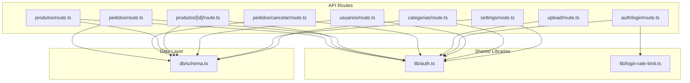
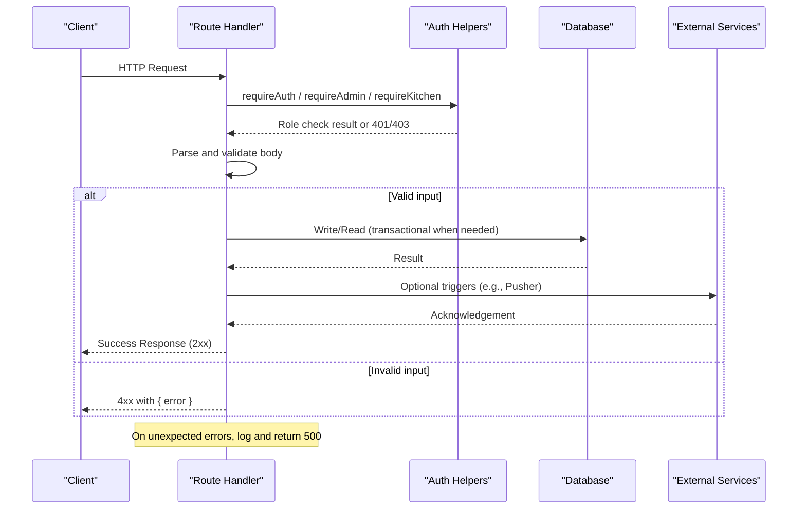
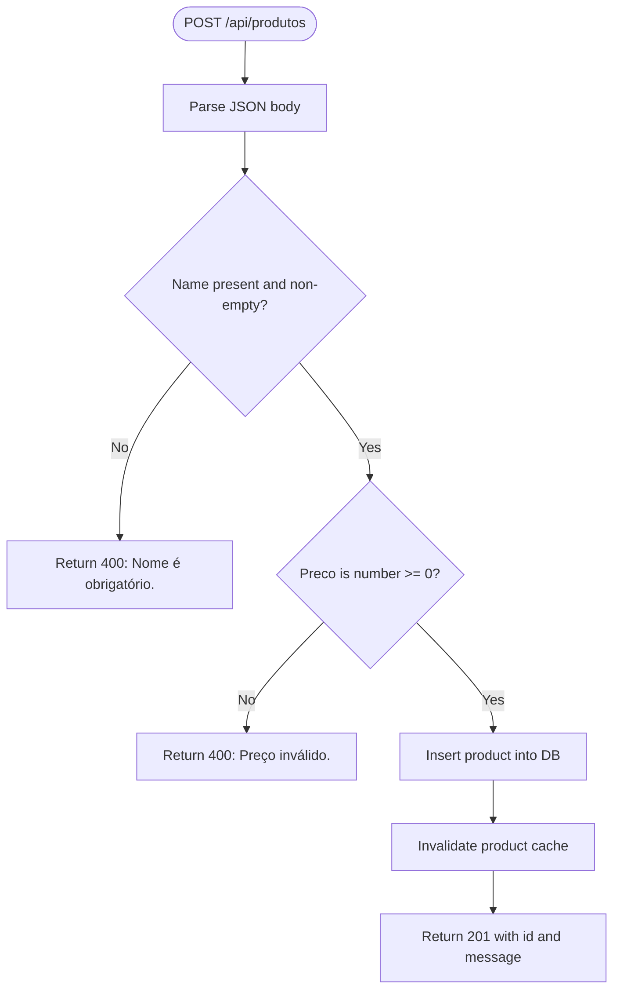
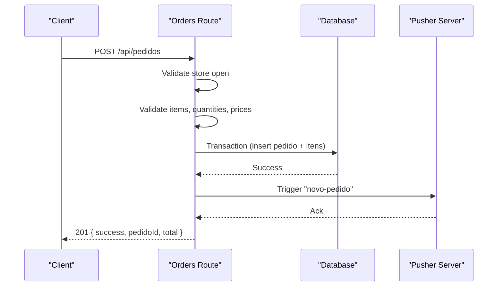
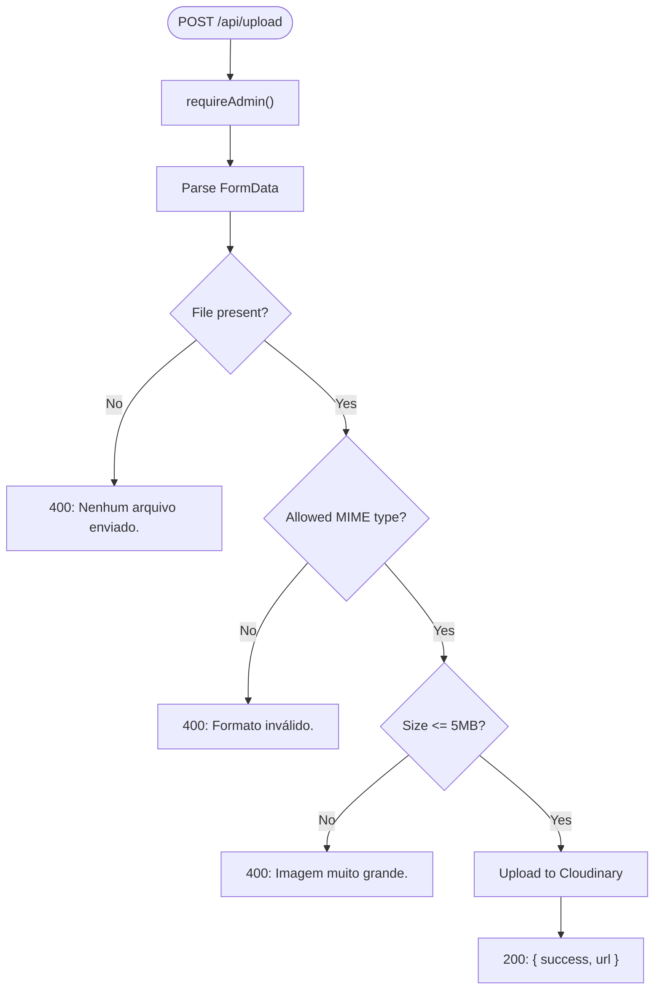
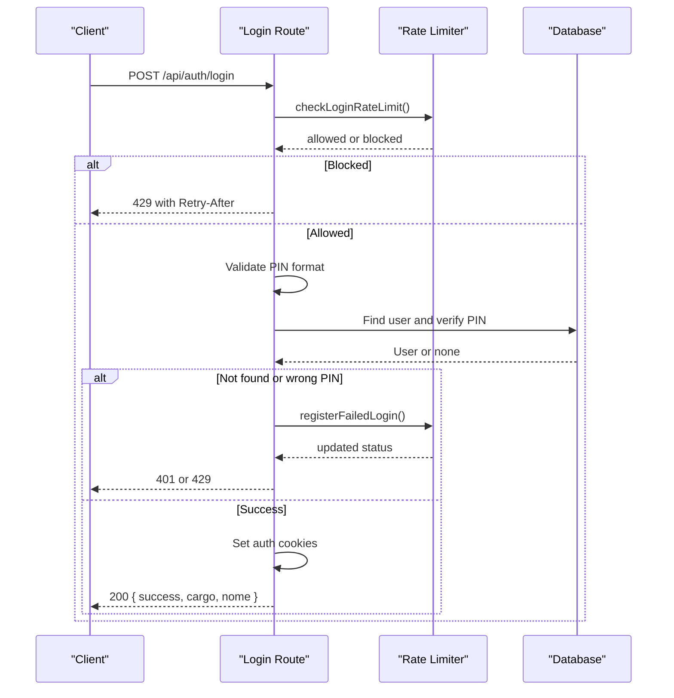
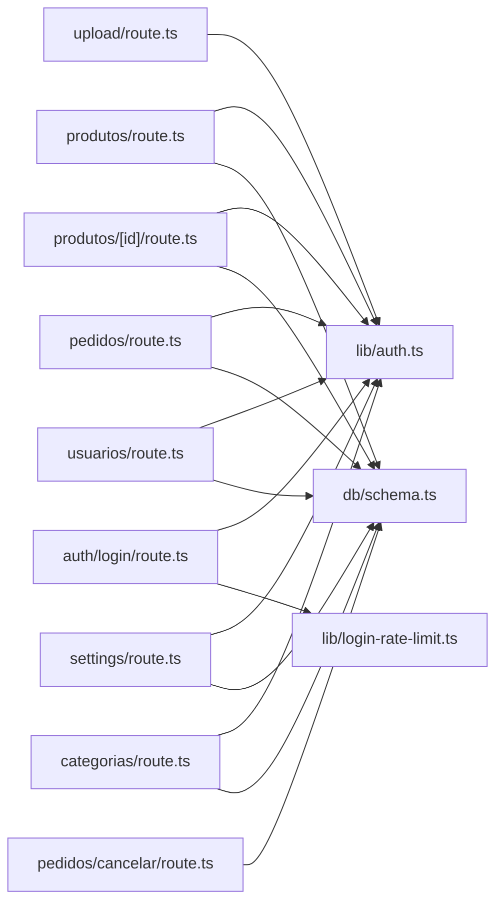

# Data Validation & Error Handling

<cite>
**Referenced Files in This Document**
- [src/app/api/produtos/route.ts](file://src/app/api/produtos/route.ts)
- [src/app/api/produtos/[id]/route.ts](file://src/app/api/produtos/[id]/route.ts)
- [src/app/api/pedidos/route.ts](file://src/app/api/pedidos/route.ts)
- [src/app/api/pedidos/cancelar/route.ts](file://src/app/api/pedidos/cancelar/route.ts)
- [src/app/api/upload/route.ts](file://src/app/api/upload/route.ts)
- [src/app/api/auth/login/route.ts](file://src/app/api/auth/login/route.ts)
- [src/app/api/usuarios/route.ts](file://src/app/api/usuarios/route.ts)
- [src/app/api/categorias/route.ts](file://src/app/api/categorias/route.ts)
- [src/app/api/settings/route.ts](file://src/app/api/settings/route.ts)
- [src/lib/auth.ts](file://src/lib/auth.ts)
- [src/lib/login-rate-limit.ts](file://src/lib/login-rate-limit.ts)
- [src/db/schema.ts](file://src/db/schema.ts)
</cite>

## Table of Contents
1. Introduction
2. Project Structure
3. Core Components
4. Architecture Overview
5. Detailed Component Analysis
6. Dependency Analysis
7. Performance Considerations
8. Troubleshooting Guide
9. Conclusion

## Introduction
This document explains the data validation and error handling strategies used across API routes in the application. It covers input parsing, field validation, type checking, business rule enforcement, consistent error response formats, HTTP status codes, logging practices, and exception handling patterns. Examples include product creation, order processing, and file upload validation.

## Project Structure
The API is implemented as Next.js Route Handlers under src/app/api. Each feature area has its own folder (e.g., produtos, pedidos, upload, auth). Shared logic such as authentication, authorization, and rate limiting lives in src/lib. Database schemas are defined in src/db/schema.ts.

**Diagram sources**
- [src/app/api/produtos/route.ts:1-53](file://src/app/api/produtos/route.ts#L1-L53)
- [src/app/api/produtos/[id]/route.ts:1-64](file://src/app/api/produtos/[id]/route.ts#L1-L64)
- [src/app/api/pedidos/route.ts:1-253](file://src/app/api/pedidos/route.ts#L1-L253)
- [src/app/api/pedidos/cancelar/route.ts:1-21](file://src/app/api/pedidos/cancelar/route.ts#L1-L21)
- [src/app/api/upload/route.ts:1-58](file://src/app/api/upload/route.ts#L1-L58)
- [src/app/api/auth/login/route.ts:1-80](file://src/app/api/auth/login/route.ts#L1-L80)
- [src/app/api/usuarios/route.ts:1-79](file://src/app/api/usuarios/route.ts#L1-L79)
- [src/app/api/categorias/route.ts:1-28](file://src/app/api/categorias/route.ts#L1-L28)
- [src/app/api/settings/route.ts:1-35](file://src/app/api/settings/route.ts#L1-L35)
- [src/lib/auth.ts:1-82](file://src/lib/auth.ts#L1-L82)
- [src/lib/login-rate-limit.ts:1-115](file://src/lib/login-rate-limit.ts#L1-L115)
- [src/db/schema.ts:1-56](file://src/db/schema.ts#L1-L56)

**Section sources**
- [src/app/api/produtos/route.ts:1-53](file://src/app/api/produtos/route.ts#L1-L53)
- [src/app/api/pedidos/route.ts:1-253](file://src/app/api/pedidos/route.ts#L1-L253)
- [src/app/api/upload/route.ts:1-58](file://src/app/api/upload/route.ts#L1-L58)
- [src/app/api/auth/login/route.ts:1-80](file://src/app/api/auth/login/route.ts#L1-L80)
- [src/app/api/usuarios/route.ts:1-79](file://src/app/api/usuarios/route.ts#L1-L79)
- [src/app/api/categorias/route.ts:1-28](file://src/app/api/categorias/route.ts#L1-L28)
- [src/app/api/settings/route.ts:1-35](file://src/app/api/settings/route.ts#L1-L35)
- [src/lib/auth.ts:1-82](file://src/lib/auth.ts#L1-L82)
- [src/lib/login-rate-limit.ts:1-115](file://src/lib/login-rate-limit.ts#L1-L115)
- [src/db/schema.ts:1-56](file://src/db/schema.ts#L1-L56)

## Core Components
- Authentication and authorization helpers: role checks, cookie-based sessions, and helper to detect NextResponse returns for early exits.
- Rate limiting for login attempts with persistent tracking and retry guidance.
- Consistent error responses using a simple JSON object with an error field and appropriate HTTP status codes.
- Input validation per route: body parsing, required fields, type checks, value ranges, and business rules.
- File upload validation: allowed MIME types, size limits, and secure upload to Cloudinary.

Key responsibilities:
- Validate inputs before database writes or external calls.
- Enforce business rules (e.g., store open/closed, item availability, valid statuses).
- Return standardized errors with clear messages and correct status codes.
- Log server-side errors for observability.

**Section sources**
- [src/lib/auth.ts:1-82](file://src/lib/auth.ts#L1-L82)
- [src/lib/login-rate-limit.ts:1-115](file://src/lib/login-rate-limit.ts#L1-L115)
- [src/app/api/produtos/route.ts:18-52](file://src/app/api/produtos/route.ts#L18-L52)
- [src/app/api/pedidos/route.ts:65-190](file://src/app/api/pedidos/route.ts#L65-L190)
- [src/app/api/upload/route.ts:14-58](file://src/app/api/upload/route.ts#L14-L58)
- [src/app/api/auth/login/route.ts:16-80](file://src/app/api/auth/login/route.ts#L16-L80)

## Architecture Overview
Validation and error handling follow a consistent pattern:
- Parse request body safely.
- Validate presence and types of required fields.
- Apply business rules (store status, item availability, valid enums).
- Perform side effects (DB writes, cache invalidation, real-time events).
- Return success or error responses with appropriate HTTP status codes.
- Catch unexpected errors and return 500 with a generic message while logging details.

**Diagram sources**
- [src/app/api/pedidos/route.ts:65-190](file://src/app/api/pedidos/route.ts#L65-L190)
- [src/lib/auth.ts:63-82](file://src/lib/auth.ts#L63-L82)
- [src/lib/login-rate-limit.ts:45-97](file://src/lib/login-rate-limit.ts#L45-L97)

## Detailed Component Analysis

### Product Creation and Update Validation
- Body parsing: safely parse JSON; handle parse failures by treating body as null.
- Field validation:
  - Required name; trimmed and non-empty.
  - Price must be a number and non-negative.
  - Optional fields normalized (description, category, image defaults).
- Business rules:
  - Category defaults to a safe value if missing.
  - Image defaults to a placeholder URL if missing.
- Side effects:
  - Insert into database.
  - Invalidate product cache after changes.
- Errors:
  - 400 for validation failures with descriptive messages.
  - 500 for unexpected errors with logging.

**Diagram sources**
- [src/app/api/produtos/route.ts:18-52](file://src/app/api/produtos/route.ts#L18-L52)

**Section sources**
- [src/app/api/produtos/route.ts:18-52](file://src/app/api/produtos/route.ts#L18-L52)
- [src/app/api/produtos/[id]/route.ts:8-45](file://src/app/api/produtos/[id]/route.ts#L8-L45)

### Order Processing Validation
- Store availability:
  - Check configuration to ensure store is open; otherwise return 403.
- Body validation:
  - Ensure items array exists and is not empty.
  - For each item:
    - Name must be a non-empty string.
    - Quantity must be a positive number within allowed range.
    - If item references a product by ID, verify it exists and is active; use product price.
    - Otherwise, require a valid numeric price >= 0.
  - Compute total from validated items; ensure total > 0.
  - Validate table identifier format or allow “balcao” (counter).
- Business rules:
  - Only pending orders can be canceled.
  - Status transitions are restricted to a whitelist.
- Side effects:
  - Persist order and items in a transaction.
  - Trigger real-time event via Pusher on success.
- Errors:
  - 400 for validation failures with specific messages.
  - 403 for store closed.
  - 404 for not found resources.
  - 409 for conflicting states (e.g., canceling non-pending order).
  - 500 for unexpected errors with logging.

**Diagram sources**
- [src/app/api/pedidos/route.ts:65-190](file://src/app/api/pedidos/route.ts#L65-L190)

**Section sources**
- [src/app/api/pedidos/route.ts:65-190](file://src/app/api/pedidos/route.ts#L65-L190)
- [src/app/api/pedidos/cancelar/route.ts:6-21](file://src/app/api/pedidos/cancelar/route.ts#L6-L21)

### File Upload Validation
- Authentication: requires admin role.
- Form parsing: extract file from form data.
- Validation:
  - File must be present.
  - Allowed MIME types: JPEG, PNG, WEBP, GIF.
  - Size limit: up to 5MB.
- Side effects:
  - Upload to Cloudinary with a dedicated folder.
- Errors:
  - 400 for missing file, unsupported type, or oversized file.
  - 500 for upload failures with logging.

**Diagram sources**
- [src/app/api/upload/route.ts:14-58](file://src/app/api/upload/route.ts#L14-L58)

**Section sources**
- [src/app/api/upload/route.ts:14-58](file://src/app/api/upload/route.ts#L14-L58)

### Authentication and Login Validation
- Rate limiting:
  - Check login rate limit before processing; respond with 429 and Retry-After header when blocked.
- Body validation:
  - PIN must be present and a string.
  - Length constraints enforced.
- Business rules:
  - Verify PIN against stored hash.
  - Normalize user role and set session cookies.
  - Clear failed attempt counters on success.
- Errors:
  - 400 for invalid PIN format.
  - 401 for incorrect PIN.
  - 429 for too many attempts with retry guidance.
  - 500 for unexpected errors with logging.

**Diagram sources**
- [src/app/api/auth/login/route.ts:16-80](file://src/app/api/auth/login/route.ts#L16-L80)
- [src/lib/login-rate-limit.ts:45-97](file://src/lib/login-rate-limit.ts#L45-L97)

**Section sources**
- [src/app/api/auth/login/route.ts:16-80](file://src/app/api/auth/login/route.ts#L16-L80)
- [src/lib/login-rate-limit.ts:45-97](file://src/lib/login-rate-limit.ts#L45-L97)

### User Management Validation
- Authentication: requires admin role.
- Body validation:
  - Required fields: name, role, PIN.
  - Role normalization and validation against allowed roles.
  - PIN length and numeric-only constraints.
- Business rules:
  - Prevent multiple admins if one already exists.
- Side effects:
  - Hash PIN before storing.
  - Insert new user and return sanitized data (no PIN).
- Errors:
  - 400 for missing or invalid fields.
  - 409 for duplicate admin constraint.
  - 500 for unexpected errors with logging.

**Section sources**
- [src/app/api/usuarios/route.ts:21-79](file://src/app/api/usuarios/route.ts#L21-L79)

### Settings and Categories Validation
- Settings:
  - GET returns default values if not configured.
  - POST validates and persists store status and preparation time.
- Categories:
  - PUT validates current and new category names and updates all related products.
- Errors:
  - 400 for invalid payloads.
  - 500 for internal errors with logging.

**Section sources**
- [src/app/api/settings/route.ts:7-35](file://src/app/api/settings/route.ts#L7-L35)
- [src/app/api/categorias/route.ts:8-28](file://src/app/api/categorias/route.ts#L8-L28)

## Dependency Analysis
- Route handlers depend on shared auth utilities for authorization and on database schema definitions for queries and mutations.
- Order processing depends on configuration reads and optional real-time notifications.
- Login flow depends on rate limiting utilities that persist attempt counts and block durations.

**Diagram sources**
- [src/app/api/produtos/route.ts:1-53](file://src/app/api/produtos/route.ts#L1-L53)
- [src/app/api/produtos/[id]/route.ts:1-64](file://src/app/api/produtos/[id]/route.ts#L1-L64)
- [src/app/api/pedidos/route.ts:1-253](file://src/app/api/pedidos/route.ts#L1-L253)
- [src/app/api/pedidos/cancelar/route.ts:1-21](file://src/app/api/pedidos/cancelar/route.ts#L1-L21)
- [src/app/api/upload/route.ts:1-58](file://src/app/api/upload/route.ts#L1-L58)
- [src/app/api/auth/login/route.ts:1-80](file://src/app/api/auth/login/route.ts#L1-L80)
- [src/app/api/usuarios/route.ts:1-79](file://src/app/api/usuarios/route.ts#L1-L79)
- [src/app/api/settings/route.ts:1-35](file://src/app/api/settings/route.ts#L1-L35)
- [src/app/api/categorias/route.ts:1-28](file://src/app/api/categorias/route.ts#L1-L28)
- [src/lib/auth.ts:1-82](file://src/lib/auth.ts#L1-L82)
- [src/lib/login-rate-limit.ts:1-115](file://src/lib/login-rate-limit.ts#L1-L115)
- [src/db/schema.ts:1-56](file://src/db/schema.ts#L1-L56)

**Section sources**
- [src/lib/auth.ts:1-82](file://src/lib/auth.ts#L1-L82)
- [src/lib/login-rate-limit.ts:1-115](file://src/lib/login-rate-limit.ts#L1-L115)
- [src/db/schema.ts:1-56](file://src/db/schema.ts#L1-L56)

## Performance Considerations
- Use transactions for multi-step writes (e.g., creating orders and items) to maintain consistency and avoid partial state.
- Avoid unnecessary reads; map IDs to entities once and reuse in loops to reduce DB calls.
- Cache invalidation should be targeted (e.g., invalidate product cache only after product changes).
- External service calls (e.g., Pusher) should be fire-and-forget with error isolation so they do not block core operations.
- Enforce strict input validation early to fail fast and reduce downstream work.

[No sources needed since this section provides general guidance]

## Troubleshooting Guide
Common issues and how to diagnose them:
- Validation failures:
  - Check error messages returned in 4xx responses; they indicate which field or rule failed.
  - Confirm client sends correctly typed and formatted data (e.g., numbers vs strings).
- Authorization errors:
  - 401 indicates missing or invalid session; 403 indicates insufficient role.
  - Verify cookies and roles set during login.
- Rate limiting:
  - 429 responses include Retry-After; respect the header and back off.
  - Failed login attempts increment counters; successful login clears them.
- Database errors:
  - 500 responses indicate unexpected server errors; check logs for stack traces.
  - Ensure schema matches expectations and migrations are applied.
- File uploads:
  - 400 for unsupported MIME types or oversized files; adjust client constraints accordingly.
  - 500 for upload failures; verify environment variables for Cloudinary.

**Section sources**
- [src/app/api/auth/login/route.ts:16-80](file://src/app/api/auth/login/route.ts#L16-L80)
- [src/lib/login-rate-limit.ts:45-115](file://src/lib/login-rate-limit.ts#L45-L115)
- [src/app/api/upload/route.ts:14-58](file://src/app/api/upload/route.ts#L14-L58)
- [src/app/api/pedidos/route.ts:65-253](file://src/app/api/pedidos/route.ts#L65-L253)

## Conclusion
The API enforces robust validation and consistent error handling across endpoints:
- Inputs are parsed safely and validated for presence, type, and business rules.
- Errors return structured JSON with descriptive messages and appropriate HTTP status codes.
- Sensitive operations are protected by role-based authorization and rate limiting.
- Transactions and targeted cache invalidation maintain data integrity and performance.
- Logging captures server-side errors for observability while keeping client-facing messages concise.

[No sources needed since this section summarizes without analyzing specific files]