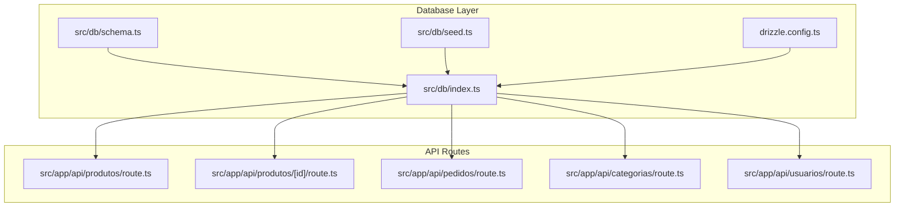
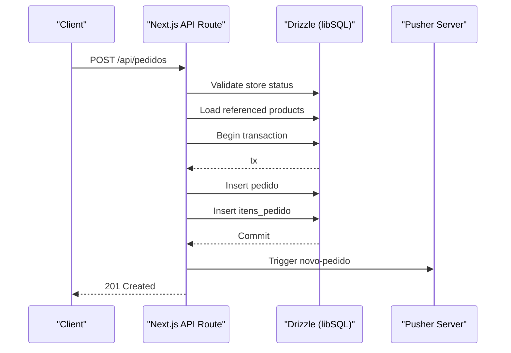
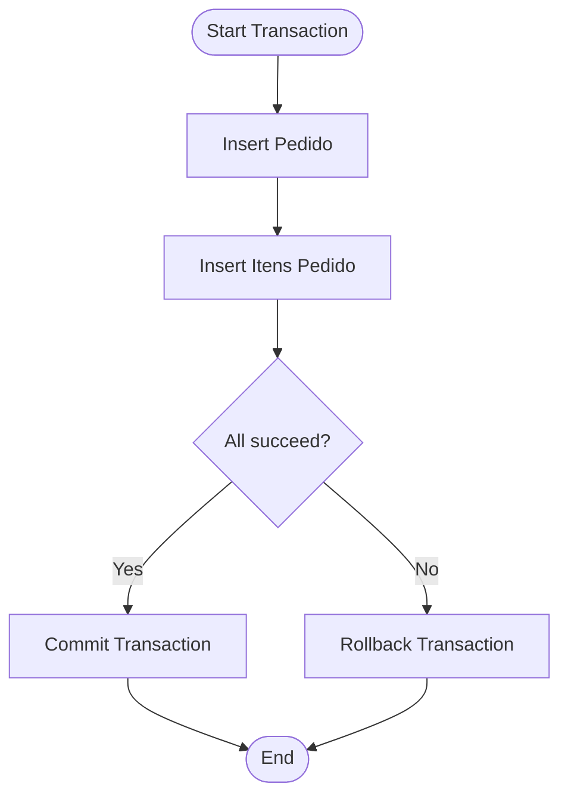
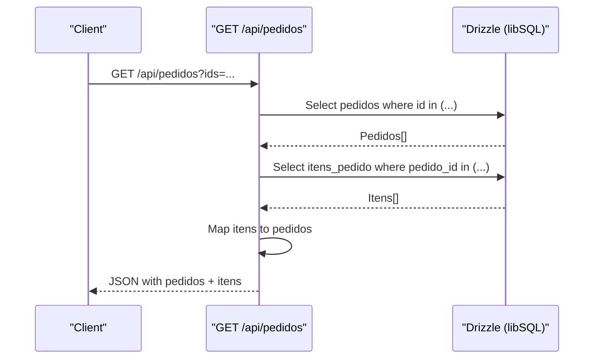
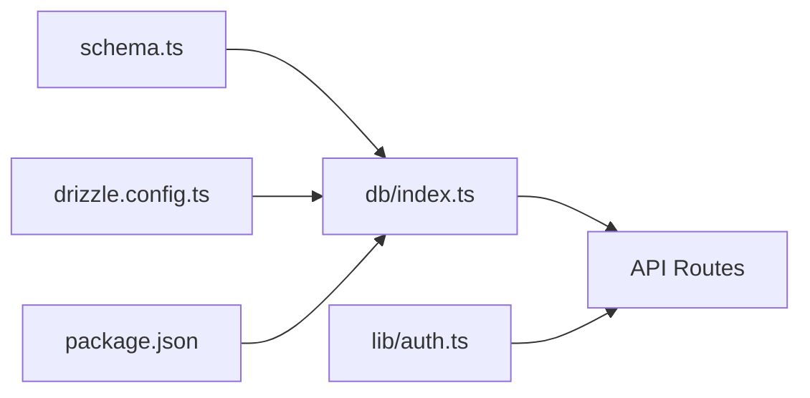

# Database Integration & ORM Usage

<cite>
**Referenced Files in This Document**
- [schema.ts](file://src/db/schema.ts)
- [index.ts](file://src/db/index.ts)
- [seed.ts](file://src/db/seed.ts)
- [drizzle.config.ts](file://drizzle.config.ts)
- [package.json](file://package.json)
- [produtos/route.ts](file://src/app/api/produtos/route.ts)
- [produtos/[id]/route.ts](file://src/app/api/produtos/[id]/route.ts)
- [pedidos/route.ts](file://src/app/api/pedidos/route.ts)
- [categorias/route.ts](file://src/app/api/categorias/route.ts)
- [usuarios/route.ts](file://src/app/api/usuarios/route.ts)
- [auth.ts](file://src/lib/auth.ts)
</cite>

## Table of Contents
1. [Introduction](#introduction)
2. [Project Structure](#project-structure)
3. [Core Components](#core-components)
4. [Architecture Overview](#architecture-overview)
5. [Detailed Component Analysis](#detailed-component-analysis)
6. [Dependency Analysis](#dependency-analysis)
7. [Performance Considerations](#performance-considerations)
8. [Troubleshooting Guide](#troubleshooting-guide)
9. [Conclusion](#conclusion)
10. [Appendices](#appendices)

## Introduction
This document explains how the application integrates a database using Drizzle ORM with libSQL (Turso). It covers schema definition patterns, relationship modeling, type-safe queries, connection management, transactions, migrations, CRUD operations, complex queries, data seeding, error handling, and performance optimization within API routes.

## Project Structure
The database layer is organized under src/db with clear separation between schema definitions, client configuration, and seeding scripts. API routes import the typed db instance and schema to perform type-safe queries.

**Diagram sources**
- [schema.ts:1-56](file://src/db/schema.ts#L1-L56)
- [index.ts:1-14](file://src/db/index.ts#L1-L14)
- [seed.ts:1-57](file://src/db/seed.ts#L1-L57)
- [drizzle.config.ts:1-14](file://drizzle.config.ts#L1-L14)
- [produtos/route.ts:1-53](file://src/app/api/produtos/route.ts#L1-L53)
- [produtos/[id]/route.ts:1-64](file://src/app/api/produtos/[id]/route.ts#L1-L64)
- [pedidos/route.ts:1-253](file://src/app/api/pedidos/route.ts#L1-L253)
- [categorias/route.ts:1-28](file://src/app/api/categorias/route.ts#L1-L28)
- [usuarios/route.ts:1-79](file://src/app/api/usuarios/route.ts#L1-L79)

**Section sources**
- [schema.ts:1-56](file://src/db/schema.ts#L1-L56)
- [index.ts:1-14](file://src/db/index.ts#L1-L14)
- [seed.ts:1-57](file://src/db/seed.ts#L1-L57)
- [drizzle.config.ts:1-14](file://drizzle.config.ts#L1-L14)
- [package.json:1-45](file://package.json#L1-L45)

## Core Components
- Schema definitions define tables for products, orders, order items, settings, users, and login attempts. Types are inferred by Drizzle for type-safe queries.
- The database client is created via libSQL/Turso with optional auth token and exported as a typed drizzle instance.
- Seed script initializes default configuration and sample products safely using upsert semantics.

Key responsibilities:
- schema.ts: Declarative table definitions with constraints and defaults.
- index.ts: Connection setup and typed DB export.
- seed.ts: Idempotent initialization of essential data.

**Section sources**
- [schema.ts:1-56](file://src/db/schema.ts#L1-L56)
- [index.ts:1-14](file://src/db/index.ts#L1-L14)
- [seed.ts:1-57](file://src/db/seed.ts#L1-L57)

## Architecture Overview
The system uses Next.js API routes to expose REST endpoints. Each route validates input, enforces authorization, and performs type-safe queries against the libSQL-backed database. Transactions ensure consistency when writing related records.

**Diagram sources**
- [pedidos/route.ts:65-189](file://src/app/api/pedidos/route.ts#L65-L189)

## Detailed Component Analysis

### Schema Definition Patterns
- Tables use sqliteTable with explicit column types and constraints.
- Primary keys are text-based UUIDs for portability.
- Timestamps and booleans are modeled using SQLite-compatible modes.
- Relationships are modeled via foreign key references conceptually; referential integrity is enforced at the application level due to SQLite limitations.

Relationships:
- pedidos has many itensPedido via pedidoId.
- produtos are referenced by itensPedido via id or name fallback.
- configuracoes control global state like store open/close.

**Section sources**
- [schema.ts:1-56](file://src/db/schema.ts#L1-L56)

### Type-Safe Queries and Operations
- Reads: Select from tables with optional filters and ordering.
- Writes: Insert with validation; update with equality conditions; delete with precise scoping.
- Transactions: Used for multi-table writes to maintain consistency.

Examples across routes:
- Products: list, create, update, delete with cache invalidation.
- Orders: create with transactional inserts; update status; delete cascade-like behavior.
- Users: list with sensitive field exclusion; create with role constraints and PIN hashing.
- Categories: bulk rename updates across products.

**Section sources**
- [produtos/route.ts:1-53](file://src/app/api/produtos/route.ts#L1-L53)
- [produtos/[id]/route.ts:1-64](file://src/app/api/produtos/[id]/route.ts#L1-L64)
- [pedidos/route.ts:1-253](file://src/app/api/pedidos/route.ts#L1-L253)
- [usuarios/route.ts:1-79](file://src/app/api/usuarios/route.ts#L1-L79)
- [categorias/route.ts:1-28](file://src/app/api/categorias/route.ts#L1-L28)

### Data Seeding Procedures
- Seed script ensures initial configuration exists without duplication.
- Inserts sample products with onConflictDoNothing to make seeding idempotent.
- Errors are logged and process exits with non-zero status on failure.

**Section sources**
- [seed.ts:1-57](file://src/db/seed.ts#L1-L57)

### Transaction Handling
- Order creation wraps both pedido and itens_pedido inserts in a single transaction to guarantee atomicity.
- Order deletion removes items first, then the parent order within a transaction to avoid orphaned rows.

**Diagram sources**
- [pedidos/route.ts:148-171](file://src/app/api/pedidos/route.ts#L148-L171)
- [pedidos/route.ts:244-247](file://src/app/api/pedidos/route.ts#L244-L247)

**Section sources**
- [pedidos/route.ts:148-171](file://src/app/api/pedidos/route.ts#L148-L171)
- [pedidos/route.ts:244-247](file://src/app/api/pedidos/route.ts#L244-L247)

### Complex Queries with Joins
- While explicit SQL joins are not used, the code composes results by fetching related data and mapping it in memory (e.g., associating itens with pedidos).
- Filtering uses inArray for batch lookups and eq for single-row matches.

**Diagram sources**
- [pedidos/route.ts:15-63](file://src/app/api/pedidos/route.ts#L15-L63)

**Section sources**
- [pedidos/route.ts:15-63](file://src/app/api/pedidos/route.ts#L15-L63)

### Error Handling for Database Operations
- Each route wraps logic in try/catch blocks.
- Validation errors return appropriate HTTP status codes (400, 401, 403, 409).
- Internal errors return 500 with generic messages while logging details.
- External service calls (e.g., Pusher) are wrapped in try/catch to avoid failing core DB operations.

**Section sources**
- [produtos/route.ts:6-16](file://src/app/api/produtos/route.ts#L6-L16)
- [produtos/route.ts:18-52](file://src/app/api/produtos/route.ts#L18-L52)
- [produtos/[id]/route.ts:8-44](file://src/app/api/produtos/[id]/route.ts#L8-L44)
- [produtos/[id]/route.ts:47-63](file://src/app/api/produtos/[id]/route.ts#L47-L63)
- [pedidos/route.ts:15-63](file://src/app/api/pedidos/route.ts#L15-L63)
- [pedidos/route.ts:65-189](file://src/app/api/pedidos/route.ts#L65-L189)
- [pedidos/route.ts:192-234](file://src/app/api/pedidos/route.ts#L192-L234)
- [pedidos/route.ts:237-252](file://src/app/api/pedidos/route.ts#L237-L252)
- [usuarios/route.ts:7-18](file://src/app/api/usuarios/route.ts#L7-L18)
- [usuarios/route.ts:21-78](file://src/app/api/usuarios/route.ts#L21-L78)
- [categorias/route.ts:8-27](file://src/app/api/categorias/route.ts#L8-L27)

### Connection Management and Pooling
- The database client is created once per module load using libSQL’s createClient with URL and optional auth token.
- The drizzle instance is exported for reuse across routes.
- No explicit pooling configuration is present; libSQL manages connections based on its runtime environment.

Best practices observed:
- Centralized client creation avoids repeated connections.
- Environment-driven configuration supports local file-based dev and remote Turso instances.

**Section sources**
- [index.ts:1-14](file://src/db/index.ts#L1-L14)
- [drizzle.config.ts:1-14](file://drizzle.config.ts#L1-L14)

### Migration Strategies
- Drizzle Kit is configured for Turso dialect with schema path and output directory.
- Scripts available for generating, pushing, migrating, and studio access.
- Typical workflow: generate migrations, push/migrate to target, then seed data.

Operational notes:
- Use db:generate to produce migration files.
- Use db:push for quick schema sync in development.
- Use db:migrate for production-safe migrations.
- Use db:studio to inspect schema and data.

**Section sources**
- [drizzle.config.ts:1-14](file://drizzle.config.ts#L1-L14)
- [package.json:5-15](file://package.json#L5-L15)

### CRUD Examples in API Routes
- Create:
  - Product creation with validation and image default.
  - User creation with role checks and PIN hashing.
  - Order creation with transactional inserts and real-time notification.
- Read:
  - List products filtered by role; list orders with associated items.
  - List users sorted by name with sensitive fields excluded.
- Update:
  - Product update by ID; category rename across products; order status transitions.
- Delete:
  - Product deletion by ID; order deletion cascading to items within a transaction.

**Section sources**
- [produtos/route.ts:18-52](file://src/app/api/produtos/route.ts#L18-L52)
- [produtos/[id]/route.ts:8-44](file://src/app/api/produtos/[id]/route.ts#L8-L44)
- [produtos/[id]/route.ts:47-63](file://src/app/api/produtos/[id]/route.ts#L47-L63)
- [pedidos/route.ts:65-189](file://src/app/api/pedidos/route.ts#L65-L189)
- [pedidos/route.ts:192-234](file://src/app/api/pedidos/route.ts#L192-L234)
- [pedidos/route.ts:237-252](file://src/app/api/pedidos/route.ts#L237-L252)
- [usuarios/route.ts:21-78](file://src/app/api/usuarios/route.ts#L21-L78)
- [categorias/route.ts:8-27](file://src/app/api/categorias/route.ts#L8-L27)

### Authorization and Security Considerations
- Role-based guards enforce admin-only actions and kitchen access for order management.
- Sensitive user PINs are hashed before storage and excluded from responses.
- Authentication cookies manage session roles securely.

**Section sources**
- [auth.ts:1-82](file://src/lib/auth.ts#L1-L82)
- [usuarios/route.ts:7-18](file://src/app/api/usuarios/route.ts#L7-L18)
- [usuarios/route.ts:21-78](file://src/app/api/usuarios/route.ts#L21-L78)

## Dependency Analysis
The database layer depends on Drizzle ORM and libSQL client. API routes depend on the typed db instance and schema for type safety. Auth utilities provide role enforcement and password hashing.

**Diagram sources**
- [schema.ts:1-56](file://src/db/schema.ts#L1-L56)
- [index.ts:1-14](file://src/db/index.ts#L1-L14)
- [auth.ts:1-82](file://src/lib/auth.ts#L1-L82)
- [drizzle.config.ts:1-14](file://drizzle.config.ts#L1-L14)
- [package.json:1-45](file://package.json#L1-L45)

**Section sources**
- [schema.ts:1-56](file://src/db/schema.ts#L1-L56)
- [index.ts:1-14](file://src/db/index.ts#L1-L14)
- [auth.ts:1-82](file://src/lib/auth.ts#L1-L82)
- [drizzle.config.ts:1-14](file://drizzle.config.ts#L1-L14)
- [package.json:1-45](file://package.json#L1-L45)

## Performance Considerations
- Batch operations:
  - Use inArray to fetch multiple related records efficiently (e.g., products by IDs).
- Minimize N+1 queries:
  - Fetch all related items in one query and map them in memory rather than querying per row.
- Transactions:
  - Group related writes into a single transaction to reduce round-trips and ensure consistency.
- Cache integration:
  - Invalidate caches after mutations to keep reads fast and consistent.
- Avoid unnecessary columns:
  - Exclude sensitive fields (e.g., PIN) from responses to reduce payload size.

[No sources needed since this section provides general guidance]

## Troubleshooting Guide
Common issues and remedies:
- Invalid request body:
  - Ensure required fields are present and correctly typed; return 400 with descriptive messages.
- Unauthorized access:
  - Verify roles via requireAuth/requireAdmin/requireKitchen; return 401/403 appropriately.
- Store closed:
  - Check configuracoes statusLoja before accepting new orders; return 403 if closed.
- Transaction failures:
  - Wrap multi-step writes in transactions; handle rollbacks gracefully.
- External service errors:
  - Isolate side effects (e.g., Pusher triggers) in try/catch so they do not break core DB operations.

**Section sources**
- [pedidos/route.ts:65-189](file://src/app/api/pedidos/route.ts#L65-L189)
- [pedidos/route.ts:192-234](file://src/app/api/pedidos/route.ts#L192-L234)
- [usuarios/route.ts:21-78](file://src/app/api/usuarios/route.ts#L21-L78)
- [produtos/route.ts:18-52](file://src/app/api/produtos/route.ts#L18-L52)

## Conclusion
The application demonstrates a robust, type-safe approach to database integration using Drizzle ORM and libSQL. Schema definitions are declarative and constrained, API routes enforce authorization and validation, and transactions ensure data consistency. Migrations and seeding are streamlined through Drizzle Kit and custom scripts. Following the outlined best practices will help maintain reliability, security, and performance as the system evolves.

## Appendices

### Environment Configuration
- Database URL and auth token are read from environment variables to support local and remote environments.
- Drizzle config mirrors these settings for CLI operations.

**Section sources**
- [index.ts:5-11](file://src/db/index.ts#L5-L11)
- [drizzle.config.ts:3-12](file://drizzle.config.ts#L3-L12)

### Available Scripts
- Generate migrations, push schema, run migrations, open studio, seed data, and setup pipeline.

**Section sources**
- [package.json:5-15](file://package.json#L5-L15)