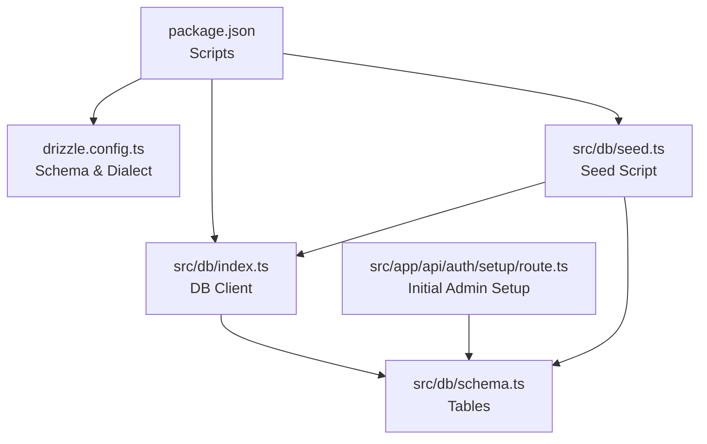
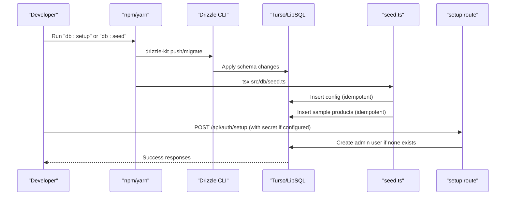
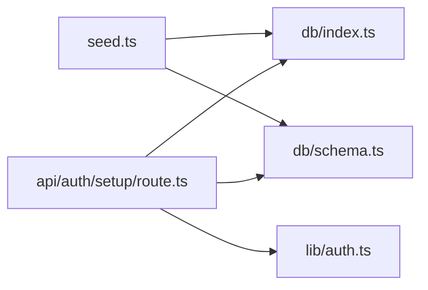
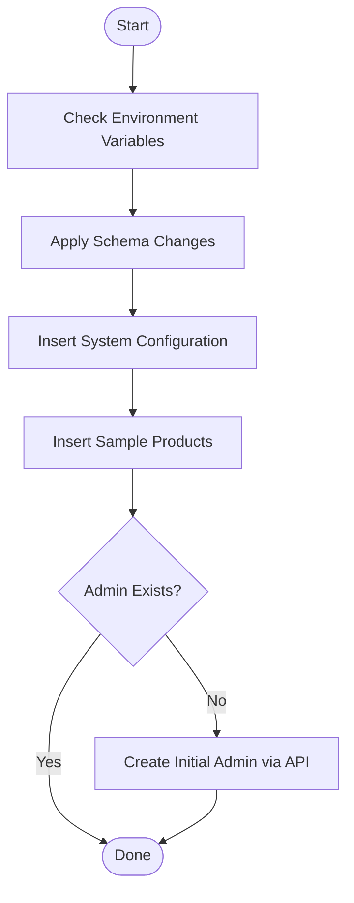

# Data Seeding & Initial Setup

<cite>
**Referenced Files in This Document**
- [seed.ts](file://src/db/seed.ts)
- [schema.ts](file://src/db/schema.ts)
- [index.ts](file://src/db/index.ts)
- [drizzle.config.ts](file://drizzle.config.ts)
- [package.json](file://package.json)
- [route.ts](file://src/app/api/auth/setup/route.ts)
- [auth.ts](file://src/lib/auth.ts)
- [load-test.ts](file://scripts/load-test.ts)
</cite>

## Table of Contents
1. [Introduction](#introduction)
2. [Project Structure](#project-structure)
3. [Core Components](#core-components)
4. [Architecture Overview](#architecture-overview)
5. [Detailed Component Analysis](#detailed-component-analysis)
6. [Dependency Analysis](#dependency-analysis)
7. [Performance Considerations](#performance-considerations)
8. [Troubleshooting Guide](#troubleshooting-guide)
9. [Conclusion](#conclusion)
10. [Appendices](#appendices)

## Introduction
This document explains how the application seeds its database and sets up initial data. It covers the seed script structure, sample data creation for products and system configurations, environment-aware behavior, idempotent operations, and guidance for creating custom seed data, handling dependencies, and managing test scenarios. It also includes recommendations for backup strategies and recovery procedures when running seeds.

## Project Structure
The seeding workflow is implemented using Drizzle ORM with a Turso/LibSQL client. The key files are:
- Database schema definitions
- Database connection configuration
- Seed script that inserts initial records
- Package scripts to run migrations and seeds
- An API route that initializes an admin user if none exists

**Diagram sources**
- [package.json:5-15](file://package.json#L5-L15)
- [drizzle.config.ts:1-14](file://drizzle.config.ts#L1-L14)
- [index.ts:1-14](file://src/db/index.ts#L1-L14)
- [schema.ts:1-56](file://src/db/schema.ts#L1-L56)
- [seed.ts:1-57](file://src/db/seed.ts#L1-L57)
- [route.ts:1-45](file://src/app/api/auth/setup/route.ts#L1-L45)

**Section sources**
- [package.json:5-15](file://package.json#L5-L15)
- [drizzle.config.ts:1-14](file://drizzle.config.ts#L1-L14)
- [index.ts:1-14](file://src/db/index.ts#L1-L14)
- [schema.ts:1-56](file://src/db/schema.ts#L1-L56)
- [seed.ts:1-57](file://src/db/seed.ts#L1-L57)
- [route.ts:1-45](file://src/app/api/auth/setup/route.ts#L1-L45)

## Core Components
- Database schema: Defines tables for products, orders, order items, system settings, users, and login attempts.
- Database client: Configures the LibSQL/Turso client and exposes a typed DB instance.
- Seed script: Inserts default system configuration and sample products using idempotent operations.
- Initial admin setup: Creates the first admin user via a protected API endpoint if no user exists yet.

Key responsibilities:
- Schema defines table structures and constraints used by both migrations and seeding.
- Seed ensures baseline data exists without failing on re-runs.
- Setup route enforces security and idempotency for admin creation.

**Section sources**
- [schema.ts:1-56](file://src/db/schema.ts#L1-L56)
- [index.ts:1-14](file://src/db/index.ts#L1-L14)
- [seed.ts:1-57](file://src/db/seed.ts#L1-L57)
- [route.ts:1-45](file://src/app/api/auth/setup/route.ts#L1-L45)

## Architecture Overview
The seeding architecture combines Drizzle migrations and a seed script, plus an API-driven initial admin setup.

**Diagram sources**
- [package.json:5-15](file://package.json#L5-L15)
- [drizzle.config.ts:1-14](file://drizzle.config.ts#L1-L14)
- [seed.ts:1-57](file://src/db/seed.ts#L1-L57)
- [route.ts:1-45](file://src/app/api/auth/setup/route.ts#L1-L45)

## Detailed Component Analysis

### Database Schema
- Products: Stores menu items with fields like name, description, price, category, status, and optional image.
- Orders and Order Items: Capture orders and their line items; timestamps recorded for creation time.
- System Settings: Holds restaurant-level configuration such as store status and preparation time window.
- Users: Stores staff accounts with role and hashed PIN.
- Login Attempts: Tracks failed login attempts and lockout windows.

Complexity considerations:
- All primary keys are text-based UUIDs or stable IDs, simplifying cross-environment references during seeding.
- Defaults reduce required fields during seeding (e.g., status defaults).

**Section sources**
- [schema.ts:1-56](file://src/db/schema.ts#L1-L56)

### Database Client Configuration
- Uses environment variables to connect to Turso or falls back to a local SQLite file for development.
- Optional auth token enables remote connections when present.

Environment behavior:
- Development: Local file-based database if no remote URL is set.
- Production: Remote Turso database when environment variables are provided.

**Section sources**
- [index.ts:1-14](file://src/db/index.ts#L1-L14)
- [drizzle.config.ts:1-14](file://drizzle.config.ts#L1-L14)

### Seed Script
- Inserts a single system configuration record using a fixed ID and idempotent conflict handling.
- Inserts multiple sample product records in one batch, also idempotent.
- Logs progress and exits with error code on failure.

Idempotency:
- Uses conflict handling to avoid duplicate inserts on repeated runs.

Data sanitization:
- Values are inserted directly from the script; ensure inputs are validated before insertion in production.

**Section sources**
- [seed.ts:1-57](file://src/db/seed.ts#L1-L57)

### Initial Admin User Setup
- Protected by an optional secret header to prevent unauthorized initialization.
- Checks for existing users to ensure only one initial admin is created.
- Generates a random PIN, hashes it securely, and stores it.

Security notes:
- Secret can be enforced via environment variable.
- PIN is hashed using bcrypt before storage.

**Section sources**
- [route.ts:1-45](file://src/app/api/auth/setup/route.ts#L1-L45)
- [auth.ts:21-27](file://src/lib/auth.ts#L21-L27)

### Package Scripts and Workflow
- db:generate: Generate Drizzle migrations from schema.
- db:push: Push schema changes to the database.
- db:migrate: Run migrations.
- db:seed: Execute the seed script.
- db:setup: Push schema and then seed.

Recommended flow:
- Use db:setup to apply schema and seed baseline data.
- Use db:seed independently to refresh sample data after migrations.

**Section sources**
- [package.json:5-15](file://package.json#L5-L15)

### Test Data Generation
- A separate load test script demonstrates bulk insertion patterns and batching for performance testing.
- It creates temporary tables and inserts large volumes of test data in batches.

Use cases:
- Performance benchmarking and capacity planning.
- Generating realistic datasets for staging environments.

**Section sources**
- [load-test.ts:1-52](file://scripts/load-test.ts#L1-L52)

## Dependency Analysis
The seed script depends on:
- The DB client instance for executing insertions.
- The schema exports for type-safe table references.
- Environment variables for database connectivity.

The setup route depends on:
- The DB client and schema.
- Authentication utilities for hashing PINs.

**Diagram sources**
- [seed.ts:1-57](file://src/db/seed.ts#L1-L57)
- [index.ts:1-14](file://src/db/index.ts#L1-L14)
- [schema.ts:1-56](file://src/db/schema.ts#L1-L56)
- [route.ts:1-45](file://src/app/api/auth/setup/route.ts#L1-L45)
- [auth.ts:1-82](file://src/lib/auth.ts#L1-L82)

**Section sources**
- [seed.ts:1-57](file://src/db/seed.ts#L1-L57)
- [index.ts:1-14](file://src/db/index.ts#L1-L14)
- [schema.ts:1-56](file://src/db/schema.ts#L1-L56)
- [route.ts:1-45](file://src/app/api/auth/setup/route.ts#L1-L45)
- [auth.ts:1-82](file://src/lib/auth.ts#L1-L82)

## Performance Considerations
- Batch inserts: The seed uses array values to insert multiple products at once, reducing round trips.
- Idempotent operations: Conflict handling avoids unnecessary updates and errors on re-runs.
- Transactions: For multi-step seeding involving related entities, wrap operations in transactions to ensure consistency.
- Bulk loading: For large datasets, consider batching similar to the load test script to improve throughput.

[No sources needed since this section provides general guidance]

## Troubleshooting Guide
Common issues and resolutions:
- Missing environment variables: Ensure TURSO_DATABASE_URL and TURSO_AUTH_TOKEN are set for remote databases.
- Migration conflicts: Re-run db:push or db:migrate to align schema with the database.
- Duplicate seed data: Verify idempotent usage of conflict handling; adjust IDs if necessary.
- Unauthorized setup: Provide the correct x-setup-secret header if SETUP_SECRET is configured.
- Errors during seeding: Check console logs and exit codes; review database connectivity and permissions.

Recovery steps:
- If seeding fails mid-way, inspect partial state and re-run the seed; idempotent operations will skip already inserted records.
- For corrupted or inconsistent data, restore from backups before re-running migrations and seeds.

**Section sources**
- [index.ts:1-14](file://src/db/index.ts#L1-L14)
- [seed.ts:1-57](file://src/db/seed.ts#L1-L57)
- [route.ts:1-45](file://src/app/api/auth/setup/route.ts#L1-L45)

## Conclusion
The seeding process establishes baseline configuration and sample products using idempotent operations, ensuring safe re-runs across environments. The initial admin setup provides a secure way to bootstrap access. For advanced scenarios, leverage batching and transactions to maintain data integrity and performance. Always prepare backups before running seeds in production and follow the troubleshooting steps to recover from failures.

[No sources needed since this section summarizes without analyzing specific files]

## Appendices

### Seeding Workflow Diagram

[No sources needed since this diagram shows conceptual workflow, not actual code structure]

### Creating Custom Seed Data
Steps:
- Define new records in the seed script using the schema exports for type safety.
- Use unique IDs to avoid conflicts and enable idempotent re-runs.
- For dependent records, insert parent records first, then child records referencing them.
- Wrap multi-step operations in transactions to ensure atomicity.

Examples:
- Add categories or additional products following the same pattern as existing entries.
- Introduce users with roles and hashed PINs using the authentication utilities.

**Section sources**
- [schema.ts:1-56](file://src/db/schema.ts#L1-L56)
- [seed.ts:1-57](file://src/db/seed.ts#L1-L57)
- [auth.ts:21-27](file://src/lib/auth.ts#L21-L27)

### Handling Dependencies Between Records
- Insert referenced records first (e.g., categories before products).
- Use stable IDs for relationships to simplify seeding and testing.
- Validate foreign key relationships if applicable; otherwise, ensure referential integrity through application logic.

**Section sources**
- [schema.ts:1-56](file://src/db/schema.ts#L1-L56)

### Managing Test Data Scenarios
- Use the load test script to generate large datasets for performance testing.
- Isolate test data by using separate databases or schemas per environment.
- Clean up test data after tests to maintain a clean state.

**Section sources**
- [load-test.ts:1-52](file://scripts/load-test.ts#L1-L52)

### Backup Strategies Before Running Seeds
- Take a snapshot or export of the current database before applying migrations or seeds in production.
- For Turso, use platform-specific backup features or export mechanisms.
- Store backups securely and verify restore procedures periodically.

[No sources needed since this section provides general guidance]

### Recovery Procedures for Failed Seeding Operations
- Restore the database from the pre-seed backup.
- Re-run migrations and seeds to bring the system to a consistent state.
- Inspect logs and fix any schema or data issues before retrying.

[No sources needed since this section provides general guidance]