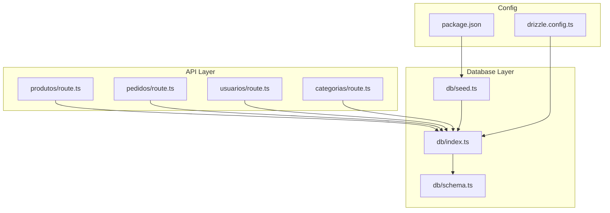
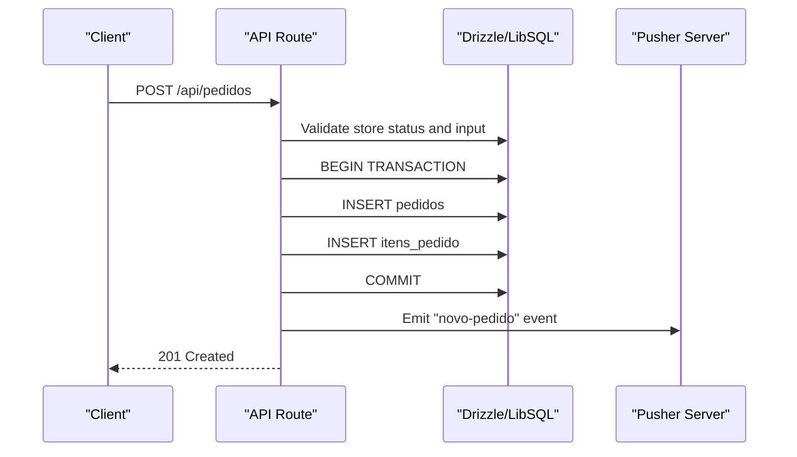
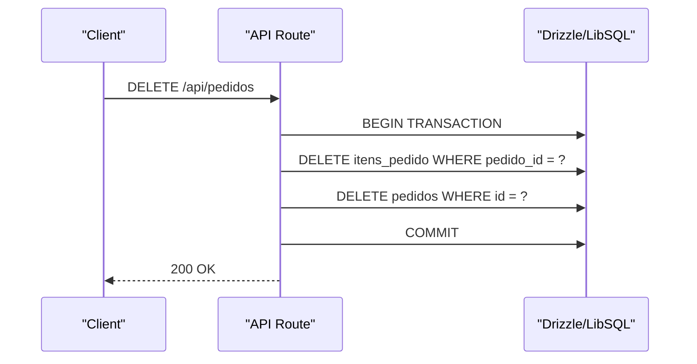
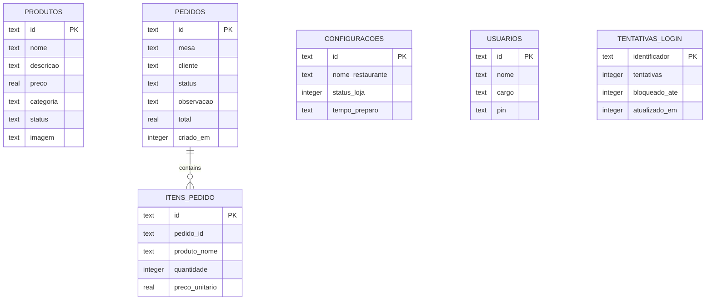
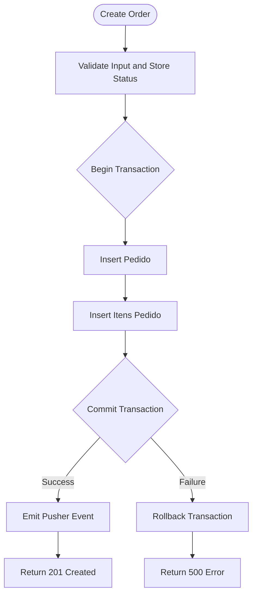
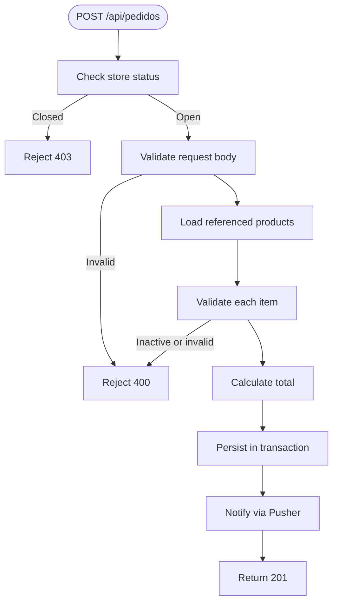
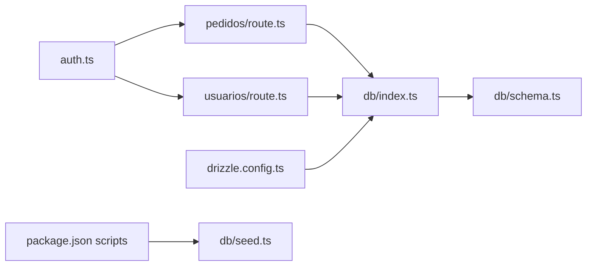

# Database Architecture

<cite>
**Referenced Files in This Document**
- [schema.ts](file://src/db/schema.ts)
- [index.ts](file://src/db/index.ts)
- [seed.ts](file://src/db/seed.ts)
- [drizzle.config.ts](file://drizzle.config.ts)
- [pedidos/route.ts](file://src/app/api/pedidos/route.ts)
- [produtos/route.ts](file://src/app/api/produtos/route.ts)
- [usuarios/route.ts](file://src/app/api/usuarios/route.ts)
- [categorias/route.ts](file://src/app/api/categorias/route.ts)
- [auth.ts](file://src/lib/auth.ts)
- [package.json](file://package.json)
</cite>

## Table of Contents
1. [Introduction](#introduction)
2. [Project Structure](#project-structure)
3. [Core Components](#core-components)
4. [Architecture Overview](#architecture-overview)
5. [Detailed Component Analysis](#detailed-component-analysis)
6. [Dependency Analysis](#dependency-analysis)
7. [Performance Considerations](#performance-considerations)
8. [Troubleshooting Guide](#troubleshooting-guide)
9. [Conclusion](#conclusion)
10. [Appendices](#appendices)

## Introduction
This document describes the database architecture for the application, which uses SQLite via Drizzle ORM and a LibSQL client. It covers the entity relationship model (products, orders, order items, users, system settings, and login attempts), schema design principles, data types, constraints, indexing strategy, migration approach, seeding procedures, backup considerations, query optimization techniques, connection configuration, transaction patterns, and data integrity enforcement at the database level.

## Project Structure
The database layer is organized under src/db with clear separation between schema definitions, database client configuration, and seed scripts. API routes consume the database through Drizzle queries and enforce business rules before persisting data.

**Diagram sources**
- [pedidos/route.ts:1-253](file://src/app/api/pedidos/route.ts#L1-L253)
- [produtos/route.ts:1-53](file://src/app/api/produtos/route.ts#L1-L53)
- [usuarios/route.ts:1-79](file://src/app/api/usuarios/route.ts#L1-L79)
- [categorias/route.ts:1-28](file://src/app/api/categorias/route.ts#L1-L28)
- [index.ts:1-14](file://src/db/index.ts#L1-L14)
- [schema.ts:1-56](file://src/db/schema.ts#L1-L56)
- [seed.ts:1-57](file://src/db/seed.ts#L1-L57)
- [drizzle.config.ts:1-14](file://drizzle.config.ts#L1-L14)
- [package.json:1-45](file://package.json#L1-L45)

**Section sources**
- [schema.ts:1-56](file://src/db/schema.ts#L1-L56)
- [index.ts:1-14](file://src/db/index.ts#L1-L14)
- [seed.ts:1-57](file://src/db/seed.ts#L1-L57)
- [drizzle.config.ts:1-14](file://drizzle.config.ts#L1-L14)
- [package.json:1-45](file://package.json#L1-L45)

## Core Components
- Entities and relationships:
  - Products (menu items) with name, description, price, category, status, and image URL.
  - Orders with table, customer, status, observation, total, and creation timestamp.
  - Order Items linking to orders and capturing product name, quantity, and unit price at time of sale.
  - System Settings storing restaurant name, store open/close status, and preparation time.
  - Users (staff) with name, role, and hashed PIN.
  - Login Attempts tracking failed attempts and lockout windows per identifier.

- Data types and constraints:
  - Primary keys are text UUIDs for all entities.
  - NotNull constraints on critical fields ensure required data presence.
  - Default values for status fields provide consistent initial states.
  - Timestamps stored as integer mode timestamps; boolean flags stored as integer booleans.

- Indexing strategy:
  - No explicit indexes are defined in the schema. Queries rely on primary key lookups and full scans. For high-volume reads/writes, consider adding indexes on frequently filtered columns such as pedidos.status, itensPedido.pedidoId, produtos.categoria, and usuarios.cargo.

- Transaction usage:
  - Order creation and deletion use transactions to maintain consistency between orders and order items.

- Migration and seeding:
  - Drizzle Kit configured to push schema changes and generate migrations.
  - Seed script initializes default settings and sample products using upsert semantics.

**Section sources**
- [schema.ts:1-56](file://src/db/schema.ts#L1-L56)
- [pedidos/route.ts:147-171](file://src/app/api/pedidos/route.ts#L147-L171)
- [pedidos/route.ts:244-247](file://src/app/api/pedidos/route.ts#L244-L247)
- [seed.ts:1-57](file://src/db/seed.ts#L1-L57)
- [drizzle.config.ts:1-14](file://drizzle.config.ts#L1-L14)

## Architecture Overview
The application follows a layered architecture where Next.js API routes orchestrate requests, validate inputs, enforce authorization, and perform database operations via Drizzle ORM over a LibSQL client. Transactions ensure atomicity when writing related records.

**Diagram sources**
- [pedidos/route.ts:65-189](file://src/app/api/pedidos/route.ts#L65-L189)

**Diagram sources**
- [pedidos/route.ts:237-251](file://src/app/api/pedidos/route.ts#L237-L251)

**Section sources**
- [pedidos/route.ts:1-253](file://src/app/api/pedidos/route.ts#L1-L253)

## Detailed Component Analysis

### Entity Relationship Model

**Diagram sources**
- [schema.ts:1-56](file://src/db/schema.ts#L1-L56)

**Section sources**
- [schema.ts:1-56](file://src/db/schema.ts#L1-L56)

### Schema Design Principles
- Use of UUIDs as primary keys ensures uniqueness and avoids central ID generation bottlenecks.
- Text-based enums (status fields) are constrained by application logic rather than database-level enum types, suitable for SQLite.
- Defaults for status fields reduce boilerplate and ensure consistent initial states.
- Boolean flags stored as integers align with SQLite’s type affinity while preserving semantic meaning.

**Section sources**
- [schema.ts:1-56](file://src/db/schema.ts#L1-L56)

### Data Types and Constraints
- All tables define explicit not null constraints on required fields.
- Timestamps use integer mode for compatibility with SQLite and Drizzle.
- Prices use real numbers; validation in API routes enforces non-negative values and reasonable ranges.

**Section sources**
- [schema.ts:1-56](file://src/db/schema.ts#L1-L56)
- [produtos/route.ts:18-47](file://src/app/api/produtos/route.ts#L18-L47)
- [pedidos/route.ts:98-130](file://src/app/api/pedidos/route.ts#L98-L130)

### Indexing Strategy
- Current schema does not declare indexes.
- Recommended additions:
  - Index on pedidos.status for filtering active or pending orders.
  - Index on itensPedido.pedidoId for efficient joins and cascading deletes.
  - Index on produtos.categoria for category-based queries.
  - Index on usuarios.cargo for role-based access queries.
- These indexes can significantly improve read performance for common queries without impacting write overhead substantially.

[No sources needed since this section provides general guidance]

### Migration Approach
- Drizzle Kit is configured to target Turso dialect with credentials from environment variables.
- Commands available:
  - Generate migrations
  - Push schema changes directly
  - Run migrations
  - Open studio for visual management
- The configuration points to the schema file and output directory for generated artifacts.

**Section sources**
- [drizzle.config.ts:1-14](file://drizzle.config.ts#L1-L14)
- [package.json:10-15](file://package.json#L10-L15)

### Data Seeding Procedures
- Seed script inserts default system settings and sample products using upsert semantics to avoid duplicates.
- Uses drizzle insert with conflict handling to make seeding idempotent.
- Errors during seeding are logged and cause process exit with non-zero status.

**Section sources**
- [seed.ts:1-57](file://src/db/seed.ts#L1-L57)

### Backup Strategies
- SQLite databases are single-file stores; backups can be performed by copying the database file.
- For Turso-backed deployments, leverage provider-specific backup features and snapshots.
- Ensure consistent backups by stopping writes or using WAL checkpointing if applicable.
- Schedule periodic backups and retain multiple versions for recovery scenarios.

[No sources needed since this section provides general guidance]

### Query Optimization Techniques
- Prefer selective filters and projections to minimize payload size.
- Use inArray for batch lookups to reduce round trips.
- Avoid N+1 queries by fetching related data in batches and assembling results server-side.
- Consider adding indexes on frequently queried columns as noted above.
- Cache static or semi-static data (e.g., active products) to reduce database load.

**Section sources**
- [pedidos/route.ts:32-43](file://src/app/api/pedidos/route.ts#L32-L43)
- [pedidos/route.ts:50-58](file://src/app/api/pedidos/route.ts#L50-L58)
- [produtos/route.ts:6-15](file://src/app/api/produtos/route.ts#L6-L15)

### Connection Pooling Configuration
- The database client is created with LibSQL and Drizzle ORM.
- Environment variables configure the database URL and optional authentication token.
- Connection pooling specifics depend on the LibSQL client implementation; tune pool size based on expected concurrency and workload characteristics.

**Section sources**
- [index.ts:1-14](file://src/db/index.ts#L1-L14)

### Transaction Management Patterns
- Order creation wraps inserts into pedidos and itens_pedido within a transaction to ensure atomicity.
- Order deletion removes associated items first, then the order itself, also within a transaction.
- External side effects (e.g., Pusher events) are triggered after successful persistence to avoid inconsistent state.

**Diagram sources**
- [pedidos/route.ts:147-185](file://src/app/api/pedidos/route.ts#L147-L185)

**Section sources**
- [pedidos/route.ts:147-185](file://src/app/api/pedidos/route.ts#L147-L185)
- [pedidos/route.ts:244-247](file://src/app/api/pedidos/route.ts#L244-L247)

### Data Integrity, Validation Rules, and Business Logic Enforcement
- Authorization checks restrict sensitive operations to authorized roles.
- Input validation ensures required fields, correct types, and business constraints (e.g., positive prices, valid quantities).
- Business rules enforced include:
  - Store must be open to accept new orders.
  - Only active products can be included in orders.
  - Valid table identifiers or counter orders are required.
  - User creation validates roles and PIN format; only one admin allowed.

**Diagram sources**
- [pedidos/route.ts:65-189](file://src/app/api/pedidos/route.ts#L65-L189)

**Section sources**
- [pedidos/route.ts:65-189](file://src/app/api/pedidos/route.ts#L65-L189)
- [usuarios/route.ts:21-73](file://src/app/api/usuarios/route.ts#L21-L73)
- [auth.ts:21-82](file://src/lib/auth.ts#L21-L82)

## Dependency Analysis
The database layer depends on Drizzle ORM and LibSQL client, configured via environment variables. API routes import schema definitions and execute queries. Authentication utilities enforce role-based access before database operations.

**Diagram sources**
- [auth.ts:1-82](file://src/lib/auth.ts#L1-L82)
- [pedidos/route.ts:1-253](file://src/app/api/pedidos/route.ts#L1-L253)
- [usuarios/route.ts:1-79](file://src/app/api/usuarios/route.ts#L1-L79)
- [index.ts:1-14](file://src/db/index.ts#L1-L14)
- [schema.ts:1-56](file://src/db/schema.ts#L1-L56)
- [drizzle.config.ts:1-14](file://drizzle.config.ts#L1-L14)
- [package.json:10-15](file://package.json#L10-L15)
- [seed.ts:1-57](file://src/db/seed.ts#L1-L57)

**Section sources**
- [auth.ts:1-82](file://src/lib/auth.ts#L1-L82)
- [pedidos/route.ts:1-253](file://src/app/api/pedidos/route.ts#L1-L253)
- [usuarios/route.ts:1-79](file://src/app/api/usuarios/route.ts#L1-L79)
- [index.ts:1-14](file://src/db/index.ts#L1-L14)
- [schema.ts:1-56](file://src/db/schema.ts#L1-L56)
- [drizzle.config.ts:1-14](file://drizzle.config.ts#L1-L14)
- [package.json:10-15](file://package.json#L10-L15)
- [seed.ts:1-57](file://src/db/seed.ts#L1-L57)

## Performance Considerations
- Use transactions for multi-step writes to prevent partial updates and reduce locking overhead.
- Batch operations where possible (e.g., inArray queries) to minimize network round trips.
- Add indexes on high-cardinality filter columns to speed up reads.
- Cache frequently accessed, relatively static data (e.g., active products) to reduce database pressure.
- Monitor query execution plans and adjust indexes accordingly.

[No sources needed since this section provides general guidance]

## Troubleshooting Guide
- Common issues:
  - Invalid input payloads result in 400 responses; verify field types and constraints.
  - Store closed prevents order creation; check system settings.
  - Inactive products cannot be added to orders; update product status.
  - Authentication failures return 401/403; ensure proper roles and cookies.
- Debugging steps:
  - Inspect API logs for error messages and stack traces.
  - Verify environment variables for database URL and auth token.
  - Use Drizzle Studio to inspect schema and data.
  - Re-run seed script to restore baseline data if needed.

**Section sources**
- [pedidos/route.ts:65-189](file://src/app/api/pedidos/route.ts#L65-L189)
- [produtos/route.ts:18-47](file://src/app/api/produtos/route.ts#L18-L47)
- [usuarios/route.ts:21-73](file://src/app/api/usuarios/route.ts#L21-L73)
- [auth.ts:63-82](file://src/lib/auth.ts#L63-L82)

## Conclusion
The database architecture leverages SQLite via Drizzle ORM and LibSQL to provide a robust, transactional foundation for managing menu items, orders, staff, and system settings. While the current schema omits explicit indexes, the application enforces strong data integrity and business rules at the API layer. Adding targeted indexes and refining caching strategies will further enhance performance as usage scales. Migrations and seeding are streamlined through Drizzle Kit and scripts, ensuring reproducible environments.

[No sources needed since this section summarizes without analyzing specific files]

## Appendices

### API Endpoints Using the Database
- Products:
  - GET /api/produtos: List active or all products depending on role.
  - POST /api/produtos: Create a new product with validation.
- Orders:
  - GET /api/pedidos: List orders with items; supports filtering by IDs for unauthenticated clients.
  - POST /api/pedidos: Create an order with transactional persistence and notifications.
  - PATCH /api/pedidos: Update order status with validation.
  - DELETE /api/pedidos: Delete order and its items atomically.
- Users:
  - GET /api/usuarios: List users excluding sensitive fields.
  - POST /api/usuarios: Create user with role and PIN validation.
- Categories:
  - PUT /api/categorias: Rename categories across products.

**Section sources**
- [produtos/route.ts:1-53](file://src/app/api/produtos/route.ts#L1-L53)
- [pedidos/route.ts:1-253](file://src/app/api/pedidos/route.ts#L1-L253)
- [usuarios/route.ts:1-79](file://src/app/api/usuarios/route.ts#L1-L79)
- [categorias/route.ts:1-28](file://src/app/api/categorias/route.ts#L1-L28)