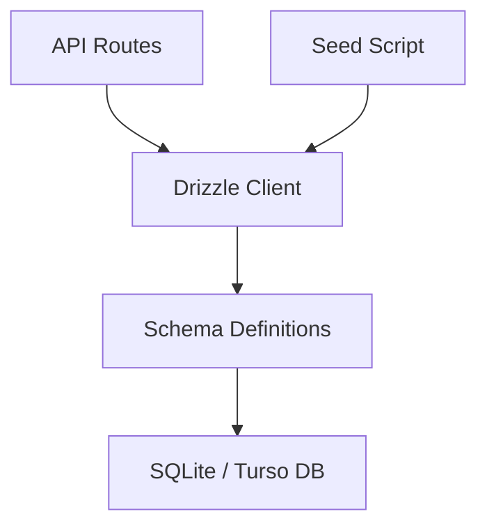
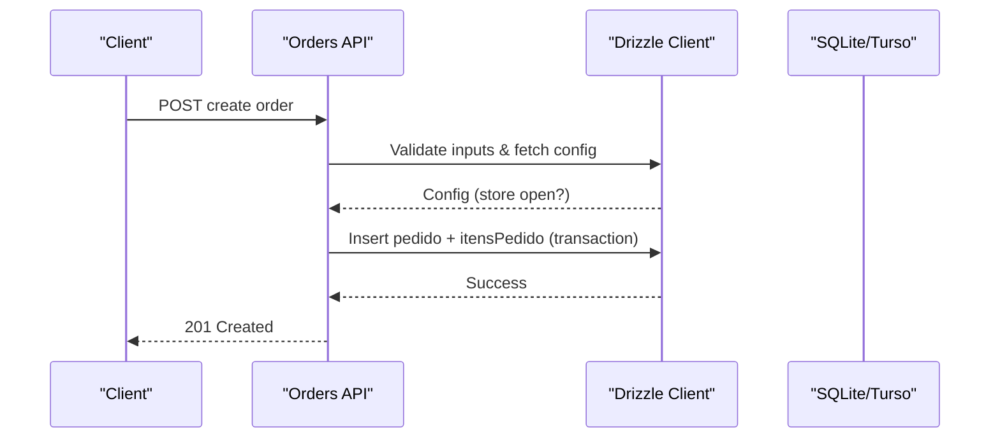
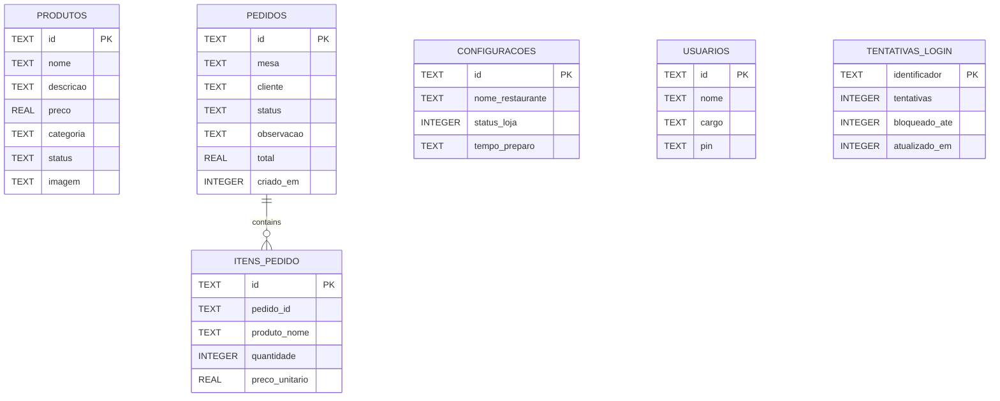
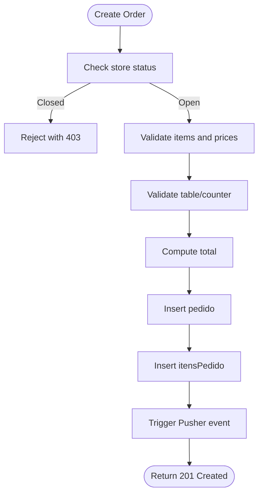
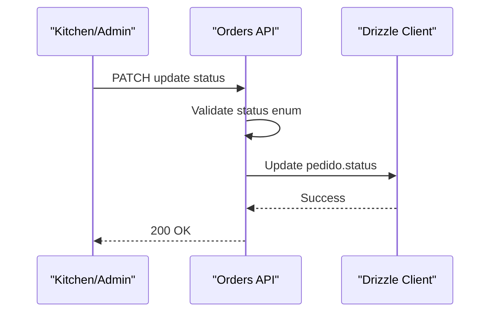
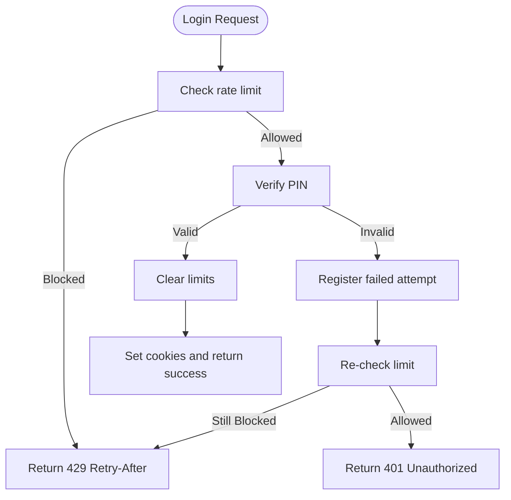
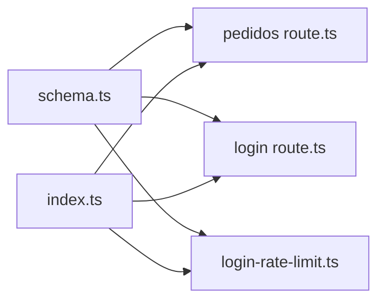

# Database Schema Design

<cite>
**Referenced Files in This Document**
- [schema.ts](file://src/db/schema.ts)
- [index.ts](file://src/db/index.ts)
- [drizzle.config.ts](file://drizzle.config.ts)
- [seed.ts](file://src/db/seed.ts)
- [pedidos route.ts](file://src/app/api/pedidos/route.ts)
- [login route.ts](file://src/app/api/auth/login/route.ts)
- [login-rate-limit.ts](file://src/lib/login-rate-limit.ts)
</cite>

## Table of Contents
1. [Introduction](#introduction)
2. [Project Structure](#project-structure)
3. [Core Components](#core-components)
4. [Architecture Overview](#architecture-overview)
5. [Detailed Component Analysis](#detailed-component-analysis)
6. [Dependency Analysis](#dependency-analysis)
7. [Performance Considerations](#performance-considerations)
8. [Troubleshooting Guide](#troubleshooting-guide)
9. [Conclusion](#conclusion)

## Introduction
This document describes the data model for the meu-cardapio database schema implemented with Drizzle ORM and SQLite/Turso. It covers all entities: produtos (products), pedidos (orders), itensPedido (order items), configuracoes (settings), usuarios (users), and tentativasLogin (login attempts). For each table, we define fields, types, constraints, primary keys, and relationships. We also explain business logic enforced by the schema and application code, including status enums, defaults, and validation rules. Finally, we provide entity relationship diagrams and note SQLite-specific optimizations and type mappings used in Drizzle.

## Project Structure
The database is defined in a single schema file and accessed via a typed Drizzle client configured for Turso/SQLite. Seed data initializes default configuration and sample products. API routes enforce business rules around orders, product availability, and login rate limiting using the tables defined in the schema.

**Diagram sources**
- [index.ts:1-14](file://src/db/index.ts#L1-L14)
- [schema.ts:1-56](file://src/db/schema.ts#L1-L56)
- [seed.ts:1-57](file://src/db/seed.ts#L1-L57)

**Section sources**
- [index.ts:1-14](file://src/db/index.ts#L1-L14)
- [drizzle.config.ts:1-14](file://drizzle.config.ts#L1-L14)
- [schema.ts:1-56](file://src/db/schema.ts#L1-L56)

## Core Components
The system models menu items, orders, order line items, store settings, users, and login attempt tracking. The key design choices include:
- Text-based identifiers for all primary keys to simplify client-side generation and cross-service usage.
- Status fields as constrained text values validated at the application layer.
- Denormalized order item details (product name and unit price) to preserve historical pricing even if product prices change later.
- Boolean-like flags stored as integers with Drizzle boolean mode mapping.
- Timestamps stored as integer epoch milliseconds.

**Section sources**
- [schema.ts:1-56](file://src/db/schema.ts#L1-L56)

## Architecture Overview
At runtime, API endpoints interact with the database through Drizzle. Orders are created with items in a transaction to ensure consistency. Login flows use a dedicated table to track failed attempts and enforce lockouts. Configuration controls whether new orders can be placed.

**Diagram sources**
- [pedidos route.ts:65-189](file://src/app/api/pedidos/route.ts#L65-L189)
- [index.ts:1-14](file://src/db/index.ts#L1-L14)

## Detailed Component Analysis

### Entities and Relationships
Below is an Entity Relationship Diagram showing how orders link to products through order items and how other entities relate. Note that foreign key constraints are not declared in the schema; referential integrity is enforced by application logic and consistent IDs.

**Diagram sources**
- [schema.ts:4-55](file://src/db/schema.ts#L4-L55)

#### Products (produtos)
- Purpose: Menu items available for ordering.
- Fields:
  - id: TEXT, primary key
  - nome: TEXT, not null
  - descricao: TEXT, nullable
  - preco: REAL, not null
  - categoria: TEXT, not null
  - status: TEXT, not null, default "Ativo"
  - imagem: TEXT, nullable
- Business rules:
  - Only products with status "Ativo" may be included in new orders.
  - Category groups menu items for display and filtering.

**Section sources**
- [schema.ts:4-12](file://src/db/schema.ts#L4-L12)
- [pedidos route.ts:112-120](file://src/app/api/pedidos/route.ts#L112-L120)

#### Orders (pedidos)
- Purpose: Represents a customer order associated with a table or counter.
- Fields:
  - id: TEXT, primary key
  - mesa: TEXT, not null (normalized to "Mesa N" or "Balcão")
  - cliente: TEXT, not null (trimmed and length-limited)
  - status: TEXT, not null, default "pendente"
  - observacao: TEXT, nullable (trimmed and length-limited)
  - total: REAL, not null
  - criadoEm: INTEGER (timestamp), not null
- Business rules:
  - New orders start with status "pendente".
  - Valid statuses enforced at the API: "pendente", "preparando", "pronto", "entregue", "cancelado".
  - Order creation checks store status from configuracoes before accepting new orders.

**Section sources**
- [schema.ts:15-23](file://src/db/schema.ts#L15-L23)
- [pedidos route.ts:65-189](file://src/app/api/pedidos/route.ts#L65-L189)
- [pedidos route.ts:192-234](file://src/app/api/pedidos/route.ts#L192-L234)

#### Order Items (itensPedido)
- Purpose: Line items for an order, capturing what was ordered, quantity, and price at time of order.
- Fields:
  - id: TEXT, primary key
  - pedidoId: TEXT, not null (references pedido.id conceptually)
  - produtoNome: TEXT, not null (denormalized snapshot of product name)
  - quantidade: INTEGER, not null (validated > 0 and <= 99)
  - precoUnitario: REAL, not null (from product price or provided price)
- Business rules:
  - If an item references a product by ID, its active status and current price are used; otherwise, a provided price must be non-negative.
  - Total is computed server-side and persisted on the order.

**Section sources**
- [schema.ts:26-32](file://src/db/schema.ts#L26-L32)
- [pedidos route.ts:87-126](file://src/app/api/pedidos/route.ts#L87-L126)
- [pedidos route.ts:147-171](file://src/app/api/pedidos/route.ts#L147-L171)

#### Settings (configuracoes)
- Purpose: Global store configuration controlling availability and operational parameters.
- Fields:
  - id: TEXT, primary key
  - nomeRestaurante: TEXT, not null
  - statusLoja: INTEGER (boolean mode), not null
  - tempoPreparo: TEXT, not null
- Business rules:
  - If statusLoja is false, new orders are rejected with a message indicating the store is closed.

**Section sources**
- [schema.ts:35-40](file://src/db/schema.ts#L35-L40)
- [pedidos route.ts:67-73](file://src/app/api/pedidos/route.ts#L67-L73)
- [seed.ts:7-15](file://src/db/seed.ts#L7-L15)

#### Users (usuarios)
- Purpose: Staff accounts used for authentication and role-based access.
- Fields:
  - id: TEXT, primary key
  - nome: TEXT, not null
  - cargo: TEXT, not null (role such as admin, cozinha, atendente)
  - pin: TEXT, not null (hashed PIN for secure verification)
- Business rules:
  - Authentication verifies the provided PIN against stored hashed PINs.
  - Roles are normalized and used to authorize endpoints.

**Section sources**
- [schema.ts:43-48](file://src/db/schema.ts#L43-L48)
- [login route.ts:16-79](file://src/app/api/auth/login/route.ts#L16-L79)

#### Login Attempts (tentativasLogin)
- Purpose: Tracks failed login attempts per client identifier to prevent brute-force attacks.
- Fields:
  - identificador: TEXT, primary key (hashed client IP or identifier)
  - tentativas: INTEGER, not null, default 0
  - bloqueadoAte: INTEGER, nullable (epoch ms until unlock)
  - atualizadoEm: INTEGER, not null
- Business rules:
  - After a threshold of failed attempts, the identifier is locked out for a fixed duration.
  - Successful login clears the counters for that identifier.

**Section sources**
- [schema.ts:50-55](file://src/db/schema.ts#L50-L55)
- [login-rate-limit.ts:1-115](file://src/lib/login-rate-limit.ts#L1-L115)
- [login route.ts:16-79](file://src/app/api/auth/login/route.ts#L16-L79)

### Data Flow: Creating an Order

**Diagram sources**
- [pedidos route.ts:65-189](file://src/app/api/pedidos/route.ts#L65-L189)

### Data Flow: Updating Order Status

**Diagram sources**
- [pedidos route.ts:192-234](file://src/app/api/pedidos/route.ts#L192-L234)

### Data Flow: Login Rate Limiting

**Diagram sources**
- [login route.ts:16-79](file://src/app/api/auth/login/route.ts#L16-L79)
- [login-rate-limit.ts:45-97](file://src/lib/login-rate-limit.ts#L45-L97)

## Dependency Analysis
- The Drizzle client connects to Turso or a local SQLite file based on environment variables.
- All tables are defined in a single schema module and imported across API routes and seed scripts.
- Referential integrity between pedidos and itensPedido is maintained by application logic; no explicit foreign keys are declared in the schema.
- Login rate limiting uses raw SQL to ensure table existence and perform atomic updates.

**Diagram sources**
- [schema.ts:1-56](file://src/db/schema.ts#L1-L56)
- [index.ts:1-14](file://src/db/index.ts#L1-L14)
- [pedidos route.ts:1-253](file://src/app/api/pedidos/route.ts#L1-L253)
- [login route.ts:1-80](file://src/app/api/auth/login/route.ts#L1-L80)
- [login-rate-limit.ts:1-115](file://src/lib/login-rate-limit.ts#L1-L115)

**Section sources**
- [index.ts:1-14](file://src/db/index.ts#L1-L14)
- [drizzle.config.ts:1-14](file://drizzle.config.ts#L1-L14)

## Performance Considerations
- Use transactions when inserting related rows (pedido and itensPedido) to avoid partial writes and improve consistency.
- Denormalize product name and price into order items to avoid joins during order history queries and to preserve historical accuracy.
- Keep status fields as small text values; they are validated at the API layer to reduce storage overhead while maintaining readability.
- Store timestamps as integers (epoch ms) for efficient indexing and comparisons in SQLite.
- Avoid unnecessary reads by batching product lookups using inArray queries when validating order items.

[No sources needed since this section provides general guidance]

## Troubleshooting Guide
- New orders rejected due to store closure: Ensure configuracoes has statusLoja set to true.
- Invalid order items: Validate that quantities are within allowed range and prices are non-negative; ensure referenced products are active.
- Cannot cancel an order: Only orders with status "pendente" can be canceled; others require different workflows.
- Login blocked: Check tentativas_login for a future bloqueado_ate timestamp; wait until it expires or clear after successful login.

**Section sources**
- [pedidos route.ts:67-73](file://src/app/api/pedidos/route.ts#L67-L73)
- [pedidos route.ts:100-130](file://src/app/api/pedidos/route.ts#L100-L130)
- [pedidos route.ts:192-234](file://src/app/api/pedidos/route.ts#L192-L234)
- [login-rate-limit.ts:45-97](file://src/lib/login-rate-limit.ts#L45-L97)

## Conclusion
The meu-cardapio schema balances simplicity and practicality for a restaurant ordering system. It uses text-based IDs, denormalized order item snapshots, and application-enforced constraints to maintain data integrity without complex relational constraints. Status enums and defaults guide the lifecycle of orders and products, while login attempt tracking protects authentication endpoints. SQLite-specific type mappings in Drizzle (real, integer with modes) align well with the application’s needs and performance goals.