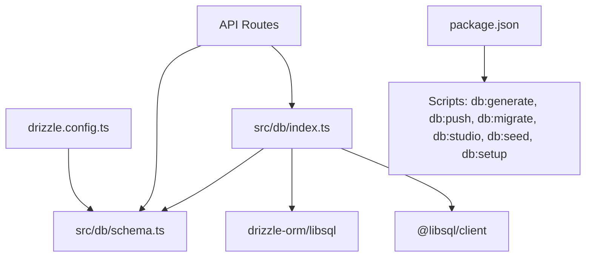
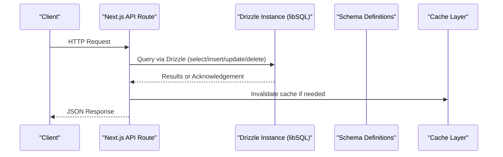
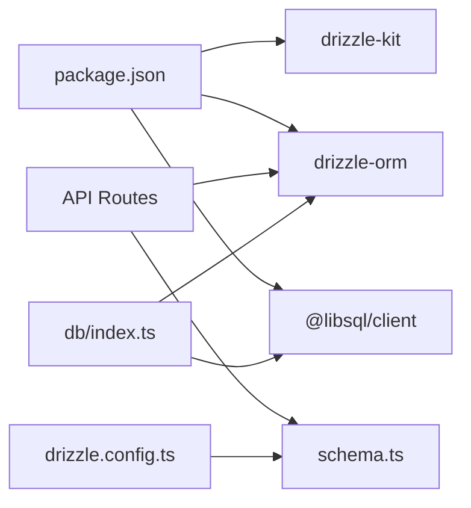

# ORM Configuration & Connection Management

<cite>
**Referenced Files in This Document**
- [drizzle.config.ts](file://drizzle.config.ts)
- [index.ts](file://src/db/index.ts)
- [schema.ts](file://src/db/schema.ts)
- [seed.ts](file://src/db/seed.ts)
- [package.json](file://package.json)
- [route.ts](file://src/app/api/produtos/route.ts)
- [route.ts](file://src/app/api/pedidos/route.ts)
- [route.ts](file://src/app/api/usuarios/route.ts)
- [route.ts](file://src/app/api/categorias/route.ts)
</cite>

## Table of Contents
1. [Introduction](#introduction)
2. [Project Structure](#project-structure)
3. [Core Components](#core-components)
4. [Architecture Overview](#architecture-overview)
5. [Detailed Component Analysis](#detailed-component-analysis)
6. [Dependency Analysis](#dependency-analysis)
7. [Performance Considerations](#performance-considerations)
8. [Troubleshooting Guide](#troubleshooting-guide)
9. [Conclusion](#conclusion)

## Introduction
This document explains how the project configures Drizzle ORM with a libSQL client, manages database connections, and handles migrations and schema synchronization. It also covers query builder usage patterns, transaction management, performance optimization techniques, common CRUD operations, complex queries with joins, batch operations, error handling, connection retry logic, and debugging strategies for database operations.

## Project Structure
The database layer is organized under src/db with three key files:
- index.ts: Creates the libSQL client and exports a typed Drizzle instance.
- schema.ts: Defines all tables using Drizzle’s SQLite dialect.
- seed.ts: Seeds initial data into the database.

Drizzle configuration lives at drizzle.config.ts, which points to the schema file and sets the Turso dialect and credentials. Package scripts provide commands for generating migrations, pushing schema changes, running migrations, opening the Drizzle Studio, seeding, and setting up the database.

**Diagram sources**
- [drizzle.config.ts](file://drizzle.config.ts)
- [index.ts](file://src/db/index.ts)
- [schema.ts](file://src/db/schema.ts)
- [package.json](file://package.json)

**Section sources**
- [drizzle.config.ts](file://drizzle.config.ts)
- [index.ts](file://src/db/index.ts)
- [schema.ts](file://src/db/schema.ts)
- [package.json](file://package.json)

## Core Components
- Database client and Drizzle instance: The libSQL client is created with URL and optional auth token from environment variables. The Drizzle instance is exported for use across API routes.
- Schema definitions: Tables are defined using sqliteTable with appropriate column types and defaults.
- Seed script: Inserts default configuration and product records using onConflictDoNothing to avoid duplicates.

Key responsibilities:
- Centralized connection setup ensures consistent configuration across the app.
- Schema definitions provide type safety and enable migration tooling.
- Seed script bootstraps essential data for development and testing.

**Section sources**
- [index.ts](file://src/db/index.ts)
- [schema.ts](file://src/db/schema.ts)
- [seed.ts](file://src/db/seed.ts)

## Architecture Overview
The application uses Next.js API routes that import the shared db instance and schema definitions. Queries are built with Drizzle’s query builder, and transactions are used where multiple writes must be atomic.

**Diagram sources**
- [route.ts](file://src/app/api/pedidos/route.ts)
- [route.ts](file://src/app/api/produtos/route.ts)
- [index.ts](file://src/db/index.ts)
- [schema.ts](file://src/db/schema.ts)

## Detailed Component Analysis

### Database Connection Setup (libSQL + Drizzle)
- The libSQL client is configured with a URL and an optional auth token. If no URL is provided, it falls back to a local file-based SQLite database.
- The Drizzle instance is created with the libSQL client and the schema module, enabling type-safe queries.

Environment variables:
- TURSO_DATABASE_URL: Connection string for remote Turso/libSQL or a local file path.
- TURSO_AUTH_TOKEN: Optional authentication token for remote access.

Connection pooling:
- The current setup creates a single client per process. For high concurrency, consider configuring pool options in the libSQL client or using a connection manager.

Retry logic:
- No explicit retry mechanism is implemented in the client setup. Add retries around transient failures (network timeouts, lock contention) at the call site or within a middleware.

**Section sources**
- [index.ts](file://src/db/index.ts)
- [drizzle.config.ts](file://drizzle.config.ts)

### Migration Strategy and Schema Synchronization
- drizzle.config.ts defines the schema path, output directory, dialect (turso), and credentials.
- Scripts available:
  - Generate migration files: npm run db:generate
  - Push schema changes without migration files: npm run db:push
  - Apply migrations: npm run db:migrate
  - Open interactive studio: npm run db:studio
  - Seed data: npm run db:seed
  - Setup (push + seed): npm run db:setup

Recommended workflow:
- Use db:generate to create migration files when schema changes.
- Review generated migrations before applying.
- Apply migrations in production with db:migrate.
- Use db:push only in development for rapid iteration.

Rollback procedures:
- Drizzle does not generate automatic rollback scripts. To roll back:
  - Create a reverse migration manually by editing the generated file or writing a new migration that reverts changes.
  - Alternatively, restore from a database snapshot/backups.

**Section sources**
- [drizzle.config.ts](file://drizzle.config.ts)
- [package.json](file://package.json)

### Query Builder Usage Patterns
Common patterns observed in API routes:
- Select with filters and ordering:
  - Example: listing users ordered by name.
- Insert with validation and conflict handling:
  - Example: inserting products with onConflictDoNothing in seed.
- Update with conditions:
  - Example: updating product category.
- Delete with cascading deletes:
  - Example: deleting order items then order.

Complex queries:
- Joins and aggregations can be expressed via Drizzle’s select and join APIs. In this codebase, related data is often fetched in separate queries and combined in memory for simplicity.

Batch operations:
- Use array values in insert to perform batch inserts efficiently.
- For large batches, consider chunking to avoid payload size limits.

Examples by route:
- Products: GET lists active/all products; POST creates a product and invalidates cache.
- Orders: GET supports filtering by IDs; POST validates inputs, calculates totals, and persists order and items atomically; PATCH updates status; DELETE removes items and order.
- Users: GET lists users (excluding sensitive fields); POST creates user with hashed PIN and role constraints.
- Categories: PUT renames categories and invalidates cache.

**Section sources**
- [route.ts](file://src/app/api/produtos/route.ts)
- [route.ts](file://src/app/api/pedidos/route.ts)
- [route.ts](file://src/app/api/usuarios/route.ts)
- [route.ts](file://src/app/api/categorias/route.ts)

### Transaction Management
- Order creation uses a transaction to ensure both order and items are persisted together.
- Deletion of orders uses a transaction to remove items first, then the order record.

Best practices:
- Wrap multi-step writes in transactions to maintain consistency.
- Keep transactions short to reduce lock contention.
- Handle errors inside transactions to trigger rollbacks automatically.

**Section sources**
- [route.ts](file://src/app/api/pedidos/route.ts)

### Performance Optimization Techniques
- Caching: Product listings use a cache layer; after mutations, cache is invalidated to keep responses fresh.
- Selective fields: Avoid returning sensitive fields (e.g., PIN) in responses.
- Efficient queries: Use targeted where clauses and limit results where applicable.
- Batch inserts: Prefer array-based inserts for multiple rows.
- Indexes: Ensure columns used in filters and joins have appropriate indexes (e.g., id, categoria, status).

[No sources needed since this section provides general guidance]

### Error Handling, Retry Logic, and Debugging
Error handling:
- API routes wrap database calls in try/catch blocks and return standardized error responses with appropriate HTTP status codes.
- Logging is used to capture errors for debugging.

Retry logic:
- Not implemented at the client level. Implement retries for transient errors (e.g., network timeouts, lock contention) around critical operations.

Debugging:
- Use Drizzle Studio (db:studio) to inspect schema and data.
- Log query parameters and results during development.
- Validate inputs early to reduce database load and errors.

**Section sources**
- [route.ts](file://src/app/api/pedidos/route.ts)
- [route.ts](file://src/app/api/produtos/route.ts)
- [route.ts](file://src/app/api/usuarios/route.ts)
- [route.ts](file://src/app/api/categorias/route.ts)

## Dependency Analysis
The database layer depends on:
- @libsql/client for connection management.
- drizzle-orm for type-safe queries and schema integration.
- drizzle-kit for migration tooling.

**Diagram sources**
- [package.json](file://package.json)
- [index.ts](file://src/db/index.ts)
- [schema.ts](file://src/db/schema.ts)
- [drizzle.config.ts](file://drizzle.config.ts)

**Section sources**
- [package.json](file://package.json)
- [index.ts](file://src/db/index.ts)
- [schema.ts](file://src/db/schema.ts)
- [drizzle.config.ts](file://drizzle.config.ts)

## Performance Considerations
- Connection pooling: Configure pool settings in the libSQL client for high-concurrency environments.
- Query optimization: Use selective selects, proper where clauses, and avoid N+1 queries by batching or joining when necessary.
- Caching strategy: Continue using cache invalidation on writes to minimize redundant reads.
- Indexing: Add indexes on frequently filtered columns (e.g., status, categoria, pedido_id).
- Transaction scope: Keep transactions minimal to reduce lock duration.

[No sources needed since this section provides general guidance]

## Troubleshooting Guide
Common issues and resolutions:
- Missing environment variables: Ensure TURSO_DATABASE_URL and TURSO_AUTH_TOKEN are set for remote connections; otherwise, a local file database will be used.
- Migration conflicts: If schema drift occurs, regenerate migrations and review them before applying.
- Data integrity errors: Validate inputs thoroughly and use transactions for multi-step writes.
- Performance bottlenecks: Profile slow queries, add indexes, and consider caching strategies.

Debugging steps:
- Use Drizzle Studio to visualize schema and data.
- Log errors and stack traces in API routes.
- Test queries locally with seed data to reproduce issues.

**Section sources**
- [index.ts](file://src/db/index.ts)
- [drizzle.config.ts](file://drizzle.config.ts)
- [seed.ts](file://src/db/seed.ts)

## Conclusion
The project leverages Drizzle ORM with a libSQL client for type-safe, efficient database interactions. Migrations are managed through drizzle-kit, and schema synchronization is streamlined via scripts. API routes demonstrate robust query builder usage, transactional writes, and caching strategies. For production readiness, implement connection pooling, retry logic, indexing, and comprehensive error handling to ensure reliability and performance.

[No sources needed since this section summarizes without analyzing specific files]