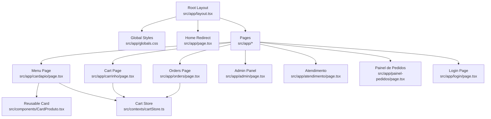
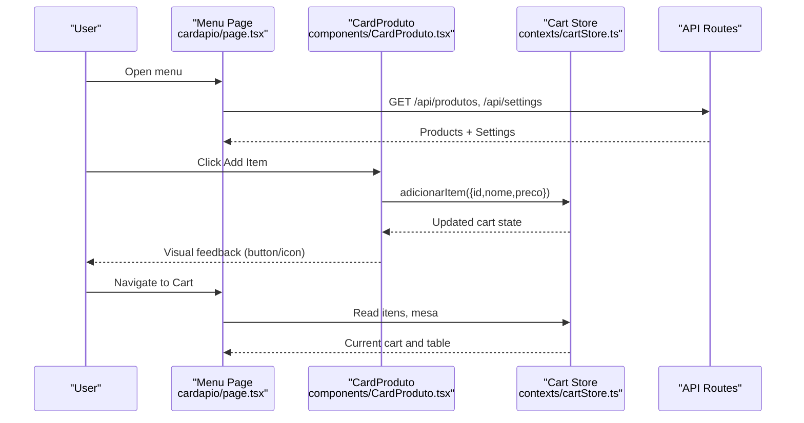
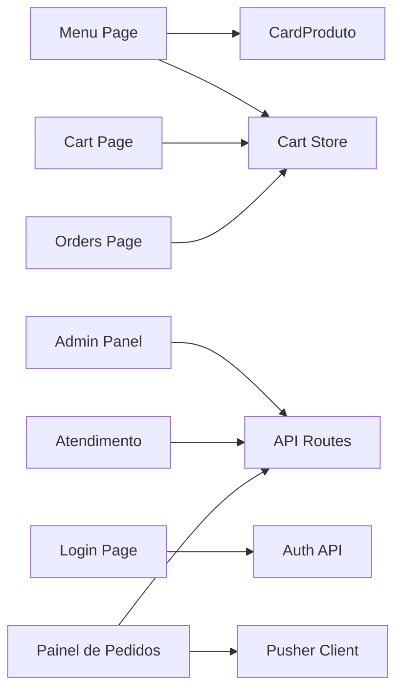

# Component Hierarchy & Structure

<cite>
**Referenced Files in This Document**
- [layout.tsx](file://src/app/layout.tsx)
- [page.tsx](file://src/app/page.tsx)
- [globals.css](file://src/app/globals.css)
- [cardapio/page.tsx](file://src/app/cardapio/page.tsx)
- [admin/page.tsx](file://src/app/admin/page.tsx)
- [login/page.tsx](file://src/app/login/page.tsx)
- [carrinho/page.tsx](file://src/app/carrinho/page.tsx)
- [atendimento/page.tsx](file://src/app/atendimento/page.tsx)
- [painel-pedidos/page.tsx](file://src/app/painel-pedidos/page.tsx)
- [orders/page.tsx](file://src/app/orders/page.tsx)
- [CardProduto.tsx](file://src/components/CardProduto.tsx)
- [cartStore.ts](file://src/contexts/cartStore.ts)
</cite>

## Table of Contents
1. [Introduction](#introduction)
2. [Project Structure](#project-structure)
3. [Core Components](#core-components)
4. [Architecture Overview](#architecture-overview)
5. [Detailed Component Analysis](#detailed-component-analysis)
6. [Dependency Analysis](#dependency-analysis)
7. [Performance Considerations](#performance-considerations)
8. [Troubleshooting Guide](#troubleshooting-guide)
9. [Conclusion](#conclusion)

## Introduction
This document explains the React component hierarchy and organization for the application. It covers the root layout with font configuration and global styling, page-level components (menu, admin panels, authentication), reusable UI components such as CardProduto, and how data flows between components via a shared cart store. It also outlines naming conventions, file organization strategies, and best practices to keep the architecture clean and maintainable.

## Project Structure
The project follows Next.js App Router conventions:
- src/app contains route-based pages and layouts.
- src/components holds reusable UI components.
- src/contexts provides global state (Zustand store).
- Global styles and theme tokens are defined in globals.css.

**Diagram sources**
- [layout.tsx:1-34](file://src/app/layout.tsx#L1-L34)
- [page.tsx:1-17](file://src/app/page.tsx#L1-L17)
- [cardapio/page.tsx:1-315](file://src/app/cardapio/page.tsx#L1-L315)
- [carrinho/page.tsx:1-99](file://src/app/carrinho/page.tsx#L1-L99)
- [orders/page.tsx:1-156](file://src/app/orders/page.tsx#L1-L156)
- [admin/page.tsx:1-383](file://src/app/admin/page.tsx#L1-L383)
- [atendimento/page.tsx:1-107](file://src/app/atendimento/page.tsx#L1-L107)
- [painel-pedidos/page.tsx:1-295](file://src/app/painel-pedidos/page.tsx#L1-L295)
- [login/page.tsx:1-160](file://src/app/login/page.tsx#L1-L160)
- [CardProduto.tsx:1-51](file://src/components/CardProduto.tsx#L1-L51)
- [cartStore.ts:1-69](file://src/contexts/cartStore.ts#L1-L69)

**Section sources**
- [layout.tsx:1-34](file://src/app/layout.tsx#L1-L34)
- [page.tsx:1-17](file://src/app/page.tsx#L1-L17)
- [globals.css:1-31](file://src/app/globals.css#L1-L31)

## Core Components
- Root Layout: Defines fonts (Geist Sans and Mono), metadata, and base HTML/body classes for consistent typography and layout across all pages.
- Global Styles: Tailwind theme variables and base body styles define colors, background, and utility classes like no-scrollbar and safe-bottom.
- Reusable UI: CardProduto is a presentational card that displays product details and integrates with the cart store to add items.
- Shared State: The cart store manages cart items, quantities, and table context, persisted to localStorage.

Key responsibilities:
- layout.tsx: Font setup, metadata, and global shell.
- globals.css: Theme tokens and base styles.
- CardProduto.tsx: Product card presentation and add-to-cart action.
- cartStore.ts: Centralized cart state and actions.

**Section sources**
- [layout.tsx:1-34](file://src/app/layout.tsx#L1-L34)
- [globals.css:1-31](file://src/app/globals.css#L1-L31)
- [CardProduto.tsx:1-51](file://src/components/CardProduto.tsx#L1-L51)
- [cartStore.ts:1-69](file://src/contexts/cartStore.ts#L1-L69)

## Architecture Overview
The app uses a client-side heavy approach within Next.js pages marked "use client". Data fetching occurs at the page level, while shared state lives in a Zustand store. Navigation is handled by Next.js router and search params. Real-time updates are supported via Pusher in specific panels.

**Diagram sources**
- [cardapio/page.tsx:1-315](file://src/app/cardapio/page.tsx#L1-L315)
- [CardProduto.tsx:1-51](file://src/components/CardProduto.tsx#L1-L51)
- [cartStore.ts:1-69](file://src/contexts/cartStore.ts#L1-L69)

## Detailed Component Analysis

### Root Layout and Global Styling
- Fonts: Geist Sans and Geist Mono are loaded and exposed as CSS variables for use throughout the app.
- Metadata: Title and description are set at the root.
- Body: Uses flex column layout and hides horizontal overflow; Tailwind utilities provide responsive behavior.
- Global CSS: Tailwind theme variables define brand colors and base styles; custom utilities include no-scrollbar and safe-bottom for mobile safe areas.

Best practices:
- Keep fonts and metadata centralized in the root layout.
- Define design tokens in globals.css to ensure consistency.

**Section sources**
- [layout.tsx:1-34](file://src/app/layout.tsx#L1-L34)
- [globals.css:1-31](file://src/app/globals.css#L1-L31)

### Home Redirect
- The root page redirects to the menu, optionally preserving a table parameter from search params.

Behavior:
- If a valid table param exists, redirect to the menu with that table.
- Otherwise, redirect to the default menu route.

**Section sources**
- [page.tsx:1-17](file://src/app/page.tsx#L1-L17)

### Menu Page (Cardápio Cliente)
Responsibilities:
- Fetch products and settings.
- Manage search, category filtering, and UI states.
- Validate table context from QR code.
- Compose CardProduto cards and integrate with the cart store.

Data flow:
- On mount, fetches product list and settings.
- Filters products based on active category or search term.
- Updates cart count and triggers bounce animation when items are added.

Composition:
- Renders a header with navigation and search toggle.
- Displays category chips and product grid using CardProduto.
- Provides bottom navigation for mobile.

State management:
- Local state for loading, categories, search, and UI toggles.
- Reads cart items and sets table context via the cart store.

**Section sources**
- [cardapio/page.tsx:1-315](file://src/app/cardapio/page.tsx#L1-L315)

### Reusable UI Component: CardProduto
Props interface:
- id: string
- nome: string
- descricao: string
- preco: number
- imagem?: string

Behavior:
- Formats price using Intl.NumberFormat for BRL.
- Adds item to cart via the cart store’s adicionarItem action.
- Displays an image with a fallback URL if none provided.

Accessibility:
- Includes aria-label for the add button.

Performance:
- Uses lazy loading for images.
- Minimal re-renders due to focused props and localized state.

**Section sources**
- [CardProduto.tsx:1-51](file://src/components/CardProduto.tsx#L1-L51)

### Cart Store (Shared State)
State shape:
- itens: array of { id, nome, preco, quantidade }
- mesa: string | null

Actions:
- adicionarItem: increments quantity if exists, else adds new item.
- removerItem: removes by id.
- alterarQuantidade: updates quantity with validation.
- limparCarrinho: clears all items.
- definirMesa: sets table context.

Persistence:
- Persisted under a named key to localStorage.

Usage patterns:
- Consumed by CardProduto, Cart Page, and Orders Page.

Complexity:
- O(n) operations for adding/removing items due to array scans.
- Suitable for small to medium-sized carts.

**Section sources**
- [cartStore.ts:1-69](file://src/contexts/cartStore.ts#L1-L69)

### Cart Page (Carrinho)
Responsibilities:
- Display cart items with quantity controls.
- Collect customer name and delivery preference.
- Submit order to the backend and persist order IDs locally.
- Enforce table context requirement.

Flow:
- Validates table context from QR code or stored value.
- Calculates totals and formats currency.
- Sends POST to /api/pedidos and navigates to orders page.

Error handling:
- Alerts for empty cart, missing customer name, and server errors.

**Section sources**
- [carrinho/page.tsx:1-99](file://src/app/carrinho/page.tsx#L1-L99)

### Orders Page (Meus Pedidos)
Responsibilities:
- Retrieve saved order IDs from localStorage.
- Fetch detailed order statuses via API.
- Allow cancellation and removal from local list.
- Poll periodically for status updates.

Flow:
- Loads initial orders and sets interval polling.
- Shows status badges and timestamps.
- Integrates with cart store for table context.

**Section sources**
- [orders/page.tsx:1-156](file://src/app/orders/page.tsx#L1-L156)

### Admin Panel (Gerenciar Cardápio)
Responsibilities:
- CRUD operations for products.
- Image upload integration.
- Category management.

Flow:
- Fetches product list on mount.
- Supports create/update/delete via API routes.
- Handles image uploads and previews.

Validation:
- Prevents saving during upload or with missing fields.

**Section sources**
- [admin/page.tsx:1-383](file://src/app/admin/page.tsx#L1-L383)

### Login Page (Authentication)
Responsibilities:
- PIN-based login and Google OAuth flow.
- Stores user info in localStorage.
- Redirects based on role.

Flow:
- Submits PIN to /api/auth/login.
- Optionally authenticates via Google and exchanges token.
- Persists user session and navigates to appropriate panel.

Error handling:
- Displays error messages and handles connection issues.

**Section sources**
- [login/page.tsx:1-160](file://src/app/login/page.tsx#L1-L160)

### Atendimento Page (Service Desk)
Responsibilities:
- Lists ready orders for delivery.
- Allows marking orders as delivered.
- Logout functionality.

Flow:
- Polls /api/pedidos every 5 seconds.
- Updates status via PATCH request.

**Section sources**
- [atendimento/page.tsx:1-107](file://src/app/atendimento/page.tsx#L1-L107)

### Painel de Pedidos (Kitchen Dashboard)
Responsibilities:
- Real-time order management with Pusher events.
- Status transitions: pending → preparing → ready → delivered.
- Sidebar navigation and logout.

Flow:
- Initial fetch of orders.
- Subscribes to Pusher channel for live updates.
- Updates statuses via PATCH requests.

**Section sources**
- [painel-pedidos/page.tsx:1-295](file://src/app/painel-pedidos/page.tsx#L1-L295)

### Component Composition Patterns
- Parent-child relationships:
  - Menu Page composes CardProduto multiple times.
  - Cart Page reads from cart store and renders item rows.
  - Orders Page reads from cart store and displays order cards.
- Data flow:
  - One-way data flow from stores/pages down to presentational components.
  - Actions dispatched from child components update shared state.

Naming conventions:
- PascalCase for components and interfaces.
- Descriptive names reflecting purpose (e.g., CardProduto, ConteudoCarrinho).
- File names match component names for clarity.

File organization:
- Route-based pages under src/app with clear separation of concerns.
- Reusable components under src/components.
- Global state under src/contexts.
- Utilities and libraries under src/lib.

Best practices:
- Keep components focused and single-purpose.
- Use TypeScript interfaces for props and state shapes.
- Centralize formatting and utilities where possible.
- Avoid prop drilling by leveraging context/store for shared state.

**Section sources**
- [cardapio/page.tsx:1-315](file://src/app/cardapio/page.tsx#L1-L315)
- [carrinho/page.tsx:1-99](file://src/app/carrinho/page.tsx#L1-L99)
- [orders/page.tsx:1-156](file://src/app/orders/page.tsx#L1-L156)
- [admin/page.tsx:1-383](file://src/app/admin/page.tsx#L1-L383)
- [login/page.tsx:1-160](file://src/app/login/page.tsx#L1-L160)
- [atendimento/page.tsx:1-107](file://src/app/atendimento/page.tsx#L1-L107)
- [painel-pedidos/page.tsx:1-295](file://src/app/painel-pedidos/page.tsx#L1-L295)
- [CardProduto.tsx:1-51](file://src/components/CardProduto.tsx#L1-L51)
- [cartStore.ts:1-69](file://src/contexts/cartStore.ts#L1-L69)

## Dependency Analysis
Component dependencies and interactions:
- Menu Page depends on CardProduto and cart store.
- Cart Page depends on cart store and API endpoints.
- Orders Page depends on cart store and API endpoints.
- Admin Panel depends on API endpoints for CRUD.
- Login Page depends on auth APIs and Firebase client.
- Atendimento and Painel de Pedidos depend on API and real-time signals.

**Diagram sources**
- [cardapio/page.tsx:1-315](file://src/app/cardapio/page.tsx#L1-L315)
- [carrinho/page.tsx:1-99](file://src/app/carrinho/page.tsx#L1-L99)
- [orders/page.tsx:1-156](file://src/app/orders/page.tsx#L1-L156)
- [admin/page.tsx:1-383](file://src/app/admin/page.tsx#L1-L383)
- [login/page.tsx:1-160](file://src/app/login/page.tsx#L1-L160)
- [atendimento/page.tsx:1-107](file://src/app/atendimento/page.tsx#L1-L107)
- [painel-pedidos/page.tsx:1-295](file://src/app/painel-pedidos/page.tsx#L1-L295)
- [CardProduto.tsx:1-51](file://src/components/CardProduto.tsx#L1-L51)
- [cartStore.ts:1-69](file://src/contexts/cartStore.ts#L1-L69)

**Section sources**
- [cardapio/page.tsx:1-315](file://src/app/cardapio/page.tsx#L1-L315)
- [carrinho/page.tsx:1-99](file://src/app/carrinho/page.tsx#L1-L99)
- [orders/page.tsx:1-156](file://src/app/orders/page.tsx#L1-L156)
- [admin/page.tsx:1-383](file://src/app/admin/page.tsx#L1-L383)
- [login/page.tsx:1-160](file://src/app/login/page.tsx#L1-L160)
- [atendimento/page.tsx:1-107](file://src/app/atendimento/page.tsx#L1-L107)
- [painel-pedidos/page.tsx:1-295](file://src/app/painel-pedidos/page.tsx#L1-L295)
- [CardProduto.tsx:1-51](file://src/components/CardProduto.tsx#L1-L51)
- [cartStore.ts:1-69](file://src/contexts/cartStore.ts#L1-L69)

## Performance Considerations
- Lazy image loading in CardProduto reduces initial payload.
- Cart store operations are O(n); consider indexing by id for large carts.
- Polling intervals in Orders and Atendimento should be tuned to balance freshness and network load.
- Use Suspense boundaries around async components to improve perceived performance.
- Debounce search input in Menu Page to reduce filtering overhead.

[No sources needed since this section provides general guidance]

## Troubleshooting Guide
Common issues and resolutions:
- Missing table context: Ensure QR code opens the menu with a valid table parameter; cart and orders require it.
- Empty cart submission: Validate non-empty cart and presence of customer name before submitting.
- Authentication failures: Check PIN validity and Google OAuth configuration; verify localStorage persistence.
- Real-time updates not appearing: Confirm Pusher subscription and channel binding in Painel de Pedidos.
- API errors: Inspect console logs and network responses; handle non-ok responses gracefully.

**Section sources**
- [carrinho/page.tsx:1-99](file://src/app/carrinho/page.tsx#L1-L99)
- [login/page.tsx:1-160](file://src/app/login/page.tsx#L1-L160)
- [painel-pedidos/page.tsx:1-295](file://src/app/painel-pedidos/page.tsx#L1-L295)

## Conclusion
The component hierarchy is organized around Next.js App Router pages with clear separation of concerns. The root layout centralizes fonts and global styles, while page components manage data fetching and composition. Reusable components like CardProduto encapsulate presentation logic and interact with a shared cart store for state management. Naming conventions and file organization promote readability and maintainability. Following the outlined best practices ensures a scalable and robust architecture.

[No sources needed since this section summarizes without analyzing specific files]