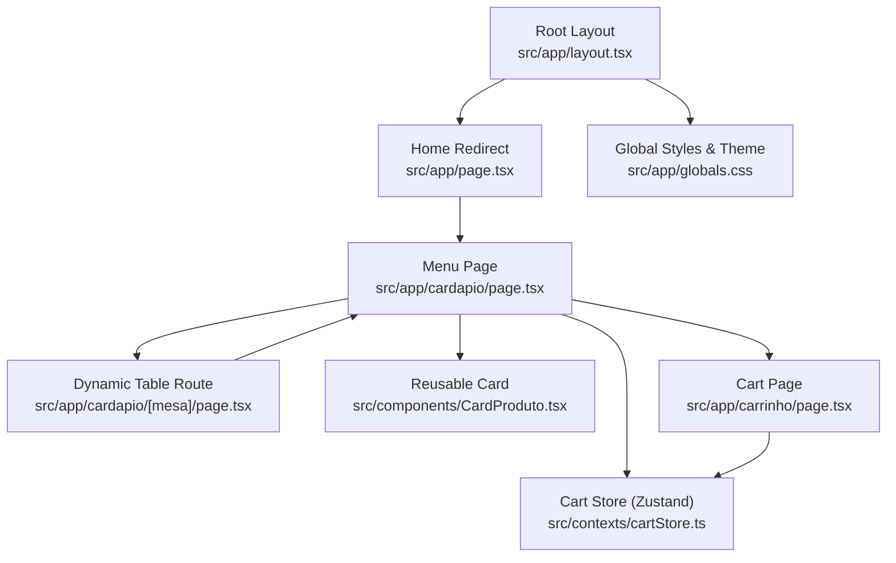
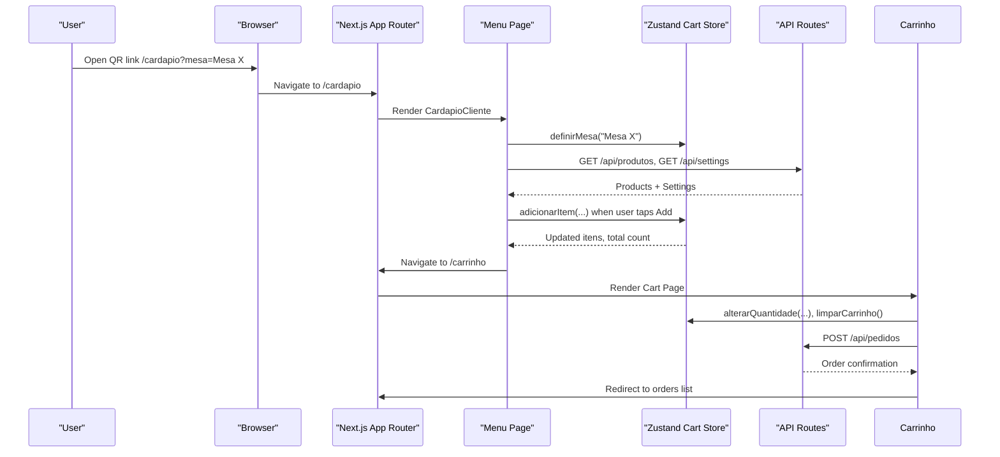
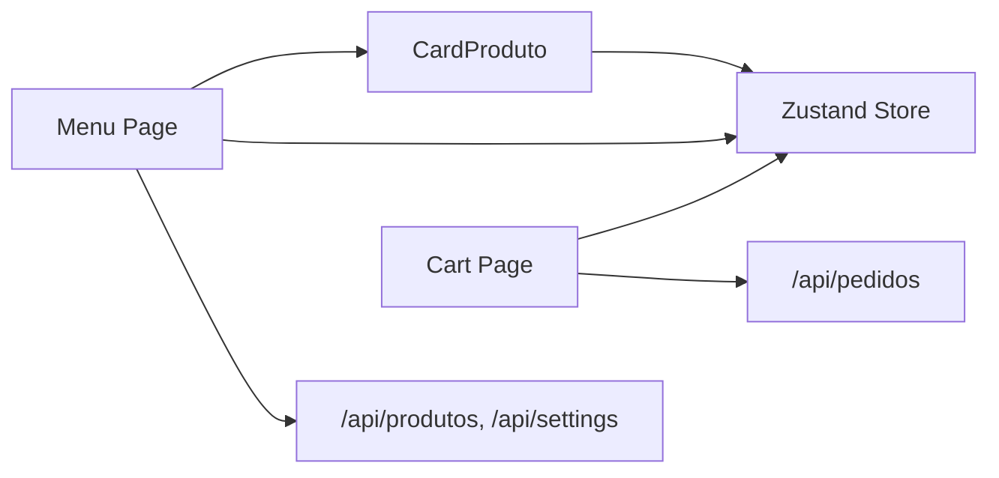

# Frontend Architecture

<cite>
**Referenced Files in This Document**
- [layout.tsx](file://src/app/layout.tsx)
- [page.tsx](file://src/app/page.tsx)
- [cardapio page.tsx](file://src/app/cardapio/page.tsx)
- [cardapio mesa route.tsx](file://src/app/cardapio/[mesa]/page.tsx)
- [carrinho page.tsx](file://src/app/carrinho/page.tsx)
- [CardProduto.tsx](file://src/components/CardProduto.tsx)
- [cartStore.ts](file://src/contexts/cartStore.ts)
- [globals.css](file://src/app/globals.css)
- [produtos-cache.ts](file://src/lib/produtos-cache.ts)
- [package.json](file://package.json)
</cite>

## Table of Contents
1. [Introduction](#introduction)
2. [Project Structure](#project-structure)
3. [Core Components](#core-components)
4. [Architecture Overview](#architecture-overview)
5. [Detailed Component Analysis](#detailed-component-analysis)
6. [Dependency Analysis](#dependency-analysis)
7. [Performance Considerations](#performance-considerations)
8. [Troubleshooting Guide](#troubleshooting-guide)
9. [Conclusion](#conclusion)

## Introduction
This document explains the React-based frontend architecture for a Next.js App Router application that provides a table-based digital menu and ordering experience. It covers the component hierarchy from root layout to pages and reusable UI elements, state management with Zustand for cart persistence and global state, routing structure including dynamic routes for tables, composition patterns to avoid prop drilling, performance optimizations, responsive design considerations, and accessibility practices.

## Project Structure
The application follows Next.js App Router conventions:
- Root layout defines global fonts, metadata, and base styles.
- Pages implement routes such as card menu, cart, and dynamic table routes.
- Shared UI components live under components.
- Global client-side state is centralized in a Zustand store.
- CSS variables and Tailwind theme are defined globally.

**Diagram sources**
- [layout.tsx:1-34](file://src/app/layout.tsx#L1-L34)
- [page.tsx:1-17](file://src/app/page.tsx#L1-L17)
- [cardapio page.tsx:1-315](file://src/app/cardapio/page.tsx#L1-L315)
- [cardapio mesa route.tsx:1-12](file://src/app/cardapio/[mesa]/page.tsx#L1-L12)
- [CardProduto.tsx:1-51](file://src/components/CardProduto.tsx#L1-L51)
- [cartStore.ts:1-69](file://src/contexts/cartStore.ts#L1-L69)
- [carrinho page.tsx:1-99](file://src/app/carrinho/page.tsx#L1-L99)
- [globals.css:1-31](file://src/app/globals.css#L1-L31)

**Section sources**
- [layout.tsx:1-34](file://src/app/layout.tsx#L1-L34)
- [page.tsx:1-17](file://src/app/page.tsx#L1-L17)
- [globals.css:1-31](file://src/app/globals.css#L1-L31)

## Core Components
- RootLayout: Provides global HTML attributes, fonts, and body container.
- Menu Page (CardapioCliente): Client component handling product fetching, search, categories, and navigation; renders CardProduto items.
- Dynamic Table Route: Validates table identifier and forwards to the shared menu view with table context.
- Cart Page: Manages quantity changes, order submission, and checkout flow using the cart store.
- CardProduto: Reusable product card that integrates with the cart store to add items.

Key responsibilities:
- Routing and redirects at the root level.
- Data fetching and filtering on the menu page.
- Centralized state via Zustand for cart items and table context.
- Accessible, responsive UI across devices.

**Section sources**
- [layout.tsx:1-34](file://src/app/layout.tsx#L1-L34)
- [cardapio page.tsx:1-315](file://src/app/cardapio/page.tsx#L1-L315)
- [cardapio mesa route.tsx:1-12](file://src/app/cardapio/[mesa]/page.tsx#L1-L12)
- [carrinho page.tsx:1-99](file://src/app/carrinho/page.tsx#L1-L99)
- [CardProduto.tsx:1-51](file://src/components/CardProduto.tsx#L1-L51)

## Architecture Overview
The frontend uses a layered approach:
- Presentation layer: Pages and components render UI and handle user interactions.
- State layer: Zustand store persists cart data and table context across sessions.
- Data layer: API calls fetch products and settings; server-side caching can be used for product lists.

**Diagram sources**
- [cardapio page.tsx:24-65](file://src/app/cardapio/page.tsx#L24-L65)
- [cardapio page.tsx:103-108](file://src/app/cardapio/page.tsx#L103-L108)
- [cardapio page.tsx:244-253](file://src/app/cardapio/page.tsx#L244-L253)
- [carrinho page.tsx:8-57](file://src/app/carrinho/page.tsx#L8-L57)
- [cartStore.ts:21-68](file://src/contexts/cartStore.ts#L21-L68)

## Detailed Component Analysis

### Root Layout and Global Styling
- RootLayout sets language, fonts, and minimal body styling to ensure consistent typography and layout.
- Global CSS defines Tailwind theme colors and utility classes like safe-area padding for mobile notches.

Best practices observed:
- Semantic HTML attributes (lang).
- Consistent color tokens via CSS variables.
- Safe area support for modern mobile devices.

**Section sources**
- [layout.tsx:1-34](file://src/app/layout.tsx#L1-L34)
- [globals.css:1-31](file://src/app/globals.css#L1-L31)

### Home Redirect
- The home route redirects to the menu or normalizes QR parameters into a canonical table route.

Routing behavior:
- If a table parameter exists, redirect to the menu with normalized query.
- Otherwise, redirect to the main menu.

**Section sources**
- [page.tsx:1-17](file://src/app/page.tsx#L1-L17)

### Menu Page (CardapioCliente)
Responsibilities:
- Fetches products and settings concurrently.
- Handles search and category filtering.
- Renders a responsive grid of CardProduto items.
- Integrates with the cart store to display totals and navigate to the cart.

State and effects:
- Uses local state for loading, search, and active category.
- Reads cart items and table context from Zustand.
- Normalizes and validates table identifiers.

Composition:
- Composes CardProduto for each item.
- Uses Suspense boundaries for graceful loading states.

Accessibility:
- Buttons include aria-labels for screen readers.
- Images have alt text derived from product names.

Responsive design:
- Mobile bottom navigation bar for quick access to menu, search, orders, and cart.
- Grid adapts from single column to multi-column based on viewport size.

**Section sources**
- [cardapio page.tsx:24-65](file://src/app/cardapio/page.tsx#L24-L65)
- [cardapio page.tsx:67-108](file://src/app/cardapio/page.tsx#L67-L108)
- [cardapio page.tsx:121-286](file://src/app/cardapio/page.tsx#L121-L286)

### Dynamic Table Route
- Validates the table segment against a pattern and returns a 404 if invalid.
- Passes validated table context to the shared menu component.

Benefits:
- Enforces URL schema consistency.
- Keeps shared logic in one place while supporting multiple entry points.

**Section sources**
- [cardapio mesa route.tsx:1-12](file://src/app/cardapio/[mesa]/page.tsx#L1-L12)

### Cart Page
Responsibilities:
- Displays current cart items, allows quantity adjustments, and clears the cart.
- Collects customer name and delivery preferences.
- Submits orders to the backend and navigates to order history.

Integration:
- Reads and updates Zustand store for cart operations.
- Uses router and search params to preserve table context.

Error handling:
- Validates inputs before submission.
- Shows alerts for errors and success messages.

**Section sources**
- [carrinho page.tsx:8-57](file://src/app/carrinho/page.tsx#L8-L57)
- [carrinho page.tsx:59-99](file://src/app/carrinho/page.tsx#L59-L99)

### Reusable Product Card (CardProduto)
Responsibilities:
- Displays product image, name, description, price, and an add-to-cart button.
- Formats currency using locale-aware formatting.
- Integrates directly with the cart store to add items.

Accessibility:
- Button includes descriptive aria-label for screen readers.
- Image alt text reflects product name.

Performance:
- Lazy loading for images to improve initial load times.

**Section sources**
- [CardProduto.tsx:1-51](file://src/components/CardProduto.tsx#L1-L51)

### Zustand Store (Cart Persistence and Global State)
State model:
- Items array with id, name, price, and quantity.
- Table context stored persistently.

Operations:
- Add item: increments quantity if existing, otherwise adds new item.
- Remove item: filters by id.
- Update quantity: supports zero or negative values to remove items.
- Clear cart: resets items.
- Set table: persists table context.

Persistence:
- Uses middleware to persist state to storage, ensuring cart survives refreshes.

Complexity:
- Add/remove/update operations are O(n) over items due to array scans.
- For large catalogs, consider indexing by id or using immutable maps for O(1) lookups.

**Section sources**
- [cartStore.ts:1-69](file://src/contexts/cartStore.ts#L1-L69)

## Dependency Analysis
Component relationships and data flows:
- Menu Page depends on:
  - CardProduto for rendering items.
  - Zustand store for cart state and table context.
  - API endpoints for products and settings.
- Cart Page depends on:
  - Zustand store for cart mutations.
  - API endpoint for order submission.
  - Router for navigation.

**Diagram sources**
- [cardapio page.tsx:24-65](file://src/app/cardapio/page.tsx#L24-L65)
- [CardProduto.tsx:1-51](file://src/components/CardProduto.tsx#L1-L51)
- [carrinho page.tsx:8-57](file://src/app/carrinho/page.tsx#L8-L57)
- [cartStore.ts:21-68](file://src/contexts/cartStore.ts#L21-L68)

**Section sources**
- [cardapio page.tsx:24-65](file://src/app/cardapio/page.tsx#L24-L65)
- [CardProduto.tsx:1-51](file://src/components/CardProduto.tsx#L1-L51)
- [carrinho page.tsx:8-57](file://src/app/carrinho/page.tsx#L8-L57)
- [cartStore.ts:21-68](file://src/contexts/cartStore.ts#L21-L68)

## Performance Considerations
- Concurrent data fetching: The menu page fetches products and settings in parallel to reduce latency.
- Server-side caching: Product listing utilities use caching with revalidation tags to minimize database hits.
- Image optimization: Product cards use lazy loading for images.
- Minimal re-renders: Zustand selectors subscribe only to needed slices of state (e.g., itens, mesa).
- Suspense boundaries: Provide fallbacks during async operations to improve perceived performance.

Recommendations:
- Consider memoizing expensive computations (e.g., filtered lists) with useMemo where appropriate.
- Use virtualization for very large product lists to maintain smooth scrolling.
- Debounce search input to reduce filter recalculations.

**Section sources**
- [cardapio page.tsx:52-65](file://src/app/cardapio/page.tsx#L52-L65)
- [produtos-cache.ts:1-22](file://src/lib/produtos-cache.ts#L1-L22)
- [CardProduto.tsx:25-30](file://src/components/CardProduto.tsx#L25-L30)

## Troubleshooting Guide
Common issues and resolutions:
- Invalid table context:
  - Ensure URLs follow the expected pattern; the dynamic route enforces validation and returns 404 for invalid segments.
- Empty cart submission:
  - The cart page validates that items exist before allowing order submission.
- Network errors:
  - Menu page catches fetch errors and gracefully falls back to empty product lists.
- Persistent state mismatches:
  - Zustand persists cart and table context; clear browser storage if state becomes corrupted.

Debugging tips:
- Check console logs for fetch errors.
- Verify API responses match expected shapes.
- Inspect Zustand state in development tools to confirm mutations.

**Section sources**
- [cardapio mesa route.tsx:4-10](file://src/app/cardapio/[mesa]/page.tsx#L4-L10)
- [carrinho page.tsx:26-57](file://src/app/carrinho/page.tsx#L26-L57)
- [cardapio page.tsx:52-65](file://src/app/cardapio/page.tsx#L52-L65)

## Conclusion
The frontend architecture leverages Next.js App Router for structured routing, Zustand for robust and persistent client-side state, and a clean component hierarchy centered around a reusable product card. The design emphasizes responsive layouts, accessibility, and performance through concurrent data fetching and caching strategies. This setup scales well for table-based ordering scenarios and provides a solid foundation for future enhancements such as advanced filtering, real-time updates, and richer analytics.