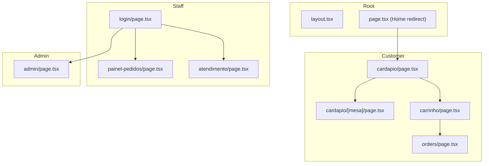
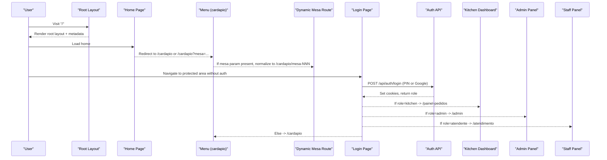
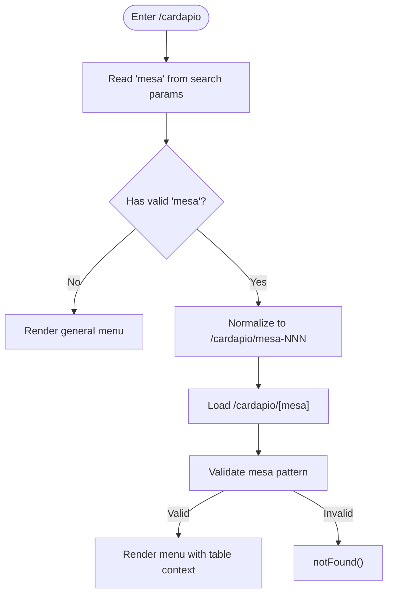
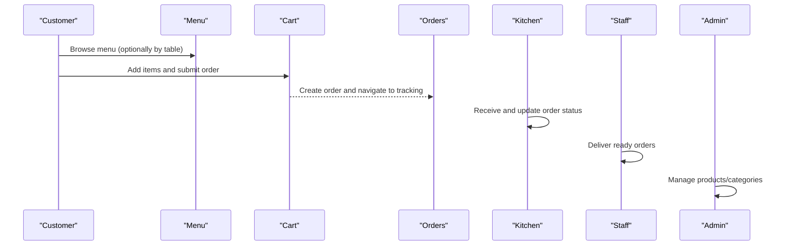
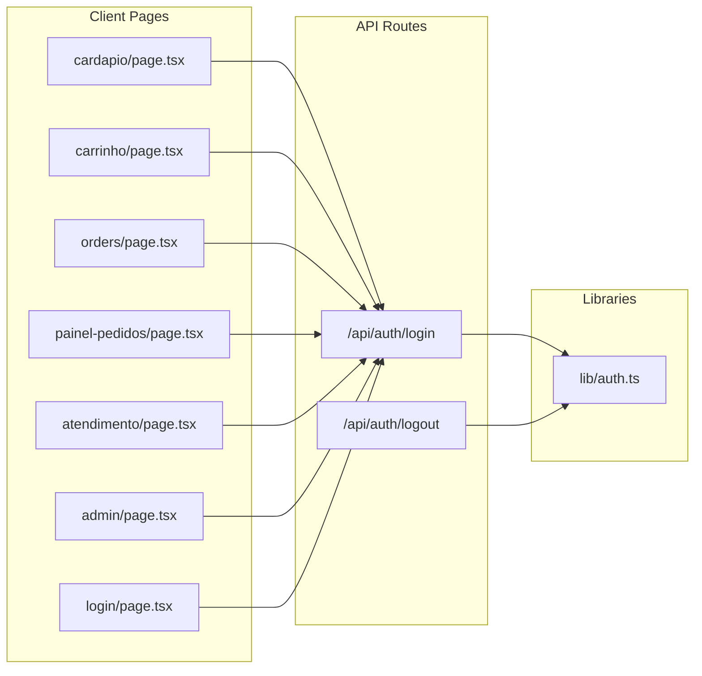

# Routing & Navigation

<cite>
**Referenced Files in This Document**
- [layout.tsx](file://src/app/layout.tsx)
- [page.tsx](file://src/app/page.tsx)
- [cardapio_page.tsx](file://src/app/cardapio/page.tsx)
- [mesa_dynamic_page.tsx](file://src/app/cardapio/[mesa]/page.tsx)
- [login_page.tsx](file://src/app/login/page.tsx)
- [admin_page.tsx](file://src/app/admin/page.tsx)
- [painel_pedidos_page.tsx](file://src/app/painel-pedidos/page.tsx)
- [atendimento_page.tsx](file://src/app/atendimento/page.tsx)
- [carrinho_page.tsx](file://src/app/carrinho/page.tsx)
- [orders_page.tsx](file://src/app/orders/page.tsx)
- [auth_lib.ts](file://src/lib/auth.ts)
- [api_auth_login_route.ts](file://src/app/api/auth/login/route.ts)
- [api_auth_logout_route.ts](file://src/app/api/auth/logout/route.ts)
</cite>

## Table of Contents
1. Introduction
2. Project Structure
3. Core Components
4. Architecture Overview
5. Detailed Component Analysis
6. Dependency Analysis
7. Performance Considerations
8. Troubleshooting Guide
9. Conclusion

## Introduction
This document explains the Next.js App Router routing and navigation system for a restaurant ordering application. It covers:
- Dynamic table-based routing using [mesa] parameters
- Protected routes and role-based guards (admin, kitchen, staff)
- Feature-based folder organization
- Navigation patterns, programmatic routing, and route transitions
- SEO considerations, per-route metadata, and loading states
- End-to-end navigation flow between customer interface, kitchen dashboard, and admin panels

## Project Structure
The app follows Next.js App Router conventions with feature-based folders under src/app:
- Public-facing menu and cart: cardapio, carrinho, orders
- Staff roles: painel-pedidos (kitchen), atendimento (staff), login
- Admin panel: admin
- API routes: api/*
- Root layout and global styles: layout.tsx, globals.css



**Diagram sources**
- [layout.tsx](file://src/app/layout.tsx)
- [page.tsx](file://src/app/page.tsx)
- [cardapio_page.tsx](file://src/app/cardapio/page.tsx)
- [mesa_dynamic_page.tsx](file://src/app/cardapio/[mesa]/page.tsx)
- [carrinho_page.tsx](file://src/app/carrinho/page.tsx)
- [orders_page.tsx](file://src/app/orders/page.tsx)
- [painel_pedidos_page.tsx](file://src/app/painel-pedidos/page.tsx)
- [atendimento_page.tsx](file://src/app/atendimento/page.tsx)
- [login_page.tsx](file://src/app/login/page.tsx)
- [admin_page.tsx](file://src/app/admin/page.tsx)

**Section sources**
- [layout.tsx](file://src/app/layout.tsx)
- [page.tsx](file://src/app/page.tsx)

## Core Components
- Root layout defines global fonts and site-wide metadata (title, description).
- Home page redirects to the menu, optionally preserving a mesa parameter.
- Menu pages implement dynamic routing for table-specific experiences.
- Login handles PIN and Google authentication, then navigates by role.
- Role-based dashboards: kitchen (painel-pedidos), staff (atendimento), admin (admin).
- Cart and order tracking pages provide customer flows.

Key responsibilities:
- Global metadata and HTML structure: layout.tsx
- Entry redirection and query handling: page.tsx
- Dynamic table routing and validation: cardapio/[mesa]/page.tsx
- Role-aware login and navigation: login/page.tsx
- Kitchen operations and real-time updates: painel-pedidos/page.tsx
- Staff delivery workflow: atendimento/page.tsx
- Admin product management: admin/page.tsx
- Customer cart and checkout: carrinho/page.tsx
- Order tracking: orders/page.tsx

**Section sources**
- [layout.tsx](file://src/app/layout.tsx)
- [page.tsx](file://src/app/page.tsx)
- [cardapio_page.tsx](file://src/app/cardapio/page.tsx)
- [mesa_dynamic_page.tsx](file://src/app/cardapio/[mesa]/page.tsx)
- [login_page.tsx](file://src/app/login/page.tsx)
- [painel_pedidos_page.tsx](file://src/app/painel-pedidos/page.tsx)
- [atendimento_page.tsx](file://src/app/atendimento/page.tsx)
- [admin_page.tsx](file://src/app/admin/page.tsx)
- [carrinho_page.tsx](file://src/app/carrinho/page.tsx)
- [orders_page.tsx](file://src/app/orders/page.tsx)

## Architecture Overview
The routing architecture combines server-side redirects, client-side navigation, and API-driven auth:



**Diagram sources**
- [layout.tsx](file://src/app/layout.tsx)
- [page.tsx](file://src/app/page.tsx)
- [cardapio_page.tsx](file://src/app/cardapio/page.tsx)
- [mesa_dynamic_page.tsx](file://src/app/cardapio/[mesa]/page.tsx)
- [login_page.tsx](file://src/app/login/page.tsx)
- [api_auth_login_route.ts](file://src/app/api/auth/login/route.ts)
- [painel_pedidos_page.tsx](file://src/app/painel-pedidos/page.tsx)
- [admin_page.tsx](file://src/app/admin/page.tsx)
- [atendimento_page.tsx](file://src/app/atendimento/page.tsx)

## Detailed Component Analysis

### Dynamic Table Routing ([mesa])
- The base menu page reads search params and normalizes a table identifier into a clean URL segment.
- The dynamic route validates the table ID format and renders the shared menu component with a formatted table name.
- Invalid table IDs trigger a not-found response.



**Diagram sources**
- [cardapio_page.tsx](file://src/app/cardapio/page.tsx)
- [mesa_dynamic_page.tsx](file://src/app/cardapio/[mesa]/page.tsx)

**Section sources**
- [cardapio_page.tsx](file://src/app/cardapio/page.tsx)
- [mesa_dynamic_page.tsx](file://src/app/cardapio/[mesa]/page.tsx)

### Protected Routes and Role-Based Guards
- Authentication is handled via PIN or Google OAuth through API endpoints that set secure cookies per role.
- Client-side login page persists user info locally and navigates based on role.
- Server-side helpers define role types and utilities to read/verify cookies and enforce access.

```mermaid
classDiagram
class AuthLib {
+Cargo
+CARGO_LABELS
+hashPin(pin) string
+verifyPin(pin, hash) boolean
+normalizeCargo(cargo) Cargo|null
+setAuthCookies(cargo) void
+clearAuthCookies() void
+getAuthRole() Cargo|null
+requireAuth(allowed) {role}|NextResponse
+requireAdmin() {role}|NextResponse
+requireKitchen() {role}|NextResponse
}
class LoginPage {
+handleLogin()
+handleGoogleLogin()
}
class AuthAPI {
+POST /api/auth/login()
+POST /api/auth/logout()
}
LoginPage --> AuthAPI : "calls"
AuthAPI --> AuthLib : "uses"
```

**Diagram sources**
- [auth_lib.ts](file://src/lib/auth.ts)
- [login_page.tsx](file://src/app/login/page.tsx)
- [api_auth_login_route.ts](file://src/app/api/auth/login/route.ts)
- [api_auth_logout_route.ts](file://src/app/api/auth/logout/route.ts)

**Section sources**
- [auth_lib.ts](file://src/lib/auth.ts)
- [login_page.tsx](file://src/app/login/page.tsx)
- [api_auth_login_route.ts](file://src/app/api/auth/login/route.ts)
- [api_auth_logout_route.ts](file://src/app/api/auth/logout/route.ts)

### Navigation Patterns and Programmatic Routing
- Link components are used for declarative navigation within menus and dashboards.
- useRouter().push and .replace are used for programmatic navigation after actions like login, order submission, or table normalization.
- Suspense boundaries wrap data-heavy pages to show loading states during route transitions.

Examples:
- Normalizing table URLs before rendering the dynamic route.
- Redirecting to role-specific dashboards after successful login.
- Navigating back to the menu or order tracking after checkout.

**Section sources**
- [cardapio_page.tsx](file://src/app/cardapio/page.tsx)
- [login_page.tsx](file://src/app/login/page.tsx)
- [carrinho_page.tsx](file://src/app/carrinho/page.tsx)
- [orders_page.tsx](file://src/app/orders/page.tsx)

### SEO Considerations and Metadata
- Root layout exports metadata for title and description, ensuring consistent SEO across all routes.
- Per-route metadata can be added in specific route files if needed; currently, global metadata is defined at the root.

**Section sources**
- [layout.tsx](file://src/app/layout.tsx)

### Loading States for Route Changes
- Suspense fallbacks are used in several pages to display loading indicators while data loads or during navigation.
- Examples include the menu, cart, and login pages.

**Section sources**
- [cardapio_page.tsx](file://src/app/cardapio/page.tsx)
- [carrinho_page.tsx](file://src/app/carrinho/page.tsx)
- [login_page.tsx](file://src/app/login/page.tsx)

### Navigation Flow Between Interfaces
- Customer interface:
  - Starts at the menu, optionally scoped to a table via QR code.
  - Adds items to the cart and submits an order.
  - Tracks order status in real time.
- Kitchen dashboard:
  - Displays new, preparing, and ready orders.
  - Updates statuses and receives real-time signals.
- Staff panel:
  - Shows ready orders for delivery.
  - Marks orders as delivered.
- Admin panel:
  - Manages products and categories.



**Diagram sources**
- [cardapio_page.tsx](file://src/app/cardapio/page.tsx)
- [carrinho_page.tsx](file://src/app/carrinho/page.tsx)
- [orders_page.tsx](file://src/app/orders/page.tsx)
- [painel_pedidos_page.tsx](file://src/app/painel-pedidos/page.tsx)
- [atendimento_page.tsx](file://src/app/atendimento/page.tsx)
- [admin_page.tsx](file://src/app/admin/page.tsx)

## Dependency Analysis
- Client components depend on Next.js navigation hooks and local state stores.
- API routes depend on database schemas and authentication utilities.
- Role checks rely on cookie-based session tokens created by the login endpoint.



**Diagram sources**
- [cardapio_page.tsx](file://src/app/cardapio/page.tsx)
- [carrinho_page.tsx](file://src/app/carrinho/page.tsx)
- [orders_page.tsx](file://src/app/orders/page.tsx)
- [painel_pedidos_page.tsx](file://src/app/painel-pedidos/page.tsx)
- [atendimento_page.tsx](file://src/app/atendimento/page.tsx)
- [admin_page.tsx](file://src/app/admin/page.tsx)
- [login_page.tsx](file://src/app/login/page.tsx)
- [api_auth_login_route.ts](file://src/app/api/auth/login/route.ts)
- [api_auth_logout_route.ts](file://src/app/api/auth/logout/route.ts)
- [auth_lib.ts](file://src/lib/auth.ts)

**Section sources**
- [auth_lib.ts](file://src/lib/auth.ts)
- [api_auth_login_route.ts](file://src/app/api/auth/login/route.ts)
- [api_auth_logout_route.ts](file://src/app/api/auth/logout/route.ts)

## Performance Considerations
- Use Suspense boundaries around data-heavy pages to improve perceived performance during route changes.
- Prefer router.replace for non-history-affecting transitions (e.g., normalizing table URLs).
- Minimize re-renders by keeping UI state local and fetching data only when necessary.
- Ensure images and assets are optimized; configure remote image domains where applicable.

[No sources needed since this section provides general guidance]

## Troubleshooting Guide
Common issues and resolutions:
- Invalid table URL: Ensure the mesa parameter matches the expected pattern; invalid values will trigger not found.
- Unauthorized access: Verify login succeeded and cookies were set; check role-based redirects after login.
- Rate limiting on login: Excessive failed attempts may trigger temporary blocks; wait and retry.
- Real-time updates: Confirm WebSocket channels are subscribed and events are bound correctly in dashboards.

**Section sources**
- [mesa_dynamic_page.tsx](file://src/app/cardapio/[mesa]/page.tsx)
- [login_page.tsx](file://src/app/login/page.tsx)
- [api_auth_login_route.ts](file://src/app/api/auth/login/route.ts)
- [painel_pedidos_page.tsx](file://src/app/painel-pedidos/page.tsx)

## Conclusion
The routing and navigation system leverages Next.js App Router features to deliver a robust, role-aware experience:
- Dynamic table routing ensures personalized menus.
- Role-based guards protect sensitive areas.
- Clear navigation patterns and loading states enhance usability.
- Centralized metadata supports SEO consistency.
This structure scales well for additional features and roles while maintaining clarity and performance.