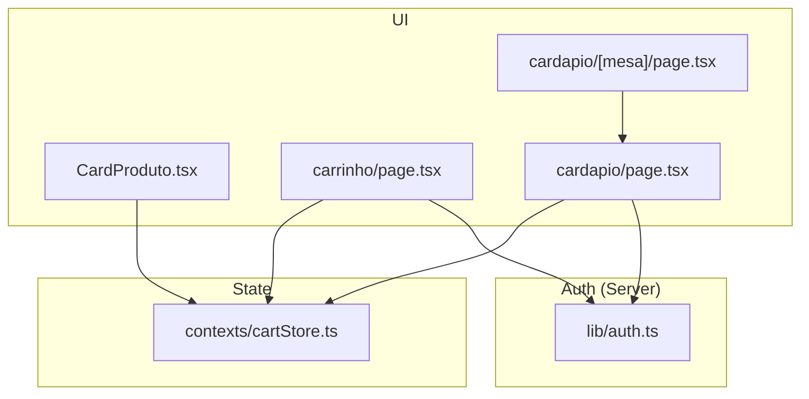
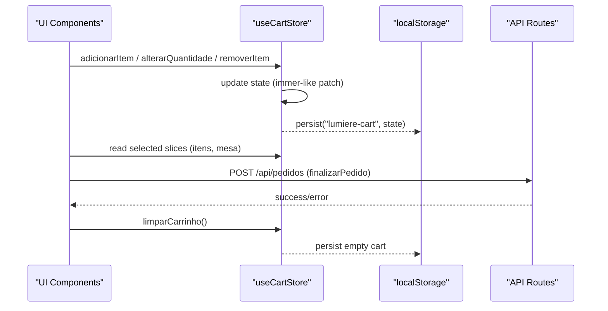
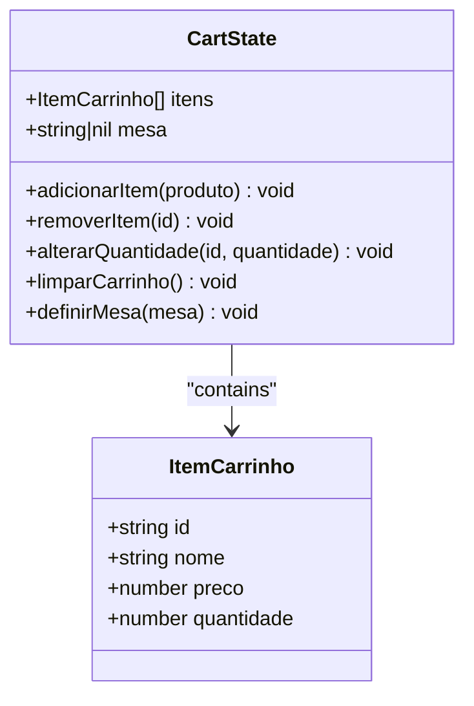
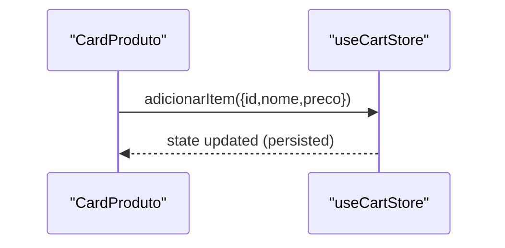
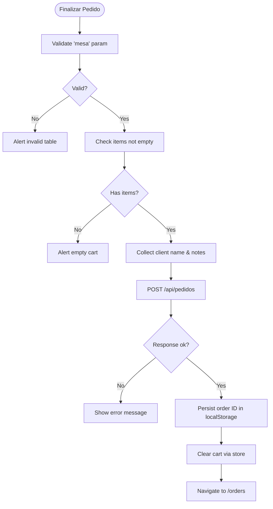
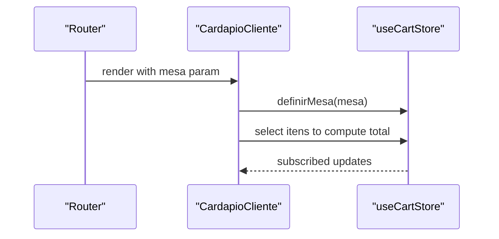
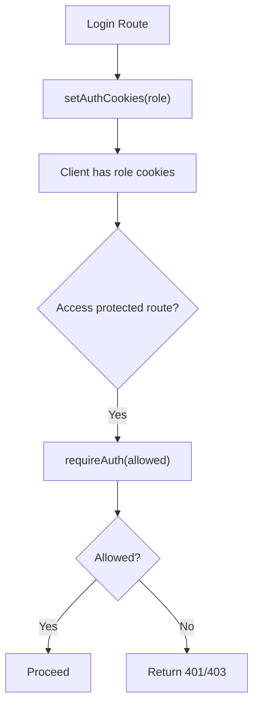
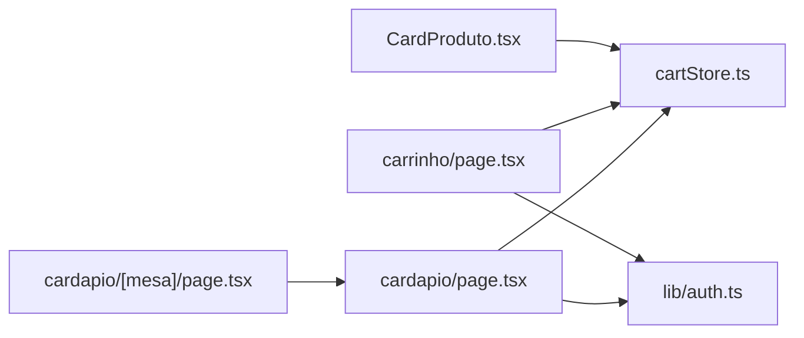

# State Management with Zustand

<cite>
**Referenced Files in This Document**
- [cartStore.ts](file://src/contexts/cartStore.ts)
- [CardProduto.tsx](file://src/components/CardProduto.tsx)
- [page.tsx (Carrinho)](file://src/app/carrinho/page.tsx)
- [page.tsx (Cardápio)](file://src/app/cardapio/page.tsx)
- [page.tsx (Cardápio por Mesa)](file://src/app/cardapio/[mesa]/page.tsx)
- [auth.ts](file://src/lib/auth.ts)
</cite>

## Table of Contents
1. [Introduction](#introduction)
2. [Project Structure](#project-structure)
3. [Core Components](#core-components)
4. [Architecture Overview](#architecture-overview)
5. [Detailed Component Analysis](#detailed-component-analysis)
6. [Dependency Analysis](#dependency-analysis)
7. [Performance Considerations](#performance-considerations)
8. [Troubleshooting Guide](#troubleshooting-guide)
9. [Conclusion](#conclusion)
10. [Appendices](#appendices)

## Introduction
This document explains the state management implementation using Zustand for cart persistence and global state, alongside authentication state handling via cookies. It covers the cart store architecture (item addition/removal, quantity management, table association), persistence strategies using localStorage, synchronization across components, selector patterns, performance optimizations, debugging approaches, migration strategies, and testing methodologies for stateful components.

## Project Structure
The state management is centered around a single Zustand store for the cart and a server-side authentication utility that manages roles and permissions through cookies. The UI consumes the store via React hooks and selectors to keep re-renders minimal.

**Diagram sources**
- [cartStore.ts:1-69](file://src/contexts/cartStore.ts#L1-L69)
- [CardProduto.tsx:1-51](file://src/components/CardProduto.tsx#L1-L51)
- [page.tsx (Carrinho):1-99](file://src/app/carrinho/page.tsx#L1-L99)
- [page.tsx (Cardápio):1-315](file://src/app/cardapio/page.tsx#L1-L315)
- [page.tsx (Cardápio por Mesa):1-12](file://src/app/cardapio/[mesa]/page.tsx#L1-L12)
- [auth.ts:1-82](file://src/lib/auth.ts#L1-L82)

**Section sources**
- [cartStore.ts:1-69](file://src/contexts/cartStore.ts#L1-L69)
- [CardProduto.tsx:1-51](file://src/components/CardProduto.tsx#L1-L51)
- [page.tsx (Carrinho):1-99](file://src/app/carrinho/page.tsx#L1-L99)
- [page.tsx (Cardápio):1-315](file://src/app/cardapio/page.tsx#L1-L315)
- [page.tsx (Cardápio por Mesa):1-12](file://src/app/cardapio/[mesa]/page.tsx#L1-L12)
- [auth.ts:1-82](file://src/lib/auth.ts#L1-L82)

## Core Components
- Cart Store (Zustand + persist middleware)
  - State fields: itens (array), mesa (string | null)
  - Actions: adicionarItem, removerItem, alterarQuantidade, limparCarrinho, definirMesa
  - Persistence key: "lumiere-cart"
- Authentication utilities (server-side)
  - Roles: admin, cozinha, atendente
  - Cookie-based session flags per role
  - Helpers: setAuthCookies, clearAuthCookies, getAuthRole, requireAuth, requireAdmin, requireKitchen

Key responsibilities:
- Cart store encapsulates all mutation logic and persists changes to localStorage automatically.
- Auth utilities manage role-based access control by reading/writing cookies on the server.

**Section sources**
- [cartStore.ts:1-69](file://src/contexts/cartStore.ts#L1-L69)
- [auth.ts:1-82](file://src/lib/auth.ts#L1-L82)

## Architecture Overview
The application uses a unidirectional data flow:
- UI components dispatch actions to the Zustand store.
- The store updates its internal state and persists it to localStorage.
- Components subscribe only to the parts of state they need via selectors.
- Server-side auth functions enforce permissions based on cookies.

**Diagram sources**
- [cartStore.ts:21-68](file://src/contexts/cartStore.ts#L21-L68)
- [page.tsx (Carrinho):26-57](file://src/app/carrinho/page.tsx#L26-L57)

## Detailed Component Analysis

### Cart Store Architecture
- Data model:
  - ItemCarrinho: id, nome, preco, quantidade
  - CartState: itens[], mesa
- Mutations:
  - adicionarItem: merges if item exists; otherwise appends with quantity 1
  - removerItem: filters out by id
  - alterarQuantidade: removes item when quantity <= 0; otherwise updates quantity
  - limparCarrinho: resets itens to []
  - definirMesa: sets mesa string or null
- Persistence:
  - Uses zustand/middleware persist with name "lumiere-cart"
  - Automatically serializes/deserializes state to localStorage

**Diagram sources**
- [cartStore.ts:4-19](file://src/contexts/cartStore.ts#L4-L19)
- [cartStore.ts:21-68](file://src/contexts/cartStore.ts#L21-L68)

**Section sources**
- [cartStore.ts:1-69](file://src/contexts/cartStore.ts#L1-L69)

### Card Produto Component (Add to Cart)
- Subscribes to adicionarItem via selector
- On click, calls adicionarItem with product payload
- No direct state mutations; relies on store actions

**Diagram sources**
- [CardProduto.tsx:14-45](file://src/components/CardProduto.tsx#L14-L45)
- [cartStore.ts:27-44](file://src/contexts/cartStore.ts#L27-L44)

**Section sources**
- [CardProduto.tsx:1-51](file://src/components/CardProduto.tsx#L1-L51)
- [cartStore.ts:27-44](file://src/contexts/cartStore.ts#L27-L44)

### Carrinho Page (Checkout Flow)
- Reads itens and mesa from store
- Validates table parameter from URL vs stored mesa
- Computes totals and formats currency
- Sends order to API and persists order IDs locally
- Clears cart on success and navigates to orders page

**Diagram sources**
- [page.tsx (Carrinho):26-57](file://src/app/carrinho/page.tsx#L26-L57)
- [cartStore.ts:63-64](file://src/contexts/cartStore.ts#L63-L64)

**Section sources**
- [page.tsx (Carrinho):1-99](file://src/app/carrinho/page.tsx#L1-L99)
- [cartStore.ts:63-64](file://src/contexts/cartStore.ts#L63-L64)

### Cardápio Pages (Menu and Table Context)
- Sets mesa in store when accessed via QR code path
- Displays total items count in header and bottom nav
- Uses selectors to minimize re-renders

**Diagram sources**
- [page.tsx (Cardápio):24-42](file://src/app/cardapio/page.tsx#L24-L42)
- [page.tsx (Cardápio por Mesa):4-11](file://src/app/cardapio/[mesa]/page.tsx#L4-L11)
- [cartStore.ts:64](file://src/contexts/cartStore.ts#L64)

**Section sources**
- [page.tsx (Cardápio):1-315](file://src/app/cardapio/page.tsx#L1-L315)
- [page.tsx (Cardápio por Mesa):1-12](file://src/app/cardapio/[mesa]/page.tsx#L1-L12)

### Authentication State Management
- Role types: admin, cozinha, atendente
- Cookies: auth_admin, auth_cozinha, auth_atendente
- Functions:
  - setAuthCookies(cargo): sets cookie flag for role
  - clearAuthCookies(): deletes all role cookies
  - getAuthRole(): returns current role or null
  - requireAuth(allowed): enforces allowed roles
  - requireAdmin(), requireKitchen(): convenience wrappers

**Diagram sources**
- [auth.ts:39-82](file://src/lib/auth.ts#L39-L82)

**Section sources**
- [auth.ts:1-82](file://src/lib/auth.ts#L1-L82)

## Dependency Analysis
- UI components depend on useCartStore for state and actions
- Cart store depends on zustand and zustand/middleware/persist
- Auth utilities depend on Next.js cookies and NextResponse
- No circular dependencies observed between store and UI consumers

**Diagram sources**
- [CardProduto.tsx:1-51](file://src/components/CardProduto.tsx#L1-L51)
- [cartStore.ts:1-69](file://src/contexts/cartStore.ts#L1-L69)
- [page.tsx (Carrinho):1-99](file://src/app/carrinho/page.tsx#L1-L99)
- [page.tsx (Cardápio):1-315](file://src/app/cardapio/page.tsx#L1-L315)
- [page.tsx (Cardápio por Mesa):1-12](file://src/app/cardapio/[mesa]/page.tsx#L1-L12)
- [auth.ts:1-82](file://src/lib/auth.ts#L1-L82)

**Section sources**
- [cartStore.ts:1-69](file://src/contexts/cartStore.ts#L1-L69)
- [auth.ts:1-82](file://src/lib/auth.ts#L1-L82)

## Performance Considerations
- Selectors:
  - Use precise selectors to avoid unnecessary re-renders (e.g., selecting apenas itens or mesa)
  - Compute derived values like total quantity inside components using selectors
- Immutability:
  - Zustand’s set function creates minimal patches; ensure actions return new objects where needed
- Persistence overhead:
  - Persist middleware serializes state on every change; consider debouncing heavy operations if needed
- Memoization:
  - Avoid recomputing formatted prices frequently; memoize formatting where appropriate
- Network requests:
  - Cache menu data and settings to reduce repeated fetches

[No sources needed since this section provides general guidance]

## Troubleshooting Guide
- Cart not persisting:
  - Verify browser localStorage contains key "lumiere-cart"
  - Ensure no ad blockers are interfering with localStorage
- Table context lost after navigation:
  - Confirm definirMesa is called when entering cardápio via QR code
  - Validate URL pattern matches expected format
- Order submission errors:
  - Check API response status and error messages
  - Validate required fields (client name, valid table)
- Authentication issues:
  - Inspect cookies for presence of auth_* flags
  - Ensure secure cookie settings match environment (production vs development)

**Section sources**
- [page.tsx (Carrinho):26-57](file://src/app/carrinho/page.tsx#L26-L57)
- [auth.ts:39-82](file://src/lib/auth.ts#L39-L82)

## Conclusion
The Zustand-based cart store provides a clean, persistent, and performant solution for managing shopping cart state across the application. Combined with server-side authentication utilities, it enables robust role-based access control. By leveraging selectors, immutable updates, and middleware persistence, the system maintains high performance while ensuring data consistency across components and sessions.

[No sources needed since this section summarizes without analyzing specific files]

## Appendices

### State Selector Patterns
- Prefer granular selectors:
  - const itens = useCartStore((state) => state.itens);
  - const mesa = useCartStore((state) => state.mesa);
- Avoid selecting entire state object to prevent unnecessary re-renders

**Section sources**
- [page.tsx (Carrinho):11-13](file://src/app/carrinho/page.tsx#L11-L13)
- [page.tsx (Cardápio):34-36](file://src/app/cardapio/page.tsx#L34-L36)

### Debugging Approaches
- Enable Zustand devtools in development:
  - Import devtools middleware and wrap store creation
- Log state changes during development:
  - Add console.log in critical actions temporarily
- Inspect localStorage:
  - Check "lumiere-cart" key content in browser DevTools

[No sources needed since this section provides general guidance]

### State Migration Strategies
- Version the persisted state:
  - Add version field to state structure
  - Implement migration function in persist config to transform old states
- Backward compatibility:
  - Handle missing fields gracefully during deserialization
- Testing migrations:
  - Write unit tests for migration functions with sample payloads

[No sources needed since this section provides general guidance]

### Testing Methodologies for Stateful Components
- Mock the Zustand store:
  - Create test-specific store instances with initial state
- Test component interactions:
  - Simulate user actions (click add/remove) and verify state changes
- Test persistence behavior:
  - Mock localStorage and verify serialization/deserialization
- Test authentication flows:
  - Mock cookie responses and verify authorization logic

[No sources needed since this section provides general guidance]