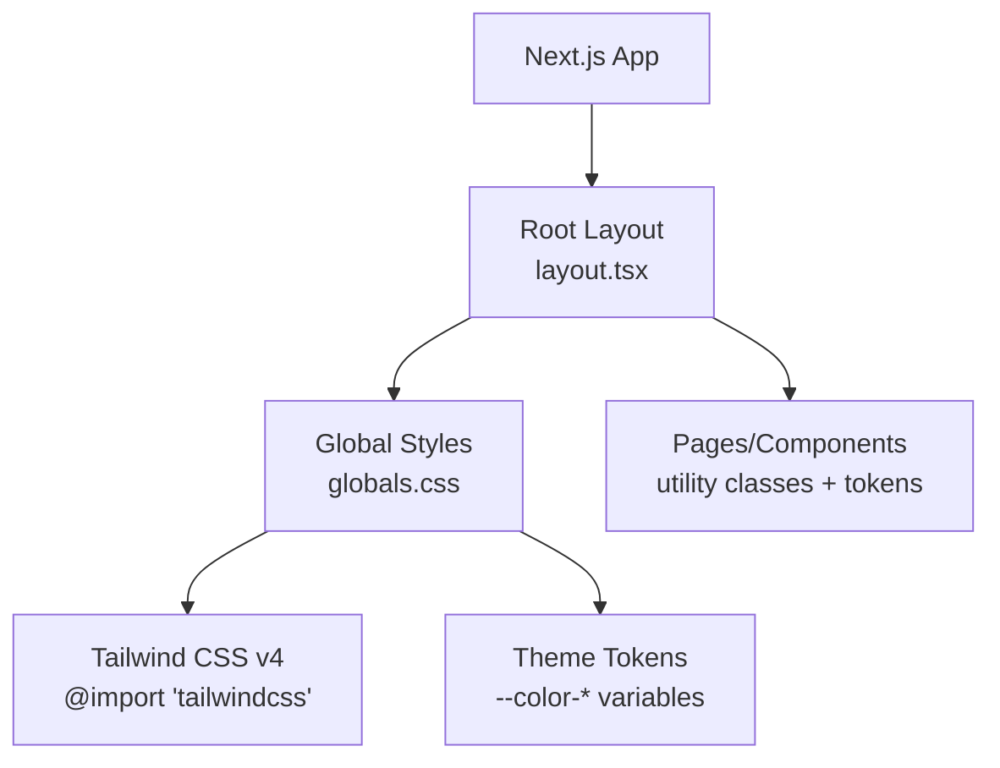
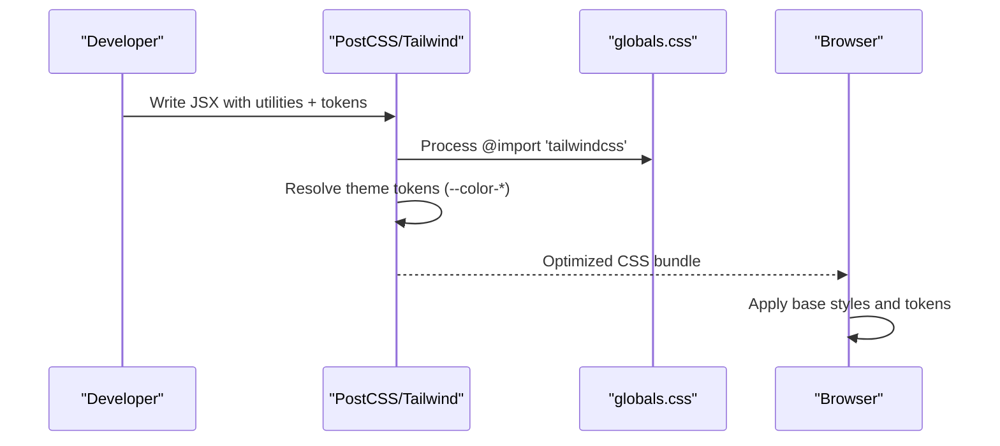
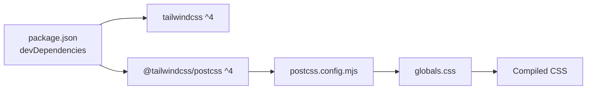

# Styling & Theming

<cite>
**Referenced Files in This Document**
- [globals.css](file://src/app/globals.css)
- [layout.tsx](file://src/app/layout.tsx)
- [postcss.config.mjs](file://postcss.config.mjs)
- [package.json](file://package.json)
- [next.config.ts](file://next.config.ts)
- [CardProduto.tsx](file://src/components/CardProduto.tsx)
- [page.tsx (menu)](file://src/app/cardapio/page.tsx)
- [page.tsx (cart)](file://src/app/carrinho/page.tsx)
</cite>

## Table of Contents
1. Introduction
2. Project Structure
3. Core Components
4. Architecture Overview
5. Detailed Component Analysis
6. Dependency Analysis
7. Performance Considerations
8. Troubleshooting Guide
9. Conclusion

## Introduction
This document explains the styling and theming system for a Next.js application built with Tailwind CSS v4. It covers global CSS setup, custom theme tokens, responsive design patterns, utility-first usage, accessibility considerations, performance optimizations, and cross-browser compatibility strategies. The project uses a mobile-first approach with consistent brand colors and typography powered by Geist fonts.

## Project Structure
The styling system is centered around:
- A single global stylesheet that imports Tailwind and defines theme tokens via CSS variables.
- A root layout that injects font variables into the HTML element and applies base styles.
- PostCSS configuration to enable Tailwind processing.
- Pages and components styled exclusively with Tailwind utility classes and the custom theme tokens.

**Diagram sources**
- [layout.tsx:1-34](file://src/app/layout.tsx#L1-L34)
- [globals.css:1-31](file://src/app/globals.css#L1-L31)

**Section sources**
- [layout.tsx:1-34](file://src/app/layout.tsx#L1-L34)
- [globals.css:1-31](file://src/app/globals.css#L1-L31)
- [postcss.config.mjs:1-8](file://postcss.config.mjs#L1-L8)
- [package.json:17-43](file://package.json#L17-L43)

## Core Components
- Global theme tokens: Brand colors are exposed as CSS variables under the color namespace, enabling consistent use across components.
- Base body styles: Background and text colors are applied globally; horizontal overflow is hidden to prevent accidental scrollbars.
- Utility helpers: A no-scrollbar helper and safe-area padding for modern mobile devices.
- Typography: Geist Sans and Geist Mono are loaded via next/font and injected as CSS variables on the root element.

Key implementation references:
- Theme tokens and base styles: [globals.css:3-18](file://src/app/globals.css#L3-L18)
- Helpers: [globals.css:20-30](file://src/app/globals.css#L20-L30)
- Font injection: [layout.tsx:5-13](file://src/app/layout.tsx#L5-L13), [layout.tsx:26-30](file://src/app/layout.tsx#L26-L30)

**Section sources**
- [globals.css:3-30](file://src/app/globals.css#L3-L30)
- [layout.tsx:5-30](file://src/app/layout.tsx#L5-L30)

## Architecture Overview
The styling pipeline integrates Tailwind CSS v4 through PostCSS and exposes a small set of semantic tokens for brand consistency. Components compose these tokens with utility classes to achieve responsive layouts without writing custom CSS.

**Diagram sources**
- [postcss.config.mjs:1-8](file://postcss.config.mjs#L1-L8)
- [globals.css:1-18](file://src/app/globals.css#L1-L18)

## Detailed Component Analysis

### Global CSS and Theme Tokens
- Custom color tokens are defined using CSS variables under the color namespace. These are consumed throughout the app via Tailwind’s arbitrary value syntax or direct class names derived from the token names.
- Body background and text colors are set once at the root level to ensure consistency.
- Cross-browser scrollbar hiding and safe-area support improve mobile UX.

References:
- Token definitions and base styles: [globals.css:3-18](file://src/app/globals.css#L3-L18)
- Scrollbar and safe-area helpers: [globals.css:20-30](file://src/app/globals.css#L20-L30)

**Section sources**
- [globals.css:3-30](file://src/app/globals.css#L3-L30)

### Typography and Fonts
- Geist Sans and Geist Mono are imported from next/font/google and attached as CSS variables to the root element.
- The html element receives both font variables plus utility classes for full-height layout and antialiasing.

References:
- Font loading and variable assignment: [layout.tsx:5-13](file://src/app/layout.tsx#L5-L13)
- Root element usage: [layout.tsx:26-30](file://src/app/layout.tsx#L26-L30)

**Section sources**
- [layout.tsx:5-13](file://src/app/layout.tsx#L5-L13)
- [layout.tsx:26-30](file://src/app/layout.tsx#L26-L30)

### Responsive Design Patterns
- Mobile-first layout: Components start with base styles and scale up using sm:, md:, lg:, xl: breakpoints.
- Grid and spacing adapt per screen size to maintain readability and touch targets.
- Sticky headers and bottom navigation adjust visibility based on viewport width.

Examples in code:
- Menu page grid and header adjustments: [page.tsx (menu):121-254](file://src/app/cardapio/page.tsx#L121-L254)
- Bottom navigation and safe area: [page.tsx (menu):258-284](file://src/app/cardapio/page.tsx#L258-L284)

**Section sources**
- [page.tsx (menu):121-284](file://src/app/cardapio/page.tsx#L121-L284)

### Component-Specific Styling: Product Card
- Uses brand tokens for borders and text colors.
- Responsive image container and typography scaling.
- Accessible button with aria-label and focus behavior via default browser styles.

References:
- Card structure and utilities: [CardProduto.tsx:22-48](file://src/components/CardProduto.tsx#L22-L48)

**Section sources**
- [CardProduto.tsx:22-48](file://src/components/CardProduto.tsx#L22-L48)

### Cart Page Styling
- Consistent use of tokens for backgrounds, borders, and text.
- Responsive form fields and action buttons.
- Fixed bottom bar with safe-area padding for iOS devices.

References:
- Layout and tokens: [page.tsx (cart):63-86](file://src/app/carrinho/page.tsx#L63-L86)

**Section sources**
- [page.tsx (cart):63-86](file://src/app/carrinho/page.tsx#L63-L86)

### Accessibility Highlights
- Meaningful alt text on images.
- Descriptive aria-labels on interactive elements.
- Focus states rely on default browser outlines; consider adding visible focus rings if needed.

References:
- Image alt and button aria-label: [CardProduto.tsx:25-43](file://src/components/CardProduto.tsx#L25-L43)

**Section sources**
- [CardProduto.tsx:25-43](file://src/components/CardProduto.tsx#L25-L43)

## Dependency Analysis
Tailwind CSS v4 is integrated via PostCSS. The build processes globals.css, resolves theme tokens, and outputs optimized CSS.

**Diagram sources**
- [package.json:31-43](file://package.json#L31-L43)
- [postcss.config.mjs:1-8](file://postcss.config.mjs#L1-L8)
- [globals.css:1-3](file://src/app/globals.css#L1-L3)

**Section sources**
- [package.json:31-43](file://package.json#L31-L43)
- [postcss.config.mjs:1-8](file://postcss.config.mjs#L1-L8)
- [globals.css:1-3](file://src/app/globals.css#L1-L3)

## Performance Considerations
- Use Tailwind’s utility-first approach to avoid large custom CSS files; only used utilities are included in the final bundle.
- Prefer CSS variables for theme tokens to minimize duplication and enable runtime overrides if needed.
- Optimize images via Next.js configuration to serve modern formats (AVIF/WebP) where supported.
- Keep global CSS minimal; move component-specific styles to utilities whenever possible.

References:
- Image optimization settings: [next.config.ts:3-11](file://next.config.ts#L3-L11)

[No sources needed since this section provides general guidance]

## Troubleshooting Guide
- Colors not applying: Ensure theme tokens are defined in globals.css and referenced correctly in components. Verify that Tailwind is processed by PostCSS.
- Scrollbar issues on mobile: Use the provided no-scrollbar helper for horizontal lists; confirm safe-area padding is applied where needed.
- Font not loading: Confirm font variables are attached to the html element in the root layout and that the font subsets include your language.

**Section sources**
- [globals.css:3-30](file://src/app/globals.css#L3-L30)
- [layout.tsx:5-30](file://src/app/layout.tsx#L5-L30)

## Conclusion
The styling system leverages Tailwind CSS v4 with a small, focused set of custom theme tokens and a clean global CSS layer. Components are styled primarily with utility classes, ensuring consistency, responsiveness, and performance. The approach supports accessibility and cross-browser compatibility while keeping the codebase maintainable and scalable.