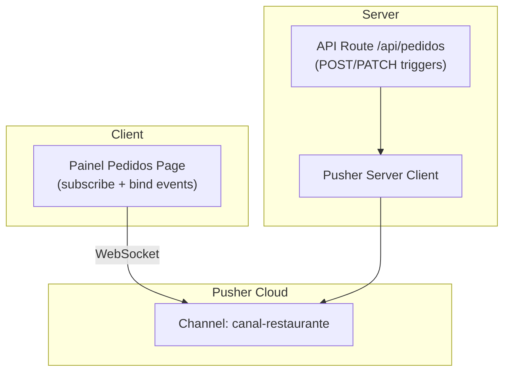
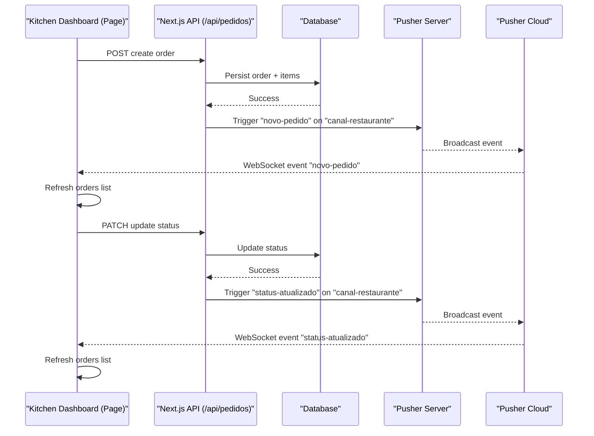
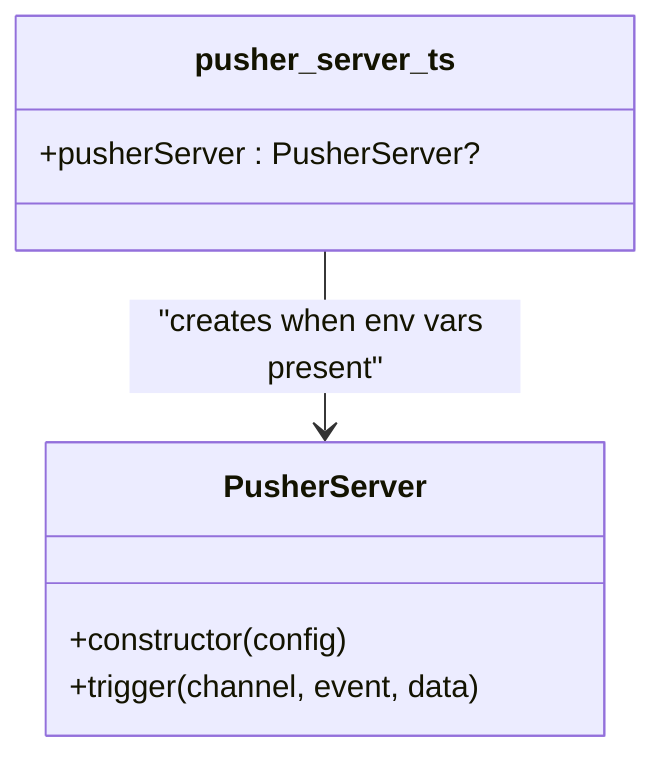
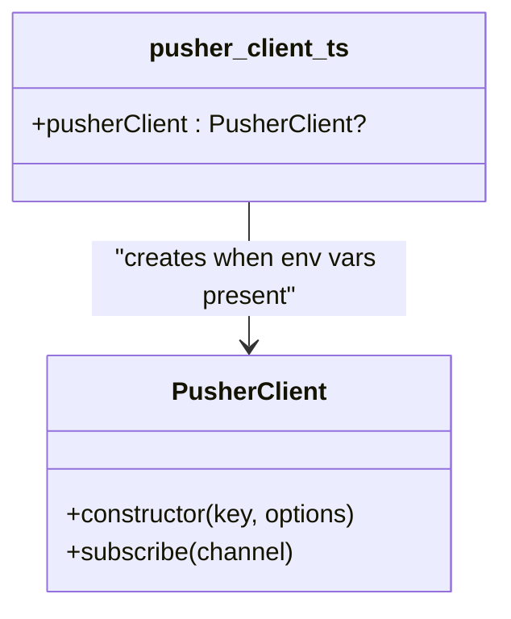
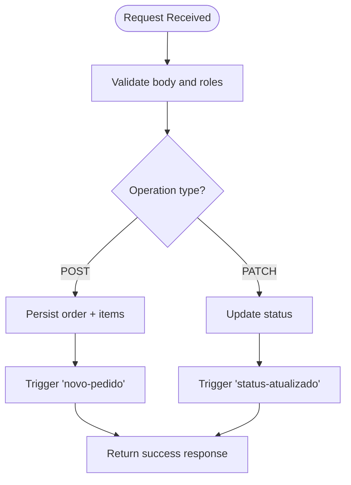
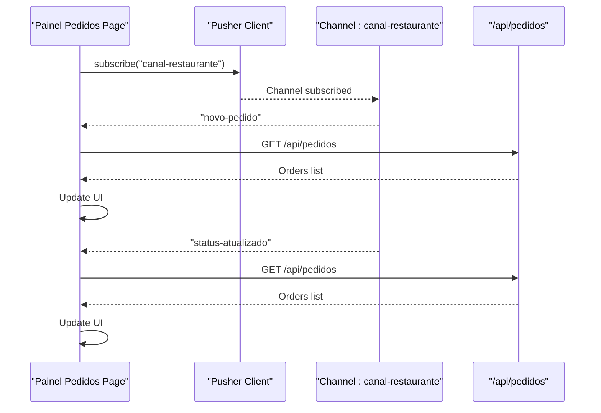
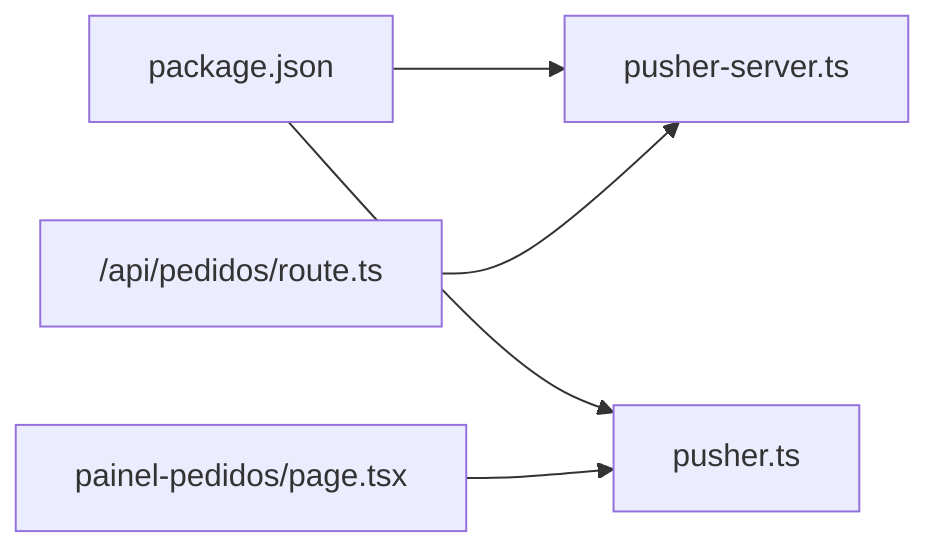

# Real-time Communication Architecture

<cite>
**Referenced Files in This Document**
- [pusher-server.ts](file://src/lib/pusher-server.ts)
- [pusher.ts](file://src/lib/pusher.ts)
- [route.ts](file://src/app/api/pedidos/route.ts)
- [page.tsx](file://src/app/painel-pedidos/page.tsx)
- [package.json](file://package.json)
</cite>

## Table of Contents
1. [Introduction](#introduction)
2. [Project Structure](#project-structure)
3. [Core Components](#core-components)
4. [Architecture Overview](#architecture-overview)
5. [Detailed Component Analysis](#detailed-component-analysis)
6. [Dependency Analysis](#dependency-analysis)
7. [Performance Considerations](#performance-considerations)
8. [Troubleshooting Guide](#troubleshooting-guide)
9. [Conclusion](#conclusion)

## Introduction
This document explains the real-time communication architecture built around Pusher for live updates in the restaurant ordering system. It covers WebSocket connection management, event-driven patterns, and message broadcasting strategies used to synchronize order status across the kitchen dashboard, service staff screens, and customer-facing pages. It also documents connection handling, error recovery, fallback mechanisms, event naming conventions, payload structures, security considerations, scalability patterns, and message queuing strategies.

## Project Structure
The real-time feature is implemented with a minimal set of modules:
- Server-side Pusher client for broadcasting events from API routes.
- Client-side Pusher client for subscribing to channels and listening to events.
- API route handlers that persist data and trigger real-time events.
- A Next.js page that subscribes to the channel and refreshes UI on events.

**Diagram sources**
- [page.tsx:54-76](file://src/app/painel-pedidos/page.tsx#L54-L76)
- [route.ts:173-180](file://src/app/api/pedidos/route.ts#L173-L180)
- [route.ts:220-228](file://src/app/api/pedidos/route.ts#L220-L228)
- [pusher-server.ts:1-10](file://src/lib/pusher-server.ts#L1-L10)
- [pusher.ts:1-8](file://src/lib/pusher.ts#L1-L8)

**Section sources**
- [pusher-server.ts:1-10](file://src/lib/pusher-server.ts#L1-L10)
- [pusher.ts:1-8](file://src/lib/pusher.ts#L1-L8)
- [route.ts:1-253](file://src/app/api/pedidos/route.ts#L1-L253)
- [page.tsx:1-295](file://src/app/painel-pedidos/page.tsx#L1-L295)
- [package.json:25-26](file://package.json#L25-L26)

## Core Components
- Pusher server client: Initializes the Pusher SDK for Node with environment variables and exposes a singleton instance used by API routes to broadcast events.
- Pusher client: Initializes the browser-side Pusher SDK with public key and cluster; exported as a singleton for components to subscribe.
- API route (/api/pedidos): Persists orders and status changes to the database, then triggers Pusher events on the shared channel.
- Kitchen dashboard (Painel Pedidos): Subscribes to the channel and listens for new order and status update events, refreshing the UI accordingly.

Key responsibilities:
- Connection lifecycle managed by Pusher SDKs (server and client).
- Event-driven decoupling between persistence and UI updates.
- Broadcast to all subscribers on a single channel for simplicity.

**Section sources**
- [pusher-server.ts:1-10](file://src/lib/pusher-server.ts#L1-L10)
- [pusher.ts:1-8](file://src/lib/pusher.ts#L1-L8)
- [route.ts:165-190](file://src/app/api/pedidos/route.ts#L165-L190)
- [route.ts:192-235](file://src/app/api/pedidos/route.ts#L192-L235)
- [page.tsx:54-76](file://src/app/painel-pedidos/page.tsx#L54-L76)

## Architecture Overview
The system uses an event-driven pattern where the server persists state first and then broadcasts changes via Pusher. Clients subscribe to a single channel and react to specific events by refetching data or updating local state.

**Diagram sources**
- [route.ts:165-190](file://src/app/api/pedidos/route.ts#L165-L190)
- [route.ts:192-235](file://src/app/api/pedidos/route.ts#L192-L235)
- [page.tsx:54-76](file://src/app/painel-pedidos/page.tsx#L54-L76)

## Detailed Component Analysis

### Pusher Server Client
- Purpose: Provide a server-side Pusher instance configured with app credentials and TLS enabled.
- Behavior: Returns null if required environment variables are missing, allowing graceful degradation.
- Usage: Imported by API routes to trigger events after successful persistence.

**Diagram sources**
- [pusher-server.ts:1-10](file://src/lib/pusher-server.ts#L1-L10)

**Section sources**
- [pusher-server.ts:1-10](file://src/lib/pusher-server.ts#L1-L10)

### Pusher Client
- Purpose: Provide a browser-side Pusher instance configured with public key and cluster.
- Behavior: Returns null if required environment variables are missing, enabling safe conditional usage.
- Usage: Imported by pages to subscribe to channels and bind event listeners.

**Diagram sources**
- [pusher.ts:1-8](file://src/lib/pusher.ts#L1-L8)

**Section sources**
- [pusher.ts:1-8](file://src/lib/pusher.ts#L1-L8)

### API Route: Order Creation and Status Updates
- POST /api/pedidos:
  - Validates input and business rules.
  - Persists order and items in a transaction.
  - Triggers "novo-pedido" on "canal-restaurante".
- PATCH /api/pedidos:
  - Authorizes kitchen role.
  - Validates allowed statuses.
  - Persists status change.
  - Triggers "status-atualizado" on "canal-restaurante".

**Diagram sources**
- [route.ts:65-190](file://src/app/api/pedidos/route.ts#L65-L190)
- [route.ts:192-235](file://src/app/api/pedidos/route.ts#L192-L235)

**Section sources**
- [route.ts:65-190](file://src/app/api/pedidos/route.ts#L65-L190)
- [route.ts:192-235](file://src/app/api/pedidos/route.ts#L192-L235)

### Kitchen Dashboard: Real-time Subscription and UI Sync
- Subscribes to "canal-restaurante" on mount.
- Binds listeners for "novo-pedido" and "status-atualizado".
- On event, refreshes the orders list from the API to ensure consistency.
- Unsubscribes on component unmount to avoid leaks.

**Diagram sources**
- [page.tsx:54-76](file://src/app/painel-pedidos/page.tsx#L54-L76)
- [route.ts:15-63](file://src/app/api/pedidos/route.ts#L15-L63)

**Section sources**
- [page.tsx:54-76](file://src/app/painel-pedidos/page.tsx#L54-L76)

## Dependency Analysis
- External dependencies:
  - pusher (server SDK)
  - pusher-js (client SDK)
- Internal dependencies:
  - API routes depend on Pusher server client to broadcast events.
  - Pages depend on Pusher client to receive events.
  - Both clients rely on environment variables for configuration.

**Diagram sources**
- [package.json:25-26](file://package.json#L25-L26)
- [pusher-server.ts:1-10](file://src/lib/pusher-server.ts#L1-L10)
- [pusher.ts:1-8](file://src/lib/pusher.ts#L1-L8)
- [route.ts:1-10](file://src/app/api/pedidos/route.ts#L1-L10)
- [page.tsx:1-10](file://src/app/painel-pedidos/page.tsx#L1-L10)

**Section sources**
- [package.json:25-26](file://package.json#L25-L26)

## Performance Considerations
- Event payload size: Keep payloads small (e.g., include only id and status for updates) to minimize bandwidth.
- Re-fetch strategy: The current approach re-fetches the full orders list on each event. For high traffic, consider optimistic updates or incremental diffs.
- Connection overhead: Single shared channel reduces complexity but may become a bottleneck under heavy load; consider sharding by restaurant or area.
- Polling fallback: Some pages use polling (e.g., atendimento) as a simple fallback; prefer Pusher where available and fall back gracefully.

[No sources needed since this section provides general guidance]

## Troubleshooting Guide
Common issues and resolutions:
- Missing environment variables:
  - Symptom: pusherServer or pusherClient is null; no real-time updates.
  - Resolution: Ensure NEXT_PUBLIC_PUSHER_KEY, NEXT_PUBLIC_PUSHER_CLUSTER, PUSHER_APP_ID, and PUSHER_SECRET are set.
- Network connectivity:
  - Symptom: No WebSocket connections established.
  - Resolution: Verify firewall/proxy settings allow WebSocket traffic to Pusher clusters.
- Event not received:
  - Symptom: Events triggered but not received.
  - Resolution: Confirm channel name matches exactly ("canal-restaurante") and event names match ("novo-pedido", "status-atualizado").
- Error logging:
  - Use console logs around trigger calls and client bindings to identify failures.

**Section sources**
- [pusher-server.ts:1-10](file://src/lib/pusher-server.ts#L1-L10)
- [pusher.ts:1-8](file://src/lib/pusher.ts#L1-L8)
- [route.ts:173-180](file://src/app/api/pedidos/route.ts#L173-L180)
- [route.ts:220-228](file://src/app/api/pedidos/route.ts#L220-L228)
- [page.tsx:54-76](file://src/app/painel-pedidos/page.tsx#L54-L76)

## Conclusion
The real-time architecture leverages Pusher to decouple persistence from UI updates through a simple, robust event model. The server triggers events after successful database operations, and clients subscribe to a shared channel to stay synchronized. While the current implementation is straightforward and effective, future enhancements can include optimized payloads, optimistic UI updates, channel sharding, and more sophisticated fallback strategies for resilience at scale.

[No sources needed since this section summarizes without analyzing specific files]