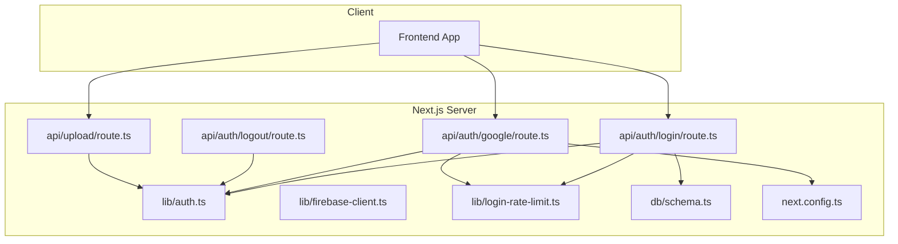
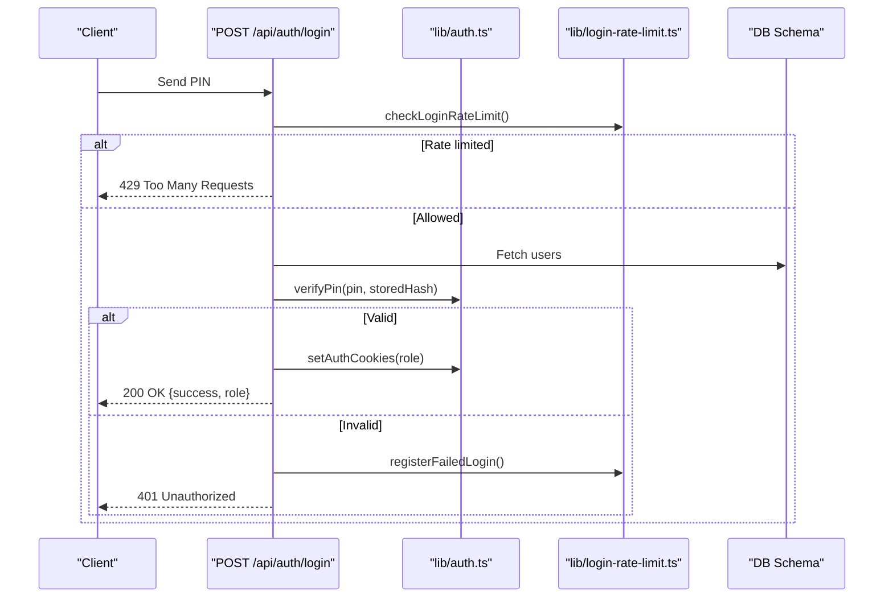
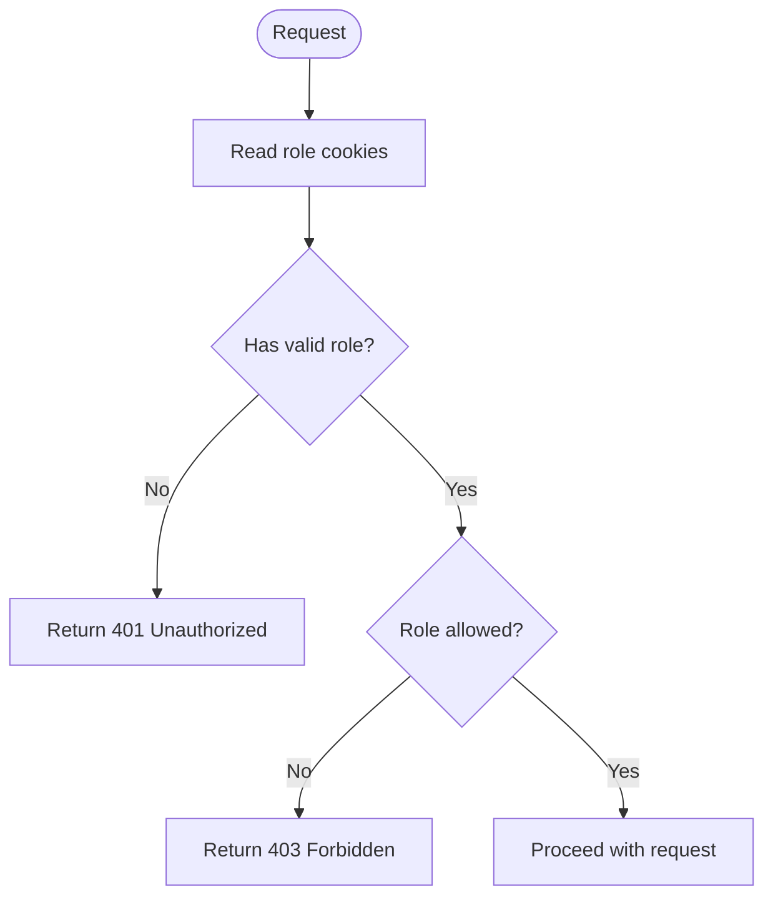
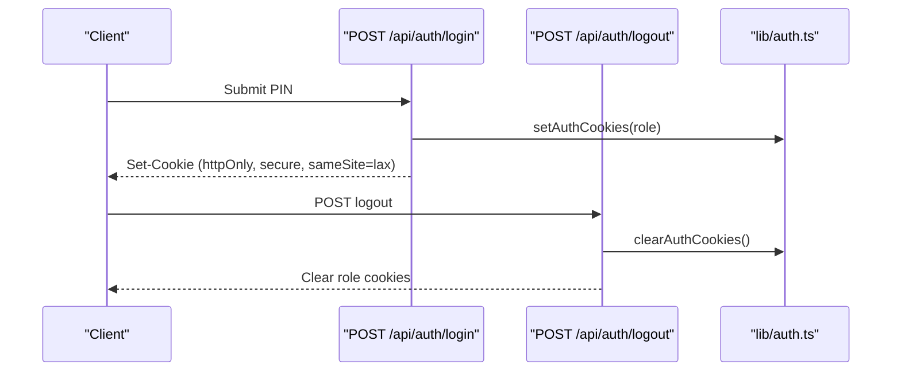
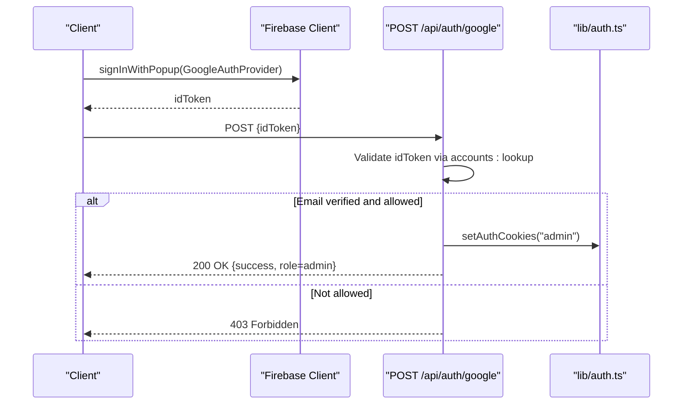
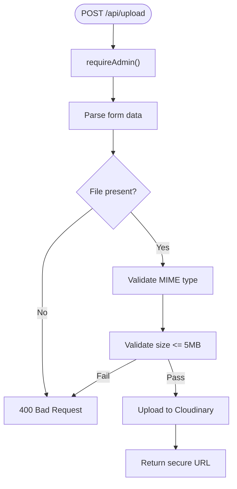
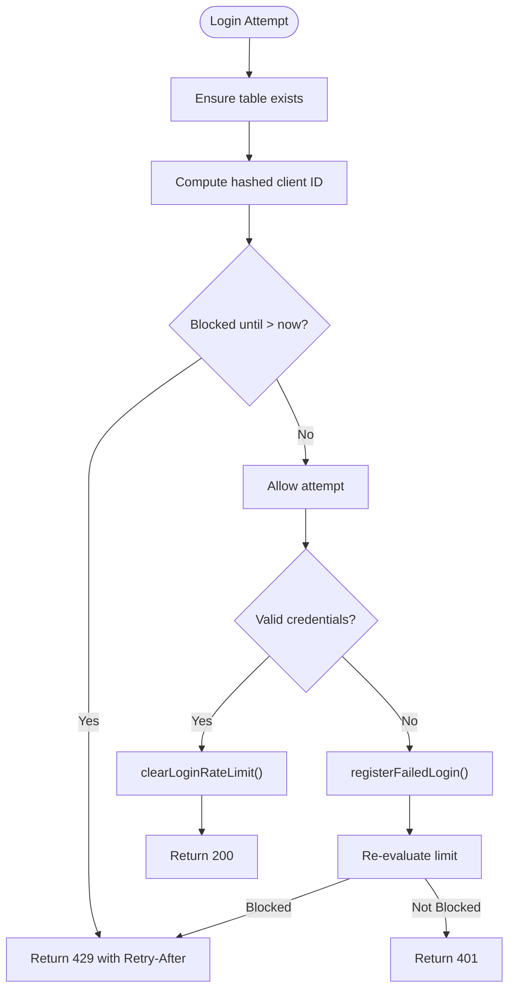
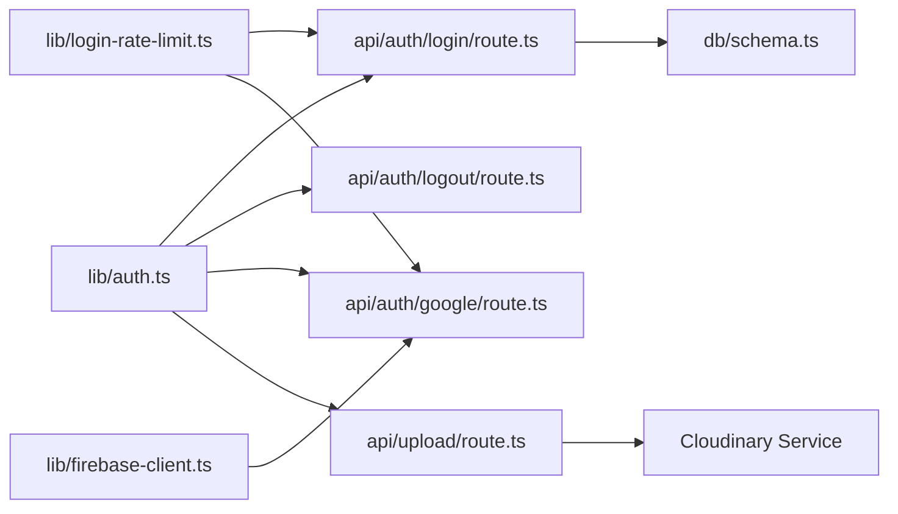

# Security Architecture

<cite>
**Referenced Files in This Document**
- [auth.ts](file://src/lib/auth.ts)
- [firebase-client.ts](file://src/lib/firebase-client.ts)
- [login-route.ts](file://src/app/api/auth/login/route.ts)
- [logout-route.ts](file://src/app/api/auth/logout/route.ts)
- [google-route.ts](file://src/app/api/auth/google/route.ts)
- [login-rate-limit.ts](file://src/lib/login-rate-limit.ts)
- [upload-route.ts](file://src/app/api/upload/route.ts)
- [schema.ts](file://src/db/schema.ts)
- [next.config.ts](file://next.config.ts)
</cite>

## Table of Contents
1. Introduction
2. Project Structure
3. Core Components
4. Architecture Overview
5. Detailed Component Analysis
6. Dependency Analysis
7. Performance Considerations
8. Troubleshooting Guide
9. Conclusion

## Introduction
This document explains the security architecture for authentication, authorization, and data protection across the application. It covers role-based access control (RBAC), cookie-based session management, password hashing, Firebase Google sign-in integration, rate limiting, input validation, secure file uploads, and sensitive data handling. Where applicable, it also outlines recommended hardening measures such as security headers, CORS policies, CSRF protection, XSS prevention, and SQL injection mitigation.

## Project Structure
Security-relevant code is primarily located under:
- Authentication and RBAC utilities: src/lib/auth.ts
- Firebase client integration: src/lib/firebase-client.ts
- API routes for login, logout, and Google auth: src/app/api/auth/*
- Rate limiting for login attempts: src/lib/login-rate-limit.ts
- Secure file upload endpoint: src/app/api/upload/route.ts
- Database schema definitions: src/db/schema.ts
- Next.js configuration for image domains: next.config.ts

**Diagram sources**
- [auth.ts](file://src/lib/auth.ts)
- [firebase-client.ts](file://src/lib/firebase-client.ts)
- [login-route.ts](file://src/app/api/auth/login/route.ts)
- [logout-route.ts](file://src/app/api/auth/logout/route.ts)
- [google-route.ts](file://src/app/api/auth/google/route.ts)
- [login-rate-limit.ts](file://src/lib/login-rate-limit.ts)
- [upload-route.ts](file://src/app/api/upload/route.ts)
- [schema.ts](file://src/db/schema.ts)
- [next.config.ts](file://next.config.ts)

**Section sources**
- [auth.ts](file://src/lib/auth.ts)
- [firebase-client.ts](file://src/lib/firebase-client.ts)
- [login-route.ts](file://src/app/api/auth/login/route.ts)
- [logout-route.ts](file://src/app/api/auth/logout/route.ts)
- [google-route.ts](file://src/app/api/auth/google/route.ts)
- [login-rate-limit.ts](file://src/lib/login-rate-limit.ts)
- [upload-route.ts](file://src/app/api/upload/route.ts)
- [schema.ts](file://src/db/schema.ts)
- [next.config.ts](file://next.config.ts)

## Core Components
- Role-Based Access Control (RBAC): Centralized role types and helpers to enforce admin, kitchen, and attendant roles via cookies.
- Session Management: HTTP-only, SameSite, and production-secure cookies set on successful authentication.
- Password Hashing: bcrypt with a strong cost factor for PIN storage and verification.
- Firebase Google Sign-In: Client-side token acquisition and server-side account lookup with allowlist enforcement.
- Login Rate Limiting: IP-based attempt tracking and temporary lockout after repeated failures.
- Secure File Uploads: Admin-only endpoint with strict MIME type and size checks, uploading directly to Cloudinary.
- Data Protection: Sensitive fields excluded from responses; PIN never returned to clients.

**Section sources**
- [auth.ts](file://src/lib/auth.ts)
- [login-route.ts](file://src/app/api/auth/login/route.ts)
- [google-route.ts](file://src/app/api/auth/google/route.ts)
- [login-rate-limit.ts](file://src/lib/login-rate-limit.ts)
- [upload-route.ts](file://src/app/api/upload/route.ts)
- [schema.ts](file://src/db/schema.ts)

## Architecture Overview
The authentication flow combines cookie-based sessions for PIN-based logins and Firebase ID tokens for Google sign-in. Authorization is enforced through middleware-like functions that read role cookies and return appropriate errors when access is denied.

**Diagram sources**
- [login-route.ts](file://src/app/api/auth/login/route.ts)
- [auth.ts](file://src/lib/auth.ts)
- [login-rate-limit.ts](file://src/lib/login-rate-limit.ts)
- [schema.ts](file://src/db/schema.ts)

## Detailed Component Analysis

### Authentication and Authorization (RBAC)
- Roles: admin, cozinha (kitchen), atendente (attendant).
- Cookie flags: httpOnly, secure (production), sameSite lax, path root, one-week maxAge.
- Helpers:
  - getAuthRole(): reads role cookies to determine current role.
  - requireAuth(allowed[]): returns role or error response (401/403).
  - requireAdmin(), requireKitchen(): convenience wrappers.
- Normalization: normalizeCargo() maps various strings to canonical roles.

**Diagram sources**
- [auth.ts](file://src/lib/auth.ts)

**Section sources**
- [auth.ts](file://src/lib/auth.ts)

### Session Management (Cookies)
- On successful login, role-specific cookies are set (e.g., auth_admin, auth_cozinha, auth_atendente).
- Logout clears all role cookies.
- Cookies are httpOnly and secure in production to mitigate XSS and ensure HTTPS-only transmission.
- SameSite lax reduces cross-site request risks while allowing top-level navigation.

**Diagram sources**
- [login-route.ts](file://src/app/api/auth/login/route.ts)
- [logout-route.ts](file://src/app/api/auth/logout/route.ts)
- [auth.ts](file://src/lib/auth.ts)

**Section sources**
- [auth.ts](file://src/lib/auth.ts)
- [logout-route.ts](file://src/app/api/auth/logout/route.ts)

### Password Hashing Strategy
- PINs are hashed using bcrypt with a cost factor of 12.
- Verification uses constant-time comparison via bcrypt.compare.
- PINs are never logged or returned in responses.

**Section sources**
- [auth.ts](file://src/lib/auth.ts)
- [login-route.ts](file://src/app/api/auth/login/route.ts)
- [schema.ts](file://src/db/schema.ts)

### Firebase Authentication Integration (Google)
- Client obtains a Firebase ID token via signInWithPopup.
- Server validates the token by calling Identity Toolkit accounts:lookup with the public API key.
- Access is granted only if the email is verified and present in an allowlist configured via environment variables.
- On success, admin role cookie is set.

**Diagram sources**
- [firebase-client.ts](file://src/lib/firebase-client.ts)
- [google-route.ts](file://src/app/api/auth/google/route.ts)
- [auth.ts](file://src/lib/auth.ts)

**Section sources**
- [firebase-client.ts](file://src/lib/firebase-client.ts)
- [google-route.ts](file://src/app/api/auth/google/route.ts)

### Input Validation and Sanitization
- PIN length and format validated on login and user creation endpoints.
- User creation enforces numeric PIN constraints and normalizes roles.
- Request bodies are parsed safely with fallbacks to handle malformed JSON.

**Section sources**
- [login-route.ts](file://src/app/api/auth/login/route.ts)
- [usuarios route](file://src/app/api/usuarios/route.ts)

### Secure File Uploads
- Endpoint requires admin role.
- Strict allowlist of MIME types (JPEG, PNG, WEBP, GIF).
- Maximum file size enforced (5MB).
- Files uploaded directly to Cloudinary via streaming; no local disk writes.
- Only secure URLs are returned to clients.

**Diagram sources**
- [upload-route.ts](file://src/app/api/upload/route.ts)
- [auth.ts](file://src/lib/auth.ts)

**Section sources**
- [upload-route.ts](file://src/app/api/upload/route.ts)

### Login Rate Limiting and Brute-Force Mitigation
- Tracks failed attempts per client identifier derived from X-Forwarded-For or X-Real-IP.
- After a threshold of failures, locks out the identifier for a configurable period.
- Returns 429 with Retry-After header guidance.
- Successful login clears counters.

**Diagram sources**
- [login-route.ts](file://src/app/api/auth/login/route.ts)
- [login-rate-limit.ts](file://src/lib/login-rate-limit.ts)

**Section sources**
- [login-route.ts](file://src/app/api/auth/login/route.ts)
- [login-rate-limit.ts](file://src/lib/login-rate-limit.ts)

### Data Protection and Sensitive Fields
- PINs are hashed before storage and never echoed back.
- User listing excludes PIN fields from responses.
- Image domains are whitelisted in Next.js config to prevent arbitrary remote loading.

**Section sources**
- [auth.ts](file://src/lib/auth.ts)
- [schema.ts](file://src/db/schema.ts)
- [next.config.ts](file://next.config.ts)

## Dependency Analysis
Authentication and authorization logic is centralized in lib/auth.ts and consumed by API routes. Rate limiting is isolated in lib/login-rate-limit.ts and invoked by login and Google endpoints. File uploads depend on Cloudinary and require admin authorization.

**Diagram sources**
- [auth.ts](file://src/lib/auth.ts)
- [login-route.ts](file://src/app/api/auth/login/route.ts)
- [logout-route.ts](file://src/app/api/auth/logout/route.ts)
- [google-route.ts](file://src/app/api/auth/google/route.ts)
- [upload-route.ts](file://src/app/api/upload/route.ts)
- [login-rate-limit.ts](file://src/lib/login-rate-limit.ts)
- [firebase-client.ts](file://src/lib/firebase-client.ts)
- [schema.ts](file://src/db/schema.ts)

**Section sources**
- [auth.ts](file://src/lib/auth.ts)
- [login-route.ts](file://src/app/api/auth/login/route.ts)
- [logout-route.ts](file://src/app/api/auth/logout/route.ts)
- [google-route.ts](file://src/app/api/auth/google/route.ts)
- [upload-route.ts](file://src/app/api/upload/route.ts)
- [login-rate-limit.ts](file://src/lib/login-rate-limit.ts)
- [firebase-client.ts](file://src/lib/firebase-client.ts)
- [schema.ts](file://src/db/schema.ts)

## Performance Considerations
- bcrypt cost factor balances security and latency; ensure hardware resources can handle concurrent hashing.
- Rate limiting uses SQLite; monitor contention and consider indexing if scaling beyond single-node deployments.
- Cloudinary streaming avoids large memory buffers and reduces server load.
- Whitelisting remote image domains prevents unnecessary DNS resolution and network overhead.

[No sources needed since this section provides general guidance]

## Troubleshooting Guide
- 401 Unauthorized: Missing or invalid role cookies; verify login flow and cookie settings.
- 403 Forbidden: Role not permitted for the requested resource; check required roles.
- 429 Too Many Requests: Exceeded login attempts; wait for Retry-After or reset counters after successful login.
- Google login failures: Ensure NEXT_PUBLIC_FIREBASE_API_KEY is set and the caller’s email is verified and allowlisted.
- Upload errors: Confirm MIME type and size limits; inspect Cloudinary configuration and network connectivity.

**Section sources**
- [login-route.ts](file://src/app/api/auth/login/route.ts)
- [google-route.ts](file://src/app/api/auth/google/route.ts)
- [upload-route.ts](file://src/app/api/upload/route.ts)
- [login-rate-limit.ts](file://src/lib/login-rate-limit.ts)

## Conclusion
The application implements a robust security posture centered on RBAC, secure cookie sessions, strong PIN hashing, Firebase Google integration with allowlists, and rate-limited login flows. File uploads are strictly controlled and delegated to a trusted CDN. To further harden the system, consider adding explicit security headers, CORS policies, CSRF protections for state-changing requests, comprehensive input sanitization, and parameterized queries or ORM usage to mitigate SQL injection risks.

[No sources needed since this section summarizes without analyzing specific files]