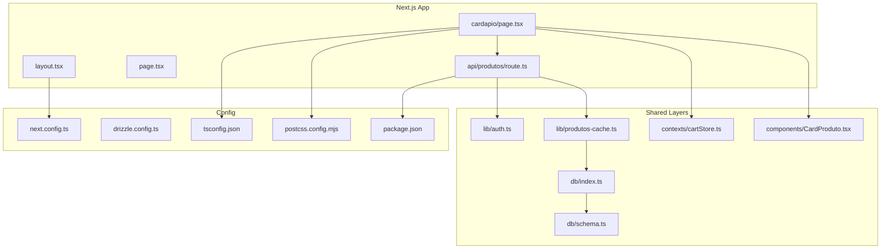
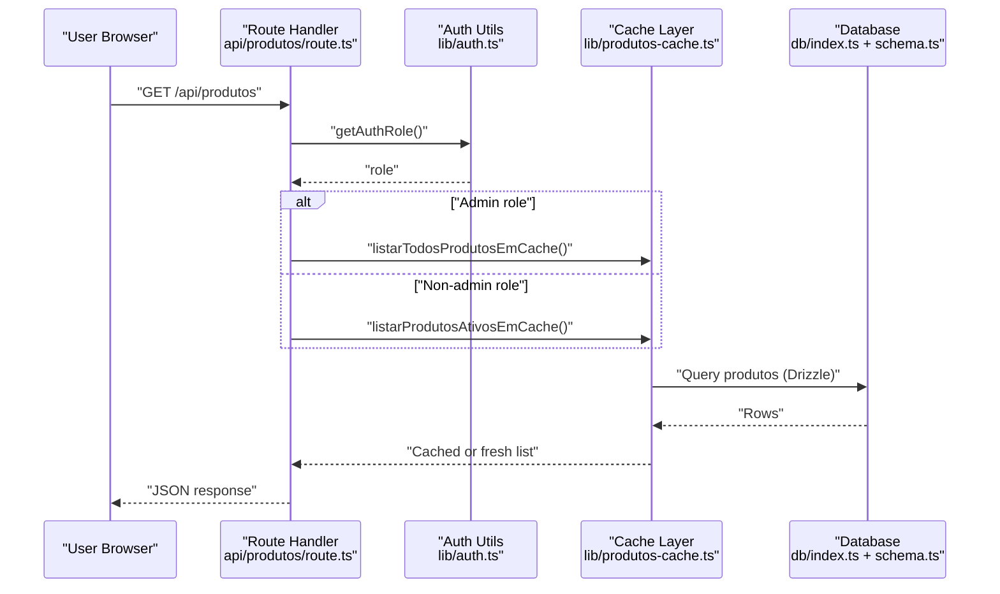
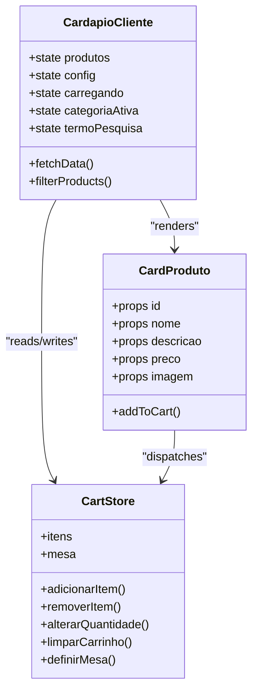
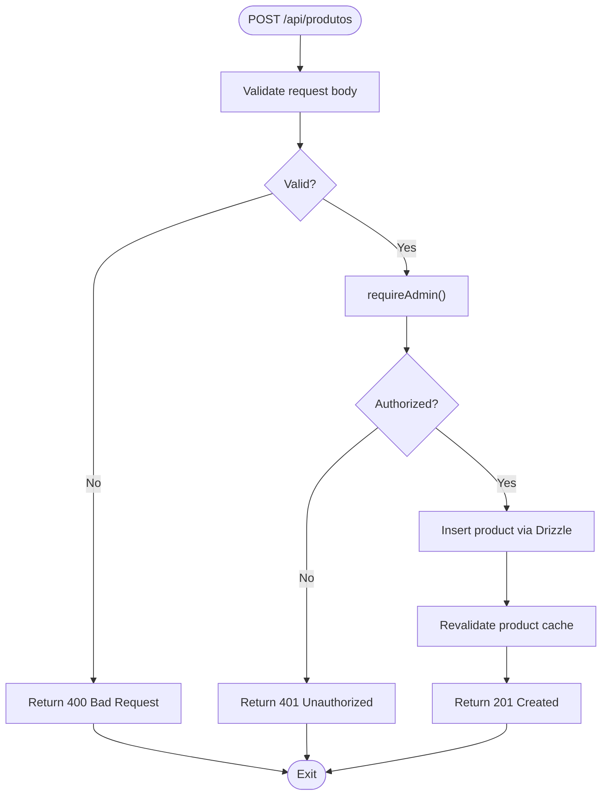
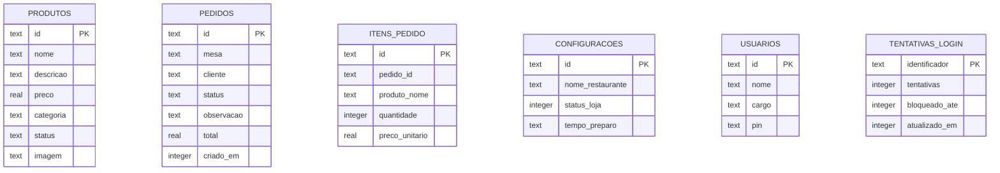
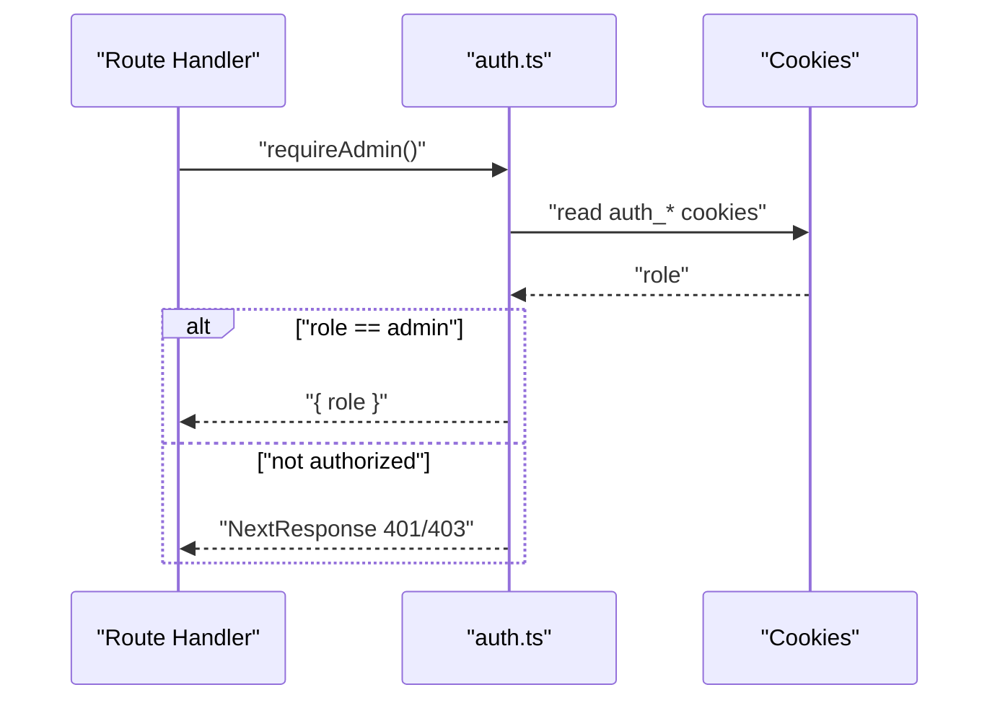
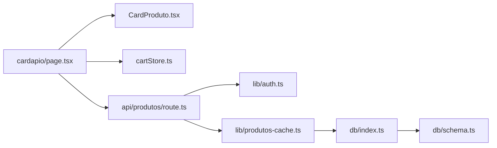

# System Design & Architecture Patterns

<cite>
**Referenced Files in This Document**
- [package.json](file://package.json)
- [next.config.ts](file://next.config.ts)
- [drizzle.config.ts](file://drizzle.config.ts)
- [tsconfig.json](file://tsconfig.json)
- [postcss.config.mjs](file://postcss.config.mjs)
- [src/app/layout.tsx](file://src/app/layout.tsx)
- [src/app/page.tsx](file://src/app/page.tsx)
- [src/app/cardapio/page.tsx](file://src/app/cardapio/page.tsx)
- [src/components/CardProduto.tsx](file://src/components/CardProduto.tsx)
- [src/contexts/cartStore.ts](file://src/contexts/cartStore.ts)
- [src/db/index.ts](file://src/db/index.ts)
- [src/db/schema.ts](file://src/db/schema.ts)
- [src/lib/auth.ts](file://src/lib/auth.ts)
- [src/lib/produtos-cache.ts](file://src/lib/produtos-cache.ts)
- [src/app/api/produtos/route.ts](file://src/app/api/produtos/route.ts)
</cite>

## Table of Contents
1. [Introduction](#introduction)
2. [Project Structure](#project-structure)
3. [Core Components](#core-components)
4. [Architecture Overview](#architecture-overview)
5. [Detailed Component Analysis](#detailed-component-analysis)
6. [Dependency Analysis](#dependency-analysis)
7. [Performance Considerations](#performance-considerations)
8. [Troubleshooting Guide](#troubleshooting-guide)
9. [Conclusion](#conclusion)

## Introduction
This document explains the system design and architecture patterns of the Meu Cardápio application, focusing on its component-based architecture using Next.js App Router, separation of client and server concerns, and an API-first approach. It also documents technology stack decisions (React 19, TypeScript, Tailwind CSS) and how they integrate with Next.js, Drizzle ORM, and Turso/LibSQL. The goal is to provide a clear mental model for developers and stakeholders on how UI components, API routes, caching, authentication, and database layers interact to deliver a maintainable, modular, and reusable codebase.

## Project Structure
The project follows Next.js App Router conventions:
- Pages and layouts are defined under src/app with route segments.
- API endpoints live under src/app/api as route handlers.
- Shared logic is organized into lib/, services/, contexts/, and db/.
- UI components are placed under src/components.

Key configuration files:
- next.config.ts configures image optimization and remote sources.
- drizzle.config.ts defines schema location, output directory, dialect, and credentials.
- tsconfig.json sets strict TypeScript settings and path aliases.
- postcss.config.mjs integrates Tailwind CSS via PostCSS.
- package.json lists runtime dependencies and scripts for development, build, and database operations.

**Diagram sources**
- [src/app/layout.tsx:1-34](file://src/app/layout.tsx#L1-L34)
- [src/app/page.tsx:1-17](file://src/app/page.tsx#L1-L17)
- [src/app/cardapio/page.tsx:1-315](file://src/app/cardapio/page.tsx#L1-L315)
- [src/app/api/produtos/route.ts:1-53](file://src/app/api/produtos/route.ts#L1-L53)
- [src/lib/auth.ts:1-82](file://src/lib/auth.ts#L1-L82)
- [src/lib/produtos-cache.ts:1-23](file://src/lib/produtos-cache.ts#L1-L23)
- [src/db/index.ts:1-14](file://src/db/index.ts#L1-L14)
- [src/db/schema.ts:1-56](file://src/db/schema.ts#L1-L56)
- [src/components/CardProduto.tsx:1-51](file://src/components/CardProduto.tsx#L1-L51)
- [src/contexts/cartStore.ts:1-69](file://src/contexts/cartStore.ts#L1-L69)
- [next.config.ts:1-14](file://next.config.ts#L1-L14)
- [drizzle.config.ts:1-14](file://drizzle.config.ts#L1-L14)
- [tsconfig.json:1-35](file://tsconfig.json#L1-L35)
- [postcss.config.mjs:1-8](file://postcss.config.mjs#L1-L8)
- [package.json:1-45](file://package.json#L1-L45)

**Section sources**
- [package.json:1-45](file://package.json#L1-L45)
- [next.config.ts:1-14](file://next.config.ts#L1-L14)
- [drizzle.config.ts:1-14](file://drizzle.config.ts#L1-L14)
- [tsconfig.json:1-35](file://tsconfig.json#L1-L35)
- [postcss.config.mjs:1-8](file://postcss.config.mjs#L1-L8)

## Core Components
- Client-side UI layer:
  - cardapio/page.tsx implements the menu page with search, category filtering, and cart integration.
  - CardProduto.tsx renders product cards and interacts with the global cart store.
  - cartStore.ts provides Zustand-based state management for cart items and table context, persisted across sessions.
- Server-side API layer:
  - api/produtos/route.ts exposes GET and POST endpoints for listing and creating products, enforcing admin-only writes and role-aware reads.
- Data access and caching:
  - db/index.ts initializes the LibSQL/Turso client and Drizzle instance.
  - db/schema.ts defines SQLite tables for products, orders, order items, settings, users, and login attempts.
  - lib/produtos-cache.ts uses Next.js unstable_cache and revalidateTag for efficient data fetching and cache invalidation.
- Authentication and authorization:
  - lib/auth.ts handles PIN hashing/verification, cookie-based session roles, and middleware-like guards for protected routes.

Design principles reflected:
- Modularity: Each concern (UI, API, data, auth, cache) is isolated in dedicated modules.
- Reusability: Components like CardProduto.tsx and utilities in lib/ are reused across pages.
- Maintainability: Strict TypeScript, centralized schema, and consistent API patterns simplify evolution.

**Section sources**
- [src/app/cardapio/page.tsx:1-315](file://src/app/cardapio/page.tsx#L1-L315)
- [src/components/CardProduto.tsx:1-51](file://src/components/CardProduto.tsx#L1-L51)
- [src/contexts/cartStore.ts:1-69](file://src/contexts/cartStore.ts#L1-L69)
- [src/app/api/produtos/route.ts:1-53](file://src/app/api/produtos/route.ts#L1-L53)
- [src/db/index.ts:1-14](file://src/db/index.ts#L1-L14)
- [src/db/schema.ts:1-56](file://src/db/schema.ts#L1-L56)
- [src/lib/produtos-cache.ts:1-23](file://src/lib/produtos-cache.ts#L1-L23)
- [src/lib/auth.ts:1-82](file://src/lib/auth.ts#L1-L82)

## Architecture Overview
Meu Cardápio adopts a layered architecture within Next.js App Router:
- Presentation Layer: React components render UI and manage local state.
- Application Layer: Route handlers implement business rules, enforce auth, and orchestrate data flows.
- Data Layer: Drizzle ORM queries against LibSQL/Turso, with caching via Next.js unstable_cache.
- Cross-cutting Concerns: Auth middleware, caching strategies, and environment configuration.

**Diagram sources**
- [src/app/api/produtos/route.ts:1-53](file://src/app/api/produtos/route.ts#L1-L53)
- [src/lib/auth.ts:1-82](file://src/lib/auth.ts#L1-L82)
- [src/lib/produtos-cache.ts:1-23](file://src/lib/produtos-cache.ts#L1-L23)
- [src/db/index.ts:1-14](file://src/db/index.ts#L1-L14)
- [src/db/schema.ts:1-56](file://src/db/schema.ts#L1-L56)

## Detailed Component Analysis

### Client-Side Menu Page and Product Cards
- cardapio/page.tsx orchestrates data fetching from /api/produtos and /api/settings, manages search and category filters, and integrates with the cart store.
- CardProduto.tsx formats currency, displays images, and dispatches add-to-cart actions via Zustand.
- cartStore.ts persists cart items and table context, enabling seamless UX across navigation.

**Diagram sources**
- [src/app/cardapio/page.tsx:1-315](file://src/app/cardapio/page.tsx#L1-L315)
- [src/components/CardProduto.tsx:1-51](file://src/components/CardProduto.tsx#L1-L51)
- [src/contexts/cartStore.ts:1-69](file://src/contexts/cartStore.ts#L1-L69)

**Section sources**
- [src/app/cardapio/page.tsx:1-315](file://src/app/cardapio/page.tsx#L1-L315)
- [src/components/CardProduto.tsx:1-51](file://src/components/CardProduto.tsx#L1-L51)
- [src/contexts/cartStore.ts:1-69](file://src/contexts/cartStore.ts#L1-L69)

### API Route: Products CRUD
- GET enforces role-based visibility: admins see all products; others see only active ones.
- POST validates input, inserts a new product, and invalidates the product cache.
- Uses requireAdmin guard and utility functions for error handling and responses.

**Diagram sources**
- [src/app/api/produtos/route.ts:1-53](file://src/app/api/produtos/route.ts#L1-L53)
- [src/lib/auth.ts:1-82](file://src/lib/auth.ts#L1-L82)
- [src/lib/produtos-cache.ts:1-23](file://src/lib/produtos-cache.ts#L1-L23)

**Section sources**
- [src/app/api/produtos/route.ts:1-53](file://src/app/api/produtos/route.ts#L1-L53)

### Database Schema and ORM Integration
- drizzle.config.ts configures schema path, output directory, dialect (turso), and credentials.
- db/index.ts creates a LibSQL client and exports a typed Drizzle instance bound to schema.
- db/schema.ts defines entities for products, orders, order items, settings, users, and login attempts.

**Diagram sources**
- [src/db/schema.ts:1-56](file://src/db/schema.ts#L1-L56)

**Section sources**
- [drizzle.config.ts:1-14](file://drizzle.config.ts#L1-L14)
- [src/db/index.ts:1-14](file://src/db/index.ts#L1-L14)
- [src/db/schema.ts:1-56](file://src/db/schema.ts#L1-L56)

### Authentication and Authorization
- lib/auth.ts provides helpers for PIN hashing/verification, cookie-based role detection, and guarded accessors for admin/kitchen roles.
- API routes use these guards to enforce permissions consistently.

**Diagram sources**
- [src/lib/auth.ts:1-82](file://src/lib/auth.ts#L1-L82)
- [src/app/api/produtos/route.ts:1-53](file://src/app/api/produtos/route.ts#L1-L53)

**Section sources**
- [src/lib/auth.ts:1-82](file://src/lib/auth.ts#L1-L82)

### Technology Stack Decisions and Integration
- React 19 with Next.js App Router enables modern component composition and server/client boundaries.
- TypeScript ensures type safety across UI, API, and data layers.
- Tailwind CSS via PostCSS provides utility-first styling integrated through postcss.config.mjs.
- Drizzle ORM with Turso/LibSQL offers lightweight, type-safe database access.
- Zustand powers client state with persistence for cart and table context.

Configuration highlights:
- next.config.ts restricts allowed image hosts and formats.
- tsconfig.json enforces strict mode and module resolution suitable for bundlers.
- package.json centralizes dependencies and scripts for dev/build/db tasks.

**Section sources**
- [next.config.ts:1-14](file://next.config.ts#L1-L14)
- [tsconfig.json:1-35](file://tsconfig.json#L1-L35)
- [postcss.config.mjs:1-8](file://postcss.config.mjs#L1-L8)
- [package.json:1-45](file://package.json#L1-L45)

## Dependency Analysis
The following diagram shows key dependencies between core modules:

**Diagram sources**
- [src/app/cardapio/page.tsx:1-315](file://src/app/cardapio/page.tsx#L1-L315)
- [src/components/CardProduto.tsx:1-51](file://src/components/CardProduto.tsx#L1-L51)
- [src/contexts/cartStore.ts:1-69](file://src/contexts/cartStore.ts#L1-L69)
- [src/app/api/produtos/route.ts:1-53](file://src/app/api/produtos/route.ts#L1-L53)
- [src/lib/auth.ts:1-82](file://src/lib/auth.ts#L1-L82)
- [src/lib/produtos-cache.ts:1-23](file://src/lib/produtos-cache.ts#L1-L23)
- [src/db/index.ts:1-14](file://src/db/index.ts#L1-L14)
- [src/db/schema.ts:1-56](file://src/db/schema.ts#L1-L56)

**Section sources**
- [src/app/cardapio/page.tsx:1-315](file://src/app/cardapio/page.tsx#L1-L315)
- [src/app/api/produtos/route.ts:1-53](file://src/app/api/produtos/route.ts#L1-L53)
- [src/lib/produtos-cache.ts:1-23](file://src/lib/produtos-cache.ts#L1-L23)
- [src/db/index.ts:1-14](file://src/db/index.ts#L1-L14)
- [src/db/schema.ts:1-56](file://src/db/schema.ts#L1-L56)

## Performance Considerations
- Caching: Use Next.js unstable_cache for read-heavy endpoints and revalidateTag for targeted invalidation after mutations.
- Image Optimization: Configure allowed remote patterns and preferred formats to reduce payload size.
- State Management: Persist cart and table context to avoid repeated initialization and improve perceived performance.
- Database Access: Keep queries minimal and leverage indexes where appropriate; consider connection pooling if scaling beyond single-node deployments.

[No sources needed since this section provides general guidance]

## Troubleshooting Guide
Common issues and resolutions:
- Authentication failures: Ensure cookies are set correctly and roles match expected values; verify secure flags in production.
- Cache not updating: After mutations, call revalidateTag to invalidate cached queries.
- Database connectivity: Confirm TURSO_DATABASE_URL and TURSO_AUTH_TOKEN are configured; validate schema migrations.
- Image loading errors: Check next.config.ts remotePatterns for allowed hosts and ensure HTTPS.

**Section sources**
- [src/lib/auth.ts:1-82](file://src/lib/auth.ts#L1-L82)
- [src/lib/produtos-cache.ts:1-23](file://src/lib/produtos-cache.ts#L1-L23)
- [src/db/index.ts:1-14](file://src/db/index.ts#L1-L14)
- [next.config.ts:1-14](file://next.config.ts#L1-L14)

## Conclusion
Meu Cardápio leverages Next.js App Router to deliver a clean separation between client and server concerns, with an API-first design that enforces security and consistency. The combination of React 19, TypeScript, Tailwind CSS, Drizzle ORM, and Turso/LibSQL yields a robust, scalable foundation. Emphasizing modularity, reusability, and maintainability ensures the codebase remains adaptable as features evolve.

[No sources needed since this section summarizes without analyzing specific files]