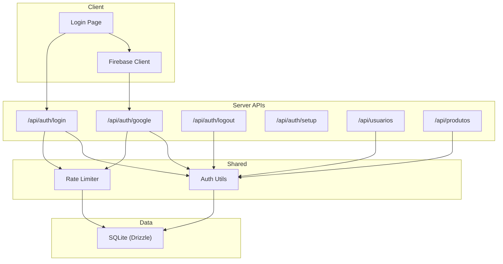
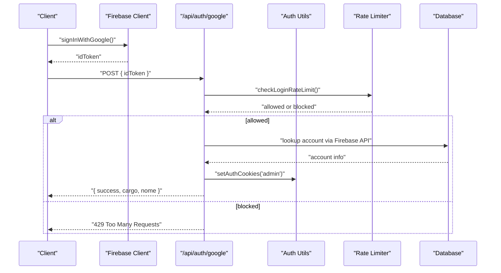
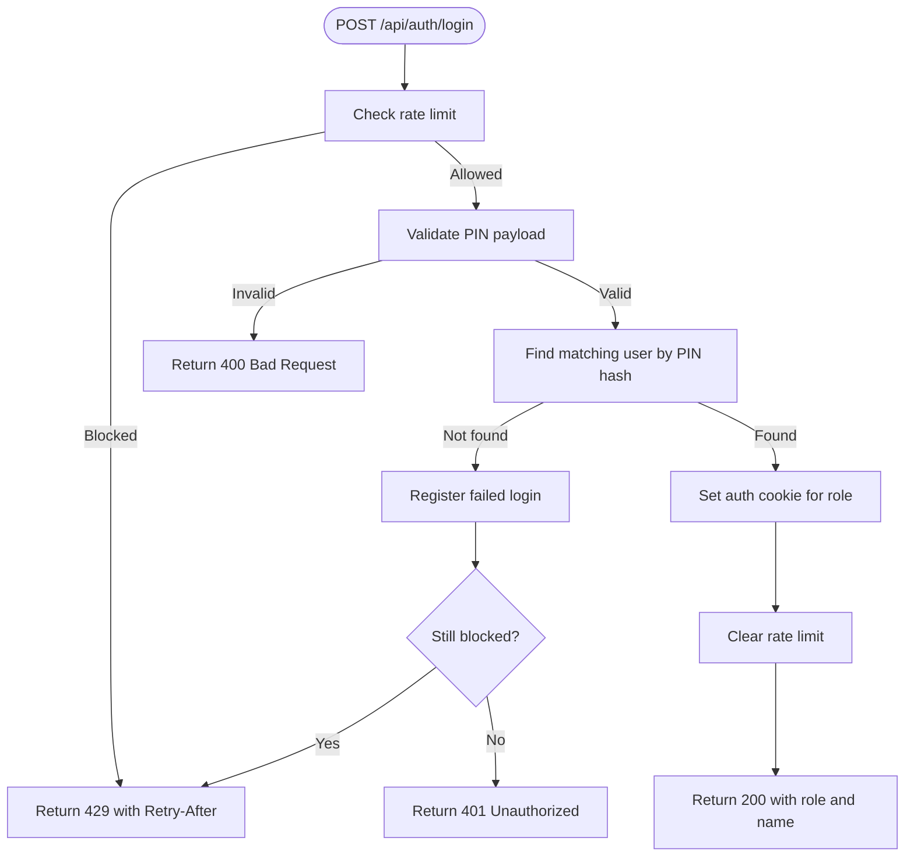
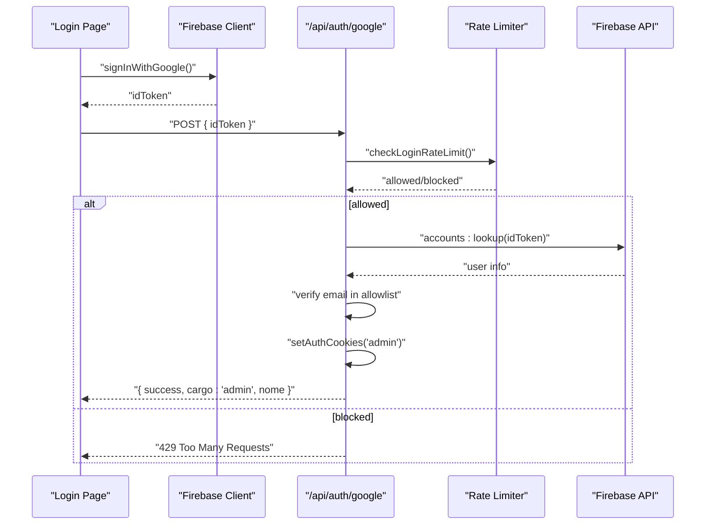
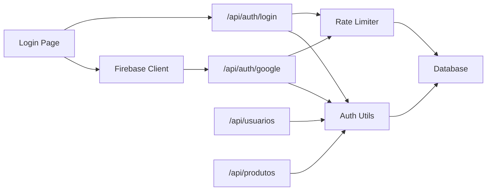

# Authentication & Authorization

<cite>
**Referenced Files in This Document**
- [auth.ts](file://src/lib/auth.ts)
- [firebase-client.ts](file://src/lib/firebase-client.ts)
- [login route](file://src/app/api/auth/login/route.ts)
- [google route](file://src/app/api/auth/google/route.ts)
- [logout route](file://src/app/api/auth/logout/route.ts)
- [setup route](file://src/app/api/auth/setup/route.ts)
- [login rate limit](file://src/lib/login-rate-limit.ts)
- [schema](file://src/db/schema.ts)
- [usuarios route](file://src/app/api/usuarios/route.ts)
- [produtos route](file://src/app/api/produtos/route.ts)
- [login page](file://src/app/login/page.tsx)
</cite>

## Table of Contents
1. Introduction
2. Project Structure
3. Core Components
4. Architecture Overview
5. Detailed Component Analysis
6. Dependency Analysis
7. Performance Considerations
8. Troubleshooting Guide
9. Conclusion

## Introduction
This document explains the authentication and authorization system for the Meu Cardápio application. It covers a multi-layered approach that combines Firebase Auth (Google sign-in) with a custom PIN-based login, cookie-based session management, role-based access control, and security measures such as password hashing and rate limiting. It also provides practical guidance for implementing protected routes, middleware-like checks, role-based UI rendering, logout, session expiration handling, and debugging.

## Project Structure
The authentication system spans client-side flows, server-side API routes, shared utilities, and database schema:
- Client-side Google sign-in helper
- Server-side login endpoints for PIN and Google
- Shared auth utilities for cookies, roles, and authorization helpers
- Rate limiting to protect login endpoints
- Database schema for users and login attempts
- Example protected routes demonstrating role checks

**Diagram sources**
- [login page:1-160](file://src/app/login/page.tsx#L1-L160)
- [firebase-client.ts:1-26](file://src/lib/firebase-client.ts#L1-L26)
- [login route:1-80](file://src/app/api/auth/login/route.ts#L1-L80)
- [google route:1-77](file://src/app/api/auth/google/route.ts#L1-L77)
- [logout route:1-15](file://src/app/api/auth/logout/route.ts#L1-L15)
- [setup route:1-45](file://src/app/api/auth/setup/route.ts#L1-L45)
- [auth.ts:1-82](file://src/lib/auth.ts#L1-L82)
- [login rate limit:1-115](file://src/lib/login-rate-limit.ts#L1-L115)
- [schema:1-56](file://src/db/schema.ts#L1-L56)

**Section sources**
- [login page:1-160](file://src/app/login/page.tsx#L1-L160)
- [firebase-client.ts:1-26](file://src/lib/firebase-client.ts#L1-L26)
- [login route:1-80](file://src/app/api/auth/login/route.ts#L1-L80)
- [google route:1-77](file://src/app/api/auth/google/route.ts#L1-L77)
- [logout route:1-15](file://src/app/api/auth/logout/route.ts#L1-L15)
- [setup route:1-45](file://src/app/api/auth/setup/route.ts#L1-L45)
- [auth.ts:1-82](file://src/lib/auth.ts#L1-L82)
- [login rate limit:1-115](file://src/lib/login-rate-limit.ts#L1-L115)
- [schema:1-56](file://src/db/schema.ts#L1-L56)

## Core Components
- Role model and labels: defines roles and human-readable labels
- Cookie helpers: set/clear auth cookies and read current role
- Authorization helpers: require specific roles on API routes
- PIN hashing and verification: secure storage and comparison
- Google sign-in flow: client-side token acquisition and server validation
- Rate limiter: protects against brute-force login attempts
- Setup endpoint: initial admin creation with secure random PIN

Key responsibilities:
- Enforce least privilege by checking roles at each sensitive API
- Store credentials securely using bcrypt
- Maintain sessions via httpOnly cookies with appropriate flags
- Limit login attempts per client identifier

**Section sources**
- [auth.ts:1-82](file://src/lib/auth.ts#L1-L82)
- [login rate limit:1-115](file://src/lib/login-rate-limit.ts#L1-L115)
- [setup route:1-45](file://src/app/api/auth/setup/route.ts#L1-L45)

## Architecture Overview
The system supports two authentication methods:
- PIN-based login for staff roles (admin, kitchen, attendant)
- Google sign-in restricted to an allowlist of emails for admin access

On successful authentication, the server sets role-specific httpOnly cookies. Subsequent requests are authorized by reading these cookies and enforcing role requirements via helpers.

**Diagram sources**
- [firebase-client.ts:1-26](file://src/lib/firebase-client.ts#L1-L26)
- [google route:1-77](file://src/app/api/auth/google/route.ts#L1-L77)
- [auth.ts:1-82](file://src/lib/auth.ts#L1-L82)
- [login rate limit:1-115](file://src/lib/login-rate-limit.ts#L1-L115)

## Detailed Component Analysis

### Roles and Permissions
Roles:
- admin: full access to administrative features
- cozinha (kitchen): access to order processing and kitchen-related features
- atendente (attendant): access to service-facing features

Permissions enforcement:
- Admin-only endpoints use a dedicated helper
- Kitchen endpoints allow admin and kitchen roles
- Public endpoints may still apply role-aware data filtering

Examples in code:
- Admin-only user management endpoints
- Product listing adapts visibility based on role

**Section sources**
- [auth.ts:1-82](file://src/lib/auth.ts#L1-L82)
- [usuarios route:1-79](file://src/app/api/usuarios/route.ts#L1-L79)
- [produtos route:1-53](file://src/app/api/produtos/route.ts#L1-L53)

### PIN-based Login Flow
Flow:
- Validate input length and format
- Check rate limit before attempting authentication
- Compare provided PIN against stored hash
- On success, set role-specific cookie and clear rate limit counters
- On failure, register failed attempt and respond accordingly

Security considerations:
- Uses bcrypt for hashing
- Rate limiting prevents brute force
- No secrets returned in responses

**Diagram sources**
- [login route:1-80](file://src/app/api/auth/login/route.ts#L1-L80)
- [login rate limit:1-115](file://src/lib/login-rate-limit.ts#L1-L115)
- [auth.ts:1-82](file://src/lib/auth.ts#L1-L82)

**Section sources**
- [login route:1-80](file://src/app/api/auth/login/route.ts#L1-L80)
- [login rate limit:1-115](file://src/lib/login-rate-limit.ts#L1-L115)
- [auth.ts:1-82](file://src/lib/auth.ts#L1-L82)

### Google Sign-in Flow
Flow:
- Client obtains Firebase ID token
- Server validates token via Firebase Identity Toolkit
- Checks email against allowlist
- Sets admin cookie and returns success

Security considerations:
- Email allowlist restricts admin access
- Token is validated server-side
- Rate limiting applies

**Diagram sources**
- [login page:1-160](file://src/app/login/page.tsx#L1-L160)
- [firebase-client.ts:1-26](file://src/lib/firebase-client.ts#L1-L26)
- [google route:1-77](file://src/app/api/auth/google/route.ts#L1-L77)
- [login rate limit:1-115](file://src/lib/login-rate-limit.ts#L1-L115)

**Section sources**
- [google route:1-77](file://src/app/api/auth/google/route.ts#L1-L77)
- [firebase-client.ts:1-26](file://src/lib/firebase-client.ts#L1-L26)
- [login page:1-160](file://src/app/login/page.tsx#L1-L160)

### Session Management and Cookies
- Role-specific cookies are set upon successful login
- Cookies are httpOnly and secure in production
- Expiration is configured for weekly sessions
- Logout clears all role cookies

Practical notes:
- Use role cookies to gate server-side access
- For client-side UI gating, maintain local state derived from login response

**Section sources**
- [auth.ts:1-82](file://src/lib/auth.ts#L1-L82)
- [logout route:1-15](file://src/app/api/auth/logout/route.ts#L1-L15)

### Protected Routes and Middleware-like Checks
- API routes call role-checking helpers to enforce permissions
- Helpers return either an authorized context or a NextResponse error
- Examples:
  - User management requires admin
  - Product listing varies by role

Implementation pattern:
- Call requireAdmin() or requireKitchen() at the top of mutating endpoints
- Handle non-NextResponse results to proceed with business logic

**Section sources**
- [usuarios route:1-79](file://src/app/api/usuarios/route.ts#L1-L79)
- [produtos route:1-53](file://src/app/api/produtos/route.ts#L1-L53)
- [auth.ts:1-82](file://src/lib/auth.ts#L1-L82)

### Role-Based UI Rendering
- After login, store user info locally to drive UI decisions
- Redirect to role-appropriate dashboards
- Hide or show menu items based on role

Example behaviors:
- Kitchen users go to order panel
- Admin users go to admin panel
- Attendant users go to service panel

**Section sources**
- [login page:1-160](file://src/app/login/page.tsx#L1-L160)

### Security Considerations
- Password hashing: PINs are hashed with bcrypt before storage and compared securely
- Rate limiting: Protects both PIN and Google login endpoints; blocks after repeated failures
- Allowlist: Google admin access restricted to configured emails
- Cookie security: httpOnly and secure flags in production; SameSite lax
- Input validation: Strict checks on PIN length/format and request payloads

**Section sources**
- [auth.ts:1-82](file://src/lib/auth.ts#L1-L82)
- [login rate limit:1-115](file://src/lib/login-rate-limit.ts#L1-L115)
- [google route:1-77](file://src/app/api/auth/google/route.ts#L1-L77)
- [login route:1-80](file://src/app/api/auth/login/route.ts#L1-L80)

### Logout and Session Expiration
- Logout clears role cookies server-side
- Clients should clear local user state and redirect to login
- Sessions expire based on cookie maxAge; browsers will discard expired cookies automatically

**Section sources**
- [logout route:1-15](file://src/app/api/auth/logout/route.ts#L1-L15)
- [auth.ts:1-82](file://src/lib/auth.ts#L1-L82)

### Initial Setup
- Creates an initial admin user with a randomly generated PIN if none exists
- Optional setup secret header can be enforced via environment variable
- PIN is hashed before storage

**Section sources**
- [setup route:1-45](file://src/app/api/auth/setup/route.ts#L1-L45)
- [schema:1-56](file://src/db/schema.ts#L1-L56)

## Dependency Analysis

**Diagram sources**
- [login page:1-160](file://src/app/login/page.tsx#L1-L160)
- [firebase-client.ts:1-26](file://src/lib/firebase-client.ts#L1-L26)
- [login route:1-80](file://src/app/api/auth/login/route.ts#L1-L80)
- [google route:1-77](file://src/app/api/auth/google/route.ts#L1-L77)
- [auth.ts:1-82](file://src/lib/auth.ts#L1-L82)
- [login rate limit:1-115](file://src/lib/login-rate-limit.ts#L1-L115)
- [usuarios route:1-79](file://src/app/api/usuarios/route.ts#L1-L79)
- [produtos route:1-53](file://src/app/api/produtos/route.ts#L1-L53)

**Section sources**
- [auth.ts:1-82](file://src/lib/auth.ts#L1-L82)
- [login rate limit:1-115](file://src/lib/login-rate-limit.ts#L1-L115)
- [login route:1-80](file://src/app/api/auth/login/route.ts#L1-L80)
- [google route:1-77](file://src/app/api/auth/google/route.ts#L1-L77)

## Performance Considerations
- Rate limiting uses SQLite; ensure indexes on identifiers if scaling beyond single-node deployments
- Avoid unnecessary database reads by caching role checks where appropriate
- Keep cookie payloads minimal; rely on server-side role resolution
- Use environment variables to enable secure cookies only in production

[No sources needed since this section provides general guidance]

## Troubleshooting Guide
Common issues and resolutions:
- 429 Too Many Requests: Indicates rate limiting; wait for retry window or clear rate limit after successful login
- 401 Unauthorized: Missing or invalid session; re-authenticate and ensure cookies are accepted by the browser
- 403 Forbidden: Insufficient role for the requested resource; verify user role and endpoint requirements
- Google login fails: Ensure Firebase configuration and email allowlist are correct; check network calls to Firebase API
- PIN always rejected: Verify PIN length/format and that hashes exist in the database

Debugging tips:
- Inspect cookies in browser DevTools to confirm presence and attributes
- Log server errors from API routes to identify exceptions
- Validate environment variables for Firebase and allowlists
- Confirm database tables exist for rate limiting and users

**Section sources**
- [login route:1-80](file://src/app/api/auth/login/route.ts#L1-L80)
- [google route:1-77](file://src/app/api/auth/google/route.ts#L1-L77)
- [login rate limit:1-115](file://src/lib/login-rate-limit.ts#L1-L115)
- [auth.ts:1-82](file://src/lib/auth.ts#L1-L82)

## Conclusion
The Meu Cardápio application implements a robust, multi-layered authentication and authorization system combining Firebase Auth for Google sign-in and a secure PIN-based login. Role-based access control is enforced server-side through cookie-based sessions and reusable authorization helpers. Security is strengthened by bcrypt hashing, strict input validation, and rate limiting. The documented flows and patterns provide a solid foundation for building protected routes, role-aware UIs, and maintaining secure sessions across the application.

[No sources needed since this section summarizes without analyzing specific files]