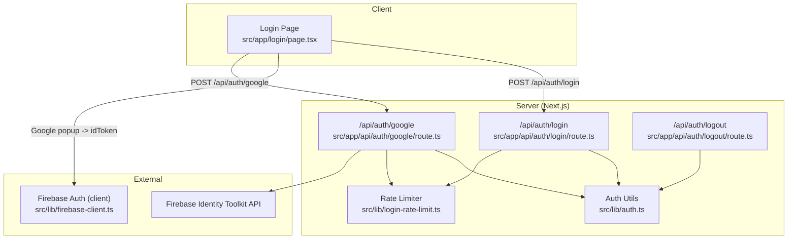
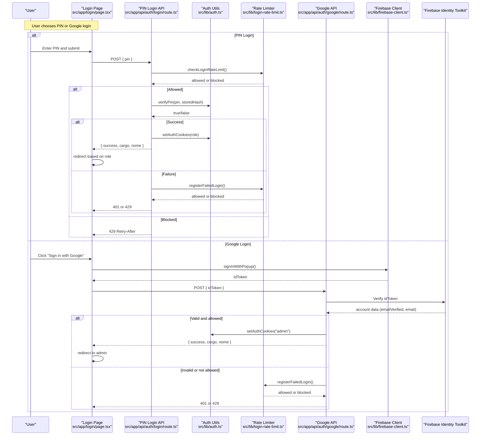
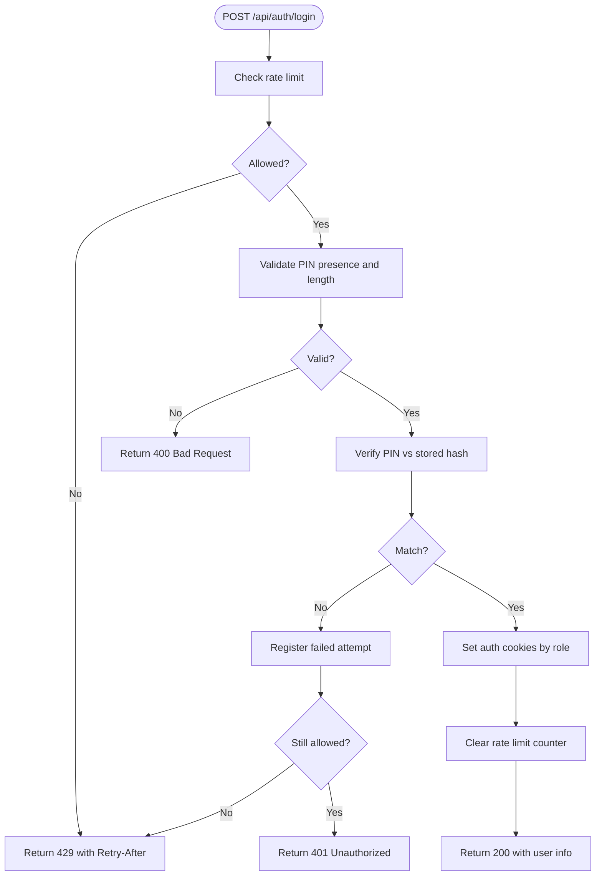
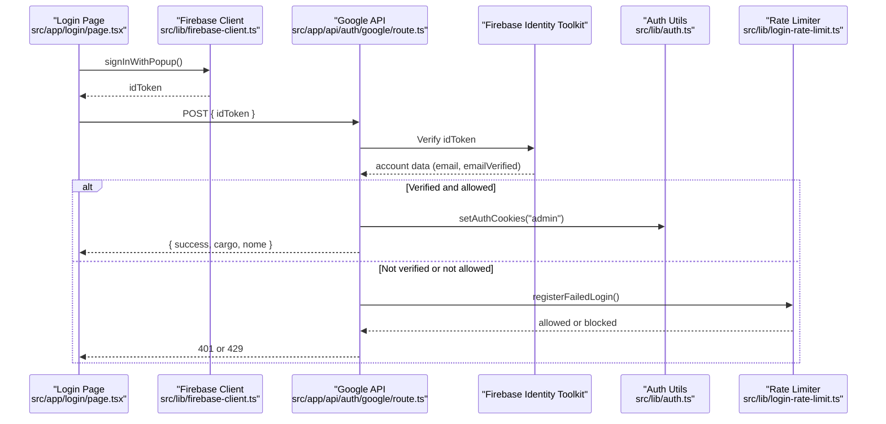
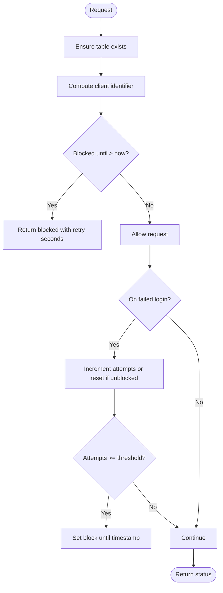
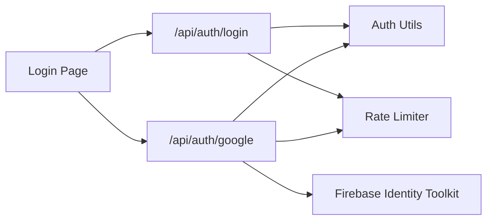

# Login & Authentication Flow

<cite>
**Referenced Files in This Document**
- [route.ts](file://src/app/api/auth/login/route.ts)
- [route.ts](file://src/app/api/auth/google/route.ts)
- [auth.ts](file://src/lib/auth.ts)
- [firebase-client.ts](file://src/lib/firebase-client.ts)
- [login-rate-limit.ts](file://src/lib/login-rate-limit.ts)
- [page.tsx](file://src/app/login/page.tsx)
- [route.ts](file://src/app/api/auth/logout/route.ts)
</cite>

## Table of Contents
1. Introduction
2. Project Structure
3. Core Components
4. Architecture Overview
5. Detailed Component Analysis
6. Dependency Analysis
7. Performance Considerations
8. Troubleshooting Guide
9. Conclusion

## Introduction
This document explains the complete authentication flow for the application, covering both PIN-based login and Google OAuth login. It details how user input is validated, how sessions are established via cookies, and how Firebase is integrated for Google sign-in with server-side token verification. It also documents rate limiting to prevent brute force attacks and highlights security considerations for protecting against common authentication vulnerabilities.

## Project Structure
The authentication system spans client-side UI, API routes, shared utilities, and external integrations:
- Client UI: login page orchestrates user interactions and calls backend APIs.
- API routes: handle PIN login, Google OAuth callback, and logout.
- Shared utilities: cookie management, role checks, and hashing.
- External integration: Firebase client SDK for Google sign-in on the client; server verifies tokens via Firebase Identity Toolkit.



**Diagram sources**
- [page.tsx:15-86](file://src/app/login/page.tsx#L15-L86)
- [route.ts:16-79](file://src/app/api/auth/login/route.ts#L16-L79)
- [route.ts:27-75](file://src/app/api/auth/google/route.ts#L27-L75)
- [auth.ts:21-82](file://src/lib/auth.ts#L21-L82)
- [login-rate-limit.ts:45-115](file://src/lib/login-rate-limit.ts#L45-L115)
- [firebase-client.ts:21-25](file://src/lib/firebase-client.ts#L21-L25)

**Section sources**
- [page.tsx:1-160](file://src/app/login/page.tsx#L1-L160)
- [route.ts:16-79](file://src/app/api/auth/login/route.ts#L16-L79)
- [route.ts:27-75](file://src/app/api/auth/google/route.ts#L27-L75)
- [auth.ts:1-82](file://src/lib/auth.ts#L1-L82)
- [login-rate-limit.ts:1-115](file://src/lib/login-rate-limit.ts#L1-L115)
- [firebase-client.ts:1-26](file://src/lib/firebase-client.ts#L1-L26)
- [route.ts:6-14](file://src/app/api/auth/logout/route.ts#L6-L14)

## Core Components
- Login page: collects PIN or triggers Google sign-in, then calls appropriate API endpoints.
- PIN login endpoint: validates input, enforces rate limits, verifies PIN using bcrypt, sets auth cookies, and returns user info.
- Google OAuth endpoint: validates idToken via Firebase Identity Toolkit, checks admin email allowlist, sets auth cookies, and returns user info.
- Auth utilities: hash/verify PIN, set/clear cookies, read current role, and enforce role-based access.
- Rate limiter: tracks failed attempts per client identifier and blocks requests after threshold.
- Logout endpoint: clears auth cookies.

**Section sources**
- [page.tsx:15-86](file://src/app/login/page.tsx#L15-L86)
- [route.ts:16-79](file://src/app/api/auth/login/route.ts#L16-L79)
- [route.ts:27-75](file://src/app/api/auth/google/route.ts#L27-L75)
- [auth.ts:21-82](file://src/lib/auth.ts#L21-L82)
- [login-rate-limit.ts:45-115](file://src/lib/login-rate-limit.ts#L45-L115)
- [route.ts:6-14](file://src/app/api/auth/logout/route.ts#L6-L14)

## Architecture Overview
The authentication architecture combines a client-driven UI with secure server-side validation and session management:
- PIN login uses bcrypt to compare stored hashes with submitted PINs.
- Google login uses Firebase’s client SDK to obtain an idToken, which the server verifies through the Firebase Identity Toolkit API before granting access.
- Sessions are maintained via HTTP-only cookies scoped by role.
- Rate limiting protects both login flows from brute force attempts.



**Diagram sources**
- [page.tsx:15-86](file://src/app/login/page.tsx#L15-L86)
- [route.ts:16-79](file://src/app/api/auth/login/route.ts#L16-L79)
- [route.ts:27-75](file://src/app/api/auth/google/route.ts#L27-L75)
- [auth.ts:21-82](file://src/lib/auth.ts#L21-L82)
- [login-rate-limit.ts:45-115](file://src/lib/login-rate-limit.ts#L45-L115)
- [firebase-client.ts:21-25](file://src/lib/firebase-client.ts#L21-L25)

## Detailed Component Analysis

### PIN-Based Login Flow
- Input validation: ensures PIN is present and within length constraints.
- Rate limiting: checks if the client is temporarily blocked; responds with 429 and Retry-After when exceeded.
- Verification: compares submitted PIN against stored hash using bcrypt.
- Session creation: sets role-scoped cookies and clears any prior rate limit counters.
- Response: returns user metadata and role for client-side routing.



**Diagram sources**
- [route.ts:16-79](file://src/app/api/auth/login/route.ts#L16-L79)
- [login-rate-limit.ts:45-115](file://src/lib/login-rate-limit.ts#L45-L115)
- [auth.ts:21-42](file://src/lib/auth.ts#L21-L42)

**Section sources**
- [route.ts:16-79](file://src/app/api/auth/login/route.ts#L16-L79)
- [auth.ts:21-42](file://src/lib/auth.ts#L21-L42)
- [login-rate-limit.ts:45-115](file://src/lib/login-rate-limit.ts#L45-L115)

### Google OAuth Login Flow
- Client-side: initializes Firebase app and prompts user to sign in with Google, returning an idToken.
- Server-side: verifies the idToken via Firebase Identity Toolkit API, ensuring the account exists, email is verified, and email is in the admin allowlist.
- Session creation: sets an admin cookie upon successful verification.
- Error handling: records failed attempts and applies rate limiting when verification fails or email is not allowed.



**Diagram sources**
- [page.tsx:59-86](file://src/app/login/page.tsx#L59-L86)
- [firebase-client.ts:21-25](file://src/lib/firebase-client.ts#L21-L25)
- [route.ts:27-75](file://src/app/api/auth/google/route.ts#L27-L75)
- [auth.ts:39-42](file://src/lib/auth.ts#L39-L42)
- [login-rate-limit.ts:66-97](file://src/lib/login-rate-limit.ts#L66-L97)

**Section sources**
- [page.tsx:59-86](file://src/app/login/page.tsx#L59-L86)
- [firebase-client.ts:1-26](file://src/lib/firebase-client.ts#L1-L26)
- [route.ts:27-75](file://src/app/api/auth/google/route.ts#L27-L75)
- [auth.ts:39-42](file://src/lib/auth.ts#L39-L42)
- [login-rate-limit.ts:66-97](file://src/lib/login-rate-limit.ts#L66-L97)

### Cookie-Based Session Management
- Cookies are set per role (e.g., admin, cozinha, atendente) with httpOnly and secure flags in production.
- Role resolution reads active cookies to determine current user role.
- Logout clears all role cookies.

```mermaid
classDiagram
class AuthUtils {
+hashPin(pin) Promise~string~
+verifyPin(pin, hash) Promise~boolean~
+setAuthCookies(cargo) Promise~void~
+clearAuthCookies() Promise~void~
+getAuthRole() Promise~Cargo|null~
+requireAuth(allowed) Promise~{role}|NextResponse~
+requireAdmin() Promise~{role}|NextResponse~
+requireKitchen() Promise~{role}|NextResponse~
}
```

**Diagram sources**
- [auth.ts:21-82](file://src/lib/auth.ts#L21-L82)

**Section sources**
- [auth.ts:13-57](file://src/lib/auth.ts#L13-L57)
- [route.ts:6-14](file://src/app/api/auth/logout/route.ts#L6-L14)

### Rate Limiting Implementation
- Tracks failed login attempts per client identifier derived from request headers.
- Blocks further attempts for a fixed duration after reaching a threshold.
- Provides Retry-After guidance in responses when blocked.
- Clears counters on successful login.



**Diagram sources**
- [login-rate-limit.ts:28-97](file://src/lib/login-rate-limit.ts#L28-L97)
- [login-rate-limit.ts:108-115](file://src/lib/login-rate-limit.ts#L108-L115)

**Section sources**
- [login-rate-limit.ts:1-115](file://src/lib/login-rate-limit.ts#L1-L115)
- [route.ts:16-79](file://src/app/api/auth/login/route.ts#L16-L79)
- [route.ts:27-75](file://src/app/api/auth/google/route.ts#L27-L75)

## Dependency Analysis
- The login page depends on Firebase client for Google sign-in and calls backend APIs for both flows.
- Backend routes depend on auth utilities for cookie management and role enforcement.
- Both login routes depend on the rate limiter to protect against brute force.
- Google route depends on Firebase Identity Toolkit for server-side token verification.



**Diagram sources**
- [page.tsx:15-86](file://src/app/login/page.tsx#L15-L86)
- [route.ts:16-79](file://src/app/api/auth/login/route.ts#L16-L79)
- [route.ts:27-75](file://src/app/api/auth/google/route.ts#L27-L75)
- [auth.ts:21-82](file://src/lib/auth.ts#L21-L82)
- [login-rate-limit.ts:45-115](file://src/lib/login-rate-limit.ts#L45-L115)

**Section sources**
- [page.tsx:15-86](file://src/app/login/page.tsx#L15-L86)
- [route.ts:16-79](file://src/app/api/auth/login/route.ts#L16-L79)
- [route.ts:27-75](file://src/app/api/auth/google/route.ts#L27-L75)
- [auth.ts:21-82](file://src/lib/auth.ts#L21-L82)
- [login-rate-limit.ts:45-115](file://src/lib/login-rate-limit.ts#L45-L115)

## Performance Considerations
- Bcrypt cost factor: ensure the configured cost balances security and latency.
- Database queries: avoid unnecessary scans; consider indexing where applicable.
- Rate limiter: keep lockout durations reasonable to balance security and user experience.
- Network calls: minimize retries to Firebase services and cache results where safe.

[No sources needed since this section provides general guidance]

## Troubleshooting Guide
Common issues and resolutions:
- Invalid PIN:
  - Cause: wrong PIN or malformed input.
  - Behavior: returns 401; failed attempts are recorded and may trigger rate limiting.
  - Action: verify PIN entry and ensure stored hash exists.
- Google login blocked:
  - Cause: email not verified or not in admin allowlist.
  - Behavior: returns 401 or 403; failed attempts recorded.
  - Action: confirm email verification and add email to allowlist environment variable.
- Rate limited:
  - Cause: too many failed attempts.
  - Behavior: returns 429 with Retry-After header.
  - Action: wait for cooldown; investigate potential abuse.
- Logout not clearing session:
  - Cause: cookies not deleted properly.
  - Behavior: still authenticated after logout.
  - Action: ensure logout endpoint is called and browser clears cookies.

**Section sources**
- [route.ts:16-79](file://src/app/api/auth/login/route.ts#L16-L79)
- [route.ts:27-75](file://src/app/api/auth/google/route.ts#L27-L75)
- [login-rate-limit.ts:45-115](file://src/lib/login-rate-limit.ts#L45-L115)
- [route.ts:6-14](file://src/app/api/auth/logout/route.ts#L6-L14)

## Conclusion
The authentication system implements secure PIN-based login with bcrypt and Google OAuth with server-side token verification via Firebase. Sessions are managed through role-scoped, httpOnly cookies, and robust rate limiting protects against brute force attacks. Proper error handling and clear feedback guide users through successful and failed login attempts. For ongoing security, ensure environment variables are correctly configured, monitor rate limiting thresholds, and review logs for anomalies.

[No sources needed since this section summarizes without analyzing specific files]