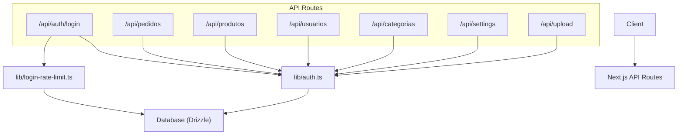
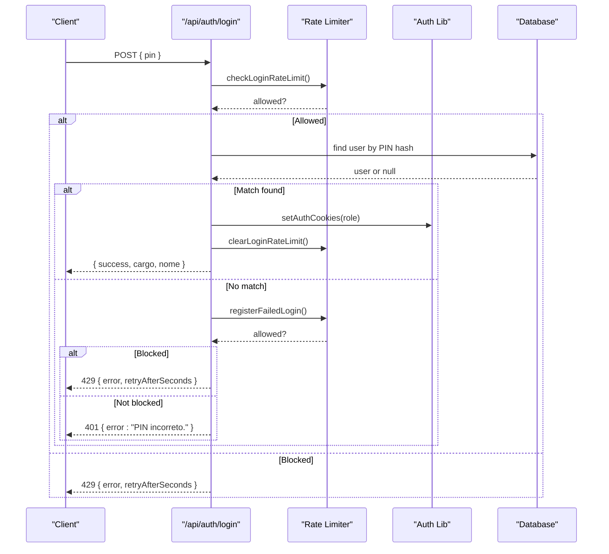
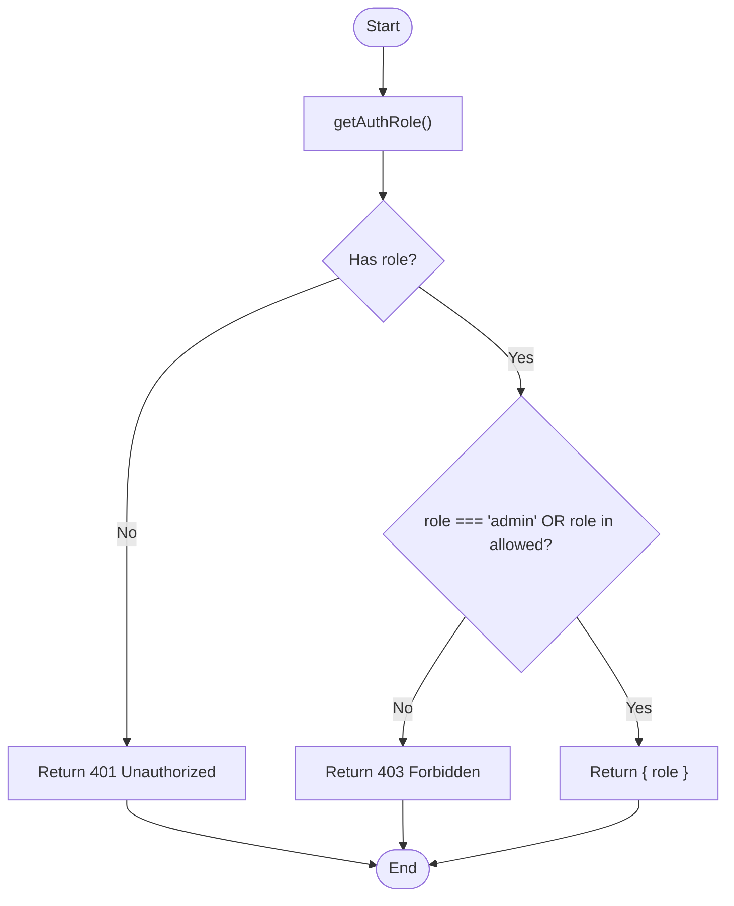
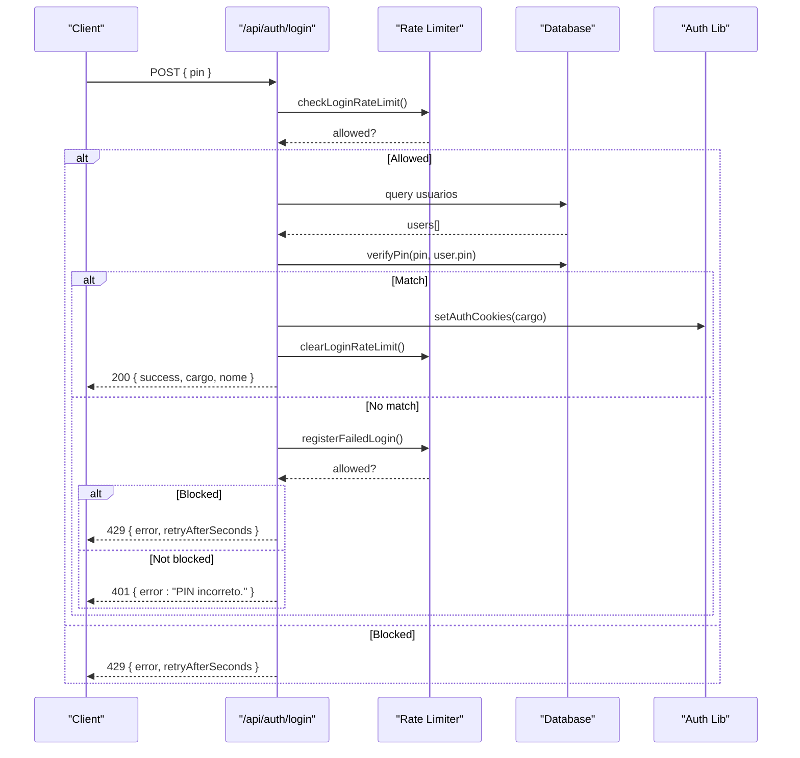
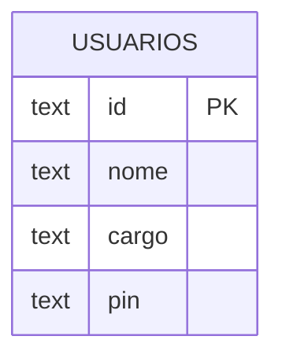
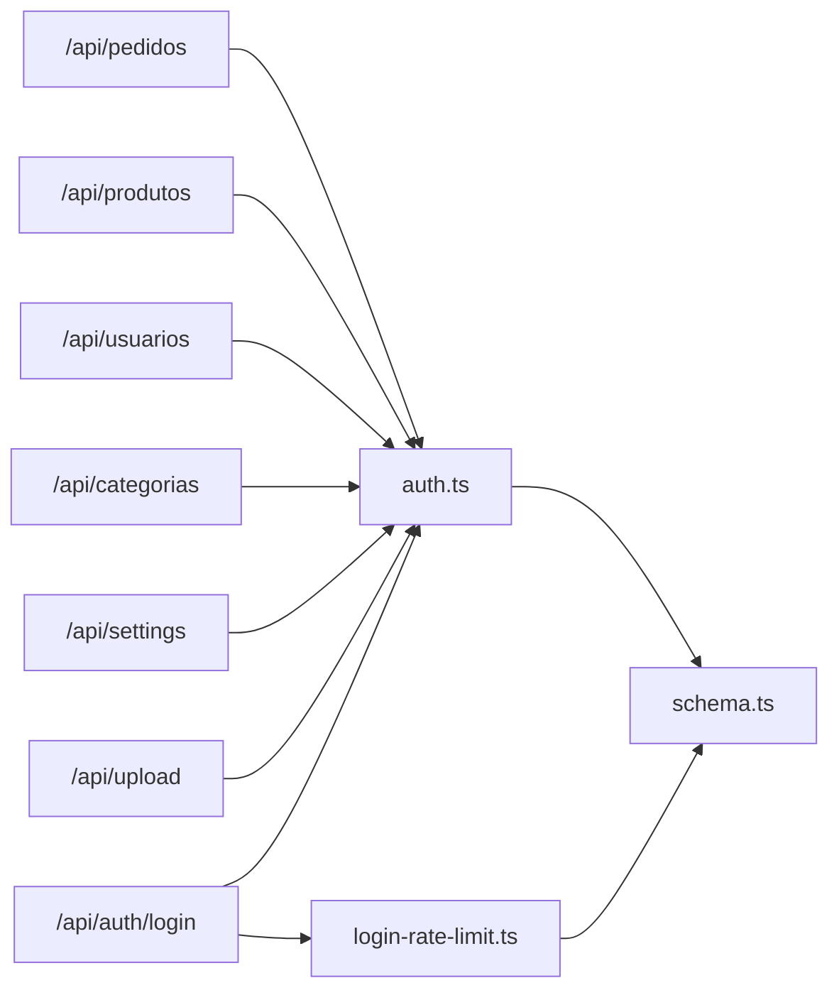

# Route Protection & Middleware

<cite>
**Referenced Files in This Document**
- [auth.ts](file://src/lib/auth.ts)
- [login-rate-limit.ts](file://src/lib/login-rate-limit.ts)
- [route.ts (Auth Login)](file://src/app/api/auth/login/route.ts)
- [route.ts (Pedidos)](file://src/app/api/pedidos/route.ts)
- [route.ts (Produtos)](file://src/app/api/produtos/route.ts)
- [route.ts (Usuarios)](file://src/app/api/usuarios/route.ts)
- [route.ts (Categorias)](file://src/app/api/categorias/route.ts)
- [route.ts (Settings)](file://src/app/api/settings/route.ts)
- [route.ts (Upload)](file://src/app/api/upload/route.ts)
- [schema.ts](file://src/db/schema.ts)
</cite>

## Table of Contents
1. [Introduction](#introduction)
2. [Project Structure](#project-structure)
3. [Core Components](#core-components)
4. [Architecture Overview](#architecture-overview)
5. [Detailed Component Analysis](#detailed-component-analysis)
6. [Dependency Analysis](#dependency-analysis)
7. [Performance Considerations](#performance-considerations)
8. [Troubleshooting Guide](#troubleshooting-guide)
9. [Conclusion](#conclusion)
10. [Appendices](#appendices)

## Introduction
This document explains how the Meu Cardápio application protects routes and enforces role-based access control using a consistent middleware pattern. It focuses on the requireAuth function, its usage across API endpoints, and how to implement protected routes for different roles: admin-only, kitchen staff, and public customer access. It also covers error handling for unauthorized access, response formatting, practical examples, testing strategies, and debugging tips.

## Project Structure
The authentication and authorization logic is centralized in a library module and consumed by Next.js API routes. The core pieces are:
- Authentication helpers and role checks in the auth library
- Rate limiting for login attempts
- API routes that enforce permissions before processing requests
- Database schema defining users and their roles

**Diagram sources**
- [auth.ts:51-82](file://src/lib/auth.ts#L51-L82)
- [login-rate-limit.ts:45-97](file://src/lib/login-rate-limit.ts#L45-L97)
- [route.ts (Auth Login):16-79](file://src/app/api/auth/login/route.ts#L16-L79)
- [route.ts (Pedidos):15-253](file://src/app/api/pedidos/route.ts#L15-L253)
- [route.ts (Produtos):6-53](file://src/app/api/produtos/route.ts#L6-L53)
- [route.ts (Usuarios):7-79](file://src/app/api/usuarios/route.ts#L7-L79)
- [route.ts (Categorias):8-28](file://src/app/api/categorias/route.ts#L8-L28)
- [route.ts (Settings):7-35](file://src/app/api/settings/route.ts#L7-L35)
- [route.ts (Upload):14-58](file://src/app/api/upload/route.ts#L14-L58)

**Section sources**
- [auth.ts:51-82](file://src/lib/auth.ts#L51-L82)
- [login-rate-limit.ts:45-97](file://src/lib/login-rate-limit.ts#L45-L97)
- [route.ts (Auth Login):16-79](file://src/app/api/auth/login/route.ts#L16-L79)
- [route.ts (Pedidos):15-253](file://src/app/api/pedidos/route.ts#L15-L253)
- [route.ts (Produtos):6-53](file://src/app/api/produtos/route.ts#L6-L53)
- [route.ts (Usuarios):7-79](file://src/app/api/usuarios/route.ts#L7-L79)
- [route.ts (Categorias):8-28](file://src/app/api/categorias/route.ts#L8-L28)
- [route.ts (Settings):7-35](file://src/app/api/settings/route.ts#L7-L35)
- [route.ts (Upload):14-58](file://src/app/api/upload/route.ts#L14-L58)

## Core Components
- Role types and labels:
  - Roles: admin, cozinha, atendente
  - Labels map for display purposes
- Cookie-based session:
  - setAuthCookies sets per-role cookies with secure options
  - clearAuthCookies removes all role cookies
  - getAuthRole reads the active role from cookies
- Authorization helpers:
  - requireAuth(allowedRoles) returns either an authorized context or a NextResponse error
  - requireAdmin() restricts to admin only
  - requireKitchen() allows admin and cozinha
  - isNextResponse type guard to handle early returns
- Login rate limiting:
  - checkLoginRateLimit prevents brute-force attacks
  - registerFailedLogin tracks failures and applies lockout
  - clearLoginRateLimit resets counters on success
  - rateLimitError formats standardized rate limit responses

**Section sources**
- [auth.ts:5-11](file://src/lib/auth.ts#L5-L11)
- [auth.ts:13-19](file://src/lib/auth.ts#L13-L19)
- [auth.ts:21-27](file://src/lib/auth.ts#L21-L27)
- [auth.ts:29-37](file://src/lib/auth.ts#L29-L37)
- [auth.ts:39-57](file://src/lib/auth.ts#L39-L57)
- [auth.ts:59-82](file://src/lib/auth.ts#L59-L82)
- [login-rate-limit.ts:5-6](file://src/lib/login-rate-limit.ts#L5-L6)
- [login-rate-limit.ts:19-26](file://src/lib/login-rate-limit.ts#L19-L26)
- [login-rate-limit.ts:45-64](file://src/lib/login-rate-limit.ts#L45-L64)
- [login-rate-limit.ts:66-97](file://src/lib/login-rate-limit.ts#L66-L97)
- [login-rate-limit.ts:99-115](file://src/lib/login-rate-limit.ts#L99-L115)

## Architecture Overview
The application uses a simple but effective cookie-based session model. On successful login, a role-specific cookie is set. Protected API routes call requireAuth or role-specific helpers to validate access before executing business logic. Unauthorized or forbidden requests return consistent JSON errors with appropriate HTTP status codes.

**Diagram sources**
- [route.ts (Auth Login):16-79](file://src/app/api/auth/login/route.ts#L16-L79)
- [login-rate-limit.ts:45-97](file://src/lib/login-rate-limit.ts#L45-L97)
- [auth.ts:39-57](file://src/lib/auth.ts#L39-L57)

## Detailed Component Analysis

### Authentication Middleware: requireAuth and Helpers
- Purpose: Centralized authorization check for API routes.
- Behavior:
  - Reads current role via getAuthRole
  - If no role: returns 401 with a generic unauthorized message
  - If role is admin or included in allowed list: returns authorized context
  - Otherwise: returns 403 with a permission denied message
- Usage pattern:
  - Call requireAuth([...roles]) at the top of route handlers
  - Use isNextResponse to short-circuit if an error response was returned
  - Proceed with business logic when authorized

**Diagram sources**
- [auth.ts:51-82](file://src/lib/auth.ts#L51-L82)

**Section sources**
- [auth.ts:51-82](file://src/lib/auth.ts#L51-L82)

### Login Flow and Rate Limiting
- Validates PIN format and length
- Checks rate limits to prevent brute force
- Verifies PIN against stored hashes
- Sets role-specific cookies on success
- Clears rate limit counters on success
- Returns standardized errors for invalid input, wrong PIN, and rate limit exceeded

**Diagram sources**
- [route.ts (Auth Login):16-79](file://src/app/api/auth/login/route.ts#L16-L79)
- [login-rate-limit.ts:45-97](file://src/lib/login-rate-limit.ts#L45-L97)
- [auth.ts:39-57](file://src/lib/auth.ts#L39-L57)

**Section sources**
- [route.ts (Auth Login):16-79](file://src/app/api/auth/login/route.ts#L16-L79)
- [login-rate-limit.ts:45-97](file://src/lib/login-rate-limit.ts#L45-L97)

### Protected API Routes Examples

#### Admin-only endpoints
- Users management: GET and POST require admin
- Categories update: PUT requires admin
- Settings update: POST requires admin
- Upload images: POST requires admin

These routes call requireAdmin and use isNextResponse to short-circuit on unauthorized or forbidden responses.

**Section sources**
- [route.ts (Usuarios):7-79](file://src/app/api/usuarios/route.ts#L7-L79)
- [route.ts (Categorias):8-28](file://src/app/api/categorias/route.ts#L8-L28)
- [route.ts (Settings):16-35](file://src/app/api/settings/route.ts#L16-L35)
- [route.ts (Upload):14-58](file://src/app/api/upload/route.ts#L14-L58)

#### Kitchen staff restricted endpoints
- Pedido status updates and deletions require kitchen access (admin or cozinha)

These routes call requireKitchen and use isNextResponse to handle early returns.

**Section sources**
- [route.ts (Pedidos):192-253](file://src/app/api/pedidos/route.ts#L192-L253)

#### Public customer access with optional authenticated behavior
- Product listing:
  - Unauthenticated clients receive only active products
  - Admins can see all products (including inactive)
- Order creation:
  - Any client can create orders without authentication
  - Full order listing requires staff roles (admin, cozinha, atendente)

**Section sources**
- [route.ts (Produtos):6-16](file://src/app/api/produtos/route.ts#L6-L16)
- [route.ts (Pedidos):15-63](file://src/app/api/pedidos/route.ts#L15-L63)

### Error Handling and Response Formatting
- Unauthorized (401): Returned when no role is present
- Forbidden (403): Returned when role exists but lacks permission
- Validation errors (400): Returned for malformed inputs
- Rate limit (429): Returned when too many failed login attempts
- Server errors (500): Returned for unexpected exceptions

All errors follow a consistent JSON shape with an error field and appropriate HTTP status codes.

**Section sources**
- [auth.ts:63-82](file://src/lib/auth.ts#L63-L82)
- [login-rate-limit.ts:108-115](file://src/lib/login-rate-limit.ts#L108-L115)
- [route.ts (Pedidos):59-62](file://src/app/api/pedidos/route.ts#L59-L62)
- [route.ts (Produtos):12-15](file://src/app/api/produtos/route.ts#L12-L15)
- [route.ts (Usuarios):15-18](file://src/app/api/usuarios/route.ts#L15-L18)
- [route.ts (Settings):31-35](file://src/app/api/settings/route.ts#L31-L35)
- [route.ts (Upload):54-58](file://src/app/api/upload/route.ts#L54-L58)

### Data Models and Roles
- User roles: admin, cozinha, atendente
- Stored securely with hashed PINs
- Role cookies determine session privileges

**Diagram sources**
- [schema.ts:42-48](file://src/db/schema.ts#L42-L48)

**Section sources**
- [schema.ts:42-48](file://src/db/schema.ts#L42-L48)

## Dependency Analysis
- API routes depend on:
  - lib/auth.ts for role checks and cookie utilities
  - lib/login-rate-limit.ts for login security
  - Database schema for data operations
- Cohesion:
  - Authorization logic is centralized in auth.ts, improving maintainability
  - Each route handles domain-specific validation and business logic
- Coupling:
  - Routes are loosely coupled to auth helpers via well-defined interfaces
  - Rate limiting is isolated and reusable across login flows

**Diagram sources**
- [auth.ts:51-82](file://src/lib/auth.ts#L51-L82)
- [login-rate-limit.ts:45-97](file://src/lib/login-rate-limit.ts#L45-L97)
- [route.ts (Pedidos):15-253](file://src/app/api/pedidos/route.ts#L15-L253)
- [route.ts (Produtos):6-53](file://src/app/api/produtos/route.ts#L6-L53)
- [route.ts (Usuarios):7-79](file://src/app/api/usuarios/route.ts#L7-L79)
- [route.ts (Categorias):8-28](file://src/app/api/categorias/route.ts#L8-L28)
- [route.ts (Settings):7-35](file://src/app/api/settings/route.ts#L7-L35)
- [route.ts (Upload):14-58](file://src/app/api/upload/route.ts#L14-L58)
- [route.ts (Auth Login):16-79](file://src/app/api/auth/login/route.ts#L16-L79)
- [schema.ts:42-48](file://src/db/schema.ts#L42-L48)

**Section sources**
- [auth.ts:51-82](file://src/lib/auth.ts#L51-L82)
- [login-rate-limit.ts:45-97](file://src/lib/login-rate-limit.ts#L45-L97)
- [schema.ts:42-48](file://src/db/schema.ts#L42-L48)

## Performance Considerations
- Authorization checks are lightweight: reading cookies and comparing roles
- Rate limiting uses database-backed tracking; ensure indexes on identifiers if scaling
- Avoid unnecessary role checks on public endpoints (e.g., product listing for customers)
- Cache considerations: product listing uses caching helpers; keep cache invalidation consistent after writes

[No sources needed since this section provides general guidance]

## Troubleshooting Guide
Common issues and how to debug them:
- 401 Unauthorized:
  - Ensure login succeeded and cookies were set correctly
  - Verify getAuthRole reads the expected cookie names
- 403 Forbidden:
  - Confirm the user’s role is included in the allowed list for the endpoint
  - Check requireAuth or role-specific helpers used in the route
- 429 Too Many Attempts:
  - Investigate failed login attempts and lockout duration
  - Clear rate limit state after successful login
- Inconsistent behavior between admin and non-admin views:
  - Validate role detection and conditional logic in routes (e.g., product visibility)

Use logging around critical sections and inspect request cookies and headers during development.

**Section sources**
- [auth.ts:51-82](file://src/lib/auth.ts#L51-L82)
- [login-rate-limit.ts:45-97](file://src/lib/login-rate-limit.ts#L45-L97)
- [route.ts (Auth Login):16-79](file://src/app/api/auth/login/route.ts#L16-L79)

## Conclusion
The Meu Cardápio application implements a robust, centralized authorization system using cookie-based sessions and role checks. The requireAuth helper and its role-specific variants provide a consistent pattern for protecting API endpoints. Combined with login rate limiting and standardized error responses, this approach ensures secure and maintainable route protection across admin, kitchen, and customer-facing features.

[No sources needed since this section summarizes without analyzing specific files]

## Appendices

### Practical Examples: Protecting Various API Routes
- Admin-only:
  - Users management: requireAdmin
  - Category updates: requireAdmin
  - Settings updates: requireAdmin
  - Image uploads: requireAdmin
- Kitchen staff:
  - Pedido status updates and deletions: requireKitchen
- Public with optional authenticated behavior:
  - Product listing: getAuthRole to differentiate admin vs customer view
  - Order creation: open to all; full order listing requires staff roles

**Section sources**
- [route.ts (Usuarios):7-79](file://src/app/api/usuarios/route.ts#L7-L79)
- [route.ts (Categorias):8-28](file://src/app/api/categorias/route.ts#L8-L28)
- [route.ts (Settings):16-35](file://src/app/api/settings/route.ts#L16-L35)
- [route.ts (Upload):14-58](file://src/app/api/upload/route.ts#L14-L58)
- [route.ts (Pedidos):192-253](file://src/app/api/pedidos/route.ts#L192-L253)
- [route.ts (Produtos):6-16](file://src/app/api/produtos/route.ts#L6-L16)
- [route.ts (Pedidos):15-63](file://src/app/api/pedidos/route.ts#L15-L63)

### Testing Strategies for Protected Routes
- Unit tests for auth helpers:
  - Mock cookies to simulate roles and test requireAuth outcomes
  - Validate role normalization and label mapping
- Integration tests for API routes:
  - Send requests with and without cookies to assert 401/403 behavior
  - Test role-specific endpoints with valid and invalid roles
- Rate limiting tests:
  - Simulate multiple failed logins to verify 429 responses
  - Ensure counters reset on successful login

[No sources needed since this section provides general guidance]

### Debugging Authentication Issues
- Inspect cookies in browser dev tools or request logs
- Log role resolution and authorization decisions in development
- Verify environment variables for secure cookie settings in production
- Check rate limit table entries for stuck blocks

**Section sources**
- [auth.ts:13-19](file://src/lib/auth.ts#L13-L19)
- [login-rate-limit.ts:28-39](file://src/lib/login-rate-limit.ts#L28-L39)