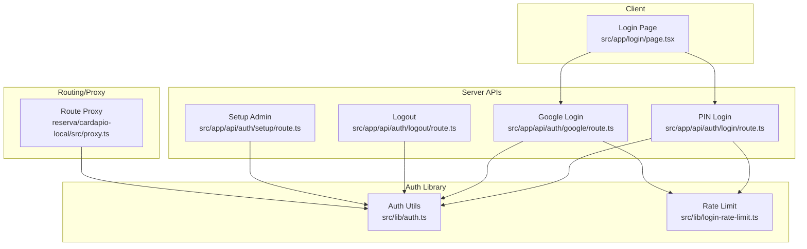
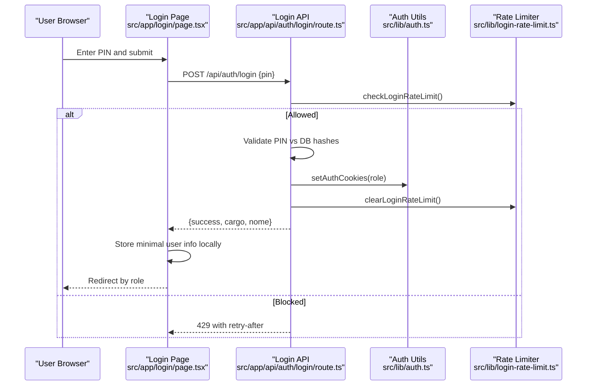
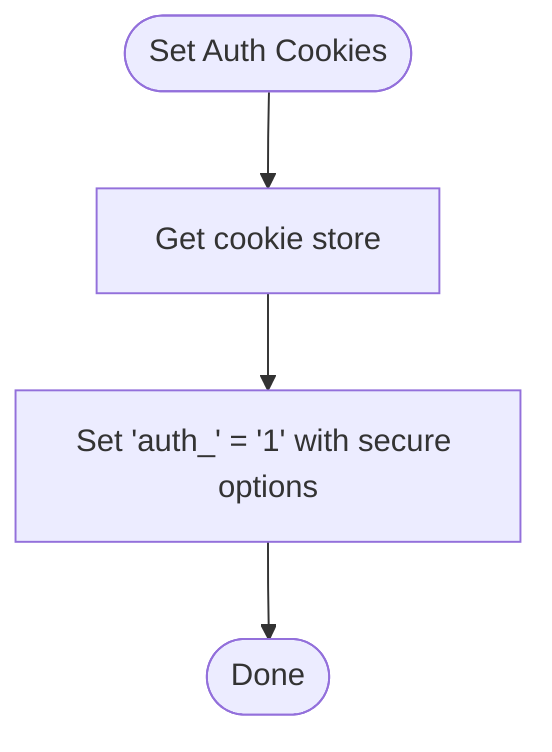
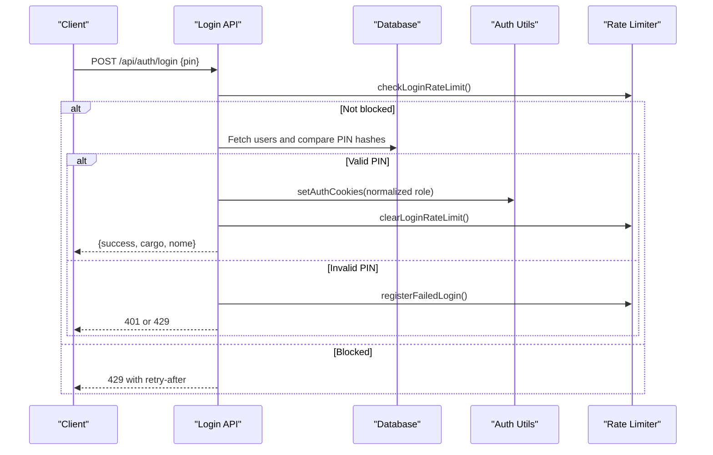
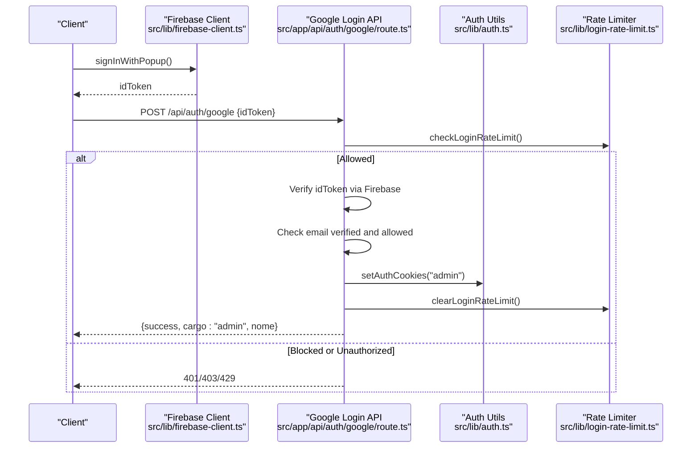
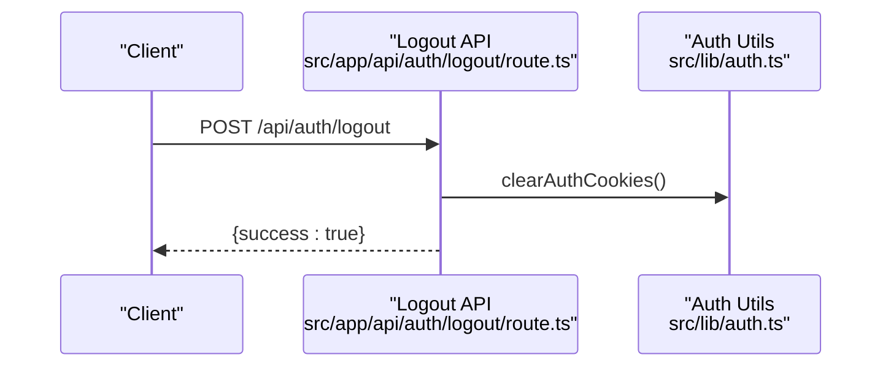
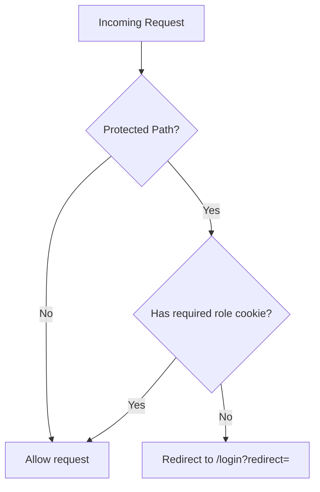
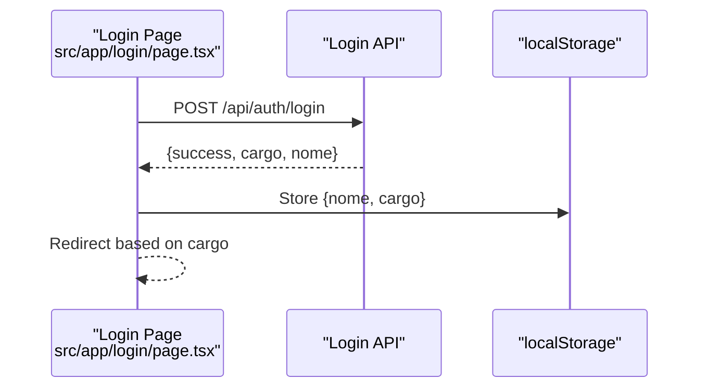
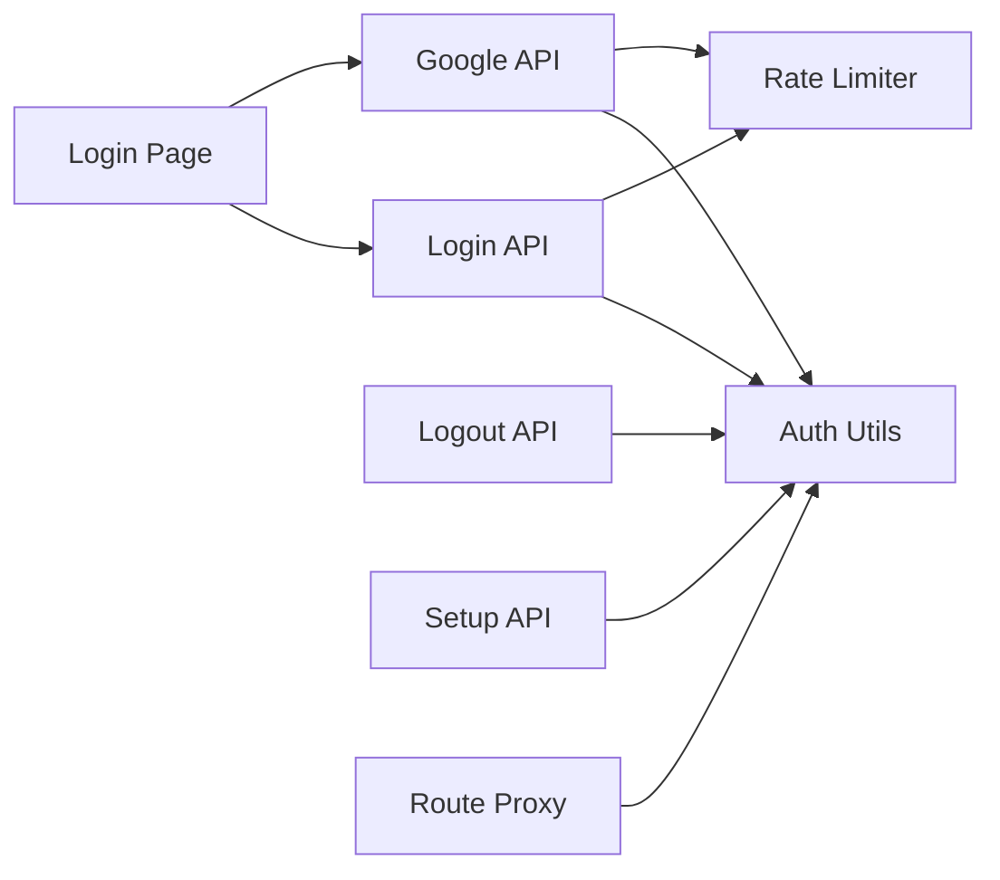

# Session Management

<cite>
**Referenced Files in This Document**
- [auth.ts](file://src/lib/auth.ts)
- [login route.ts](file://src/app/api/auth/login/route.ts)
- [logout route.ts](file://src/app/api/auth/logout/route.ts)
- [google route.ts](file://src/app/api/auth/google/route.ts)
- [setup route.ts](file://src/app/api/auth/setup/route.ts)
- [login page.tsx](file://src/app/login/page.tsx)
- [firebase-client.ts](file://src/lib/firebase-client.ts)
- [proxy.ts](file://reserva/cardapio-local/src/proxy.ts)
- [login-rate-limit.ts](file://src/lib/login-rate-limit.ts)
</cite>

## Table of Contents
1. Introduction
2. Project Structure
3. Core Components
4. Architecture Overview
5. Detailed Component Analysis
6. Dependency Analysis
7. Performance Considerations
8. Troubleshooting Guide
9. Conclusion

## Introduction
This document explains how session management is implemented using cookie-based authentication in the Next.js application. It covers how authentication cookies are created with secure attributes, how roles are encoded in separate cookies per user type, how sessions persist across navigations, and how logout terminates sessions. It also addresses security considerations such as CSRF protection, session hijacking prevention, rate limiting, and production-ready cookie configuration.

## Project Structure
The session management spans server-side API routes, a shared authentication library, and client-side login UI:
- Server-side auth utilities define cookie options and helpers for setting/clearing role cookies and enforcing authorization.
- API routes handle PIN-based login, Google OAuth login, and logout.
- The login page orchestrates user interactions and redirects based on roles.
- A proxy enforces route-level access control by inspecting cookies.
- Rate limiting protects login endpoints from brute-force attempts.

**Diagram sources**
- [login page.tsx:1-160](file://src/app/login/page.tsx#L1-L160)
- [login route.ts:1-80](file://src/app/api/auth/login/route.ts#L1-L80)
- [google route.ts:1-77](file://src/app/api/auth/google/route.ts#L1-L77)
- [logout route.ts:1-15](file://src/app/api/auth/logout/route.ts#L1-L15)
- [setup route.ts:1-45](file://src/app/api/auth/setup/route.ts#L1-L45)
- [auth.ts:1-82](file://src/lib/auth.ts#L1-L82)
- [login-rate-limit.ts:1-115](file://src/lib/login-rate-limit.ts#L1-L115)
- [proxy.ts:1-72](file://reserva/cardapio-local/src/proxy.ts#L1-L72)

**Section sources**
- [auth.ts:1-82](file://src/lib/auth.ts#L1-L82)
- [login route.ts:1-80](file://src/app/api/auth/login/route.ts#L1-L80)
- [logout route.ts:1-15](file://src/app/api/auth/logout/route.ts#L1-L15)
- [google route.ts:1-77](file://src/app/api/auth/google/route.ts#L1-L77)
- [setup route.ts:1-45](file://src/app/api/auth/setup/route.ts#L1-L45)
- [login page.tsx:1-160](file://src/app/login/page.tsx#L1-L160)
- [firebase-client.ts:1-26](file://src/lib/firebase-client.ts#L1-L26)
- [proxy.ts:1-72](file://reserva/cardapio-local/src/proxy.ts#L1-L72)
- [login-rate-limit.ts:1-115](file://src/lib/login-rate-limit.ts#L1-L115)

## Core Components
- Authentication library (auth.ts): Defines cookie options, role types, and functions to set/clear role cookies, read current role, and enforce authorization.
- Login API (login route.ts): Validates PIN against stored hashes, sets role-specific cookies, and clears rate limit counters on success.
- Google login API (google route.ts): Validates Firebase ID token, checks allowed admin emails, sets admin cookie, and clears rate limit counters.
- Logout API (logout route.ts): Clears all role cookies to terminate the session.
- Setup API (setup route.ts): Creates an initial admin user with a random PIN hash if not already present.
- Client login page (login page.tsx): Submits credentials, stores minimal user info locally for UI state, and redirects based on role.
- Route proxy (proxy.ts): Enforces access control by checking role cookies for protected routes.
- Rate limiter (login-rate-limit.ts): Tracks failed attempts per IP and blocks further attempts temporarily.

**Section sources**
- [auth.ts:1-82](file://src/lib/auth.ts#L1-L82)
- [login route.ts:1-80](file://src/app/api/auth/login/route.ts#L1-L80)
- [google route.ts:1-77](file://src/app/api/auth/google/route.ts#L1-L77)
- [logout route.ts:1-15](file://src/app/api/auth/logout/route.ts#L1-L15)
- [setup route.ts:1-45](file://src/app/api/auth/setup/route.ts#L1-L45)
- [login page.tsx:1-160](file://src/app/login/page.tsx#L1-L160)
- [proxy.ts:1-72](file://reserva/cardapio-local/src/proxy.ts#L1-L72)
- [login-rate-limit.ts:1-115](file://src/lib/login-rate-limit.ts#L1-L115)

## Architecture Overview
The session lifecycle revolves around HTTP-only cookies that encode the authenticated role. On successful authentication, a role-specific cookie is set. Subsequent requests carry these cookies automatically, enabling both server-side authorization and client-side routing decisions.

**Diagram sources**
- [login page.tsx:1-160](file://src/app/login/page.tsx#L1-L160)
- [login route.ts:1-80](file://src/app/api/auth/login/route.ts#L1-L80)
- [auth.ts:1-82](file://src/lib/auth.ts#L1-L82)
- [login-rate-limit.ts:1-115](file://src/lib/login-rate-limit.ts#L1-L115)

## Detailed Component Analysis

### Cookie Configuration and Role Encoding
- Cookie options include httpOnly, secure (production only), maxAge (one week), path "/", and sameSite "lax". These settings protect against XSS and restrict cross-site sending while allowing typical navigation flows.
- Roles are encoded as separate cookies named after each role (e.g., auth_admin, auth_cozinha, auth_atendente). Presence of a cookie indicates an active session for that role.
- getAuthRole reads cookies to determine the current role; requireAuth enforces minimum required roles.

**Diagram sources**
- [auth.ts:13-42](file://src/lib/auth.ts#L13-L42)

**Section sources**
- [auth.ts:13-42](file://src/lib/auth.ts#L13-L42)
- [auth.ts:51-57](file://src/lib/auth.ts#L51-L57)
- [auth.ts:63-74](file://src/lib/auth.ts#L63-L74)

### PIN-Based Login Flow
- The login endpoint validates input, applies rate limiting, verifies the PIN against hashed values, normalizes the role, sets the appropriate role cookie, clears rate limit counters, and returns a success payload.

**Diagram sources**
- [login route.ts:1-80](file://src/app/api/auth/login/route.ts#L1-L80)
- [auth.ts:39-42](file://src/lib/auth.ts#L39-L42)
- [login-rate-limit.ts:45-97](file://src/lib/login-rate-limit.ts#L45-L97)

**Section sources**
- [login route.ts:1-80](file://src/app/api/auth/login/route.ts#L1-L80)
- [auth.ts:29-42](file://src/lib/auth.ts#L29-L42)
- [login-rate-limit.ts:45-97](file://src/lib/login-rate-limit.ts#L45-L97)

### Google OAuth Login Flow
- The Google login endpoint validates the Firebase ID token, ensures the email is verified and allowed, sets the admin cookie, clears rate limit counters, and returns success data.

**Diagram sources**
- [google route.ts:1-77](file://src/app/api/auth/google/route.ts#L1-L77)
- [firebase-client.ts:1-26](file://src/lib/firebase-client.ts#L1-L26)
- [auth.ts:39-42](file://src/lib/auth.ts#L39-L42)
- [login-rate-limit.ts:45-97](file://src/lib/login-rate-limit.ts#L45-L97)

**Section sources**
- [google route.ts:1-77](file://src/app/api/auth/google/route.ts#L1-L77)
- [firebase-client.ts:1-26](file://src/lib/firebase-client.ts#L1-L26)
- [auth.ts:39-42](file://src/lib/auth.ts#L39-L42)
- [login-rate-limit.ts:45-97](file://src/lib/login-rate-limit.ts#L45-L97)

### Logout and Session Termination
- The logout endpoint clears all role cookies, effectively terminating the session. Clients should clear any local UI state accordingly.

**Diagram sources**
- [logout route.ts:1-15](file://src/app/api/auth/logout/route.ts#L1-L15)
- [auth.ts:44-49](file://src/lib/auth.ts#L44-L49)

**Section sources**
- [logout route.ts:1-15](file://src/app/api/auth/logout/route.ts#L1-L15)
- [auth.ts:44-49](file://src/lib/auth.ts#L44-L49)

### Route-Level Access Control
- The proxy inspects role cookies to enforce access rules for protected paths, redirecting unauthenticated or unauthorized users to the login page with a redirect parameter.

**Diagram sources**
- [proxy.ts:1-72](file://reserva/cardapio-local/src/proxy.ts#L1-L72)

**Section sources**
- [proxy.ts:1-72](file://reserva/cardapio-local/src/proxy.ts#L1-L72)

### Client-Side Session Persistence
- After successful login, the client stores minimal user information locally for UI purposes and uses role cookies for authoritative authentication. Navigation relies on cookies being sent automatically with requests.

**Diagram sources**
- [login page.tsx:1-160](file://src/app/login/page.tsx#L1-L160)

**Section sources**
- [login page.tsx:1-160](file://src/app/login/page.tsx#L1-L160)

## Dependency Analysis
- API routes depend on auth.ts for cookie handling and authorization helpers.
- Login endpoints integrate with login-rate-limit.ts for brute-force protection.
- Google login depends on firebase-client.ts for obtaining the ID token.
- The proxy depends on cookie names defined by auth.ts to enforce access control.

**Diagram sources**
- [login route.ts:1-80](file://src/app/api/auth/login/route.ts#L1-L80)
- [google route.ts:1-77](file://src/app/api/auth/google/route.ts#L1-L77)
- [logout route.ts:1-15](file://src/app/api/auth/logout/route.ts#L1-L15)
- [setup route.ts:1-45](file://src/app/api/auth/setup/route.ts#L1-L45)
- [auth.ts:1-82](file://src/lib/auth.ts#L1-L82)
- [login-rate-limit.ts:1-115](file://src/lib/login-rate-limit.ts#L1-L115)
- [login page.tsx:1-160](file://src/app/login/page.tsx#L1-L160)

**Section sources**
- [login route.ts:1-80](file://src/app/api/auth/login/route.ts#L1-L80)
- [google route.ts:1-77](file://src/app/api/auth/google/route.ts#L1-L77)
- [logout route.ts:1-15](file://src/app/api/auth/logout/route.ts#L1-L15)
- [setup route.ts:1-45](file://src/app/api/auth/setup/route.ts#L1-L45)
- [auth.ts:1-82](file://src/lib/auth.ts#L1-L82)
- [login-rate-limit.ts:1-115](file://src/lib/login-rate-limit.ts#L1-L115)
- [login page.tsx:1-160](file://src/app/login/page.tsx#L1-L160)

## Performance Considerations
- Cookie size is minimal since only presence flags are used; this keeps headers small and reduces bandwidth overhead.
- Rate limiting uses database-backed counters to prevent abuse without heavy in-memory structures.
- bcrypt hashing adds CPU cost during login verification; ensure adequate server resources and consider caching strategies where appropriate.

[No sources needed since this section provides general guidance]

## Troubleshooting Guide
Common issues and resolutions:
- Missing or expired cookies: Ensure cookies are set correctly and not blocked by browser settings. Verify httpOnly and secure flags align with your environment.
- CORS or SameSite restrictions: If cookies are not sent cross-origin, adjust sameSite and ensure proper domain configuration.
- Brute-force lockout: If login is blocked, wait for the retry-after period or clear rate limit counters after successful login.
- Google login failures: Confirm Firebase configuration and allowed admin emails. Validate idToken format and network connectivity.
- Logout not working: Ensure all role cookies are cleared and client-side state is reset.

**Section sources**
- [login-rate-limit.ts:45-97](file://src/lib/login-rate-limit.ts#L45-L97)
- [google route.ts:1-77](file://src/app/api/auth/google/route.ts#L1-L77)
- [logout route.ts:1-15](file://src/app/api/auth/logout/route.ts#L1-L15)
- [auth.ts:13-42](file://src/lib/auth.ts#L13-L42)

## Conclusion
The session management system leverages secure, HTTP-only cookies to represent authenticated roles, providing a robust foundation for authorization and persistence across navigations. Combined with rate limiting and strict cookie configuration, it mitigates common threats like brute-force attacks and session hijacking. For production, ensure secure flags are enabled, validate inputs, and monitor rate limiting behavior.

[No sources needed since this section summarizes without analyzing specific files]