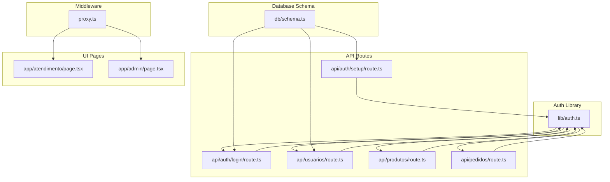
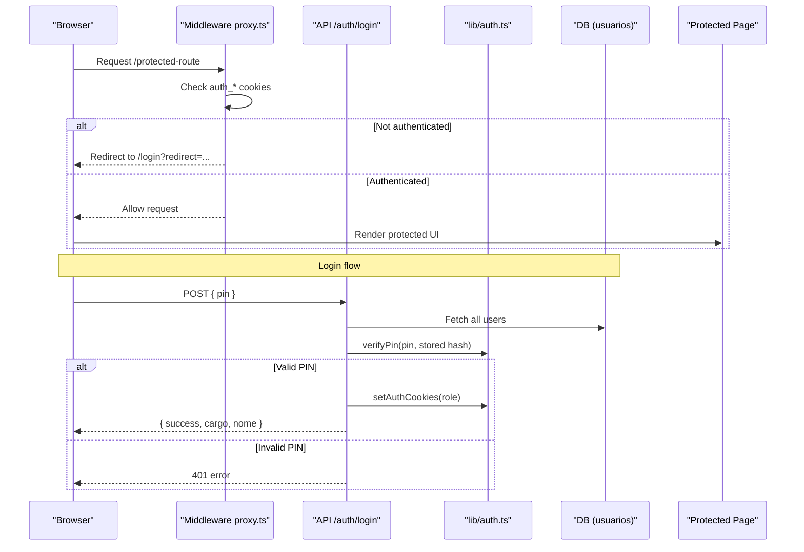
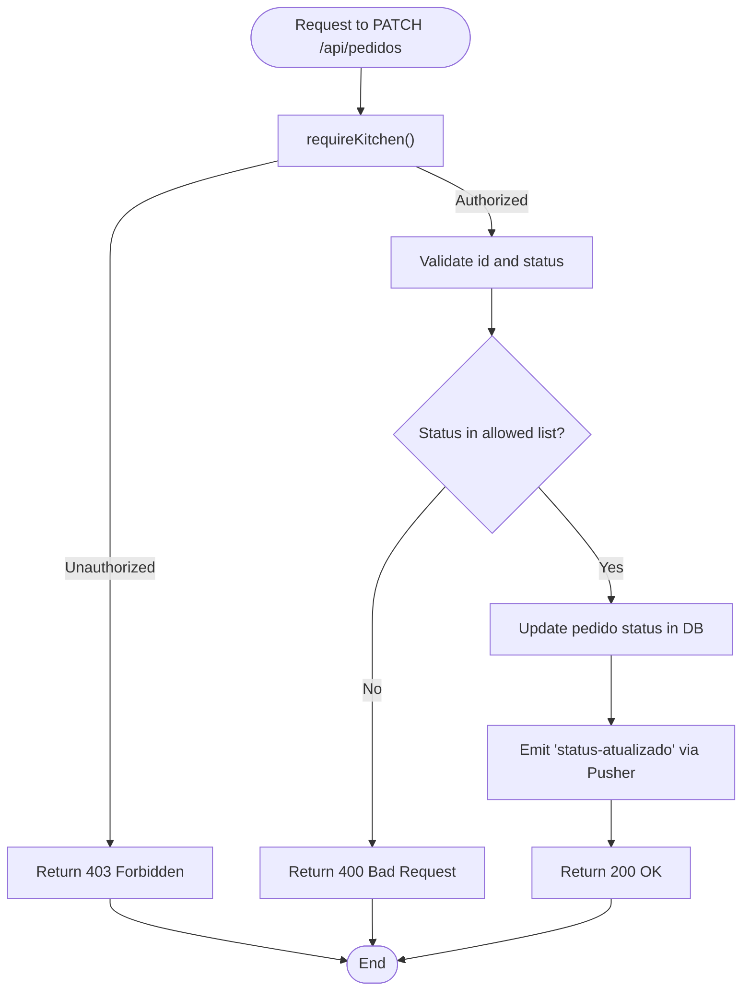
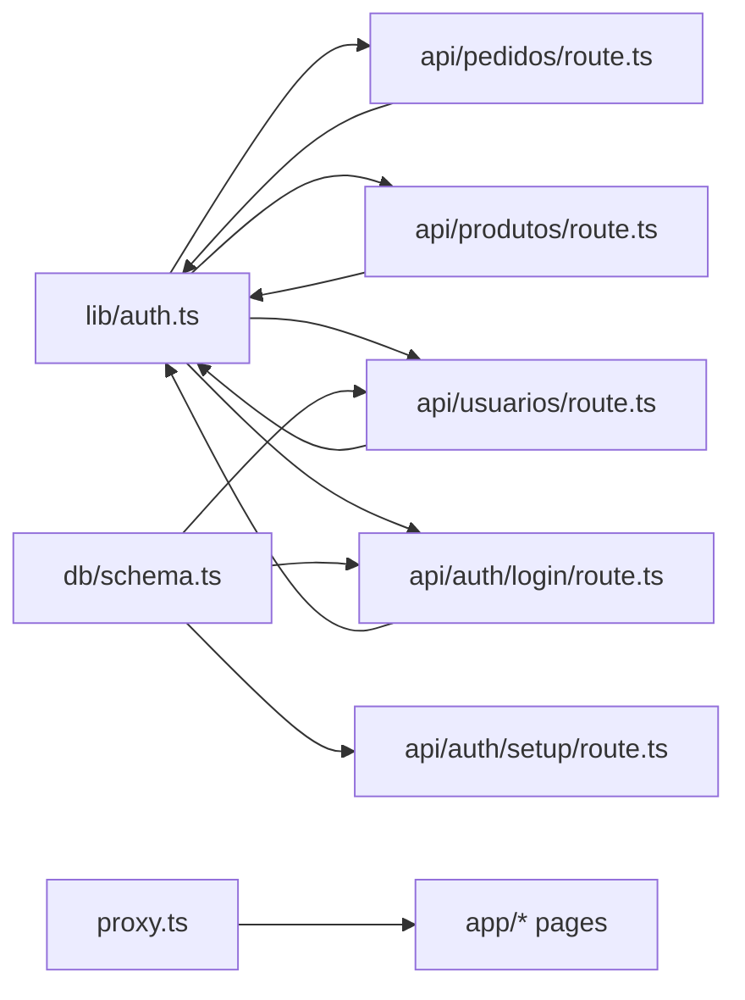

# User Roles & Permissions

<cite>
**Referenced Files in This Document**
- [auth.ts](file://src/lib/auth.ts)
- [schema.ts](file://src/db/schema.ts)
- [proxy.ts](file://src/proxy.ts)
- [login route.ts](file://src/app/api/auth/login/route.ts)
- [setup route.ts](file://src/app/api/auth/setup/route.ts)
- [usuarios route.ts](file://src/app/api/usuarios/route.ts)
- [produtos route.ts](file://src/app/api/produtos/route.ts)
- [pedidos route.ts](file://src/app/api/pedidos/route.ts)
- [atendimento page.tsx](file://src/app/atendimento/page.tsx)
- [admin page.tsx](file://src/app/admin/page.tsx)
</cite>

## Table of Contents
1. Introduction
2. Project Structure
3. Core Components
4. Architecture Overview
5. Detailed Component Analysis
6. Dependency Analysis
7. Performance Considerations
8. Troubleshooting Guide
9. Conclusion

## Introduction
This document explains the user roles and permissions system in the Meu Cardápio application. It covers the three role types:
- admin (full system access)
- cozinha (kitchen staff with order management)
- atendente (waitstaff with limited access)

It details how roles are defined, normalized, validated, and enforced across API routes and UI pages. It also documents the permission hierarchy, middleware-based protection, and examples of role assignment during user creation and conditional rendering based on roles.

## Project Structure
The roles and permissions logic is implemented across a small set of core files:
- Role definitions, normalization, and helpers live in the authentication library.
- Database schema defines the users table and its role field.
- A Next.js middleware enforces route-level access control via cookies.
- API routes enforce role checks using helper functions.
- UI pages rely on server-side redirects and API responses to reflect role-based access.

**Diagram sources**
- [auth.ts](file://src/lib/auth.ts)
- [schema.ts](file://src/db/schema.ts)
- [proxy.ts](file://src/proxy.ts)
- [login route.ts](file://src/app/api/auth/login/route.ts)
- [setup route.ts](file://src/app/api/auth/setup/route.ts)
- [usuarios route.ts](file://src/app/api/usuarios/route.ts)
- [produtos route.ts](file://src/app/api/produtos/route.ts)
- [pedidos route.ts](file://src/app/api/pedidos/route.ts)
- [atendimento page.tsx](file://src/app/atendimento/page.tsx)
- [admin page.tsx](file://src/app/admin/page.tsx)

**Section sources**
- [auth.ts](file://src/lib/auth.ts)
- [schema.ts](file://src/db/schema.ts)
- [proxy.ts](file://src/proxy.ts)

## Core Components
- Role type and labels: The Cargo type enumerates allowed roles and includes human-readable labels for display.
- Normalization: normalizeCargo maps various input strings to canonical role values, ensuring consistent validation.
- Session cookies: setAuthCookies and getAuthRole manage role-specific cookies used by both middleware and API routes.
- Authorization helpers: requireAuth, requireAdmin, and requireKitchen provide reusable checks that return either an authorized context or an HTTP error response.
- Database model: usuarios stores user identity, role (cargo), and hashed PIN.

Key behaviors:
- Admin has full access; other roles are restricted by explicit allowlists per endpoint.
- Invalid or unknown roles are rejected early during normalization.
- Unauthorized requests receive appropriate HTTP status codes (401 for unauthenticated, 403 for forbidden).

**Section sources**
- [auth.ts](file://src/lib/auth.ts)
- [schema.ts](file://src/db/schema.ts)

## Architecture Overview
The system uses a layered approach:
- Middleware protects routes by inspecting cookies and redirecting unauthorized users.
- API endpoints validate roles using helper functions before executing business logic.
- UI pages depend on server-side protections and client-side navigation flows after login.

**Diagram sources**
- [proxy.ts](file://src/proxy.ts)
- [login route.ts](file://src/app/api/auth/login/route.ts)
- [auth.ts](file://src/lib/auth.ts)
- [schema.ts](file://src/db/schema.ts)

## Detailed Component Analysis

### Role Definition and Normalization
- Cargo type defines the three roles: admin, cozinha, atendente.
- CARGO_LABELS provides display names for each role.
- normalizeCargo accepts multiple string variants and returns a canonical role or null if invalid.

Implications:
- Input from forms or APIs must be normalized before storage or comparison.
- Unknown inputs are rejected, preventing privilege escalation through malformed data.

**Section sources**
- [auth.ts](file://src/lib/auth.ts)

### Role Storage and Validation
- The usuarios table stores:
  - id: unique identifier
  - nome: user name
  - cargo: normalized role string
  - pin: bcrypt-hashed PIN
- During login, the system verifies the PIN against stored hashes and normalizes the role before issuing session cookies.

Security notes:
- PINs are never stored in plaintext.
- Role normalization ensures only valid roles can be assigned.

**Section sources**
- [schema.ts](file://src/db/schema.ts)
- [login route.ts](file://src/app/api/auth/login/route.ts)

### Role Assignment During User Creation
- Admin-only endpoint to create users validates required fields and normalizes the role.
- Enforces a single-admin policy: prevents creating another admin when one already exists.
- Validates PIN format (numeric digits, length constraints) and hashes it before storage.

Workflow highlights:
- Only admins can add new users.
- Role normalization occurs before persistence.
- Duplicate admin creation is blocked.

**Section sources**
- [usuarios route.ts](file://src/app/api/usuarios/route.ts)
- [auth.ts](file://src/lib/auth.ts)

### Initial Setup Endpoint
- The setup endpoint creates the first admin user if none exists.
- Optionally requires a secret header to prevent accidental initialization.
- Generates a random PIN and returns it once to the caller.

Use cases:
- One-time bootstrap for new installations.
- Ensures there is always at least one admin account.

**Section sources**
- [setup route.ts](file://src/app/api/auth/setup/route.ts)

### Permission Hierarchy and API Enforcement
- requireAuth(allowedRoles):
  - Returns 401 if no role cookie is present.
  - Allows access if the current role is admin or included in allowedRoles.
  - Returns 403 otherwise.
- requireAdmin(): restricts to admin only.
- requireKitchen(): allows admin and cozinha roles.

Examples of usage:
- GET /api/produtos:
  - Admin sees all products; others see only active ones.
- PATCH /api/pedidos:
  - Requires kitchen access (admin or cozinha).
- DELETE /api/pedidos:
  - Requires kitchen access (admin or cozinha).
- GET /api/pedidos (list all):
  - Requires any authenticated role (admin, cozinha, atendente).

These patterns ensure fine-grained control over sensitive operations while allowing read access where appropriate.

**Section sources**
- [auth.ts](file://src/lib/auth.ts)
- [produtos route.ts](file://src/app/api/produtos/route.ts)
- [pedidos route.ts](file://src/app/api/pedidos/route.ts)

### Route-Level Protection via Middleware
- The middleware inspects auth_* cookies to determine the current role.
- Protects routes such as /admin, /users, /settings, /painel-pedidos, /historico-pedidos, /atendimento.
- Redirects unauthenticated or unauthorized users to /login with a redirect parameter.
- Special handling for /cozinha redirects to /painel-pedidos.

Behavior summary:
- Admin-only routes: /admin, /users, /settings.
- Kitchen + admin routes: /painel-pedidos, /historico-pedidos.
- Waitstaff route: /atendimento.
- Login redirection preserves intended destination.

**Section sources**
- [proxy.ts](file://src/proxy.ts)

### Conditional UI Rendering Based on Roles
- After login, clients navigate to role-appropriate dashboards:
  - Cozinha → /painel-pedidos
  - Admin → /admin
  - Atendente → /atendimento
- Protected pages rely on server-side enforcement; client-side navigation complements this by directing users to relevant areas.

Example flows:
- Atendimento page fetches orders and shows actions available to waitstaff.
- Admin page manages product catalog and categories.

Note:
- UI should not expose sensitive controls unless the backend confirms authorization.

**Section sources**
- [atendimento page.tsx](file://src/app/atendimento/page.tsx)
- [admin page.tsx](file://src/app/admin/page.tsx)
- [login route.ts](file://src/app/api/auth/login/route.ts)

### Data Flow and State Transitions for Orders
Order lifecycle updates are protected by role checks and emit real-time signals via Pusher.

**Diagram sources**
- [pedidos route.ts](file://src/app/api/pedidos/route.ts)

## Dependency Analysis
The roles and permissions system depends on a small set of cohesive modules:

Observations:
- Centralized auth utilities reduce duplication and ensure consistent behavior.
- Database schema is referenced by endpoints that persist or query user-related data.
- Middleware operates independently of API logic but relies on the same cookie conventions.

**Diagram sources**
- [auth.ts](file://src/lib/auth.ts)
- [schema.ts](file://src/db/schema.ts)
- [proxy.ts](file://src/proxy.ts)
- [login route.ts](file://src/app/api/auth/login/route.ts)
- [usuarios route.ts](file://src/app/api/usuarios/route.ts)
- [produtos route.ts](file://src/app/api/produtos/route.ts)
- [pedidos route.ts](file://src/app/api/pedidos/route.ts)
- [setup route.ts](file://src/app/api/auth/setup/route.ts)

**Section sources**
- [auth.ts](file://src/lib/auth.ts)
- [schema.ts](file://src/db/schema.ts)
- [proxy.ts](file://src/proxy.ts)

## Performance Considerations
- Role checks are lightweight: cookie reads and simple comparisons.
- Login flow scans all users to match PIN; consider indexing or optimizing if user count grows significantly.
- Product listing branches based on role; caching strategies can further reduce database load.
- Real-time updates use Pusher; ensure efficient event payloads and avoid excessive polling.

[No sources needed since this section provides general guidance]

## Troubleshooting Guide
Common issues and resolutions:
- 401 Unauthorized:
  - Missing or expired auth cookies. Ensure login succeeded and cookies are set.
- 403 Forbidden:
  - Insufficient role for the requested resource. Verify the user’s role and endpoint requirements.
- Invalid role errors:
  - Normalize roles using normalizeCargo before storing or comparing.
- Single-admin constraint:
  - Creating a second admin will fail; remove existing admin or use the correct role.
- PIN validation failures:
  - Ensure PIN is numeric and within the allowed length range.

Where to look:
- Middleware redirects and role checks: [proxy.ts](file://src/proxy.ts)
- API authorization helpers: [auth.ts](file://src/lib/auth.ts)
- Login flow and rate limiting: [login route.ts](file://src/app/api/auth/login/route.ts)
- User creation rules: [usuarios route.ts](file://src/app/api/usuarios/route.ts)

**Section sources**
- [proxy.ts](file://src/proxy.ts)
- [auth.ts](file://src/lib/auth.ts)
- [login route.ts](file://src/app/api/auth/login/route.ts)
- [usuarios route.ts](file://src/app/api/usuarios/route.ts)

## Conclusion
The Meu Cardápio application implements a clear and secure role-based access control system:
- Three well-defined roles: admin, cozinha, atendente.
- Centralized normalization and validation ensure consistency.
- Middleware and API helpers enforce permissions consistently across routes and endpoints.
- UI flows align with server-side protections, providing a coherent user experience.

By following the documented patterns—normalizing roles, using authorization helpers, and relying on middleware—you can safely extend the system with new features while maintaining strong access controls.