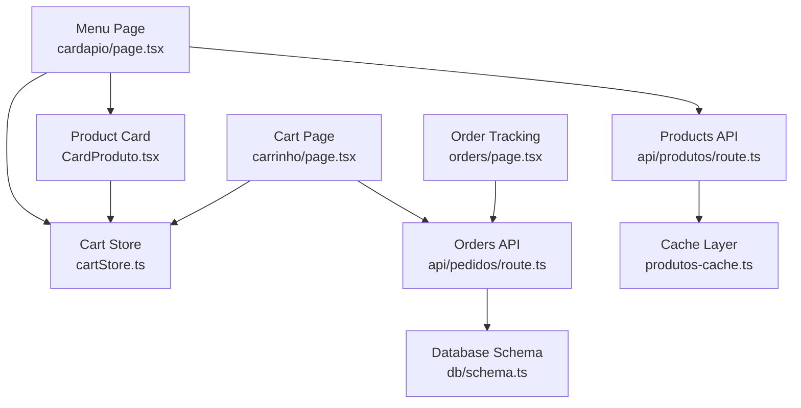
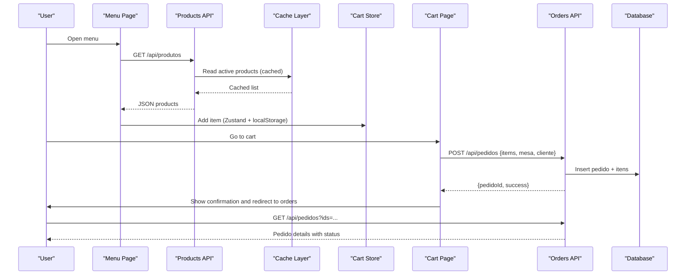
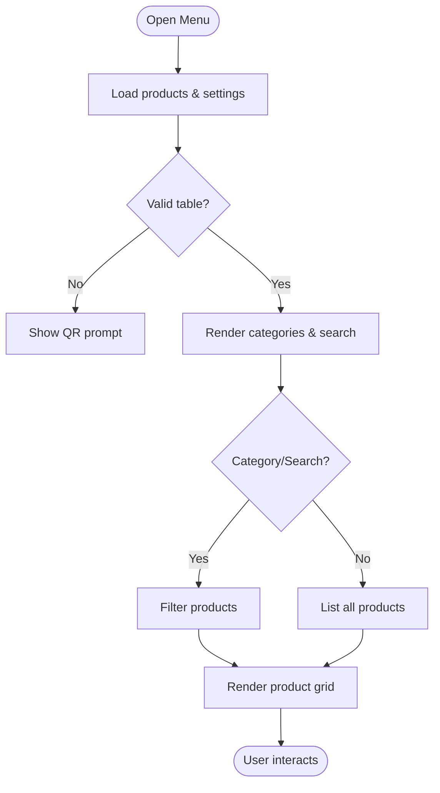
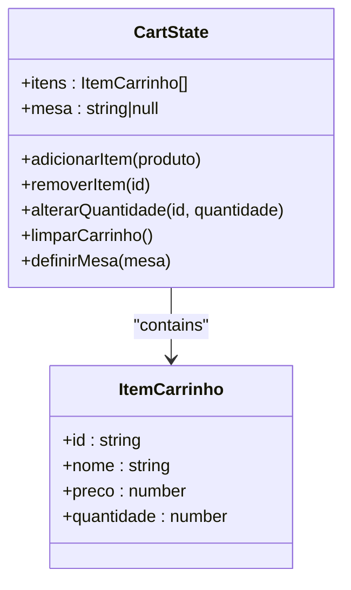
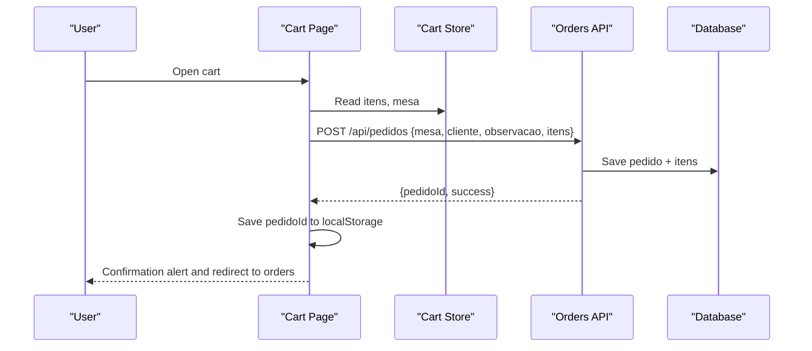
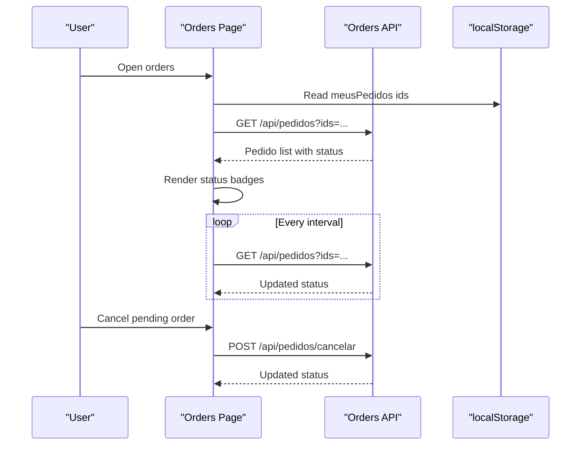
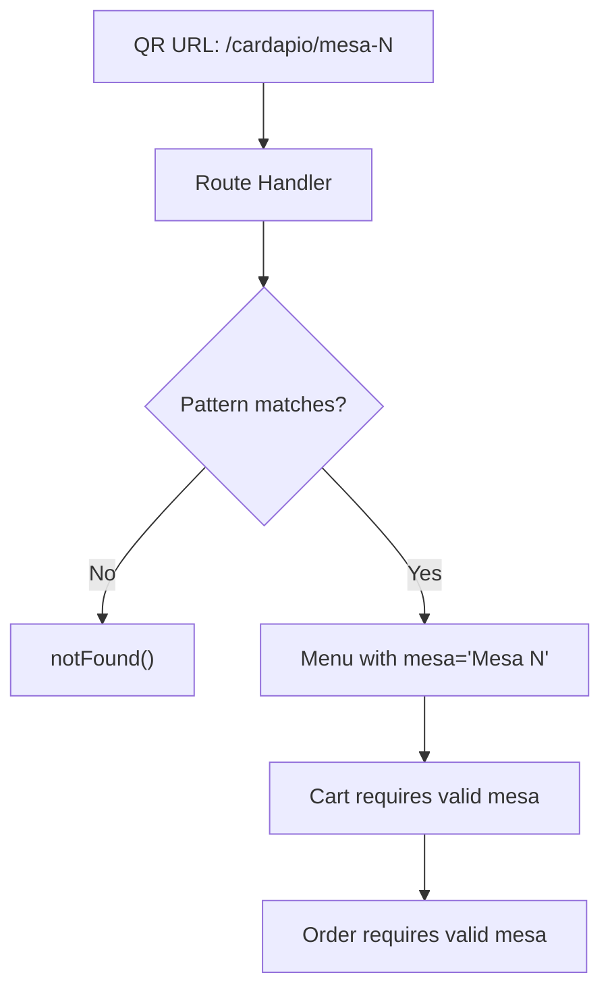
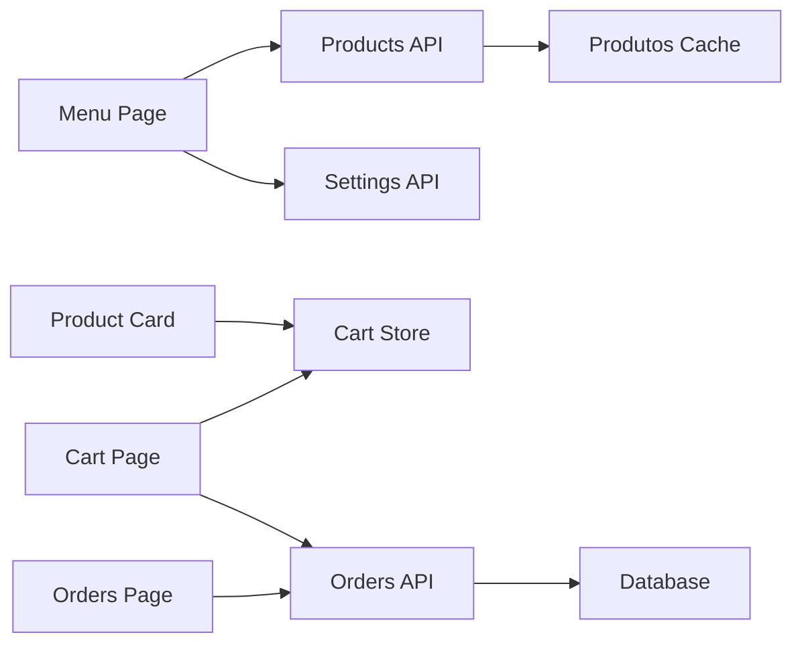

# Customer Interface

<cite>
**Referenced Files in This Document**
- [src/app/cardapio/page.tsx](file://src/app/cardapio/page.tsx)
- [src/app/cardapio/[mesa]/page.tsx](file://src/app/cardapio/[mesa]/page.tsx)
- [src/components/CardProduto.tsx](file://src/components/CardProduto.tsx)
- [src/contexts/cartStore.ts](file://src/contexts/cartStore.ts)
- [src/app/carrinho/page.tsx](file://src/app/carrinho/page.tsx)
- [src/app/orders/page.tsx](file://src/app/orders/page.tsx)
- [src/app/api/pedidos/route.ts](file://src/app/api/pedidos/route.ts)
- [src/app/api/produtos/route.ts](file://src/app/api/produtos/route.ts)
- [src/lib/produtos-cache.ts](file://src/lib/produtos-cache.ts)
- [src/db/schema.ts](file://src/db/schema.ts)
</cite>

## Table of Contents
1. [Introduction](#introduction)
2. [Project Structure](#project-structure)
3. [Core Components](#core-components)
4. [Architecture Overview](#architecture-overview)
5. [Detailed Component Analysis](#detailed-component-analysis)
6. [Dependency Analysis](#dependency-analysis)
7. [Performance Considerations](#performance-considerations)
8. [Troubleshooting Guide](#troubleshooting-guide)
9. [Conclusion](#conclusion)

## Introduction
This document explains the customer-facing interface for browsing a digital menu and placing orders. It focuses on:
- The main cardápio (menu) page with category filtering, product search, and responsive design for mobile/tablet devices.
- The shopping cart built with Zustand state management and local storage persistence, including quantity controls and table association via QR codes.
- The product card component that displays images, descriptions, pricing, and add-to-cart actions.
- The checkout flow from cart to order placement, confirmation messages, and order tracking.
- User interaction patterns, accessibility considerations, and performance optimizations for large catalogs.
- QR code integration for table identification and real-time order status updates.

## Project Structure
The customer experience spans several pages and components:
- Menu browsing: src/app/cardapio/page.tsx and src/app/cardapio/[mesa]/page.tsx
- Product cards: src/components/CardProduto.tsx
- Cart and checkout: src/app/carrinho/page.tsx
- Order tracking: src/app/orders/page.tsx
- APIs for products and orders: src/app/api/produtos/route.ts, src/app/api/pedidos/route.ts
- State management: src/contexts/cartStore.ts
- Caching layer: src/lib/produtos-cache.ts
- Data model: src/db/schema.ts

**Diagram sources**
- [src/app/cardapio/page.tsx:1-315](file://src/app/cardapio/page.tsx#L1-L315)
- [src/components/CardProduto.tsx:1-51](file://src/components/CardProduto.tsx#L1-L51)
- [src/contexts/cartStore.ts:1-69](file://src/contexts/cartStore.ts#L1-L69)
- [src/app/carrinho/page.tsx:1-99](file://src/app/carrinho/page.tsx#L1-L99)
- [src/app/orders/page.tsx:1-156](file://src/app/orders/page.tsx#L1-L156)
- [src/app/api/produtos/route.ts:1-53](file://src/app/api/produtos/route.ts#L1-L53)
- [src/app/api/pedidos/route.ts:1-253](file://src/app/api/pedidos/route.ts#L1-L253)
- [src/lib/produtos-cache.ts:1-23](file://src/lib/produtos-cache.ts#L1-L23)
- [src/db/schema.ts:1-56](file://src/db/schema.ts#L1-L56)

**Section sources**
- [src/app/cardapio/page.tsx:1-315](file://src/app/cardapio/page.tsx#L1-L315)
- [src/app/cardapio/[mesa]/page.tsx:1-12](file://src/app/cardapio/[mesa]/page.tsx#L1-L12)
- [src/components/CardProduto.tsx:1-51](file://src/components/CardProduto.tsx#L1-L51)
- [src/contexts/cartStore.ts:1-69](file://src/contexts/cartStore.ts#L1-L69)
- [src/app/carrinho/page.tsx:1-99](file://src/app/carrinho/page.tsx#L1-L99)
- [src/app/orders/page.tsx:1-156](file://src/app/orders/page.tsx#L1-L156)
- [src/app/api/produtos/route.ts:1-53](file://src/app/api/produtos/route.ts#L1-L53)
- [src/app/api/pedidos/route.ts:1-253](file://src/app/api/pedidos/route.ts#L1-L253)
- [src/lib/produtos-cache.ts:1-23](file://src/lib/produtos-cache.ts#L1-L23)
- [src/db/schema.ts:1-56](file://src/db/schema.ts#L1-L56)

## Core Components
- Menu page: Loads products and settings, supports category filtering, text search, and responsive navigation. Validates table context from QR code and enforces store status.
- Product card: Displays image, name, description, price, and an add-to-cart button integrated with the cart store.
- Cart store: Manages cart items, quantities, and table association using Zustand with local storage persistence.
- Cart page: Renders cart items, allows quantity adjustments, collects customer info, and submits orders to the server.
- Orders page: Polls for order status updates and shows current status badges; supports canceling pending orders and removing entries from local history.

**Section sources**
- [src/app/cardapio/page.tsx:24-119](file://src/app/cardapio/page.tsx#L24-L119)
- [src/components/CardProduto.tsx:14-50](file://src/components/CardProduto.tsx#L14-L50)
- [src/contexts/cartStore.ts:21-67](file://src/contexts/cartStore.ts#L21-L67)
- [src/app/carrinho/page.tsx:8-90](file://src/app/carrinho/page.tsx#L8-L90)
- [src/app/orders/page.tsx:18-156](file://src/app/orders/page.tsx#L18-L156)

## Architecture Overview
The customer interface follows a client-first architecture with Next.js routes and API routes:
- Client pages fetch data from API routes and render UI.
- Products are cached server-side for performance.
- Orders are persisted in the database and can be tracked by clients using stored IDs.
- Real-time updates are supported via Pusher signals when orders are created or statuses change.

**Diagram sources**
- [src/app/cardapio/page.tsx:52-65](file://src/app/cardapio/page.tsx#L52-L65)
- [src/app/api/produtos/route.ts:6-16](file://src/app/api/produtos/route.ts#L6-L16)
- [src/lib/produtos-cache.ts:8-18](file://src/lib/produtos-cache.ts#L8-L18)
- [src/contexts/cartStore.ts:21-67](file://src/contexts/cartStore.ts#L21-L67)
- [src/app/carrinho/page.tsx:26-57](file://src/app/carrinho/page.tsx#L26-L57)
- [src/app/api/pedidos/route.ts:65-189](file://src/app/api/pedidos/route.ts#L65-L189)
- [src/app/orders/page.tsx:33-58](file://src/app/orders/page.tsx#L33-L58)

## Detailed Component Analysis

### Menu Page (Cardápio)
Responsibilities:
- Load products and settings concurrently.
- Validate table context from QR code and enforce store status.
- Provide category filtering and text search with normalized matching.
- Render responsive grid and bottom navigation for mobile.

Key behaviors:
- Category chips dynamically derived from product categories.
- Search toggles an input field and filters by name, description, and category.
- When no valid table is detected, prompts users to open via QR code.
- Uses Suspense for loading states.

**Diagram sources**
- [src/app/cardapio/page.tsx:24-119](file://src/app/cardapio/page.tsx#L24-L119)
- [src/app/cardapio/page.tsx:72-91](file://src/app/cardapio/page.tsx#L72-L91)
- [src/app/cardapio/page.tsx:201-255](file://src/app/cardapio/page.tsx#L201-L255)

**Section sources**
- [src/app/cardapio/page.tsx:24-119](file://src/app/cardapio/page.tsx#L24-L119)
- [src/app/cardapio/page.tsx:121-287](file://src/app/cardapio/page.tsx#L121-L287)

### Product Card Component
Responsibilities:
- Display product image, name, description, and formatted price.
- Provide an accessible “Add to cart” action bound to the cart store.

Design notes:
- Uses lazy loading for images to improve performance.
- Formats currency using Intl.NumberFormat for locale consistency.

**Section sources**
- [src/components/CardProduto.tsx:14-50](file://src/components/CardProduto.tsx#L14-L50)

### Shopping Cart (Zustand + Local Storage)
Responsibilities:
- Manage cart items, quantities, and table association.
- Persist state across sessions using local storage.
- Provide actions to add/remove/update items and clear the cart.

State shape:
- itens: array of { id, nome, preco, quantidade }
- mesa: string | null

Actions:
- adicionarItem: increments quantity if exists, else adds new item.
- removerItem: removes by id.
- alterarQuantidade: updates quantity or removes if <= 0.
- limparCarrinho: clears all items.
- definirMesa: sets table context from QR code.

**Diagram sources**
- [src/contexts/cartStore.ts:4-19](file://src/contexts/cartStore.ts#L4-L19)
- [src/contexts/cartStore.ts:21-67](file://src/contexts/cartStore.ts#L21-L67)

**Section sources**
- [src/contexts/cartStore.ts:1-69](file://src/contexts/cartStore.ts#L1-L69)

### Cart Page and Checkout Flow
Responsibilities:
- Validate table context and ensure at least one item.
- Collect customer name, delivery preference (table vs counter), and optional notes.
- Submit order to the server and persist order ID locally for tracking.
- Redirect to order tracking after successful submission.

Validation and errors:
- Enforces valid table format and non-empty cart.
- Shows alerts for validation failures and network errors.

**Diagram sources**
- [src/app/carrinho/page.tsx:8-90](file://src/app/carrinho/page.tsx#L8-L90)
- [src/app/api/pedidos/route.ts:65-189](file://src/app/api/pedidos/route.ts#L65-L189)

**Section sources**
- [src/app/carrinho/page.tsx:8-90](file://src/app/carrinho/page.tsx#L8-L90)
- [src/app/api/pedidos/route.ts:65-189](file://src/app/api/pedidos/route.ts#L65-L189)

### Order Tracking Page
Responsibilities:
- Retrieve saved order IDs from local storage.
- Fetch order details and poll periodically for status updates.
- Display status badges and allow cancellation of pending orders.
- Allow removal of orders from the local list.

Real-time behavior:
- Polls every few seconds to refresh order status.
- Supports canceling pending orders via API.

**Diagram sources**
- [src/app/orders/page.tsx:18-156](file://src/app/orders/page.tsx#L18-L156)
- [src/app/api/pedidos/route.ts:15-63](file://src/app/api/pedidos/route.ts#L15-L63)

**Section sources**
- [src/app/orders/page.tsx:18-156](file://src/app/orders/page.tsx#L18-L156)
- [src/app/api/pedidos/route.ts:15-63](file://src/app/api/pedidos/route.ts#L15-L63)

### QR Code Integration and Table Association
- QR codes encode URLs like /cardapio/mesa-{number}.
- The route validates the pattern and forwards to the menu component with a validated table string.
- The menu and cart validate the table context before allowing ordering.
- If invalid, users are prompted to open via QR code.

**Diagram sources**
- [src/app/cardapio/[mesa]/page.tsx:4-11](file://src/app/cardapio/[mesa]/page.tsx#L4-L11)
- [src/app/cardapio/page.tsx:24-42](file://src/app/cardapio/page.tsx#L24-L42)
- [src/app/carrinho/page.tsx:10-24](file://src/app/carrinho/page.tsx#L10-L24)
- [src/app/api/pedidos/route.ts:132-140](file://src/app/api/pedidos/route.ts#L132-L140)

**Section sources**
- [src/app/cardapio/[mesa]/page.tsx:1-12](file://src/app/cardapio/[mesa]/page.tsx#L1-L12)
- [src/app/cardapio/page.tsx:24-42](file://src/app/cardapio/page.tsx#L24-L42)
- [src/app/carrinho/page.tsx:10-24](file://src/app/carrinho/page.tsx#L10-L24)
- [src/app/api/pedidos/route.ts:132-140](file://src/app/api/pedidos/route.ts#L132-L140)

## Dependency Analysis
- Menu depends on Products API and Settings API.
- Product Card depends on Cart Store.
- Cart Page depends on Cart Store and Orders API.
- Orders Page depends on Orders API and local storage.
- Products API uses cache layer for performance.
- Orders API persists to database and triggers real-time signals.

**Diagram sources**
- [src/app/cardapio/page.tsx:52-65](file://src/app/cardapio/page.tsx#L52-L65)
- [src/components/CardProduto.tsx:14-50](file://src/components/CardProduto.tsx#L14-L50)
- [src/app/carrinho/page.tsx:8-90](file://src/app/carrinho/page.tsx#L8-L90)
- [src/app/orders/page.tsx:33-58](file://src/app/orders/page.tsx#L33-L58)
- [src/app/api/produtos/route.ts:6-16](file://src/app/api/produtos/route.ts#L6-L16)
- [src/lib/produtos-cache.ts:8-18](file://src/lib/produtos-cache.ts#L8-L18)
- [src/app/api/pedidos/route.ts:65-189](file://src/app/api/pedidos/route.ts#L65-L189)

**Section sources**
- [src/app/cardapio/page.tsx:52-65](file://src/app/cardapio/page.tsx#L52-L65)
- [src/app/api/produtos/route.ts:6-16](file://src/app/api/produtos/route.ts#L6-L16)
- [src/lib/produtos-cache.ts:8-18](file://src/lib/produtos-cache.ts#L8-L18)
- [src/app/api/pedidos/route.ts:65-189](file://src/app/api/pedidos/route.ts#L65-L189)

## Performance Considerations
- Server-side caching: Active products are cached with revalidation intervals to reduce database load and improve response times.
- Lazy image loading: Product images use lazy loading to defer offscreen resources.
- Efficient filtering: Category and search filtering occur client-side on fetched arrays, suitable for moderate catalog sizes. For very large catalogs, consider server-side pagination and incremental loading.
- Polling strategy: Order tracking polls at a fixed interval; adjust frequency based on expected update cadence to balance responsiveness and network usage.
- Local storage persistence: Cart state persists across sessions, reducing re-fetch overhead and improving UX.

[No sources needed since this section provides general guidance]

## Troubleshooting Guide
Common issues and resolutions:
- Invalid table context: Ensure the menu is opened via QR code; otherwise, cart and checkout will block operations.
- Empty cart: Confirm at least one item is added before attempting checkout.
- Validation errors: Check product availability and pricing; the server validates item names, quantities, and prices.
- Network errors: Verify connectivity and retry failed requests; check console logs for detailed error messages.
- Order not appearing: Confirm order ID was saved to local storage and polling is active; verify server responses.

**Section sources**
- [src/app/carrinho/page.tsx:26-57](file://src/app/carrinho/page.tsx#L26-L57)
- [src/app/api/pedidos/route.ts:65-189](file://src/app/api/pedidos/route.ts#L65-L189)
- [src/app/orders/page.tsx:33-58](file://src/app/orders/page.tsx#L33-L58)

## Conclusion
The customer interface delivers a streamlined digital menu and ordering experience:
- Robust menu browsing with category filtering and search.
- Reliable cart management with persistent state and table association.
- Clear checkout flow with validation and confirmation.
- Order tracking with periodic updates and cancellation support.
- Performance optimizations through caching and lazy loading.
- Accessibility features such as aria labels and keyboard-friendly interactions.

[No sources needed since this section summarizes without analyzing specific files]