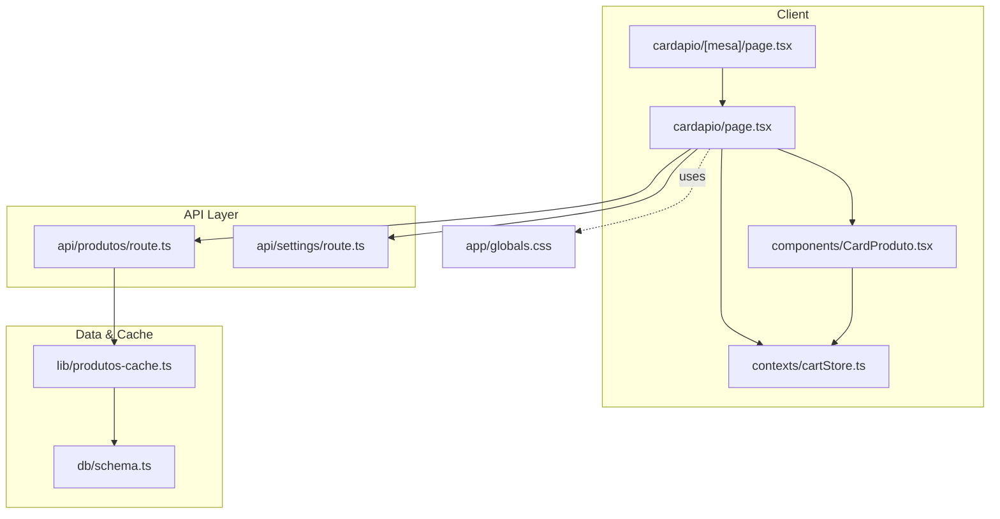
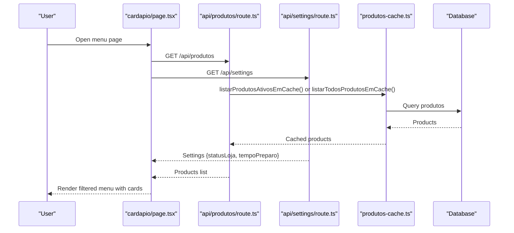
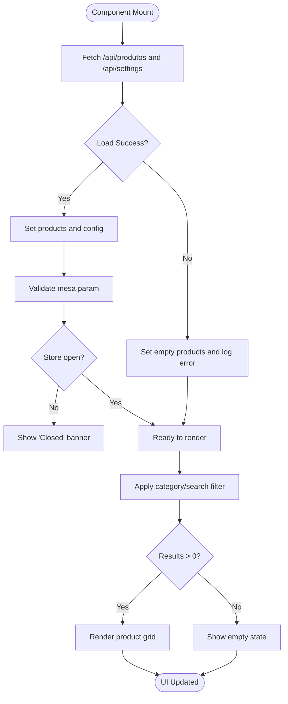
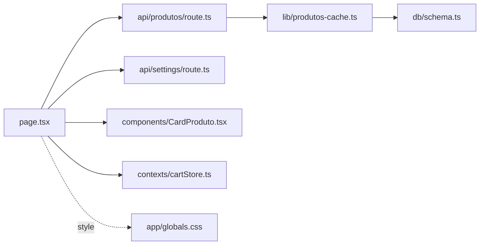

# Menu Browsing & Product Display

<cite>
**Referenced Files in This Document**
- [page.tsx](file://src/app/cardapio/page.tsx)
- [mesa page.tsx](file://src/app/cardapio/[mesa]/page.tsx)
- [CardProduto.tsx](file://src/components/CardProduto.tsx)
- [produtos-cache.ts](file://src/lib/produtos-cache.ts)
- [produtos API route.ts](file://src/app/api/produtos/route.ts)
- [settings API route.ts](file://src/app/api/settings/route.ts)
- [cartStore.ts](file://src/contexts/cartStore.ts)
- [schema.ts](file://src/db/schema.ts)
- [globals.css](file://src/app/globals.css)
</cite>

## Table of Contents
1. [Introduction](#introduction)
2. [Project Structure](#project-structure)
3. [Core Components](#core-components)
4. [Architecture Overview](#architecture-overview)
5. [Detailed Component Analysis](#detailed-component-analysis)
6. [Dependency Analysis](#dependency-analysis)
7. [Performance Considerations](#performance-considerations)
8. [Troubleshooting Guide](#troubleshooting-guide)
9. [Conclusion](#conclusion)

## Introduction
This document explains the menu browsing and product display functionality for the digital restaurant menu. It covers:
- The main cardapio page implementation with category filtering using emoji icons
- Real-time product search with accent-insensitive text normalization
- Responsive grid layout for product cards
- Loading states, error handling, and empty state management
- Mobile-first navigation with a bottom tab bar and desktop sidebar menu
- Store status checking system that displays appropriate messages when the restaurant is closed
- Table identification via QR code parameters and URL routing patterns
- Performance optimizations including caching and efficient filtering for large catalogs

## Project Structure
The menu browsing feature spans client components, API routes, caching utilities, and global styles:
- Client-side pages and components render the menu UI, handle user interactions, and manage local state
- API routes serve products and settings data
- Caching layer reduces database load and improves response times
- Global CSS defines theme tokens and responsive utilities

**Diagram sources**
- [page.tsx](file://src/app/cardapio/page.tsx)
- [mesa page.tsx](file://src/app/cardapio/[mesa]/page.tsx)
- [CardProduto.tsx](file://src/components/CardProduto.tsx)
- [produtos API route.ts](file://src/app/api/produtos/route.ts)
- [settings API route.ts](file://src/app/api/settings/route.ts)
- [produtos-cache.ts](file://src/lib/produtos-cache.ts)
- [schema.ts](file://src/db/schema.ts)
- [globals.css](file://src/app/globals.css)

**Section sources**
- [page.tsx](file://src/app/cardapio/page.tsx)
- [mesa page.tsx](file://src/app/cardapio/[mesa]/page.tsx)
- [CardProduto.tsx](file://src/components/CardProduto.tsx)
- [produtos API route.ts](file://src/app/api/produtos/route.ts)
- [settings API route.ts](file://src/app/api/settings/route.ts)
- [produtos-cache.ts](file://src/lib/produtos-cache.ts)
- [schema.ts](file://src/db/schema.ts)
- [globals.css](file://src/app/globals.css)

## Core Components
- CardapioCliente (main menu page): Loads products and settings, manages search and category filters, renders responsive layouts, handles store status, and supports table identification from QR codes
- CardProduto (product card): Displays product details, formats currency, and adds items to the cart
- Cart store: Manages cart items and table context across the app
- API routes: Serve active or all products based on role, and provide store settings
- Caching: Uses Next.js unstable_cache with tags and revalidation for efficient product retrieval

Key responsibilities:
- Data fetching and error handling
- Accent-insensitive search normalization
- Category extraction and emoji mapping
- Responsive UI with mobile-first design
- Store open/closed messaging
- Table ID validation and routing

**Section sources**
- [page.tsx](file://src/app/cardapio/page.tsx)
- [CardProduto.tsx](file://src/components/CardProduto.tsx)
- [cartStore.ts](file://src/contexts/cartStore.ts)
- [produtos API route.ts](file://src/app/api/produtos/route.ts)
- [settings API route.ts](file://src/app/api/settings/route.ts)
- [produtos-cache.ts](file://src/lib/produtos-cache.ts)

## Architecture Overview
The menu browsing flow combines client-side rendering with server-side caching:
- The client requests products and settings concurrently
- Products are served through an API route that applies role-based filtering and cache
- Settings reflect store status and preparation time
- The UI renders categories, search results, and product cards responsively

**Diagram sources**
- [page.tsx](file://src/app/cardapio/page.tsx)
- [produtos API route.ts](file://src/app/api/produtos/route.ts)
- [settings API route.ts](file://src/app/api/settings/route.ts)
- [produtos-cache.ts](file://src/lib/produtos-cache.ts)

## Detailed Component Analysis

### Main Menu Page (CardapioCliente)
Responsibilities:
- Fetches products and settings concurrently
- Validates table parameter from QR code and sets it in the cart store
- Implements accent-insensitive search normalization
- Computes unique categories and maps emojis
- Filters products by category or search term
- Renders loading, empty, and normal states
- Shows store closed message when applicable
- Provides mobile bottom tab bar and desktop sidebar menu

Key behaviors:
- Concurrent data fetch with error handling and fallbacks
- Search toggling and real-time filtering
- Category pill selection with emoji icons
- Responsive grid layout for product cards
- Store status banner and preparation time display
- Table ID validation and redirection logic

**Diagram sources**
- [page.tsx](file://src/app/cardapio/page.tsx)

**Section sources**
- [page.tsx](file://src/app/cardapio/page.tsx)

### Product Card (CardProduto)
Responsibilities:
- Displays product image, name, description, and formatted price
- Adds item to cart on button click
- Uses lazy loading for images

Behavior highlights:
- Currency formatting using Intl.NumberFormat
- Default image fallback
- Accessible add-to-cart action

**Section sources**
- [CardProduto.tsx](file://src/components/CardProduto.tsx)

### Table Identification and Routing
- The root cardapio page redirects URLs with query mesa parameter to a structured route
- The mesa-specific route validates the pattern and passes a validated table string to the client component
- Invalid table IDs trigger a not found response

Routing patterns:
- /cardapio?mesa=Mesa%2012 -> redirects to /cardapio/mesa-12
- /cardapio/mesa-12 -> renders menu with table context

Validation:
- Regex ensures valid table number format
- Not found for invalid paths

**Section sources**
- [page.tsx](file://src/app/cardapio/page.tsx)
- [mesa page.tsx](file://src/app/cardapio/[mesa]/page.tsx)

### Store Status Checking System
- Settings API returns statusLoja and tempoPreparo
- Client displays a banner when the store is closed
- Preparation time is shown alongside product count

Status behavior:
- If statusLoja is false, show a warning banner
- Otherwise, proceed normally

**Section sources**
- [settings API route.ts](file://src/app/api/settings/route.ts)
- [page.tsx](file://src/app/cardapio/page.tsx)

### Category Filtering with Emoji Icons
- Unique categories are computed from product data
- Each category maps to an emoji icon for visual clarity
- Active category is highlighted with styling

Filtering logic:
- When no search is active, filter by selected category
- When search is active, ignore category and apply text normalization

**Section sources**
- [page.tsx](file://src/app/cardapio/page.tsx)

### Real-Time Search with Accent-Insensitive Normalization
- Search input toggles visibility and clears previous terms
- Text normalization removes accents and lowercases for consistent matching
- Searches across name, description, and category fields

Normalization approach:
- Unicode NFD decomposition followed by diacritic removal
- Case-insensitive comparison

**Section sources**
- [page.tsx](file://src/app/cardapio/page.tsx)

### Responsive Layout and Navigation
- Mobile-first design with a fixed bottom tab bar
- Desktop sidebar menu with quick actions
- Grid adapts columns based on screen size

Navigation elements:
- Bottom tabs: Menu, Search, Orders, Cart
- Desktop header: Sidebar toggle, search button, cart badge

**Section sources**
- [page.tsx](file://src/app/cardapio/page.tsx)
- [globals.css](file://src/app/globals.css)

### Loading States, Error Handling, and Empty State Management
- Loading state shows a centered message while fetching
- Errors set products to an empty array and log errors
- Empty state provides contextual guidance depending on search or category

States:
- Loading: "Loading menu..."
- Error: Silent failure with console logging and empty list
- Empty: "Nothing found" with tailored message

**Section sources**
- [page.tsx](file://src/app/cardapio/page.tsx)

## Dependency Analysis
The menu browsing feature depends on several modules:
- Client components depend on API routes for data
- API routes use caching utilities to reduce database load
- Schema defines data structures used throughout
- Global styles define theme and responsive utilities

**Diagram sources**
- [page.tsx](file://src/app/cardapio/page.tsx)
- [produtos API route.ts](file://src/app/api/produtos/route.ts)
- [settings API route.ts](file://src/app/api/settings/route.ts)
- [CardProduto.tsx](file://src/components/CardProduto.tsx)
- [cartStore.ts](file://src/contexts/cartStore.ts)
- [produtos-cache.ts](file://src/lib/produtos-cache.ts)
- [schema.ts](file://src/db/schema.ts)
- [globals.css](file://src/app/globals.css)

**Section sources**
- [page.tsx](file://src/app/cardapio/page.tsx)
- [produtos API route.ts](file://src/app/api/produtos/route.ts)
- [settings API route.ts](file://src/app/api/settings/route.ts)
- [produtos-cache.ts](file://src/lib/produtos-cache.ts)
- [schema.ts](file://src/db/schema.ts)
- [globals.css](file://src/app/globals.css)

## Performance Considerations
Optimizations implemented and recommended:
- Server-side caching with tags and revalidation for product lists
- Concurrent fetching of products and settings to minimize latency
- Efficient client-side filtering without additional network calls
- Lazy loading of product images to reduce initial payload
- Debouncing search input for very large catalogs to avoid excessive re-renders
- Using stable keys and minimal re-renders in React components

Recommendations:
- Implement debounced search with a short delay (e.g., 200ms)
- Paginate or virtualize product lists if catalog grows beyond hundreds of items
- Preload critical assets and defer non-critical ones
- Use memoization for expensive computations like category extraction

[No sources needed since this section provides general guidance]

## Troubleshooting Guide
Common issues and resolutions:
- No products displayed: Check API responses and ensure products have valid status
- Search not working: Verify normalization function and input trimming
- Store closed banner always showing: Confirm settings API returns correct statusLoja
- Table ID invalid: Ensure QR code generates Mesa followed by a number; validate regex
- Cart badge not updating: Verify cart store actions and quantity calculations

Debugging steps:
- Inspect network requests for /api/produtos and /api/settings
- Log errors in the client component’s fetch block
- Validate table parameter format before rendering
- Clear cart store persistence if corrupted

**Section sources**
- [page.tsx](file://src/app/cardapio/page.tsx)
- [produtos API route.ts](file://src/app/api/produtos/route.ts)
- [settings API route.ts](file://src/app/api/settings/route.ts)
- [cartStore.ts](file://src/contexts/cartStore.ts)

## Conclusion
The menu browsing and product display system provides a robust, responsive, and user-friendly experience for customers. It leverages server-side caching, concurrent data fetching, and efficient client-side filtering to deliver fast performance. The design accommodates both mobile and desktop users with intuitive navigation and clear feedback for loading, errors, and store status. With proper table identification via QR codes and scalable architecture, the system is well-suited for growing product catalogs and evolving business needs.

[No sources needed since this section summarizes without analyzing specific files]