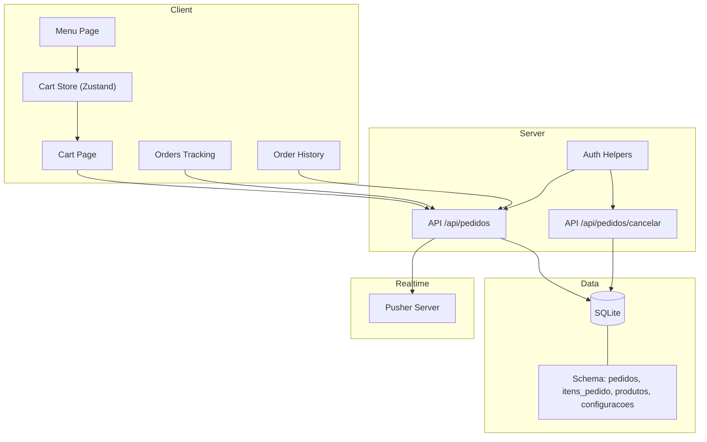
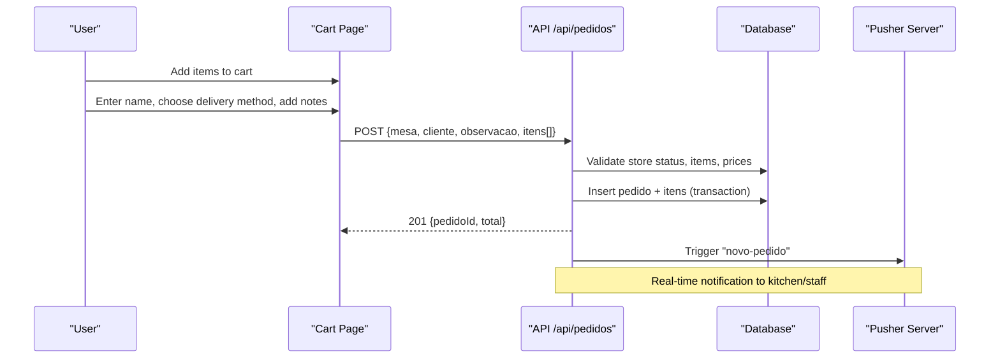
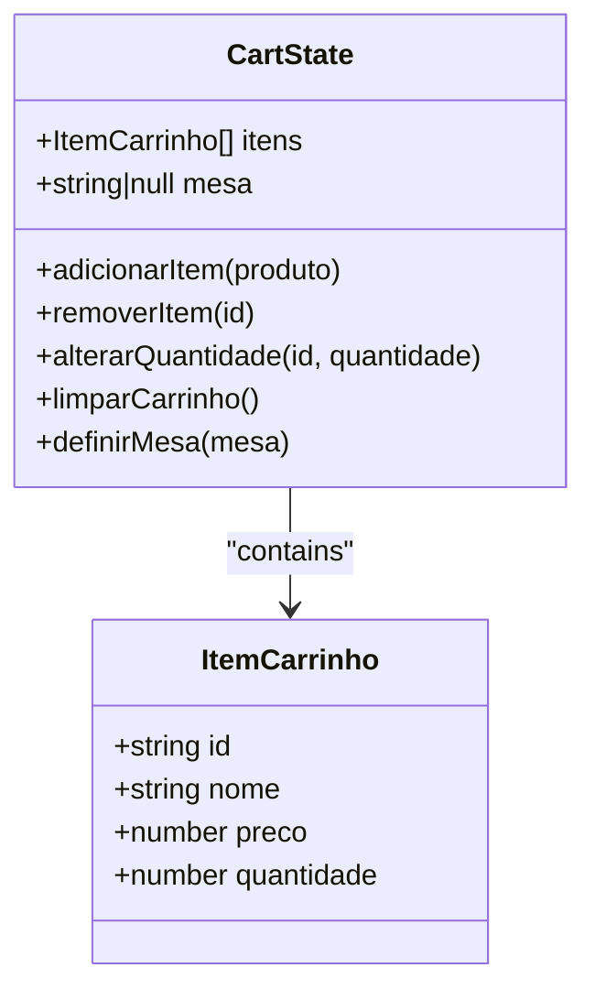
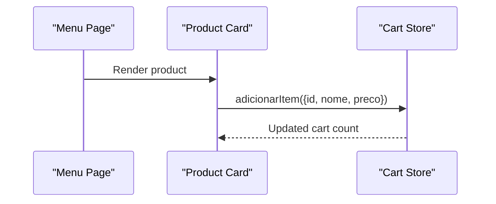
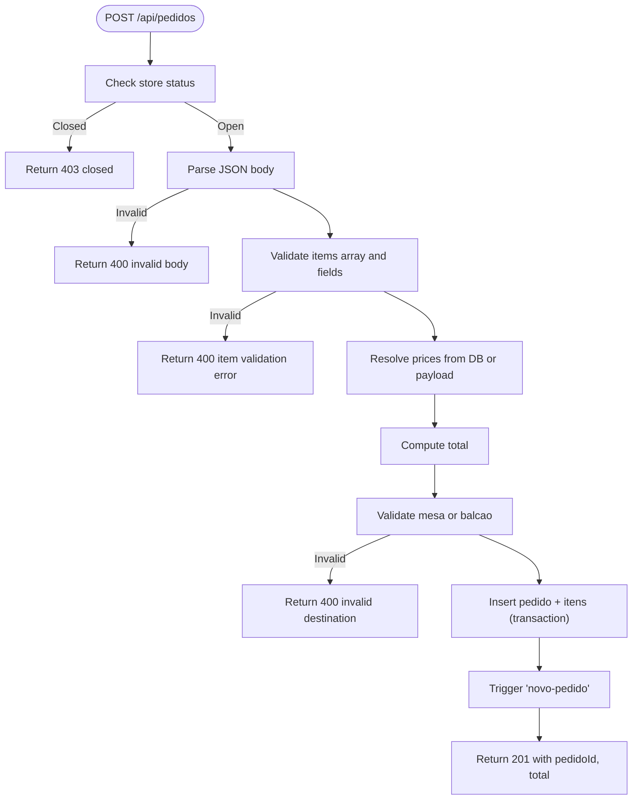
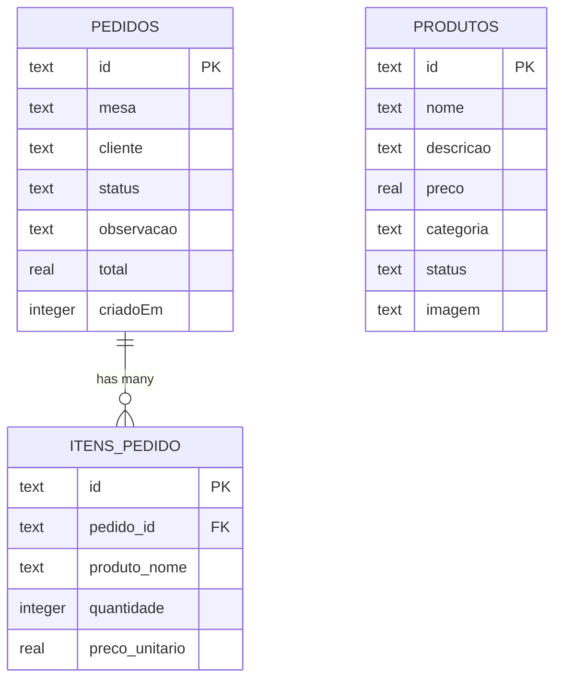
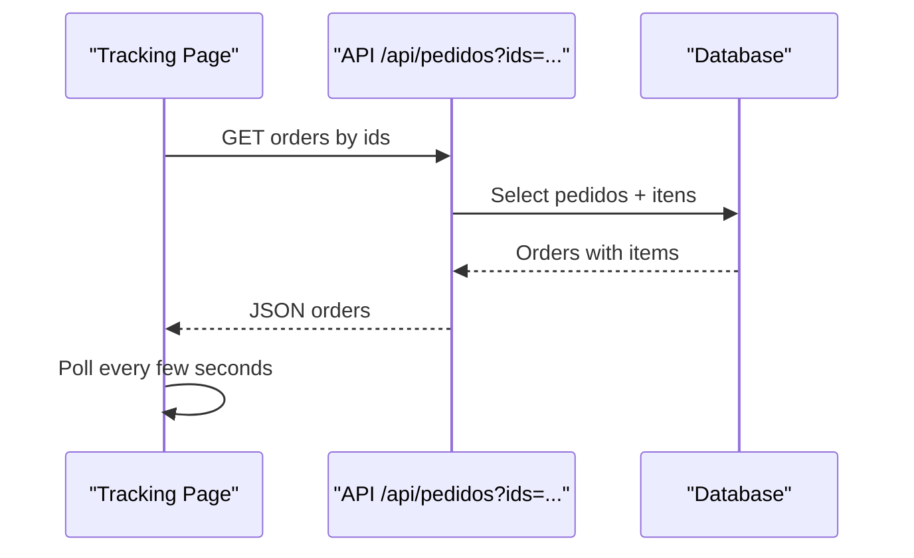
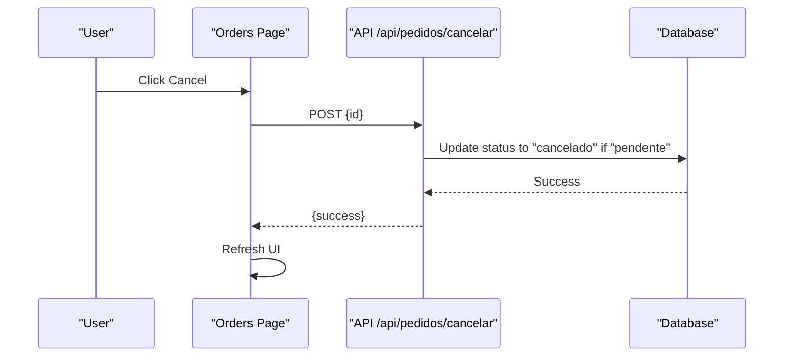
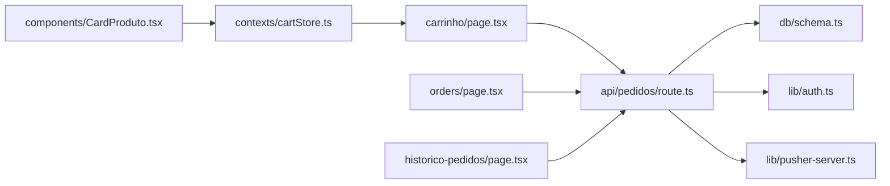

# Order Placement & Confirmation

<cite>
**Referenced Files in This Document**
- [src/app/carrinho/page.tsx](file://src/app/carrinho/page.tsx)
- [src/contexts/cartStore.ts](file://src/contexts/cartStore.ts)
- [src/app/api/pedidos/route.ts](file://src/app/api/pedidos/route.ts)
- [src/app/api/pedidos/cancelar/route.ts](file://src/app/api/pedidos/cancelar/route.ts)
- [src/db/schema.ts](file://src/db/schema.ts)
- [src/app/orders/page.tsx](file://src/app/orders/page.tsx)
- [src/app/historico-pedidos/page.tsx](file://src/app/historico-pedidos/page.tsx)
- [src/lib/auth.ts](file://src/lib/auth.ts)
- [src/lib/pusher-server.ts](file://src/lib/pusher-server.ts)
- [src/lib/pusher.ts](file://src/lib/pusher.ts)
- [src/components/CardProduto.tsx](file://src/components/CardProduto.tsx)
- [src/app/cardapio/page.tsx](file://src/app/cardapio/page.tsx)
</cite>

## Table of Contents
1. Introduction
2. Project Structure
3. Core Components
4. Architecture Overview
5. Detailed Component Analysis
6. Dependency Analysis
7. Performance Considerations
8. Troubleshooting Guide
9. Conclusion

## Introduction
This document explains the end-to-end order placement workflow from cart to confirmation, including data validation, API communication, error handling, order creation with table and item associations, pricing calculations, confirmation messaging, order tracking, real-time status updates, order history integration, cancellation policies, and security considerations for protecting order data and preventing fraud.

## Project Structure
The order flow spans client pages, a shared cart store, server API routes, database schema, and optional real-time notifications:
- Client UI: menu browsing, cart management, order tracking, and order history
- State: persistent cart state across sessions
- Server APIs: create, list, update, cancel orders; authentication helpers
- Database: tables for products, orders, order items, settings, users
- Real-time: Pusher server triggers for new orders and status changes

**Diagram sources**
- [src/app/carrinho/page.tsx:26-57](file://src/app/carrinho/page.tsx#L26-L57)
- [src/app/api/pedidos/route.ts:65-189](file://src/app/api/pedidos/route.ts#L65-L189)
- [src/app/api/pedidos/cancelar/route.ts:6-20](file://src/app/api/pedidos/cancelar/route.ts#L6-L20)
- [src/db/schema.ts:14-32](file://src/db/schema.ts#L14-L32)
- [src/lib/pusher-server.ts:1-11](file://src/lib/pusher-server.ts#L1-L11)

**Section sources**
- [src/app/carrinho/page.tsx:1-99](file://src/app/carrinho/page.tsx#L1-L99)
- [src/app/api/pedidos/route.ts:1-253](file://src/app/api/pedidos/route.ts#L1-L253)
- [src/db/schema.ts:1-56](file://src/db/schema.ts#L1-L56)

## Core Components
- Cart Store: manages items, quantities, and table context; persists across sessions
- Cart Page: validates inputs, computes totals, submits order, handles errors, redirects to tracking
- Orders API: creates orders with validation, associates items, calculates totals, persists atomically, emits real-time events
- Cancel API: enforces cancellation policy (only pending orders)
- Orders Tracking: polls or listens for updates, allows cancellation when eligible
- Order History: lists all orders with filters and deletion

**Section sources**
- [src/contexts/cartStore.ts:1-69](file://src/contexts/cartStore.ts#L1-L69)
- [src/app/carrinho/page.tsx:26-57](file://src/app/carrinho/page.tsx#L26-L57)
- [src/app/api/pedidos/route.ts:65-189](file://src/app/api/pedidos/route.ts#L65-L189)
- [src/app/api/pedidos/cancelar/route.ts:6-20](file://src/app/api/pedidos/cancelar/route.ts#L6-L20)
- [src/app/orders/page.tsx:33-67](file://src/app/orders/page.tsx#L33-L67)
- [src/app/historico-pedidos/page.tsx:9-22](file://src/app/historico-pedidos/page.tsx#L9-L22)

## Architecture Overview
The order placement architecture connects the client cart to server-side validation and persistence, then notifies stakeholders via real-time events.

**Diagram sources**
- [src/app/carrinho/page.tsx:26-57](file://src/app/carrinho/page.tsx#L26-L57)
- [src/app/api/pedidos/route.ts:65-189](file://src/app/api/pedidos/route.ts#L65-L189)
- [src/lib/pusher-server.ts:1-11](file://src/lib/pusher-server.ts#L1-L11)

## Detailed Component Analysis

### Cart State Management
- Stores items with id, name, price, quantity
- Supports adding, removing, updating quantities, clearing, and setting table context
- Persists cart across sessions using a named storage key

**Diagram sources**
- [src/contexts/cartStore.ts:4-19](file://src/contexts/cartStore.ts#L4-L19)
- [src/contexts/cartStore.ts:21-68](file://src/contexts/cartStore.ts#L21-L68)

**Section sources**
- [src/contexts/cartStore.ts:1-69](file://src/contexts/cartStore.ts#L1-L69)

### Menu to Cart Flow
- Product cards call addToCart with product identity and price
- Menu page sets table context when accessed via QR code parameters

**Diagram sources**
- [src/components/CardProduto.tsx:14-45](file://src/components/CardProduto.tsx#L14-L45)
- [src/app/cardapio/page.tsx:40-42](file://src/app/cardapio/page.tsx#L40-L42)

**Section sources**
- [src/components/CardProduto.tsx:1-51](file://src/components/CardProduto.tsx#L1-L51)
- [src/app/cardapio/page.tsx:24-42](file://src/app/cardapio/page.tsx#L24-L42)

### Order Submission and Validation
- Validates store open status
- Ensures at least one item
- Validates each item’s name, quantity bounds, and price source
- Verifies product availability if id provided; otherwise uses provided price
- Enforces valid table or counter destination
- Computes total from validated sources
- Persists order and items atomically
- Emits real-time event on success

**Diagram sources**
- [src/app/api/pedidos/route.ts:65-189](file://src/app/api/pedidos/route.ts#L65-L189)

**Section sources**
- [src/app/api/pedidos/route.ts:65-189](file://src/app/api/pedidos/route.ts#L65-L189)

### Order Creation Data Model and Associations
- Orders table stores table/counter, customer, status, observation, total, created timestamp
- Items table links to order by foreign key, storing product name snapshot, quantity, unit price
- Products table provides active catalog and pricing reference

**Diagram sources**
- [src/db/schema.ts:14-32](file://src/db/schema.ts#L14-L32)
- [src/db/schema.ts:3-12](file://src/db/schema.ts#L3-L12)

**Section sources**
- [src/db/schema.ts:1-56](file://src/db/schema.ts#L1-L56)

### Pricing Calculation Rules
- If item includes a valid product id, use the product’s current price; ensure product is active
- If no id, accept a non-negative price from payload
- Total must be greater than zero
- Prevents tampering by validating against known products when ids are present

**Section sources**
- [src/app/api/pedidos/route.ts:87-130](file://src/app/api/pedidos/route.ts#L87-L130)

### Error Handling and Messages
- Client shows user-friendly alerts for validation failures and network errors
- Server returns structured error responses with appropriate HTTP status codes
- Transaction ensures consistency even if subsequent steps fail

**Section sources**
- [src/app/carrinho/page.tsx:26-57](file://src/app/carrinho/page.tsx#L26-L57)
- [src/app/api/pedidos/route.ts:59-62](file://src/app/api/pedidos/route.ts#L59-L62)
- [src/app/api/pedidos/route.ts:186-189](file://src/app/api/pedidos/route.ts#L186-L189)

### Confirmation and Redirect
- On success, client saves the order id locally, clears cart, and navigates to the tracking page

**Section sources**
- [src/app/carrinho/page.tsx:46-52](file://src/app/carrinho/page.tsx#L46-L52)

### Order Tracking and Real-Time Updates
- The tracking page fetches orders by stored ids and refreshes periodically
- Status badges reflect current order state
- Optional real-time updates can be integrated via Pusher client (client instance available)

**Diagram sources**
- [src/app/orders/page.tsx:33-58](file://src/app/orders/page.tsx#L33-L58)
- [src/app/api/pedidos/route.ts:15-63](file://src/app/api/pedidos/route.ts#L15-L63)

**Section sources**
- [src/app/orders/page.tsx:18-67](file://src/app/orders/page.tsx#L18-L67)
- [src/app/api/pedidos/route.ts:15-63](file://src/app/api/pedidos/route.ts#L15-L63)

### Order History Integration
- Admin/kitchen view lists all orders with filters and supports deletion
- Requires authentication for full listing and destructive actions

**Section sources**
- [src/app/historico-pedidos/page.tsx:9-22](file://src/app/historico-pedidos/page.tsx#L9-L22)
- [src/app/api/pedidos/route.ts:46-58](file://src/app/api/pedidos/route.ts#L46-L58)
- [src/app/api/pedidos/route.ts:237-252](file://src/app/api/pedidos/route.ts#L237-L252)

### Payment Method Handling
- No payment processing is implemented in this codebase. Orders are created without payment capture.

[No sources needed since this section summarizes implementation scope]

### Order Cancellation Policy and Process
- Only orders with status “pendente” can be canceled
- Client confirms before cancellation and updates local list

**Diagram sources**
- [src/app/orders/page.tsx:60-67](file://src/app/orders/page.tsx#L60-L67)
- [src/app/api/pedidos/cancelar/route.ts:6-20](file://src/app/api/pedidos/cancelar/route.ts#L6-L20)

**Section sources**
- [src/app/orders/page.tsx:60-67](file://src/app/orders/page.tsx#L60-L67)
- [src/app/api/pedidos/cancelar/route.ts:6-20](file://src/app/api/pedidos/cancelar/route.ts#L6-L20)

### Refund Processes
- No refund logic is implemented in this codebase.

[No sources needed since this section summarizes implementation scope]

### Security Considerations and Fraud Prevention
- Authentication:
  - Full order listing and destructive operations require authenticated roles (admin, cozinha, atendente)
  - Role checks enforced via helper functions
- Input validation:
  - Strict validation of payloads (items, quantities, prices, destinations)
  - Sanitization of strings (length limits)
- Data integrity:
  - Atomic transactions for order creation and deletion
  - Snapshotting product names and unit prices at time of order
- Real-time safety:
  - Pusher server initialization guarded by environment variables; safe fallback when not configured
- Recommendations:
  - Enforce HTTPS in production
  - Add rate limiting on order submission endpoints
  - Implement CSRF protection for browser-based submissions
  - Log and monitor failed validations and cancellations
  - Add CAPTCHA or device fingerprinting for high-risk flows

**Section sources**
- [src/lib/auth.ts:63-82](file://src/lib/auth.ts#L63-L82)
- [src/app/api/pedidos/route.ts:46-58](file://src/app/api/pedidos/route.ts#L46-L58)
- [src/app/api/pedidos/route.ts:147-171](file://src/app/api/pedidos/route.ts#L147-L171)
- [src/lib/pusher-server.ts:1-11](file://src/lib/pusher-server.ts#L1-L11)

## Dependency Analysis
Key dependencies and relationships:
- Cart UI depends on Zustand store for state
- Cart page calls /api/pedidos POST to create orders
- Orders API depends on database schema and auth helpers
- Real-time notifications depend on Pusher server configuration
- Tracking page depends on /api/pedidos GET with ids parameter

**Diagram sources**
- [src/app/carrinho/page.tsx:26-57](file://src/app/carrinho/page.tsx#L26-L57)
- [src/app/api/pedidos/route.ts:1-7](file://src/app/api/pedidos/route.ts#L1-L7)
- [src/db/schema.ts:14-32](file://src/db/schema.ts#L14-L32)
- [src/lib/auth.ts:63-82](file://src/lib/auth.ts#L63-L82)
- [src/lib/pusher-server.ts:1-11](file://src/lib/pusher-server.ts#L1-L11)
- [src/contexts/cartStore.ts:1-69](file://src/contexts/cartStore.ts#L1-L69)
- [src/components/CardProduto.tsx:14-45](file://src/components/CardProduto.tsx#L14-L45)

**Section sources**
- [src/app/carrinho/page.tsx:1-99](file://src/app/carrinho/page.tsx#L1-L99)
- [src/app/api/pedidos/route.ts:1-253](file://src/app/api/pedidos/route.ts#L1-L253)
- [src/db/schema.ts:1-56](file://src/db/schema.ts#L1-L56)

## Performance Considerations
- Use caching for product listings to reduce database load
- Keep order polling intervals reasonable to avoid excessive requests
- Ensure database indexes on frequently queried fields (e.g., pedidos.id, itens_pedido.pedido_id)
- Batch updates where possible and minimize payload sizes

[No sources needed since this section provides general guidance]

## Troubleshooting Guide
Common issues and resolutions:
- Invalid or missing items: ensure at least one item with valid name and quantity
- Price mismatch: include valid product id or a non-negative price; server will validate against catalog when id is present
- Closed store: check store status configuration; orders are blocked when closed
- Destination validation: ensure menu opened via QR code or pass valid mesa/counter value
- Network errors: verify connectivity and server availability; client displays connection errors
- Cancellation blocked: only pending orders can be canceled; check order status

**Section sources**
- [src/app/api/pedidos/route.ts:65-138](file://src/app/api/pedidos/route.ts#L65-L138)
- [src/app/api/pedidos/cancelar/route.ts:6-20](file://src/app/api/pedidos/cancelar/route.ts#L6-L20)
- [src/app/carrinho/page.tsx:26-57](file://src/app/carrinho/page.tsx#L26-L57)

## Conclusion
The system implements a robust order placement workflow with strong validation, atomic persistence, and real-time notifications. It supports order tracking, cancellation within policy constraints, and an admin history view. While payment and refunds are not implemented, the foundation is in place to extend these features securely. Following the recommended security and performance practices will further harden the system and improve scalability.