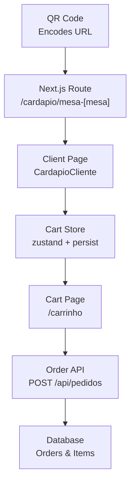
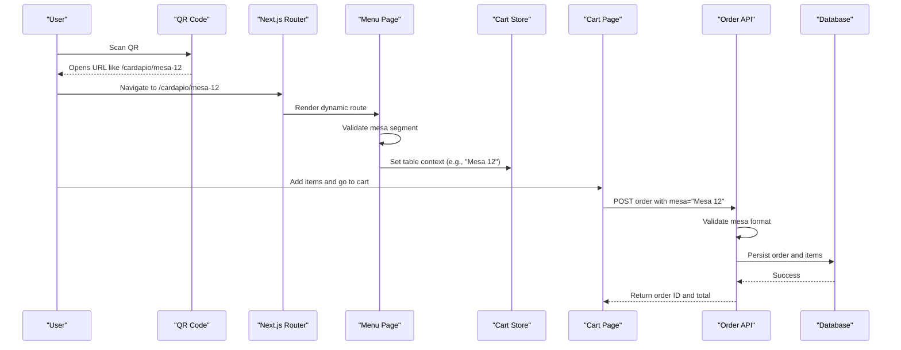
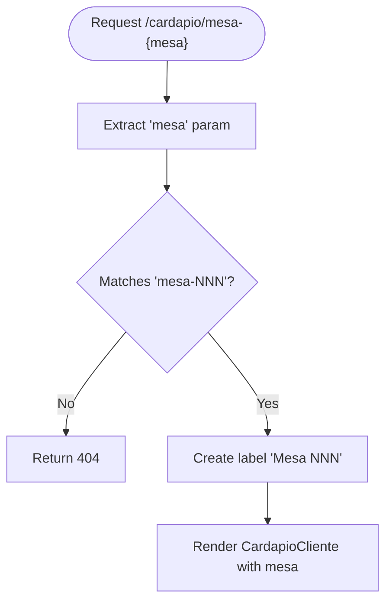
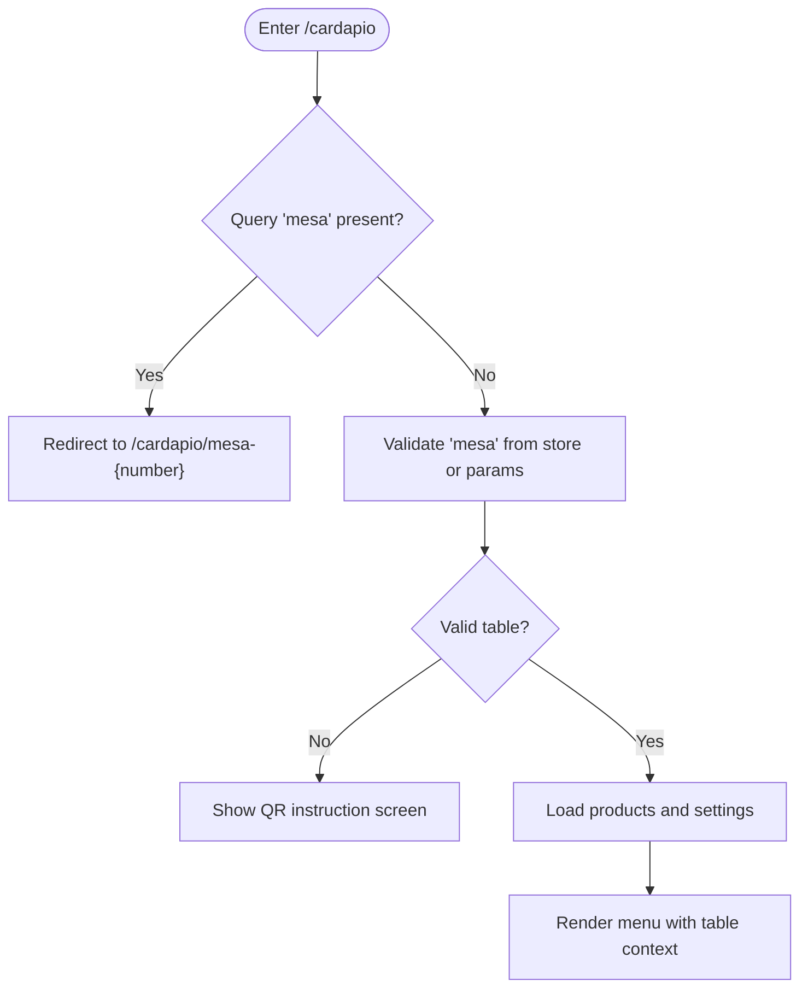
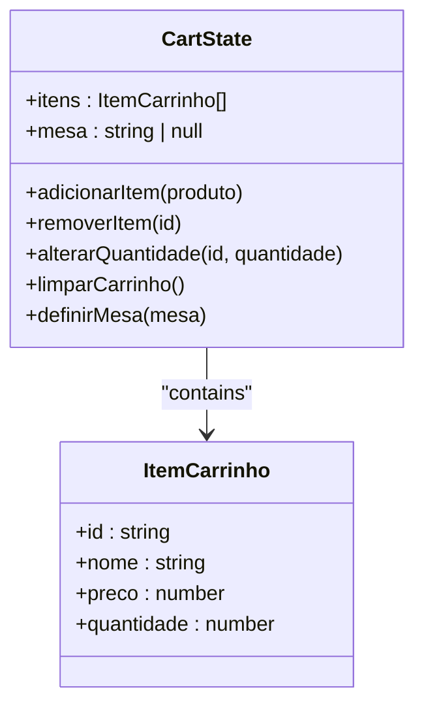
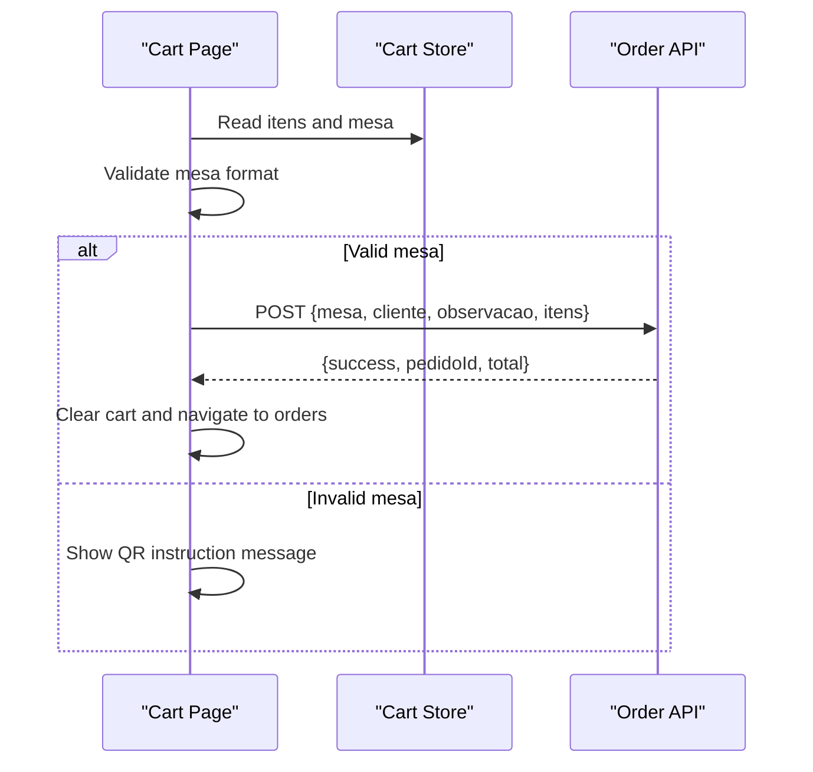
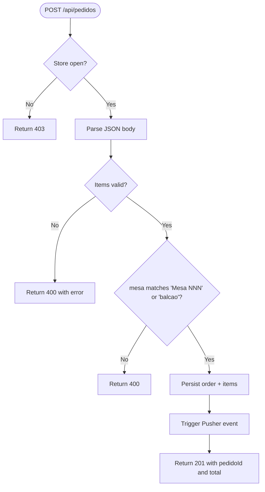
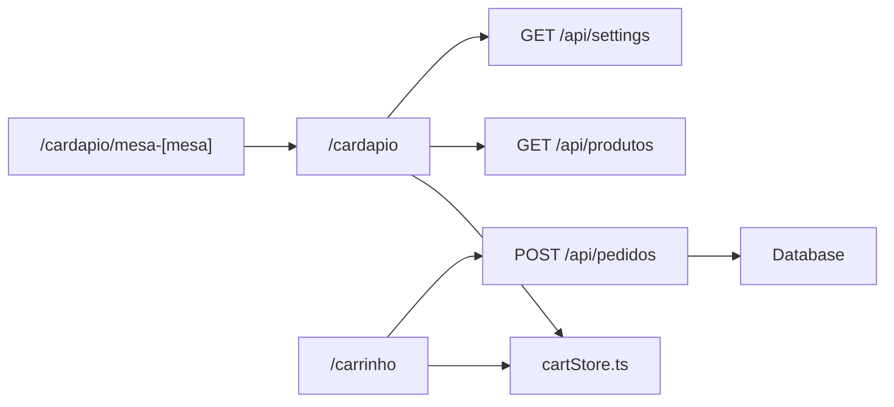

# QR Code Table Integration

<cite>
**Referenced Files in This Document**
- [src/app/cardapio/[mesa]/page.tsx](file://src/app/cardapio/[mesa]/page.tsx)
- [src/app/cardapio/page.tsx](file://src/app/cardapio/page.tsx)
- [src/app/carrinho/page.tsx](file://src/app/carrinho/page.tsx)
- [src/contexts/cartStore.ts](file://src/contexts/cartStore.ts)
- [src/app/api/pedidos/route.ts](file://src/app/api/pedidos/route.ts)
</cite>

## Table of Contents
1. Introduction
2. Project Structure
3. Core Components
4. Architecture Overview
5. Detailed Component Analysis
6. Dependency Analysis
7. Performance Considerations
8. Troubleshooting Guide
9. Conclusion

## Introduction
This document explains the QR code–based table ordering system. It covers how QR codes encode table identifiers, how URLs are parsed and validated, how table context is maintained during a user session, and how orders are secured against spoofing. It also describes fallback behavior when QR codes are invalid or missing and provides guidance for integrating with external QR code generators and custom branding.

## Project Structure
The QR flow spans Next.js App Router pages, a client-side cart store, and server-side order APIs:
- Dynamic route for table-specific menus
- Client components that validate and persist table context
- API endpoints that enforce table format on order submission
- Cart state that carries table information across navigation

**Diagram sources**
- [src/app/cardapio/[mesa]/page.tsx:1-11](file://src/app/cardapio/[mesa]/page.tsx#L1-L11)
- [src/app/cardapio/page.tsx:24-42](file://src/app/cardapio/page.tsx#L24-L42)
- [src/app/carrinho/page.tsx:8-24](file://src/app/carrinho/page.tsx#L8-L24)
- [src/contexts/cartStore.ts:11-19](file://src/contexts/cartStore.ts#L11-L19)
- [src/app/api/pedidos/route.ts:65-189](file://src/app/api/pedidos/route.ts#L65-L189)

**Section sources**
- [src/app/cardapio/[mesa]/page.tsx:1-11](file://src/app/cardapio/[mesa]/page.tsx#L1-L11)
- [src/app/cardapio/page.tsx:24-42](file://src/app/cardapio/page.tsx#L24-L42)
- [src/app/carrinho/page.tsx:8-24](file://src/app/carrinho/page.tsx#L8-L24)
- [src/contexts/cartStore.ts:11-19](file://src/contexts/cartStore.ts#L11-L19)
- [src/app/api/pedidos/route.ts:65-189](file://src/app/api/pedidos/route.ts#L65-L189)

## Core Components
- Dynamic table route: Validates the mesa segment and forwards to the shared menu component with a normalized table label.
- Menu page: Validates the table parameter, persists it into the cart store, and renders the menu only when valid.
- Cart page: Enforces table validation before allowing checkout and sends the validated table context to the order API.
- Order API: Re-validates the table field and rejects requests that do not originate from a valid table context.

Key responsibilities:
- Extract and normalize table numbers from URLs
- Validate table format using strict patterns
- Persist table context in a persistent client store
- Enforce table integrity at order submission

**Section sources**
- [src/app/cardapio/[mesa]/page.tsx:4-10](file://src/app/cardapio/[mesa]/page.tsx#L4-L10)
- [src/app/cardapio/page.tsx:24-42](file://src/app/cardapio/page.tsx#L24-L42)
- [src/app/carrinho/page.tsx:8-24](file://src/app/carrinho/page.tsx#L8-L24)
- [src/app/api/pedidos/route.ts:132-140](file://src/app/api/pedidos/route.ts#L132-L140)

## Architecture Overview
The end-to-end flow from QR scan to order creation:

**Diagram sources**
- [src/app/cardapio/[mesa]/page.tsx:4-10](file://src/app/cardapio/[mesa]/page.tsx#L4-L10)
- [src/app/cardapio/page.tsx:24-42](file://src/app/cardapio/page.tsx#L24-L42)
- [src/app/carrinho/page.tsx:26-57](file://src/app/carrinho/page.tsx#L26-L57)
- [src/app/api/pedidos/route.ts:65-189](file://src/app/api/pedidos/route.ts#L65-L189)

## Detailed Component Analysis

### Dynamic Table Route: /cardapio/mesa-[mesa]
- Accepts a dynamic segment mesa
- Validates the segment against a strict pattern that allows numeric values up to three digits
- On invalid input, returns a 404 via Next.js notFound
- On success, constructs a normalized table label and renders the shared menu component

**Diagram sources**
- [src/app/cardapio/[mesa]/page.tsx:4-10](file://src/app/cardapio/[mesa]/page.tsx#L4-L10)

**Section sources**
- [src/app/cardapio/[mesa]/page.tsx:4-10](file://src/app/cardapio/[mesa]/page.tsx#L4-L10)

### Menu Page: /cardapio
- Reads optional query parameter mesa and redirects to the table-specific route if present
- Validates the table label using a strict regex
- Persists the validated table into the cart store for later use
- Renders a fallback UI instructing users to open via QR code when no valid table context exists

**Diagram sources**
- [src/app/cardapio/page.tsx:24-42](file://src/app/cardapio/page.tsx#L24-L42)
- [src/app/cardapio/page.tsx:289-314](file://src/app/cardapio/page.tsx#L289-L314)

**Section sources**
- [src/app/cardapio/page.tsx:24-42](file://src/app/cardapio/page.tsx#L24-L42)
- [src/app/cardapio/page.tsx:289-314](file://src/app/cardapio/page.tsx#L289-L314)

### Cart Store: Persistent Table Context
- Stores cart items and the current table identifier
- Persists data across sessions using a named storage key
- Provides actions to add/remove items, update quantities, clear the cart, and set the table

**Diagram sources**
- [src/contexts/cartStore.ts:4-19](file://src/contexts/cartStore.ts#L4-L19)
- [src/contexts/cartStore.ts:21-68](file://src/contexts/cartStore.ts#L21-L68)

**Section sources**
- [src/contexts/cartStore.ts:11-19](file://src/contexts/cartStore.ts#L11-L19)
- [src/contexts/cartStore.ts:21-68](file://src/contexts/cartStore.ts#L21-L68)

### Cart Page: Checkout Enforcement
- Derives the table from either the URL query or persisted store
- Validates the table before enabling checkout
- Sends the validated table along with order details to the API
- Handles errors and redirects to order history on success

**Diagram sources**
- [src/app/carrinho/page.tsx:8-24](file://src/app/carrinho/page.tsx#L8-L24)
- [src/app/carrinho/page.tsx:26-57](file://src/app/carrinho/page.tsx#L26-L57)

**Section sources**
- [src/app/carrinho/page.tsx:8-24](file://src/app/carrinho/page.tsx#L8-L24)
- [src/app/carrinho/page.tsx:26-57](file://src/app/carrinho/page.tsx#L26-L57)

### Order API: Server-Side Validation
- Rejects submissions when the store is closed
- Validates item names, quantities, and prices
- Normalizes and validates the table field; accepts “Balcão” as an alternative
- Persists orders and items atomically and emits real-time notifications

**Diagram sources**
- [src/app/api/pedidos/route.ts:65-189](file://src/app/api/pedidos/route.ts#L65-L189)

**Section sources**
- [src/app/api/pedidos/route.ts:65-189](file://src/app/api/pedidos/route.ts#L65-L189)

## Dependency Analysis
- The dynamic route depends on Next.js routing and reuses the shared menu component.
- The menu component depends on the cart store for persistence and on API routes for product and settings data.
- The cart page depends on both the cart store and the order API.
- The order API depends on database schema and optional real-time notification service.

**Diagram sources**
- [src/app/cardapio/[mesa]/page.tsx:1-11](file://src/app/cardapio/[mesa]/page.tsx#L1-L11)
- [src/app/cardapio/page.tsx:24-42](file://src/app/cardapio/page.tsx#L24-L42)
- [src/app/carrinho/page.tsx:8-24](file://src/app/carrinho/page.tsx#L8-L24)
- [src/app/api/pedidos/route.ts:65-189](file://src/app/api/pedidos/route.ts#L65-L189)

**Section sources**
- [src/app/cardapio/[mesa]/page.tsx:1-11](file://src/app/cardapio/[mesa]/page.tsx#L1-L11)
- [src/app/cardapio/page.tsx:24-42](file://src/app/cardapio/page.tsx#L24-L42)
- [src/app/carrinho/page.tsx:8-24](file://src/app/carrinho/page.tsx#L8-L24)
- [src/app/api/pedidos/route.ts:65-189](file://src/app/api/pedidos/route.ts#L65-L189)

## Performance Considerations
- Keep table validation lightweight; regex checks are O(1) relative to input length.
- Avoid unnecessary re-renders by memoizing derived values where appropriate.
- Cache product and settings responses on the client to reduce network calls.
- Use server-side validation to prevent redundant processing on the client.

[No sources needed since this section provides general guidance]

## Troubleshooting Guide
Common issues and resolutions:
- Invalid table format in URL: The dynamic route will return a 404; ensure QR codes encode the correct path format.
- Missing table context: The menu shows a QR instruction screen; verify that the QR code opens the correct URL and that the store has been set.
- Checkout blocked due to invalid table: The cart page enforces table validation; confirm the table was set from the QR URL.
- Order rejected by API: The API validates the table field; ensure the request includes a properly formatted table value.

Security considerations:
- Strict table format validation on both client and server prevents spoofing.
- The API enforces allowed table formats and rejects malformed inputs.
- For additional protection, consider adding rate limiting and CSRF protections around order endpoints.

**Section sources**
- [src/app/cardapio/[mesa]/page.tsx:4-10](file://src/app/cardapio/[mesa]/page.tsx#L4-L10)
- [src/app/cardapio/page.tsx:24-42](file://src/app/cardapio/page.tsx#L24-L42)
- [src/app/carrinho/page.tsx:26-57](file://src/app/carrinho/page.tsx#L26-L57)
- [src/app/api/pedidos/route.ts:132-140](file://src/app/api/pedidos/route.ts#L132-L140)

## Conclusion
The system uses a layered approach to ensure safe and reliable table-based ordering:
- QR codes encode table-specific URLs
- Routes parse and validate table segments
- Client components persist and propagate table context
- The server enforces table integrity at order time
This design minimizes risks of unauthorized access and table spoofing while providing a smooth user experience.

[No sources needed since this section summarizes without analyzing specific files]

## Appendices

### QR Code Generation and Branding Guidance
- Generate QR codes that point to the table-specific URL pattern used by the dynamic route.
- Ensure each table’s QR code encodes the exact path expected by the application.
- For custom branding, integrate your preferred QR generator tool to produce branded images; the application does not generate QR codes internally.

[No sources needed since this section provides general guidance]