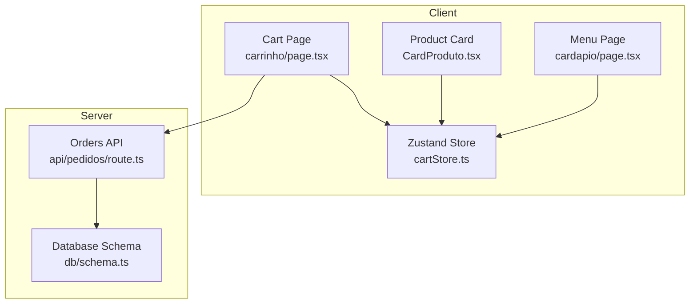
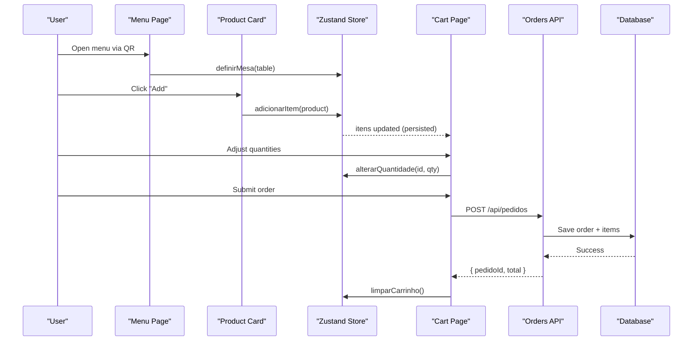
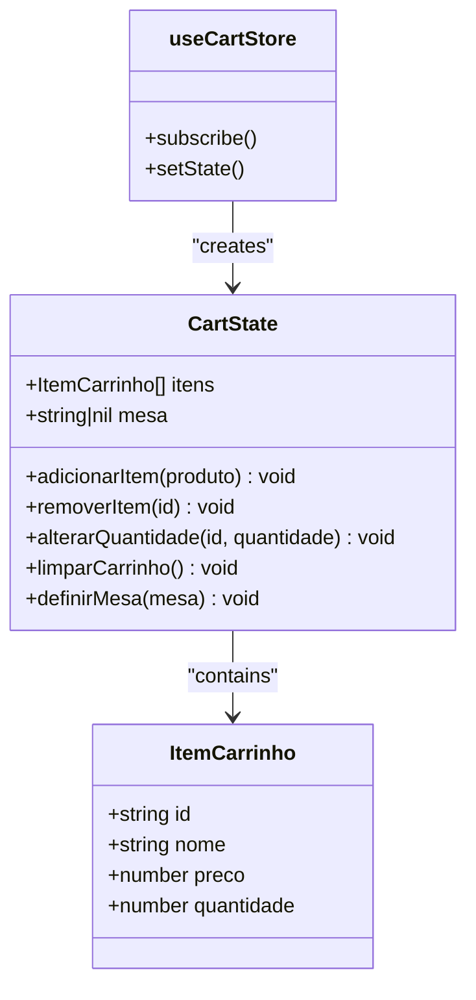
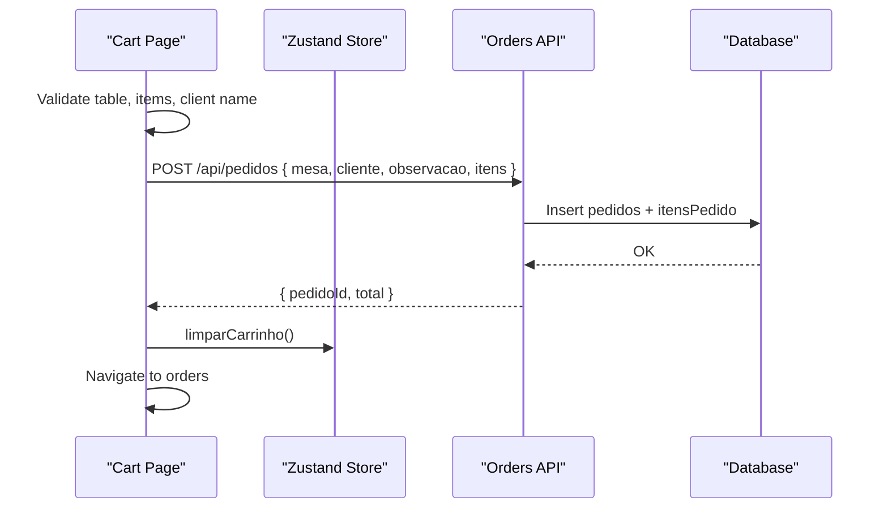
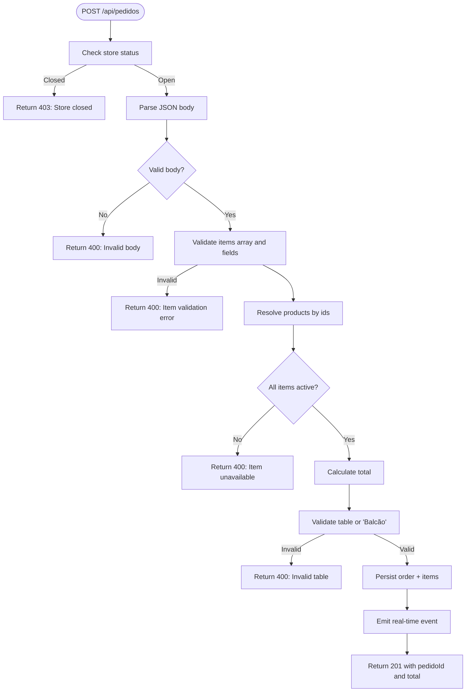
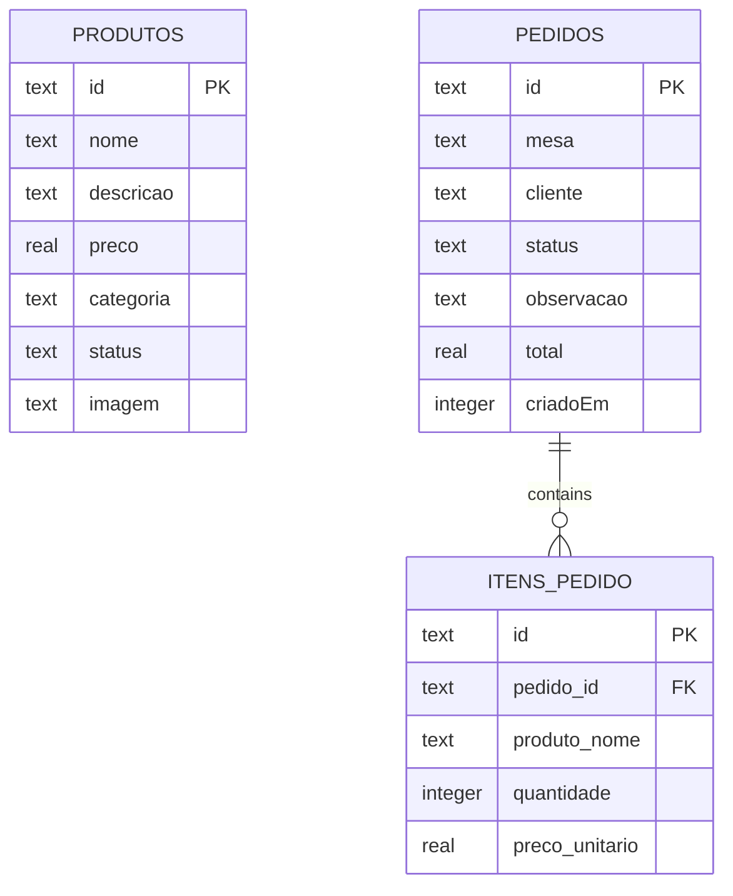
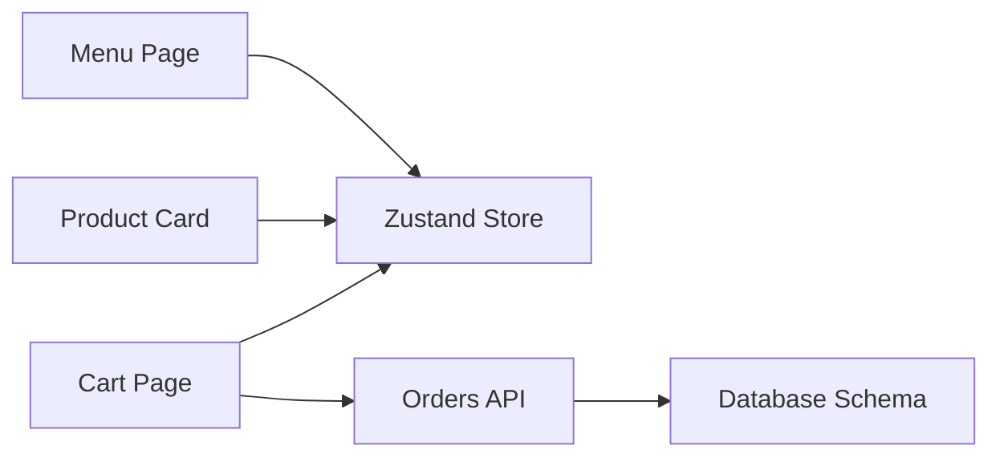

# Shopping Cart Management

<cite>
**Referenced Files in This Document**
- [cartStore.ts](file://src/contexts/cartStore.ts)
- [page.tsx (Cart)](file://src/app/carrinho/page.tsx)
- [CardProduto.tsx](file://src/components/CardProduto.tsx)
- [page.tsx (Menu)](file://src/app/cardapio/page.tsx)
- [page.tsx (Table Menu)](file://src/app/cardapio/[mesa]/page.tsx)
- [route.ts (Orders API)](file://src/app/api/pedidos/route.ts)
- [schema.ts](file://src/db/schema.ts)
</cite>

## Table of Contents
1. [Introduction](#introduction)
2. [Project Structure](#project-structure)
3. [Core Components](#core-components)
4. [Architecture Overview](#architecture-overview)
5. [Detailed Component Analysis](#detailed-component-analysis)
6. [Dependency Analysis](#dependency-analysis)
7. [Performance Considerations](#performance-considerations)
8. [Troubleshooting Guide](#troubleshooting-guide)
9. [Conclusion](#conclusion)

## Introduction
This document explains the shopping cart system built with Zustand state management. It covers the cart store architecture, local storage persistence, item quantity controls, and table association via QR codes. It also documents cart operations (add, remove, update quantities), totals calculation, UI components for items and checkout flow, validation rules, stock availability checks, error handling, synchronization across browser tabs, device persistence strategies, and performance considerations for large carts.

## Project Structure
The cart spans a small set of focused files:
- State and persistence live in a single Zustand store.
- The menu page sets the table context from QR code navigation and renders product cards that add items to the cart.
- The cart page displays items, updates quantities, validates inputs, and submits orders to the server.
- The Orders API persists orders and enforces business rules.
- Database schema defines products, orders, order items, and settings.

**Diagram sources**
- [page.tsx (Menu):24-42](file://src/app/cardapio/page.tsx#L24-L42)
- [CardProduto.tsx:14-45](file://src/components/CardProduto.tsx#L14-L45)
- [page.tsx (Cart):8-24](file://src/app/carrinho/page.tsx#L8-L24)
- [cartStore.ts:21-67](file://src/contexts/cartStore.ts#L21-L67)
- [route.ts (Orders API):65-189](file://src/app/api/pedidos/route.ts#L65-L189)
- [schema.ts:4-40](file://src/db/schema.ts#L4-L40)

**Section sources**
- [cartStore.ts:1-69](file://src/contexts/cartStore.ts#L1-L69)
- [page.tsx (Cart):1-99](file://src/app/carrinho/page.tsx#L1-L99)
- [CardProduto.tsx:1-51](file://src/components/CardProduto.tsx#L1-L51)
- [page.tsx (Menu):1-315](file://src/app/cardapio/page.tsx#L1-L315)
- [page.tsx (Table Menu):1-12](file://src/app/cardapio/[mesa]/page.tsx#L1-L12)
- [route.ts (Orders API):1-253](file://src/app/api/pedidos/route.ts#L1-L253)
- [schema.ts:1-56](file://src/db/schema.ts#L1-L56)

## Core Components
- Zustand store: Holds cart items and current table context; exposes actions to add/remove/update items and clear the cart; persists state to localStorage under a dedicated key.
- Product card: Displays product thumbnail, name, description, price, and an “Add” button that calls the store’s add action.
- Cart page: Renders list of items with quantity controls, computes totals, collects customer info and delivery preference, validates inputs, and submits the order via the Orders API.
- Menu pages: Validate QR-derived table context, set it in the store, and render product grid using the product card component.

Key responsibilities:
- Add item: If item exists by id, increment quantity; otherwise push new item with quantity 1.
- Remove item: Filter out by id.
- Update quantity: If new quantity is zero or less, remove item; else update quantity.
- Clear cart: Reset items array.
- Set table: Persist table string derived from QR code.

**Section sources**
- [cartStore.ts:4-19](file://src/contexts/cartStore.ts#L4-L19)
- [cartStore.ts:21-67](file://src/contexts/cartStore.ts#L21-L67)
- [CardProduto.tsx:4-45](file://src/components/CardProduto.tsx#L4-L45)
- [page.tsx (Cart):8-24](file://src/app/carrinho/page.tsx#L8-L24)
- [page.tsx (Menu):24-42](file://src/app/cardapio/page.tsx#L24-L42)

## Architecture Overview
The cart uses a unidirectional data flow:
- UI triggers store actions.
- Store updates its state and persists to localStorage.
- Cart page reads state and calculates totals.
- Checkout sends validated payload to the Orders API.
- Server validates business rules, persists to database, and responds.

**Diagram sources**
- [page.tsx (Menu):40-42](file://src/app/cardapio/page.tsx#L40-L42)
- [CardProduto.tsx:39-45](file://src/components/CardProduto.tsx#L39-L45)
- [cartStore.ts:27-64](file://src/contexts/cartStore.ts#L27-L64)
- [page.tsx (Cart):26-57](file://src/app/carrinho/page.tsx#L26-L57)
- [route.ts (Orders API):65-189](file://src/app/api/pedidos/route.ts#L65-L189)

## Detailed Component Analysis

### Cart Store (Zustand + Local Storage Persistence)
- State shape:
  - itens: array of items with id, nome, preco, quantidade.
  - mesa: string or null representing the table context.
- Actions:
  - adicionarItem: merges duplicates by id and increments quantity; otherwise appends with quantity 1.
  - removerItem: removes by id.
  - alterarQuantidade: if quantity <= 0, removes item; else updates quantity.
  - limparCarrinho: resets itens to empty.
  - definirMesa: sets table context.
- Persistence:
  - Uses zustand persist middleware with a named storage key to save state to localStorage.
  - This provides device persistence across reloads within the same browser profile.

Complexity:
- Adding/removing/updating items are O(n) over itens due to map/filter operations. For typical cart sizes this is negligible.

Edge cases handled:
- Quantity zero or negative results in removal.
- Duplicate items merged by id.

**Section sources**
- [cartStore.ts:4-19](file://src/contexts/cartStore.ts#L4-L19)
- [cartStore.ts:21-67](file://src/contexts/cartStore.ts#L21-L67)

#### Class Diagram

**Diagram sources**
- [cartStore.ts:4-19](file://src/contexts/cartStore.ts#L4-L19)
- [cartStore.ts:21-67](file://src/contexts/cartStore.ts#L21-L67)

### Product Card Component
- Displays product image thumbnail with lazy loading, name, description, formatted price, and an “Add” button.
- On click, calls store action to add the product to the cart with minimal payload (id, nome, preco).

Performance notes:
- Lazy image loading reduces initial bandwidth.
- Minimal props reduce re-renders.

**Section sources**
- [CardProduto.tsx:4-45](file://src/components/CardProduto.tsx#L4-L45)

### Menu Pages and QR Code Table Association
- The main menu page validates that the URL includes a valid table identifier derived from QR code and stores it in the cart store.
- The table-specific route normalizes the path segment into a standardized table label and forwards to the shared menu component.
- Navigation to the cart preserves the table context via query parameters.

Validation:
- Table format must match a pattern like “Mesa <number>”.
- If invalid, the UI prompts to open via QR code.

**Section sources**
- [page.tsx (Menu):24-42](file://src/app/cardapio/page.tsx#L24-L42)
- [page.tsx (Menu):104-108](file://src/app/cardapio/page.tsx#L104-L108)
- [page.tsx (Table Menu):4-10](file://src/app/cardapio/[mesa]/page.tsx#L4-L10)

### Cart Page: UI, Validation, Totals, and Checkout Flow
- Reads items and table context from the store and URL search params.
- Computes total as sum of (preco * quantidade) for all items.
- Validates:
  - Must have a valid table context from QR code.
  - Cart must not be empty.
  - Customer name must be provided.
- Collects:
  - Customer name.
  - Delivery preference: deliver to table or pick up at counter (“Balcão”).
  - Optional observation.
- Submits order to the Orders API with normalized fields.
- On success:
  - Persists order IDs locally for history retrieval.
  - Clears the cart and navigates to order history.

Error handling:
- Alerts on validation failures and network/server errors.
- Disables submit while sending.

**Section sources**
- [page.tsx (Cart):8-24](file://src/app/carrinho/page.tsx#L8-L24)
- [page.tsx (Cart):26-57](file://src/app/carrinho/page.tsx#L26-L57)
- [page.tsx (Cart):59-87](file://src/app/carrinho/page.tsx#L59-L87)

#### Sequence Diagram: Checkout Flow

**Diagram sources**
- [page.tsx (Cart):26-57](file://src/app/carrinho/page.tsx#L26-L57)
- [route.ts (Orders API):65-189](file://src/app/api/pedidos/route.ts#L65-L189)

### Orders API: Validation, Stock Checks, and Persistence
- Enforces store status before accepting orders.
- Validates request body structure and item constraints:
  - At least one item required.
  - Each item must have a valid name and quantity range.
  - Price must be valid when no product id is provided.
- Stock availability:
  - If item has an id, resolves product from database and ensures product status is active; otherwise rejects inactive items.
- Table validation:
  - Accepts either a valid table label or “Balcão”.
- Calculates total server-side based on resolved product prices or provided prices.
- Persists order and items atomically in a transaction.
- Emits a real-time event after successful save.

Error scenarios:
- Store closed returns 403.
- Invalid payloads return 400 with descriptive messages.
- Internal errors return 500.

**Section sources**
- [route.ts (Orders API):65-189](file://src/app/api/pedidos/route.ts#L65-L189)

#### Flowchart: Order Submission Validation

**Diagram sources**
- [route.ts (Orders API):65-189](file://src/app/api/pedidos/route.ts#L65-L189)

### Data Models
- Products include id, name, description, price, category, status, and optional image.
- Orders include id, table, client, status, observation, total, and creation timestamp.
- Order items link to orders and record product name, quantity, and unit price.

**Diagram sources**
- [schema.ts:4-40](file://src/db/schema.ts#L4-L40)

## Dependency Analysis
- UI depends on the Zustand store for state and actions.
- Menu and cart pages depend on Next.js routing utilities to read and write table context.
- Cart page depends on the Orders API for persistence and validation.
- Orders API depends on database schema and optional real-time signaling.

**Diagram sources**
- [page.tsx (Menu):24-42](file://src/app/cardapio/page.tsx#L24-L42)
- [CardProduto.tsx:14-45](file://src/components/CardProduto.tsx#L14-L45)
- [page.tsx (Cart):8-24](file://src/app/carrinho/page.tsx#L8-L24)
- [route.ts (Orders API):65-189](file://src/app/api/pedidos/route.ts#L65-L189)
- [schema.ts:4-40](file://src/db/schema.ts#L4-L40)

**Section sources**
- [cartStore.ts:21-67](file://src/contexts/cartStore.ts#L21-L67)
- [page.tsx (Cart):26-57](file://src/app/carrinho/page.tsx#L26-L57)
- [route.ts (Orders API):65-189](file://src/app/api/pedidos/route.ts#L65-L189)

## Performance Considerations
- Store operations:
  - Add/remove/update are O(n) over itens; acceptable for typical cart sizes.
  - Avoid unnecessary re-renders by selecting only needed state slices in components.
- Image optimization:
  - Lazy loading on product images reduces initial load time.
- Total calculation:
  - Computed per render; consider memoization if cart grows significantly.
- Network requests:
  - Menu fetches products and settings once; cache can be leveraged by the server layer.
- LocalStorage:
  - Persisting entire cart may grow with many items; monitor size limits and consider pruning or pagination strategies if needed.

[No sources needed since this section provides general guidance]

## Troubleshooting Guide
Common issues and resolutions:
- Cannot access cart without QR code:
  - Ensure the menu was opened via a valid table QR code; the cart requires a validated table context.
- Empty cart submission blocked:
  - Add at least one item before submitting.
- Missing customer name:
  - Provide a non-empty customer name.
- Invalid table or counter selection:
  - Use a valid table label or select “Balcão” for counter pickup.
- Inactive or unavailable items:
  - Items must be active; server will reject inactive products.
- Store closed:
  - Orders are rejected when the store is closed; try again later.
- Network or server errors:
  - Check connectivity and retry; inspect server response for detailed error messages.

**Section sources**
- [page.tsx (Cart):26-57](file://src/app/carrinho/page.tsx#L26-L57)
- [route.ts (Orders API):65-189](file://src/app/api/pedidos/route.ts#L65-L189)

## Conclusion
The shopping cart system combines a simple Zustand store with persistent state and a robust server-side validation pipeline. It supports QR-driven table context, intuitive item controls, accurate totals, and reliable order submission. Business rules such as store status, item availability, and table validation ensure data integrity. With careful attention to performance and error handling, the system scales well for typical restaurant usage patterns.

[No sources needed since this section summarizes without analyzing specific files]