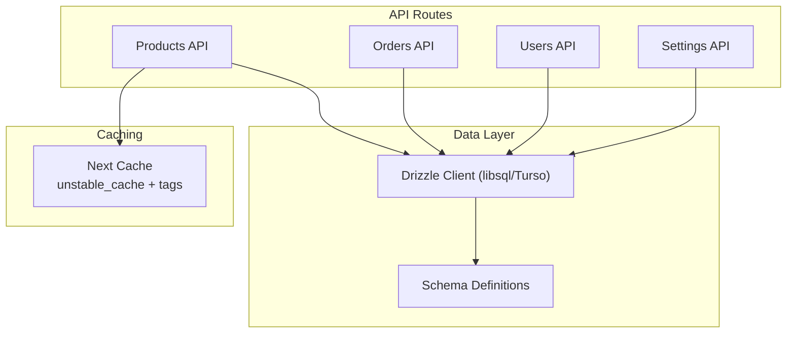
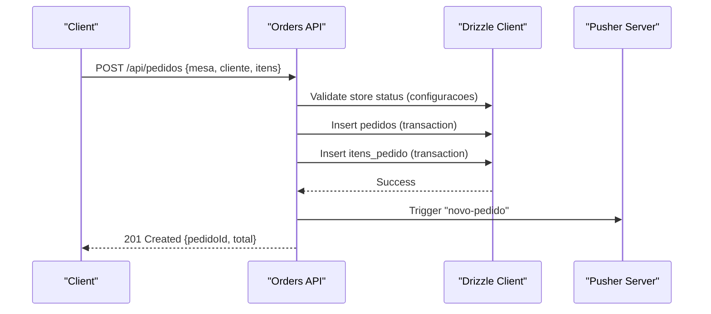
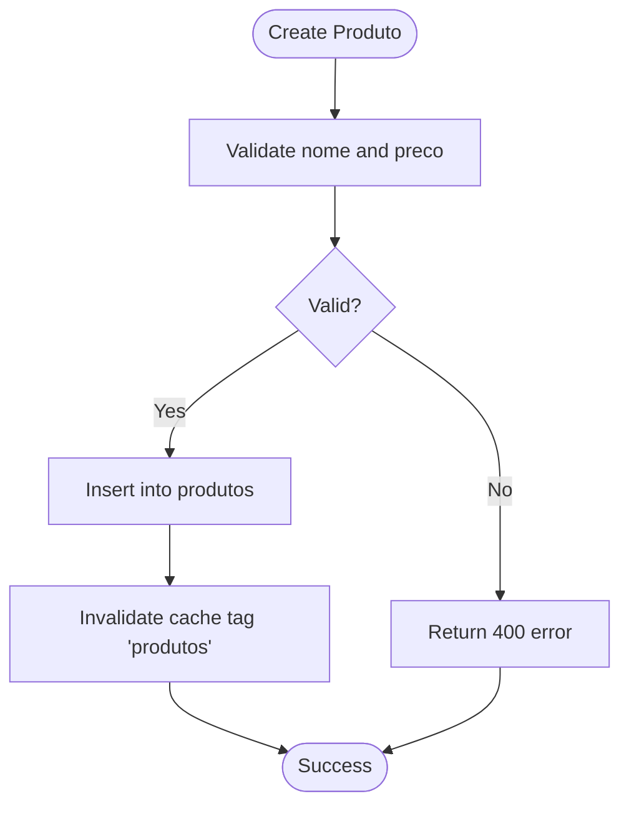
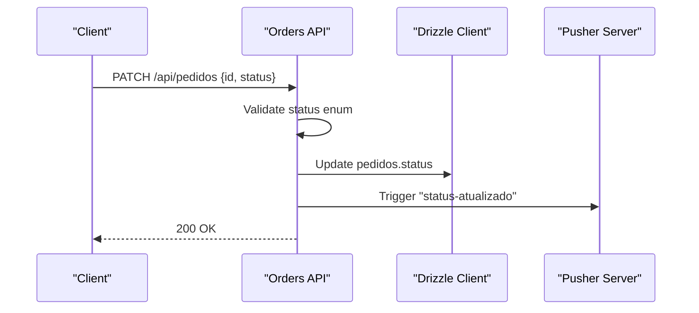
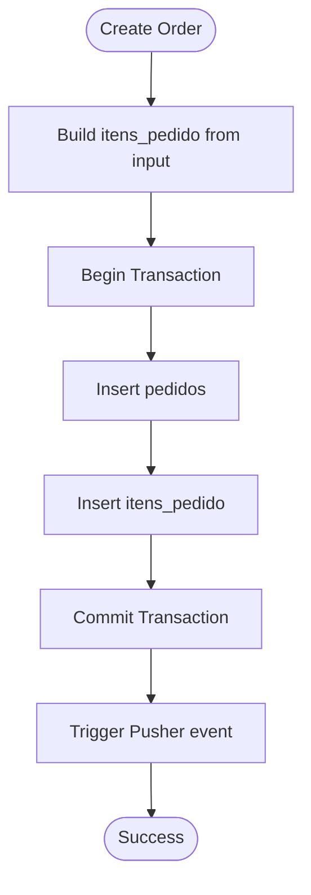
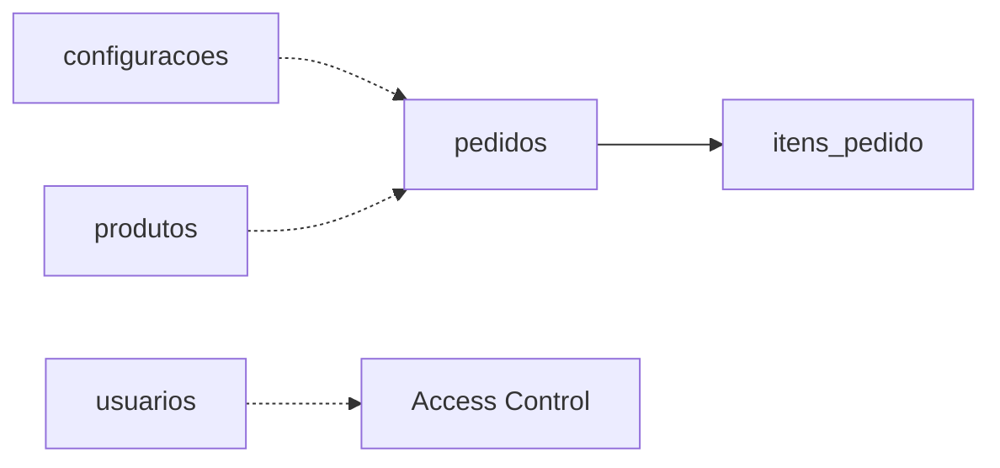
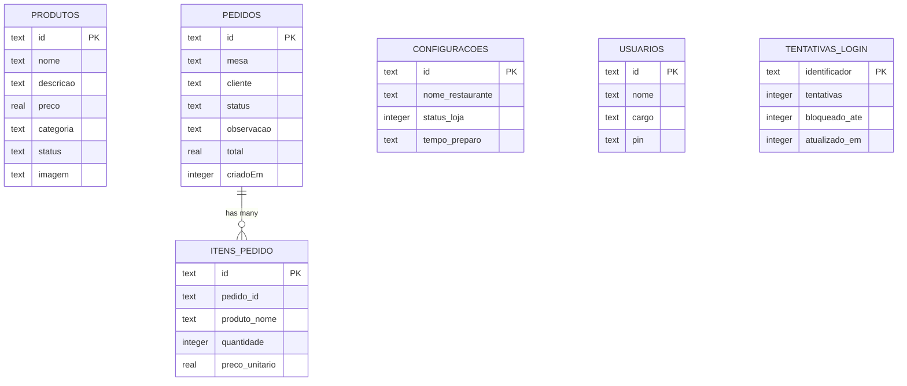

# Database Schema

<cite>
**Referenced Files in This Document**
- [schema.ts](file://src/db/schema.ts)
- [index.ts](file://src/db/index.ts)
- [drizzle.config.ts](file://drizzle.config.ts)
- [produtos-cache.ts](file://src/lib/produtos-cache.ts)
- [route.ts (produtos)](file://src/app/api/produtos/route.ts)
- [route.ts (pedidos)](file://src/app/api/pedidos/route.ts)
- [route.ts (usuarios)](file://src/app/api/usuarios/route.ts)
- [route.ts (settings)](file://src/app/api/settings/route.ts)
- [auth.ts](file://src/lib/auth.ts)
- [seed.ts](file://src/db/seed.ts)
</cite>

## Table of Contents
1. Introduction
2. Project Structure
3. Core Components
4. Architecture Overview
5. Detailed Component Analysis
6. Dependency Analysis
7. Performance Considerations
8. Troubleshooting Guide
9. Conclusion
10. Appendices

## Introduction
This document describes the database schema and data model for Meu Cardápio, focusing on entity relationships, field definitions, data types, constraints, indexes, validation rules enforced at the database level, and data access patterns via Drizzle ORM. It also covers caching strategies for product catalogs, performance considerations for order processing, lifecycle management, backup procedures, migration strategy using Drizzle Kit, security measures, privacy requirements for customer orders, and access control mechanisms.

## Project Structure
The data layer is implemented with Drizzle ORM over a Turso/libSQL database. The schema is defined declaratively and accessed through typed queries. Caching is applied to product catalog reads using Next.js unstable_cache with tag-based invalidation. API routes enforce business rules and role-based access before persisting or reading data.

**Diagram sources**
- [index.ts:1-14](file://src/db/index.ts#L1-L14)
- [schema.ts:1-56](file://src/db/schema.ts#L1-L56)
- [produtos-cache.ts:1-23](file://src/lib/produtos-cache.ts#L1-L23)
- [route.ts (produtos):1-53](file://src/app/api/produtos/route.ts#L1-L53)
- [route.ts (pedidos):1-253](file://src/app/api/pedidos/route.ts#L1-L253)
- [route.ts (usuarios):1-79](file://src/app/api/usuarios/route.ts#L1-L79)
- [route.ts (settings):1-35](file://src/app/api/settings/route.ts#L1-L35)

**Section sources**
- [index.ts:1-14](file://src/db/index.ts#L1-L14)
- [drizzle.config.ts:1-14](file://drizzle.config.ts#L1-L14)

## Core Components
The core entities are:
- produtos (products)
- pedidos (orders)
- itens_pedido (order items)
- usuarios (users)
- configuracoes (settings)
- tentativas_login (login attempts)

Key characteristics:
- All primary keys are text UUIDs generated by the application.
- Numeric fields use SQLite real for prices and totals; integer for counts and timestamps.
- Boolean-like flags use integer with mode boolean where applicable.
- No explicit foreign key constraints are declared; referential integrity is enforced at the application layer.
- No additional indexes beyond primary keys are defined in the schema.

Entity overview:
- produtos: id (PK), nome, descricao, preco, categoria, status (default "Ativo"), imagem
- pedidos: id (PK), mesa, cliente, status (default "pendente"), observacao, total, criadoEm (timestamp)
- itens_pedido: id (PK), pedidoId, produtoNome, quantidade, precoUnitario
- configuracoes: id (PK), nomeRestaurante, statusLoja (boolean), tempoPreparo
- usuarios: id (PK), nome, cargo, pin (hashed)
- tentativas_login: identificador (PK), tentativas, bloqueadoAte, atualizadoEm

**Section sources**
- [schema.ts:1-56](file://src/db/schema.ts#L1-L56)

## Architecture Overview
The system uses a serverless-friendly architecture:
- API routes handle requests, validate inputs, enforce roles, and perform transactions when needed.
- Drizzle ORM executes type-safe SQL against libsql/Turso.
- Product catalog reads are cached with Next.js cache tags to reduce database load.
- Real-time updates are triggered via Pusher after successful writes.

**Diagram sources**
- [route.ts (pedidos):65-189](file://src/app/api/pedidos/route.ts#L65-L189)
- [index.ts:1-14](file://src/db/index.ts#L1-L14)

## Detailed Component Analysis

### Entity: produtos (products)
- Purpose: Catalog entries visible to customers and admins.
- Fields:
  - id: text, primary key (UUID)
  - nome: text, not null
  - descricao: text, nullable
  - preco: real, not null
  - categoria: text, not null
  - status: text, not null, default "Ativo"
  - imagem: text, nullable
- Constraints:
  - Primary key on id
  - Not null constraints on nome, preco, categoria, status
- Indexes: None beyond PK
- Validation and business logic:
  - Creation requires nome and valid preco >= 0; category defaults to "Geral"; image defaults to placeholder if missing; status set to "Ativo".
  - Admin-only creation; public GET returns only active products unless admin.
- Data access patterns:
  - Cached reads for active and all products via unstable_cache with tag invalidation.
  - Writes invalidate cache to ensure consistency.

**Diagram sources**
- [route.ts (produtos):18-52](file://src/app/api/produtos/route.ts#L18-L52)
- [produtos-cache.ts:1-23](file://src/lib/produtos-cache.ts#L1-L23)

**Section sources**
- [schema.ts:4-12](file://src/db/schema.ts#L4-L12)
- [route.ts (produtos):1-53](file://src/app/api/produtos/route.ts#L1-L53)
- [produtos-cache.ts:1-23](file://src/lib/produtos-cache.ts#L1-L23)

### Entity: pedidos (orders)
- Purpose: Represents a customer order associated with a table or counter.
- Fields:
  - id: text, primary key (UUID)
  - mesa: text, not null
  - cliente: text, not null
  - status: text, not null, default "pendente"
  - observacao: text, nullable
  - total: real, not null
  - criadoEm: integer timestamp, not null
- Constraints:
  - Primary key on id
  - Not null constraints on mesa, cliente, status, total, criadoEm
- Indexes: None beyond PK
- Validation and business logic:
  - Store must be open (statusLoaja true) to create orders.
  - Requires at least one item; validates quantities and prices; enforces table format ("Mesa N") or "Balcão".
  - Status transitions validated on update; allowed values: pendente, preparando, pronto, entregue, cancelado.
  - Transactions used to persist order and items atomically.
  - Real-time notification via Pusher after success.

**Diagram sources**
- [route.ts (pedidos):192-235](file://src/app/api/pedidos/route.ts#L192-L235)

**Section sources**
- [schema.ts:15-23](file://src/db/schema.ts#L15-L23)
- [route.ts (pedidos):15-63](file://src/app/api/pedidos/route.ts#L15-L63)
- [route.ts (pedidos):65-189](file://src/app/api/pedidos/route.ts#L65-L189)
- [route.ts (pedidos):192-235](file://src/app/api/pedidos/route.ts#L192-L235)

### Entity: itens_pedido (order items)
- Purpose: Line items belonging to an order.
- Fields:
  - id: text, primary key (UUID)
  - pedidoId: text, not null
  - produtoNome: text, not null
  - quantidade: integer, not null
  - precoUnitario: real, not null
- Constraints:
  - Primary key on id
  - Not null constraints on pedidoId, produtoNome, quantidade, precoUnitario
- Indexes: None beyond PK
- Validation and business logic:
  - Items are created within the same transaction as the parent order.
  - Unit price is derived from product catalog when available; otherwise validated from request payload.
  - Deletion cascades via application logic (delete items then order).

**Diagram sources**
- [route.ts (pedidos):147-185](file://src/app/api/pedidos/route.ts#L147-L185)

**Section sources**
- [schema.ts:26-32](file://src/db/schema.ts#L26-L32)
- [route.ts (pedidos):147-185](file://src/app/api/pedidos/route.ts#L147-L185)

### Entity: configuracoes (settings)
- Purpose: Global settings controlling store availability and preparation time display.
- Fields:
  - id: text, primary key (UUID)
  - nomeRestaurante: text, not null
  - statusLoja: integer boolean, not null
  - tempoPreparo: text, not null
- Constraints:
  - Primary key on id
  - Not null constraints on nomeRestaurante, statusLoja, tempoPreparo
- Indexes: None beyond PK
- Validation and business logic:
  - Single record pattern managed by application; GET returns first row; POST upserts based on existence.
  - Store closure blocks order creation.

**Section sources**
- [schema.ts:35-40](file://src/db/schema.ts#L35-L40)
- [route.ts (settings):1-35](file://src/app/api/settings/route.ts#L1-L35)

### Entity: usuarios (users)
- Purpose: Staff accounts with roles for access control.
- Fields:
  - id: text, primary key (UUID)
  - nome: text, not null
  - cargo: text, not null
  - pin: text, not null (hashed)
- Constraints:
  - Primary key on id
  - Not null constraints on nome, cargo, pin
- Indexes: None beyond PK
- Validation and business logic:
  - Role normalization ensures consistent values.
  - PIN hashed before storage; list endpoints exclude sensitive fields.
  - Only one admin allowed per instance enforced at application level.

**Section sources**
- [schema.ts:43-48](file://src/db/schema.ts#L43-L48)
- [route.ts (usuarios):1-79](file://src/app/api/usuarios/route.ts#L1-L79)
- [auth.ts:1-82](file://src/lib/auth.ts#L1-L82)

### Entity: tentativas_login (login attempts)
- Purpose: Tracks login attempts and optional lockout state.
- Fields:
  - identificador: text, primary key
  - tentativas: integer, not null, default 0
  - bloqueadoAte: integer, nullable
  - atualizadoEm: integer, not null
- Constraints:
  - Primary key on identificador
  - Not null constraints on tentativas, atualizadoEm
- Indexes: None beyond PK

**Section sources**
- [schema.ts:50-55](file://src/db/schema.ts#L50-L55)

## Dependency Analysis
- Schema defines tables without explicit foreign keys; referential integrity between pedidos and itens_pedido is enforced by application logic during insert/delete.
- Orders depend on configuracoes to gate creation based on store status.
- Users influence access control via roles; no direct DB relationship to other entities.
- Caching depends on cache tags to keep product catalog consistent across mutations.

**Diagram sources**
- [schema.ts:15-32](file://src/db/schema.ts#L15-L32)
- [route.ts (pedidos):65-189](file://src/app/api/pedidos/route.ts#L65-L189)

**Section sources**
- [schema.ts:15-32](file://src/db/schema.ts#L15-L32)
- [route.ts (pedidos):65-189](file://src/app/api/pedidos/route.ts#L65-L189)

## Performance Considerations
- Caching:
  - Product catalog reads are cached with Next.js unstable_cache and revalidated every 300 seconds; tag-based invalidation ensures immediate refresh after mutations.
- Transactions:
  - Order creation and deletion use transactions to maintain consistency between pedidos and itens_pedido.
- Query efficiency:
  - Reads filter by status for active products to reduce payload size.
  - Bulk retrieval of items for orders uses inArray filters to minimize round-trips.
- Recommendations:
  - Add indexes on frequently filtered columns such as pedidos.status, produtos.status, and itens_pedido.pedidoId to improve query performance at scale.
  - Consider partitioning or archiving old orders if dataset grows significantly.

[No sources needed since this section provides general guidance]

## Troubleshooting Guide
Common issues and resolutions:
- Store closed:
  - If configuracoes.statusLoja is false, order creation returns 403. Enable store via settings endpoint.
- Invalid order items:
  - Ensure each item has a valid name, positive quantity <= 99, and valid price; if referencing a product, it must exist and be active.
- Authentication failures:
  - Use requireAuth/requireAdmin/requireKitchen to protect endpoints; verify cookies and roles.
- Cache inconsistencies:
  - After mutating products, ensure cache invalidation is invoked to avoid stale reads.

**Section sources**
- [route.ts (pedidos):65-85](file://src/app/api/pedidos/route.ts#L65-L85)
- [route.ts (pedidos):100-130](file://src/app/api/pedidos/route.ts#L100-L130)
- [auth.ts:63-82](file://src/lib/auth.ts#L63-L82)
- [produtos-cache.ts:20-23](file://src/lib/produtos-cache.ts#L20-L23)

## Conclusion
The Meu Cardápio database schema centers around five core entities with clear responsibilities and straightforward constraints. Referential integrity and business rules are enforced at the application layer, while Drizzle ORM provides type safety and clean queries. Caching improves read performance for the product catalog, and transactions ensure data consistency during order processing. Security is handled via role-based access and hashed credentials, with careful handling of sensitive data in responses.

[No sources needed since this section summarizes without analyzing specific files]

## Appendices

### Data Model Diagram

**Diagram sources**
- [schema.ts:4-55](file://src/db/schema.ts#L4-L55)

### Data Access Patterns via Drizzle ORM
- Products:
  - Read active/all products via select().from(produtos) with where clauses; cached with unstable_cache and tags.
- Orders:
  - Create with db.transaction to insert pedidos and itens_pedido atomically.
  - Update status with update(pedidos).set({ status }).where(eq(...)).
  - Delete with delete(itens_pedido).where(...) followed by delete(pedidos).where(...).
- Settings:
  - Upsert single configuration record by checking existence and inserting or updating.
- Users:
  - List excludes sensitive fields; create hashes PIN before insertion.

**Section sources**
- [produtos-cache.ts:8-18](file://src/lib/produtos-cache.ts#L8-L18)
- [route.ts (pedidos):147-185](file://src/app/api/pedidos/route.ts#L147-L185)
- [route.ts (pedidos):192-235](file://src/app/api/pedidos/route.ts#L192-L235)
- [route.ts (settings):16-35](file://src/app/api/settings/route.ts#L16-L35)
- [route.ts (usuarios):21-79](file://src/app/api/usuarios/route.ts#L21-L79)

### Caching Strategy for Product Catalog
- Uses Next.js unstable_cache with tags ["produtos-ativos"], ["produtos-todos"].
- Revalidation interval: 300 seconds.
- Tag invalidation invoked after product mutations to ensure freshness.

**Section sources**
- [produtos-cache.ts:1-23](file://src/lib/produtos-cache.ts#L1-L23)
- [route.ts (produtos):45-46](file://src/app/api/produtos/route.ts#L45-L46)

### Data Lifecycle Management
- Creation:
  - Products: Admin-only creation with validation and default values.
  - Orders: Customer-facing creation with strict validation and transactional persistence.
  - Users: Admin-only creation with role normalization and PIN hashing.
  - Settings: Single-record upsert pattern.
- Updates:
  - Orders: Status transitions validated and persisted; real-time notifications sent.
- Deletion:
  - Orders: Cascade delete of items then order within a transaction.

**Section sources**
- [route.ts (produtos):18-52](file://src/app/api/produtos/route.ts#L18-L52)
- [route.ts (pedidos):65-189](file://src/app/api/pedidos/route.ts#L65-L189)
- [route.ts (pedidos):192-235](file://src/app/api/pedidos/route.ts#L192-L235)
- [route.ts (pedidos):237-253](file://src/app/api/pedidos/route.ts#L237-L253)
- [route.ts (usuarios):21-79](file://src/app/api/usuarios/route.ts#L21-L79)
- [route.ts (settings):16-35](file://src/app/api/settings/route.ts#L16-L35)

### Backup Procedures
- Local development:
  - Default file-based database path dev.db can be backed up directly.
- Production (Turso):
  - Use Turso’s built-in backup features or export snapshots via CLI tools provided by the platform.
- Recommended cadence:
  - Periodic automated backups aligned with deployment cycles and peak usage times.

[No sources needed since this section provides general guidance]

### Migration Strategy Using Drizzle Kit
- Configuration:
  - drizzle.config.ts points to schema and output directory, dialect set to turso, credentials via environment variables.
- Workflow:
  - Generate migrations from schema changes and apply them to target databases.
  - Seed initial data using seed script to populate default settings and sample products.

**Section sources**
- [drizzle.config.ts:1-14](file://drizzle.config.ts#L1-L14)
- [seed.ts:1-57](file://src/db/seed.ts#L1-L57)

### Data Security and Privacy
- Authentication and Authorization:
  - Role-based access control via cookies and middleware functions; endpoints protected by requireAuth/requireAdmin/requireKitchen.
- Secrets Handling:
  - PINs are hashed before storage; sensitive fields excluded from responses.
- Privacy for Customer Orders:
  - Unauthenticated clients can retrieve their own orders by providing IDs received at creation time; staff can view all orders.
- Transport Security:
  - Cookies configured with secure flag in production and httpOnly to mitigate XSS risks.

**Section sources**
- [auth.ts:13-23](file://src/lib/auth.ts#L13-L23)
- [auth.ts:51-82](file://src/lib/auth.ts#L51-L82)
- [route.ts (pedidos):15-63](file://src/app/api/pedidos/route.ts#L15-L63)
- [route.ts (usuarios):7-19](file://src/app/api/usuarios/route.ts#L7-L19)