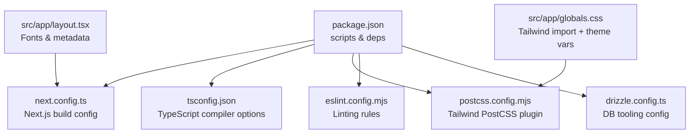
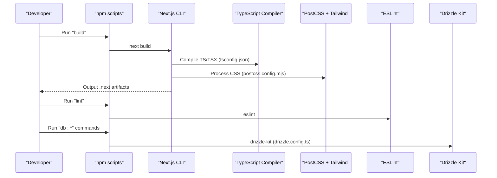
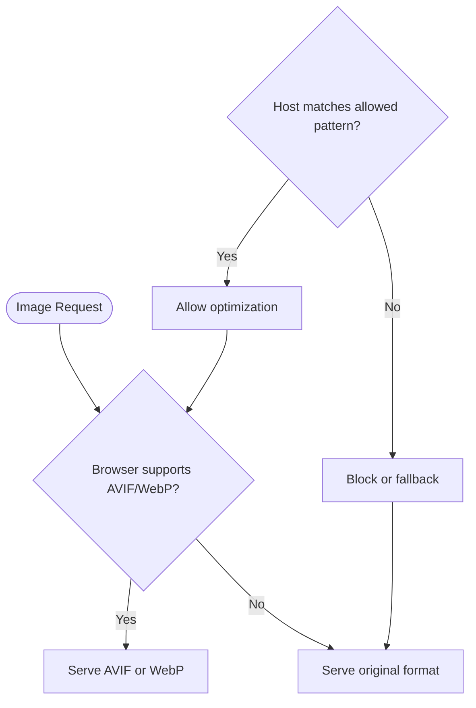
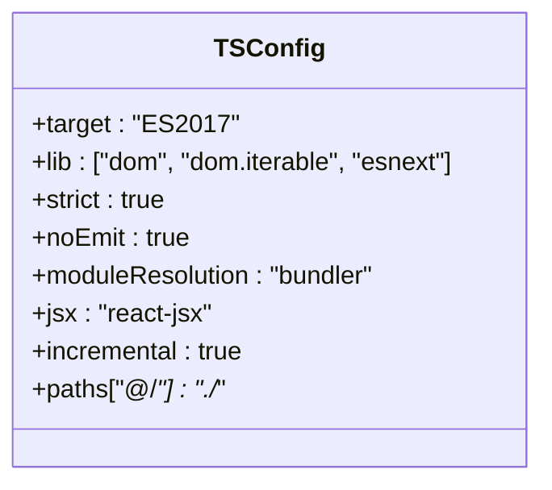
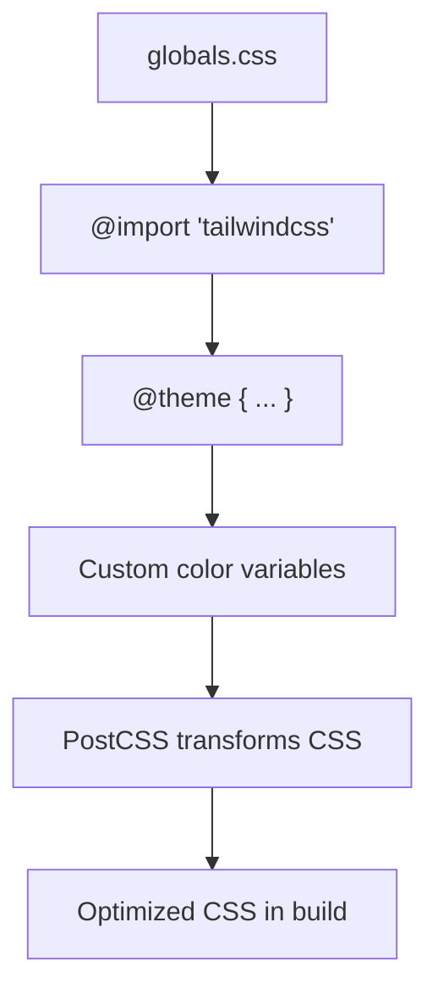
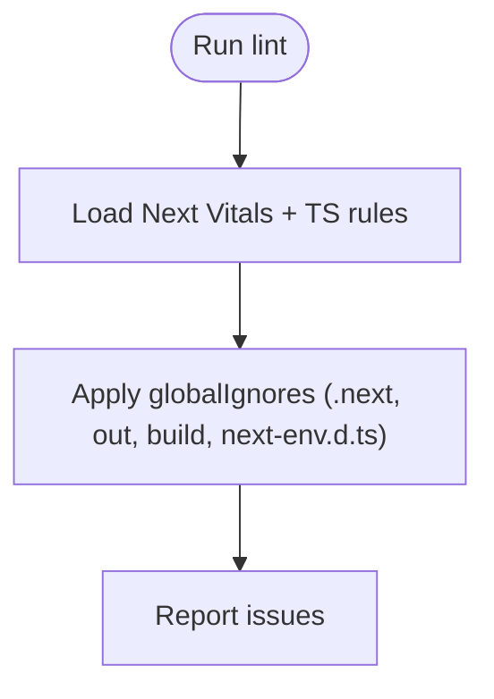
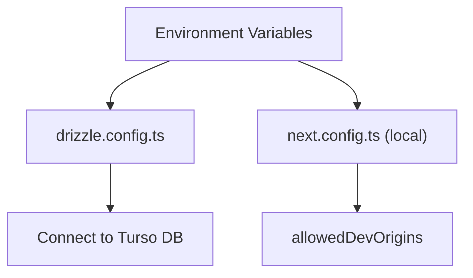
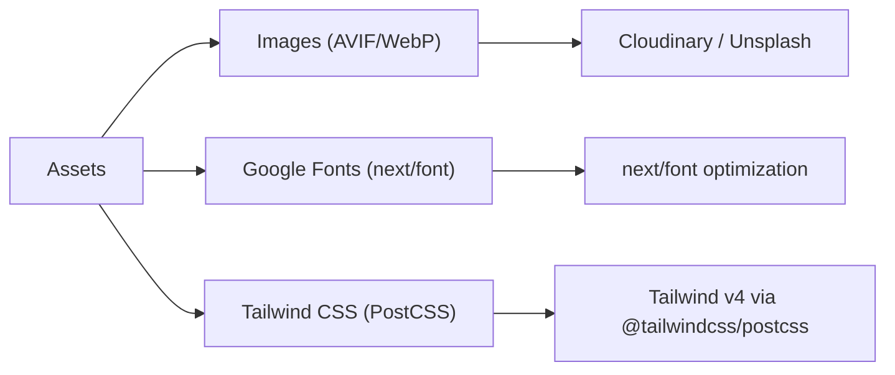
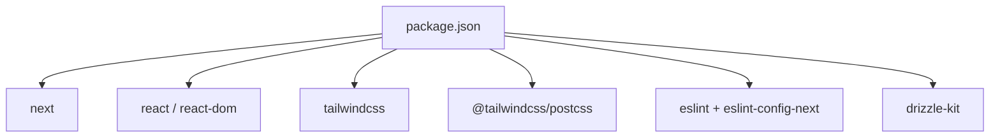

# Build Configuration

<cite>
**Referenced Files in This Document**
- [next.config.ts](file://next.config.ts)
- [tsconfig.json](file://tsconfig.json)
- [postcss.config.mjs](file://postcss.config.mjs)
- [eslint.config.mjs](file://eslint.config.mjs)
- [package.json](file://package.json)
- [drizzle.config.ts](file://drizzle.config.ts)
- [globals.css](file://src/app/globals.css)
- [layout.tsx](file://src/app/layout.tsx)
</cite>

## Table of Contents
1. [Introduction](#introduction)
2. [Project Structure](#project-structure)
3. [Core Components](#core-components)
4. [Architecture Overview](#architecture-overview)
5. [Detailed Component Analysis](#detailed-component-analysis)
6. [Dependency Analysis](#dependency-analysis)
7. [Performance Considerations](#performance-considerations)
8. [Troubleshooting Guide](#troubleshooting-guide)
9. [Conclusion](#conclusion)

## Introduction
This document explains the build configuration for the Meu Cardápio application, focusing on Next.js build optimization, image formats and remote patterns, TypeScript compilation, PostCSS/Tailwind processing, ESLint rules, environment-specific settings, asset optimization strategies, bundle analysis techniques, performance tuning, caching strategies, and troubleshooting common issues.

## Project Structure
The project uses a standard Next.js App Router layout with dedicated configuration files for the build pipeline:
- next.config.ts defines Next.js runtime and build behavior (images, remote patterns).
- tsconfig.json configures TypeScript compilation and path aliases.
- postcss.config.mjs wires Tailwind CSS via @tailwindcss/postcss.
- eslint.config.mjs sets code quality rules using Next’s recommended configs.
- package.json provides scripts and dependencies that drive the build process.
- drizzle.config.ts is used by database tooling during development and migrations.
- src/app/globals.css imports Tailwind and defines theme variables.
- src/app/layout.tsx sets up fonts and global metadata.

**Diagram sources**
- [package.json:1-45](file://package.json#L1-L45)
- [next.config.ts:1-14](file://next.config.ts#L1-L14)
- [tsconfig.json:1-35](file://tsconfig.json#L1-L35)
- [postcss.config.mjs:1-8](file://postcss.config.mjs#L1-L8)
- [eslint.config.mjs:1-19](file://eslint.config.mjs#L1-L19)
- [drizzle.config.ts:1-14](file://drizzle.config.ts#L1-L14)
- [globals.css:1-31](file://src/app/globals.css#L1-L31)
- [layout.tsx:1-34](file://src/app/layout.tsx#L1-L34)

**Section sources**
- [package.json:1-45](file://package.json#L1-L45)
- [next.config.ts:1-14](file://next.config.ts#L1-L14)
- [tsconfig.json:1-35](file://tsconfig.json#L1-L35)
- [postcss.config.mjs:1-8](file://postcss.config.mjs#L1-L8)
- [eslint.config.mjs:1-19](file://eslint.config.mjs#L1-L19)
- [drizzle.config.ts:1-14](file://drizzle.config.ts#L1-L14)
- [globals.css:1-31](file://src/app/globals.css#L1-L31)
- [layout.tsx:1-34](file://src/app/layout.tsx#L1-L34)

## Core Components
- Next.js build configuration: Defines image optimization formats and allowed remote image hosts.
- TypeScript compilation: Strict mode, incremental builds, bundler module resolution, JSX transform, path aliases.
- PostCSS + Tailwind: Uses @tailwindcss/postcss to process styles; theme variables defined in globals.css.
- ESLint: Uses Next’s core-web-vitals and TypeScript presets; customizes ignores.
- Scripts and dependencies: npm scripts for dev/build/start/lint and DB tooling; pinned versions for Next, React, Tailwind, and ESLint.

**Section sources**
- [next.config.ts:1-14](file://next.config.ts#L1-L14)
- [tsconfig.json:1-35](file://tsconfig.json#L1-L35)
- [postcss.config.mjs:1-8](file://postcss.config.mjs#L1-L8)
- [eslint.config.mjs:1-19](file://eslint.config.mjs#L1-L19)
- [package.json:1-45](file://package.json#L1-L45)

## Architecture Overview
The build pipeline integrates several tools orchestrated by npm scripts and Next.js:
- Development: next dev runs the dev server with hot reloading.
- Build: next build compiles TypeScript, processes Tailwind CSS, optimizes images, and generates static assets.
- Linting: eslint enforces code quality using Next’s recommended configurations.
- Database tooling: drizzle-kit commands use drizzle.config.ts to generate/migrate schema.

**Diagram sources**
- [package.json:1-45](file://package.json#L1-L45)
- [next.config.ts:1-14](file://next.config.ts#L1-L14)
- [tsconfig.json:1-35](file://tsconfig.json#L1-L35)
- [postcss.config.mjs:1-8](file://postcss.config.mjs#L1-L8)
- [eslint.config.mjs:1-19](file://eslint.config.mjs#L1-L19)
- [drizzle.config.ts:1-14](file://drizzle.config.ts#L1-L14)

## Detailed Component Analysis

### Next.js Build Optimization and Image Settings
- Image formats: AVIF and WebP are enabled for optimized delivery when supported by the browser.
- Remote patterns: Cloudinary and Unsplash domains are whitelisted for dynamic image fetching and optimization.
- No additional Next.js optimizations (e.g., webpack overrides) are configured here; defaults apply.

**Diagram sources**
- [next.config.ts:1-14](file://next.config.ts#L1-L14)

**Section sources**
- [next.config.ts:1-14](file://next.config.ts#L1-L14)

### TypeScript Compilation Settings
- Target ES2017 with modern DOM libraries.
- Strict mode enabled; no emit (Next handles output); isolated modules for faster builds.
- Module resolution set to bundler for compatibility with Next’s bundler.
- Path alias “@/*” maps to root directory for cleaner imports.
- Incremental compilation enabled to speed up rebuilds.

**Diagram sources**
- [tsconfig.json:1-35](file://tsconfig.json#L1-L35)

**Section sources**
- [tsconfig.json:1-35](file://tsconfig.json#L1-L35)

### PostCSS and Tailwind CSS Processing
- PostCSS uses @tailwindcss/postcss to process styles.
- Tailwind is imported directly in globals.css with a theme block defining custom colors and variables.
- The setup leverages Tailwind v4 style approach via the PostCSS plugin.

**Diagram sources**
- [postcss.config.mjs:1-8](file://postcss.config.mjs#L1-L8)
- [globals.css:1-31](file://src/app/globals.css#L1-L31)

**Section sources**
- [postcss.config.mjs:1-8](file://postcss.config.mjs#L1-L8)
- [globals.css:1-31](file://src/app/globals.css#L1-L31)

### ESLint Rules and Code Quality
- Uses eslint-config-next/core-web-vitals and typescript presets.
- Overrides default ignores to exclude generated directories and env type files.
- Ensures consistent code quality aligned with Next.js best practices.

**Diagram sources**
- [eslint.config.mjs:1-19](file://eslint.config.mjs#L1-L19)

**Section sources**
- [eslint.config.mjs:1-19](file://eslint.config.mjs#L1-L19)

### Environment-Specific Build Configurations
- Drizzle configuration reads TURSO_DATABASE_URL and TURSO_AUTH_TOKEN from environment variables for local/dev usage.
- No explicit .env files are present in the repository; environment variables should be provided at runtime or via deployment platform settings.
- The local-only Next config includes allowedDevOrigins for development networking.

**Diagram sources**
- [drizzle.config.ts:1-14](file://drizzle.config.ts#L1-L14)
- [next.config.ts:1-14](file://next.config.ts#L1-L14)

**Section sources**
- [drizzle.config.ts:1-14](file://drizzle.config.ts#L1-L14)
- [next.config.ts:1-14](file://next.config.ts#L1-L14)

### Asset Optimization Strategies
- Images: AVIF and WebP formats are prioritized for supported browsers; remote patterns allow Cloudinary and Unsplash.
- Fonts: Google fonts are loaded via next/font with variable names applied globally.
- CSS: Tailwind is processed through PostCSS; custom theme variables are defined in globals.css.

**Diagram sources**
- [next.config.ts:1-14](file://next.config.ts#L1-L14)
- [layout.tsx:1-34](file://src/app/layout.tsx#L1-L34)
- [globals.css:1-31](file://src/app/globals.css#L1-L31)
- [postcss.config.mjs:1-8](file://postcss.config.mjs#L1-L8)

**Section sources**
- [next.config.ts:1-14](file://next.config.ts#L1-L14)
- [layout.tsx:1-34](file://src/app/layout.tsx#L1-L34)
- [globals.css:1-31](file://src/app/globals.css#L1-L31)
- [postcss.config.mjs:1-8](file://postcss.config.mjs#L1-L8)

### Bundle Analysis Techniques
- While not explicitly configured in this repository, you can analyze the Next.js bundle using third-party tools such as next-bundle-analyzer or Next’s built-in profiling features.
- Typical steps include installing an analyzer plugin, adding it to the build script, and running the build to generate a report.

[No sources needed since this section provides general guidance]

## Dependency Analysis
Key dependencies driving the build:
- next: Core framework and build tooling.
- react/react-dom: UI library.
- tailwindcss and @tailwindcss/postcss: Styling pipeline.
- eslint and eslint-config-next: Code quality.
- drizzle-kit: Database schema tooling.

**Diagram sources**
- [package.json:1-45](file://package.json#L1-L45)

**Section sources**
- [package.json:1-45](file://package.json#L1-L45)

## Performance Considerations
- Image optimization: AVIF and WebP reduce payload size where supported; ensure remote patterns match actual image hosts.
- TypeScript incremental builds: Speeds up rebuilds during development.
- Tailwind processing: Using @tailwindcss/postcss ensures efficient CSS generation.
- Font loading: next/font reduces layout shifts and improves performance.
- Avoid unnecessary dependencies to keep bundles small.

[No sources needed since this section provides general guidance]

## Troubleshooting Guide
Common build issues and resolutions:
- Image optimization errors: Verify remotePatterns include all required hostnames (Cloudinary, Unsplash). Ensure HTTPS protocols are correctly specified.
- Tailwind not applying: Confirm @tailwindcss/postcss is installed and referenced in postcss.config.mjs; ensure globals.css imports Tailwind and theme variables are valid.
- TypeScript errors: Check strict mode settings and path aliases; ensure next-plugin is included in tsconfig plugins.
- ESLint failures: Review eslint-config-next rules; adjust ignores if necessary.
- Database tooling: Ensure environment variables for Turso are set when running drizzle commands.

**Section sources**
- [next.config.ts:1-14](file://next.config.ts#L1-L14)
- [postcss.config.mjs:1-8](file://postcss.config.mjs#L1-L8)
- [tsconfig.json:1-35](file://tsconfig.json#L1-L35)
- [eslint.config.mjs:1-19](file://eslint.config.mjs#L1-L19)
- [drizzle.config.ts:1-14](file://drizzle.config.ts#L1-L14)

## Conclusion
The Meu Cardápio application’s build configuration centers around Next.js with strong emphasis on image optimization (AVIF/WebP), Tailwind CSS via PostCSS, strict TypeScript settings, and Next-aligned ESLint rules. Environment variables drive database connectivity, while scripts orchestrate development, building, linting, and database tasks. For further performance gains, consider integrating bundle analysis tools and refining dependency usage based on measured impact.