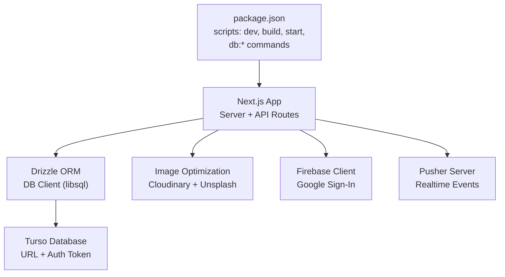
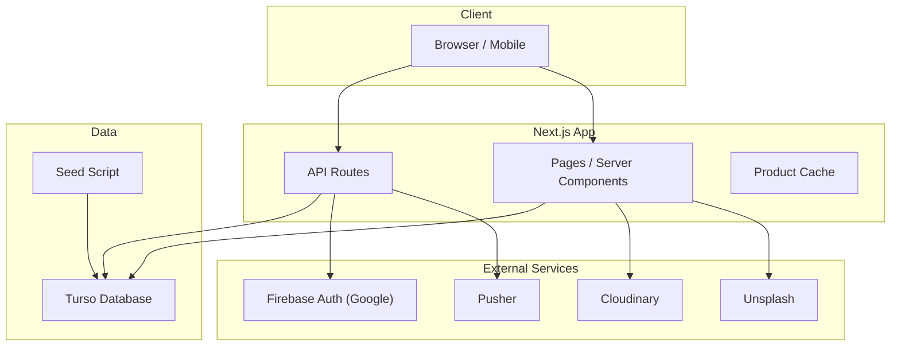
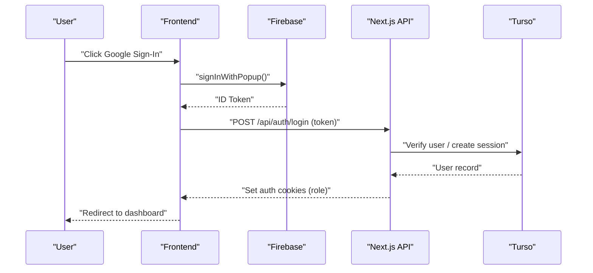
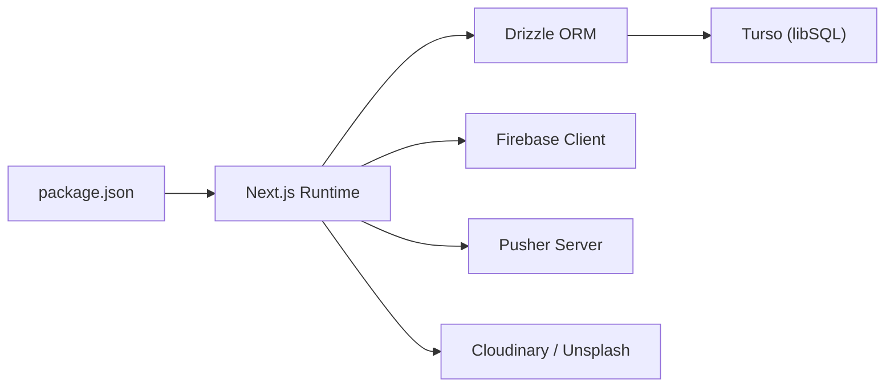

# Deployment & DevOps

<cite>
**Referenced Files in This Document**
- [package.json](file://package.json)
- [next.config.ts](file://next.config.ts)
- [drizzle.config.ts](file://drizzle.config.ts)
- [tsconfig.json](file://tsconfig.json)
- [src/db/index.ts](file://src/db/index.ts)
- [src/db/schema.ts](file://src/db/schema.ts)
- [src/db/seed.ts](file://src/db/seed.ts)
- [src/lib/auth.ts](file://src/lib/auth.ts)
- [src/lib/firebase-client.ts](file://src/lib/firebase-client.ts)
- [src/lib/pusher-server.ts](file://src/lib/pusher-server.ts)
- [src/lib/produtos-cache.ts](file://src/lib/produtos-cache.ts)
- [src/app/api/auth/setup/route.ts](file://src/app/api/auth/setup/route.ts)
</cite>

## Table of Contents
1. Introduction
2. Project Structure
3. Core Components
4. Architecture Overview
5. Detailed Component Analysis
6. Dependency Analysis
7. Performance Considerations
8. Troubleshooting Guide
9. Conclusion
10. Appendices

## Introduction
This document provides production deployment and DevOps guidance for the Meu Cardápio application, a Next.js-based restaurant menu and ordering system. It covers build processes, environment configuration, and deployment pipelines for Vercel, Docker containers, and traditional servers. It also details environment variable management, database provisioning with Turso (SQLite/Turso), external service configuration (Firebase Auth and Pusher), monitoring and logging strategies, scaling considerations, disaster recovery, security hardening, SSL certificate management, compliance considerations, deployment checklists, troubleshooting, and maintenance procedures.

## Project Structure
The project is a Next.js application using Server Actions and API routes, Drizzle ORM with Turso, Firebase client-side authentication, and optional Pusher for real-time features. The root package.json defines build and database scripts used across environments.

**Diagram sources**
- [package.json:1-45](file://package.json#L1-L45)
- [next.config.ts:1-14](file://next.config.ts#L1-L14)
- [src/db/index.ts:1-14](file://src/db/index.ts#L1-L14)
- [src/lib/firebase-client.ts:1-26](file://src/lib/firebase-client.ts#L1-L26)
- [src/lib/pusher-server.ts:1-11](file://src/lib/pusher-server.ts#L1-L11)

**Section sources**
- [package.json:1-45](file://package.json#L1-L45)
- [next.config.ts:1-14](file://next.config.ts#L1-L14)
- [tsconfig.json:1-35](file://tsconfig.json#L1-L35)

## Core Components
- Build and runtime: Next.js with Node.js serverless or containerized runtime; scripts for development, build, and production start.
- Database: Drizzle ORM configured for Turso; schema defines core entities; seed script initializes default data.
- Authentication: PIN-based role cookies for internal roles; optional Google sign-in via Firebase client.
- Real-time: Optional Pusher integration for live updates.
- Caching: Next.js unstable_cache for product listings with tag-based invalidation.

Key responsibilities:
- package.json: orchestrates build, DB migrations, seeding, and linting.
- next.config.ts: image optimization and allowed remote patterns.
- drizzle.config.ts: dialect and credentials for Turso.
- src/db/index.ts: libSQL client initialization with env-driven URL and token.
- src/db/schema.ts: table definitions for products, orders, users, and settings.
- src/db/seed.ts: initial data population.
- src/lib/auth.ts: cookie-based auth helpers and role checks.
- src/lib/firebase-client.ts: Firebase client initialization and Google sign-in flow.
- src/lib/pusher-server.ts: Pusher server instance guarded by required env vars.
- src/lib/produtos-cache.ts: cached queries for active and all products.

**Section sources**
- [package.json:1-45](file://package.json#L1-L45)
- [next.config.ts:1-14](file://next.config.ts#L1-L14)
- [drizzle.config.ts:1-14](file://drizzle.config.ts#L1-L14)
- [src/db/index.ts:1-14](file://src/db/index.ts#L1-L14)
- [src/db/schema.ts:1-56](file://src/db/schema.ts#L1-L56)
- [src/db/seed.ts:1-57](file://src/db/seed.ts#L1-L57)
- [src/lib/auth.ts:1-82](file://src/lib/auth.ts#L1-L82)
- [src/lib/firebase-client.ts:1-26](file://src/lib/firebase-client.ts#L1-L26)
- [src/lib/pusher-server.ts:1-11](file://src/lib/pusher-server.ts#L1-L11)
- [src/lib/produtos-cache.ts:1-23](file://src/lib/produtos-cache.ts#L1-L23)

## Architecture Overview
The application runs as a Next.js app with server-side API routes and client-side pages. Data persistence uses Turso (SQLite-compatible). External services include Firebase for Google authentication and Pusher for real-time messaging. Images are optimized through Next.js and served from Cloudinary and Unsplash.

**Diagram sources**
- [next.config.ts:1-14](file://next.config.ts#L1-L14)
- [src/db/index.ts:1-14](file://src/db/index.ts#L1-L14)
- [src/lib/firebase-client.ts:1-26](file://src/lib/firebase-client.ts#L1-L26)
- [src/lib/pusher-server.ts:1-11](file://src/lib/pusher-server.ts#L1-L11)
- [src/db/seed.ts:1-57](file://src/db/seed.ts#L1-L57)

## Detailed Component Analysis

### Build and Runtime Pipeline
- Development: run dev server with hot reload.
- Build: static assets and server bundles generated for production.
- Start: run the production server.
- Database: generate schema, push to Turso, migrate, seed, and open studio.

Recommended pipeline steps:
- Install dependencies.
- Run linters.
- Build the app.
- Apply migrations and seed data.
- Start the server.

**Section sources**
- [package.json:1-45](file://package.json#L1-L45)

### Environment Configuration
Critical environment variables:
- Database:
  - TURSO_DATABASE_URL: connection string for Turso.
  - TURSO_AUTH_TOKEN: authentication token for Turso.
- Authentication:
  - NEXT_PUBLIC_FIREBASE_API_KEY
  - NEXT_PUBLIC_FIREBASE_AUTH_DOMAIN
  - NEXT_PUBLIC_FIREBASE_PROJECT_ID
  - NEXT_PUBLIC_FIREBASE_APP_ID
- Real-time:
  - PUSHER_APP_ID
  - NEXT_PUBLIC_PUSHER_KEY
  - PUSHER_SECRET
  - NEXT_PUBLIC_PUSHER_CLUSTER
- Setup protection:
  - SETUP_SECRET: optional secret protecting the setup endpoint.

Notes:
- Image optimization allows Cloudinary and Unsplash domains.
- Cookie security flags adapt based on NODE_ENV.

**Section sources**
- [next.config.ts:1-14](file://next.config.ts#L1-L14)
- [src/db/index.ts:1-14](file://src/db/index.ts#L1-L14)
- [src/lib/firebase-client.ts:1-26](file://src/lib/firebase-client.ts#L1-L26)
- [src/lib/pusher-server.ts:1-11](file://src/lib/pusher-server.ts#L1-L11)
- [src/app/api/auth/setup/route.ts:1-45](file://src/app/api/auth/setup/route.ts#L1-L45)
- [src/lib/auth.ts:1-82](file://src/lib/auth.ts#L1-L82)

### Database Provisioning and Migrations
- Schema defined in TypeScript with Drizzle ORM.
- Drizzle config targets Turso dialect with credentials from environment.
- Seed script inserts default configurations and sample products.

Operational steps:
- Generate types and migrations.
- Push schema to Turso.
- Run migrations if needed.
- Seed initial data.

**Section sources**
- [src/db/schema.ts:1-56](file://src/db/schema.ts#L1-L56)
- [drizzle.config.ts:1-14](file://drizzle.config.ts#L1-L14)
- [src/db/seed.ts:1-57](file://src/db/seed.ts#L1-L57)

### Authentication Flow
- Internal PIN-based roles stored as hashed values; cookies set per role with secure flags in production.
- Optional Google sign-in via Firebase client; requires public Firebase env vars.

Flow overview:
- Client initiates Google sign-in.
- Firebase returns ID token.
- Backend validates session and sets role-specific cookies.
- Protected endpoints enforce role requirements.

**Diagram sources**
- [src/lib/firebase-client.ts:1-26](file://src/lib/firebase-client.ts#L1-L26)
- [src/lib/auth.ts:1-82](file://src/lib/auth.ts#L1-L82)

**Section sources**
- [src/lib/auth.ts:1-82](file://src/lib/auth.ts#L1-L82)
- [src/lib/firebase-client.ts:1-26](file://src/lib/firebase-client.ts#L1-L26)

### Real-time Integration (Pusher)
- Pusher server instance created only when all required env vars are present.
- Use TLS enabled for secure connections.

Operational notes:
- Ensure all Pusher variables are set in production.
- Validate cluster and key consistency between client and server.

**Section sources**
- [src/lib/pusher-server.ts:1-11](file://src/lib/pusher-server.ts#L1-L11)

### Product Listing Cache
- Uses Next.js unstable_cache to cache product queries with revalidation intervals and tags.
- Tag-based invalidation supports immediate refresh after updates.

Best practices:
- Use revalidateTag to invalidate caches after mutations.
- Keep revalidate windows reasonable for performance vs freshness trade-offs.

**Section sources**
- [src/lib/produtos-cache.ts:1-23](file://src/lib/produtos-cache.ts#L1-L23)

### Setup Endpoint Security
- Optional SETUP_SECRET protects initial admin creation.
- Enforces header-based secret validation before creating the first user.

Security recommendations:
- Always set SETUP_SECRET in production.
- Rotate secrets periodically.

**Section sources**
- [src/app/api/auth/setup/route.ts:1-45](file://src/app/api/auth/setup/route.ts#L1-L45)

## Dependency Analysis
External dependencies relevant to deployment:
- Turso (libSQL): database connectivity and migrations.
- Firebase: client-side Google authentication.
- Pusher: real-time messaging.
- Cloudinary and Unsplash: image hosting and optimization.

**Diagram sources**
- [package.json:1-45](file://package.json#L1-L45)
- [next.config.ts:1-14](file://next.config.ts#L1-L14)
- [src/db/index.ts:1-14](file://src/db/index.ts#L1-L14)
- [src/lib/firebase-client.ts:1-26](file://src/lib/firebase-client.ts#L1-L26)
- [src/lib/pusher-server.ts:1-11](file://src/lib/pusher-server.ts#L1-L11)

**Section sources**
- [package.json:1-45](file://package.json#L1-L45)

## Performance Considerations
- Caching:
  - Leverage Next.js caching for product listings with appropriate revalidate intervals.
  - Use tag-based invalidation to keep data fresh after updates.
- Image optimization:
  - Enable AVIF/WebP formats and restrict remote patterns to trusted hosts.
- Database:
  - Use Turso’s edge capabilities for low-latency reads where applicable.
  - Index frequently queried fields in schema design.
- Concurrency:
  - Scale horizontally with serverless platforms or container orchestration.
  - Monitor cold starts and adjust concurrency limits.

[No sources needed since this section provides general guidance]

## Troubleshooting Guide
Common issues and resolutions:
- Missing environment variables:
  - Verify all required env vars are set for database, Firebase, and Pusher.
  - Check that NEXT_PUBLIC_* variables are available at build time for client code.
- Database connection failures:
  - Confirm TURSO_DATABASE_URL and TURSO_AUTH_TOKEN are correct.
  - Ensure network access and firewall rules allow outbound connections.
- Authentication errors:
  - Validate Firebase configuration and ensure Google provider is enabled.
  - Confirm cookie security flags align with NODE_ENV.
- Real-time not working:
  - Ensure all Pusher variables are present and consistent across client/server.
  - Verify cluster and key match your Pusher app settings.
- Setup endpoint blocked:
  - Provide correct x-setup-secret header if SETUP_SECRET is configured.

**Section sources**
- [src/db/index.ts:1-14](file://src/db/index.ts#L1-L14)
- [src/lib/firebase-client.ts:1-26](file://src/lib/firebase-client.ts#L1-L26)
- [src/lib/pusher-server.ts:1-11](file://src/lib/pusher-server.ts#L1-L11)
- [src/app/api/auth/setup/route.ts:1-45](file://src/app/api/auth/setup/route.ts#L1-L45)
- [src/lib/auth.ts:1-82](file://src/lib/auth.ts#L1-L82)

## Conclusion
Meu Cardápio is a modern Next.js application designed for straightforward deployment across multiple platforms. By configuring environment variables correctly, provisioning Turso, and integrating Firebase and Pusher securely, you can deploy reliably to Vercel, Docker containers, or traditional servers. Adopting robust monitoring, logging, scaling, and disaster recovery practices ensures production stability and performance.

[No sources needed since this section summarizes without analyzing specific files]

## Appendices

### Deployment Pipelines

#### Vercel
- Connect repository to Vercel.
- Configure environment variables:
  - TURSO_DATABASE_URL, TURSO_AUTH_TOKEN
  - NEXT_PUBLIC_FIREBASE_API_KEY, NEXT_PUBLIC_FIREBASE_AUTH_DOMAIN, NEXT_PUBLIC_FIREBASE_PROJECT_ID, NEXT_PUBLIC_FIREBASE_APP_ID
  - PUSHER_APP_ID, NEXT_PUBLIC_PUSHER_KEY, PUSHER_SECRET, NEXT_PUBLIC_PUSHER_CLUSTER
  - SETUP_SECRET (recommended)
- Build command: use default Next.js build.
- Post-deploy: run migrations and seed via CI job or one-time script.

#### Docker
- Create a multi-stage Dockerfile:
  - Stage 1: install dependencies and build Next.js.
  - Stage 2: minimal runtime image running next start.
- Set environment variables in container orchestration (Kubernetes, ECS, etc.).
- Include healthcheck endpoints and resource limits.

#### Traditional Servers
- Install Node.js LTS compatible with the project.
- Clone repository, install dependencies, build, and start with pm2 or systemd.
- Configure reverse proxy (Nginx/Caddy) with SSL termination.
- Set up log rotation and process supervision.

[No sources needed since this section provides general guidance]

### Environment Variables Checklist
- Database:
  - TURSO_DATABASE_URL
  - TURSO_AUTH_TOKEN
- Authentication:
  - NEXT_PUBLIC_FIREBASE_API_KEY
  - NEXT_PUBLIC_FIREBASE_AUTH_DOMAIN
  - NEXT_PUBLIC_FIREBASE_PROJECT_ID
  - NEXT_PUBLIC_FIREBASE_APP_ID
- Real-time:
  - PUSHER_APP_ID
  - NEXT_PUBLIC_PUSHER_KEY
  - PUSHER_SECRET
  - NEXT_PUBLIC_PUSHER_CLUSTER
- Security:
  - SETUP_SECRET
- Runtime:
  - NODE_ENV=production

**Section sources**
- [src/db/index.ts:1-14](file://src/db/index.ts#L1-L14)
- [src/lib/firebase-client.ts:1-26](file://src/lib/firebase-client.ts#L1-L26)
- [src/lib/pusher-server.ts:1-11](file://src/lib/pusher-server.ts#L1-L11)
- [src/app/api/auth/setup/route.ts:1-45](file://src/app/api/auth/setup/route.ts#L1-L45)

### Monitoring and Logging
- Application metrics:
  - Use platform-native metrics (Vercel Analytics, container orchestrator dashboards).
- Error tracking:
  - Integrate error reporting (e.g., Sentry) via environment configuration.
- Logs:
  - Centralize logs with structured JSON format.
  - Forward to logging platforms (e.g., Datadog, CloudWatch).
- User analytics:
  - Configure Firebase Analytics if desired.

[No sources needed since this section provides general guidance]

### Scaling Strategies
- Horizontal scaling:
  - Deploy multiple instances behind a load balancer.
  - Use platform auto-scaling policies.
- Database optimization:
  - Add indexes for high-frequency queries.
  - Use read replicas if supported by Turso.
- Caching:
  - Increase cache revalidate windows for read-heavy endpoints.
  - Implement CDN caching for static assets.

[No sources needed since this section provides general guidance]

### Disaster Recovery and Backup
- Database backups:
  - Schedule automated snapshots for Turso.
  - Test restore procedures regularly.
- Rollback mechanisms:
  - Maintain versioned deployments with quick rollback capability.
  - Use feature flags for safe rollouts.
- Data integrity:
  - Validate migrations and seeds against staging before production.

[No sources needed since this section provides general guidance]

### Security Hardening and Compliance
- Secrets management:
  - Use platform secret stores; avoid committing secrets.
- SSL/TLS:
  - Enforce HTTPS everywhere; configure HSTS headers.
- Access control:
  - Enforce role-based access for internal endpoints.
- Compliance:
  - Follow data privacy regulations (GDPR, LGPD) for user data handling.
  - Audit logs and retention policies.

[No sources needed since this section provides general guidance]

### Production Deployment Checklist
- Environment variables verified and secured.
- Database migrations applied and seeded.
- External services configured (Firebase, Pusher).
- Health checks and readiness probes implemented.
- Monitoring and alerting configured.
- Backups scheduled and tested.
- SSL certificates installed and rotated.
- Load testing performed under expected traffic.

[No sources needed since this section provides general guidance]

### Maintenance Procedures
- Regular dependency updates with security patches.
- Periodic review of environment variables and permissions.
- Database index and query performance audits.
- Log analysis and alert tuning.
- Disaster recovery drills and rollback tests.

[No sources needed since this section provides general guidance]