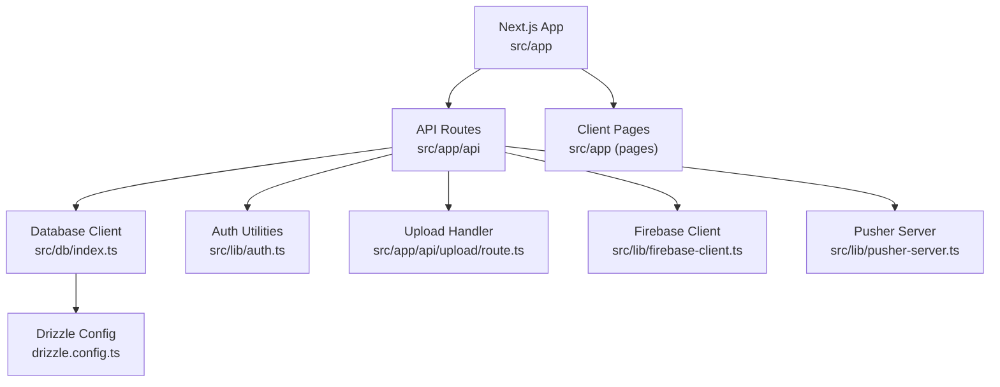
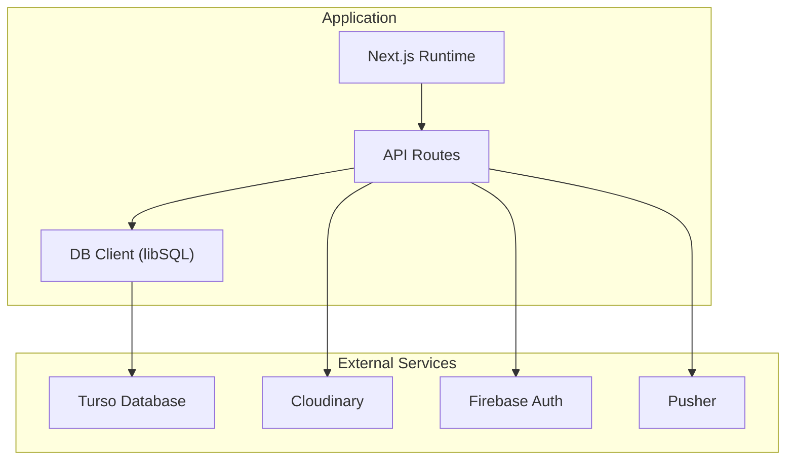
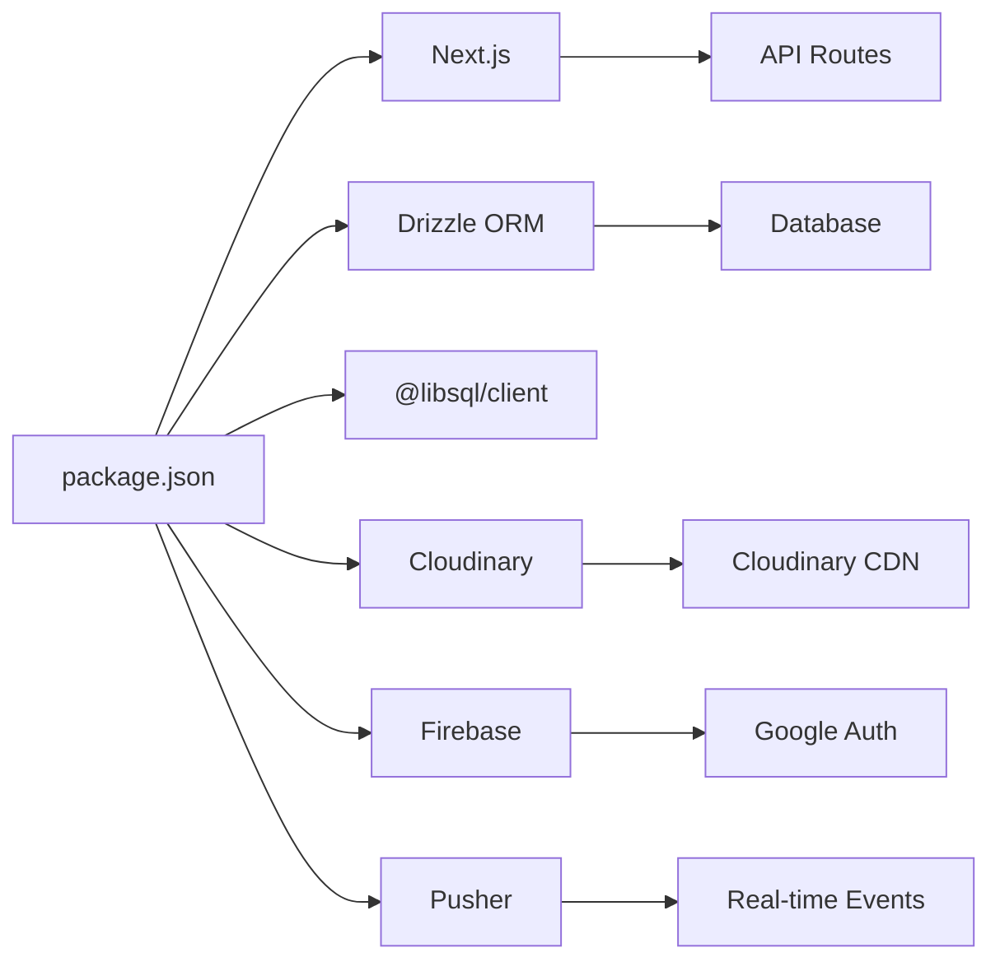
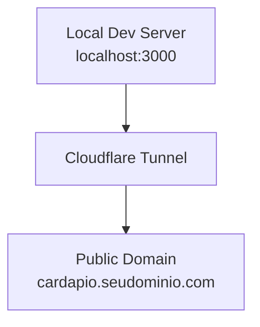

# Deployment Strategies

<cite>
**Referenced Files in This Document**
- [package.json](file://package.json)
- [next.config.ts](file://next.config.ts)
- [drizzle.config.ts](file://drizzle.config.ts)
- [src/db/index.ts](file://src/db/index.ts)
- [src/db/schema.ts](file://src/db/schema.ts)
- [src/lib/auth.ts](file://src/lib/auth.ts)
- [src/lib/firebase-client.ts](file://src/lib/firebase-client.ts)
- [src/lib/pusher-server.ts](file://src/lib/pusher-server.ts)
- [src/app/api/auth/login/route.ts](file://src/app/api/auth/login/route.ts)
- [src/app/api/upload/route.ts](file://src/app/api/upload/route.ts)
- [reserva/cardapio-local/infra/cloudflared/config.example.yml](file://reserva/cardapio-local/infra/cloudflared/config.example.yml)
</cite>

## Table of Contents
1. [Introduction](#introduction)
2. [Project Structure](#project-structure)
3. [Core Components](#core-components)
4. [Architecture Overview](#architecture-overview)
5. [Detailed Component Analysis](#detailed-component-analysis)
6. [Dependency Analysis](#dependency-analysis)
7. [Performance Considerations](#performance-considerations)
8. [Troubleshooting Guide](#troubleshooting-guide)
9. [Conclusion](#conclusion)
10. [Appendices](#appendices)

## Introduction
This document provides a comprehensive deployment strategy for the Meu Cardápio application across multiple hosting platforms and approaches:
- Vercel with automatic CI/CD pipelines
- Docker containerization for self-hosted deployments
- Traditional server deployment on AWS, Google Cloud, or DigitalOcean

It also covers database migration strategies using Drizzle ORM, static asset deployment and CDN integration, zero-downtime deployment techniques, rollback procedures, health checks, platform-specific optimizations, scaling considerations, and cost optimization strategies.

## Project Structure
The project is a Next.js application with:
- API routes under src/app/api
- Database schema and client configuration under src/db
- Authentication utilities under src/lib
- External integrations for Firebase Auth, Cloudinary uploads, and Pusher
- Drizzle ORM configuration for migrations and schema management

**Diagram sources**
- [next.config.ts](file://next.config.ts)
- [drizzle.config.ts](file://drizzle.config.ts)
- [src/db/index.ts](file://src/db/index.ts)
- [src/lib/auth.ts](file://src/lib/auth.ts)
- [src/app/api/upload/route.ts](file://src/app/api/upload/route.ts)
- [src/lib/firebase-client.ts](file://src/lib/firebase-client.ts)
- [src/lib/pusher-server.ts](file://src/lib/pusher-server.ts)

**Section sources**
- [package.json](file://package.json)
- [next.config.ts](file://next.config.ts)
- [drizzle.config.ts](file://drizzle.config.ts)
- [src/db/index.ts](file://src/db/index.ts)

## Core Components
Key runtime components that influence deployment:
- Next.js build and start scripts define how to build and run the app
- Drizzle ORM config defines dialect, schema location, output directory, and credentials
- Database client initializes libsql client with environment variables
- API routes handle authentication, uploads, and settings
- External services: Firebase Auth, Cloudinary, Pusher

Operational implications:
- Environment variables are required for Turso, Cloudinary, Firebase, and Pusher
- Static assets and images are optimized via Next.js image pipeline and Cloudinary
- Real-time features rely on Pusher; ensure correct cluster and keys

**Section sources**
- [package.json](file://package.json)
- [drizzle.config.ts](file://drizzle.config.ts)
- [src/db/index.ts](file://src/db/index.ts)
- [src/app/api/auth/login/route.ts](file://src/app/api/auth/login/route.ts)
- [src/app/api/upload/route.ts](file://src/app/api/upload/route.ts)
- [src/lib/firebase-client.ts](file://src/lib/firebase-client.ts)
- [src/lib/pusher-server.ts](file://src/lib/pusher-server.ts)

## Architecture Overview
High-level architecture showing external dependencies and data flow:

**Diagram sources**
- [src/db/index.ts](file://src/db/index.ts)
- [src/app/api/upload/route.ts](file://src/app/api/upload/route.ts)
- [src/lib/firebase-client.ts](file://src/lib/firebase-client.ts)
- [src/lib/pusher-server.ts](file://src/lib/pusher-server.ts)

## Detailed Component Analysis

### Vercel Deployment Strategy
- Build and start commands are defined in package.json
- Next.js configuration enables image formats and remote patterns for Cloudinary and Unsplash
- Environment variables must be configured in Vercel dashboard
- Automatic CI/CD via Git integration; deploy on push to main branch

Recommended steps:
- Connect repository to Vercel
- Add environment variables:
  - TURSO_DATABASE_URL, TURSO_AUTH_TOKEN
  - CLOUDINARY_CLOUD_NAME, CLOUDINARY_API_KEY, CLOUDINARY_API_SECRET
  - NEXT_PUBLIC_FIREBASE_API_KEY, NEXT_PUBLIC_FIREBASE_AUTH_DOMAIN, NEXT_PUBLIC_FIREBASE_PROJECT_ID, NEXT_PUBLIC_FIREBASE_APP_ID
  - PUSHER_APP_ID, NEXT_PUBLIC_PUSHER_KEY, PUSHER_SECRET, NEXT_PUBLIC_PUSHER_CLUSTER
- Run database migrations before first deploy using Vercel Postgres-compatible setup or pre-deploy script if using Turso CLI
- Enable Image Optimization and CDN caching for static assets

Zero-downtime and rollbacks:
- Vercel deploys new versions alongside existing ones; traffic can be routed gradually
- Use preview deployments for testing; promote to production when ready
- Rollback by redeploying previous commit or using Vercel’s “Revert” feature

Health checks:
- Implement a lightweight endpoint like /api/health returning 200 OK
- Configure Vercel health checks if using custom domains and edge routing

Scaling and cost optimization:
- Leverage Vercel’s serverless functions for API routes
- Cache static assets via Vercel’s CDN
- Use environment-based feature flags to disable heavy features in lower tiers

**Section sources**
- [package.json](file://package.json)
- [next.config.ts](file://next.config.ts)

### Docker Containerization Strategy
Dockerize the Next.js app for self-hosted environments:
- Multi-stage build to minimize image size
- Install dependencies, build the app, then run with Node.js runtime
- Expose port 3000 and set environment variables at runtime

Container orchestration:
- Use Docker Compose for local development and small deployments
- For production, use Kubernetes or managed container services (ECS, GKE, AKS)

Environment variables:
- Same as Vercel; pass via secrets management (Kubernetes Secrets, Docker Swarm secrets, etc.)

Health checks:
- Define HTTP health check against /api/health
- Restart policy and resource limits should be configured

Rollbacks:
- Tag images with semantic versioning; rollback by redeploying previous image tag

Scaling:
- Horizontal pod autoscaling based on CPU/memory or custom metrics
- Stateless API design allows easy horizontal scaling

**Section sources**
- [package.json](file://package.json)
- [next.config.ts](file://next.config.ts)

### Traditional Server Deployment (AWS, Google Cloud, DigitalOcean)
Options:
- EC2/GCE/DigitalOcean Droplet with PM2 or systemd service running Node.js
- Managed platforms: AWS App Runner, Google Cloud Run, DigitalOcean App Platform
- Reverse proxy (Nginx/Traefik) for TLS termination and static asset caching

Deployment workflow:
- Build artifacts produced in CI/CD pipeline
- Deploy binaries or container images to target servers
- Run database migrations before starting the app
- Configure environment variables securely

Health checks:
- Nginx upstream health checks or platform-native health endpoints
- Monitor logs and metrics via centralized logging and monitoring tools

Scaling:
- Auto-scaling groups or managed platform scaling policies
- Load balancer distribution across instances

Cost optimization:
- Use spot instances where appropriate
- Right-size instances and enable auto-scaling down during low traffic

**Section sources**
- [package.json](file://package.json)

### Database Migration Strategy with Drizzle ORM
Migration approach:
- drizzle-kit generate creates migration files from schema changes
- drizzle-kit migrate applies migrations to the database
- drizzle-kit push can be used for quick dev pushes without migration files

Environment configuration:
- drizzle.config.ts sets dialect to turso and credentials from environment
- src/db/index.ts initializes libsql client with URL and optional auth token

Migration best practices:
- Always run migrations in CI/CD before deploying application code
- Version control generated migrations
- Test migrations in staging before production
- Backward-compatible schema changes when possible

Rollback:
- Maintain migration history; revert by applying previous migration state
- Backup database before critical migrations

**Section sources**
- [drizzle.config.ts](file://drizzle.config.ts)
- [src/db/index.ts](file://src/db/index.ts)
- [src/db/schema.ts](file://src/db/schema.ts)

### Static Asset Deployment and CDN Integration
Image optimization:
- next.config.ts enables AVIF and WebP formats
- Remote patterns allow Cloudinary and Unsplash images

Upload handling:
- src/app/api/upload/route.ts validates file types and sizes, then uploads to Cloudinary
- Returns secure URLs for frontend usage

CDN strategy:
- Cloudinary serves optimized images via CDN
- Next.js image pipeline caches and optimizes images at edge locations
- Configure cache headers for static assets

Security:
- Validate file types and sizes server-side
- Restrict upload access to admin users only

**Section sources**
- [next.config.ts](file://next.config.ts)
- [src/app/api/upload/route.ts](file://src/app/api/upload/route.ts)

### Zero-Downtime Deployment Techniques
- Blue-green deployments: maintain two identical environments; switch traffic after validation
- Canary releases: route small percentage of traffic to new version
- Rolling updates: update instances one by one while maintaining capacity
- Feature flags: toggle features without redeployment

Implementation:
- Use platform-native capabilities (Vercel previews, Kubernetes rolling updates)
- Health checks ensure readiness before switching traffic

**Section sources**
- [package.json](file://package.json)

### Rollback Procedures
- Version artifacts with semantic versioning
- Maintain immutable deployment targets
- Automated rollback triggers on health check failures
- Database rollback using migration history

**Section sources**
- [drizzle.config.ts](file://drizzle.config.ts)

### Health Check Implementation
- Create /api/health endpoint returning 200 OK
- Check database connectivity and external service availability
- Return detailed status for monitoring systems

Example implementation pattern:
- GET /api/health returns { status: "ok", timestamp: "...", services: {...} }

**Section sources**
- [package.json](file://package.json)

## Dependency Analysis
Runtime dependencies and their roles:
- Next.js framework for SSR and API routes
- Drizzle ORM for database operations
- libSQL client for Turso connection
- Cloudinary for image uploads and CDN
- Firebase for Google authentication
- Pusher for real-time features

**Diagram sources**
- [package.json](file://package.json)
- [src/db/index.ts](file://src/db/index.ts)
- [src/app/api/upload/route.ts](file://src/app/api/upload/route.ts)
- [src/lib/firebase-client.ts](file://src/lib/firebase-client.ts)
- [src/lib/pusher-server.ts](file://src/lib/pusher-server.ts)

**Section sources**
- [package.json](file://package.json)

## Performance Considerations
- Enable Next.js image optimization for faster loading
- Use CDN for static assets and uploaded images
- Implement caching strategies for API responses where appropriate
- Optimize database queries and use indexes
- Monitor application performance with APM tools
- Scale horizontally based on traffic patterns

[No sources needed since this section provides general guidance]

## Troubleshooting Guide
Common issues and solutions:
- Database connection errors: verify TURSO_DATABASE_URL and TURSO_AUTH_TOKEN
- Upload failures: check Cloudinary credentials and file size limits
- Authentication problems: ensure Firebase configuration is complete
- Real-time issues: validate Pusher credentials and cluster settings

Debugging steps:
- Check application logs for error messages
- Verify environment variables are correctly set
- Test database connectivity independently
- Validate external service configurations

**Section sources**
- [src/app/api/auth/login/route.ts](file://src/app/api/auth/login/route.ts)
- [src/app/api/upload/route.ts](file://src/app/api/upload/route.ts)
- [src/lib/firebase-client.ts](file://src/lib/firebase-client.ts)
- [src/lib/pusher-server.ts](file://src/lib/pusher-server.ts)

## Conclusion
The Meu Cardápio application supports multiple deployment strategies tailored to different needs and scales. Vercel offers the simplest path with automatic CI/CD, while Docker and traditional server deployments provide more control for self-hosted environments. Drizzle ORM simplifies database migrations, and external services like Cloudinary, Firebase, and Pusher enhance functionality. Proper health checks, zero-downtime deployments, and rollback procedures ensure reliable operations across all platforms.

[No sources needed since this section summarizes without analyzing specific files]

## Appendices

### Local Development with Cloudflare Tunnel
For local development and testing, Cloudflare Tunnel can expose the local development server securely:

**Diagram sources**
- [reserva/cardapio-local/infra/cloudflared/config.example.yml](file://reserva/cardapio-local/infra/cloudflared/config.example.yml)

**Section sources**
- [reserva/cardapio-local/infra/cloudflared/config.example.yml](file://reserva/cardapio-local/infra/cloudflared/config.example.yml)

### Environment Variables Reference
Required environment variables for production deployment:
- TURSO_DATABASE_URL: Database connection string
- TURSO_AUTH_TOKEN: Database authentication token
- CLOUDINARY_CLOUD_NAME: Cloudinary cloud name
- CLOUDINARY_API_KEY: Cloudinary API key
- CLOUDINARY_API_SECRET: Cloudinary API secret
- NEXT_PUBLIC_FIREBASE_API_KEY: Firebase API key
- NEXT_PUBLIC_FIREBASE_AUTH_DOMAIN: Firebase auth domain
- NEXT_PUBLIC_FIREBASE_PROJECT_ID: Firebase project ID
- NEXT_PUBLIC_FIREBASE_APP_ID: Firebase app ID
- PUSHER_APP_ID: Pusher application ID
- NEXT_PUBLIC_PUSHER_KEY: Pusher public key
- PUSHER_SECRET: Pusher secret key
- NEXT_PUBLIC_PUSHER_CLUSTER: Pusher cluster

[No sources needed since this section lists configuration values]