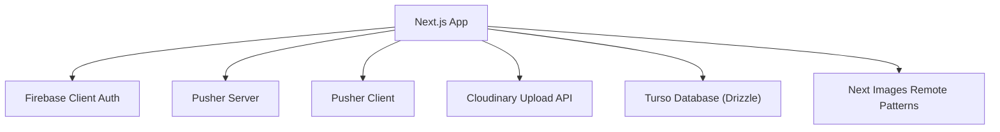
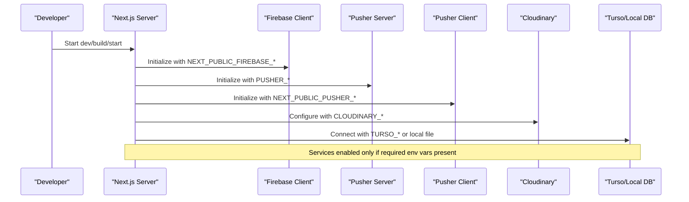
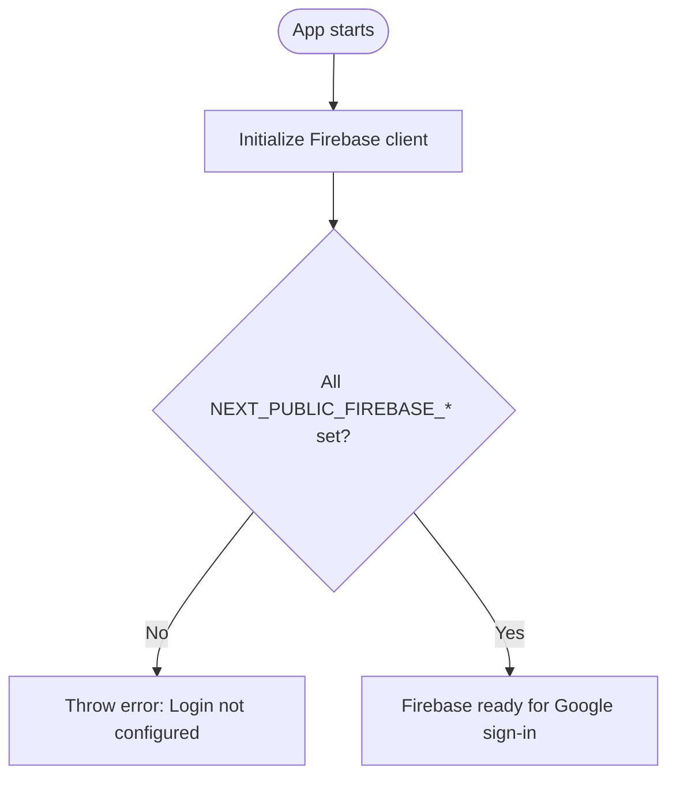
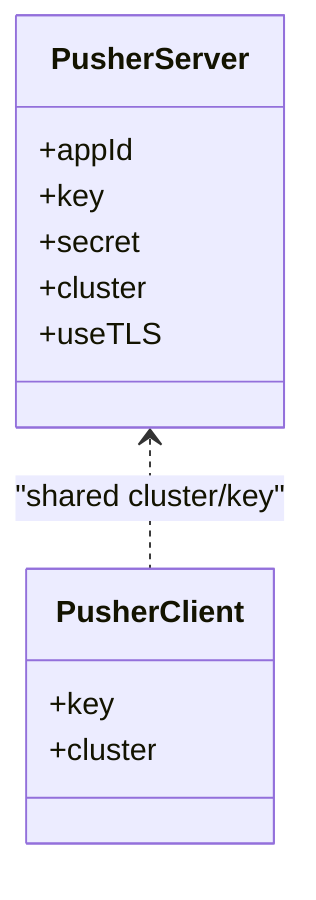
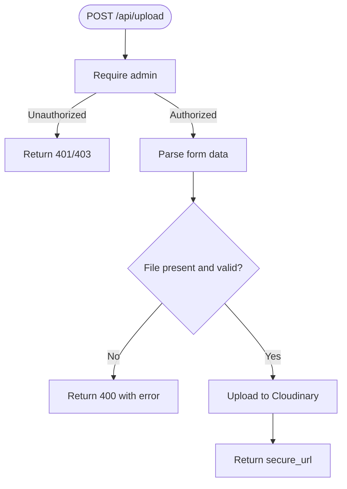
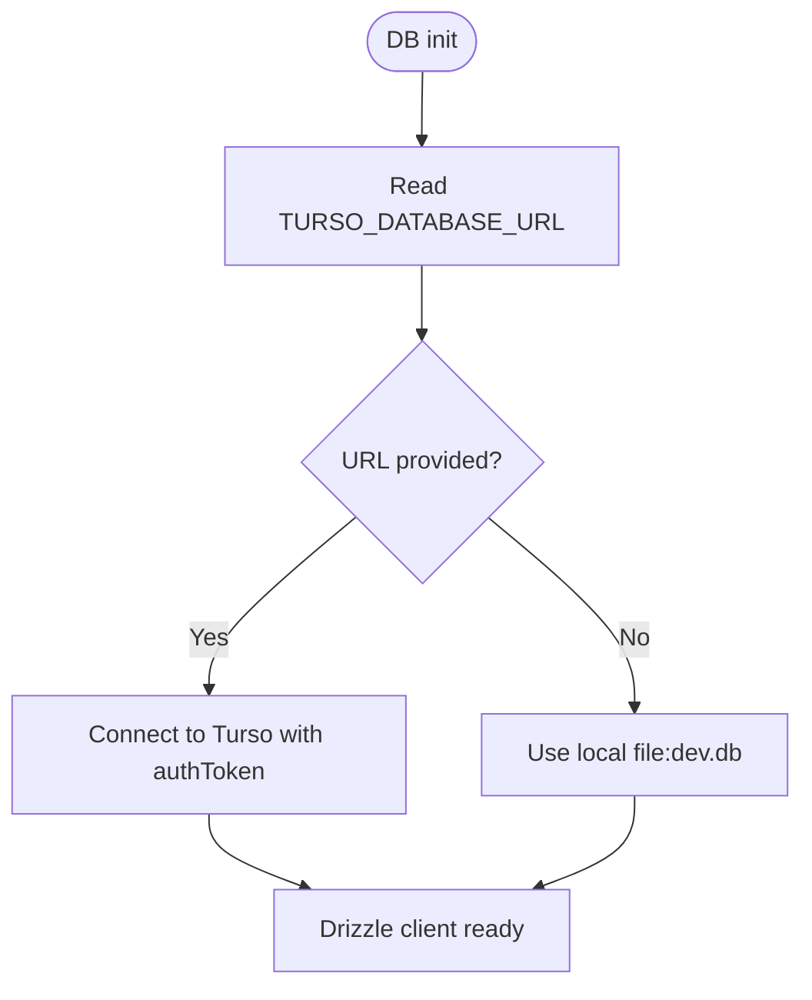
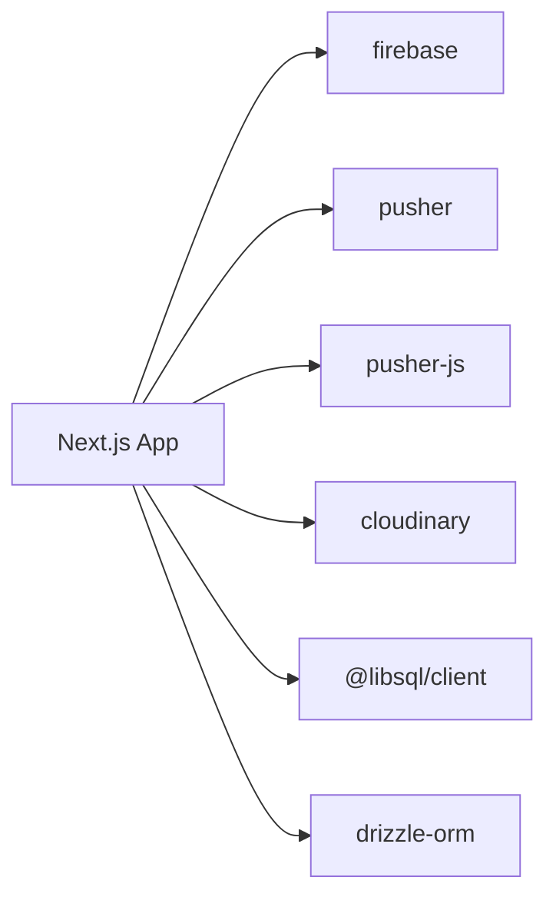

# Environment Setup

<cite>
**Referenced Files in This Document**
- [package.json](file://package.json)
- [.gitignore](file://.gitignore)
- [next.config.ts](file://next.config.ts)
- [drizzle.config.ts](file://drizzle.config.ts)
- [src/lib/firebase-client.ts](file://src/lib/firebase-client.ts)
- [src/lib/pusher-server.ts](file://src/lib/pusher-server.ts)
- [src/lib/pusher.ts](file://src/lib/pusher.ts)
- [src/db/index.ts](file://src/db/index.ts)
- [src/app/api/upload/route.ts](file://src/app/api/upload/route.ts)
</cite>

## Table of Contents
1. Introduction
2. Project Structure
3. Core Components
4. Architecture Overview
5. Detailed Component Analysis
6. Dependency Analysis
7. Performance Considerations
8. Troubleshooting Guide
9. Conclusion
10. Appendices

## Introduction
This document provides comprehensive environment setup guidance for development, staging, and production environments. It covers configuration of Firebase Authentication, Pusher real-time services, Cloudinary image hosting, and database connections using Turso (libSQL). It also explains local development with a Cloudflare tunnel, Docker containerization options, and cloud deployment considerations. Security best practices for managing sensitive credentials and environment-specific configurations are included, along with troubleshooting guides and validation procedures.

## Project Structure
The application is a Next.js project that integrates:
- Firebase client-side authentication
- Pusher for real-time events (server and client)
- Cloudinary for image uploads via an API route
- Turso/libSQL as the database backend with Drizzle ORM

Environment variables drive service configuration. Sensitive values must not be committed to version control; only example files should be shared.

**Diagram sources**
- [src/lib/firebase-client.ts:6-18](file://src/lib/firebase-client.ts#L6-L18)
- [src/lib/pusher-server.ts:3-10](file://src/lib/pusher-server.ts#L3-L10)
- [src/lib/pusher.ts:3-8](file://src/lib/pusher.ts#L3-L8)
- [src/app/api/upload/route.ts:5-9](file://src/app/api/upload/route.ts#L5-L9)
- [src/db/index.ts:5-11](file://src/db/index.ts#L5-L11)
- [next.config.ts:4-10](file://next.config.ts#L4-L10)

**Section sources**
- [package.json:1-45](file://package.json#L1-L45)
- [.gitignore:33-39](file://.gitignore#L33-L39)
- [next.config.ts:1-14](file://next.config.ts#L1-L14)

## Core Components
- Firebase Authentication (client): Initializes Firebase with public keys and supports Google sign-in. Requires NEXT_PUBLIC_FIREBASE_* variables.
- Pusher Real-time:
  - Server: Creates a Pusher server instance using app ID, key, secret, and cluster.
  - Client: Creates a Pusher client instance using public key and cluster.
- Cloudinary Image Uploads: API route configures Cloudinary and validates file types/sizes before uploading.
- Database (Turso/libSQL): Drizzle client connects to Turso using URL and optional auth token; local fallback uses a file-based DB.

**Section sources**
- [src/lib/firebase-client.ts:6-25](file://src/lib/firebase-client.ts#L6-L25)
- [src/lib/pusher-server.ts:3-10](file://src/lib/pusher-server.ts#L3-L10)
- [src/lib/pusher.ts:3-8](file://src/lib/pusher.ts#L3-L8)
- [src/app/api/upload/route.ts:5-58](file://src/app/api/upload/route.ts#L5-L58)
- [src/db/index.ts:5-13](file://src/db/index.ts#L5-L13)
- [drizzle.config.ts:3-13](file://drizzle.config.ts#L3-L13)

## Architecture Overview
The runtime environment loads environment variables at startup. The Next.js server initializes services based on available variables:
- If Firebase public keys are missing, client-side login initialization fails early.
- If Pusher variables are incomplete, server/client instances are disabled gracefully.
- Cloudinary requires server-side secrets; uploads are protected by admin checks.
- Database connection prefers Turso URL; falls back to local file DB when no remote URL is set.

**Diagram sources**
- [src/lib/firebase-client.ts:6-18](file://src/lib/firebase-client.ts#L6-L18)
- [src/lib/pusher-server.ts:3-10](file://src/lib/pusher-server.ts#L3-L10)
- [src/lib/pusher.ts:3-8](file://src/lib/pusher.ts#L3-L8)
- [src/app/api/upload/route.ts:5-9](file://src/app/api/upload/route.ts#L5-L9)
- [src/db/index.ts:5-11](file://src/db/index.ts#L5-L11)

## Detailed Component Analysis

### Firebase Authentication (Client)
- Purpose: Initialize Firebase client and support Google sign-in.
- Required variables:
  - NEXT_PUBLIC_FIREBASE_API_KEY
  - NEXT_PUBLIC_FIREBASE_AUTH_DOMAIN
  - NEXT_PUBLIC_FIREBASE_PROJECT_ID
  - NEXT_PUBLIC_FIREBASE_APP_ID
- Behavior: If any variable is missing, initialization throws an error indicating login is not configured.

**Diagram sources**
- [src/lib/firebase-client.ts:6-18](file://src/lib/firebase-client.ts#L6-L18)

**Section sources**
- [src/lib/firebase-client.ts:6-25](file://src/lib/firebase-client.ts#L6-L25)

### Pusher Real-time Services
- Server:
  - Required variables: PUSHER_APP_ID, PUSHER_SECRET, NEXT_PUBLIC_PUSHER_KEY, NEXT_PUBLIC_PUSHER_CLUSTER
  - Behavior: Creates a Pusher server instance only when all variables are present; otherwise returns null.
- Client:
  - Required variables: NEXT_PUBLIC_PUSHER_KEY, NEXT_PUBLIC_PUSHER_CLUSTER
  - Behavior: Creates a Pusher client instance only when both variables are present; otherwise returns null.

**Diagram sources**
- [src/lib/pusher-server.ts:3-10](file://src/lib/pusher-server.ts#L3-L10)
- [src/lib/pusher.ts:3-8](file://src/lib/pusher.ts#L3-L8)

**Section sources**
- [src/lib/pusher-server.ts:3-10](file://src/lib/pusher-server.ts#L3-L10)
- [src/lib/pusher.ts:3-8](file://src/lib/pusher.ts#L3-L8)

### Cloudinary Image Uploads
- Purpose: Securely upload images to Cloudinary from the Next.js API route.
- Required variables:
  - CLOUDINARY_CLOUD_NAME
  - CLOUDINARY_API_KEY
  - CLOUDINARY_API_SECRET
- Validation:
  - Allowed MIME types: JPEG, PNG, WEBP, GIF
  - Max size: 5MB
- Authorization: Protected by admin check before processing uploads.

**Diagram sources**
- [src/app/api/upload/route.ts:14-58](file://src/app/api/upload/route.ts#L14-L58)

**Section sources**
- [src/app/api/upload/route.ts:5-58](file://src/app/api/upload/route.ts#L5-L58)

### Database Connections (Turso/libSQL)
- Purpose: Connect to Turso or use a local SQLite-like file for development.
- Required variables:
  - TURSO_DATABASE_URL (optional; defaults to local file:dev.db)
  - TURSO_AUTH_TOKEN (optional; used when connecting to remote)
- Drizzle configuration reads the same variables for migrations and schema generation.

**Diagram sources**
- [src/db/index.ts:5-11](file://src/db/index.ts#L5-L11)
- [drizzle.config.ts:3-13](file://drizzle.config.ts#L3-L13)

**Section sources**
- [src/db/index.ts:5-13](file://src/db/index.ts#L5-L13)
- [drizzle.config.ts:3-13](file://drizzle.config.ts#L3-L13)

## Dependency Analysis
Key runtime dependencies relevant to environment setup:
- Firebase client SDK for authentication
- Pusher server and client libraries for real-time features
- Cloudinary SDK for image uploads
- libSQL client and Drizzle ORM for database access

**Diagram sources**
- [package.json:17-29](file://package.json#L17-L29)

**Section sources**
- [package.json:17-29](file://package.json#L17-L29)

## Performance Considerations
- Enable Next.js optimized image formats (AVIF, WebP) and restrict allowed remote patterns to known hosts (e.g., Cloudinary, Unsplash) to reduce misconfiguration risks.
- Prefer Turso for scalable, low-latency database access in production; use local file DB only for development.
- Guard real-time features with conditional initialization to avoid unnecessary network calls when credentials are missing.
- Enforce strict file type and size limits on uploads to prevent abuse and reduce bandwidth usage.

[No sources needed since this section provides general guidance]

## Troubleshooting Guide

### Common Issues and Resolutions
- Firebase login not configured:
  - Symptom: Client throws an error indicating login is not configured.
  - Resolution: Ensure all NEXT_PUBLIC_FIREBASE_* variables are set correctly.
  - Reference: [Initialization logic:6-18](file://src/lib/firebase-client.ts#L6-L18)

- Pusher features disabled:
  - Symptom: Real-time events do not work; server/client instances are null.
  - Resolution: Set PUSHER_APP_ID, PUSHER_SECRET, NEXT_PUBLIC_PUSHER_KEY, NEXT_PUBLIC_PUSHER_CLUSTER.
  - References: [Server init:3-10](file://src/lib/pusher-server.ts#L3-L10), [Client init:3-8](file://src/lib/pusher.ts#L3-L8)

- Cloudinary upload failures:
  - Symptom: 400 errors for invalid file type/size; 500 errors for upload issues.
  - Resolution: Verify CLOUDINARY_* variables; ensure file type and size meet requirements.
  - Reference: [Upload route:14-58](file://src/app/api/upload/route.ts#L14-L58)

- Database connection problems:
  - Symptom: Cannot connect to Turso or schema operations fail.
  - Resolution: Provide TURSO_DATABASE_URL and TURSO_AUTH_TOKEN; verify Drizzle config matches.
  - References: [DB client:5-11](file://src/db/index.ts#L5-L11), [Drizzle config:3-13](file://drizzle.config.ts#L3-L13)

### Validation Procedures
- Local development:
  - Create a .env file with required variables; ensure it is ignored by version control.
  - Run scripts to generate/migrate schema and seed data if needed.
  - Start the dev server and test each integration point:
    - Firebase: Attempt Google sign-in and verify token retrieval.
    - Pusher: Emit/listen to a test channel and confirm messages.
    - Cloudinary: Upload a small image and verify returned secure URL.
    - Database: Execute a simple query via Drizzle to confirm connectivity.

- Staging/Production:
  - Use your platform’s secret management to inject environment variables securely.
  - Validate remote URLs and tokens for Turso and Pusher.
  - Restrict Next.js image remote patterns to approved domains.
  - Confirm admin-only endpoints enforce authorization before performing actions like uploads.

**Section sources**
- [src/lib/firebase-client.ts:6-18](file://src/lib/firebase-client.ts#L6-L18)
- [src/lib/pusher-server.ts:3-10](file://src/lib/pusher-server.ts#L3-L10)
- [src/lib/pusher.ts:3-8](file://src/lib/pusher.ts#L3-L8)
- [src/app/api/upload/route.ts:14-58](file://src/app/api/upload/route.ts#L14-L58)
- [src/db/index.ts:5-11](file://src/db/index.ts#L5-L11)
- [drizzle.config.ts:3-13](file://drizzle.config.ts#L3-L13)

## Conclusion
Proper environment configuration is essential for reliable operation across development, staging, and production. By setting the correct environment variables for Firebase, Pusher, Cloudinary, and Turso—and following security best practices—you can ensure robust authentication, real-time communication, media handling, and data persistence. Use the troubleshooting guide to diagnose common issues and validate integrations systematically.

[No sources needed since this section summarizes without analyzing specific files]

## Appendices

### Environment Variables Reference
- Firebase (client):
  - NEXT_PUBLIC_FIREBASE_API_KEY
  - NEXT_PUBLIC_FIREBASE_AUTH_DOMAIN
  - NEXT_PUBLIC_FIREBASE_PROJECT_ID
  - NEXT_PUBLIC_FIREBASE_APP_ID
- Pusher:
  - PUSHER_APP_ID
  - PUSHER_SECRET
  - NEXT_PUBLIC_PUSHER_KEY
  - NEXT_PUBLIC_PUSHER_CLUSTER
- Cloudinary:
  - CLOUDINARY_CLOUD_NAME
  - CLOUDINARY_API_KEY
  - CLOUDINARY_API_SECRET
- Database (Turso):
  - TURSO_DATABASE_URL
  - TURSO_AUTH_TOKEN

**Section sources**
- [src/lib/firebase-client.ts:6-18](file://src/lib/firebase-client.ts#L6-L18)
- [src/lib/pusher-server.ts:3-10](file://src/lib/pusher-server.ts#L3-L10)
- [src/lib/pusher.ts:3-8](file://src/lib/pusher.ts#L3-L8)
- [src/app/api/upload/route.ts:5-9](file://src/app/api/upload/route.ts#L5-L9)
- [src/db/index.ts:5-11](file://src/db/index.ts#L5-L11)
- [drizzle.config.ts:3-13](file://drizzle.config.ts#L3-L13)

### Security Best Practices
- Never commit secrets to version control; rely on .env* exclusions and platform secret stores.
- Use separate sets of credentials per environment (development, staging, production).
- Limit exposure of server-side secrets to server-only code paths (e.g., API routes).
- Validate and sanitize inputs on all endpoints, especially file uploads.
- Restrict Next.js image remote patterns to trusted domains.

**Section sources**
- [.gitignore:33-39](file://.gitignore#L33-L39)
- [next.config.ts:4-10](file://next.config.ts#L4-L10)
- [src/app/api/upload/route.ts:14-58](file://src/app/api/upload/route.ts#L14-L58)

### Local Development with Cloudflare Tunnel
- Use a Cloudflare tunnel to expose your local Next.js dev server securely for testing.
- Ensure your local dev server binds to localhost and configure the tunnel to forward traffic to the appropriate port.
- Test end-to-end flows (auth, real-time, uploads) through the tunnel URL.

[No sources needed since this section provides general guidance]

### Docker Containerization Options
- Base image: Use a Node.js LTS image aligned with your project’s Node version.
- Build steps: Install dependencies, build the Next.js app, then start the production server.
- Secrets: Inject environment variables at runtime via container orchestration or secret managers.
- Health checks: Add a health endpoint or probe to monitor readiness.

[No sources needed since this section provides general guidance]

### Cloud Platform Deployment Configurations
- Vercel:
  - Set environment variables in the dashboard or CI/CD pipeline.
  - Ensure build scripts run successfully and assets are optimized.
- Other platforms:
  - Provide environment variables through platform-native secret management.
  - Configure domain and TLS settings as needed.

[No sources needed since this section provides general guidance]