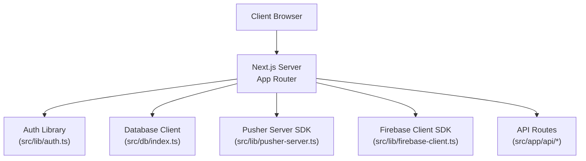
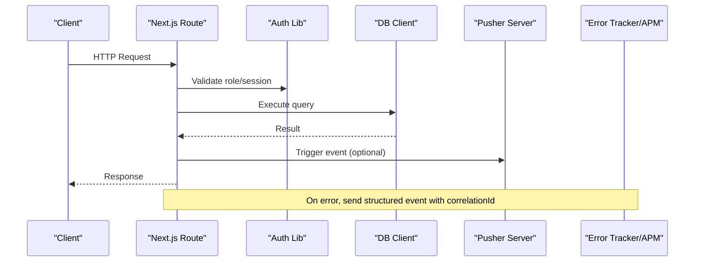
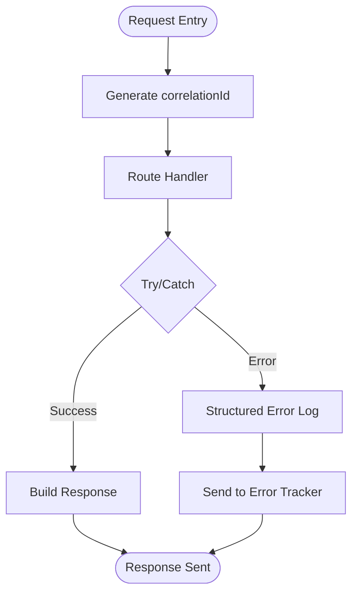
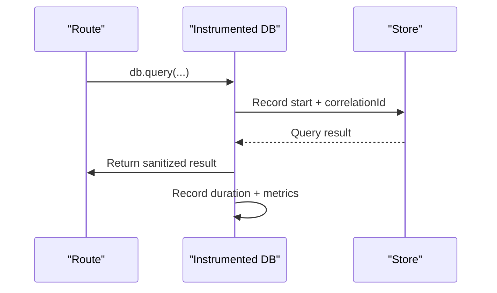
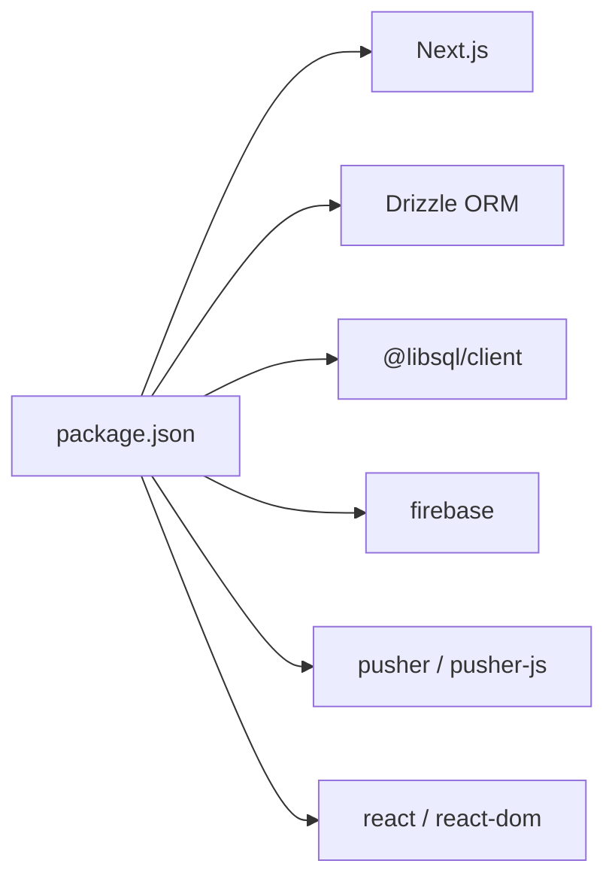

# Monitoring & Logging

<cite>
**Referenced Files in This Document**
- [package.json](file://package.json)
- [next.config.ts](file://next.config.ts)
- [src/app/layout.tsx](file://src/app/layout.tsx)
- [src/db/index.ts](file://src/db/index.ts)
- [src/lib/auth.ts](file://src/lib/auth.ts)
- [src/lib/firebase-client.ts](file://src/lib/firebase-client.ts)
- [src/lib/pusher-server.ts](file://src/lib/pusher-server.ts)
- [src/app/api/auth/login/route.ts](file://src/app/api/auth/login/route.ts)
- [src/app/api/pedidos/route.ts](file://src/app/api/pedidos/route.ts)
- [src/app/api/produtos/route.ts](file://src/app/api/produtos/route.ts)
- [src/app/api/settings/route.ts](file://src/app/api/settings/route.ts)
</cite>

## Table of Contents
1. Introduction
2. Project Structure
3. Core Components
4. Architecture Overview
5. Detailed Component Analysis
6. Dependency Analysis
7. Performance Considerations
8. Troubleshooting Guide
9. Conclusion
10. Appendices

## Introduction
This document provides production-grade monitoring and logging guidance for the Meu Cardápio application built on Next.js. It covers error tracking, application performance monitoring (APM), user analytics, structured logging patterns, log aggregation strategies, alerting mechanisms, API endpoint monitoring, database query performance tracking, real-time health checks, log rotation policies, security considerations for sensitive data in logs, debugging procedures, and dashboard/reporting recommendations. The goal is to enable operational visibility and rapid incident response while preserving privacy and performance.

## Project Structure
The application uses a Next.js App Router with server-side API routes under src/app/api, shared libraries under src/lib, and database configuration under src/db. There are no existing centralized logging or APM integrations; errors are currently logged via console.error within route handlers.

**Diagram sources**
- [src/app/layout.tsx:1-34](file://src/app/layout.tsx#L1-L34)
- [src/db/index.ts:1-14](file://src/db/index.ts#L1-L14)
- [src/lib/auth.ts:1-82](file://src/lib/auth.ts#L1-L82)
- [src/lib/pusher-server.ts:1-11](file://src/lib/pusher-server.ts#L1-L11)
- [src/lib/firebase-client.ts:1-26](file://src/lib/firebase-client.ts#L1-L26)
- [src/app/api/pedidos/route.ts:1-253](file://src/app/api/pedidos/route.ts#L1-L253)

**Section sources**
- [package.json:1-45](file://package.json#L1-L45)
- [next.config.ts:1-14](file://next.config.ts#L1-L14)
- [src/app/layout.tsx:1-34](file://src/app/layout.tsx#L1-L34)

## Core Components
- API routes handle authentication, orders, products, and settings. They use try/catch blocks and return JSON responses. Errors are currently logged using console.error without structured fields or external reporting.
- Database client is configured via Drizzle ORM with libSQL/Turso. No query-level metrics or tracing exist yet.
- Real-time signaling uses Pusher Server SDK when enabled by environment variables.
- Authentication utilities manage cookies and roles.
- Firebase client is used for Google sign-in on the client side.

Key observations:
- Centralized logging middleware does not exist.
- No APM or error tracking SDKs are present in dependencies.
- No structured logging format or correlation IDs are implemented.
- Health endpoints do not exist; readiness/liveness checks must be added.

**Section sources**
- [src/app/api/auth/login/route.ts:1-80](file://src/app/api/auth/login/route.ts#L1-L80)
- [src/app/api/pedidos/route.ts:1-253](file://src/app/api/pedidos/route.ts#L1-L253)
- [src/app/api/produtos/route.ts:1-53](file://src/app/api/produtos/route.ts#L1-L53)
- [src/app/api/settings/route.ts:1-34](file://src/app/api/settings/route.ts#L1-L34)
- [src/db/index.ts:1-14](file://src/db/index.ts#L1-L14)
- [src/lib/auth.ts:1-82](file://src/lib/auth.ts#L1-L82)
- [src/lib/pusher-server.ts:1-11](file://src/lib/pusher-server.ts#L1-L11)
- [src/lib/firebase-client.ts:1-26](file://src/lib/firebase-client.ts#L1-L26)

## Architecture Overview
The current runtime emits unstructured console logs during errors. To achieve production observability, we recommend adding:
- Error tracking (e.g., Sentry) to capture exceptions, stack traces, and context.
- APM integration (e.g., OpenTelemetry or vendor-specific APM) to instrument API routes, database queries, and external calls.
- Structured logging with correlation IDs and consistent fields.
- Centralized log aggregation (e.g., cloud logging service).
- Alerting rules based on error rates, latency, and availability.
- Health check endpoints for liveness/readiness probes.

**Diagram sources**
- [src/app/api/pedidos/route.ts:1-253](file://src/app/api/pedidos/route.ts#L1-L253)
- [src/lib/auth.ts:1-82](file://src/lib/auth.ts#L1-L82)
- [src/db/index.ts:1-14](file://src/db/index.ts#L1-L14)
- [src/lib/pusher-server.ts:1-11](file://src/lib/pusher-server.ts#L1-L11)

## Detailed Component Analysis

### API Error Handling and Logging
Current state:
- Each route wraps logic in try/catch and logs errors with console.error.
- No structured fields such as requestId, userId, or endpoint metadata.
- No external error reporting or metrics collection.

Recommended changes:
- Introduce a request-scoped logger that attaches a correlationId to every request.
- Replace console.error with structured logs including level, message, timestamp, requestId, endpoint, method, statusCode, durationMs, and user context where appropriate.
- Capture exceptions in a central error handler and forward them to an error tracking service.
- Add timing instrumentation around critical operations (DB transactions, external calls).

**Section sources**
- [src/app/api/auth/login/route.ts:16-79](file://src/app/api/auth/login/route.ts#L16-L79)
- [src/app/api/pedidos/route.ts:15-253](file://src/app/api/pedidos/route.ts#L15-L253)
- [src/app/api/produtos/route.ts:6-53](file://src/app/api/produtos/route.ts#L6-L53)
- [src/app/api/settings/route.ts:7-34](file://src/app/api/settings/route.ts#L7-L34)

### Database Query Performance Tracking
Current state:
- Database client is created once and exported.
- No query instrumentation or slow-query detection.

Recommended changes:
- Wrap DB calls with timing and attach correlationId to each query.
- Use APM or custom instrumentation to record query duration, parameters (sanitized), and result size.
- Implement slow query thresholds and alerts.
- Ensure sensitive fields (PINs, tokens) are never logged.

**Section sources**
- [src/db/index.ts:1-14](file://src/db/index.ts#L1-L14)
- [src/app/api/pedidos/route.ts:147-171](file://src/app/api/pedidos/route.ts#L147-L171)

### Real-Time Signaling Observability
Current state:
- Pusher Server SDK is conditionally initialized based on environment variables.
- Errors from triggering events are caught and logged.

Recommended changes:
- Add metrics for pusher trigger success/failure and latency.
- Include correlationId in event payloads to trace end-to-end flows.
- Alert on repeated pusher failures indicating delivery issues.

**Section sources**
- [src/lib/pusher-server.ts:1-11](file://src/lib/pusher-server.ts#L1-L11)
- [src/app/api/pedidos/route.ts:173-180](file://src/app/api/pedidos/route.ts#L173-L180)
- [src/app/api/pedidos/route.ts:220-228](file://src/app/api/pedidos/route.ts#L220-L228)

### Authentication Flow Monitoring
Current state:
- Login route validates rate limits, verifies PIN, sets cookies, and clears rate limit counters.
- Errors are logged with console.error.

Recommended changes:
- Instrument login attempts with counts and outcomes (success, rate-limited, invalid PIN).
- Track failed login spikes and alert on potential brute-force activity.
- Avoid logging sensitive inputs like PINs; only log anonymized identifiers.

**Section sources**
- [src/app/api/auth/login/route.ts:16-79](file://src/app/api/auth/login/route.ts#L16-L79)
- [src/lib/auth.ts:13-42](file://src/lib/auth.ts#L13-L42)

### User Analytics Integration
Current state:
- Firebase client initializes Google Auth provider but no analytics events are sent.

Recommended changes:
- Add analytics events for key user actions (login success, order creation, product views).
- Use privacy-preserving identifiers and avoid logging sensitive data.
- Configure analytics consent and data retention policies.

**Section sources**
- [src/lib/firebase-client.ts:1-26](file://src/lib/firebase-client.ts#L1-L26)

## Dependency Analysis
- Dependencies include Next.js, Drizzle ORM, libSQL client, Firebase, Pusher, and React ecosystem packages.
- No logging, APM, or error tracking dependencies are declared.
- Environment-driven features: Pusher and Firebase require specific env vars to initialize.

**Diagram sources**
- [package.json:17-30](file://package.json#L17-L30)

**Section sources**
- [package.json:1-45](file://package.json#L1-L45)

## Performance Considerations
- Add request/response timing to all API routes to compute p50/p95 latencies.
- Instrument database transactions and individual queries to detect slow operations.
- Cache frequently accessed data (products) and measure cache hit ratios.
- Monitor Pusher trigger success rates and latency.
- Set up APM dashboards for error budgets and SLOs.

[No sources needed since this section provides general guidance]

## Troubleshooting Guide
Common issues and how to address them:
- Unhandled exceptions: Ensure all routes wrap logic in try/catch and forward errors to an error tracker with correlationId.
- Slow database queries: Enable query instrumentation and set thresholds for slow queries; alert on increases.
- Pusher failures: Track trigger errors and alert if failure rate exceeds threshold.
- Rate limiting anomalies: Monitor failed login attempts and lockout durations; alert on spikes.
- Missing environment variables: Validate required env vars at startup (Pusher, Firebase, DB credentials) and fail fast with clear messages.

Operational steps:
- Centralize error handling to capture stack traces, request context, and user roles (non-sensitive).
- Add structured logs for lifecycle events (startup, shutdown, config load).
- Create health endpoints for liveness and readiness checks.
- Implement log rotation and retention policies to control storage costs and compliance.

**Section sources**
- [src/app/api/auth/login/route.ts:16-79](file://src/app/api/auth/login/route.ts#L16-L79)
- [src/app/api/pedidos/route.ts:173-180](file://src/app/api/pedidos/route.ts#L173-L180)
- [src/lib/pusher-server.ts:1-11](file://src/lib/pusher-server.ts#L1-L11)

## Conclusion
To achieve robust production observability for Meu Cardápio, implement structured logging, error tracking, APM instrumentation, and centralized log aggregation. Add health checks, alerting, and dashboards to maintain high availability and performance. Prioritize privacy by sanitizing logs and avoiding sensitive data exposure. With these practices, teams can quickly detect, diagnose, and resolve issues while maintaining a smooth user experience.

[No sources needed since this section summarizes without analyzing specific files]

## Appendices

### Recommended Integrations and Patterns
- Error tracking: Integrate a service to capture exceptions, breadcrumbs, and context.
- APM: Instrument API routes, DB queries, and external calls; collect latency, throughput, and error rates.
- Structured logging: Use JSON logs with fields like level, message, timestamp, correlationId, endpoint, method, statusCode, durationMs, and user context (sanitized).
- Log aggregation: Ship logs to a centralized system with retention and indexing policies.
- Alerting: Define rules for error rate spikes, latency SLO breaches, and dependency failures.
- Health checks: Expose endpoints for liveness and readiness; integrate with orchestration platforms.
- Security: Never log secrets, PINs, tokens, or personal data; mask or redact sensitive fields.
- Dashboards: Build views for request volume, error rates, latency percentiles, DB query performance, and external service health.

[No sources needed since this section provides general guidance]