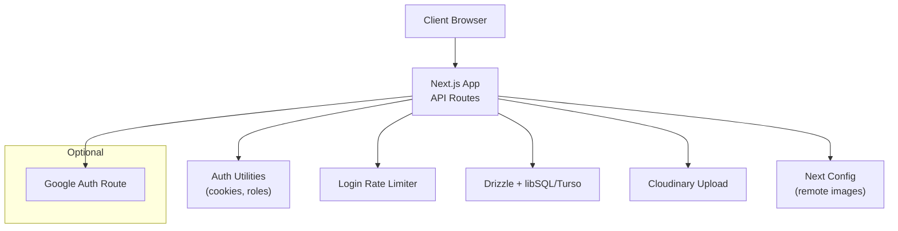
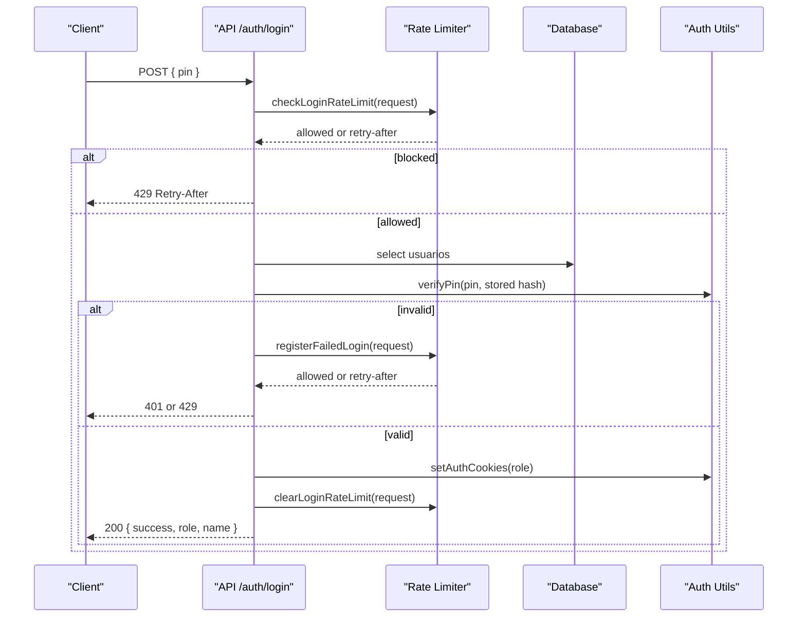
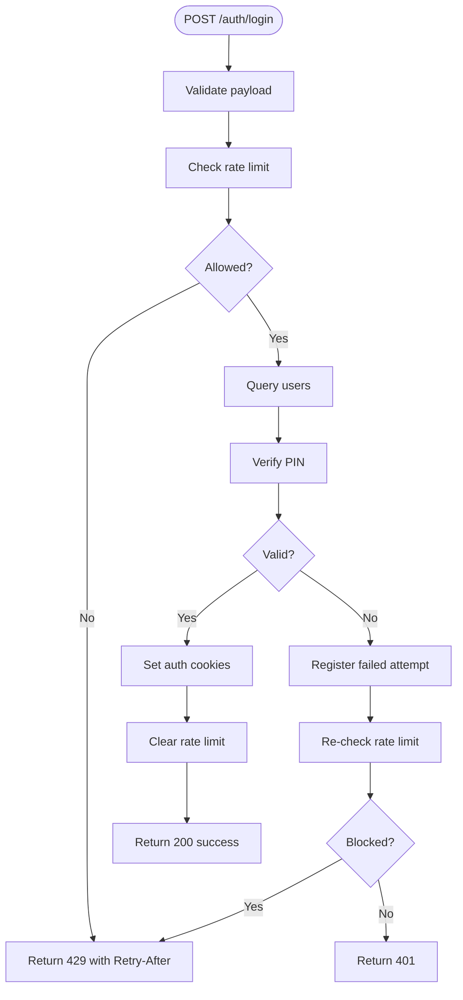
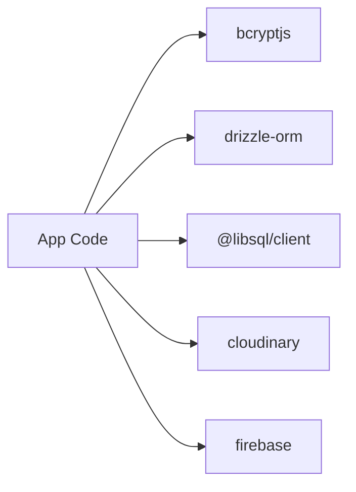

# Security Hardening

<cite>
**Referenced Files in This Document**
- [src/lib/auth.ts](file://src/lib/auth.ts)
- [src/lib/login-rate-limit.ts](file://src/lib/login-rate-limit.ts)
- [src/app/api/auth/login/route.ts](file://src/app/api/auth/login/route.ts)
- [src/app/api/auth/setup/route.ts](file://src/app/api/auth/setup/route.ts)
- [src/app/api/upload/route.ts](file://src/app/api/upload/route.ts)
- [src/db/index.ts](file://src/db/index.ts)
- [src/db/schema.ts](file://src/db/schema.ts)
- [next.config.ts](file://next.config.ts)
- [package.json](file://package.json)
- [reserva/cardapio-local/src/app/api/auth/google/route.ts](file://reserva/cardapio-local/src/app/api/auth/google/route.ts)
- [reserva/cardapio-local/infra/cloudflared/config.example.yml](file://reserva/cardapio-local/infra/cloudflared/config.example.yml)
</cite>

## Table of Contents
1. Introduction
2. Project Structure
3. Core Components
4. Architecture Overview
5. Detailed Component Analysis
6. Dependency Analysis
7. Performance Considerations
8. Troubleshooting Guide
9. Conclusion
10. Appendices

## Introduction
This document provides production-grade security hardening guidance for the Meu Cardápio application. It focuses on securing transport (SSL/TLS, HTTPS enforcement), secure headers, input validation, SQL injection prevention, XSS protection, CSRF mitigation, authentication and session management, rate limiting, database security, file upload security, third-party integrations, scanning and vulnerability assessment, compliance considerations, audit checklists, and incident response procedures. The guidance is grounded in the current codebase and highlights existing controls and recommended improvements.

## Project Structure
The application is a Next.js app with API routes under src/app/api, data access via Drizzle ORM and libSQL/Turso, and optional Google login in a local variant. Key security-relevant areas include:
- Authentication utilities and cookie handling
- Login endpoint with rate limiting
- User setup endpoint
- File upload to Cloudinary
- Database configuration and schema definitions
- Next.js image remote allowlist
- Optional Google OAuth flow
- Cloudflare Tunnel example configuration

**Diagram sources**
- [src/app/api/auth/login/route.ts](file://src/app/api/auth/login/route.ts)
- [src/lib/auth.ts](file://src/lib/auth.ts)
- [src/lib/login-rate-limit.ts](file://src/lib/login-rate-limit.ts)
- [src/db/index.ts](file://src/db/index.ts)
- [src/app/api/upload/route.ts](file://src/app/api/upload/route.ts)
- [next.config.ts](file://next.config.ts)
- [reserva/cardapio-local/src/app/api/auth/google/route.ts](file://reserva/cardapio-local/src/app/api/auth/google/route.ts)

**Section sources**
- [src/app/api/auth/login/route.ts](file://src/app/api/auth/login/route.ts)
- [src/lib/auth.ts](file://src/lib/auth.ts)
- [src/lib/login-rate-limit.ts](file://src/lib/login-rate-limit.ts)
- [src/db/index.ts](file://src/db/index.ts)
- [src/app/api/upload/route.ts](file://src/app/api/upload/route.ts)
- [next.config.ts](file://next.config.ts)
- [reserva/cardapio-local/src/app/api/auth/google/route.ts](file://reserva/cardapio-local/src/app/api/auth/google/route.ts)

## Core Components
- Authentication utilities: role-based cookies, PIN hashing and verification, helpers to enforce authorization.
- Login endpoint: validates input, enforces rate limiting, sets secure cookies on success.
- Setup endpoint: creates initial admin user with a random PIN and optional secret header guard.
- Upload endpoint: restricts to admins, validates MIME types and size, uploads to Cloudinary.
- Database layer: connects to Turso/libSQL with optional auth token; schema defines tables including users and login attempts.
- Next config: allows remote images from specific hosts over HTTPS.

**Section sources**
- [src/lib/auth.ts](file://src/lib/auth.ts)
- [src/app/api/auth/login/route.ts](file://src/app/api/auth/login/route.ts)
- [src/app/api/auth/setup/route.ts](file://src/app/api/auth/setup/route.ts)
- [src/app/api/upload/route.ts](file://src/app/api/upload/route.ts)
- [src/db/index.ts](file://src/db/index.ts)
- [src/db/schema.ts](file://src/db/schema.ts)
- [next.config.ts](file://next.config.ts)

## Architecture Overview
The runtime enforces role-based access through HTTP-only cookies set after successful authentication. Sensitive operations are protected by middleware-like checks in route handlers. Input validation occurs at the boundary of each API route. Database interactions use parameterized queries via Drizzle ORM. External services (Cloudinary, Google Identity Toolkit) are accessed with environment-configured credentials.

**Diagram sources**
- [src/app/api/auth/login/route.ts](file://src/app/api/auth/login/route.ts)
- [src/lib/login-rate-limit.ts](file://src/lib/login-rate-limit.ts)
- [src/lib/auth.ts](file://src/lib/auth.ts)
- [src/db/schema.ts](file://src/db/schema.ts)

## Detailed Component Analysis

### Authentication and Session Management
- Cookies: httpOnly enabled; secure flag set in production; sameSite lax; fixed maxAge.
- Roles: normalized to a safe set before use.
- Authorization helpers: requireAuth and role-specific guards return early with appropriate status codes.
- Missing JWT: the app uses cookies rather than JWT tokens. If adopting JWT, ensure short expiry, secure storage, rotation, and server-side revocation.

Recommendations:
- Enforce httpsOnly cookies globally and add strict SameSite=strict where possible.
- Add CSRF protection for state-changing requests (e.g., double-submit cookie or CSRF token).
- Implement explicit logout that clears all role cookies and invalidates server-side sessions if used.
- Add request origin/CSRF validation for sensitive endpoints.

**Section sources**
- [src/lib/auth.ts](file://src/lib/auth.ts)

### Login Flow and Rate Limiting
- Input validation: presence and type checks; length constraints.
- Brute-force protection: per-IP hashed identifier; configurable lockout duration and attempt threshold; Retry-After header.
- On success: clears failed attempts and sets role cookies.

Recommendations:
- Consider exponential backoff and progressive lockouts.
- Use a distributed store (Redis) for rate limiting behind load balancers.
- Add CAPTCHA or step-up challenges after repeated failures.

**Diagram sources**
- [src/app/api/auth/login/route.ts](file://src/app/api/auth/login/route.ts)
- [src/lib/login-rate-limit.ts](file://src/lib/login-rate-limit.ts)

**Section sources**
- [src/app/api/auth/login/route.ts](file://src/app/api/auth/login/route.ts)
- [src/lib/login-rate-limit.ts](file://src/lib/login-rate-limit.ts)

### User Setup Endpoint
- Optional secret header guard for initial setup.
- Prevents re-setup when users exist.
- Generates a random PIN and stores its hash.

Recommendations:
- Restrict this endpoint to internal networks or require additional MFA.
- Rotate or disable the setup secret after first use.
- Log setup events securely without sensitive payloads.

**Section sources**
- [src/app/api/auth/setup/route.ts](file://src/app/api/auth/setup/route.ts)

### File Upload Security
- Admin-only access enforced.
- Strict allowlist of MIME types and maximum size.
- Uploads go directly to Cloudinary via streaming buffer.

Recommendations:
- Validate file extension and magic bytes server-side.
- Scan uploaded content with antivirus/malware tools.
- Serve images only via CDN with cache-busting and no direct disk writes.
- Add request signing or signed URLs for client-side uploads.

**Section sources**
- [src/app/api/upload/route.ts](file://src/app/api/upload/route.ts)

### Database Security
- Connection configured via environment variables; optional auth token for Turso.
- Schema includes users and login attempts tables.
- Parameterized queries via Drizzle ORM reduce SQL injection risk.

Recommendations:
- Enable TLS for Turso connections and validate certificates.
- Apply least-privilege database credentials.
- Encrypt sensitive fields at rest and in transit.
- Regularly rotate secrets and tokens.
- Audit and sanitize logs to avoid leaking PII.

**Section sources**
- [src/db/index.ts](file://src/db/index.ts)
- [src/db/schema.ts](file://src/db/schema.ts)

### Third-Party Integrations
- Cloudinary: configured via environment variables; whitelisted remote image hosts in Next config.
- Google Identity Toolkit: validates idToken and restricts admin access to an allowlist of emails.

Recommendations:
- Pin and regularly update SDK versions; enable integrity checks.
- Use domain allowlists and CORS policies strictly.
- Monitor and alert on API quota limits and errors.
- Store provider secrets in a secrets manager; never commit them.

**Section sources**
- [next.config.ts](file://next.config.ts)
- [reserva/cardapio-local/src/app/api/auth/google/route.ts](file://reserva/cardapio-local/src/app/api/auth/google/route.ts)

### Transport Security (SSL/TLS and HTTPS Enforcement)
- Current code does not enforce HTTPS at the application level.
- Cloudflare Tunnel example shows how to terminate TLS externally and forward to localhost.

Recommendations:
- Terminate TLS at the edge (Cloudflare, reverse proxy, or platform).
- Enforce HSTS, redirect HTTP to HTTPS, and disable mixed content.
- Configure strong cipher suites and modern TLS versions.

**Section sources**
- [reserva/cardapio-local/infra/cloudflared/config.example.yml](file://reserva/cardapio-local/infra/cloudflared/config.example.yml)

### Secure Headers
- No custom headers are currently set in the analyzed files.

Recommendations:
- Add Content-Security-Policy, X-Content-Type-Options, X-Frame-Options, Referrer-Policy, Permissions-Policy, and Strict-Transport-Security.
- Ensure CSP avoids unsafe-inline and eval; use nonce/hash strategies.
- Disable unnecessary features via Permissions-Policy.

[No sources needed since this section provides general guidance]

### Input Validation, SQL Injection Prevention, XSS Protection, CSRF Mitigation
- Input validation exists in login and upload endpoints.
- SQL injection is mitigated by using Drizzle ORM parameterization.
- No explicit XSS sanitization is present; rely on framework defaults and avoid rendering untrusted data.
- CSRF protections are not implemented in the analyzed routes.

Recommendations:
- Centralize input validation with a schema library.
- Sanitize outputs and avoid dangerous HTML APIs.
- Implement CSRF tokens or SameSite cookies consistently.
- Add request origin validation for cross-site calls.

[No sources needed since this section provides general guidance]

### Authentication Security (JWT, Sessions, Rate Limiting)
- Current implementation uses HTTP-only cookies and role flags; no JWT usage.
- Rate limiting is implemented for login attempts with lockout and Retry-After.

Recommendations:
- If adopting JWT, implement short-lived tokens, refresh tokens with rotation, and server-side revocation lists.
- Persist session state securely and support graceful logout across devices.
- Expand rate limiting to other sensitive endpoints (setup, password reset, upload).

**Section sources**
- [src/lib/auth.ts](file://src/lib/auth.ts)
- [src/lib/login-rate-limit.ts](file://src/lib/login-rate-limit.ts)

### Compliance Considerations
- Data minimization: collect only necessary fields.
- Consent and privacy notices for any analytics or tracking.
- Retention policies for login attempts and logs.
- Access controls and audit trails for administrative actions.
- Align with applicable regulations (e.g., GDPR, LGPD) for data protection and breach notification.

[No sources needed since this section provides general guidance]

## Dependency Analysis
Key dependencies relevant to security:
- bcryptjs for PIN hashing.
- Drizzle ORM and libSQL/Turso client for database access.
- Cloudinary SDK for uploads.
- Firebase SDK for Google identity integration.

**Diagram sources**
- [package.json](file://package.json)

**Section sources**
- [package.json](file://package.json)

## Performance Considerations
- Avoid full-table scans on login; index users by pin hash or use email-based lookup.
- Cache rate limit counters in memory or Redis for high throughput.
- Stream uploads directly to Cloudinary to minimize memory usage.
- Use connection pooling for database clients.

[No sources needed since this section provides general guidance]

## Troubleshooting Guide
Common issues and mitigations:
- Login locked out: review rate limit table and adjust thresholds; ensure proper IP resolution behind proxies.
- Upload failures: verify MIME allowlist and size limits; inspect Cloudinary credentials and quotas.
- Database connectivity: confirm Turso URL and auth token; enable TLS and network egress rules.
- Cookie issues: ensure HTTPS in production; verify SameSite and secure flags.

Operational steps:
- Inspect error responses and logs (avoid logging secrets).
- Use health checks for external services.
- Roll back recent changes if regressions occur.

[No sources needed since this section provides general guidance]

## Conclusion
The application implements foundational security controls such as input validation, parameterized queries, secure cookies, and login rate limiting. To reach production-hardened standards, adopt TLS termination and HTTPS enforcement, strengthen headers, centralize validation, add CSRF protections, enhance upload scanning, secure third-party integrations, and establish comprehensive monitoring, auditing, and incident response processes.

[No sources needed since this section summarizes without analyzing specific files]

## Appendices

### Security Audit Checklist
- Transport
  - TLS terminated at edge; HSTS enabled; HTTP redirects to HTTPS.
- Headers
  - CSP, X-Content-Type-Options, X-Frame-Options, Referrer-Policy, Permissions-Policy, STS.
- Authentication
  - Strong session cookies; logout clears all roles; optional MFA for admin.
- Authorization
  - Role checks on all sensitive endpoints; least privilege.
- Input and Output
  - Centralized validation; output encoding/sanitization.
- CSRF
  - Tokens or SameSite strict; origin validation.
- Storage
  - Encrypted at rest; minimal retention; secure key management.
- Uploads
  - Type/size validation; malware scanning; CDN delivery.
- Dependencies
  - Up-to-date packages; SBOM; vulnerability scanning.
- Monitoring and Logging
  - Security events; anomaly alerts; log sanitization.
- Compliance
  - Data protection policies; DPIA; breach response plan.

[No sources needed since this section provides general guidance]

### Incident Response Procedures
- Preparation: maintain runbooks, contact lists, and tooling access.
- Detection: monitor logs, alerts, and anomalies.
- Containment: isolate affected components, revoke compromised credentials.
- Eradication: patch vulnerabilities, remove malicious artifacts.
- Recovery: restore from backups, validate integrity.
- Post-incident: root cause analysis, lessons learned, updates to controls.

[No sources needed since this section provides general guidance]