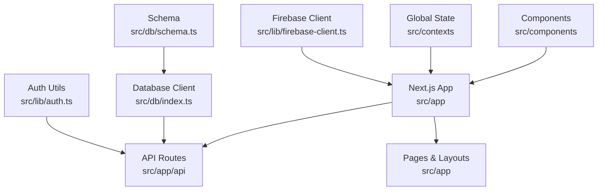
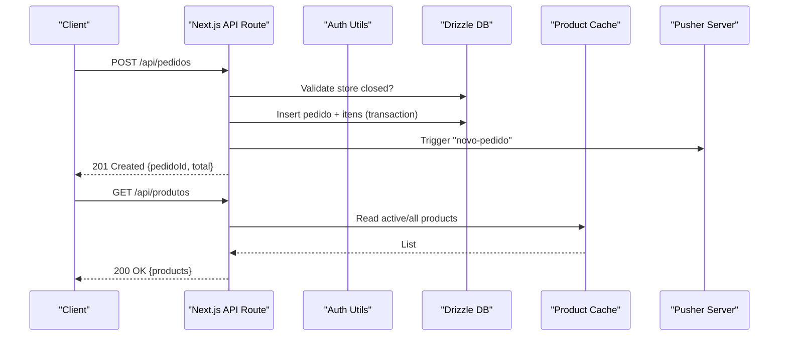
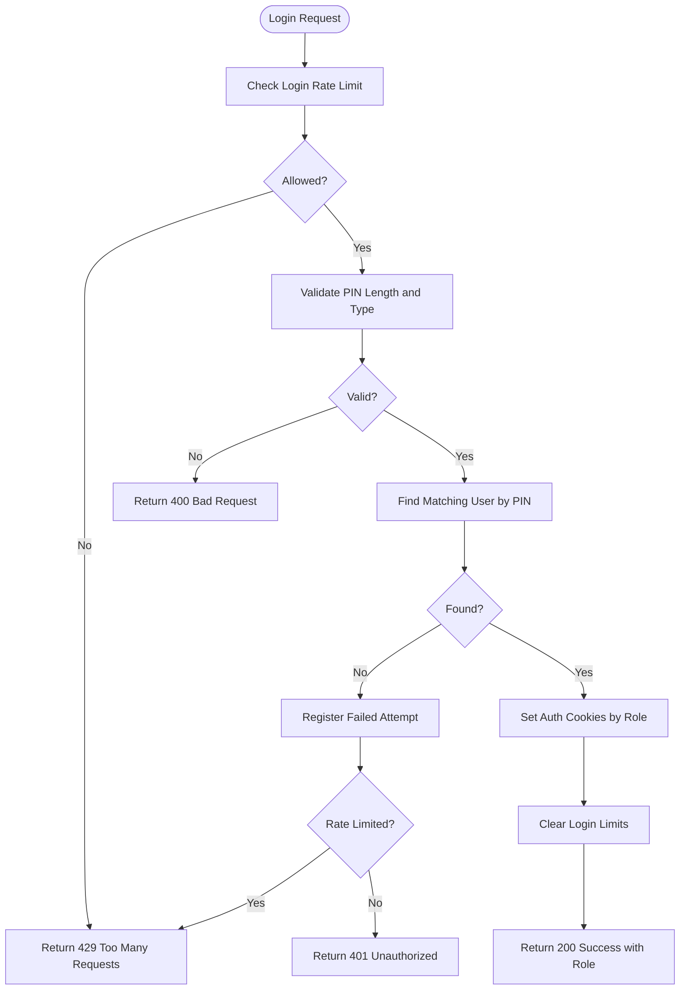
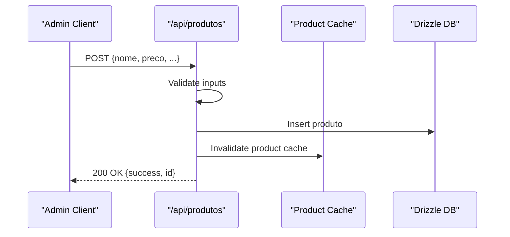
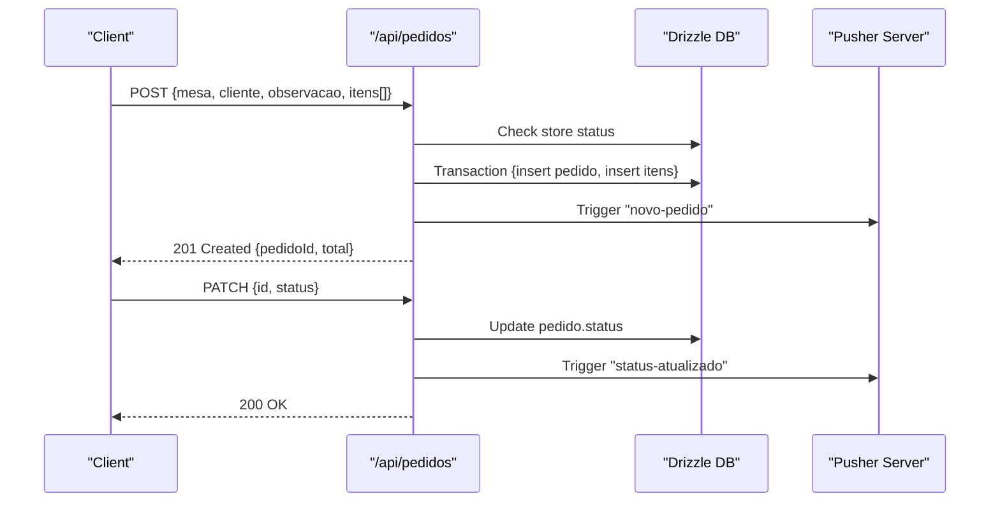
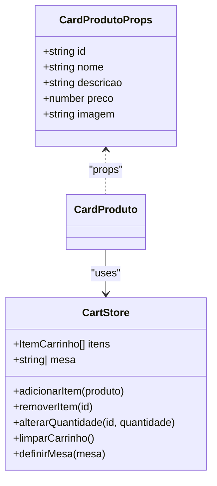
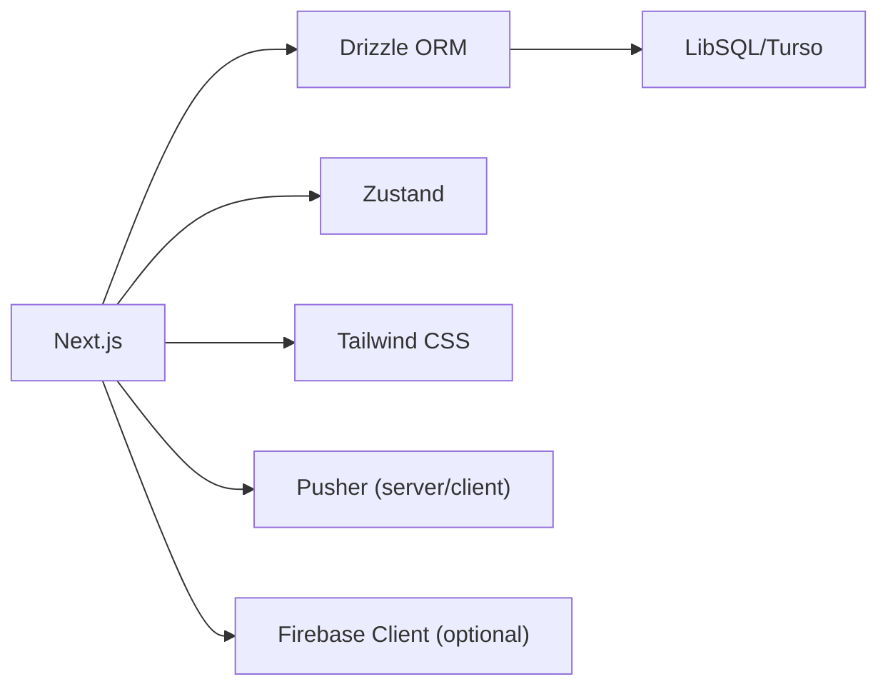

# Development Guidelines

<cite>
**Referenced Files in This Document**
- [package.json](file://package.json)
- [tsconfig.json](file://tsconfig.json)
- [eslint.config.mjs](file://eslint.config.mjs)
- [next.config.ts](file://next.config.ts)
- [drizzle.config.ts](file://drizzle.config.ts)
- [src/app/layout.tsx](file://src/app/layout.tsx)
- [src/db/schema.ts](file://src/db/schema.ts)
- [src/db/index.ts](file://src/db/index.ts)
- [src/lib/auth.ts](file://src/lib/auth.ts)
- [src/lib/firebase-client.ts](file://src/lib/firebase-client.ts)
- [src/components/CardProduto.tsx](file://src/components/CardProduto.tsx)
- [src/contexts/cartStore.ts](file://src/contexts/cartStore.ts)
- [src/app/api/produtos/route.ts](file://src/app/api/produtos/route.ts)
- [src/app/api/auth/login/route.ts](file://src/app/api/auth/login/route.ts)
- [src/app/api/pedidos/route.ts](file://src/app/api/pedidos/route.ts)
</cite>

## Table of Contents
1. Introduction
2. Project Structure
3. Core Components
4. Architecture Overview
5. Detailed Component Analysis
6. Dependency Analysis
7. Performance Considerations
8. Troubleshooting Guide
9. Conclusion
10. Appendices

## Introduction
This document provides comprehensive development guidelines for contributing to the Meu Cardápio project. It covers coding standards, TypeScript configuration, ESLint rules, code formatting, component patterns, API design principles, database query optimization, Git workflow conventions, debugging and profiling techniques, environment setup, accessibility and responsive design requirements, and documentation practices. The goal is to ensure consistency, reliability, and maintainability across the team.

## Project Structure
The project is a Next.js application with:
- App Router pages under src/app
- Server routes under src/app/api
- Shared components under src/components
- Global state via Zustand store under src/contexts
- Database schema and client under src/db
- Utilities and integrations under src/lib

**Diagram sources**
- [src/app/layout.tsx:1-34](file://src/app/layout.tsx#L1-L34)
- [src/app/api/produtos/route.ts:1-53](file://src/app/api/produtos/route.ts#L1-L53)
- [src/app/api/auth/login/route.ts:1-80](file://src/app/api/auth/login/route.ts#L1-L80)
- [src/app/api/pedidos/route.ts:1-253](file://src/app/api/pedidos/route.ts#L1-L253)
- [src/db/index.ts:1-14](file://src/db/index.ts#L1-L14)
- [src/db/schema.ts:1-56](file://src/db/schema.ts#L1-L56)
- [src/lib/auth.ts:1-82](file://src/lib/auth.ts#L1-L82)
- [src/lib/firebase-client.ts:1-26](file://src/lib/firebase-client.ts#L1-L26)

**Section sources**
- [package.json:1-45](file://package.json#L1-L45)
- [next.config.ts:1-14](file://next.config.ts#L1-L14)
- [src/app/layout.tsx:1-34](file://src/app/layout.tsx#L1-L34)

## Core Components
Key building blocks include:
- Authentication utilities for role-based access control and cookie management
- Product listing card component with cart integration
- Persistent cart state using Zustand with persistence middleware
- Database schema definitions for products, orders, order items, settings, users, and login attempts
- Next.js API routes for CRUD operations on products and orders, and authentication flows

Best practices observed:
- Strict TypeScript mode and module resolution configured for bundler compatibility
- Centralized auth helpers to enforce authorization consistently across routes
- Use of Drizzle ORM for type-safe queries and migrations
- Consistent error handling returning structured JSON responses with appropriate HTTP status codes

**Section sources**
- [src/lib/auth.ts:1-82](file://src/lib/auth.ts#L1-L82)
- [src/components/CardProduto.tsx:1-51](file://src/components/CardProduto.tsx#L1-L51)
- [src/contexts/cartStore.ts:1-69](file://src/contexts/cartStore.ts#L1-L69)
- [src/db/schema.ts:1-56](file://src/db/schema.ts#L1-L56)
- [src/app/api/produtos/route.ts:1-53](file://src/app/api/produtos/route.ts#L1-L53)
- [src/app/api/pedidos/route.ts:1-253](file://src/app/api/pedidos/route.ts#L1-L253)
- [src/app/api/auth/login/route.ts:1-80](file://src/app/api/auth/login/route.ts#L1-L80)

## Architecture Overview
High-level architecture emphasizes separation of concerns:
- UI layer (pages and components) consumes APIs and global state
- API routes handle business logic, validation, authorization, and data persistence
- Database layer uses Drizzle ORM with Turso/LibSQL
- Real-time updates via Pusher server triggers after mutations
- Optional Google sign-in via Firebase client

**Diagram sources**
- [src/app/api/pedidos/route.ts:65-190](file://src/app/api/pedidos/route.ts#L65-L190)
- [src/app/api/produtos/route.ts:6-16](file://src/app/api/produtos/route.ts#L6-L16)
- [src/db/index.ts:1-14](file://src/db/index.ts#L1-L14)

## Detailed Component Analysis

### Authentication and Authorization
- Role-based guards return either an object with role or a NextResponse error
- Cookie-based session flags per role with secure options in production
- PIN verification using bcrypt hashing and comparison
- Rate limiting for login attempts integrated into login route

**Diagram sources**
- [src/app/api/auth/login/route.ts:16-80](file://src/app/api/auth/login/route.ts#L16-L80)
- [src/lib/auth.ts:21-82](file://src/lib/auth.ts#L21-L82)

**Section sources**
- [src/lib/auth.ts:1-82](file://src/lib/auth.ts#L1-L82)
- [src/app/api/auth/login/route.ts:1-80](file://src/app/api/auth/login/route.ts#L1-L80)

### Product Management API
- GET returns active products for non-admin roles and all products for admin
- POST validates input, creates product, invalidates cache, and returns success
- Uses Drizzle ORM insert and centralized cache invalidation

**Diagram sources**
- [src/app/api/produtos/route.ts:18-53](file://src/app/api/produtos/route.ts#L18-L53)

**Section sources**
- [src/app/api/produtos/route.ts:1-53](file://src/app/api/produtos/route.ts#L1-L53)

### Order Processing API
- GET supports both authenticated full list and unauthenticated lookup by IDs
- POST validates items, computes totals, ensures store open, persists via transaction, and triggers real-time event
- PATCH updates order status with valid states and emits real-time update
- DELETE removes items and order atomically

**Diagram sources**
- [src/app/api/pedidos/route.ts:65-235](file://src/app/api/pedidos/route.ts#L65-L235)

**Section sources**
- [src/app/api/pedidos/route.ts:1-253](file://src/app/api/pedidos/route.ts#L1-L253)

### UI Component: Product Card
- Displays product image, name, description, formatted price
- Adds item to cart via Zustand store action
- Accessible button with aria-label and lazy-loaded images

**Diagram sources**
- [src/components/CardProduto.tsx:1-51](file://src/components/CardProduto.tsx#L1-L51)
- [src/contexts/cartStore.ts:1-69](file://src/contexts/cartStore.ts#L1-L69)

**Section sources**
- [src/components/CardProduto.tsx:1-51](file://src/components/CardProduto.tsx#L1-L51)
- [src/contexts/cartStore.ts:1-69](file://src/contexts/cartStore.ts#L1-L69)

### Conceptual Overview
Conceptually, the system follows a layered approach:
- Presentation layer renders pages and reusable components
- Service layer encapsulates business logic within API routes
- Data layer manages persistence and caching strategies
- Integration layer handles external services like Pusher and optional Firebase

[No sources needed since this section doesn't analyze specific files]

## Dependency Analysis
Key dependencies and their roles:
- Next.js for framework and routing
- Drizzle ORM for type-safe database interactions
- Turso/LibSQL as the database backend
- Zustand for client-side state management with persistence
- Tailwind CSS for styling
- ESLint and Next’s recommended configs for linting
- Firebase client for optional Google authentication

**Diagram sources**
- [package.json:17-43](file://package.json#L17-L43)
- [drizzle.config.ts:1-14](file://drizzle.config.ts#L1-L14)
- [src/db/index.ts:1-14](file://src/db/index.ts#L1-L14)
- [src/lib/firebase-client.ts:1-26](file://src/lib/firebase-client.ts#L1-L26)

**Section sources**
- [package.json:1-45](file://package.json#L1-L45)
- [drizzle.config.ts:1-14](file://drizzle.config.ts#L1-L14)

## Performance Considerations
- Use Next.js Image optimizations and allowlist remote patterns for Cloudinary and Unsplash
- Prefer reading from cache for product listings; invalidate cache on writes
- Batch database reads where possible and use transactions for multi-step writes
- Avoid unnecessary re-renders by memoizing derived values and splitting components
- Keep payloads small; paginate lists if they grow large
- Profile with Next.js built-in tools and browser performance panels

[No sources needed since this section provides general guidance]

## Troubleshooting Guide
Common issues and resolutions:
- Authentication failures: verify cookies are set correctly and roles match allowed arrays
- Validation errors: ensure request bodies conform to expected types and constraints
- Database errors: check connection URL and auth token; validate schema alignment
- Real-time events: confirm Pusher server trigger calls succeed and clients subscribe to channels
- Rate limiting: inspect retry-after headers and adjust thresholds if necessary

Debugging tips:
- Log structured errors with context (e.g., endpoint, user role, input summary)
- Use Next.js dev logs and network tab to trace request/response cycles
- For DB issues, run drizzle-kit studio to inspect schema and data

**Section sources**
- [src/app/api/auth/login/route.ts:16-80](file://src/app/api/auth/login/route.ts#L16-L80)
- [src/app/api/pedidos/route.ts:192-235](file://src/app/api/pedidos/route.ts#L192-L235)
- [src/app/api/produtos/route.ts:18-53](file://src/app/api/produtos/route.ts#L18-L53)

## Conclusion
Adhering to these guidelines will help maintain code quality, improve collaboration, and ensure robust, scalable functionality for Meu Cardápio. Focus on strict typing, consistent API design, secure authentication, efficient database usage, and clear error handling.

[No sources needed since this section summarizes without analyzing specific files]

## Appendices

### Coding Standards and Tooling
- TypeScript:
  - Enable strict mode and target ES2017
  - Use path aliases for imports
  - Leverage incremental builds
- ESLint:
  - Use Next’s core web vitals and TypeScript configs
  - Ignore generated/build directories
- Formatting:
  - Follow consistent indentation and naming conventions
  - Prefer functional components and hooks
- Lint before committing to catch issues early

**Section sources**
- [tsconfig.json:1-35](file://tsconfig.json#L1-L35)
- [eslint.config.mjs:1-19](file://eslint.config.mjs#L1-L19)

### API Design Principles
- Stateless endpoints with explicit validation
- Consistent error shape and HTTP status codes
- Role-based authorization using shared guards
- Idempotent operations where applicable
- Separate read/write paths and optimize reads with caching

**Section sources**
- [src/app/api/produtos/route.ts:1-53](file://src/app/api/produtos/route.ts#L1-L53)
- [src/app/api/pedidos/route.ts:1-253](file://src/app/api/pedidos/route.ts#L1-L253)
- [src/lib/auth.ts:1-82](file://src/lib/auth.ts#L1-L82)

### Database Query Optimization Techniques
- Use transactions for multi-table writes to ensure consistency
- Filter and select only required fields
- Leverage indexes on frequently queried columns (e.g., ids, status)
- Cache read-heavy endpoints and invalidate on writes
- Monitor slow queries and refactor joins or filters

**Section sources**
- [src/app/api/pedidos/route.ts:147-171](file://src/app/api/pedidos/route.ts#L147-L171)
- [src/db/schema.ts:1-56](file://src/db/schema.ts#L1-L56)
- [src/db/index.ts:1-14](file://src/db/index.ts#L1-L14)

### Git Workflow Conventions
- Branching strategy:
  - main: stable release branch
  - develop: integration branch
  - feature/*: new features
  - fix/*: bug fixes
  - hotfix/*: urgent fixes
- Commit messages:
  - Use conventional commits (feat, fix, chore, docs)
  - Keep commits atomic and descriptive
- Pull requests:
  - Link related issues
  - Include test coverage notes if applicable
  - Require reviews and CI checks

[No sources needed since this section provides general guidance]

### Debugging Techniques and Profiling Tools
- Frontend:
  - React DevTools for component tree and state inspection
  - Network tab for API timing and payloads
  - Performance panel for rendering bottlenecks
- Backend:
  - Next.js logs for server-side errors
  - Drizzle Studio for DB exploration
  - Pusher debug dashboard for real-time events

[No sources needed since this section provides general guidance]

### Accessibility and Responsive Design
- Accessibility:
  - Provide meaningful alt text for images
  - Use semantic HTML elements
  - Ensure keyboard navigation and focus management
  - Add aria attributes where necessary
- Responsive design:
  - Use mobile-first layouts with Tailwind breakpoints
  - Test on multiple screen sizes and devices
  - Optimize images and assets for performance

**Section sources**
- [src/components/CardProduto.tsx:22-49](file://src/components/CardProduto.tsx#L22-L49)
- [src/app/layout.tsx:20-33](file://src/app/layout.tsx#L20-L33)

### Environment Setup and Tooling Recommendations
- Install dependencies and configure environment variables:
  - TURSO_DATABASE_URL and TURSO_AUTH_TOKEN for database
  - NEXT_PUBLIC_FIREBASE_* for optional Google auth
- Run scripts:
  - npm run dev for development
  - npm run build for production build
  - npm run db:setup to initialize and seed database
- Recommended tooling:
  - VS Code with ESLint and Prettier extensions
  - Drizzle Kit CLI for migrations and schema management

**Section sources**
- [package.json:5-16](file://package.json#L5-L16)
- [drizzle.config.ts:1-14](file://drizzle.config.ts#L1-L14)
- [src/lib/firebase-client.ts:6-19](file://src/lib/firebase-client.ts#L6-L19)

### Documentation Updates and Version Management
- Changelog:
  - Maintain a changelog with breaking changes, features, and fixes
  - Reference commit hashes and PR numbers
- Versioning:
  - Follow semantic versioning for releases
  - Tag releases in Git and publish artifacts as needed
- Docs:
  - Update README and inline comments when changing APIs or schemas
  - Keep diagrams current with architecture changes

[No sources needed since this section provides general guidance]