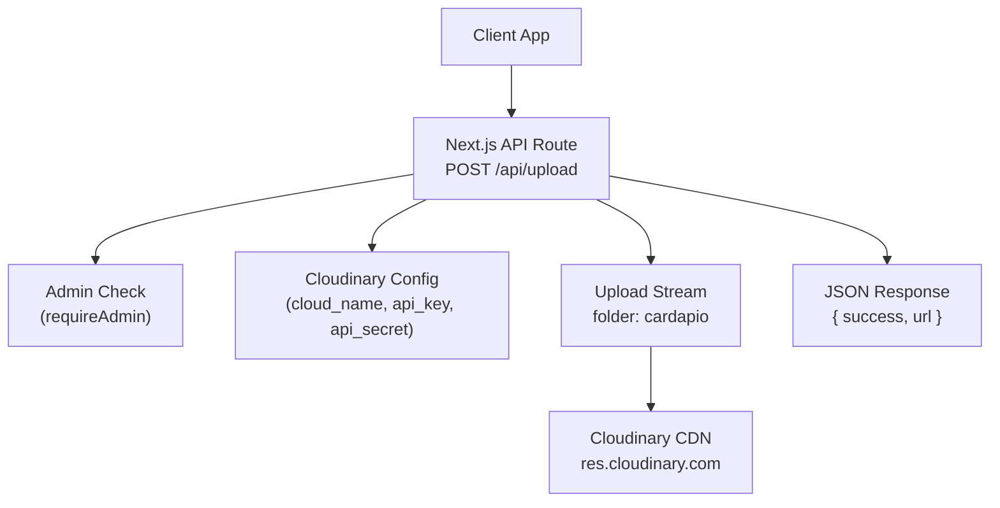
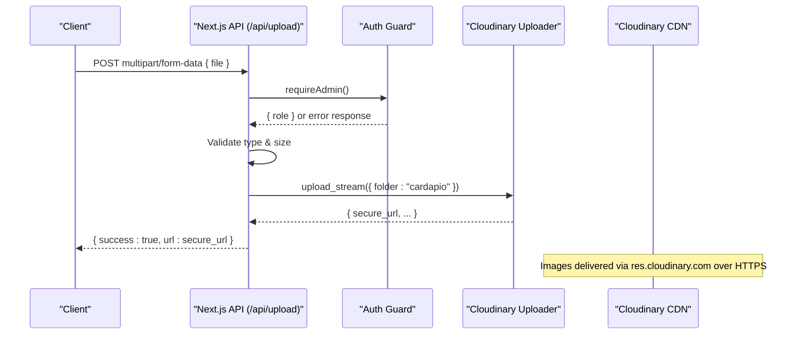
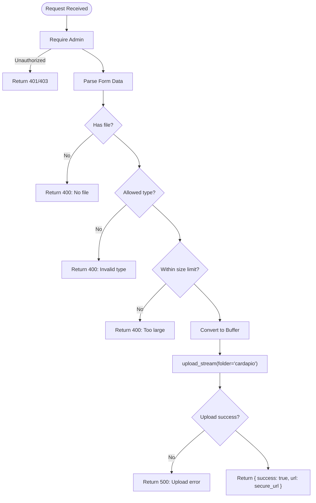
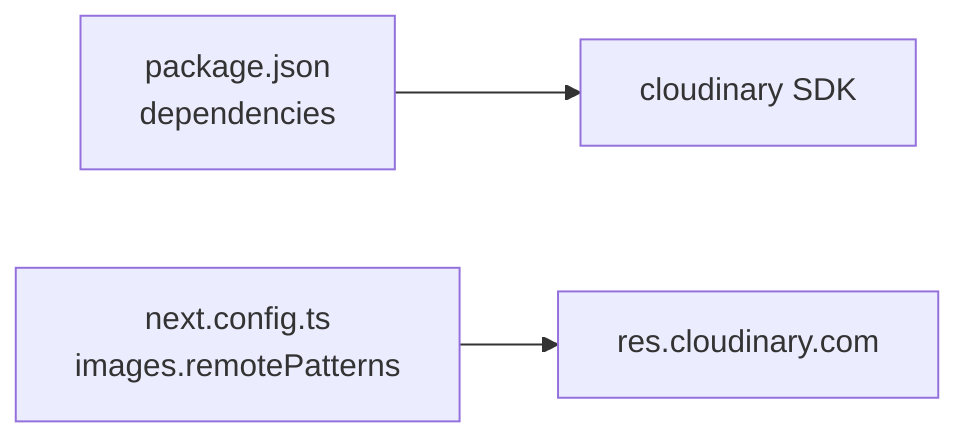

# Cloudinary Integration

<cite>
**Referenced Files in This Document**
- [route.ts](file://src/app/api/upload/route.ts)
- [next.config.ts](file://next.config.ts)
- [package.json](file://package.json)
- [auth.ts](file://src/lib/auth.ts)
</cite>

## Table of Contents
1. [Introduction](#introduction)
2. [Project Structure](#project-structure)
3. [Core Components](#core-components)
4. [Architecture Overview](#architecture-overview)
5. [Detailed Component Analysis](#detailed-component-analysis)
6. [Dependency Analysis](#dependency-analysis)
7. [Performance Considerations](#performance-considerations)
8. [Troubleshooting Guide](#troubleshooting-guide)
9. [Conclusion](#conclusion)

## Introduction
This document explains how the application integrates with Cloudinary for image upload and management. It covers environment configuration, server-side upload via a Next.js API route, folder organization under "cardapio", response structure, and how to deliver images securely through Cloudinary’s CDN. It also includes troubleshooting guidance and best practices for managing assets and optimizing delivery performance.

## Project Structure
The Cloudinary integration is implemented as a protected Next.js API route that:
- Configures Cloudinary using environment variables
- Validates incoming uploads (type and size)
- Streams images into Cloudinary under a dedicated folder
- Returns a secure URL for immediate use

**Diagram sources**
- [route.ts:1-58](file://src/app/api/upload/route.ts#L1-L58)
- [auth.ts:76-78](file://src/lib/auth.ts#L76-L78)
- [next.config.ts:4-10](file://next.config.ts#L4-L10)

**Section sources**
- [route.ts:1-58](file://src/app/api/upload/route.ts#L1-L58)
- [next.config.ts:1-14](file://next.config.ts#L1-L14)

## Core Components
- Environment-based Cloudinary configuration: cloud_name, api_key, api_secret are read from process environment variables at runtime.
- Protected upload endpoint: Only authenticated admins can trigger uploads.
- Upload stream: Uses Cloudinary’s upload_stream to send binary data directly to Cloudinary without persisting files on disk.
- Folder organization: All uploaded images are stored under the "cardapio" folder for clear asset segmentation.
- Secure delivery: The response includes a secure_url pointing to the Cloudinary-hosted image, which is served over HTTPS via the CDN.

Key implementation references:
- Cloudinary configuration and upload flow: [route.ts:5-9](file://src/app/api/upload/route.ts#L5-L9), [route.ts:43-51](file://src/app/api/upload/route.ts#L43-L51)
- Admin-only access control: [route.ts:15-16](file://src/app/api/upload/route.ts#L15-L16), [auth.ts:76-78](file://src/lib/auth.ts#L76-L78)
- Allowed formats and size limits: [route.ts:11-12](file://src/app/api/upload/route.ts#L11-L12), [route.ts:26-38](file://src/app/api/upload/route.ts#L26-L38)
- Response payload: [route.ts:53](file://src/app/api/upload/route.ts#L53)

**Section sources**
- [route.ts:5-9](file://src/app/api/upload/route.ts#L5-L9)
- [route.ts:15-16](file://src/app/api/upload/route.ts#L15-L16)
- [route.ts:26-38](file://src/app/api/upload/route.ts#L26-L38)
- [route.ts:43-51](file://src/app/api/upload/route.ts#L43-L51)
- [route.ts:53](file://src/app/api/upload/route.ts#L53)
- [auth.ts:76-78](file://src/lib/auth.ts#L76-L78)

## Architecture Overview
The end-to-end flow for uploading an image:

**Diagram sources**
- [route.ts:14-57](file://src/app/api/upload/route.ts#L14-L57)
- [auth.ts:76-78](file://src/lib/auth.ts#L76-L78)

## Detailed Component Analysis

### Upload API Route
Responsibilities:
- Configure Cloudinary with environment variables
- Enforce admin-only access
- Validate file type and size
- Stream the file to Cloudinary under the "cardapio" folder
- Return a JSON response containing success status and a secure URL

Processing logic highlights:
- Authentication guard ensures only admins can call the endpoint
- Input validation rejects non-image types and oversized files
- Binary conversion and streaming minimize memory usage
- Error handling returns appropriate HTTP status codes

**Diagram sources**
- [route.ts:14-57](file://src/app/api/upload/route.ts#L14-L57)

**Section sources**
- [route.ts:14-57](file://src/app/api/upload/route.ts#L14-L57)

### Cloudinary Configuration
- The Cloudinary client is configured per request using environment variables:
  - cloud_name
  - api_key
  - api_secret
- These values must be present in the runtime environment for successful authentication.

References:
- Configuration block: [route.ts:5-9](file://src/app/api/upload/route.ts#L5-L9)

**Section sources**
- [route.ts:5-9](file://src/app/api/upload/route.ts#L5-L9)

### Upload Stream and Folder Organization
- The endpoint streams the file directly to Cloudinary using upload_stream.
- All assets are organized under the "cardapio" folder for consistent asset management.
- Streaming avoids writing temporary files to disk and reduces memory overhead.

References:
- Stream creation and options: [route.ts:43-51](file://src/app/api/upload/route.ts#L43-L51)

**Section sources**
- [route.ts:43-51](file://src/app/api/upload/route.ts#L43-L51)

### Image Processing and CDN Delivery
- Uploaded images are served via Cloudinary’s CDN using secure URLs.
- The Next.js configuration allows loading images from the Cloudinary CDN domain.
- While this route does not apply explicit transformations, Cloudinary supports automatic optimization and format conversion when constructing URLs on the client or via additional server-side calls.

References:
- Allowed remote patterns for Next.js images: [next.config.ts:4-10](file://next.config.ts#L4-L10)

**Section sources**
- [next.config.ts:4-10](file://next.config.ts#L4-L10)

### Response Structure
- On success, the endpoint returns a JSON object with:
  - success: boolean indicating upload success
  - url: string containing the secure URL to the uploaded image
- Errors return structured messages with appropriate HTTP status codes.

References:
- Success response: [route.ts:53](file://src/app/api/upload/route.ts#L53)
- Error responses: [route.ts:23-37](file://src/app/api/upload/route.ts#L23-L37), [route.ts:54-57](file://src/app/api/upload/route.ts#L54-L57)

**Section sources**
- [route.ts:23-37](file://src/app/api/upload/route.ts#L23-L37)
- [route.ts:53](file://src/app/api/upload/route.ts#L53)
- [route.ts:54-57](file://src/app/api/upload/route.ts#L54-L57)

## Dependency Analysis
- The Cloudinary SDK is declared as a dependency in the project manifest.
- The Next.js configuration explicitly permits images from the Cloudinary CDN domain.

**Diagram sources**
- [package.json:17-30](file://package.json#L17-L30)
- [next.config.ts:4-10](file://next.config.ts#L4-L10)

**Section sources**
- [package.json:17-30](file://package.json#L17-L30)
- [next.config.ts:4-10](file://next.config.ts#L4-L10)

## Performance Considerations
- Streaming uploads reduce memory usage by avoiding full in-memory buffering beyond the buffer created for the stream.
- Organizing assets under a single folder ("cardapio") simplifies management and enables efficient batch operations.
- Serving images via Cloudinary’s CDN improves global delivery speed and reliability.
- For further optimization, consider applying transformations (e.g., format, quality, dimensions) when generating URLs on the client or via additional server endpoints.

[No sources needed since this section provides general guidance]

## Troubleshooting Guide
Common issues and resolutions:

- Authentication failures
  - Symptom: Upload fails with authentication errors.
  - Cause: Missing or incorrect environment variables (CLOUDINARY_CLOUD_NAME, CLOUDINARY_API_KEY, CLOUDINARY_API_SECRET).
  - Resolution: Ensure all three variables are set correctly in the runtime environment.

- Unauthorized access
  - Symptom: 401/403 responses when calling the upload endpoint.
  - Cause: Caller is not authenticated as admin.
  - Resolution: Authenticate as admin before invoking the endpoint.

- Invalid file type or size
  - Symptom: 400 responses indicating invalid type or too large.
  - Cause: File type not in allowed list or exceeds maximum size.
  - Resolution: Restrict uploads to JPEG, PNG, WEBP, GIF and enforce size limits on the client side.

- Storage quotas or rate limiting
  - Symptom: Uploads fail due to quota exceeded or rate-limited errors.
  - Cause: Account storage limits reached or API rate limits hit.
  - Resolution: Upgrade plan or implement retry/backoff strategies; monitor usage in the Cloudinary dashboard.

- CDN delivery issues
  - Symptom: Images do not load in the browser.
  - Cause: Next.js not allowing the Cloudinary domain or incorrect URL.
  - Resolution: Ensure res.cloudinary.com is included in Next.js images.remotePatterns and verify the returned secure_url.

**Section sources**
- [route.ts:23-37](file://src/app/api/upload/route.ts#L23-L37)
- [route.ts:54-57](file://src/app/api/upload/route.ts#L54-L57)
- [next.config.ts:4-10](file://next.config.ts#L4-L10)

## Conclusion
The application integrates Cloudinary through a secure, admin-only API route that validates inputs, streams images to a dedicated folder, and returns a secure URL for immediate use. With proper environment configuration and Next.js CDN allowances, images are reliably delivered via Cloudinary’s global network. Following the recommended best practices and troubleshooting steps will help maintain robust and performant image workflows.

[No sources needed since this section summarizes without analyzing specific files]